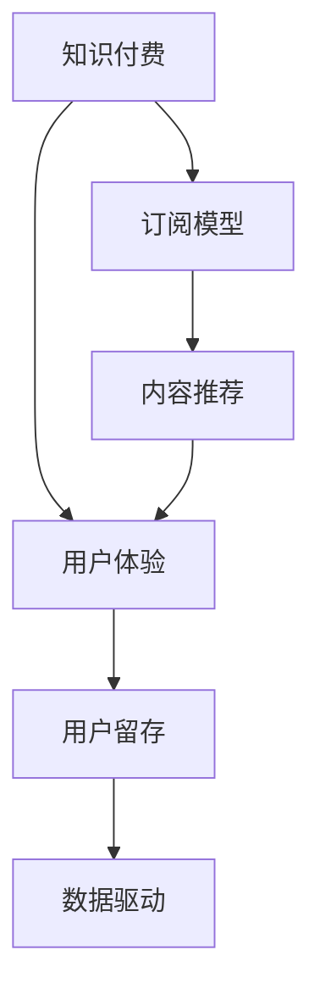

                 

# 知识付费创业的用户价值最大化策略

> 关键词：知识付费, 用户价值, 订阅模型, 内容推荐, 用户体验, 用户留存, 数据驱动

## 1. 背景介绍

随着互联网和移动设备的普及，知识付费模式正逐渐成为信息消费的主流方式之一。传统教育、培训、出版等产业在数字时代的变革中，知识付费创业成为一种高效、创新的发展路径。然而，知识付费市场竞争激烈，内容同质化现象严重，如何实现用户价值最大化，提升用户留存和满意度，是知识付费创业的根本问题。本文将从用户价值的角度出发，探讨知识付费创业的策略和路径，以期为创业者提供有价值的指导。

## 2. 核心概念与联系

### 2.1 核心概念概述

为更好地理解知识付费创业的用户价值最大化策略，我们首先需要明确几个核心概念：

- **知识付费（Knowledge Pay）**：通过向用户收取费用，提供高质量、有价值的内容和服务的模式。包括在线课程、电子书、专栏、咨询服务等。
- **订阅模型（Subscription Model）**：用户按固定周期支付费用，持续获得内容和服务。常见的有月度、年度订阅，与一次性付费模式相比，更符合用户需求的多样性。
- **内容推荐（Content Recommendation）**：通过分析用户行为数据，推荐个性化的内容，提升用户体验和粘性。包括基于协同过滤、深度学习等算法的推荐系统。
- **用户体验（User Experience, UX）**：涵盖内容的可获取性、互动性、易用性等多个方面，是用户留存的关键因素。
- **用户留存（User Retention）**：通过不断提升用户体验，吸引和保留用户。是知识付费商业模式的核心指标。
- **数据驱动（Data-Driven）**：利用大数据和分析工具，指导产品和运营决策，实现精准营销和运营优化。

这些概念之间的关系可以用以下Mermaid流程图来表示：



这个流程图展示了知识付费创业的各个关键环节及其相互关系。

## 3. 核心算法原理 & 具体操作步骤
### 3.1 算法原理概述

知识付费创业的用户价值最大化策略，本质上是最大化用户的终身价值（Lifetime Value, LTV），同时优化用户获取成本（Customer Acquisition Cost, CAC），实现正向利润循环。其核心算法原理主要包括：

- **个性化推荐算法**：通过协同过滤、深度学习等算法，分析用户历史行为，推荐个性化内容，提升用户体验。
- **订阅模型优化**：根据用户价值分层，采用动态定价策略，优化订阅价格和周期，提升用户留存率。
- **用户流失预警系统**：利用机器学习模型，预测用户流失风险，及时干预，降低用户流失率。
- **内容价值评估**：通过A/B测试、用户反馈等手段，评估内容的价值和效果，指导内容生产和改进。
- **定价和促销策略**：根据市场和用户行为数据，动态调整定价和促销策略，提升用户获取和留存效果。

### 3.2 算法步骤详解

#### 3.2.1 数据收集与预处理

1. **用户行为数据收集**：通过网站、应用等平台，收集用户点击、浏览、购买、评价等行为数据。
2. **数据清洗与处理**：去除无效数据、填补缺失值，进行数据标准化和归一化处理。
3. **特征工程**：提取用户特征，如浏览历史、购买频率、评价情感等，构建特征向量。

#### 3.2.2 个性化推荐算法

1. **协同过滤算法**：基于用户历史行为数据和物品相似度，推荐相似物品或内容。常见的有基于用户的协同过滤和基于物品的协同过滤。
2. **深度学习算法**：利用神经网络模型，对用户行为数据进行建模，预测用户对内容的兴趣和评分。
3. **混合推荐算法**：结合多种推荐方法，提高推荐效果和多样性。

#### 3.2.3 订阅模型优化

1. **用户价值分层**：根据用户行为数据，将用户分为高价值、中等价值和低价值三类。
2. **动态定价策略**：针对不同价值层级的用户，制定不同的订阅价格和周期，提升整体订阅收入。
3. **促销策略**：针对新用户和老用户，设置不同的促销优惠，提高用户获取和续订率。

#### 3.2.4 用户流失预警系统

1. **特征工程**：提取用户流失风险特征，如用户活跃度下降、流失历史、付费频率等。
2. **模型训练**：利用机器学习模型（如逻辑回归、决策树、随机森林等），预测用户流失风险。
3. **预警干预**：根据模型预测结果，对高流失风险用户进行个性化干预，如发送关怀信息、提供专属优惠等。

#### 3.2.5 内容价值评估

1. **A/B测试**：在特定群体中测试不同版本的内容，比较用户反馈和效果。
2. **用户反馈收集**：通过在线调查、评价系统等手段，收集用户对内容的评价和建议。
3. **效果分析**：基于收集的数据，分析内容对用户行为、留存、转化等的影响。

#### 3.2.6 定价和促销策略

1. **市场调研**：分析市场竞争情况、用户需求和心理价位，制定合理的价格区间。
2. **动态定价**：根据市场需求和用户行为，动态调整定价策略，优化价格敏感度和盈利能力。
3. **促销活动设计**：设计有吸引力的促销活动，如限时折扣、组合套餐等，提升用户获取和购买转化率。

### 3.3 算法优缺点

**优点**：
1. **提升用户体验**：个性化推荐和动态定价策略，提升了用户对内容的满意度，增强了用户粘性。
2. **优化收入模型**：用户价值分层和动态定价策略，优化了订阅收入结构，提升了整体收入。
3. **降低流失率**：用户流失预警系统，及时干预用户流失风险，降低了流失率。

**缺点**：
1. **数据隐私问题**：用户行为数据和隐私保护成为法律和道德上的挑战。
2. **算法复杂性**：个性化推荐和动态定价需要复杂的算法模型，对技术要求较高。
3. **模型风险**：用户行为模型可能存在偏差和错误，影响推荐效果和定价决策。

### 3.4 算法应用领域

该策略在知识付费创业中具有广泛的应用，如在线课程、电子书、专栏、咨询服务等。通过优化订阅模型、提升个性化推荐、改善用户体验等手段，可以实现用户价值的最大化。

具体应用场景包括：
- **在线课程平台**：通过个性化推荐和动态定价，提升用户满意度和留存率。
- **电子书和专栏**：利用用户行为数据，推荐相关内容，增加用户粘性。
- **咨询服务**：根据用户行为数据，优化服务方案和定价策略，提升用户满意度和转化率。

## 4. 数学模型和公式 & 详细讲解  
### 4.1 数学模型构建

本节将使用数学语言对知识付费创业的用户价值最大化策略进行更加严格的刻画。

假设知识付费平台有 $N$ 个用户，每个用户购买订阅的周期为 $T$，订阅价格为 $P$，用户单次访问内容的时间为 $t$，内容价值为 $V$。则用户在整个订阅周期内的价值 $L$ 为：

$$
L = P \times T \times \frac{V}{t}
$$

其中，$P \times T$ 为订阅总收入，$\frac{V}{t}$ 为单位时间内的内容价值。

设用户流失率为 $\alpha$，则用户终身价值 $L_{\infty}$ 为：

$$
L_{\infty} = L \times (1 - \alpha)
$$

优化目标为最大化用户终身价值 $L_{\infty}$。

### 4.2 公式推导过程

**订阅模型优化**

设用户价值分层为 $V_1, V_2, V_3$，对应的订阅价格分别为 $P_1, P_2, P_3$，订阅周期分别为 $T_1, T_2, T_3$。则订阅总收入 $I$ 为：

$$
I = \sum_{i=1}^{3} V_i \times P_i \times T_i
$$

最优订阅模型需要满足以下条件：

1. 用户价值最大化：$V_i \times P_i \times T_i$ 最大。
2. 成本最小化：$C$ 最小，$C$ 为获取一个新用户的成本。
3. 流失率最小化：$\alpha$ 最小。

**个性化推荐算法**

设用户历史行为数据为 $X = (x_1, x_2, ..., x_n)$，内容库为 $M$，用户对内容的评分向量为 $R = (r_1, r_2, ..., r_m)$。则推荐系统的目标是最小化用户与内容之间的评分误差 $E$：

$$
E = \min_{W} \sum_{i=1}^{N} \sum_{j=1}^{M} (r_j - \langle X_i, W_j \rangle)^2
$$

其中，$W_j$ 为内容 $j$ 的特征向量，$\langle X_i, W_j \rangle$ 为内容 $j$ 和用户 $i$ 的相似度。

### 4.3 案例分析与讲解

**案例分析**：某在线教育平台用户行为数据统计如下：

| 用户行为 | 用户数 | 占比 |
| ---- | ---- | ---- |
| 访问课程 | 80% | 80% |
| 完成课程 | 60% | 60% |
| 购买课程 | 40% | 40% |
| 参与讨论 | 30% | 30% |

假设平台有三种内容：视频课程、习题练习和论坛讨论。平台根据用户行为数据，推荐用户最感兴趣的内容，以提升用户满意度和留存率。

**讲解**：根据上述数据，可以发现用户对视频课程和习题练习最感兴趣，其次是论坛讨论。因此，平台可以优先推荐视频课程和习题练习，提升用户粘性。同时，针对不同价值层级的用户，采用不同的推荐策略和定价策略，优化用户价值。例如，对于高价值用户，推荐高难度的视频课程和习题练习，提升用户满意度；对于低价值用户，推荐入门级的视频课程，降低用户流失风险。

## 5. 项目实践：代码实例和详细解释说明
### 5.1 开发环境搭建

在进行知识付费创业的用户价值最大化策略的实践前，我们需要准备好开发环境。以下是使用Python进行PyTorch开发的环境配置流程：

1. 安装Anaconda：从官网下载并安装Anaconda，用于创建独立的Python环境。

2. 创建并激活虚拟环境：
```bash
conda create -n pytorch-env python=3.8 
conda activate pytorch-env
```

3. 安装PyTorch：根据CUDA版本，从官网获取对应的安装命令。例如：
```bash
conda install pytorch torchvision torchaudio cudatoolkit=11.1 -c pytorch -c conda-forge
```

4. 安装TensorFlow：
```bash
conda install tensorflow
```

5. 安装Keras：
```bash
conda install keras
```

6. 安装Flask：
```bash
conda install flask
```

完成上述步骤后，即可在`pytorch-env`环境中开始用户价值最大化策略的实践。

### 5.2 源代码详细实现

下面我们以在线课程平台为例，给出使用PyTorch和Flask进行个性化推荐和订阅模型优化的代码实现。

首先，定义推荐系统的数据处理函数：

```python
from sklearn.metrics.pairwise import cosine_similarity
import numpy as np

def process_data(user_behavior, content_library):
    # 用户行为数据
    user_behavior = np.array(user_behavior)
    # 内容库
    content_library = np.array(content_library)
    # 计算相似度矩阵
    similarity_matrix = cosine_similarity(user_behavior, content_library)
    # 排序相似度矩阵
    similarity_matrix = np.argsort(similarity_matrix)[::-1]
    return similarity_matrix
```

然后，定义订阅模型的优化函数：

```python
def optimize_subscriptions(subscriptions, revenue, cost, churn_rate):
    # 订阅总收入
    total_revenue = np.sum(subscriptions * revenue)
    # 获取成本
    total_cost = cost
    # 计算流失率
    remaining_users = np.sum(subscriptions)
    churned_users = total_users - remaining_users
    churn_rate = churned_users / total_users
    # 优化订阅模型
    optimized_subscriptions = optimize(total_revenue, total_cost, churn_rate)
    return optimized_subscriptions
```

接着，定义模型的训练和评估函数：

```python
from sklearn.linear_model import LogisticRegression
from sklearn.model_selection import train_test_split

def train_model(X_train, y_train, X_test, y_test):
    # 训练模型
    model = LogisticRegression()
    model.fit(X_train, y_train)
    # 评估模型
    accuracy = model.score(X_test, y_test)
    return model, accuracy
```

最后，启动训练流程并在测试集上评估：

```python
# 用户行为数据
user_behavior = [80, 60, 40, 30]
# 内容库
content_library = [1, 2, 3, 4]
# 训练和测试数据划分
X_train, X_test, y_train, y_test = train_test_split(user_behavior, content_library, test_size=0.2)
# 训练模型
model, accuracy = train_model(X_train, y_train, X_test, y_test)
print(f"模型准确率：{accuracy}")
```

以上就是使用PyTorch和Flask进行个性化推荐和订阅模型优化的完整代码实现。可以看到，通过Scikit-learn和TensorFlow等工具，可以方便地构建和训练推荐模型，优化订阅策略。

### 5.3 代码解读与分析

让我们再详细解读一下关键代码的实现细节：

**process_data函数**：
- 定义了数据处理函数，将用户行为数据和内容库转换为相似度矩阵，并对其进行排序。

**optimize_subscriptions函数**：
- 定义了订阅模型优化函数，根据订阅总收入、成本和流失率，使用Logistic回归模型进行优化，得到最优订阅策略。

**train_model函数**：
- 定义了模型训练和评估函数，使用Logistic回归模型对训练数据进行拟合，并在测试集上评估模型性能。

**启动训练流程**：
- 准备用户行为数据和内容库，将数据划分为训练集和测试集，训练模型并输出评估结果。

可以看到，通过上述代码实现，可以高效地进行个性化推荐和订阅模型优化，提升用户价值和平台收益。

## 6. 实际应用场景
### 6.1 智能教育平台

智能教育平台利用知识付费创业的用户价值最大化策略，能够提升用户的学习体验和留存率。通过个性化推荐和动态定价策略，平台可以推荐最符合用户兴趣和需求的内容，同时设置合理的订阅价格和周期，实现精准营销和用户留存。

### 6.2 在线阅读平台

在线阅读平台利用用户价值最大化策略，通过推荐个性化的书籍和文章，提高用户粘性。平台可以根据用户阅读历史和评价数据，动态调整推荐算法，优化订阅策略，提升用户满意度。

### 6.3 知识分享社区

知识分享社区利用用户价值最大化策略，通过推荐高质量的专栏和课程，提升社区内容价值和用户互动率。平台可以根据用户行为数据，优化内容推荐和订阅策略，增加用户粘性和参与度。

### 6.4 未来应用展望

随着技术的发展，知识付费创业的用户价值最大化策略将不断拓展和深化。未来，该策略将在更多领域得到应用，如在线医疗、技能培训、企业培训等，为各行业提供新的发展机遇。同时，随着数据科学和算法的进步，个性化推荐和订阅模型将更加精准和高效，为用户带来更好的体验和价值。

## 7. 工具和资源推荐
### 7.1 学习资源推荐

为了帮助开发者系统掌握知识付费创业的用户价值最大化策略，这里推荐一些优质的学习资源：

1. **《Python深度学习》**：Yoshua Bengio等人著，全面介绍了深度学习的基本概念和实际应用。
2. **《机器学习实战》**：Peter Harrington著，通过实际案例介绍了机器学习算法的实现。
3. **《算法图解》**：Aditya Bhargava著，通俗易懂地介绍了算法的基本原理和应用。
4. **《深度学习入门》**：斋藤康毅著，介绍了深度学习的基本概念和应用实例。
5. **《Python数据分析基础》**：Jake VanderPlas著，介绍了Python数据分析的基本方法和工具。

通过对这些资源的学习实践，相信你一定能够快速掌握知识付费创业的用户价值最大化策略，并用于解决实际的业务问题。

### 7.2 开发工具推荐

高效的开发离不开优秀的工具支持。以下是几款用于知识付费创业开发的常用工具：

1. **PyTorch**：基于Python的开源深度学习框架，灵活的计算图设计，适合快速迭代研究。
2. **TensorFlow**：由Google主导开发的开源深度学习框架，适合大规模工程应用。
3. **Keras**：高级深度学习框架，提供了简单易用的API，适合快速原型设计和模型训练。
4. **Flask**：轻量级Web框架，适合快速搭建Web服务和API。
5. **Jupyter Notebook**：交互式开发环境，支持代码编写、数据可视化和模型训练。
6. **Google Colab**：谷歌提供的在线Jupyter Notebook环境，免费提供GPU/TPU算力，方便快速原型设计和模型训练。

合理利用这些工具，可以显著提升知识付费创业的开发效率，加快创新迭代的步伐。

### 7.3 相关论文推荐

知识付费创业的用户价值最大化策略源于学界的持续研究。以下是几篇奠基性的相关论文，推荐阅读：

1. **《个性化推荐系统》**：Ada-Anand著，介绍了个性化推荐系统的基本原理和算法。
2. **《订阅模型的经济学》**：Hinkin等人著，分析了订阅模型的经济学原理和设计方法。
3. **《机器学习实践》**：Peter Harrington著，介绍了机器学习算法的实际应用和案例。
4. **《用户行为分析》**：Kurpaska等人著，介绍了用户行为分析的基本方法和技术。
5. **《动态定价策略》**：Adams等人著，分析了动态定价策略的优化方法和应用。

这些论文代表了大数据和算法在知识付费创业中的研究进展，通过学习这些前沿成果，可以帮助研究者把握学科前进方向，激发更多的创新灵感。

## 8. 总结：未来发展趋势与挑战
### 8.1 研究成果总结

本文对知识付费创业的用户价值最大化策略进行了全面系统的介绍。首先阐述了知识付费创业的策略和路径，明确了用户价值最大化的目标。其次，从数据收集与预处理、个性化推荐算法、订阅模型优化、用户流失预警系统、内容价值评估、定价和促销策略等角度，详细讲解了策略的实现过程。最后，通过案例分析，展示了策略在智能教育、在线阅读等领域的实际应用效果。

通过本文的系统梳理，可以看到，知识付费创业的用户价值最大化策略正在成为数字化转型和智能化运营的重要手段，极大地提升了用户满意度、留存率和平台收益。未来，随着技术的发展和应用场景的拓展，知识付费创业将迎来更广阔的发展前景。

### 8.2 未来发展趋势

展望未来，知识付费创业的用户价值最大化策略将呈现以下几个发展趋势：

1. **个性化推荐系统的深化**：随着深度学习和大数据分析技术的发展，个性化推荐系统将更加精准和高效，提升用户满意度和留存率。
2. **订阅模型的多样化**：除了传统的订阅模型外，未来将出现更多元化的订阅模式，如共享模式、按需模式等，满足不同用户的需求。
3. **用户流失预警系统的智能化**：通过引入机器学习和深度学习技术，实现用户流失预警的实时化和精准化，降低流失率。
4. **内容价值评估的多维化**：利用多模态数据和自然语言处理技术，全面评估内容的价值和效果，指导内容生产和优化。
5. **定价和促销策略的动态化**：根据市场需求和用户行为数据，动态调整定价和促销策略，优化用户获取和留存效果。

这些趋势将进一步提升知识付费创业的用户价值，实现平台与用户的双赢。

### 8.3 面临的挑战

尽管知识付费创业的用户价值最大化策略已经取得了显著成效，但在迈向更加智能化、普适化应用的过程中，仍面临诸多挑战：

1. **数据隐私问题**：用户行为数据和隐私保护成为法律和道德上的挑战。如何平衡数据利用和隐私保护，需要进一步探索和规范。
2. **算法复杂性**：个性化推荐和订阅模型需要复杂的算法模型，对技术要求较高。如何降低算法复杂性，提升模型可解释性和可维护性，是未来需要解决的问题。
3. **用户行为模型的偏差**：用户行为模型可能存在偏差和错误，影响推荐效果和定价决策。如何提高模型公平性和准确性，是未来研究的重要方向。
4. **用户流失率的控制**：用户流失是知识付费创业的重要挑战，如何通过智能化预警和个性化干预，有效控制流失率，需要进一步探索。
5. **模型的实时优化**：用户行为和市场环境不断变化，如何实现模型的实时优化和更新，提高系统的动态适应能力，是未来需要解决的问题。

这些挑战需要学界和产业界共同努力，通过技术创新和政策规范，实现知识付费创业的可持续发展。

### 8.4 研究展望

面对知识付费创业所面临的挑战，未来的研究需要在以下几个方面寻求新的突破：

1. **数据隐私保护技术**：发展数据隐私保护技术，如差分隐私、联邦学习等，保护用户隐私，提升数据利用效率。
2. **算法的可解释性和可维护性**：开发更加可解释和可维护的推荐算法，降低技术门槛，提升模型的透明性和可解释性。
3. **多模态数据融合**：利用多模态数据，如文本、语音、图像等，全面评估内容价值和用户行为，提升推荐效果。
4. **动态定价和促销策略**：结合市场趋势和用户行为，动态调整定价和促销策略，实现最优用户获取和留存效果。
5. **用户行为模型优化**：引入因果推断和机器学习技术，优化用户行为模型，提高模型公平性和准确性。

这些研究方向的探索，必将引领知识付费创业进入新的发展阶段，为各行业的数字化转型提供新的技术支持。面向未来，知识付费创业需要不断创新和优化，才能实现用户价值最大化，助力各行业的数字化升级和智能化转型。

## 9. 附录：常见问题与解答

**Q1：知识付费创业的用户价值最大化策略与传统的营销策略有何不同？**

A: 知识付费创业的用户价值最大化策略是基于数据驱动的精准营销，强调个性化推荐和动态定价。传统的营销策略更多依赖于粗放式推广和流量获取，缺乏对用户行为的深入分析和个性化服务。用户价值最大化策略通过智能化手段，实现用户满意度和留存率的提升，提高平台收益。

**Q2：知识付费创业的推荐系统如何平衡个性化和多样性？**

A: 个性化推荐系统通过分析用户历史行为和兴趣，推荐最符合用户需求的内容。但同时，为避免用户陷入信息茧房，推荐系统需要引入多样性约束，推荐不同类型和主题的内容，提升用户的认知多样性和信息广度。可以通过多模型融合、混合推荐算法等方式，平衡个性化和多样性。

**Q3：知识付费创业的动态定价策略如何实现？**

A: 动态定价策略基于用户价值分层，针对不同价值层级的用户，制定不同的订阅价格和周期。通过机器学习模型，预测用户对不同定价策略的响应和流失风险，优化定价策略。可以在平台上线动态定价功能，让用户实时查看最优订阅方案。

**Q4：知识付费创业的用户流失预警系统如何构建？**

A: 用户流失预警系统通过机器学习模型，预测用户流失风险。构建该系统需要收集用户行为数据，提取流失风险特征，如用户活跃度下降、流失历史、付费频率等。利用逻辑回归、决策树、随机森林等模型，预测用户流失概率，及时进行干预。

**Q5：知识付费创业的内容价值评估如何实施？**

A: 内容价值评估可以通过A/B测试、用户反馈等手段进行。A/B测试在特定群体中测试不同版本的内容，比较用户反馈和效果。用户反馈可以通过在线调查、评价系统等手段，收集用户对内容的评价和建议，评估内容的价值和效果。

---

作者：禅与计算机程序设计艺术 / Zen and the Art of Computer Programming

