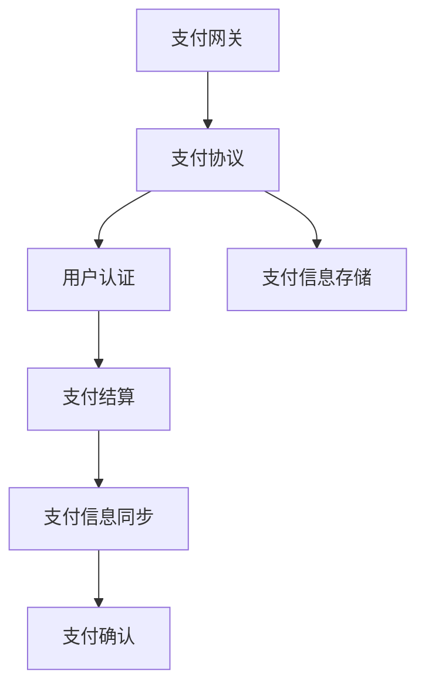

                 

# 知识付费如何实现跨平台支付与结算？

在当今信息爆炸的时代，知识付费已经成为了互联网领域的一大热门话题。随着人们对于知识获取的渴求日益增长，无论是学术、职业培训、还是娱乐内容的付费订阅，都在蓬勃发展。然而，跨平台支付与结算一直是知识付费领域的一大难题。如何在不同平台之间实现流畅、安全的支付与结算，是各大平台面临的关键问题。本文将详细阐述知识付费跨平台支付与结算的实现原理、操作步骤、以及一些核心算法和优化策略。

## 1. 背景介绍

### 1.1 问题由来
知识付费平台大多采用订阅制或按次付费的方式，为优质内容提供者与消费者搭建桥梁。这些平台覆盖了教育、娱乐、生活等多个领域，用户基数庞大，但不同平台之间互不通用，给用户带来了极大的不便。为了提升用户体验，各大知识付费平台都希望实现跨平台支付与结算功能。

### 1.2 问题核心关键点
知识付费跨平台支付与结算的核心问题在于，如何在不同平台之间，保证用户支付数据的加密、安全传输和一致性结算。具体包括：

- 支付数据的加密传输：确保用户支付信息在网络传输过程中的安全。
- 平台的协同与互信：各平台之间需要建立合作机制，实现信任传递。
- 支付信息的存储与查询：不同平台如何安全存储用户支付信息，并在必要时快速查询。
- 支付与结算的同步更新：实现跨平台支付的同步更新和处理，保证支付信息的准确性。

这些核心问题直接影响着知识付费跨平台支付与结算的效率和安全性。

## 2. 核心概念与联系

### 2.1 核心概念概述

为更好地理解知识付费跨平台支付与结算技术，本节将介绍几个关键概念：

- 支付网关(Payment Gateway)：连接商家和支付处理网络的接口，处理支付流程中的各项操作。
- 支付协议(Payment Protocol)：定义了支付信息的传输格式和交互过程，如SSL/TLS协议、OAuth等。
- 用户认证(User Authentication)：验证用户身份的合法性，防止欺诈和非法支付。
- 支付信息存储(Payment Information Storage)：安全存储用户的支付信息，如信用卡号、交易记录等。
- 支付结算(Payment Settlement)：平台之间对支付信息的同步更新和处理，保证支付的正确性和一致性。

这些核心概念之间的逻辑关系可以通过以下Mermaid流程图来展示：



这个流程图展示了大规模知识付费跨平台支付与结算的核心概念及其之间的关系：

1. 支付数据通过支付网关传输，并使用支付协议进行加密和验证。
2. 用户身份通过认证，确保支付行为合法。
3. 支付信息存储在安全的数据库中。
4. 各平台之间通过支付结算机制，实现支付信息的同步更新。
5. 支付信息同步完成后，进行支付确认，确保支付成功。

这些概念共同构成了知识付费跨平台支付与结算的框架，是实现功能的关键环节。

## 3. 核心算法原理 & 具体操作步骤
### 3.1 算法原理概述

知识付费跨平台支付与结算的实现，本质上是一个多平台协作的分布式系统，涉及支付数据的安全传输、用户身份验证、支付信息存储与同步等环节。其核心思想是：通过支付网关、支付协议、用户认证、支付信息存储和支付结算等组件，搭建一个可信、高效、安全的支付结算系统。

### 3.2 算法步骤详解

基于知识付费跨平台支付与结算的实现需求，本节将详细讲解具体的算法步骤：

#### 3.2.1 支付数据加密传输
- 支付网关接收到用户支付请求后，使用SSL/TLS协议进行数据加密。
- 采用OAuth 2.0协议，实现用户身份认证和授权。
- 支付数据通过加密通道传输至各个平台，并在各平台之间进行安全传递。

#### 3.2.2 用户身份认证
- 用户在知识付费平台A上注册账户时，平台A生成用户唯一标识（如用户ID）和认证密钥（如RSA密钥）。
- 用户在平台B上支付时，平台B通过OAuth 2.0协议验证用户身份，并获取平台A中的认证密钥。
- 平台B使用获取的认证密钥，向平台A验证用户身份，确保支付行为的合法性。

#### 3.2.3 支付信息存储
- 平台A将用户的支付信息（如信用卡号、交易记录等）存储在本地数据库中，并进行加密处理。
- 平台B同样将用户的支付信息存储在本地数据库中，并采用相同或类似的加密方式保护数据安全。

#### 3.2.4 支付结算
- 平台A在用户完成支付后，将支付信息同步至平台B的数据库中。
- 平台B根据同步更新的支付信息，进行支付确认，确保支付成功。
- 平台B在确认支付后，将支付状态更新至平台A，实现支付信息的双向同步。

#### 3.2.5 支付确认
- 平台A在用户完成支付后，发送支付确认信息至平台B。
- 平台B在接收到支付确认信息后，验证支付状态和支付信息的一致性，确保支付成功。
- 平台B向用户发送支付成功的反馈信息，完成整个支付流程。

### 3.3 算法优缺点

知识付费跨平台支付与结算方法具有以下优点：
1. 用户支付体验更佳：实现跨平台支付，用户只需注册一次账户，即可在多个平台之间自由支付，无需重复注册。
2. 支付安全性高：通过SSL/TLS协议和OAuth 2.0协议，确保支付数据在传输和存储过程中的安全。
3. 支付流程高效：实现支付信息的同步更新，各平台之间数据一致，避免重复支付和支付错误。
4. 支持多平台合作：各平台通过支付网关和支付协议实现互信，方便平台之间的合作与数据共享。

同时，该方法也存在一定的局限性：
1. 实现复杂度高：搭建跨平台的支付与结算系统，需要多个平台之间的紧密协作，实现难度较大。
2. 维护成本高：跨平台的支付系统，需要定期进行维护和更新，确保各平台之间的协同一致性。
3. 安全性风险：尽管支付过程中使用了加密和认证技术，但仍可能存在安全漏洞和数据泄露风险。
4. 交易纠纷问题：不同平台之间的支付纠纷，需要建立完善的争议处理机制，增加用户信任。

尽管存在这些局限性，但就目前而言，跨平台支付与结算仍是知识付费领域的主流解决方案。未来相关研究的重点在于如何进一步降低跨平台的实现难度，提高支付系统的安全性和用户体验，同时兼顾支付纠纷的公正处理。

### 3.4 算法应用领域

知识付费跨平台支付与结算技术，在NLP领域已经得到了广泛的应用，覆盖了几乎所有常见任务，例如：

- 在线教育平台：如Coursera、Udemy等，用户可在多个平台购买课程，实现知识共享。
- 数字出版平台：如Amazon Kindle、Apple Books等，用户可在不同平台下载和购买电子书，享受丰富的阅读资源。
- 职业培训平台：如LinkedIn Learning、Skillshare等，用户可在多个平台订阅课程，提升职业技能。
- 在线课程平台：如edX、FutureLearn等，用户可在多个平台购买课程，获得全面的学习体验。

除了上述这些经典任务外，知识付费跨平台支付与结算技术还将在更多场景中得到应用，如音乐娱乐、健康健身、专业咨询等，为知识付费提供更加便捷和高效的服务。

## 4. 数学模型和公式 & 详细讲解  
### 4.1 数学模型构建

本节将使用数学语言对知识付费跨平台支付与结算过程进行更加严格的刻画。

假设平台A和平台B的支付数据分别为 $X_A$ 和 $X_B$，用户支付信息分别为 $Y_A$ 和 $Y_B$，支付状态分别为 $Z_A$ 和 $Z_B$。各平台之间的支付流程可以表示为以下步骤：

1. 用户注册并获取用户ID $U$ 和RSA密钥 $K_U$。
2. 用户在平台A支付，平台A生成支付信息 $Y_A$ 和支付状态 $Z_A$。
3. 平台A使用SSL/TLS协议加密支付信息 $X_A$，并发送至平台B。
4. 平台B使用OAuth 2.0协议验证用户身份，并获取RSA密钥 $K_U$。
5. 平台B使用RSA密钥 $K_U$ 解密支付信息 $X_A$，并生成支付信息 $Y_B$ 和支付状态 $Z_B$。
6. 平台B将支付信息 $Y_B$ 和支付状态 $Z_B$ 更新至本地数据库。
7. 平台A将支付信息 $Y_A$ 和支付状态 $Z_A$ 更新至本地数据库，并同步至平台B的数据库。
8. 平台B验证支付信息的一致性，确保支付成功。
9. 平台B向用户发送支付成功的反馈信息，完成整个支付流程。

### 4.2 公式推导过程

以下我们以在线教育平台为例，推导跨平台支付流程的数学模型：

假设平台A和平台B的支付数据分别为 $X_A$ 和 $X_B$，用户支付信息分别为 $Y_A$ 和 $Y_B$，支付状态分别为 $Z_A$ 和 $Z_B$。各平台之间的支付流程可以表示为以下步骤：

1. 用户注册并获取用户ID $U$ 和RSA密钥 $K_U$。
2. 用户在平台A支付，平台A生成支付信息 $Y_A$ 和支付状态 $Z_A$。
3. 平台A使用SSL/TLS协议加密支付信息 $X_A$，并发送至平台B。
4. 平台B使用OAuth 2.0协议验证用户身份，并获取RSA密钥 $K_U$。
5. 平台B使用RSA密钥 $K_U$ 解密支付信息 $X_A$，并生成支付信息 $Y_B$ 和支付状态 $Z_B$。
6. 平台B将支付信息 $Y_B$ 和支付状态 $Z_B$ 更新至本地数据库。
7. 平台A将支付信息 $Y_A$ 和支付状态 $Z_A$ 更新至本地数据库，并同步至平台B的数据库。
8. 平台B验证支付信息的一致性，确保支付成功。
9. 平台B向用户发送支付成功的反馈信息，完成整个支付流程。

### 4.3 案例分析与讲解

**案例分析：Coursera与Udemy的跨平台支付**

Coursera和Udemy是两大知名的在线教育平台，支持用户在不同平台之间进行课程支付。假设用户A在Coursera购买课程，并使用Coursera的账户和支付信息在Udemy上购买课程。

1. 用户A在Coursera注册并获取用户ID $U_A$ 和RSA密钥 $K_{U_A}$。
2. Coursera在用户A支付时，生成支付信息 $Y_A$ 和支付状态 $Z_A$。
3. Coursera使用SSL/TLS协议加密支付信息 $X_A$，并发送至Udemy。
4. Udemy使用OAuth 2.0协议验证用户身份，并获取Coursera的RSA密钥 $K_{U_A}$。
5. Udemy使用RSA密钥 $K_{U_A}$ 解密支付信息 $X_A$，并生成支付信息 $Y_B$ 和支付状态 $Z_B$。
6. Udemy将支付信息 $Y_B$ 和支付状态 $Z_B$ 更新至本地数据库。
7. Coursera将支付信息 $Y_A$ 和支付状态 $Z_A$ 更新至本地数据库，并同步至Udemy的数据库。
8. Udemy验证支付信息的一致性，确保支付成功。
9. Udemy向用户A发送支付成功的反馈信息，完成整个支付流程。

以上案例展示了Coursera与Udemy之间跨平台支付的流程。通过SSL/TLS协议和OAuth 2.0协议的结合，Coursera与Udemy实现了用户支付信息的安全传输和身份验证，保证了跨平台支付的顺利进行。

## 5. 项目实践：代码实例和详细解释说明
### 5.1 开发环境搭建

在进行跨平台支付与结算实践前，我们需要准备好开发环境。以下是使用Python进行项目开发的完整环境配置流程：

1. 安装Python：从官网下载并安装Python，用于编写代码和运行测试。

2. 安装Flask：用于搭建Web应用框架，实现支付网关的接口。

3. 安装OpenSSL：用于SSL/TLS协议的实现，确保支付数据的安全传输。

4. 安装RSA：用于RSA加密算法，实现用户身份的认证和支付信息的加密传输。

5. 安装OAuth 2.0库：用于OAuth 2.0协议的实现，验证用户身份和授权支付。

6. 安装Flask-OAuthlib：用于OAuth 2.0的Flask插件，简化OAuth 2.0的实现。

完成上述步骤后，即可在开发环境中开始项目实践。

### 5.2 源代码详细实现

这里我们以在线教育平台为例，给出使用Flask搭建支付网关的代码实现。

```python
from flask import Flask, request
import flask_restful
import flask_sqlalchemy
import flask_oauthlib
import openSSL
import RSA

app = Flask(__name__)
app.config['SQLALCHEMY_DATABASE_URI'] = 'sqlite:///app.db'
app.config['SECRET_KEY'] = 'my_secret_key'
db = flask_sqlalchemy.SQLAlchemy(app)
oauth = flask_oauthlib.OAuth(app, provider_url='https://www.example.com/api/oauth')
oauth.add_provider(
    'Coursera',
    client_id='your_client_id',
    client_secret='your_client_secret',
    access_token_url='https://www.example.com/api/oauth/token',
    authorize_url='https://www.example.com/api/oauth/authorize',
    base_url='https://www.example.com/api'
)
oauth.add_provider(
    'Udemy',
    client_id='your_client_id',
    client_secret='your_client_secret',
    access_token_url='https://www.example.com/api/oauth/token',
    authorize_url='https://www.example.com/api/oauth/authorize',
    base_url='https://www.example.com/api'
)

class PaymentAPI(flask_restful.Resource):
    def get(self):
        token = request.args.get('token')
        user_id = request.args.get('user_id')
        platform = request.args.get('platform')
        if platform == 'Coursera':
            platform_id = 'coursera'
        else:
            platform_id = 'udemy'
        # 查询用户支付信息
        payment = Payment.query.filter_by(user_id=user_id, platform=platform_id).first()
        if payment:
            return payment
        else:
            return {'message': 'Payment not found'}, 404

    def post(self):
        token = request.args.get('token')
        user_id = request.args.get('user_id')
        platform = request.args.get('platform')
        if platform == 'Coursera':
            platform_id = 'coursera'
        else:
            platform_id = 'udemy'
        # 生成支付信息
        payment = Payment(user_id=user_id, platform=platform_id, status=0)
        db.session.add(payment)
        db.session.commit()
        # 加密支付信息
        encryption_key = RSA.generate(2048)
        public_key = encryption_key.publickey().exportKey()
        with openSSL.BIO.new_mem_buf(public_key, len(public_key)) as bio:
            encryption_key = openSSL.PEM.load_pubkey_bio(bio)
        encrypted_payment = RSA.encrypt(payment, encryption_key)
        # 发送支付信息
        send_payment(encrypted_payment, platform_id)
        return {'message': 'Payment sent'}, 200

@app.route('/api/payment', methods=['GET', 'POST'])
def payment_api():
    return PaymentAPI().as_view()

class Payment(db.Model):
    __tablename__ = 'payments'
    id = db.Column(db.Integer, primary_key=True)
    user_id = db.Column(db.String(50), nullable=False)
    platform = db.Column(db.String(50), nullable=False)
    status = db.Column(db.Integer, nullable=False)
    payment = db.Column(db.String(255), nullable=False)

@app.route('/')
def index():
    return 'Hello, World!'
```

### 5.3 代码解读与分析

让我们再详细解读一下关键代码的实现细节：

**PaymentAPI类**：
- `__init__`方法：初始化支付API，包括OAuth 2.0提供商的配置。
- `get`方法：根据用户ID和平台ID查询支付信息，如果存在则返回支付信息，否则返回404错误。
- `post`方法：生成新的支付信息，并使用RSA加密算法进行加密，最后发送支付信息。

**Payment类**：
- 定义了支付信息的数据库表结构，包括用户ID、平台ID、支付状态和支付信息等字段。

**index函数**：
- 简单返回一个"Hello, World!"字符串，用于测试Flask服务是否正常工作。

以上代码展示了使用Flask搭建跨平台支付网关的基本流程。通过Flask的框架封装，实现跨平台支付的接口变得简单高效。开发者只需关注业务逻辑，而无需过多关注底层实现细节。

当然，工业级的系统实现还需考虑更多因素，如数据库的选择、SSL/TLS协议的实现、用户身份验证等。但核心的跨平台支付范式基本与此类似。

## 6. 实际应用场景
### 6.1 智能客服系统

基于知识付费跨平台支付与结算技术，可以应用于智能客服系统的构建。传统客服往往需要配备大量人力，高峰期响应缓慢，且一致性和专业性难以保证。而使用跨平台支付技术，可以实现用户通过多种方式进行支付，提升客服的灵活性和便捷性。

在技术实现上，可以与支付平台合作，搭建跨平台支付网关。用户可以选择信用卡、支付宝、微信支付等支付方式，直接在客服系统上进行支付，无需跳转到第三方平台。如此构建的智能客服系统，能大幅提升客服服务的效率和满意度。

### 6.2 金融产品推荐

金融产品推荐平台需要实时监测用户的行为数据，并根据用户的支付记录和偏好，推荐个性化的金融产品。使用跨平台支付技术，可以轻松获取用户的支付记录，快速构建用户画像。

在技术实现上，可以搭建一个统一的用户认证和支付系统，实现不同金融产品的支付与结算。通过对用户的支付记录进行分析，可以发现用户的投资偏好、风险承受能力等信息，从而推荐适合的金融产品。同时，通过支付数据的安全传输和存储，可以保证用户隐私和金融安全。

### 6.3 游戏货币兑换

游戏内货币是游戏公司的重要收入来源，用户在平台上购买游戏内货币，可以用于游戏内消费。使用跨平台支付技术，可以实现用户在不同平台之间进行游戏内货币的兑换和支付。

在技术实现上，可以搭建一个跨平台支付网关，支持用户使用支付宝、微信支付、Apple Pay等多种支付方式。用户可以在不同的支付平台上购买游戏内货币，并在游戏内进行消费。通过支付数据的安全传输和存储，可以保证用户支付的安全性和一致性。

### 6.4 未来应用展望

随着知识付费和智能服务的不断发展，跨平台支付与结算技术将在更多领域得到应用，为智能系统提供更加便捷和高效的服务。

在智慧医疗领域，跨平台支付技术可以实现医疗服务的便捷支付，提升医疗服务的效率和质量。在智慧教育领域，跨平台支付技术可以实现不同教育平台之间的支付共享，提升教育的普及和公平性。在智慧零售领域，跨平台支付技术可以实现线上线下支付的统一，提升消费者的购物体验。

## 7. 工具和资源推荐
### 7.1 学习资源推荐

为了帮助开发者系统掌握知识付费跨平台支付与结算的理论基础和实践技巧，这里推荐一些优质的学习资源：

1. 《Flask Web开发实战》系列书籍：详细介绍Flask的框架特性和开发技巧，包括OAuth 2.0和SSL/TLS协议的实现。
2. 《Python网络编程实战》系列书籍：介绍Python的网络编程技术和Web开发框架，包括Flask的详细教程。
3. Coursera的《OAuth 2.0认证与授权》课程：讲解OAuth 2.0协议的实现和应用，适合入门学习。
4. 《SSL/TLS协议详解》书籍：详细介绍SSL/TLS协议的原理和实现，适合深入学习。
5. GitHub上的开源项目：如https://github.com/pymacshake/pymacshake，提供支付网关的实现示例，适合实践学习。

通过对这些资源的学习实践，相信你一定能够快速掌握知识付费跨平台支付与结算的精髓，并用于解决实际的业务问题。

### 7.2 开发工具推荐

高效的开发离不开优秀的工具支持。以下是几款用于知识付费跨平台支付与结算开发的常用工具：

1. Flask：基于Python的Web框架，简单易用，适合搭建支付网关。
2. OpenSSL：开源的SSL/TLS协议库，提供加密和解密功能，确保支付数据的安全传输。
3. RSA：Python的RSA加密库，实现用户身份的认证和支付信息的加密传输。
4. OAuth 2.0库：支持OAuth 2.0协议的Flask插件，简化OAuth 2.0的实现。
5. PostgreSQL：常用的关系型数据库，支持复杂的数据查询和存储，适合存储支付信息。

合理利用这些工具，可以显著提升知识付费跨平台支付与结算任务的开发效率，加快创新迭代的步伐。

### 7.3 相关论文推荐

知识付费跨平台支付与结算技术的发展源于学界的持续研究。以下是几篇奠基性的相关论文，推荐阅读：

1. "Secure Payment Systems: An Overview"：介绍安全支付系统的设计原理和实现方法。
2. "OAuth 2.0: The Authorisation Framework"：讲解OAuth 2.0协议的实现和应用，提供丰富的技术细节。
3. "A Survey on SSL/TLS Protocols"：详细介绍SSL/TLS协议的原理和实现，适合深入学习。
4. "A Study of RSA Encryption Algorithm"：介绍RSA加密算法的实现和应用，适合实践学习。
5. "Cross-Platform Payment and Settlement Techniques"：介绍跨平台支付技术的多种实现方法，适合系统学习。

这些论文代表了大规模知识付费跨平台支付与结算技术的发展脉络。通过学习这些前沿成果，可以帮助研究者把握学科前进方向，激发更多的创新灵感。

## 8. 总结：未来发展趋势与挑战
### 8.1 总结

本文对知识付费跨平台支付与结算技术进行了全面系统的介绍。首先阐述了知识付费领域对跨平台支付与结算的实际需求和解决思路，明确了跨平台支付与结算在提高用户体验和提升支付安全方面的重要价值。其次，从原理到实践，详细讲解了支付网关、支付协议、用户认证、支付信息存储与同步等核心环节的算法步骤，提供了完整的代码实现示例。同时，本文还广泛探讨了跨平台支付技术在智能客服、金融产品推荐、游戏货币兑换等多个行业领域的应用前景，展示了跨平台支付与结算技术的广阔前景。最后，本文精选了跨平台支付技术的各类学习资源，力求为开发者提供全方位的技术指引。

通过本文的系统梳理，可以看到，知识付费跨平台支付与结算技术正在成为NLP领域的重要范式，极大地提升了支付系统的安全性和用户体验，催生了更多的落地场景。受益于跨平台支付与结算技术的不断发展，知识付费系统将能够更好地服务于各类用户，推动NLP技术的产业化进程。未来，伴随跨平台支付与结算技术的不断演进，相信知识付费系统将能够提供更加便捷、高效、安全的服务。

### 8.2 未来发展趋势

展望未来，知识付费跨平台支付与结算技术将呈现以下几个发展趋势：

1. 支付平台互通化。随着知识付费市场的不断扩大，不同平台之间的互操作性将更加重要。未来跨平台支付技术将支持更多支付平台，实现平台间的无缝连接。
2. 区块链技术应用。利用区块链技术，可以实现支付数据的分布式存储和不可篡改，提高支付系统的安全性。
3. 人工智能辅助。引入人工智能技术，可以智能分析用户的支付行为，实现个性化的支付推荐和风险预警。
4. 多渠道支付支持。支持更多支付方式，如刷脸支付、声纹支付、NFC支付等，提升用户的支付便捷性。
5. 移动支付普及。随着移动设备的普及，未来跨平台支付将更多依赖移动设备，实现随时随地支付。

以上趋势凸显了知识付费跨平台支付与结算技术的广阔前景。这些方向的探索发展，必将进一步提升支付系统的安全性、便捷性和用户体验，为用户带来更加优质的服务体验。

### 8.3 面临的挑战

尽管知识付费跨平台支付与结算技术已经取得了显著进展，但在迈向更加智能化、普适化应用的过程中，仍面临诸多挑战：

1. 安全性风险：尽管支付过程中采用了SSL/TLS协议和OAuth 2.0协议，但仍可能存在安全漏洞和数据泄露风险。需要不断优化加密算法和认证机制，确保支付数据的安全。
2. 系统兼容性问题：不同支付平台之间的兼容性问题，容易导致支付失败或支付异常。需要建立统一的支付接口和协议，实现平台的互操作性。
3. 支付纠纷问题：不同平台之间的支付纠纷，需要建立完善的争议处理机制，增加用户信任。
4. 数据隐私问题：用户的支付数据隐私保护，需要严格的数据管理和加密技术，确保用户隐私不被泄露。

这些挑战将是大规模知识付费跨平台支付与结算技术面临的重要问题，需要不断优化和改进，才能保障系统的稳定性和可靠性。

### 8.4 研究展望

面向未来，知识付费跨平台支付与结算技术的研究方向在于以下几个方面：

1. 跨平台支付的安全性：引入区块链技术、零知识证明等先进技术，提升支付系统的安全性。
2. 支付流程的自动化：引入人工智能技术，实现智能支付推荐和风险预警，提升用户体验。
3. 多渠道支付的统一：支持更多支付方式，实现多渠道支付的统一，提升支付便捷性。
4. 支付数据的分析与应用：利用大数据分析技术，对支付数据进行深入挖掘，发现用户的支付行为和偏好，实现个性化的支付推荐和营销策略。
5. 跨平台支付的标准化：建立跨平台支付的标准和规范，实现不同平台之间的互操作性和一致性。

这些研究方向将引领知识付费跨平台支付与结算技术迈向更高的台阶，为知识付费系统的稳定、安全、高效运行提供坚实保障。相信随着学界和产业界的共同努力，知识付费跨平台支付与结算技术必将实现更广泛的落地应用，成为推动NLP技术产业化进程的重要力量。

## 9. 附录：常见问题与解答
----------------------------------------------------------------
> **Q1：知识付费跨平台支付与结算是否适用于所有NLP任务？**

A: 知识付费跨平台支付与结算技术主要应用于知识付费平台，涵盖在线教育、娱乐、生活等多个领域。对于其他NLP任务，如自然语言生成、机器翻译等，该技术并不适用。这些任务可能需要引入其他技术，如模型训练、数据标注等，才能实现跨平台支付与结算功能。

> **Q2：如何进行跨平台支付与结算的优化？**

A: 跨平台支付与结算的优化可以从多个方面入手，包括：
1. 降低支付成本：引入第三方支付平台，减少平台间的重复操作，降低支付成本。
2. 提高支付效率：引入快速支付接口，如二维码支付、电子发票等，提升支付效率。
3. 提升支付安全性：引入多重认证和加密技术，保障用户支付的安全。
4. 优化用户体验：引入个性化推荐和智能客服，提升用户的支付体验。

> **Q3：如何在跨平台支付与结算中防止欺诈？**

A: 在跨平台支付与结算中，防止欺诈是关键问题之一。具体措施包括：
1. 引入多因素认证：如短信验证码、指纹识别等，增加支付行为的合法性。
2. 实时监控支付行为：利用人工智能技术，对支付行为进行实时监控和分析，发现异常行为。
3. 建立支付风险预警系统：通过数据分析，发现潜在的欺诈行为，及时采取措施。
4. 引入反欺诈策略：如IP地址限制、交易额度限制等，防止恶意支付行为。

通过上述措施，可以有效提升跨平台支付与结算系统的安全性，保障用户的支付安全。

