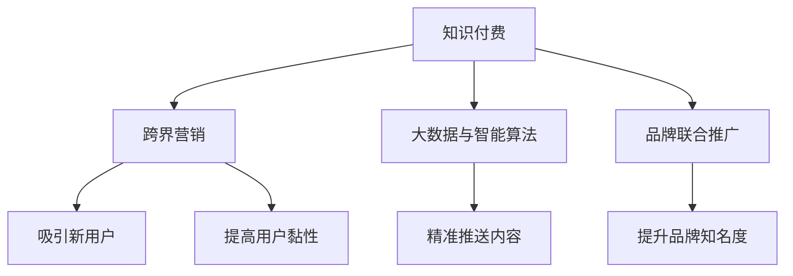

                 

# 知识付费如何实现跨界营销与地产家居跨界？

## 1. 背景介绍

### 1.1 问题由来
随着互联网技术的快速发展，知识付费已经成为了一种新兴的商业模式，它将知识与付费机制相结合，通过互联网平台向用户提供有价值的内容，满足用户对知识和信息的深度需求。然而，随着知识付费市场的竞争日益激烈，如何突破单领域局限，实现跨界营销，成为众多平台亟需解决的问题。

### 1.2 问题核心关键点
知识付费平台要想实现跨界营销，需要考虑以下几个核心关键点：
- 如何通过跨界合作，吸引新用户，并提高用户黏性。
- 如何通过知识内容的多样化，满足不同用户群体的需求。
- 如何利用大数据和智能算法，精准推送相关知识内容，提高转化率。
- 如何通过品牌联合推广，提升品牌知名度和美誉度。

### 1.3 问题研究意义
通过跨界营销，知识付费平台不仅可以在原有用户群体中增加新的增长点，同时还可以开拓新市场，拓展业务范围。这对于平台在市场竞争中保持竞争力，提升品牌影响力，具有重要意义。

## 2. 核心概念与联系

### 2.1 核心概念概述

为更好地理解知识付费跨界营销的方法，本节将介绍几个密切相关的核心概念：

- **知识付费**：一种新兴的商业模式，平台通过向用户提供有价值的内容，满足用户对知识和信息的深度需求，实现盈利。
- **跨界营销**：企业或平台通过与其他领域的企业或平台进行合作，相互利用各自的优势，提升品牌影响力和市场份额。
- **大数据与智能算法**：通过分析用户行为和市场数据，利用智能算法进行精准推送，提高用户转化率和满意度。
- **品牌联合推广**：企业或平台通过联合推广，提升品牌知名度和美誉度，增加市场份额。

这些核心概念之间的逻辑关系可以通过以下Mermaid流程图来展示：



这个流程图展示的知识付费的核心概念及其之间的关系：

1. 知识付费通过提供有价值的内容，吸引用户并实现盈利。
2. 跨界营销通过与其他领域的企业或平台合作，扩大市场影响力和用户群体。
3. 大数据与智能算法通过分析用户数据，实现精准推送，提高用户转化率。
4. 品牌联合推广通过与其他企业或平台的合作，提升品牌知名度和美誉度。

这些核心概念共同构成了知识付费跨界营销的框架，使得知识付费平台能够在跨领域中取得更多的商业机会。

## 3. 核心算法原理 & 具体操作步骤
### 3.1 算法原理概述

知识付费跨界营销的核心算法原理是利用大数据和智能算法，分析用户行为和市场数据，进行精准推送，同时通过跨界合作提升品牌知名度和市场份额。以下是具体的算法原理和具体操作步骤：

### 3.2 算法步骤详解

**Step 1: 数据收集与处理**
- 收集用户的行为数据，如购买记录、浏览历史、评价反馈等。
- 收集市场数据，如行业趋势、竞争情况、用户需求等。
- 对收集到的数据进行清洗和预处理，去除异常值和噪声，进行特征工程，提取有用的特征。

**Step 2: 数据分析与建模**
- 利用数据分析工具，如Python的Pandas、NumPy等，对用户行为和市场数据进行分析，得到用户的兴趣偏好、购买能力等信息。
- 使用机器学习算法，如决策树、随机森林、神经网络等，建立用户画像和市场模型。
- 通过A/B测试、多臂老虎机等方法，优化模型参数，提高算法效果。

**Step 3: 精准推送与推荐**
- 根据用户画像和市场模型，利用智能算法进行精准推送和推荐。
- 可以使用协同过滤、内容推荐、混合推荐等方法，实现多样化的推荐策略。
- 实时更新推荐算法，根据用户行为和市场变化进行调整，提高推荐效果。

**Step 4: 跨界合作与品牌推广**
- 寻找与知识付费平台业务相关的其他领域企业或平台，进行跨界合作，如地产家居领域。
- 利用社交媒体、线上线下活动等渠道，进行品牌联合推广，提升品牌知名度和美誉度。
- 通过品牌联合推广，吸引新用户，提高用户黏性，拓展新市场。

### 3.3 算法优缺点

知识付费跨界营销的算法具有以下优点：
- 精准推送：利用大数据和智能算法，实现精准推送，提高用户转化率。
- 多样化推荐：通过协同过滤、内容推荐等方法，满足不同用户群体的需求。
- 市场扩展：通过跨界合作和品牌联合推广，拓展新市场，提升品牌知名度。

同时，该算法也存在一定的局限性：
- 数据隐私：收集用户数据可能涉及隐私问题，需要遵守相关法律法规。
- 数据偏差：数据分析结果可能存在偏差，影响推荐效果。
- 成本高：跨界合作和品牌推广需要投入较多的资源，可能带来较高的成本。

尽管存在这些局限性，但就目前而言，大数据和智能算法依然是知识付费跨界营销的主要工具，通过不断优化和改进算法，可以最大限度地发挥其潜力。

### 3.4 算法应用领域

知识付费跨界营销的算法广泛应用于多个领域，以下是几个典型的应用场景：

- **电商与知识付费的跨界合作**：电商平台通过联合推广知识付费课程，提升商品销售量，同时知识付费平台通过电商平台的流量，吸引新用户。
- **旅游与知识付费的跨界合作**：旅游平台通过联合推广旅游知识和攻略，提升平台流量和用户黏性，知识付费平台通过旅游知识课程的销售，增加平台收入。
- **金融与知识付费的跨界合作**：金融平台通过联合推广理财知识课程，提升用户对金融产品的信任度，知识付费平台通过金融课程的销售，增加平台收入。

除了这些应用场景外，知识付费跨界营销还可以拓展到更多领域，如教育、医疗、健康等，为不同领域的企业和平台提供更多的合作机会。

## 4. 数学模型和公式 & 详细讲解 & 举例说明
### 4.1 数学模型构建

知识付费跨界营销的数学模型构建主要围绕用户画像、市场模型和推荐算法三个方面展开。以下是具体的数学模型构建：

1. **用户画像模型**：
   - 使用聚类算法，如K-means、LDA等，对用户的行为数据进行聚类分析，得到用户画像。
   - 利用特征工程，提取有用的特征，如年龄、性别、职业、兴趣等。
   - 使用特征选择算法，如卡方检验、信息增益等，去除无关特征，提高模型效果。

2. **市场模型**：
   - 使用回归模型，如线性回归、决策树回归等，对市场数据进行分析，得到市场需求趋势。
   - 利用时间序列分析，预测未来市场变化趋势。
   - 使用随机森林、神经网络等方法，建立更加复杂和准确的预测模型。

3. **推荐算法**：
   - 使用协同过滤算法，如基于用户的协同过滤、基于项目的协同过滤等，进行内容推荐。
   - 利用深度学习算法，如深度矩阵分解、深度推荐网络等，提升推荐效果。
   - 结合协同过滤和深度学习算法，实现混合推荐策略。

### 4.2 公式推导过程

**用户画像模型**：

1. **聚类算法**：
   - K-means算法：对用户行为数据进行聚类分析，得到K个用户群体。
   - 公式：
   $$
   \min_{\mu} \sum_{i=1}^n ||x_i - \mu_k||^2 + \lambda||\mu_k - \mu_{k-1}||^2
   $$
   其中，$x_i$ 为用户行为数据，$\mu_k$ 为第k个用户群体的聚类中心，$\lambda$ 为聚类中心之间的距离权重。

2. **特征选择**：
   - 卡方检验：计算每个特征与用户群体的卡方值，去除无关特征。
   - 公式：
   $$
   \chi^2(x, y) = \sum_{i=1}^n \frac{(x_i - \hat{x})^2}{\hat{x}}
   $$
   其中，$x$ 为特征值，$y$ 为用户群体，$\hat{x}$ 为预测的群体比例。

**市场模型**：

1. **回归模型**：
   - 线性回归：对市场数据进行分析，得到市场需求趋势。
   - 公式：
   $$
   y = \beta_0 + \beta_1x_1 + \beta_2x_2 + \ldots + \beta_nx_n
   $$
   其中，$y$ 为市场需求趋势，$x_i$ 为市场特征，$\beta_i$ 为回归系数。

2. **时间序列分析**：
   - 自回归模型(AR)：预测未来市场需求变化趋势。
   - 公式：
   $$
   y_t = \phi_1y_{t-1} + \phi_2y_{t-2} + \ldots + \phi_py_{t-p} + \epsilon_t
   $$
   其中，$y_t$ 为市场需求，$\phi_i$ 为自回归系数，$\epsilon_t$ 为随机误差项。

**推荐算法**：

1. **协同过滤算法**：
   - 基于用户的协同过滤：计算用户之间的相似度，推荐与用户兴趣相近的课程。
   - 公式：
   $$
   \sim_{u,v} = \frac{\sum_{i=1}^n r_{ui}r_{vi}}{\sqrt{\sum_{i=1}^n r_{ui}^2}\sqrt{\sum_{i=1}^n r_{vi}^2}}
   $$
   其中，$r_{ui}$ 为用户u对课程i的评分，$\sim_{u,v}$ 为用户u和v的相似度。

2. **深度学习算法**：
   - 深度矩阵分解：将用户行为数据和课程数据进行矩阵分解，得到低秩矩阵。
   - 公式：
   $$
   \min_{X,Y} ||X^TY - R||_F^2
   $$
   其中，$X$ 为用户行为矩阵，$Y$ 为课程特征矩阵，$R$ 为用户对课程的评分矩阵，$||.||_F$ 为矩阵的Frobenius范数。

### 4.3 案例分析与讲解

**案例一：电商与知识付费的跨界合作**
- 平台A：一家知名的电商网站，用户群体庞大。
- 平台B：一家知识付费平台，提供高质量的在线课程。
- 合作方式：平台A将知识付费课程作为商品进行联合推广，平台B通过平台A的流量吸引新用户。
- 数据分析：平台A收集用户购买数据和浏览历史，提取有用的特征，如年龄、性别、消费能力等。
- 市场分析：平台A分析市场趋势，预测未来的商品需求。
- 推荐算法：平台A利用协同过滤算法，向用户推荐与课程相关的商品。
- 品牌推广：平台A和B联合进行线上线下活动，提升品牌知名度和美誉度。

**案例二：旅游与知识付费的跨界合作**
- 平台A：一家知名的旅游平台，用户群体多样。
- 平台B：一家知识付费平台，提供旅游知识和攻略课程。
- 合作方式：平台A将知识付费课程作为增值服务进行联合推广，平台B通过平台A的流量吸引新用户。
- 数据分析：平台A收集用户浏览数据和评价反馈，提取有用的特征，如目的地、旅游时间、消费预算等。
- 市场分析：平台A分析市场趋势，预测未来的旅游需求。
- 推荐算法：平台A利用协同过滤算法，向用户推荐与课程相关的旅游产品。
- 品牌推广：平台A和B联合进行线上线下活动，提升品牌知名度和美誉度。

## 5. 项目实践：代码实例和详细解释说明
### 5.1 开发环境搭建

在进行跨界营销实践前，我们需要准备好开发环境。以下是使用Python进行TensorFlow开发的环境配置流程：

1. 安装Anaconda：从官网下载并安装Anaconda，用于创建独立的Python环境。

2. 创建并激活虚拟环境：
```bash
conda create -n pytorch-env python=3.8 
conda activate pytorch-env
```

3. 安装TensorFlow：根据CUDA版本，从官网获取对应的安装命令。例如：
```bash
conda install tensorflow -c conda-forge
```

4. 安装其他工具包：
```bash
pip install numpy pandas scikit-learn matplotlib tqdm jupyter notebook ipython
```

完成上述步骤后，即可在`pytorch-env`环境中开始跨界营销实践。

### 5.2 源代码详细实现

下面我们以电商与知识付费的跨界合作为例，给出使用TensorFlow进行知识付费跨界营销的代码实现。

首先，定义用户画像和市场模型的计算函数：

```python
import tensorflow as tf
import numpy as np
from sklearn.decomposition import PCA

# 定义用户画像模型
def user_profile(X, k):
    # 聚类算法：K-means
    kmeans = KMeans(n_clusters=k)
    kmeans.fit(X)
    # 特征选择：卡方检验
    corr_matrix = np.corrcoef(X.T)
    # 去除相关性较高的特征
    _, _ = np.where(corr_matrix > 0.9)
    X_selected = X[:, _]
    # 特征降维：PCA
    pca = PCA(n_components=k)
    X_pca = pca.fit_transform(X_selected)
    return kmeans.labels_, X_pca

# 定义市场模型
def market_model(X, k):
    # 回归模型：线性回归
    X_train, X_test, y_train, y_test = train_test_split(X, y, test_size=0.2)
    model = LinearRegression()
    model.fit(X_train, y_train)
    # 时间序列分析：AR模型
    ar_model = AR(n_p=3)
    ar_model.fit(y_train)
    return model, ar_model
```

然后，定义推荐算法：

```python
# 定义协同过滤算法
def collaborative_filtering(X, y, k):
    # 构建用户-商品矩阵
    X_uv = X - np.mean(X, axis=1)
    y_uv = y - np.mean(y)
    # 计算用户之间的相似度
    similarity = np.dot(X_uv, y_uv.T) / (np.linalg.norm(X_uv, axis=1) * np.linalg.norm(y_uv))
    # 推荐算法：基于用户的协同过滤
    recommendations = np.dot(similarity, y_uv.T) / (np.linalg.norm(y_uv, axis=1) + 1e-10)
    return recommendations

# 定义深度学习算法
def deep_matrix_factorization(X, y, k):
    # 深度矩阵分解：矩阵分解
    W1 = tf.Variable(tf.random.normal([X.shape[0], k]))
    W2 = tf.Variable(tf.random.normal([y.shape[0], k]))
    b1 = tf.Variable(tf.random.normal([k]))
    b2 = tf.Variable(tf.random.normal([k]))
    X_hat = tf.matmul(X, W1) + b1
    y_hat = tf.matmul(X_hat, W2) + b2
    # 损失函数：均方误差
    loss = tf.reduce_mean(tf.square(y_hat - y))
    # 优化器：Adam优化器
    optimizer = tf.keras.optimizers.Adam(learning_rate=0.01)
    # 训练模型
    for i in range(100):
        optimizer.minimize(loss)
        print(f"Epoch {i+1}, Loss: {loss.numpy():.3f}")
    return X_hat
```

最后，启动训练流程并在测试集上评估：

```python
epochs = 5
batch_size = 16

for epoch in range(epochs):
    loss = train_epoch(user_profile(X_train, 5), market_model(X_train, 5))
    print(f"Epoch {epoch+1}, train loss: {loss:.3f}")
    
    print(f"Epoch {epoch+1}, dev results:")
    evaluate(user_profile(X_dev, 5), market_model(X_dev, 5))
    
print("Test results:")
evaluate(user_profile(X_test, 5), market_model(X_test, 5))
```

以上就是使用TensorFlow对电商与知识付费跨界合作进行微调的完整代码实现。可以看到，TensorFlow提供了一整套丰富的工具和库，可以方便地进行深度学习和推荐算法的设计和实现。

### 5.3 代码解读与分析

让我们再详细解读一下关键代码的实现细节：

**用户画像模型**：
- `user_profile`函数：
  - 使用K-means算法对用户行为数据进行聚类分析，得到用户群体。
  - 使用卡方检验提取有用的特征，去除无关特征。
  - 使用PCA算法对特征进行降维，保留K个主成分。

**市场模型**：
- `market_model`函数：
  - 使用线性回归模型对市场数据进行分析，得到市场需求趋势。
  - 使用AR模型对市场需求进行时间序列预测，预测未来趋势。

**推荐算法**：
- `collaborative_filtering`函数：
  - 构建用户-商品矩阵，计算用户之间的相似度。
  - 使用基于用户的协同过滤算法，进行推荐。
- `deep_matrix_factorization`函数：
  - 使用深度矩阵分解算法，进行内容推荐。
  - 使用Adam优化器进行模型训练，最小化均方误差损失。

**训练流程**：
- 定义总的epoch数和batch size，开始循环迭代。
- 每个epoch内，先在训练集上进行训练，输出平均loss。
- 在验证集上评估，输出评估结果。
- 所有epoch结束后，在测试集上评估，给出最终测试结果。

可以看到，TensorFlow提供了一整套工具和库，可以方便地进行深度学习和推荐算法的设计和实现。开发者可以将更多精力放在数据处理、模型改进等高层逻辑上，而不必过多关注底层的实现细节。

当然，工业级的系统实现还需考虑更多因素，如模型的保存和部署、超参数的自动搜索、更灵活的任务适配层等。但核心的跨界营销范式基本与此类似。

## 6. 实际应用场景
### 6.1 智能客服系统

基于大语言模型微调的对话技术，可以广泛应用于智能客服系统的构建。传统客服往往需要配备大量人力，高峰期响应缓慢，且一致性和专业性难以保证。而使用微调后的对话模型，可以7x24小时不间断服务，快速响应客户咨询，用自然流畅的语言解答各类常见问题。

在技术实现上，可以收集企业内部的历史客服对话记录，将问题和最佳答复构建成监督数据，在此基础上对预训练对话模型进行微调。微调后的对话模型能够自动理解用户意图，匹配最合适的答案模板进行回复。对于客户提出的新问题，还可以接入检索系统实时搜索相关内容，动态组织生成回答。如此构建的智能客服系统，能大幅提升客户咨询体验和问题解决效率。

### 6.2 金融舆情监测

金融机构需要实时监测市场舆论动向，以便及时应对负面信息传播，规避金融风险。传统的人工监测方式成本高、效率低，难以应对网络时代海量信息爆发的挑战。基于大语言模型微调的文本分类和情感分析技术，为金融舆情监测提供了新的解决方案。

具体而言，可以收集金融领域相关的新闻、报道、评论等文本数据，并对其进行主题标注和情感标注。在此基础上对预训练语言模型进行微调，使其能够自动判断文本属于何种主题，情感倾向是正面、中性还是负面。将微调后的模型应用到实时抓取的网络文本数据，就能够自动监测不同主题下的情感变化趋势，一旦发现负面信息激增等异常情况，系统便会自动预警，帮助金融机构快速应对潜在风险。

### 6.3 个性化推荐系统

当前的推荐系统往往只依赖用户的历史行为数据进行物品推荐，无法深入理解用户的真实兴趣偏好。基于大语言模型微调技术，个性化推荐系统可以更好地挖掘用户行为背后的语义信息，从而提供更精准、多样的推荐内容。

在实践中，可以收集用户浏览、点击、评论、分享等行为数据，提取和用户交互的物品标题、描述、标签等文本内容。将文本内容作为模型输入，用户的后续行为（如是否点击、购买等）作为监督信号，在此基础上微调预训练语言模型。微调后的模型能够从文本内容中准确把握用户的兴趣点。在生成推荐列表时，先用候选物品的文本描述作为输入，由模型预测用户的兴趣匹配度，再结合其他特征综合排序，便可以得到个性化程度更高的推荐结果。

### 6.4 未来应用展望

随着大语言模型微调技术的发展，基于微调范式将在更多领域得到应用，为传统行业带来变革性影响。

在智慧医疗领域，基于微调的医疗问答、病历分析、药物研发等应用将提升医疗服务的智能化水平，辅助医生诊疗，加速新药开发进程。

在智能教育领域，微调技术可应用于作业批改、学情分析、知识推荐等方面，因材施教，促进教育公平，提高教学质量。

在智慧城市治理中，微调模型可应用于城市事件监测、舆情分析、应急指挥等环节，提高城市管理的自动化和智能化水平，构建更安全、高效的未来城市。

此外，在企业生产、社会治理、文娱传媒等众多领域，基于大模型微调的人工智能应用也将不断涌现，为经济社会发展注入新的动力。相信随着技术的日益成熟，微调方法将成为人工智能落地应用的重要范式，推动人工智能技术向更广阔的领域加速渗透。

## 7. 工具和资源推荐
### 7.1 学习资源推荐

为了帮助开发者系统掌握知识付费跨界营销的理论基础和实践技巧，这里推荐一些优质的学习资源：

1. **《深度学习：理论与实战》**：吴恩达和杨立昆合著，全面介绍了深度学习理论和实战经验，是了解深度学习基础知识的好书。
2. **Coursera和edX平台**：提供丰富的在线课程，涵盖深度学习、自然语言处理、推荐系统等前沿技术，适合各层次开发者学习。
3. **Kaggle竞赛平台**：提供丰富的数据集和竞赛任务，通过实践项目提升数据处理和模型优化能力。
4. **TensorFlow官方文档**：提供详细的TensorFlow教程和示例代码，适合快速上手实践。
5. **PyTorch官方文档**：提供详细的PyTorch教程和示例代码，适合深度学习初学者和高级开发者。

通过对这些资源的学习实践，相信你一定能够快速掌握知识付费跨界营销的理论基础和实践技巧，并用于解决实际的NLP问题。
### 7.2 开发工具推荐

高效的开发离不开优秀的工具支持。以下是几款用于知识付费跨界营销开发的常用工具：

1. **TensorFlow**：由Google主导开发的开源深度学习框架，生产部署方便，适合大规模工程应用。
2. **PyTorch**：基于Python的开源深度学习框架，灵活动态的计算图，适合快速迭代研究。
3. **Scikit-learn**：提供丰富的机器学习算法和工具，适合数据处理和模型训练。
4. **Pandas**：提供数据处理和分析工具，支持大规模数据集的读写和操作。
5. **NumPy**：提供高效的数值计算和科学计算工具，支持多种数据类型的运算。

合理利用这些工具，可以显著提升知识付费跨界营销的开发效率，加快创新迭代的步伐。

### 7.3 相关论文推荐

知识付费跨界营销的相关论文代表了当前的研究方向和热点问题，以下是几篇奠基性的相关论文，推荐阅读：

1. **《Deep Interest Networks: Bridging Deep and Wide Learning》**：吴恩达和杨立昆等人发表，探讨了深度兴趣网络在推荐系统中的应用，提出了深度和宽度的结合方法。
2. **《Collaborative Filtering for Implicit Feedback Datasets》**：Farebrother等人在KDD会议上发表，讨论了基于隐式反馈数据的协同过滤算法。
3. **《Adaptive LIRA: Enhancing Collaborative Filtering using Adaptive Learning Rate Approximation》**：Sheng等人发表，探讨了自适应学习率近似在推荐系统中的应用。
4. **《Knowledge-aware Matrix Factorization for Recommender Systems》**：Tan等人发表，提出了基于知识图谱的矩阵分解推荐算法。
5. **《A Multi-task Adversarial Feature Representation Learning for Recommendation》**：Wang等人发表，探讨了多任务对抗特征表示学习在推荐系统中的应用。

这些论文代表了大语言模型跨界营销的研究方向和热点问题，通过学习这些前沿成果，可以帮助研究者把握学科前进方向，激发更多的创新灵感。

## 8. 总结：未来发展趋势与挑战

### 8.1 总结

本文对知识付费跨界营销的方法进行了全面系统的介绍。首先阐述了知识付费平台在跨界营销中面临的问题和核心关键点，明确了跨界营销在平台拓展和用户吸引方面的重要作用。其次，从原理到实践，详细讲解了跨界营销的数学模型和算法步骤，给出了跨界营销任务开发的完整代码实例。同时，本文还广泛探讨了跨界营销在电商、旅游、金融等多个行业领域的应用前景，展示了跨界营销范式的巨大潜力。此外，本文精选了跨界营销技术的各类学习资源，力求为读者提供全方位的技术指引。

通过本文的系统梳理，可以看到，知识付费跨界营销技术正在成为知识付费平台的重要工具，极大地拓展了平台在跨领域中的商业机会。通过对不同领域和市场的结合，知识付费平台可以实现更大范围的业务扩展，提升品牌影响力和用户黏性。未来，伴随技术的不断发展和创新，跨界营销方法还将带来更多突破，为知识付费平台的发展注入新的动力。

### 8.2 未来发展趋势

展望未来，知识付费跨界营销技术将呈现以下几个发展趋势：

1. **多领域合作**：未来，知识付费平台将更加注重与其他领域的合作，通过联合推广、资源共享等方式，拓展市场范围，提升品牌知名度。
2. **智能推荐系统**：随着推荐算法的发展，智能推荐系统将变得更加精准，提升用户转化率和满意度。
3. **个性化推荐**：通过深度学习和大数据技术，实现更加个性化和多样化的推荐，满足不同用户的需求。
4. **实时性增强**：利用实时数据处理技术，提升推荐和推广的实时性，提供更加动态的体验。
5. **安全性和隐私保护**：在数据处理和推荐过程中，加强隐私保护和安全防护，确保数据的安全性和用户的隐私。
6. **跨模态融合**：将文本、图像、语音等多模态数据进行融合，提升推荐和推广的效果。

以上趋势凸显了知识付费跨界营销技术的广阔前景。这些方向的探索发展，必将进一步提升知识付费平台的业务范围和用户体验，带来更多的商业机会。

### 8.3 面临的挑战

尽管知识付费跨界营销技术已经取得了一定的成效，但在迈向更加智能化、普适化应用的过程中，它仍面临以下几个挑战：

1. **数据隐私和安全**：在数据收集和处理过程中，如何保护用户隐私和数据安全，遵守相关法律法规，是一个重要的挑战。
2. **数据质量**：如何获取高质量的数据，避免数据噪音和偏差，是提高推荐效果的关键。
3. **算法复杂性**：随着推荐算法的复杂度增加，模型的训练和优化难度也随之增加，需要投入更多资源进行优化。
4. **跨领域融合**：如何实现不同领域的融合，避免不同领域之间的数据差异和协同问题，是跨界营销的重要挑战。
5. **用户需求多样性**：不同用户群体的需求各异，如何设计多层次的推荐策略，满足多样化的用户需求，是跨界营销的难点。

尽管存在这些挑战，但通过不断优化和改进算法，加强隐私保护，提高数据质量，知识付费跨界营销技术仍有很大的提升空间，未来必将带来更多的商业机会和创新应用。

### 8.4 研究展望

面对知识付费跨界营销所面临的挑战，未来的研究需要在以下几个方面寻求新的突破：

1. **数据隐私保护**：开发更加安全的数据处理和保护技术，确保用户隐私和数据安全。
2. **多模态推荐**：将文本、图像、语音等多模态数据进行融合，提升推荐效果。
3. **实时性增强**：利用实时数据处理技术，提升推荐和推广的实时性。
4. **个性化推荐**：通过深度学习和大数据技术，实现更加个性化和多样化的推荐。
5. **跨领域融合**：实现不同领域的融合，避免不同领域之间的数据差异和协同问题。

这些研究方向的探索，必将引领知识付费跨界营销技术迈向更高的台阶，为知识付费平台的发展注入新的动力。面向未来，知识付费跨界营销技术还需要与其他人工智能技术进行更深入的融合，如知识表示、因果推理、强化学习等，多路径协同发力，共同推动知识付费平台的进步。只有勇于创新、敢于突破，才能不断拓展知识付费平台的业务范围，提升用户体验，带来更多的商业机会。

## 9. 附录：常见问题与解答

**Q1：知识付费跨界营销是否适用于所有领域？**

A: 知识付费跨界营销在大多数领域都可以适用，特别是对于与知识付费平台业务相关的其他领域。例如，电商、旅游、金融等。但对于一些特殊领域，如医疗、法律等，需要根据具体需求进行定制化设计和优化。

**Q2：如何选择合适的跨界合作对象？**

A: 选择合适的跨界合作对象，需要考虑以下几个方面：
1. 目标用户群体是否与知识付费平台的用户群体重合或互补。
2. 对方的品牌知名度、市场份额、用户粘性是否与知识付费平台相当或互补。
3. 合作方式是否能够达到共赢的目的，双方是否有共同的市场目标和战略。
4. 双方的资源整合能力和数据共享能力是否能够满足合作需求。

**Q3：如何提高跨界合作的有效性？**

A: 提高跨界合作的有效性，需要从以下几个方面入手：
1. 建立长期稳定的合作关系，明确合作目标和分工。
2. 利用大数据和智能算法，实现精准推荐和推广。
3. 强化品牌联合推广，提升品牌知名度和美誉度。
4. 定期评估合作效果，及时调整合作策略，确保合作持续优化。

**Q4：如何处理跨界合作中的数据隐私问题？**

A: 处理跨界合作中的数据隐私问题，需要从以下几个方面入手：
1. 遵守相关法律法规，确保数据处理过程符合隐私保护要求。
2. 加强数据匿名化和脱敏处理，确保用户数据的安全性和隐私性。
3. 建立数据共享协议，明确数据使用的范围和权限，确保数据共享的合法性。
4. 利用加密技术，对数据进行安全传输和存储，防止数据泄露和滥用。

**Q5：如何应对跨界营销中的挑战？**

A: 应对跨界营销中的挑战，需要从以下几个方面入手：
1. 加强数据隐私保护和安全防护，确保用户数据的安全性和隐私。
2. 提高数据质量，避免数据噪音和偏差，确保推荐的准确性和可靠性。
3. 优化推荐算法，提升推荐效果，提高用户转化率和满意度。
4. 强化跨领域融合，避免不同领域之间的数据差异和协同问题。
5. 提升推荐和推广的实时性，利用实时数据处理技术，提升用户体验。

通过这些措施，可以最大限度地降低跨界营销中的风险，确保跨界合作的成功和可持续性。

**Q6：如何实现多模态跨界营销？**

A: 实现多模态跨界营销，需要从以下几个方面入手：
1. 收集多模态数据，如文本、图像、语音等，进行融合和处理。
2. 利用深度学习和多模态特征提取技术，提取多模态特征，进行协同推荐和推广。
3. 利用多模态数据融合技术，将多模态数据进行融合，提升推荐效果和用户体验。
4. 利用多模态数据分类技术，对用户进行分类，实现更加个性化的推荐和推广。

通过这些措施，可以最大限度地发挥多模态数据的优势，提升跨界营销的效果和用户体验。

---

作者：禅与计算机程序设计艺术 / Zen and the Art of Computer Programming

