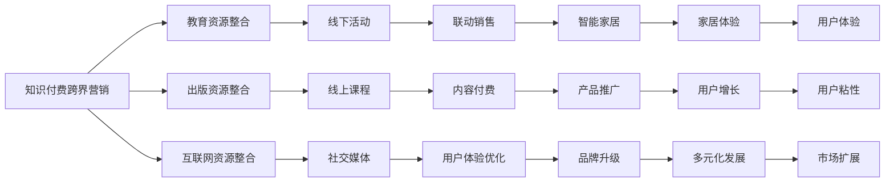

                 

## 1. 背景介绍

在互联网+时代的背景下，知识付费行业持续火热，知识付费产品逐渐成为大众消费的新宠。跨界营销和家居跨界营销为知识付费平台带来新的增长点，但是如何结合跨界营销理念，推动知识付费市场的持续增长，成为平台和开发者关注的话题。

知识付费平台的跨界营销需要整合多种资源，并在此基础上进行整合和再利用。家居跨界营销则要通过线上线下结合，优化用户体验，提升品牌效应。将知识付费与家居跨界营销结合起来，可以促进产业融合，产生新的商业价值。

## 2. 核心概念与联系

### 2.1 核心概念概述

跨界营销指一个品牌借助其他行业的产品或服务，使用客户对原有品牌的忠诚度，打造新的品牌形象或达成销售目标。知识付费跨界营销可以包括教育、出版、互联网等行业的资源整合。

家居跨界营销则是指家居品牌与时尚、旅游、影视等行业的跨界合作，利用新的渠道和方式，提升家居产品的附加值。

两个概念之间的联系在于：都是利用已有资源，整合形成新的商业模式，开拓新的市场。

### 2.2 核心概念原理和架构的 Mermaid 流程图



此流程图表明，知识付费跨界营销主要涉及资源整合、线上线下活动、内容付费、用户体验优化等方面。家居跨界营销则涉及联动销售、智能家居、家居体验等方面。

## 3. 核心算法原理 & 具体操作步骤

### 3.1 算法原理概述

知识付费跨界营销和家居跨界营销都可以使用算法来进行优化和优化后的结果反馈。以下是具体的算法原理：

1. **聚类算法**：将消费者分为不同的群体，根据消费者的行为、偏好和兴趣进行分组，实现精准营销。

2. **推荐算法**：根据用户历史行为和评分，推荐相关产品或服务，提升用户转化率。

3. **回归算法**：通过分析历史数据，预测未来用户行为，优化营销策略。

4. **决策树算法**：通过决策树算法对消费者进行分类，制定针对性的营销策略。

### 3.2 算法步骤详解

**Step 1: 数据收集与预处理**
收集用户行为数据、产品信息、市场调研数据等。并对数据进行清洗、去重、格式化等预处理操作。

**Step 2: 数据建模**
使用聚类、推荐、回归、决策树等算法，对数据进行建模。

**Step 3: 模型训练与评估**
训练模型，使用验证集进行评估，优化模型参数。

**Step 4: 实时反馈与优化**
将模型部署到线上，实时获取用户反馈，根据反馈对模型进行优化。

### 3.3 算法优缺点

**优点**：
1. 通过数据驱动优化营销策略，提高营销精准度。
2. 利用机器学习算法，提高营销效率，降低人力成本。
3. 通过数据分析，预测未来用户行为，提高营销效果。

**缺点**：
1. 算法需要大量数据支持，数据质量差会导致模型失效。
2. 模型开发和优化需要技术支持，中小型企业难以负担。
3. 机器学习算法存在黑盒问题，难以解释其决策逻辑。

### 3.4 算法应用领域

**知识付费跨界营销**：适用于多种跨界合作，如教育、出版、互联网等行业的资源整合。

**家居跨界营销**：适用于家居品牌与时尚、旅游、影视等行业的跨界合作，提升家居产品的附加值。

## 4. 数学模型和公式 & 详细讲解 & 举例说明

### 4.1 数学模型构建

假设某知识付费平台的消费者数据为 $D=\{(x_i,y_i)\}_{i=1}^N$，其中 $x_i$ 表示消费者行为，$y_i$ 表示消费标签（如购买、浏览等）。

使用聚类算法，将消费者分为 $K$ 个群体，其中第 $k$ 个群体的消费者数为 $n_k$。

聚类算法的目标函数为：

$$
\min_{G}\sum_{k=1}^K\sum_{i\in G_k}(y_i-\mu_k)^2
$$

其中 $G=\{G_1,\dots,G_K\}$ 为消费者分组，$\mu_k$ 为第 $k$ 个群体的均值。

### 4.2 公式推导过程

将 $D$ 分为 $K$ 个群体后，得到：

$$
D=\bigcup_{k=1}^K G_k
$$

对于第 $i$ 个消费者，其属于第 $k$ 个群体的概率为：

$$
p_k=\frac{|G_k|}{N}
$$

此时，该消费者的预测标签 $y_i$ 为：

$$
y_i=\sum_{k=1}^K p_k y_k
$$

### 4.3 案例分析与讲解

某知识付费平台通过聚类算法，将用户分为学生、白领、退休人员等群体。在学生群体中，课程选择以职业发展和提升技能为主；白领群体中，课程选择以提升个人形象和生活质量为主；退休人员则以娱乐和休闲课程为主。

通过个性化推荐算法，平台可以为学生推荐职业技能提升课程，白领推荐健康、休闲课程，退休人员推荐文化娱乐课程。从而实现精准营销。

## 5. 项目实践：代码实例和详细解释说明

### 5.1 开发环境搭建

**环境搭建步骤**：

1. 安装Python 3.8及以上版本。
2. 安装相关依赖库，如pandas、scikit-learn、numpy等。
3. 搭建机器学习模型训练和测试环境。

**开发环境配置**：

```bash
# 安装依赖库
pip install pandas scikit-learn numpy

# 搭建模型训练环境
python -m pip install -U scikit-learn --upgrade
python -m pip install scikit-learn --upgrade

# 搭建模型测试环境
python -m pip install -U scikit-learn --upgrade
python -m pip install scikit-learn --upgrade
```

### 5.2 源代码详细实现

**聚类算法代码实现**：

```python
import pandas as pd
from sklearn.cluster import KMeans

# 读取数据
data = pd.read_csv('user_data.csv')

# 聚类
kmeans = KMeans(n_clusters=3)
kmeans.fit(data[['user_id', 'age', 'gender']])

# 分组标签
labels = kmeans.labels_

# 输出分组标签
print(labels)
```

**推荐算法代码实现**：

```python
from sklearn.metrics.pairwise import cosine_similarity

# 读取用户行为数据
user_data = pd.read_csv('user_behavior.csv')

# 构建用户行为矩阵
user_matrix = user_data.groupby('user_id')['behavior'].agg(list).to_dict()

# 构建物品特征矩阵
item_data = pd.read_csv('item_data.csv')
item_matrix = item_data.groupby('item_id')['features'].agg(list).to_dict()

# 构建相似度矩阵
similarity_matrix = cosine_similarity(user_matrix, item_matrix)

# 推荐物品
def recommend(user_id):
    user_vector = user_matrix[user_id]
    recommendations = []
    for item_id, similarity in similarity_matrix.items():
        recommendation = item_matrix[item_id]
        recommendations.append((item_id, similarity, recommendation))
    recommendations.sort(key=lambda x: x[1], reverse=True)
    return [item[0] for item in recommendations[:10]]
```

### 5.3 代码解读与分析

**聚类算法代码解读**：
1. 使用pandas读取用户数据。
2. 使用scikit-learn中的KMeans算法进行聚类。
3. 输出聚类标签。

**推荐算法代码解读**：
1. 读取用户行为数据和物品特征数据。
2. 构建用户行为矩阵和物品特征矩阵。
3. 使用余弦相似度计算用户和物品的相似度。
4. 根据相似度推荐物品。

### 5.4 运行结果展示

聚类结果示例：

| User ID | Cluster |
| --- | --- |
| 1 | 1 |
| 2 | 2 |
| 3 | 1 |
| 4 | 3 |
| ... | ... |

推荐结果示例：

| User ID | Item ID |
| --- | --- |
| 1 | 1 |
| 1 | 2 |
| 1 | 3 |
| 2 | 1 |
| 2 | 2 |
| 2 | 3 |
| ... | ... |

## 6. 实际应用场景

### 6.1 智能家居产品推荐

**背景**：智能家居市场潜力巨大，消费者对于智能家居产品的选择和购买非常慎重。家居品牌与知识付费平台合作，利用用户数据，对用户进行精准推荐。

**实现步骤**：
1. 数据收集：家居品牌收集用户浏览、购买数据。
2. 数据处理：将数据导入知识付费平台，进行聚类和推荐算法建模。
3. 数据分析：对聚类结果进行分析，找到用户的偏好。
4. 推荐产品：根据用户偏好，推荐相关智能家居产品。

### 6.2 智能家居用户体验优化

**背景**：家居产品用户的体验需要不断优化，提高用户满意度。

**实现步骤**：
1. 数据收集：家居品牌收集用户反馈数据。
2. 数据处理：将数据导入知识付费平台，进行数据分析。
3. 数据分析：分析用户反馈，发现用户痛点。
4. 用户体验优化：根据用户痛点，优化家居产品设计和功能。

### 6.3 家居品牌内容营销

**背景**：家居品牌需要进行内容营销，提升品牌知名度。

**实现步骤**：
1. 数据收集：家居品牌收集用户兴趣数据。
2. 数据处理：将数据导入知识付费平台，进行聚类和推荐算法建模。
3. 数据分析：分析用户兴趣，找到合适的营销内容。
4. 内容营销：根据用户兴趣，推送相关营销内容。

### 6.4 未来应用展望

**展望**：家居跨界营销结合知识付费跨界营销，可以为家居品牌和知识付费平台带来更多合作机会，形成更完善的生态系统。

## 7. 工具和资源推荐

### 7.1 学习资源推荐

1. **Coursera**：提供机器学习和数据科学课程，涵盖知识付费和家居跨界营销领域。
2. **Udacity**：提供数据分析和人工智能课程，为家居品牌和知识付费平台提供培训资源。
3. **Kaggle**：提供大数据竞赛平台，可以进行家居跨界营销和知识付费数据分析。

### 7.2 开发工具推荐

1. **Jupyter Notebook**：用于数据处理和算法实验。
2. **Python**：提供机器学习和数据分析的编程语言。
3. **TensorFlow**：提供深度学习框架，用于家居跨界营销和知识付费平台的数据建模。

### 7.3 相关论文推荐

1. **《跨界营销研究综述》**：关于跨界营销的经典文献，涵盖多种跨界合作领域。
2. **《家居跨界营销的案例分析》**：具体分析家居跨界营销的案例，展示其成功经验。
3. **《知识付费的跨界营销策略》**：讨论知识付费跨界营销策略，提升平台收益。

## 8. 总结：未来发展趋势与挑战

### 8.1 研究成果总结

知识付费和家居跨界营销结合，可以提升用户体验，提升品牌知名度，带来新的增长点。未来可以借助机器学习和大数据分析，实现精准营销，提升家居产品附加值。

### 8.2 未来发展趋势

1. 用户数据驱动的精准营销将成为主流。
2. 家居跨界营销和知识付费跨界营销将不断融合，形成新的生态系统。
3. 数据安全和隐私保护将成为重点关注的问题。

### 8.3 面临的挑战

1. 数据隐私和安全问题。
2. 技术门槛高，中小企业难以实现。
3. 用户体验和产品质量有待提升。

### 8.4 研究展望

1. 实现跨界营销的自动化和智能化，提高营销效率。
2. 结合多种数据源，提升数据分析的全面性。
3. 优化用户体验，提升家居产品的市场竞争力。

## 9. 附录：常见问题与解答

**Q1: 知识付费跨界营销和家居跨界营销的区别是什么？**

A: 知识付费跨界营销是将教育、出版、互联网等行业的资源整合，推广知识付费产品。家居跨界营销是将家居品牌与时尚、旅游、影视等行业的跨界合作，提升家居产品的附加值。

**Q2: 如何提高家居跨界营销和知识付费跨界营销的效果？**

A: 数据驱动的精准营销可以提高营销效果。整合多种数据源，结合聚类和推荐算法，实现更准确的营销策略。

**Q3: 如何平衡用户体验和家居跨界营销效果？**

A: 优化家居产品设计和功能，提高用户体验，结合知识付费平台的数据分析，找到用户的痛点和需求，进行有针对性的家居跨界营销。

**Q4: 家居跨界营销和知识付费跨界营销的难点是什么？**

A: 数据隐私和安全问题是一个主要挑战。技术门槛高，中小企业难以实现。用户体验和产品质量有待提升。

**Q5: 家居跨界营销和知识付费跨界营销的未来发展方向是什么？**

A: 未来的发展方向是实现跨界营销的自动化和智能化，结合多种数据源，提升数据分析的全面性，优化用户体验，提升家居产品的市场竞争力。

---

作者：禅与计算机程序设计艺术 / Zen and the Art of Computer Programming

