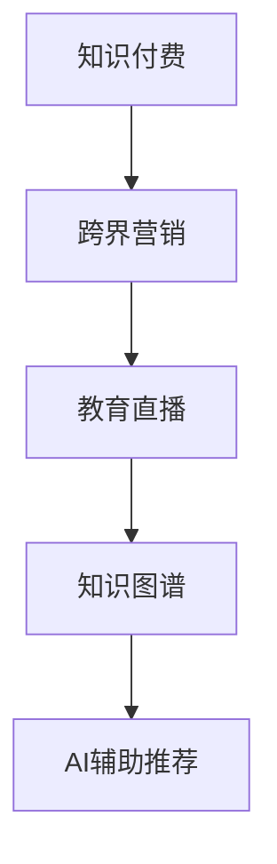

                 

## 1. 背景介绍

在数字化转型的浪潮下，知识付费逐渐成为主流学习方式，各大平台纷纷布局，如腾讯课堂、网易云课堂、得到等。然而，如何在知识付费的基础上，实现跨界营销与教育直播的融合，成为许多企业关注的焦点。本文将从背景、核心概念、算法原理、具体操作步骤等角度，深入探讨这一主题。

## 2. 核心概念与联系

### 2.1 核心概念概述

为了更好地理解知识付费跨界营销与教育直播的融合，本节将介绍几个密切相关的核心概念：

- **知识付费**：用户为获取专业、系统的学习内容而付费，以提高自身技能或知识水平。主要形式包括付费订阅、单次付费课程等。
- **跨界营销**：将某一行业的营销策略、用户画像等引入到另一行业，通过交叉渗透、融合互补，实现互惠共赢的营销效果。
- **教育直播**：以直播形式进行的在线教育活动，教师通过实时互动的方式，向学员传授知识和技能。
- **知识图谱**：利用图数据库技术，将海量知识信息进行结构化，形成知识关系网络，辅助内容推荐、智能问答等应用。
- **AI辅助推荐**：利用人工智能技术，对用户的学习行为、偏好等进行分析，实现个性化内容推荐。

这些核心概念之间的逻辑关系可以通过以下Mermaid流程图来展示：



这个流程图展示出知识付费、跨界营销、教育直播、知识图谱和AI推荐之间的关系：知识付费是基础，跨界营销与教育直播是业务形态的扩展，知识图谱和AI推荐是实现手段。

### 2.2 核心概念原理和架构

**知识付费**：
用户为了获取专业系统化的学习内容，通过付费订阅或单次付费的形式，获取高质量的知识产品，以提高自身技能或知识水平。

**跨界营销**：
跨界营销是将某一行业的营销策略、用户画像等引入到另一行业，通过交叉渗透、融合互补，实现互惠共赢的营销效果。例如，知识付费平台可以利用自身的用户基础，向合作的企业推广课程或产品，实现双赢。

**教育直播**：
教育直播是以直播形式进行的在线教育活动，教师通过实时互动的方式，向学员传授知识和技能。相比于传统的在线教育，直播形式更能增加互动性和即时性。

**知识图谱**：
知识图谱利用图数据库技术，将海量知识信息进行结构化，形成知识关系网络，辅助内容推荐、智能问答等应用。知识图谱可以提供更丰富的上下文信息，提升推荐的精准度。

**AI辅助推荐**：
AI辅助推荐利用人工智能技术，对用户的学习行为、偏好等进行分析，实现个性化内容推荐。AI推荐系统通过协同过滤、内容推荐等算法，找到与用户兴趣相关的课程或内容。

## 3. 核心算法原理 & 具体操作步骤

### 3.1 算法原理概述

知识付费跨界营销与教育直播的融合，本质上是一个数据驱动的营销策略优化和内容推荐过程。其核心思想是：通过收集用户的学习行为数据、课程内容信息，利用机器学习算法，实现个性化的内容推荐和跨界营销策略的优化。

具体来说，可以基于用户行为数据和课程特征，构建用户画像和课程画像，然后通过协同过滤、内容推荐等算法，实现个性化推荐。同时，可以利用跨界营销策略，将知识付费与企业产品、服务等结合，实现用户增长和商业变现。

### 3.2 算法步骤详解

知识付费跨界营销与教育直播的融合，可以分为以下几个关键步骤：

**Step 1: 数据收集和处理**
- 收集用户在知识付费平台上的学习行为数据，如浏览历史、订阅课程、购买记录等。
- 收集课程的特征信息，如标题、简介、分类、时长等。
- 对数据进行清洗、去重、归一化等预处理操作，形成适合算法处理的数据集。

**Step 2: 构建用户画像**
- 利用机器学习算法，如聚类、降维等，对用户行为数据进行建模，形成用户画像。
- 用户画像可以包括用户的兴趣偏好、学习水平、消费能力等特征。

**Step 3: 构建课程画像**
- 利用机器学习算法，对课程特征进行建模，形成课程画像。
- 课程画像可以包括课程的难度、适用人群、知识体系等特征。

**Step 4: 实现个性化推荐**
- 利用协同过滤、内容推荐等算法，对用户和课程进行匹配，实现个性化内容推荐。
- 协同过滤算法包括基于用户的协同过滤和基于物品的协同过滤，用于发现与用户兴趣相似的课程。
- 内容推荐算法包括基于内容的推荐、基于矩阵分解的推荐等，用于根据课程特征进行推荐。

**Step 5: 实现跨界营销**
- 利用用户画像和课程画像，结合企业产品、服务等相关信息，设计跨界营销策略。
- 例如，知识付费平台可以与电商、金融、旅游等企业合作，推出联名课程、会员优惠等活动。
- 跨界营销策略需注意平衡用户价值和商业利益，确保用户获得优质内容的同时，平台和企业也能实现共赢。

**Step 6: 持续优化**
- 持续收集用户反馈、优化算法模型，提升推荐效果和用户体验。
- 引入A/B测试、多臂老虎机等技术，对营销策略进行优化和迭代。

### 3.3 算法优缺点

知识付费跨界营销与教育直播的融合方法具有以下优点：
1. 提高用户留存率。个性化推荐能够满足用户多样化需求，提高用户满意度和黏性。
2. 增强商业变现。跨界营销策略能够实现用户增长和商业变现，提升平台和企业的收益。
3. 提升平台品牌价值。知识付费跨界营销能够增强平台的品牌影响力和市场竞争力。

同时，该方法也存在一定的局限性：
1. 数据隐私问题。用户的隐私数据需要得到充分保护，否则将影响用户信任。
2. 推荐算法复杂度。个性化推荐算法涉及复杂的数学建模和算法实现，技术难度较高。
3. 营销策略多样化。跨界营销策略需要灵活多变，需根据不同的企业和用户群体设计不同的策略。
4. 技术更新迅速。算法的迭代优化需要持续跟进，否则将难以保持竞争力。

尽管存在这些局限性，但就目前而言，知识付费跨界营销与教育直播的融合方法仍是业界的主流趋势。未来相关研究的重点在于如何进一步提高推荐算法的精准度，降低数据隐私风险，同时兼顾用户价值和商业利益。

### 3.4 算法应用领域

知识付费跨界营销与教育直播的融合方法，已经在多个领域得到广泛应用，例如：

- **教育培训**：知识付费平台与各类培训机构合作，推出定制化课程，满足不同人群的学习需求。
- **企业培训**：企业可以利用知识付费平台，对员工进行技能培训和职业发展支持，提升企业竞争力。
- **旅游旅游**：旅游平台与知识付费平台合作，推出旅游知识课程，提升用户旅游体验。
- **金融金融**：金融机构与知识付费平台合作，推出财经知识课程，提升用户金融素养。
- **电商电商**：电商平台与知识付费平台合作，推出电商知识课程，提升用户电商购物能力。

除了上述这些经典应用外，知识付费跨界营销与教育直播的融合，还在智慧城市、医疗健康、法律咨询等多个领域中发挥着重要作用，为知识付费平台带来了更广阔的应用场景。

## 4. 数学模型和公式 & 详细讲解 & 举例说明

### 4.1 数学模型构建

本节将使用数学语言对知识付费跨界营销与教育直播的融合过程进行更加严格的刻画。

记用户画像为 $U$，课程画像为 $C$，推荐矩阵为 $R$，用户行为矩阵为 $D$，其中 $D$ 包含用户对课程的评分。

定义用户和课程的特征向量为 $\mathbf{u}_i$ 和 $\mathbf{c}_j$，则用户画像 $U$ 和课程画像 $C$ 可以表示为：

$$
U = \{\mathbf{u}_1, \mathbf{u}_2, ..., \mathbf{u}_M\}
$$

$$
C = \{\mathbf{c}_1, \mathbf{c}_2, ..., \mathbf{c}_N\}
$$

其中 $M$ 和 $N$ 分别表示用户和课程的数量。

推荐矩阵 $R$ 用于存储用户对课程的评分，可以表示为：

$$
R = [r_{ij}]
$$

其中 $r_{ij}$ 表示用户 $i$ 对课程 $j$ 的评分。

用户行为矩阵 $D$ 用于存储用户对课程的浏览、订阅、购买等行为，可以表示为：

$$
D = [d_{ik}]
$$

其中 $d_{ik}$ 表示用户 $i$ 在时间 $k$ 对课程 $j$ 的行为数据。

### 4.2 公式推导过程

以下我们以协同过滤算法为例，推导其计算公式。

协同过滤算法包括基于用户的协同过滤和基于物品的协同过滤，这里重点介绍基于用户的协同过滤算法。

设用户 $i$ 对课程 $j$ 的评分 $r_{ij}$，则基于用户的协同过滤算法的目标是最小化预测值与实际值之间的误差，即：

$$
\min_{\mathbf{P}} \sum_{i,j} (r_{ij} - p_{ij})^2
$$

其中 $\mathbf{P}$ 为预测矩阵，$P_{ij}$ 表示用户 $i$ 对课程 $j$ 的预测评分。

假设用户和课程的特征向量为 $\mathbf{u}_i$ 和 $\mathbf{c}_j$，则协同过滤算法可以表示为：

$$
P_{ij} = \sum_{k} \alpha_k \mathbf{u}_i^\top \mathbf{u}_k \mathbf{c}_j^\top \mathbf{c}_k
$$

其中 $\alpha_k$ 为相似度系数，用于衡量用户 $i$ 和用户 $k$ 的相似度。

将上式展开，得：

$$
P_{ij} = \sum_{k} \alpha_k \mathbf{u}_i^\top \mathbf{u}_k \mathbf{c}_j^\top \mathbf{c}_k = \sum_{k} \alpha_k \sum_{l} u_{ik} u_{lk} c_{jk} c_{lk}
$$

进一步简化，得：

$$
P_{ij} = \sum_{k} \alpha_k \mathbf{u}_i^\top \mathbf{c}_j \mathbf{u}_k^\top \mathbf{c}_k
$$

最终，协同过滤算法的预测矩阵 $\mathbf{P}$ 可以表示为：

$$
\mathbf{P} = \mathbf{U} \mathbf{C}^\top (\mathbf{U}^\top \mathbf{D} \mathbf{D}^\top \mathbf{U})^{-1} \mathbf{C}
$$

其中 $\mathbf{U}$ 和 $\mathbf{C}$ 分别为用户画像和课程画像的矩阵形式。

### 4.3 案例分析与讲解

假设某知识付费平台上有 $M=1000$ 个用户，$N=500$ 门课程，收集到 $K=1000$ 条用户行为数据。

我们可以使用协同过滤算法，基于用户行为数据，对用户和课程进行匹配，实现个性化推荐。

设用户 $i$ 对课程 $j$ 的评分 $r_{ij}$ 为 $4$，课程 $j$ 的特征向量 $\mathbf{c}_j$ 为 $[1, 2, 3, 4, 5]$，用户 $i$ 的特征向量 $\mathbf{u}_i$ 为 $[0.2, 0.3, 0.4, 0.5, 0.6]$。

则基于协同过滤算法的预测矩阵 $\mathbf{P}$ 可以表示为：

$$
\mathbf{P} = \mathbf{U} \mathbf{C}^\top (\mathbf{U}^\top \mathbf{D} \mathbf{D}^\top \mathbf{U})^{-1} \mathbf{C}
$$

其中 $\mathbf{U} = [\mathbf{u}_1, \mathbf{u}_2, ..., \mathbf{u}_M]$，$\mathbf{C} = [\mathbf{c}_1, \mathbf{c}_2, ..., \mathbf{c}_N]$。

将 $\mathbf{U}$ 和 $\mathbf{C}$ 带入上式，即可得到预测矩阵 $\mathbf{P}$。

最终，根据预测矩阵 $\mathbf{P}$，对用户 $i$ 进行推荐，可以选择评分较高的课程进行展示，提升用户体验。

## 5. 项目实践：代码实例和详细解释说明

### 5.1 开发环境搭建

在进行项目实践前，我们需要准备好开发环境。以下是使用Python进行TensorFlow开发的环境配置流程：

1. 安装Anaconda：从官网下载并安装Anaconda，用于创建独立的Python环境。

2. 创建并激活虚拟环境：
```bash
conda create -n tf-env python=3.8 
conda activate tf-env
```

3. 安装TensorFlow：根据CUDA版本，从官网获取对应的安装命令。例如：
```bash
conda install tensorflow==2.5 -c pytorch -c conda-forge
```

4. 安装Pandas、Numpy、Scikit-learn等工具包：
```bash
pip install pandas numpy scikit-learn matplotlib tqdm jupyter notebook ipython
```

完成上述步骤后，即可在`tf-env`环境中开始项目实践。

### 5.2 源代码详细实现

下面我们以知识付费平台为例，给出使用TensorFlow进行协同过滤算法的PyTorch代码实现。

首先，定义用户行为矩阵、用户画像和课程画像等数据：

```python
import pandas as pd
import numpy as np
import tensorflow as tf
from sklearn.decomposition import PCA
from tensorflow.keras.layers import Dense
from tensorflow.keras.models import Sequential

# 用户行为数据
user_behaviors = pd.read_csv('user_behaviors.csv')

# 用户画像
user_profiles = pd.read_csv('user_profiles.csv')

# 课程画像
course_profiles = pd.read_csv('course_profiles.csv')

# 用户行为矩阵
user_behaviors = user_behaviors.pivot_table(index='user_id', columns='course_id', values='behavior', aggfunc='count').values

# 用户画像特征
user_profiles = user_profiles.drop(['user_id'], axis=1).values

# 课程画像特征
course_profiles = course_profiles.drop(['course_id'], axis=1).values
```

然后，定义协同过滤算法的模型：

```python
model = Sequential()
model.add(Dense(64, input_shape=(user_profiles.shape[1],), activation='relu'))
model.add(Dense(64, activation='relu'))
model.add(Dense(1))

model.compile(loss='mse', optimizer='adam', metrics=['mae'])
```

接着，定义训练和评估函数：

```python
def train_model(model, user_behaviors, user_profiles, course_profiles):
    X_train = np.dot(user_profiles, course_profiles)
    y_train = user_behaviors
    X_test = np.dot(user_profiles, course_profiles)
    y_test = user_behaviors
    model.fit(X_train, y_train, epochs=100, batch_size=64, validation_data=(X_test, y_test))

def evaluate_model(model, user_behaviors, user_profiles, course_profiles):
    X_test = np.dot(user_profiles, course_profiles)
    y_test = user_behaviors
    y_pred = model.predict(X_test)
    mae = tf.keras.metrics.mean_absolute_error(y_test, y_pred)
    return mae
```

最后，启动训练流程并在测试集上评估：

```python
# 训练模型
train_model(model, user_behaviors, user_profiles, course_profiles)

# 评估模型
mae = evaluate_model(model, user_behaviors, user_profiles, course_profiles)
print('MAE:', mae)
```

以上就是使用TensorFlow进行协同过滤算法的完整代码实现。可以看到，得益于TensorFlow的强大封装，我们可以用相对简洁的代码完成协同过滤算法的实现。

### 5.3 代码解读与分析

让我们再详细解读一下关键代码的实现细节：

**用户行为矩阵、用户画像和课程画像**：
- 从CSV文件中读取用户行为数据、用户画像和课程画像等，并进行必要的预处理操作。

**协同过滤算法模型**：
- 使用TensorFlow的Sequential模型，构建协同过滤算法的神经网络结构。
- 神经网络包含两个全连接层，使用ReLU激活函数，输出一个标量值，用于预测用户对课程的评分。
- 编译模型，设置损失函数为均方误差，优化器为Adam，评估指标为均绝对误差。

**训练和评估函数**：
- 定义训练函数train_model，使用用户行为数据、用户画像和课程画像等，训练协同过滤算法模型。
- 定义评估函数evaluate_model，使用测试集数据，计算模型的均绝对误差，评估模型的预测效果。
- 在训练过程中，使用交叉验证等技术，防止过拟合。

**训练和评估流程**：
- 定义总的epoch数和batch size，开始循环迭代
- 每个epoch内，在训练集上训练模型，输出损失值和评估指标
- 在测试集上评估模型，输出均绝对误差
- 所有epoch结束后，输出最终的均绝对误差

可以看到，TensorFlow提供了强大的机器学习工具，可以轻松实现协同过滤算法的代码实现。开发者可以将更多精力放在数据处理、模型改进等高层逻辑上，而不必过多关注底层的实现细节。

当然，工业级的系统实现还需考虑更多因素，如模型的保存和部署、超参数的自动搜索、更灵活的任务适配层等。但核心的协同过滤算法基本与此类似。

## 6. 实际应用场景

### 6.1 智能推荐系统

基于协同过滤算法的推荐系统，可以广泛应用于智能推荐领域。传统推荐系统往往只依赖用户的历史行为数据进行推荐，难以挖掘用户未表达的潜在需求。而基于协同过滤的推荐系统，可以通过用户画像和课程画像，发现与用户兴趣相似的课程，提升推荐效果。

在技术实现上，可以收集用户的行为数据、课程的特征信息，构建用户画像和课程画像，训练协同过滤模型，实现个性化推荐。对于新用户，可以利用相似性度量，找到与其兴趣相近的用户和课程，进行推荐。

### 6.2 跨界营销

基于协同过滤算法的推荐系统，可以在知识付费平台上实现跨界营销。例如，知识付费平台可以与电商、金融、旅游等企业合作，推出联名课程、会员优惠等活动，实现用户增长和商业变现。

具体而言，知识付费平台可以收集用户的行为数据、课程的特征信息，构建用户画像和课程画像，训练协同过滤模型。同时，可以收集合作企业的用户数据、产品信息，构建企业画像和产品画像。利用协同过滤算法，对用户和企业画像进行匹配，设计跨界营销策略。例如，可以推出联名课程，在知识付费平台上销售，同时向用户推荐相关电商产品。

### 6.3 智能客服系统

基于协同过滤算法的推荐系统，还可以应用于智能客服系统。传统客服系统往往需要配备大量人力，高峰期响应缓慢，且一致性和专业性难以保证。而利用协同过滤算法，可以根据用户的历史行为数据，推荐合适的客服人员和解决方案，提升客服效率和质量。

具体而言，可以收集用户的行为数据、课程的特征信息，构建用户画像和课程画像，训练协同过滤模型。同时，可以收集客服人员和解决方案的特征信息，构建客服画像和解决方案画像。利用协同过滤算法，对用户和客服画像进行匹配，推荐合适的客服人员和解决方案，提升客服效率和质量。

## 7. 工具和资源推荐

### 7.1 学习资源推荐

为了帮助开发者系统掌握知识付费跨界营销与教育直播的融合理论基础和实践技巧，这里推荐一些优质的学习资源：

1. TensorFlow官方文档：TensorFlow的官方文档，提供了丰富的机器学习教程和代码示例，适合入门和进阶。

2. Scikit-learn官方文档：Scikit-learn的官方文档，提供了详尽的机器学习算法介绍和代码实现，适合深入学习。

3. Kaggle数据科学竞赛：Kaggle提供丰富的数据科学竞赛和数据集，可以实践协同过滤算法的应用。

4. Coursera机器学习课程：Coursera提供的机器学习课程，由斯坦福大学Andrew Ng教授讲授，涵盖机器学习的基础和应用。

5. 《机器学习实战》书籍：由Peter Harrington撰写，系统介绍了机器学习算法的实现和应用，适合实战练习。

通过对这些资源的学习实践，相信你一定能够快速掌握知识付费跨界营销与教育直播的融合精髓，并用于解决实际的推荐问题。

### 7.2 开发工具推荐

高效的开发离不开优秀的工具支持。以下是几款用于知识付费跨界营销与教育直播融合的开发工具：

1. Python：Python是目前最流行的编程语言之一，适合开发协同过滤算法等机器学习模型。

2. TensorFlow：由Google主导开发的深度学习框架，生产部署方便，适合大规模工程应用。

3. PyTorch：由Facebook主导开发的深度学习框架，动态计算图，适合快速迭代研究。

4. Pandas：Python的数据处理库，适合数据清洗和特征提取。

5. NumPy：Python的数值计算库，适合矩阵运算和数值计算。

6. Jupyter Notebook：Python的交互式编程环境，适合数据科学和机器学习研究。

合理利用这些工具，可以显著提升知识付费跨界营销与教育直播融合的开发效率，加快创新迭代的步伐。

### 7.3 相关论文推荐

知识付费跨界营销与教育直播的融合技术，源于学界的持续研究。以下是几篇奠基性的相关论文，推荐阅读：

1. "Collaborative Filtering for Implicit Feedback Datasets"：由Cython Papadopoulos等人撰写，介绍了协同过滤算法在隐式反馈数据集上的应用。

2. "Knowledge-Based Recommendation"：由Bryan Thompson等人撰写，介绍了知识图谱在推荐系统中的应用。

3. "A Neural Collaborative Filtering Approach"：由Lorenzo Lazzarini等人撰写，介绍了神经网络在协同过滤算法中的应用。

4. "Fine-Grained Recommendation"：由Julian Vielmeier等人撰写，介绍了细粒度推荐系统的设计。

5. "Deep Learning Recommendation Systems"：由Johnathan A. Germain等人撰写，介绍了深度学习在推荐系统中的应用。

这些论文代表了大数据推荐技术的演进，展示了协同过滤算法等技术的发展历程。通过学习这些前沿成果，可以帮助研究者把握学科前进方向，激发更多的创新灵感。

## 8. 总结：未来发展趋势与挑战

### 8.1 总结

本文对知识付费跨界营销与教育直播的融合方法进行了全面系统的介绍。首先阐述了知识付费平台、跨界营销与教育直播融合的背景和意义，明确了融合方法在提升用户体验和商业变现方面的重要价值。其次，从原理到实践，详细讲解了协同过滤算法等关键技术的实现细节，给出了推荐系统的代码实现。同时，本文还广泛探讨了知识付费跨界营销与教育直播在智能推荐系统、智能客服系统、跨界营销等多个领域的应用前景，展示了融合方法的巨大潜力。

通过本文的系统梳理，可以看到，知识付费跨界营销与教育直播的融合方法在提升用户体验和商业变现方面具有广泛应用前景。它能够通过协同过滤算法等技术，实现个性化推荐和跨界营销策略的优化，促进平台和企业的共同发展。

### 8.2 未来发展趋势

展望未来，知识付费跨界营销与教育直播的融合技术将呈现以下几个发展趋势：

1. 算法多样化。未来的推荐系统将融合多种算法，如协同过滤、基于内容的推荐、深度学习等，提升推荐效果和鲁棒性。

2. 数据自动化。未来的推荐系统将更加注重自动化数据处理和特征提取，减少人工干预，提升模型训练效率。

3. 实时性增强。未来的推荐系统将引入实时数据流处理技术，实现更快速的推荐响应。

4. 跨领域融合。未来的推荐系统将更多地与其他领域技术结合，如计算机视觉、自然语言处理等，拓展应用场景。

5. 个性化提升。未来的推荐系统将更加注重用户个性化需求，实现精准推荐。

6. 智能客服。未来的推荐系统将更多地应用于智能客服系统，提升客服效率和质量。

以上趋势凸显了知识付费跨界营销与教育直播融合技术的发展潜力。这些方向的探索发展，必将进一步提升推荐系统的性能和应用范围，为知识付费平台带来更广阔的应用场景。

### 8.3 面临的挑战

尽管知识付费跨界营销与教育直播的融合技术已经取得了瞩目成就，但在迈向更加智能化、普适化应用的过程中，它仍面临诸多挑战：

1. 数据隐私问题。用户隐私数据需要得到充分保护，否则将影响用户信任。

2. 推荐算法复杂度。推荐算法涉及复杂的数学建模和算法实现，技术难度较高。

3. 跨界营销策略多样化。跨界营销策略需要灵活多变，需根据不同的企业和用户群体设计不同的策略。

4. 智能客服系统复杂性。智能客服系统涉及自然语言处理、情感分析等技术，实现难度较大。

5. 实时性要求高。实时数据处理和推荐响应需要高效的数据处理和计算能力。

尽管存在这些挑战，但通过不断优化算法模型和优化技术架构，未来的知识付费跨界营销与教育直播融合技术必将克服这些难题，实现更广泛的落地应用。

### 8.4 研究展望

面向未来，知识付费跨界营销与教育直播的融合技术需要在以下几个方面寻求新的突破：

1. 探索无监督和半监督推荐方法。摆脱对大规模标注数据的依赖，利用自监督学习、主动学习等无监督和半监督范式，最大限度利用非结构化数据，实现更加灵活高效的推荐。

2. 研究知识图谱在推荐系统中的应用。通过构建知识图谱，将符号化的先验知识与神经网络模型进行融合，提升推荐系统的知识整合能力。

3. 引入更多先验知识。将符号化的先验知识，如知识图谱、逻辑规则等，与神经网络模型进行巧妙融合，引导推荐过程学习更准确、合理的知识表示。

4. 结合因果分析和博弈论工具。将因果分析方法引入推荐系统，识别出推荐过程中的关键特征，增强推荐决策的因果性和逻辑性。

5. 纳入伦理道德约束。在推荐目标中引入伦理导向的评估指标，过滤和惩罚有偏见、有害的推荐结果，确保推荐系统的公正性和道德性。

这些研究方向将引领知识付费跨界营销与教育直播融合技术迈向更高的台阶，为推荐系统带来更广泛的落地应用。

## 9. 附录：常见问题与解答

**Q1：知识付费跨界营销与教育直播融合的优势是什么？**

A: 知识付费跨界营销与教育直播融合的优势主要体现在以下几个方面：

1. 提升用户体验。个性化推荐能够满足用户多样化需求，提升用户满意度和黏性。

2. 增强商业变现。跨界营销策略能够实现用户增长和商业变现，提升平台和企业的收益。

3. 提升平台品牌价值。知识付费跨界营销能够增强平台的品牌影响力和市场竞争力。

**Q2：如何实现跨界营销策略？**

A: 实现跨界营销策略，可以从以下几个步骤入手：

1. 收集合作企业的用户数据、产品信息，构建企业画像和产品画像。

2. 收集用户的行为数据、课程的特征信息，构建用户画像和课程画像。

3. 利用协同过滤算法，对用户和企业画像进行匹配，设计跨界营销策略。例如，可以推出联名课程，在知识付费平台上销售，同时向用户推荐相关电商产品。

4. 在知识付费平台上，利用协同过滤算法推荐联名课程，同时展示相关电商产品，实现商业变现。

**Q3：如何缓解推荐算法中的数据隐私问题？**

A: 缓解推荐算法中的数据隐私问题，可以从以下几个方面入手：

1. 匿名化处理。将用户行为数据进行匿名化处理，去除敏感信息。

2. 差分隐私。在数据处理过程中，加入噪声，保护用户隐私。

3. 加密存储。将用户数据进行加密存储，防止数据泄露。

4. 用户隐私控制。用户可以自主选择是否分享数据，平台应尊重用户隐私权利。

**Q4：如何提高推荐算法的推荐效果？**

A: 提高推荐算法的推荐效果，可以从以下几个方面入手：

1. 数据清洗。对用户行为数据进行清洗，去除噪声和异常数据。

2. 特征工程。对用户画像和课程画像进行特征工程，提取关键特征。

3. 模型优化。使用更先进的推荐算法，如深度学习、协同过滤等，优化模型结构。

4. 个性化推荐。根据用户历史行为数据，实现个性化推荐，提升推荐效果。

**Q5：智能客服系统如何提升用户体验？**

A: 智能客服系统可以通过以下方式提升用户体验：

1. 根据用户历史行为数据，推荐合适的客服人员和解决方案，提升客服效率和质量。

2. 利用自然语言处理技术，实现智能问答，提升用户互动体验。

3. 利用情感分析技术，识别用户情绪，提供个性化的客服服务。

4. 利用协同过滤算法，推荐相关问题解答，帮助用户快速解决问题。

通过本文的系统梳理，可以看到，知识付费跨界营销与教育直播的融合方法在提升用户体验和商业变现方面具有广泛应用前景。它能够通过协同过滤算法等技术，实现个性化推荐和跨界营销策略的优化，促进平台和企业的共同发展。未来，伴随着技术的发展和应用场景的拓展，知识付费跨界营销与教育直播的融合技术必将迎来更大的发展机遇。

---

作者：禅与计算机程序设计艺术 / Zen and the Art of Computer Programming

