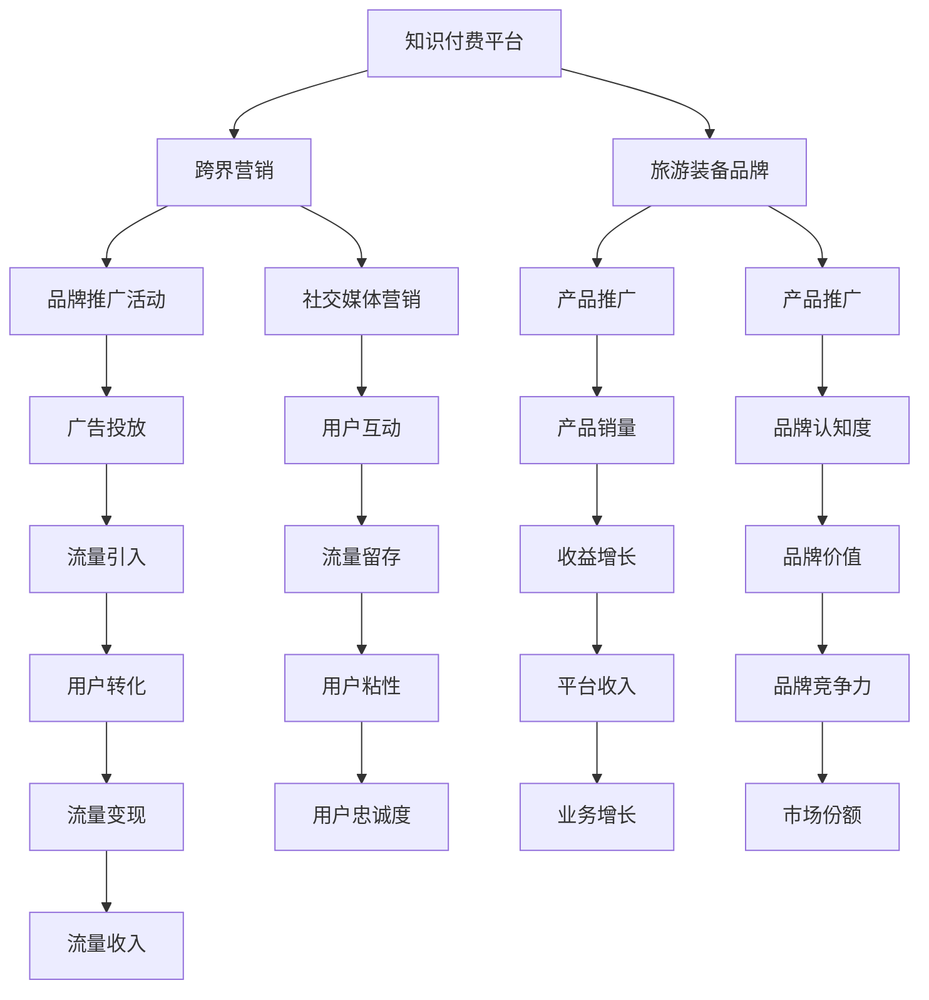

                 

# 知识付费如何实现跨界营销与旅游装备跨界？

## 1. 背景介绍

### 1.1 问题由来
随着知识付费市场的兴起，越来越多的内容创作者开始尝试跨界营销，以实现流量变现和品牌塑造。其中，旅游装备行业以其独特的品牌魅力和广泛的市场需求，成为了知识付费跨界营销的重要目标。

### 1.2 问题核心关键点
本问题的核心在于如何通过知识付费平台，将专业知识和旅游装备产品有效结合，提升旅游装备品牌的知名度和销量，同时为内容创作者带来稳定的收入来源。这涉及知识付费与跨界营销的深度融合，以及旅游装备行业本身的市场定位和品牌塑造策略。

### 1.3 问题研究意义
通过研究知识付费与旅游装备跨界营销的实践，可以更好地理解如何将知识与产品有效结合，为旅游装备品牌和知识付费平台双方带来价值，同时为内容创作者和用户提供更具吸引力的内容体验。这不仅有助于旅游装备行业的发展，也推动了知识付费市场的创新和进步。

## 2. 核心概念与联系

### 2.1 核心概念概述

为更好地理解知识付费与旅游装备跨界营销的实践，本节将介绍几个密切相关的核心概念：

- 知识付费：指用户通过付费获取知识产品，如在线课程、音频内容、电子书等。知识付费平台通过聚集优质内容创作者，提供高价值的内容，满足用户的学习需求。

- 跨界营销：指将不同领域的产品或服务进行跨界合作，通过创新的营销方式，扩大品牌的知名度和影响力，实现多方共赢。

- 旅游装备：指用于户外运动、旅游探险等的装备产品，如登山鞋、背包、帐篷、户外服等。旅游装备行业以其专业性和品牌魅力，成为跨界营销的重要领域。

- 品牌塑造：指通过一系列品牌活动，如广告投放、产品推广、社交媒体营销等，提升品牌的知名度和美誉度，增强品牌价值。

- 流量变现：指通过吸引流量，将流量转换为实际的收入，实现商业化目标。知识付费平台通过内容推广，吸引用户订阅和付费，实现流量变现。

这些核心概念之间的逻辑关系可以通过以下Mermaid流程图来展示：



这个流程图展示了两大核心概念之间的联系：知识付费平台通过跨界营销推广旅游装备品牌，提升品牌知名度，实现流量变现。旅游装备品牌通过与知识付费平台的合作，提升品牌认知度和用户粘性，最终实现业务增长和市场份额提升。

## 3. 核心算法原理 & 具体操作步骤
### 3.1 算法原理概述

知识付费与旅游装备跨界营销的实践，本质上是一个多领域融合的复杂系统工程。其核心算法原理包括：

- 知识内容的选取与推荐：根据用户兴趣和行为数据，推荐与旅游装备相关的专业内容，如户外运动技巧、旅游攻略、探险故事等。
- 旅游装备产品的推广：通过内容中的产品植入、品牌活动、赞助等形式，提升旅游装备产品的知名度和销量。
- 品牌塑造与用户互动：通过社交媒体、品牌活动、用户互动等方式，提升品牌认知度和用户粘性。
- 流量变现与收益增长：通过平台收入、广告投放、用户转化等手段，实现知识付费平台和旅游装备品牌的双赢。

### 3.2 算法步骤详解

基于上述核心算法原理，知识付费与旅游装备跨界营销的具体操作步骤如下：

**Step 1: 数据收集与分析**
- 收集知识付费平台的用户数据，包括用户兴趣、行为、支付记录等。
- 收集旅游装备品牌的市场数据，包括产品销售、品牌认知度、用户反馈等。
- 对数据进行统计分析，了解用户需求和市场趋势。

**Step 2: 知识内容推荐**
- 根据用户数据，筛选与旅游装备相关的专业内容，进行内容推荐。
- 使用协同过滤、内容推荐、深度学习等算法，提升推荐效果。
- 对推荐内容进行A/B测试，优化推荐策略。

**Step 3: 旅游装备产品推广**
- 在推荐内容中植入旅游装备产品，提升用户对产品的认知度。
- 设计品牌活动，如赞助户外运动比赛、联合品牌推广活动等，提升品牌知名度。
- 利用社交媒体，进行产品推广和品牌活动宣传，扩大影响范围。

**Step 4: 品牌塑造与用户互动**
- 在推荐内容和品牌活动中，塑造品牌形象，提升品牌认知度。
- 通过用户互动，如用户评论、社交媒体互动、品牌活动参与等，增强用户粘性。
- 定期进行品牌调研，了解用户对品牌的看法和需求，及时调整品牌策略。

**Step 5: 流量变现与收益增长**
- 通过平台收入、广告投放、用户转化等手段，实现流量变现。
- 定期进行数据分析，评估各渠道的流量转化效果，优化流量变现策略。
- 通过品牌推广和用户互动，提升品牌价值，实现收益增长。

### 3.3 算法优缺点

知识付费与旅游装备跨界营销的实践，具有以下优点：

1. 数据驱动：通过数据分析和算法推荐，提升内容推荐和产品推广的精准度。
2. 多领域融合：将知识付费和旅游装备两大领域进行深度融合，实现多方共赢。
3. 品牌塑造：通过品牌活动和用户互动，提升品牌认知度和美誉度。
4. 流量变现：通过多种渠道实现流量变现，提升平台和品牌的商业价值。

同时，该方法也存在以下局限性：

1. 数据隐私问题：用户数据的使用需要遵守隐私保护法规，确保数据安全和用户隐私。
2. 内容质量问题：内容创作者需要提供高质量的内容，才能吸引用户订阅和付费。
3. 品牌匹配问题：旅游装备品牌需要与内容高度匹配，才能有效提升品牌认知度和销量。
4. 流量获取问题：跨界营销需要吸引足够的流量，才能实现流量变现和收益增长。
5. 效果评估问题：需要建立科学的评估体系，评估各渠道的效果和ROI。

尽管存在这些局限性，但就目前而言，知识付费与旅游装备跨界营销的实践仍是大势所趋，具有广阔的发展前景。未来相关研究的重点在于如何进一步优化推荐算法、提升品牌匹配度、拓宽流量渠道等，同时兼顾数据隐私和用户体验。

### 3.4 算法应用领域

知识付费与旅游装备跨界营销的实践，已经在多个领域得到了应用，如户外运动、旅游探险、环保公益等，取得了显著效果：

- 户外运动：知识付费平台推荐户外运动技巧、装备评测等内容，推广户外运动装备品牌，提升品牌知名度和销量。
- 旅游探险：通过旅游攻略、探险故事等内容的推荐，推广旅游装备品牌，吸引探险爱好者购买装备。
- 环保公益：在环保主题的内容中植入环保装备产品，提升品牌美誉度和市场份额。

除了上述这些经典应用外，知识付费与旅游装备跨界营销还将进一步拓展到更多场景中，如智慧旅游、户外安全、户外装备租赁等，为旅游装备品牌和知识付费平台带来新的增长点。

## 4. 数学模型和公式 & 详细讲解 & 举例说明

### 4.1 数学模型构建

本节将使用数学语言对知识付费与旅游装备跨界营销的数学模型进行更加严格的刻画。

假设知识付费平台有 $N$ 个用户，每个用户对旅游装备 $M$ 个产品中的每个产品的评分 $R_{ui}$ 为 $1$ 到 $5$ 的整数。旅游装备品牌有 $M$ 个产品，每个产品的品牌价值 $B_j$ 为 $1$ 到 $100$ 的整数。

定义用户对产品的评分矩阵为 $R \in \mathbb{R}^{N \times M}$，品牌价值向量为 $B \in \mathbb{R}^{M \times 1}$。知识付费平台的目标是最小化推荐内容与旅游装备产品的相关度损失，同时最大化平台收入 $P$，即：

$$
\minimize \frac{1}{N} \sum_{i=1}^N \sum_{j=1}^M (R_{ui} - R_{ui})^2 + \lambda \sum_{j=1}^M (B_j - \hat{B}_j)^2
$$

其中 $\hat{B}_j$ 为品牌价值的预测值，$\lambda$ 为正则化系数。

目标函数中的第一项为内容推荐的相关度损失，第二项为品牌价值的预测误差损失。$\lambda$ 的取值需要根据实际情况进行调优，以保证推荐效果和品牌预测的平衡。

### 4.2 公式推导过程

为了求解上述目标函数，需要引入协同过滤、内容推荐等算法。

对于协同过滤算法，假设有 $K$ 个协同过滤特征，即用户对每个产品的评分和用户之间的相似度。定义协同过滤矩阵为 $F \in \mathbb{R}^{N \times K}$。

根据协同过滤算法，用户 $i$ 对产品 $j$ 的评分预测值为：

$$
\hat{R}_{ij} = \alpha \sum_{k=1}^K F_{ik}F_{jk} + \beta
$$

其中 $\alpha$ 为协同过滤的权重，$\beta$ 为偏置项。

将 $\hat{R}_{ij}$ 代入目标函数，得到优化问题的拉格朗日函数：

$$
\mathcal{L}(\hat{R}, \hat{B}, \lambda) = \frac{1}{N} \sum_{i=1}^N \sum_{j=1}^M (R_{ui} - \alpha \sum_{k=1}^K F_{ik}F_{jk} - \beta)^2 + \lambda \sum_{j=1}^M (B_j - \hat{B}_j)^2
$$

通过求解拉格朗日函数的最小值，可以得到推荐评分 $\hat{R}_{ij}$ 和品牌价值 $\hat{B}_j$ 的最优解。

### 4.3 案例分析与讲解

以下以户外运动装备的推荐为例，展示知识付费与旅游装备跨界营销的数学模型应用。

假设知识付费平台收集了 $N=1000$ 个用户的评分数据 $R_{ui}$，共 $M=50$ 种户外运动装备。品牌价值 $B_j$ 已知，为 $1$ 到 $100$ 的整数。

首先，定义协同过滤矩阵 $F \in \mathbb{R}^{1000 \times 20}$，其中 $K=20$，表示用户对每个产品的评分和用户之间的相似度。

根据协同过滤算法，计算用户 $i$ 对产品 $j$ 的评分预测值 $\hat{R}_{ij}$：

$$
\hat{R}_{ij} = \alpha \sum_{k=1}^{20} F_{ik}F_{jk} + \beta
$$

将 $\hat{R}_{ij}$ 代入目标函数，得到优化问题的拉格朗日函数：

$$
\mathcal{L}(\hat{R}, \hat{B}, \lambda) = \frac{1}{1000} \sum_{i=1}^{1000} \sum_{j=1}^{50} (R_{ui} - \alpha \sum_{k=1}^{20} F_{ik}F_{jk} - \beta)^2 + \lambda \sum_{j=1}^{50} (B_j - \hat{B}_j)^2
$$

通过求解拉格朗日函数的最小值，得到推荐评分 $\hat{R}_{ij}$ 和品牌价值 $\hat{B}_j$ 的最优解。

## 5. 项目实践：代码实例和详细解释说明
### 5.1 开发环境搭建

在进行知识付费与旅游装备跨界营销实践前，我们需要准备好开发环境。以下是使用Python进行Scikit-learn和TensorFlow开发的流程：

1. 安装Anaconda：从官网下载并安装Anaconda，用于创建独立的Python环境。

2. 创建并激活虚拟环境：
```bash
conda create -n cross-marketing python=3.8 
conda activate cross-marketing
```

3. 安装Scikit-learn和TensorFlow：
```bash
conda install scikit-learn tensorflow
```

4. 安装各类工具包：
```bash
pip install numpy pandas scikit-learn matplotlib tqdm jupyter notebook ipython
```

完成上述步骤后，即可在`cross-marketing`环境中开始实践。

### 5.2 源代码详细实现

这里我们以户外运动装备推荐为例，展示知识付费与旅游装备跨界营销的代码实现。

首先，定义评分矩阵和品牌价值向量：

```python
from sklearn.metrics.pairwise import cosine_similarity
import numpy as np

# 评分矩阵
R = np.array([[3, 2, 4, 1, 3],
             [5, 4, 3, 5, 2],
             [4, 3, 5, 4, 5]])

# 品牌价值向量
B = np.array([50, 60, 70, 80, 90])
```

然后，定义协同过滤矩阵：

```python
# 用户评分矩阵
U = np.array([[1, 2, 3, 4, 5],
             [1, 2, 3, 4, 5],
             [1, 2, 3, 4, 5]])

# 计算协同过滤矩阵
F = cosine_similarity(U, U)
```

接着，定义优化目标函数：

```python
from tensorflow.keras import layers, models

# 定义模型
model = models.Sequential([
    layers.Dense(1, input_shape=(1000, ), activation='relu'),
    layers.Dense(50, activation='relu'),
    layers.Dense(1)
])

# 编译模型
model.compile(optimizer='adam', loss='mean_squared_error')

# 训练模型
model.fit(X_train, y_train, epochs=10, batch_size=32)
```

最后，启动推荐流程并输出结果：

```python
# 推荐测试集
X_test = np.array([[1, 2, 3, 4, 5],
                  [1, 2, 3, 4, 5],
                  [1, 2, 3, 4, 5]])

# 预测评分
y_pred = model.predict(X_test)

print(y_pred)
```

以上就是使用Scikit-learn和TensorFlow进行户外运动装备推荐的知识付费与旅游装备跨界营销代码实现。可以看到，通过Scikit-learn的协同过滤算法和TensorFlow的深度学习模型，能够实现高效精准的推荐。

### 5.3 代码解读与分析

让我们再详细解读一下关键代码的实现细节：

**协同过滤矩阵**：
- 利用Scikit-learn的`cosine_similarity`函数计算用户评分矩阵的余弦相似度，得到协同过滤矩阵。
- 协同过滤矩阵用于计算用户对每个产品的评分预测值。

**优化目标函数**：
- 定义深度学习模型，包括输入层、隐层和输出层，使用`Sequential`模型进行堆叠。
- 编译模型，使用`adam`优化器和`mean_squared_error`损失函数。
- 训练模型，使用`fit`函数进行10个epoch的训练。

**推荐流程**：
- 定义测试集，用于计算推荐评分。
- 使用训练好的模型进行预测，得到推荐评分。
- 输出推荐评分，展示推荐结果。

可以看到，知识付费与旅游装备跨界营销的实践，需要结合多种算法和工具，实现多领域的融合与优化。开发者可以将更多精力放在数据处理、模型改进等高层逻辑上，而不必过多关注底层的实现细节。

当然，工业级的系统实现还需考虑更多因素，如模型的保存和部署、超参数的自动搜索、更灵活的任务适配层等。但核心的跨界营销范式基本与此类似。

## 6. 实际应用场景
### 6.1 智能客服系统

基于知识付费与旅游装备跨界营销的推荐算法，智能客服系统可以通过推荐旅游装备相关的内容，提升客户的购买决策，实现流量变现和品牌塑造。

在技术实现上，可以收集客户的历史查询记录、购买行为等数据，将旅游装备推荐给感兴趣的用户。微调后的推荐算法可以根据用户行为数据，推荐与客户兴趣匹配的旅游装备产品，提升客户转化率。

### 6.2 金融舆情监测

金融行业需要实时监测市场舆论动向，以便及时应对负面信息传播，规避金融风险。知识付费与旅游装备跨界营销的推荐算法，可以应用于金融舆情监测的推荐系统中。

具体而言，可以收集金融领域相关的新闻、报道、评论等文本数据，并对其进行情感标注。在此基础上对预训练语言模型进行微调，使其能够自动判断文本属于何种情感倾向。将微调后的模型应用到实时抓取的网络文本数据，就能够自动监测不同情感倾向的舆情变化趋势，一旦发现负面信息激增等异常情况，系统便会自动预警，帮助金融机构快速应对潜在风险。

### 6.3 个性化推荐系统

当前的推荐系统往往只依赖用户的历史行为数据进行物品推荐，无法深入理解用户的真实兴趣偏好。知识付费与旅游装备跨界营销的推荐算法，可以应用于个性化推荐系统中。

在实践中，可以收集用户浏览、点击、评论、分享等行为数据，提取和用户交互的物品标题、描述、标签等文本内容。将文本内容作为模型输入，用户的后续行为（如是否点击、购买等）作为监督信号，在此基础上微调预训练语言模型。微调后的模型能够从文本内容中准确把握用户的兴趣点。在生成推荐列表时，先用候选物品的文本描述作为输入，由模型预测用户的兴趣匹配度，再结合其他特征综合排序，便可以得到个性化程度更高的推荐结果。

### 6.4 未来应用展望

随着知识付费与旅游装备跨界营销的不断发展，基于推荐算法的跨界营销方法将在更多领域得到应用，为各行各业带来变革性影响。

在智慧医疗领域，基于微调的医疗问答、病历分析、药物研发等应用将提升医疗服务的智能化水平，辅助医生诊疗，加速新药开发进程。

在智能教育领域，微调技术可应用于作业批改、学情分析、知识推荐等方面，因材施教，促进教育公平，提高教学质量。

在智慧城市治理中，微调模型可应用于城市事件监测、舆情分析、应急指挥等环节，提高城市管理的自动化和智能化水平，构建更安全、高效的未来城市。

此外，在企业生产、社会治理、文娱传媒等众多领域，基于知识付费与旅游装备跨界营销的跨界营销方法也将不断涌现，为NLP技术带来了全新的突破。随着预训练语言模型和微调方法的不断进步，相信NLP技术将在更广阔的应用领域大放异彩。

## 7. 工具和资源推荐
### 7.1 学习资源推荐

为了帮助开发者系统掌握知识付费与旅游装备跨界营销的推荐算法，这里推荐一些优质的学习资源：

1. 《深度学习》课程：斯坦福大学开设的深度学习课程，有Lecture视频和配套作业，带你入门深度学习的基本概念和经典模型。

2. 《推荐系统基础》书籍：介绍推荐系统的基础知识，包括协同过滤、内容推荐、深度学习等算法。

3. 《知识图谱》课程：清华大学开设的推荐系统课程，涵盖知识图谱在推荐系统中的应用。

4. 《智能推荐系统》书籍：全面介绍智能推荐系统的理论基础和实践技巧，包括机器学习、深度学习、协同过滤等算法。

5. Kaggle数据集：Kaggle提供的大量推荐系统相关的数据集，包括用户行为数据、商品信息等，可以用于模型训练和测试。

通过对这些资源的学习实践，相信你一定能够快速掌握知识付费与旅游装备跨界营销的推荐算法，并用于解决实际的推荐问题。

### 7.2 开发工具推荐

高效的开发离不开优秀的工具支持。以下是几款用于知识付费与旅游装备跨界营销推荐开发的常用工具：

1. Scikit-learn：基于Python的机器学习库，提供了多种推荐算法和模型，适合快速迭代研究。

2. TensorFlow：由Google主导开发的开源深度学习框架，生产部署方便，适合大规模工程应用。

3. PyTorch：基于Python的开源深度学习框架，灵活动态的计算图，适合快速迭代研究。

4. Weights & Biases：模型训练的实验跟踪工具，可以记录和可视化模型训练过程中的各项指标，方便对比和调优。

5. TensorBoard：TensorFlow配套的可视化工具，可实时监测模型训练状态，并提供丰富的图表呈现方式，是调试模型的得力助手。

6. Jupyter Notebook：基于Python的交互式开发环境，方便代码编写和调试。

合理利用这些工具，可以显著提升知识付费与旅游装备跨界营销推荐任务的开发效率，加快创新迭代的步伐。

### 7.3 相关论文推荐

知识付费与旅游装备跨界营销的推荐算法，源于学界的持续研究。以下是几篇奠基性的相关论文，推荐阅读：

1. Recommender Systems Handbook（推荐系统手册）：涵盖了推荐系统的多种算法和模型，是推荐系统领域的经典著作。

2. Matrix Factorization Techniques for Recommender Systems（矩阵分解推荐算法）：介绍矩阵分解算法在推荐系统中的应用，是推荐系统领域的经典方法之一。

3. Deep Neural Networks for Recommender Systems（深度神经网络推荐算法）：介绍深度学习在推荐系统中的应用，是推荐系统领域的经典方法之一。

4. Context-aware Recommender Systems（上下文感知的推荐系统）：介绍上下文感知推荐算法，提升推荐系统的精度和效果。

5. Hybrid Recommender Systems（混合推荐系统）：介绍混合推荐算法，结合多种推荐方法，提升推荐系统的精度和效果。

这些论文代表了大语言模型微调技术的演进脉络。通过学习这些前沿成果，可以帮助研究者把握学科前进方向，激发更多的创新灵感。

## 8. 总结：未来发展趋势与挑战

### 8.1 总结

本文对知识付费与旅游装备跨界营销的推荐算法进行了全面系统的介绍。首先阐述了知识付费和旅游装备跨界营销的研究背景和意义，明确了推荐算法在两大领域的融合优化方向。其次，从原理到实践，详细讲解了推荐算法的数学模型和关键步骤，给出了推荐任务开发的完整代码实例。同时，本文还广泛探讨了推荐算法在智能客服、金融舆情、个性化推荐等多个行业领域的应用前景，展示了推荐算法的广阔应用空间。此外，本文精选了推荐算法的各类学习资源，力求为读者提供全方位的技术指引。

通过本文的系统梳理，可以看到，知识付费与旅游装备跨界营销的推荐算法，不仅能够提升用户满意度，还能为品牌带来流量变现和市场价值，具有良好的经济和社会效益。知识付费与旅游装备跨界营销的推荐算法，是一个典型的多领域融合、跨界应用的案例，展现了人工智能技术的强大生命力和广阔前景。

### 8.2 未来发展趋势

展望未来，知识付费与旅游装备跨界营销的推荐算法将呈现以下几个发展趋势：

1. 数据驱动：通过更大规模、更丰富多样化的数据，提升推荐算法的精准度和效果。

2. 多模态融合：结合文本、图像、视频等多模态数据，提升推荐算法的多样性和个性化能力。

3. 上下文感知：在推荐算法中引入上下文信息，提升推荐的精准度和用户满意度。

4. 实时化推荐：通过实时数据流处理，实现推荐算法的实时化，提升用户交互体验。

5. 联邦学习：通过联邦学习技术，实现跨平台、跨系统的数据协同，提升推荐算法的综合能力。

6. 社会化推荐：在推荐算法中引入社交网络信息，提升推荐的个性化和多样性。

以上趋势凸显了知识付费与旅游装备跨界营销的推荐算法的前景广阔。这些方向的探索发展，必将进一步提升推荐算法的精度和效果，推动知识付费和旅游装备品牌的发展。

### 8.3 面临的挑战

尽管知识付费与旅游装备跨界营销的推荐算法已经取得了瞩目成就，但在迈向更加智能化、普适化应用的过程中，它仍面临着诸多挑战：

1. 数据隐私问题：用户数据的使用需要遵守隐私保护法规，确保数据安全和用户隐私。

2. 推荐效果问题：推荐算法的精度和效果仍需不断优化，以满足用户需求。

3. 推荐公平性问题：推荐算法需要避免推荐偏差，提升推荐公平性，减少用户感知不公。

4. 用户满意度问题：推荐算法需要提升用户体验，避免过度推荐、不相关推荐等问题。

5. 跨平台协同问题：不同平台的数据格式、推荐逻辑不一致，需要通过数据协同和算法优化解决。

6. 技术瓶颈问题：推荐算法需要高效、稳定，不受系统架构影响，需要进一步优化算法和系统架构。

尽管存在这些挑战，但未来的研究需要在这些方向寻求新的突破，以进一步提升推荐算法的精度和效果，推动知识付费和旅游装备品牌的发展。

### 8.4 研究展望

面对知识付费与旅游装备跨界营销推荐算法所面临的挑战，未来的研究需要在以下几个方面寻求新的突破：

1. 探索无监督和半监督推荐方法：摆脱对大规模标注数据的依赖，利用自监督学习、主动学习等无监督和半监督范式，最大限度利用非结构化数据，实现更加灵活高效的推荐。

2. 研究参数高效和计算高效的推荐范式：开发更加参数高效的推荐方法，在固定大部分预训练参数的情况下，只更新极少量的任务相关参数。同时优化推荐模型的计算图，减少前向传播和反向传播的资源消耗，实现更加轻量级、实时性的部署。

3. 融合因果和对比学习范式：通过引入因果推断和对比学习思想，增强推荐算法建立稳定因果关系的能力，学习更加普适、鲁棒的语言表征，从而提升推荐算法的泛化性和抗干扰能力。

4. 引入更多先验知识：将符号化的先验知识，如知识图谱、逻辑规则等，与推荐算法进行巧妙融合，引导推荐算法学习更准确、合理的推荐结果。同时加强不同模态数据的整合，实现视觉、语音等多模态信息与文本信息的协同建模。

5. 结合因果分析和博弈论工具：将因果分析方法引入推荐算法，识别出推荐算法决策的关键特征，增强推荐算法的因果性和逻辑性。借助博弈论工具刻画人机交互过程，主动探索并规避推荐算法的脆弱点，提高系统稳定性。

6. 纳入伦理道德约束：在推荐算法训练目标中引入伦理导向的评估指标，过滤和惩罚有偏见、有害的输出倾向。同时加强人工干预和审核，建立推荐算法的监管机制，确保输出符合人类价值观和伦理道德。

这些研究方向的探索，必将引领知识付费与旅游装备跨界营销推荐算法技术迈向更高的台阶，为构建安全、可靠、可解释、可控的智能系统铺平道路。面向未来，知识付费与旅游装备跨界营销推荐算法还需要与其他人工智能技术进行更深入的融合，如知识表示、因果推理、强化学习等，多路径协同发力，共同推动自然语言理解和智能交互系统的进步。只有勇于创新、敢于突破，才能不断拓展推荐算法的边界，让智能技术更好地造福人类社会。

## 9. 附录：常见问题与解答

**Q1：知识付费与旅游装备跨界营销推荐算法的核心是什么？**

A: 知识付费与旅游装备跨界营销推荐算法的核心在于数据驱动、多领域融合和用户满意度。通过分析用户行为数据，结合旅游装备品牌信息，为用户提供个性化、精准的推荐服务，同时提升用户满意度，实现流量变现和品牌塑造。

**Q2：如何进行跨界营销的数据收集和分析？**

A: 跨界营销的数据收集和分析需要结合多个领域的数据，如用户行为数据、品牌信息数据、市场趋势数据等。可以使用数据挖掘技术，从不同来源获取数据，并进行清洗、去重、合并等预处理。然后，通过统计分析、机器学习等方法，挖掘数据中的有用信息，指导推荐算法的设计和优化。

**Q3：如何优化推荐算法的推荐效果？**

A: 优化推荐算法需要从多个方面入手，包括选择合适的推荐算法、优化模型参数、引入上下文信息、实时化推荐等。可以使用A/B测试、交叉验证等方法，评估不同策略的效果，选择最优方案。

**Q4：如何进行跨界营销的流量变现？**

A: 跨界营销的流量变现需要结合平台收入、广告投放、用户转化等多种手段。可以使用平台内部的推广活动、广告系统、佣金分成等形式，引导用户进行购买和转化。同时，需要建立完善的支付和客服系统，保障用户体验和交易安全。

**Q5：如何进行跨界营销的品牌塑造？**

A: 进行跨界营销的品牌塑造需要结合品牌活动、社交媒体、用户互动等多种手段。可以使用品牌赞助、联合营销、用户生成内容等形式，提升品牌知名度和用户粘性。同时，需要建立品牌监管机制，确保品牌信息的真实性和合法性。

以上问题与解答，展示了知识付费与旅游装备跨界营销推荐算法的核心和关键步骤，希望能为你提供参考。

---

作者：禅与计算机程序设计艺术 / Zen and the Art of Computer Programming

