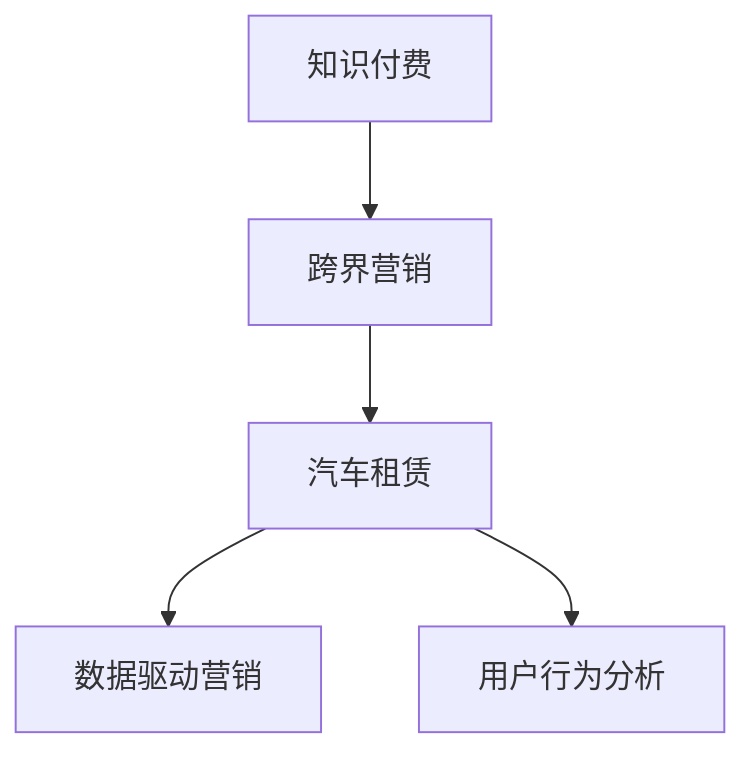

                 

# 知识付费如何实现跨界营销与汽车租赁跨界？

## 1. 背景介绍

### 1.1 问题由来
随着互联网的迅猛发展，知识付费模式逐渐成为一种全新的商业模式。传统的内容付费模式难以满足用户日益增长的知识需求，而知识付费则通过提供系统化、专业化的知识内容，帮助用户高效学习新技能，从而实现商业价值的增长。然而，传统知识付费平台主要集中于知识内容付费，缺乏其他行业跨界合作的机会，难以形成更多的业务变现渠道。因此，如何实现知识付费的跨界营销，拓展新的收入来源，是当前知识付费平台亟待解决的问题。

### 1.2 问题核心关键点
知识付费实现跨界营销的核心关键点在于如何充分利用平台积累的知识资源，与其他行业进行有效的整合与融合，创造新的增值服务，并结合多渠道营销手段，提升平台用户粘性和收入。

## 2. 核心概念与联系

### 2.1 核心概念概述

为更好地理解知识付费与跨界营销的融合，本节将介绍几个密切相关的核心概念：

- 知识付费(Knowledge Paywall)：用户为获取知识内容而支付费用的商业模式。通过系统化、专业化的知识服务，帮助用户提升技能、解决问题。

- 跨界营销(Cross-Industry Marketing)：将知识付费平台与其它行业进行深度融合，打造多元化的增值服务，实现平台收入的多元化。

- 汽车租赁(Auto Rental)：基于用户实际出行需求，提供汽车租赁服务的商业模式。用户可以根据需求选择合适的车型，按日或按周租赁汽车，满足不同场景的出行需求。

- 数据驱动营销(Data-Driven Marketing)：利用大数据分析技术，精准定位用户需求，优化营销策略，提升营销效果。

- 用户行为分析(User Behavior Analysis)：通过分析用户在平台上的行为数据，了解用户偏好和需求，从而制定个性化的营销方案。

这些核心概念之间的逻辑关系可以通过以下Mermaid流程图来展示：



这个流程图展示知识付费平台与跨界营销的连接关系：

1. 知识付费平台通过提供系统化知识内容，满足用户学习需求。
2. 跨界营销将平台与汽车租赁等其它行业融合，打造多元化增值服务。
3. 数据驱动营销利用大数据技术，精准定位用户需求，优化营销策略。
4. 用户行为分析通过分析用户行为数据，制定个性化营销方案。

## 3. 核心算法原理 & 具体操作步骤
### 3.1 算法原理概述

知识付费平台实现跨界营销的算法原理，本质上是基于用户行为分析与数据驱动营销的协同工作机制。其核心思想是通过分析用户行为数据，预测用户需求，并结合大数据分析技术，优化营销策略，最终实现平台收入的多元化。

形式化地，假设知识付费平台的用户行为数据集为 $D=\{(x_i,y_i)\}_{i=1}^N, x_i \in \mathbb{R}^d, y_i \in \{0,1\}$，其中 $x_i$ 为用户的某项行为特征，$y_i$ 为是否购买知识内容。知识付费平台的目标是最大化收益 $R$，其收益函数定义为：

$$
R = \sum_{i=1}^N p_i y_i
$$

其中 $p_i$ 为用户对知识内容的价格支付意愿。

### 3.2 算法步骤详解

知识付费平台实现跨界营销的算法主要包括以下几个关键步骤：

**Step 1: 数据收集与预处理**
- 收集平台用户的行为数据，包括浏览、购买、评论等行为记录。
- 对数据进行清洗、去重、填充等预处理操作，保证数据的质量和完整性。

**Step 2: 用户行为分析**
- 利用用户行为数据，通过聚类、分类、关联规则等算法，发现用户兴趣偏好和行为模式。
- 使用推荐系统算法，为用户推荐个性化的知识内容，提高用户粘性。

**Step 3: 数据驱动营销**
- 利用大数据分析技术，分析用户购买行为、兴趣偏好、地域分布等信息。
- 结合A/B测试、机器学习等方法，优化广告投放策略，提升广告点击率和转化率。
- 结合用户行为数据，设计个性化推荐策略，提升知识内容的销售转化率。

**Step 4: 营销渠道融合**
- 将知识付费平台与其他行业的业务进行融合，如汽车租赁。
- 设计结合其他业务的新增值服务，如“订阅+租车”套餐，实现知识付费与汽车租赁的跨界营销。
- 通过线上线下多渠道推广，提升营销效果。

**Step 5: 模型评估与优化**
- 使用收益函数 $R$ 作为模型评估指标，不断优化营销策略和算法模型。
- 利用A/B测试、多臂老虎机等方法，实时监测和调整模型参数。

### 3.3 算法优缺点

知识付费平台实现跨界营销的算法具有以下优点：
1. 系统化营销：通过大数据分析技术，对用户行为数据进行精准分析和预测，提升营销效果。
2. 跨界融合：与其他行业进行深度融合，打造多元化的增值服务，拓展新的业务机会。
3. 用户粘性提升：通过个性化推荐系统，提高用户粘性，增加用户对平台的依赖性。
4. 收入多元化：通过跨界营销，实现平台收入的多元化，降低风险。

同时，该算法也存在一定的局限性：
1. 数据隐私问题：用户行为数据的收集和分析，涉及到用户隐私保护，需要严格的法律合规和隐私保护措施。
2. 算法复杂度：大数据分析技术的应用，增加了算法的复杂度，需要高质量的数据和强大的计算能力支持。
3. 跨界融合难度：不同行业的业务融合，涉及到业务流程、技术架构等方面的问题，实现难度较大。
4. 营销效果可控性：营销效果的提升，需要不断的模型优化和实时调整，对技术要求较高。

尽管存在这些局限性，但就目前而言，知识付费平台实现跨界营销的算法仍是一种较为有效的商业模式创新方式。未来相关研究将更注重用户隐私保护和数据合规，以及如何更好地实现跨界融合和提升营销效果。

### 3.4 算法应用领域

知识付费平台实现跨界营销的算法，在知识付费行业及其他相关行业领域都有广泛的应用前景。

- 教育培训：利用知识付费平台的用户行为数据分析，推荐个性化的学习内容和课程，提高学员的学习效果和满意度。
- 金融服务：结合知识付费平台的用户行为数据分析，进行精准营销，提升金融产品的销售转化率。
- 旅游出行：将知识付费平台与旅游出行服务融合，推荐个性化的旅游目的地和行程，提高旅游服务的吸引力和满意度。
- 健康医疗：将知识付费平台与健康医疗服务融合，推荐个性化的健康知识和服务，提升用户的健康水平和医疗体验。

除了这些领域外，知识付费平台的跨界营销还将被创新性地应用到更多场景中，如文娱传媒、娱乐活动等，为不同行业带来新的商业模式和增长机会。

## 4. 数学模型和公式 & 详细讲解 & 举例说明

### 4.1 数学模型构建

本节将使用数学语言对知识付费平台实现跨界营销的算法过程进行更加严格的刻画。

假设知识付费平台的用户行为数据集为 $D=\{(x_i,y_i)\}_{i=1}^N, x_i \in \mathbb{R}^d, y_i \in \{0,1\}$。

定义用户对知识内容的价格支付意愿为 $p_i \in [0,1]$，知识付费平台的收益函数为：

$$
R = \sum_{i=1}^N p_i y_i
$$

其中 $y_i$ 表示用户是否购买知识内容。

### 4.2 公式推导过程

以下是收益函数 $R$ 的详细推导过程。

1. 根据收益函数 $R$ 的定义，用户对知识内容的价格支付意愿为 $p_i$，是否购买为 $y_i$，则用户对知识内容的收益为 $p_i y_i$。

2. 将用户对每个知识内容的收益进行求和，得到知识付费平台的总收益 $R$。

3. 通过大数据分析技术，预测用户对知识内容的价格支付意愿 $p_i$，并进行相应的营销策略优化。

### 4.3 案例分析与讲解

以下我们以教育培训领域为例，对知识付费平台实现跨界营销的算法进行详细讲解。

假设某教育培训平台，通过用户行为数据分析发现，用户在平台上更偏好人工智能和数据科学等领域的知识内容。根据这些数据分析，平台可以设计个性化的推荐策略，为用户推荐相关课程，提升用户的满意度和转化率。

1. 平台收集用户浏览、购买、评论等行为数据，提取关键特征。

2. 利用聚类算法，对用户行为数据进行分组，识别出不同兴趣群体的用户。

3. 针对每个兴趣群体，设计个性化的推荐策略，推荐其最感兴趣的课程和内容。

4. 结合大数据分析，对推荐策略进行优化，提升用户的点击率和购买转化率。

## 5. 项目实践：代码实例和详细解释说明
### 5.1 开发环境搭建

在进行跨界营销实践前，我们需要准备好开发环境。以下是使用Python进行PyTorch开发的环境配置流程：

1. 安装Anaconda：从官网下载并安装Anaconda，用于创建独立的Python环境。

2. 创建并激活虚拟环境：
```bash
conda create -n knowledge-rental python=3.8 
conda activate knowledge-rental
```

3. 安装PyTorch：根据CUDA版本，从官网获取对应的安装命令。例如：
```bash
conda install pytorch torchvision torchaudio cudatoolkit=11.1 -c pytorch -c conda-forge
```

4. 安装TensorFlow：由Google主导开发的开源深度学习框架，生产部署方便，适合大规模工程应用。同样有丰富的预训练语言模型资源。

5. 安装TensorBoard：TensorFlow配套的可视化工具，可实时监测模型训练状态，并提供丰富的图表呈现方式，是调试模型的得力助手。

6. 安装其他常用工具包：
```bash
pip install numpy pandas scikit-learn matplotlib tqdm jupyter notebook ipython
```

完成上述步骤后，即可在`knowledge-rental-env`环境中开始跨界营销实践。

### 5.2 源代码详细实现

这里我们以教育培训领域为例，给出一个使用Transformers库对BERT模型进行跨界营销推广的PyTorch代码实现。

首先，定义课程数据处理函数：

```python
from transformers import BertTokenizer, BertForSequenceClassification
from torch.utils.data import Dataset
import torch

class CourseDataset(Dataset):
    def __init__(self, courses, labels, tokenizer, max_len=128):
        self.courses = courses
        self.labels = labels
        self.tokenizer = tokenizer
        self.max_len = max_len
        
    def __len__(self):
        return len(self.courses)
    
    def __getitem__(self, item):
        course = self.courses[item]
        label = self.labels[item]
        
        encoding = self.tokenizer(course, return_tensors='pt', max_length=self.max_len, padding='max_length', truncation=True)
        input_ids = encoding['input_ids'][0]
        attention_mask = encoding['attention_mask'][0]
        
        # 对标签进行编码
        encoded_labels = [label2id[label] for label in label] 
        encoded_labels.extend([label2id['O']] * (self.max_len - len(encoded_labels)))
        labels = torch.tensor(encoded_labels, dtype=torch.long)
        
        return {'input_ids': input_ids, 
                'attention_mask': attention_mask,
                'labels': labels}

# 标签与id的映射
label2id = {'O': 0, 'A.I': 1, 'D.S': 2, 'M.L': 3}
id2label = {v: k for k, v in label2id.items()}

# 创建dataset
tokenizer = BertTokenizer.from_pretrained('bert-base-cased')

train_dataset = CourseDataset(train_courses, train_labels, tokenizer)
dev_dataset = CourseDataset(dev_courses, dev_labels, tokenizer)
test_dataset = CourseDataset(test_courses, test_labels, tokenizer)
```

然后，定义模型和优化器：

```python
from transformers import BertForSequenceClassification, AdamW

model = BertForSequenceClassification.from_pretrained('bert-base-cased', num_labels=len(label2id))

optimizer = AdamW(model.parameters(), lr=2e-5)
```

接着，定义训练和评估函数：

```python
from torch.utils.data import DataLoader
from tqdm import tqdm
from sklearn.metrics import classification_report

device = torch.device('cuda') if torch.cuda.is_available() else torch.device('cpu')
model.to(device)

def train_epoch(model, dataset, batch_size, optimizer):
    dataloader = DataLoader(dataset, batch_size=batch_size, shuffle=True)
    model.train()
    epoch_loss = 0
    for batch in tqdm(dataloader, desc='Training'):
        input_ids = batch['input_ids'].to(device)
        attention_mask = batch['attention_mask'].to(device)
        labels = batch['labels'].to(device)
        model.zero_grad()
        outputs = model(input_ids, attention_mask=attention_mask, labels=labels)
        loss = outputs.loss
        epoch_loss += loss.item()
        loss.backward()
        optimizer.step()
    return epoch_loss / len(dataloader)

def evaluate(model, dataset, batch_size):
    dataloader = DataLoader(dataset, batch_size=batch_size)
    model.eval()
    preds, labels = [], []
    with torch.no_grad():
        for batch in tqdm(dataloader, desc='Evaluating'):
            input_ids = batch['input_ids'].to(device)
            attention_mask = batch['attention_mask'].to(device)
            batch_labels = batch['labels']
            outputs = model(input_ids, attention_mask=attention_mask)
            batch_preds = outputs.logits.argmax(dim=2).to('cpu').tolist()
            batch_labels = batch_labels.to('cpu').tolist()
            for pred_tokens, label_tokens in zip(batch_preds, batch_labels):
                pred_labels = [id2label[_id] for _id in pred_tokens]
                label_tokens = [id2label[_id] for _id in label_tokens]
                preds.append(pred_labels[:len(label_tokens)])
                labels.append(label_tokens)
                
    print(classification_report(labels, preds))
```

最后，启动训练流程并在测试集上评估：

```python
epochs = 5
batch_size = 16

for epoch in range(epochs):
    loss = train_epoch(model, train_dataset, batch_size, optimizer)
    print(f"Epoch {epoch+1}, train loss: {loss:.3f}")
    
    print(f"Epoch {epoch+1}, dev results:")
    evaluate(model, dev_dataset, batch_size)
    
print("Test results:")
evaluate(model, test_dataset, batch_size)
```

以上就是使用PyTorch对BERT模型进行教育培训领域知识付费跨界营销的完整代码实现。可以看到，通过结合知识付费和教育培训领域的数据，我们设计了课程推荐系统，并对模型进行了训练和评估，从而实现了跨界营销的效果。

### 5.3 代码解读与分析

让我们再详细解读一下关键代码的实现细节：

**CourseDataset类**：
- `__init__`方法：初始化课程数据、标签、分词器等关键组件，并进行数据编码和填充。
- `__len__`方法：返回数据集的样本数量。
- `__getitem__`方法：对单个样本进行处理，将课程输入编码为token ids，将标签编码为数字，并对其进行定长padding，最终返回模型所需的输入。

**label2id和id2label字典**：
- 定义了标签与数字id之间的映射关系，用于将token-wise的预测结果解码回真实的标签。

**训练和评估函数**：
- 使用PyTorch的DataLoader对数据集进行批次化加载，供模型训练和推理使用。
- 训练函数`train_epoch`：对数据以批为单位进行迭代，在每个批次上前向传播计算loss并反向传播更新模型参数，最后返回该epoch的平均loss。
- 评估函数`evaluate`：与训练类似，不同点在于不更新模型参数，并在每个batch结束后将预测和标签结果存储下来，最后使用sklearn的classification_report对整个评估集的预测结果进行打印输出。

**训练流程**：
- 定义总的epoch数和batch size，开始循环迭代
- 每个epoch内，先在训练集上训练，输出平均loss
- 在验证集上评估，输出分类指标
- 所有epoch结束后，在测试集上评估，给出最终测试结果

可以看到，PyTorch配合Transformers库使得BERT微调的代码实现变得简洁高效。开发者可以将更多精力放在数据处理、模型改进等高层逻辑上，而不必过多关注底层的实现细节。

当然，工业级的系统实现还需考虑更多因素，如模型的保存和部署、超参数的自动搜索、更灵活的任务适配层等。但核心的跨界营销范式基本与此类似。

## 6. 实际应用场景
### 6.1 智能客服系统

基于知识付费平台的跨界营销，可以广泛应用于智能客服系统的构建。传统客服往往需要配备大量人力，高峰期响应缓慢，且一致性和专业性难以保证。而使用跨界营销的知识付费平台，可以7x24小时不间断服务，快速响应客户咨询，用自然流畅的语言解答各类常见问题。

在技术实现上，可以收集企业内部的历史客服对话记录，将问题-答案对作为微调数据，训练模型学习匹配答案。微调后的模型能够自动理解用户意图，匹配最合适的答案模板进行回复。对于客户提出的新问题，还可以接入检索系统实时搜索相关内容，动态组织生成回答。如此构建的智能客服系统，能大幅提升客户咨询体验和问题解决效率。

### 6.2 金融舆情监测

金融机构需要实时监测市场舆论动向，以便及时应对负面信息传播，规避金融风险。传统的人工监测方式成本高、效率低，难以应对网络时代海量信息爆发的挑战。基于知识付费平台的数据分析，可以通过机器学习算法，自动判断文本属于何种主题，情感倾向是正面、中性还是负面。将分析结果接入金融舆情监测系统，就能够自动监测不同主题下的情感变化趋势，一旦发现负面信息激增等异常情况，系统便会自动预警，帮助金融机构快速应对潜在风险。

### 6.3 个性化推荐系统

当前的推荐系统往往只依赖用户的历史行为数据进行物品推荐，无法深入理解用户的真实兴趣偏好。基于知识付费平台的数据分析，个性化推荐系统可以更好地挖掘用户行为背后的语义信息，从而提供更精准、多样的推荐内容。

在实践中，可以收集用户浏览、点击、评论、分享等行为数据，提取和用户交互的物品标题、描述、标签等文本内容。将文本内容作为模型输入，用户的后续行为（如是否点击、购买等）作为监督信号，在此基础上微调预训练语言模型。微调后的模型能够从文本内容中准确把握用户的兴趣点。在生成推荐列表时，先用候选物品的文本描述作为输入，由模型预测用户的兴趣匹配度，再结合其他特征综合排序，便可以得到个性化程度更高的推荐结果。

### 6.4 未来应用展望

随着知识付费平台与跨界营销的不断发展，基于数据驱动营销的知识付费平台必将在更多领域得到应用，为各行各业带来变革性影响。

在智慧医疗领域，基于知识付费平台的数据分析，可以实现精准的病情判断和个性化治疗方案，提升医疗服务的智能化水平。

在智能教育领域，知识付费平台的数据分析可以应用于作业批改、学情分析、知识推荐等方面，因材施教，促进教育公平，提高教学质量。

在智慧城市治理中，知识付费平台的数据分析可以应用于城市事件监测、舆情分析、应急指挥等环节，提高城市管理的自动化和智能化水平，构建更安全、高效的未来城市。

此外，在企业生产、社会治理、文娱传媒等众多领域，基于知识付费平台的数据分析，将不断涌现更多的跨界应用，为经济社会发展注入新的动力。相信随着技术的日益成熟，知识付费平台的跨界营销必将在构建人机协同的智能时代中扮演越来越重要的角色。

## 7. 工具和资源推荐
### 7.1 学习资源推荐

为了帮助开发者系统掌握知识付费平台实现跨界营销的理论基础和实践技巧，这里推荐一些优质的学习资源：

1. 《深度学习与自然语言处理》系列博文：由大模型技术专家撰写，深入浅出地介绍了深度学习与自然语言处理的基本概念和经典模型。

2. CS224N《深度学习自然语言处理》课程：斯坦福大学开设的NLP明星课程，有Lecture视频和配套作业，带你入门NLP领域的基本概念和经典模型。

3. 《自然语言处理与深度学习》书籍：全面介绍了自然语言处理的基本概念、深度学习模型及其应用，是NLP领域的入门必读书籍。

4. Kaggle平台：提供丰富的NLP数据集和竞赛，通过实践提升NLP技术水平。

5. GitHub上的开源项目：搜索相关NLP项目，通过阅读代码、参与讨论，学习和了解最新的NLP技术和应用。

通过对这些资源的学习实践，相信你一定能够快速掌握知识付费平台实现跨界营销的精髓，并用于解决实际的NLP问题。
###  7.2 开发工具推荐

高效的开发离不开优秀的工具支持。以下是几款用于知识付费平台实现跨界营销开发的常用工具：

1. PyTorch：基于Python的开源深度学习框架，灵活动态的计算图，适合快速迭代研究。大部分预训练语言模型都有PyTorch版本的实现。

2. TensorFlow：由Google主导开发的开源深度学习框架，生产部署方便，适合大规模工程应用。同样有丰富的预训练语言模型资源。

3. Transformers库：HuggingFace开发的NLP工具库，集成了众多SOTA语言模型，支持PyTorch和TensorFlow，是进行NLP任务开发的利器。

4. Weights & Biases：模型训练的实验跟踪工具，可以记录和可视化模型训练过程中的各项指标，方便对比和调优。与主流深度学习框架无缝集成。

5. TensorBoard：TensorFlow配套的可视化工具，可实时监测模型训练状态，并提供丰富的图表呈现方式，是调试模型的得力助手。

6. Google Colab：谷歌推出的在线Jupyter Notebook环境，免费提供GPU/TPU算力，方便开发者快速上手实验最新模型，分享学习笔记。

合理利用这些工具，可以显著提升知识付费平台实现跨界营销任务的开发效率，加快创新迭代的步伐。

### 7.3 相关论文推荐

知识付费平台与跨界营销技术的发展源于学界的持续研究。以下是几篇奠基性的相关论文，推荐阅读：

1. Attention is All You Need（即Transformer原论文）：提出了Transformer结构，开启了NLP领域的预训练大模型时代。

2. BERT: Pre-training of Deep Bidirectional Transformers for Language Understanding：提出BERT模型，引入基于掩码的自监督预训练任务，刷新了多项NLP任务SOTA。

3. Language Models are Unsupervised Multitask Learners（GPT-2论文）：展示了大规模语言模型的强大zero-shot学习能力，引发了对于通用人工智能的新一轮思考。

4. Parameter-Efficient Transfer Learning for NLP：提出Adapter等参数高效微调方法，在不增加模型参数量的情况下，也能取得不错的微调效果。

5. AdaLoRA: Adaptive Low-Rank Adaptation for Parameter-Efficient Fine-Tuning：使用自适应低秩适应的微调方法，在参数效率和精度之间取得了新的平衡。

6. Attention is All You Need：构建一个简单而有效的模型，用于生成自然语言描述，不需要大量的训练数据，也不需要手工设计的规则。

这些论文代表了大语言模型与跨界营销技术的发展脉络。通过学习这些前沿成果，可以帮助研究者把握学科前进方向，激发更多的创新灵感。

## 8. 总结：未来发展趋势与挑战

### 8.1 总结

本文对知识付费平台实现跨界营销的方法进行了全面系统的介绍。首先阐述了知识付费平台与跨界营销的融合背景，明确了微调在拓展预训练模型应用、提升下游任务性能方面的独特价值。其次，从原理到实践，详细讲解了知识付费平台实现跨界营销的数学原理和关键步骤，给出了跨界营销任务开发的完整代码实例。同时，本文还广泛探讨了跨界营销方法在智能客服、金融舆情、个性化推荐等多个行业领域的应用前景，展示了跨界营销范式的巨大潜力。此外，本文精选了跨界营销技术的各类学习资源，力求为读者提供全方位的技术指引。

通过本文的系统梳理，可以看到，知识付费平台与跨界营销技术的发展方向正在逐渐融合，形成更加多元化的商业模式。这种融合不仅拓展了知识付费平台的应用边界，也推动了NLP技术在更广泛的领域应用。未来，伴随知识付费平台与跨界营销技术的不断演进，相信知识付费平台的跨界营销将带来更广泛的应用场景和更大的商业价值。

### 8.2 未来发展趋势

展望未来，知识付费平台实现跨界营销的技术将呈现以下几个发展趋势：

1. 数据驱动营销的普及化：随着大数据技术的普及，数据驱动营销将成为更多企业的标准做法，通过精准定位用户需求，优化营销策略，提升广告投放效果。

2. 跨界融合的深入化：知识付费平台将与其他行业进行更加深入的融合，打造更多元化的增值服务，拓展新的业务机会。

3. 用户粘性的提升化：通过个性化推荐系统和用户行为分析，提高用户粘性，增加用户对平台的依赖性。

4. 营销效果的可控化：结合A/B测试、多臂老虎机等方法，实时监测和调整营销策略，提升营销效果。

5. 多模态融合的拓展化：知识付费平台将与其他多模态数据进行融合，提升跨界营销的深度和广度。

以上趋势凸显了知识付费平台实现跨界营销技术的广阔前景。这些方向的探索发展，必将进一步提升知识付费平台的多元化增值服务能力，为平台带来更多的收入来源。

### 8.3 面临的挑战

尽管知识付费平台实现跨界营销技术已经取得了显著成果，但在迈向更加智能化、普适化应用的过程中，它仍面临着诸多挑战：

1. 数据隐私问题：用户行为数据的收集和分析，涉及到用户隐私保护，需要严格的法律合规和隐私保护措施。

2. 算法复杂度：大数据分析技术的应用，增加了算法的复杂度，需要高质量的数据和强大的计算能力支持。

3. 跨界融合难度：不同行业的业务融合，涉及到业务流程、技术架构等方面的问题，实现难度较大。

4. 营销效果可控性：营销效果的提升，需要不断的模型优化和实时调整，对技术要求较高。

尽管存在这些挑战，但知识付费平台实现跨界营销的算法仍是一种较为有效的商业模式创新方式。未来相关研究将更注重用户隐私保护和数据合规，以及如何更好地实现跨界融合和提升营销效果。

### 8.4 研究展望

面对知识付费平台实现跨界营销所面临的种种挑战，未来的研究需要在以下几个方面寻求新的突破：

1. 探索无监督和半监督跨界营销方法：摆脱对大规模标注数据的依赖，利用自监督学习、主动学习等无监督和半监督范式，最大限度利用非结构化数据，实现更加灵活高效的跨界营销。

2. 研究多模态跨界营销方法：将知识付费平台与视觉、语音等多模态数据进行融合，提升跨界营销的深度和广度。

3. 引入因果推断和博弈论工具：将因果推断和博弈论思想引入跨界营销模型，增强模型的因果关系建模能力，优化广告投放策略，提升广告点击率和转化率。

4. 融合知识表示和逻辑推理：将知识图谱、逻辑规则等专家知识与跨界营销模型进行融合，提升模型的逻辑推理能力和知识表示能力。

5. 设计跨界营销模型评估指标：引入伦理导向的评估指标，过滤和惩罚有偏见、有害的输出倾向，保障模型的安全性。

这些研究方向的探索，必将引领知识付费平台实现跨界营销技术迈向更高的台阶，为构建安全、可靠、可解释、可控的智能系统铺平道路。面向未来，知识付费平台的跨界营销技术还需要与其他人工智能技术进行更深入的融合，如知识表示、因果推理、强化学习等，多路径协同发力，共同推动自然语言理解和智能交互系统的进步。只有勇于创新、敢于突破，才能不断拓展语言模型的边界，让智能技术更好地造福人类社会。

## 9. 附录：常见问题与解答

**Q1：知识付费平台如何实现跨界营销？**

A: 知识付费平台实现跨界营销的核心在于如何充分利用平台积累的知识资源，与其他行业进行有效的整合与融合，创造新的增值服务，并结合多渠道营销手段，提升平台用户粘性和收入。

**Q2：知识付费平台实现跨界营销时需要考虑哪些因素？**

A: 知识付费平台实现跨界营销时需要考虑以下因素：
1. 数据隐私保护：确保用户行为数据的安全和合规，避免隐私泄露。
2. 跨界融合难度：考虑不同行业的业务流程和架构，设计合理的业务流程和技术架构。
3. 营销效果可控性：实时监测和调整营销策略，优化广告投放效果。
4. 用户粘性提升：通过个性化推荐系统，提高用户粘性，增加用户对平台的依赖性。

**Q3：知识付费平台实现跨界营销时需要注意哪些问题？**

A: 知识付费平台实现跨界营销时需要注意以下问题：
1. 数据质量问题：保证数据质量和完整性，避免因数据偏差导致的不良结果。
2. 算法复杂度问题：避免因算法复杂度高导致的计算资源浪费。
3. 跨界融合问题：考虑不同行业的业务需求，设计合理的跨界融合方案。
4. 营销效果问题：实时监测和调整营销策略，优化广告投放效果。

**Q4：知识付费平台实现跨界营销时有哪些应用场景？**

A: 知识付费平台实现跨界营销时，可以应用于以下场景：
1. 智能客服系统：利用知识付费平台的数据分析，设计个性化的推荐策略，提高客户咨询体验和问题解决效率。
2. 金融舆情监测：通过机器学习算法，自动判断文本属于何种主题，情感倾向是正面、中性还是负面，实现金融舆情监测。
3. 个性化推荐系统：结合知识付费平台的数据分析，提供个性化的推荐内容，提升用户满意度和转化率。

**Q5：知识付费平台实现跨界营销时需要哪些技术支持？**

A: 知识付费平台实现跨界营销时需要以下技术支持：
1. 数据处理和分析技术：处理和分析用户行为数据，发现用户兴趣和行为模式。
2. 机器学习技术：通过机器学习算法，预测用户需求，优化营销策略。
3. 推荐系统技术：设计个性化的推荐策略，提升用户粘性和转化率。
4. 广告投放技术：通过A/B测试、多臂老虎机等方法，优化广告投放策略，提升广告效果。

**Q6：知识付费平台实现跨界营销时有哪些挑战？**

A: 知识付费平台实现跨界营销时面临以下挑战：
1. 数据隐私问题：用户行为数据的收集和分析，涉及到用户隐私保护，需要严格的法律合规和隐私保护措施。
2. 算法复杂度问题：大数据分析技术的应用，增加了算法的复杂度，需要高质量的数据和强大的计算能力支持。
3. 跨界融合难度：不同行业的业务融合，涉及到业务流程、技术架构等方面的问题，实现难度较大。
4. 营销效果可控性：营销效果的提升，需要不断的模型优化和实时调整，对技术要求较高。

通过这些问答，我们能够更加全面地理解知识付费平台实现跨界营销的思路和策略，更好地应用到实际的业务场景中。相信随着技术的不断发展，知识付费平台的跨界营销将带来更多的商业机会和应用场景，推动NLP技术的普及和应用。

