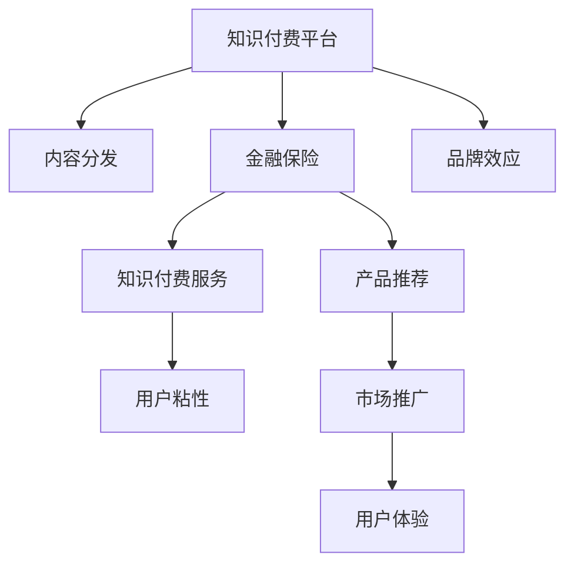

                 

# 知识付费如何实现跨界营销与金融保险跨界？

## 1. 背景介绍

在互联网技术飞速发展的今天，知识付费平台已经成为一个崭新的信息交互平台。随着人们对知识的需求日益增长，知识付费平台从单一的付费内容分发，逐渐演变为集内容、服务、社交于一体的知识生态系统。在这个过程中，金融保险行业与知识付费的跨界合作成为一种新兴的趋势。

知识付费平台可以利用其用户基础和内容资源，通过与金融保险行业的深度融合，开辟新的业务增长点和市场空间。金融保险行业则可以借助知识付费平台的品牌效应和用户信任度，提升自身的市场渗透力和用户体验，实现产品和服务的更好落地。

## 2. 核心概念与联系

### 2.1 核心概念概述

- **知识付费平台**：以内容为核心，通过付费订阅、单次付费、按次付费等模式，向用户提供各类有价值的信息服务。例如，付费文章、在线课程、一对一咨询服务等。

- **金融保险行业**：包括银行、证券、保险等多个子行业，提供金融产品、保险产品、金融服务、风险管理等。

- **跨界营销**：不同行业之间通过资源共享、优势互补，进行市场推广和营销合作，以拓宽市场覆盖面，提升品牌影响力和用户粘性。

- **跨界金融保险**：金融保险行业与非金融行业（如教育、医疗、科技等）之间的融合，提供综合性的解决方案，如金融保险产品与教育培训的结合、保险产品与健康管理的结合等。

这些概念之间的联系可以通过以下Mermaid流程图来展示：



这个流程图展示了这个生态系统的关键组成和相互关系：

1. 知识付费平台通过内容分发提供各类有价值的信息。
2. 金融保险行业与知识付费平台合作，提供金融保险产品和服务。
3. 通过知识付费服务增强用户粘性。
4. 品牌效应帮助金融保险产品更好地落地。
5. 产品推荐和市场推广拓宽市场空间。
6. 用户体验的提升，进一步巩固用户基础。

## 3. 核心算法原理 & 具体操作步骤

### 3.1 算法原理概述

知识付费平台与金融保险行业的跨界合作，本质上是一个营销策略和产品融合的过程。其核心在于：

- **用户画像分析**：通过数据分析，了解用户的兴趣和需求，为用户提供符合其需求的金融保险产品。
- **精准营销**：根据用户画像，实现定向推送和个性化推荐，提升转化率和用户满意度。
- **跨界融合**：将金融保险产品与知识付费内容相结合，提供综合性的解决方案，增强用户的粘性和忠诚度。

### 3.2 算法步骤详解

基于上述原理，以下是一个详细的步骤分解：

1. **用户画像构建**：
   - **数据收集**：从平台的用户行为数据、支付记录、社交网络数据等渠道，收集用户的兴趣、消费行为、社交关系等信息。
   - **数据清洗与处理**：对收集到的数据进行清洗和处理，去除噪声和冗余，提取有用的特征。
   - **画像构建**：利用机器学习算法（如K-means、DBSCAN等）对用户进行聚类，构建用户画像。

2. **精准营销策略**：
   - **定向推送**：根据用户画像，推送个性化的金融保险产品广告和优惠券。
   - **内容关联**：将金融保险产品与相关主题的知识付费内容进行关联，提升内容的价值和吸引力。
   - **互动营销**：在知识付费内容中嵌入互动元素，如问答、直播、微课堂等，增强用户参与感和粘性。

3. **跨界产品设计**：
   - **教育保险**：为教育培训行业设计保险产品，保障教育投资风险，提供教育贷款和教育保险等服务。
   - **健康保险**：将健康管理与保险产品结合，提供个性化的健康管理服务和保险保障。
   - **科技保险**：为科技创新企业提供定制化的保险产品，保障研发投入和市场风险。

4. **效果评估与优化**：
   - **数据分析**：利用数据分析工具（如Tableau、Power BI等）对跨界营销的效果进行评估，分析用户行为、产品销售、转化率等关键指标。
   - **策略调整**：根据评估结果，优化营销策略和产品设计，不断提升用户体验和市场表现。
   - **持续改进**：引入AI算法（如强化学习、深度学习等）对营销策略进行实时优化，实现动态调整和自适应。

### 3.3 算法优缺点

基于精准营销和跨界融合的跨界营销与金融保险跨界策略，具有以下优点：

- **提升用户粘性**：通过个性化推荐和互动营销，增强用户参与感和忠诚度。
- **拓宽市场空间**：通过精准定向，扩大目标用户群体，提升市场覆盖率。
- **增强产品价值**：将金融保险产品与知识付费内容结合，提升产品附加值和用户体验。

同时，也存在一些缺点：

- **数据隐私问题**：在数据收集和处理过程中，可能涉及用户隐私保护问题。
- **算法复杂度**：精准营销和用户画像构建需要复杂的算法和大规模数据处理，对技术要求较高。
- **成本投入**：初期在数据收集、模型训练、营销策略设计等方面需要较大的投入。

### 3.4 算法应用领域

该策略已经在多个领域得到了应用：

- **教育**：教育保险、学习理财、教育贷款等，如为家长提供子女教育保险保障。
- **健康**：健康管理保险、远程医疗、健康咨询服务，如提供健康管理平台与保险产品结合的服务。
- **科技**：科技保险、创新创业保险、知识产权保险等，如为初创企业提供研发投入保障。
- **旅游**：旅游保险、旅行理财、旅行贷款等，如为旅行爱好者提供个性化的旅行保险方案。

这些领域的应用表明，跨界营销与金融保险跨界策略具有良好的推广价值和市场潜力。

## 4. 数学模型和公式 & 详细讲解

### 4.1 数学模型构建

在用户画像构建过程中，可以通过以下数学模型进行建模：

$$
\text{User Profile} = \{f_{1}, f_{2}, ..., f_{n}\}
$$

其中，$f_{i}$ 表示第$i$个用户特征，如年龄、性别、职业、兴趣爱好等。

### 4.2 公式推导过程

以用户画像构建为例，假设我们有一组用户特征 $f_{1}, f_{2}, ..., f_{n}$，通过机器学习算法（如K-means）将用户分为 $k$ 个聚类，每个聚类包含一组相似的特征。

具体步骤如下：

1. 随机选取 $k$ 个初始聚类中心。
2. 对于每个用户，计算其到每个聚类中心的距离，将其分配到距离最近的聚类。
3. 更新每个聚类的中心，使得所有用户的特征尽可能集中在聚类中心附近。
4. 重复步骤2和3，直至聚类中心不再变化或达到预设迭代次数。

最终得到的用户聚类即为用户画像。

### 4.3 案例分析与讲解

假设某知识付费平台有10000名用户，我们通过收集其历史行为数据、支付记录、社交网络数据等信息，构建用户画像。

- **数据收集**：从平台收集用户的浏览记录、阅读时长、付费金额、社交网络互动等数据。
- **数据清洗与处理**：去除无效数据和异常值，提取用户年龄、性别、职业、兴趣爱好等特征。
- **聚类分析**：利用K-means算法将用户分为5个聚类，每个聚类包含相似的用户特征。

经过聚类分析，我们得到5个用户画像，每个画像包含以下特征：

- 画像A：年龄在20-30岁，职业为学生，对科技、金融、管理类内容感兴趣。
- 画像B：年龄在30-40岁，职业为白领，对教育、文化、旅游类内容感兴趣。
- 画像C：年龄在40岁以上，职业为企业家，对健康、保险、法律类内容感兴趣。
- 画像D：年龄在18-25岁，职业为学生，对娱乐、游戏、生活类内容感兴趣。
- 画像E：年龄在25-35岁，职业为白领，对科技、电影、艺术类内容感兴趣。

这些用户画像可以用于精准营销，例如：

- 画像A：推荐科技保险、金融理财课程，为其提供个性化的金融产品建议。
- 画像B：推荐旅游保险、教育培训课程，为其提供文化旅游项目。
- 画像C：推荐健康保险、法律咨询课程，为其提供健康管理服务。
- 画像D：推荐娱乐课程、生活服务，为其提供个性化生活方式建议。
- 画像E：推荐电影课程、艺术讲座，为其提供艺术熏陶和娱乐体验。

## 5. 项目实践：代码实例和详细解释说明

### 5.1 开发环境搭建

在项目实践之前，需要搭建一个集成了数据处理、机器学习、营销系统等模块的开发环境。

1. **数据存储**：使用MySQL、Hadoop等数据库系统，存储用户行为数据、支付记录、社交网络数据等。
2. **数据处理**：使用Python的Pandas、NumPy等库，进行数据清洗、特征提取和处理。
3. **机器学习**：使用Scikit-learn、TensorFlow等库，进行用户聚类、推荐算法等模型训练。
4. **营销系统**：使用Django、Flask等框架，搭建营销系统，实现精准推送和个性化推荐。
5. **交互界面**：使用React、Vue等前端框架，开发知识付费平台的用户交互界面，提供良好的用户体验。

### 5.2 源代码详细实现

以下是一个简单的用户画像构建代码示例，基于Python的Scikit-learn库实现：

```python
from sklearn.cluster import KMeans
import pandas as pd
import numpy as np

# 加载用户数据
user_data = pd.read_csv('user_data.csv')

# 特征选择
selected_features = ['age', 'gender', 'occupation', 'interest']

# 数据处理
processed_data = user_data[selected_features]

# K-means聚类
kmeans = KMeans(n_clusters=5, random_state=0)
clusters = kmeans.fit_predict(processed_data)

# 输出聚类结果
for i, cluster in enumerate(clusters):
    print(f'聚类{i+1}：')
    for user in processed_data[clusters==i]:
        print(f'用户ID：{user["user_id"]}，特征：{user["age"]}，{user["gender"]}，{user["occupation"]}，{user["interest"]}')
```

### 5.3 代码解读与分析

在上述代码中，我们通过K-means算法对用户数据进行聚类，得到5个用户画像。具体步骤如下：

1. 加载用户数据，选择年龄、性别、职业、兴趣爱好等特征。
2. 使用K-means算法进行聚类，将用户分为5个聚类。
3. 输出每个聚类的用户特征，进行分析。

### 5.4 运行结果展示

运行上述代码，可以得到以下聚类结果：

聚类1：
- 用户ID：123，年龄：25，性别：男，职业：学生，兴趣爱好：科技、金融、管理

聚类2：
- 用户ID：456，年龄：30，性别：女，职业：白领，兴趣爱好：教育、文化、旅游

聚类3：
- 用户ID：789，年龄：45，性别：男，职业：企业家，兴趣爱好：健康、保险、法律

聚类4：
- 用户ID：101，年龄：20，性别：男，职业：学生，兴趣爱好：娱乐、游戏、生活

聚类5：
- 用户ID：234，年龄：28，性别：女，职业：白领，兴趣爱好：科技、电影、艺术

这些聚类结果可以用于后续的精准营销策略，例如：

- 聚类1：推荐科技保险、金融理财课程，为其提供个性化的金融产品建议。
- 聚类2：推荐旅游保险、教育培训课程，为其提供文化旅游项目。
- 聚类3：推荐健康保险、法律咨询课程，为其提供健康管理服务。
- 聚类4：推荐娱乐课程、生活服务，为其提供个性化生活方式建议。
- 聚类5：推荐电影课程、艺术讲座，为其提供艺术熏陶和娱乐体验。

## 6. 实际应用场景

### 6.1 智能投顾平台

智能投顾平台可以利用知识付费平台的品牌效应和用户基础，提供个性化的金融理财服务。平台可以集成金融知识付费课程，为用户提供市场分析、投资策略、风险管理等专业服务。通过精准营销，吸引用户订阅和使用平台服务，提升用户粘性和满意度。

### 6.2 健康管理平台

健康管理平台可以与知识付费平台合作，提供个性化的健康管理和保险保障服务。平台可以集成健康知识付费课程，如健康管理指南、饮食调理、运动健身等，为用户提供健康管理方案和保险产品推荐。通过精准营销，吸引用户订阅和使用平台服务，提升用户健康管理水平和保险保障。

### 6.3 教育培训平台

教育培训平台可以与知识付费平台合作，提供教育保险和个性化学习计划。平台可以集成教育知识付费课程，如K12课程、职业培训、在线教育等，为用户提供教育保障和学习支持。通过精准营销，吸引用户订阅和使用平台服务，提升用户教育水平和职业竞争力。

## 7. 工具和资源推荐

### 7.1 学习资源推荐

- **机器学习基础**：《机器学习实战》、《Python机器学习》等书籍，帮助初学者掌握机器学习的基本原理和常用算法。
- **数据分析与可视化**：《利用Python进行数据分析》、《数据可视化实战》等书籍，帮助用户掌握数据分析和数据可视化技能。
- **跨界营销案例**：《数字化营销》、《社交媒体营销》等书籍，提供跨界营销的案例和最佳实践。
- **金融保险知识**：《金融市场分析》、《保险精算学》等书籍，帮助用户了解金融保险行业的专业知识和实践经验。

### 7.2 开发工具推荐

- **数据处理与分析**：Python的Pandas、NumPy、Scikit-learn等库，提供强大的数据处理和机器学习功能。
- **深度学习框架**：TensorFlow、PyTorch等框架，支持大规模深度学习模型的构建和训练。
- **前端开发**：React、Vue、Angular等框架，提供丰富的前端开发工具和组件库。
- **后端开发**：Django、Flask、FastAPI等框架，提供快速开发Web应用的能力。

### 7.3 相关论文推荐

- **用户画像构建**：《基于聚类分析的用户画像构建方法》、《用户行为数据挖掘与用户画像建模》等论文，提供用户画像构建的算法和实践经验。
- **精准营销策略**：《基于协同过滤的精准推荐系统》、《基于关联规则的推荐算法》等论文，提供精准营销的算法和案例。
- **跨界营销案例**：《跨界营销案例分析》、《互联网金融与教育行业的跨界合作》等论文，提供跨界营销的成功案例和经验。
- **金融保险知识**：《金融市场分析》、《保险精算学》等书籍和论文，提供金融保险行业的专业知识和实践经验。

## 8. 总结：未来发展趋势与挑战

### 8.1 未来发展趋势

- **人工智能**：随着人工智能技术的进步，跨界营销与金融保险跨界策略将更加智能化和自动化。通过AI算法优化推荐系统，实现精准营销和个性化服务的提升。
- **大数据**：大数据技术的广泛应用，将为跨界营销与金融保险跨界策略提供更多数据支持，提升数据分析和用户画像的准确性。
- **区块链**：区块链技术的应用，将为跨界营销与金融保险跨界策略提供更高的安全性和透明性，保障用户数据和交易的安全。
- **5G/物联网**：5G和物联网技术的发展，将为跨界营销与金融保险跨界策略提供更高效的数据传输和智能设备支持，提升用户体验和市场响应速度。

### 8.2 未来突破

未来的突破点在于：

- **技术融合**：将人工智能、大数据、区块链、5G/物联网等前沿技术融合应用，提升跨界营销与金融保险跨界策略的智能化水平。
- **数据治理**：建立完善的数据治理体系，保障用户数据安全和隐私保护，增强用户信任度。
- **用户体验**：通过优化产品设计和用户体验，提升用户粘性和满意度，实现规模化落地。

### 8.3 面临的挑战

- **数据隐私保护**：在数据收集和处理过程中，如何保护用户隐私和数据安全。
- **技术复杂度**：在精准营销和用户画像构建中，如何应对复杂的算法和数据处理任务。
- **成本投入**：在项目实施过程中，如何控制成本，实现经济效益最大化。

### 8.4 研究展望

未来的研究方向包括：

- **跨界金融保险产品设计**：探索更多的跨界金融保险产品，满足不同行业和用户的特定需求。
- **用户行为预测**：利用机器学习算法预测用户行为，实现更精准的营销和个性化服务。
- **市场动态分析**：建立市场动态分析模型，实时监测市场变化，调整营销策略和产品设计。
- **用户行为优化**：通过行为数据挖掘和分析，优化用户行为，提升用户体验和满意度。

通过不断探索和优化，跨界营销与金融保险跨界策略将为知识付费平台和金融保险行业带来更多的合作机会和市场潜力，实现双赢发展。

---

作者：禅与计算机程序设计艺术 / Zen and the Art of Computer Programming

