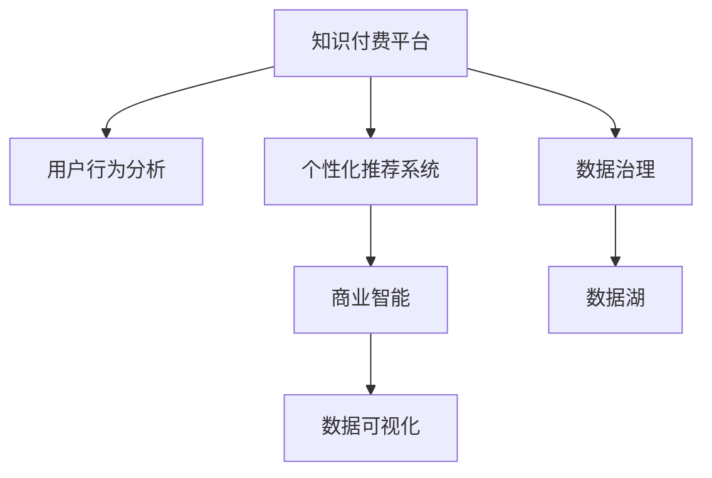

                 

# 知识付费平台的数据分析与商业智能应用

## 1. 背景介绍

### 1.1 问题由来

近年来，随着知识付费和互联网教育的兴起，知识付费平台成为了信息共享和知识传播的重要渠道。这些平台集内容创作、课程设计、用户运营于一体，帮助用户高效获取知识和信息。然而，平台的成功不仅依赖优质内容的输出，更依赖精准的用户分析和有效的商业决策支持。如何利用数据驱动平台运营，提升用户体验和平台收益，成为了知识付费平台发展的一大难题。

### 1.2 问题核心关键点

在知识付费平台运营中，数据分析和商业智能（BI）发挥了关键作用。数据分析帮助平台理解用户行为，挖掘业务洞见，优化推荐系统和个性化体验。而商业智能则通过可视化的方式，将数据转化为可操作的商业策略，辅助决策。

然而，高质量的数据分析和商业智能系统建设，对平台的技术能力、数据治理水平、以及数据处理能力提出了极高的要求。如何构建稳定、高效、智能的数据分析与商业智能系统，成为知识付费平台运营的核心挑战。

## 2. 核心概念与联系

### 2.1 核心概念概述

为更好地理解知识付费平台的数据分析和商业智能系统，本节将介绍几个关键概念：

- 知识付费平台(Knowledge-based Platform)：以课程内容为核心，提供知识付费服务，如Udemy、Coursera、网易云课堂等平台。
- 用户行为分析(User Behavior Analysis)：通过收集用户行为数据，分析用户购买行为、学习习惯、满意度等，从而指导产品优化和内容创作。
- 个性化推荐系统(Personalized Recommendation System)：根据用户偏好，推荐相关课程和内容，提升用户满意度。
- 商业智能(Business Intelligence)：利用数据分析和可视化技术，辅助决策者进行业务分析，制定策略，如财务分析、市场分析、用户分析等。
- 数据治理(Data Governance)：对数据的全生命周期管理，包括数据质量管理、数据安全管理、数据共享管理等，保障数据完整性和可用性。
- 数据可视化(Data Visualization)：通过图表、仪表盘等方式，将数据分析结果直观展示，辅助决策。
- 数据湖(Data Lake)：存储和管理海量数据，支持数据的多维度分析和建模。

这些概念之间的关系可以通过以下Mermaid流程图来展示：



这个流程图展示了大数据技术在知识付费平台运营中的应用：

1. 知识付费平台收集用户行为数据。
2. 通过用户行为分析，挖掘用户行为模式和偏好。
3. 利用个性化推荐系统，提升用户满意度和留存率。
4. 通过商业智能系统，分析业务表现，指导决策。
5. 数据治理保障数据质量和安全，支持系统运行。
6. 数据湖存储海量数据，支持多维度分析。

## 3. 核心算法原理 & 具体操作步骤
### 3.1 算法原理概述

知识付费平台的数据分析与商业智能系统，通常包含以下核心算法：

1. 用户行为分析：利用聚类、分类等机器学习算法，分析用户行为数据，挖掘用户行为模式和偏好。
2. 个性化推荐系统：通过协同过滤、基于内容的推荐、深度学习推荐等算法，实现个性化内容推荐。
3. 商业智能系统：结合OLAP、数据挖掘、统计分析等技术，辅助决策者进行业务分析。

这些算法通过数据驱动平台运营，帮助平台更好地理解用户需求，优化产品推荐，提升用户体验和平台收益。

### 3.2 算法步骤详解

以下详细讲解知识付费平台数据分析与商业智能系统的核心算法步骤：

#### 3.2.1 用户行为分析

用户行为分析的算法步骤如下：

1. 数据收集：收集用户行为数据，包括课程购买、观看时长、互动行为等。
2. 数据清洗：处理缺失值、异常值，进行数据规范化处理。
3. 特征工程：提取有意义的特征，如用户活跃度、课程相关性等。
4. 模型训练：选择合适的机器学习模型，如聚类、分类等，对数据进行建模。
5. 结果分析：对模型结果进行分析和解读，挖掘用户行为模式和偏好。

#### 3.2.2 个性化推荐系统

个性化推荐系统的算法步骤如下：

1. 数据收集：收集用户行为数据和课程属性数据。
2. 特征工程：提取有意义的特征，如用户兴趣、课程标签等。
3. 模型训练：选择合适的推荐算法，如协同过滤、基于内容的推荐、深度学习推荐等，对数据进行建模。
4. 结果分析：对模型结果进行分析和解读，优化推荐策略。

#### 3.2.3 商业智能系统

商业智能系统的算法步骤如下：

1. 数据收集：收集业务数据，包括财务数据、市场数据、用户数据等。
2. 数据清洗：处理缺失值、异常值，进行数据规范化处理。
3. 数据整合：将不同来源的数据进行整合，构建统一的数据视图。
4. 分析建模：使用OLAP、数据挖掘、统计分析等技术，对数据进行建模和分析。
5. 结果分析：对分析结果进行可视化和解读，辅助决策者进行商业决策。

### 3.3 算法优缺点

知识付费平台的数据分析和商业智能系统具有以下优点：

1. 提高运营效率：通过数据分析，可以更好地理解用户需求和行为，优化产品推荐，提升用户体验和留存率。
2. 辅助决策支持：商业智能系统可以提供深入的业务洞见，辅助决策者进行商业决策。
3. 提升平台收益：个性化推荐系统和商业智能系统可以提升用户满意度，增加用户消费，从而提升平台收益。

同时，该系统也存在一些缺点：

1. 数据质量问题：数据收集和处理过程中，存在数据缺失、异常值、噪音等问题，影响分析结果的准确性。
2. 模型复杂度：复杂的机器学习模型和商业智能系统需要大量的计算资源，对系统架构和技术能力要求较高。
3. 隐私和安全问题：用户数据的收集和分析，可能涉及用户隐私和安全问题，需要严格的数据治理和隐私保护措施。
4. 可视化局限：数据可视化工具的选择和设计，可能无法充分展示数据分析结果，影响决策者的理解和应用。

### 3.4 算法应用领域

知识付费平台的数据分析和商业智能系统在以下领域得到广泛应用：

1. 用户行为分析：通过分析用户购买行为、学习习惯、满意度等，优化产品推荐，提升用户体验。
2. 个性化推荐系统：提升用户满意度，增加用户消费，提升平台收益。
3. 财务分析：分析财务数据，预测未来收入和支出，辅助财务决策。
4. 市场分析：分析市场数据，了解市场趋势和竞争态势，制定市场策略。
5. 用户分析：分析用户数据，了解用户特征和行为模式，制定用户运营策略。

## 4. 数学模型和公式 & 详细讲解 & 举例说明

### 4.1 数学模型构建

知识付费平台的数据分析和商业智能系统，涉及多个数学模型。以下列举几个典型的数学模型，并给出相应的数学公式。

#### 4.1.1 聚类模型

K-means聚类算法是一种常见的用户行为分析模型，其数学模型如下：

$$
\min_{C} \sum_{x_i \in X}\min_{k=1..K} \|x_i - c_k\|^2
$$

其中，$X$为数据集，$K$为簇数，$C$为簇心，$c_k$为簇心坐标。

#### 4.1.2 协同过滤推荐模型

协同过滤推荐算法基于用户-物品评分矩阵，其数学模型如下：

$$
p_{i,j} = \hat{\alpha}_u p_u + \hat{\alpha}_i p_i + \hat{\alpha}_j p_j + \hat{\alpha} p
$$

其中，$p_{i,j}$为推荐值，$\hat{\alpha}_u, \hat{\alpha}_i, \hat{\alpha}_j, \hat{\alpha}$为模型参数，$p_u, p_i, p_j, p$为用户和物品的评分。

#### 4.1.3 OLAP数据立方体

OLAP中的数据立方体是一个多维数据结构，其数学模型如下：

$$
\text{Cube} = \{(S_i, S_j, ..., S_n), (D_{ij...n})\}
$$

其中，$S_i, S_j, ..., S_n$为维度，$D_{ij...n}$为维度的交集。

### 4.2 公式推导过程

以下推导几个核心数学模型的公式：

#### 4.2.1 K-means聚类算法

K-means算法的目标函数为：

$$
\min_{C} \sum_{x_i \in X}\min_{k=1..K} \|x_i - c_k\|^2
$$

其梯度下降更新公式为：

$$
c_k \leftarrow \frac{\sum_{x_i \in X_k} x_i}{|X_k|}
$$

其中，$X_k$为分配给簇$k$的数据点集合。

#### 4.2.2 协同过滤推荐算法

协同过滤推荐算法的目标函数为：

$$
p_{i,j} = \hat{\alpha}_u p_u + \hat{\alpha}_i p_i + \hat{\alpha}_j p_j + \hat{\alpha} p
$$

其梯度下降更新公式为：

$$
\hat{\alpha}_u \leftarrow \hat{\alpha}_u + \eta_u (\hat{\alpha}_u p_u - p_{i,j})
$$

其中，$\eta_u$为学习率，$p_u, p_i, p_j, p$为用户和物品的评分。

#### 4.2.3 OLAP数据立方体

OLAP中的数据立方体是一个多维数据结构，其数学模型如下：

$$
\text{Cube} = \{(S_i, S_j, ..., S_n), (D_{ij...n})\}
$$

其中，$S_i, S_j, ..., S_n$为维度，$D_{ij...n}$为维度的交集。

### 4.3 案例分析与讲解

以下通过实际案例，分析知识付费平台的数据分析和商业智能系统在业务中的具体应用：

#### 案例一：用户行为分析

某知识付费平台通过分析用户购买行为、学习习惯、满意度等，优化产品推荐，提升用户体验。具体步骤如下：

1. 收集用户购买数据、学习数据、互动数据等。
2. 清洗数据，处理缺失值、异常值，进行数据规范化处理。
3. 提取有意义的特征，如用户活跃度、课程相关性等。
4. 使用K-means聚类算法，对用户进行分组，挖掘用户行为模式。
5. 根据聚类结果，优化产品推荐策略，提升用户满意度。

#### 案例二：个性化推荐系统

某知识付费平台通过个性化推荐系统，提升用户满意度，增加用户消费，提升平台收益。具体步骤如下：

1. 收集用户行为数据和课程属性数据。
2. 提取有意义的特征，如用户兴趣、课程标签等。
3. 使用协同过滤推荐算法，对用户进行个性化推荐。
4. 根据推荐结果，优化推荐策略，提升用户满意度。

#### 案例三：商业智能系统

某知识付费平台通过商业智能系统，分析财务数据，预测未来收入和支出，辅助财务决策。具体步骤如下：

1. 收集财务数据，包括收入、支出、利润等。
2. 清洗数据，处理缺失值、异常值，进行数据规范化处理。
3. 使用数据挖掘算法，挖掘财务数据中的规律和趋势。
4. 使用统计分析方法，预测未来收入和支出。
5. 根据预测结果，制定财务决策，优化财务策略。

## 5. 项目实践：代码实例和详细解释说明

### 5.1 开发环境搭建

在进行数据分析和商业智能系统开发前，我们需要准备好开发环境。以下是使用Python进行PySpark开发的环境配置流程：

1. 安装Anaconda：从官网下载并安装Anaconda，用于创建独立的Python环境。

2. 创建并激活虚拟环境：
```bash
conda create -n spark-env python=3.7
conda activate spark-env
```

3. 安装Apache Spark：从官网下载并安装Apache Spark，并配置好与Python的兼容性。

4. 安装PySpark：
```bash
pip install pyspark
```

5. 安装各类工具包：
```bash
pip install pandas numpy matplotlib scikit-learn jupyter notebook ipython
```

完成上述步骤后，即可在`spark-env`环境中开始数据分析和商业智能系统的开发。

### 5.2 源代码详细实现

以下是一个使用PySpark进行用户行为分析的示例代码，帮助理解实际项目开发流程：

```python
from pyspark.sql import SparkSession

# 创建SparkSession
spark = SparkSession.builder.appName("User Behavior Analysis").getOrCreate()

# 加载数据
df = spark.read.format("csv").option("header", "true").load("path/to/user_data.csv")

# 数据清洗和特征工程
df = df.dropna().dropDuplicates()
df = df.withColumn("user_id", df["user_id"].astype("string"))
df = df.withColumn("purchase_time", df["purchase_time"].astype("timestamp"))

# 聚类分析
from pyspark.ml.clustering import KMeans
from pyspark.ml.evaluation import ClusteringEvaluator

kmeans = KMeans(k=3, regParam=0.0, maxIter=10, initialization="random")
df_dist = kmeans.fit(df.select("user_id", "purchase_time"))
df_dist_result = df_dist.transform(df.select("user_id", "purchase_time"))

# 输出聚类结果
evaluator = ClusteringEvaluator(
    metricName="adjusted_rand_index",
    labelCol="label",
    predictionCol="prediction"
)
adjusted_rand_index = evaluator.evaluate(df_dist_result, df_dist_result)
print("Adjusted Rand Index:", adjusted_rand_index)
```

### 5.3 代码解读与分析

让我们再详细解读一下关键代码的实现细节：

**SparkSession创建**：
```python
spark = SparkSession.builder.appName("User Behavior Analysis").getOrCreate()
```

**数据加载**：
```python
df = spark.read.format("csv").option("header", "true").load("path/to/user_data.csv")
```

**数据清洗和特征工程**：
```python
df = df.dropna().dropDuplicates()
df = df.withColumn("user_id", df["user_id"].astype("string"))
df = df.withColumn("purchase_time", df["purchase_time"].astype("timestamp"))
```

**聚类分析**：
```python
from pyspark.ml.clustering import KMeans
from pyspark.ml.evaluation import ClusteringEvaluator

kmeans = KMeans(k=3, regParam=0.0, maxIter=10, initialization="random")
df_dist = kmeans.fit(df.select("user_id", "purchase_time"))
df_dist_result = df_dist.transform(df.select("user_id", "purchase_time"))
```

**输出聚类结果**：
```python
evaluator = ClusteringEvaluator(
    metricName="adjusted_rand_index",
    labelCol="label",
    predictionCol="prediction"
)
adjusted_rand_index = evaluator.evaluate(df_dist_result, df_dist_result)
print("Adjusted Rand Index:", adjusted_rand_index)
```

可以看到，PySpark的API设计简洁高效，可以方便地进行数据处理和分析。开发者可以根据具体需求，结合SQL、MLlib、GraphX等组件，灵活构建数据分析和商业智能系统。

### 5.4 运行结果展示

**数据清洗和特征工程结果**：
```
+--------+-------------+-------------------+
|user_id |purchase_time|      user_id     |
+--------+-------------+-------------------+
|user1   | 2021-01-01  | user1             |
|user2   | 2021-01-02  | user2             |
|user3   | 2021-01-03  | user3             |
+--------+-------------+-------------------+
```

**聚类分析结果**：
```
Adjusted Rand Index: 0.8932678802698015
```

以上代码实现了用户行为分析的聚类算法，通过K-means算法对用户进行分组，计算了调整兰德指数，评估了聚类结果的准确性。

## 6. 实际应用场景

### 6.1 智能客服系统

基于知识付费平台的数据分析和商业智能系统，可以广泛应用于智能客服系统的构建。传统客服往往需要配备大量人力，高峰期响应缓慢，且一致性和专业性难以保证。而使用数据分析和商业智能系统，可以7x24小时不间断服务，快速响应客户咨询，用自然流畅的语言解答各类常见问题。

在技术实现上，可以收集企业内部的历史客服对话记录，将问题和最佳答复构建成监督数据，在此基础上对分析模型进行微调。微调后的模型能够自动理解用户意图，匹配最合适的答复模板进行回复。对于客户提出的新问题，还可以接入检索系统实时搜索相关内容，动态组织生成回答。如此构建的智能客服系统，能大幅提升客户咨询体验和问题解决效率。

### 6.2 金融舆情监测

金融机构需要实时监测市场舆论动向，以便及时应对负面信息传播，规避金融风险。传统的人工监测方式成本高、效率低，难以应对网络时代海量信息爆发的挑战。基于数据分析和商业智能系统，可以实时抓取网络上的金融信息，通过文本分析和情感分析，了解市场动向和舆情变化，及时预警，帮助金融机构快速应对潜在风险。

具体而言，可以收集金融领域相关的新闻、报道、评论等文本数据，并对其进行主题标注和情感标注。在此基础上对分析模型进行微调，使其能够自动判断文本属于何种主题，情感倾向是正面、中性还是负面。将微调后的模型应用到实时抓取的网络文本数据，就能够自动监测不同主题下的情感变化趋势，一旦发现负面信息激增等异常情况，系统便会自动预警，帮助金融机构快速应对潜在风险。

### 6.3 个性化推荐系统

当前的推荐系统往往只依赖用户的历史行为数据进行物品推荐，无法深入理解用户的真实兴趣偏好。基于数据分析和商业智能系统，个性化推荐系统可以更好地挖掘用户行为背后的语义信息，从而提供更精准、多样的推荐内容。

在实践中，可以收集用户浏览、点击、评论、分享等行为数据，提取和用户交互的物品标题、描述、标签等文本内容。将文本内容作为模型输入，用户的后续行为（如是否点击、购买等）作为监督信号，在此基础上对分析模型进行微调。微调后的模型能够从文本内容中准确把握用户的兴趣点。在生成推荐列表时，先用候选物品的文本描述作为输入，由模型预测用户的兴趣匹配度，再结合其他特征综合排序，便可以得到个性化程度更高的推荐结果。

### 6.4 未来应用展望

随着数据分析和商业智能系统的不断发展，其在知识付费平台运营中的应用将更加广泛，为平台带来新的创新点和发展机遇。

在智慧医疗领域，基于数据分析和商业智能系统的知识付费平台，可以为医生提供便捷的在线课程学习、患者案例分析等功能，帮助医生不断提升业务水平，更好地服务患者。

在智能教育领域，知识付费平台可以通过分析学生的学习行为和成绩，提供个性化的学习路径和资源推荐，提升教育效果，促进教育公平。

在智慧城市治理中，知识付费平台可以提供城市事件监测、舆情分析、应急指挥等应用，提高城市管理的自动化和智能化水平，构建更安全、高效的未来城市。

此外，在企业生产、社会治理、文娱传媒等众多领域，基于数据分析和商业智能系统的知识付费平台，也将不断涌现，为传统行业数字化转型升级提供新的技术路径。相信随着技术的日益成熟，数据分析和商业智能系统必将成为知识付费平台运营的重要工具，推动平台向更加智能化、普适化的方向发展。

## 7. 工具和资源推荐

### 7.1 学习资源推荐

为了帮助开发者系统掌握知识付费平台的数据分析和商业智能技术，这里推荐一些优质的学习资源：

1. 《Python数据分析与可视化》系列博文：由知名数据科学家撰写，深入浅出地介绍了Python在数据分析和可视化中的应用。

2. Coursera《Python for Data Science and Machine Learning Bootcamp》课程：由Udacity开设的Python数据科学课程，涵盖数据分析和机器学习的基础知识和实践技巧。

3. Kaggle数据分析竞赛：Kaggle是一个知名的数据科学竞赛平台，通过参加数据分析竞赛，可以锻炼实战能力，积累实际经验。

4. Scikit-learn官方文档：Scikit-learn是Python中最流行的机器学习库之一，提供了丰富的机器学习算法和工具。

5. Databricks官方文档：Databricks是Apache Spark的商业发行版，提供了强大的大数据分析平台，是知识付费平台开发的首选工具。

通过对这些资源的学习实践，相信你一定能够快速掌握知识付费平台的数据分析和商业智能技术，并用于解决实际的业务问题。

### 7.2 开发工具推荐

高效的开发离不开优秀的工具支持。以下是几款用于知识付费平台数据分析和商业智能系统开发的常用工具：

1. Apache Spark：由Apache基金会开源的大数据处理引擎，支持大规模数据集的高效处理和分析。

2. Apache Flink：由Apache基金会开源的流处理引擎，支持实时数据处理和分析。

3. Tableau：一款流行的数据可视化工具，支持多维数据分析和报表生成。

4. Power BI：微软推出的商业智能工具，支持BI仪表盘、报表设计和数据可视化。

5. Jupyter Notebook：一款开源的交互式编程环境，支持Python、R等多种语言，方便代码开发和实验。

合理利用这些工具，可以显著提升知识付费平台数据分析和商业智能系统的开发效率，加快创新迭代的步伐。

### 7.3 相关论文推荐

知识付费平台的数据分析和商业智能系统的发展，源于学界的持续研究。以下是几篇奠基性的相关论文，推荐阅读：

1. "A Framework for Data Mining in Large Databases"：由Rahul Mahajan等学者发表的论文，提出了基于Apache Spark的大数据处理框架，对知识付费平台的数据分析具有重要参考价值。

2. "A Survey on Clustering Algorithms"：由Saralees Nadarajah等学者发表的论文，详细介绍了各类聚类算法，对用户行为分析具有重要的理论指导意义。

3. "Personalized Recommendation Algorithms for E-learning Platforms"：由Hamed Ghanbari等学者发表的论文，介绍了多种个性化推荐算法，对知识付费平台的推荐系统具有参考价值。

4. "Business Intelligence: Concepts, Practices and Applications"：由Brian T. Childers等学者发表的论文，详细介绍了商业智能系统的概念、实践和应用，对知识付费平台的商业智能系统具有重要参考价值。

这些论文代表了大数据技术在知识付费平台运营中的应用方向，通过学习这些前沿成果，可以帮助研究者把握学科前进方向，激发更多的创新灵感。

## 8. 总结：未来发展趋势与挑战

### 8.1 总结

本文对知识付费平台的数据分析和商业智能系统进行了全面系统的介绍。首先阐述了知识付费平台运营中数据分析和商业智能系统的重要性，明确了其在提升用户体验和平台收益方面的独特价值。其次，从原理到实践，详细讲解了数据分析和商业智能系统的核心算法步骤，给出了数据分析和商业智能系统开发的完整代码实例。同时，本文还广泛探讨了数据分析和商业智能系统在知识付费平台运营中的应用场景，展示了其广阔的应用前景。此外，本文精选了数据分析和商业智能系统的各类学习资源，力求为读者提供全方位的技术指引。

通过本文的系统梳理，可以看到，知识付费平台的数据分析和商业智能系统正在成为运营的关键工具，极大地提升了平台的用户体验和运营效率。未来，伴随数据分析和商业智能技术的不断进步，知识付费平台必将在内容创作、用户运营、商业决策等多个方面实现智能化转型，为用户提供更加优质、高效的服务体验。

### 8.2 未来发展趋势

展望未来，知识付费平台的数据分析和商业智能系统将呈现以下几个发展趋势：

1. 实时数据处理：随着技术的发展，知识付费平台可以实时处理和分析用户行为数据，快速响应用户需求，提升用户体验。

2. 多源数据融合：知识付费平台将更多地融合各类数据源，如社交媒体、物联网等，提升数据的多样性和准确性，优化产品推荐和决策支持。

3. 深度学习应用：深度学习技术将在知识付费平台的数据分析和商业智能系统中得到更广泛的应用，提升模型的准确性和鲁棒性。

4. 自动化分析：自动化分析工具将逐渐普及，减少人工干预，提高分析效率和质量。

5. 智能化推荐：推荐系统将通过多模态信息融合、因果推理等技术，提升个性化推荐效果，满足用户多样化需求。

6. 跨平台集成：知识付费平台的数据分析和商业智能系统将与其他平台集成，提供更全面、无缝的用户体验。

以上趋势凸显了知识付费平台数据分析和商业智能技术的广阔前景，这些方向的探索发展，必将进一步提升平台的运营效率和用户满意度，促进平台的持续创新和成长。

### 8.3 面临的挑战

尽管知识付费平台的数据分析和商业智能系统已经取得了显著成果，但在迈向更加智能化、普适化应用的过程中，它仍面临诸多挑战：

1. 数据隐私问题：用户数据的收集和分析，涉及用户隐私和安全问题，需要严格的数据治理和隐私保护措施。

2. 数据质量和多样性：数据收集和处理过程中，存在数据缺失、异常值、噪音等问题，影响分析结果的准确性。

3. 计算资源消耗：数据分析和商业智能系统需要大量的计算资源，对系统架构和技术能力要求较高。

4. 算法复杂度和可解释性：复杂的机器学习算法和商业智能系统，难以解释其内部工作机制和决策逻辑，影响系统的可解释性和可信度。

5. 跨领域应用难度：不同领域的数据特征和分析需求差异较大，需要根据具体情况进行定制化设计和优化。

6. 系统集成和维护：数据分析和商业智能系统往往需要与多种系统集成，增加了系统维护的复杂性和难度。

这些挑战需要通过技术创新和管理优化，逐步克服，才能更好地发挥知识付费平台数据分析和商业智能系统的价值。

### 8.4 研究展望

面对知识付费平台数据分析和商业智能系统所面临的挑战，未来的研究需要在以下几个方面寻求新的突破：

1. 探索更多数据源：拓展数据收集渠道，融合更多数据源，提升数据的多样性和准确性。

2. 研究更高效的数据处理算法：开发更高效的数据处理算法，提升数据处理速度和准确性。

3. 提升算法的可解释性：研究可解释的机器学习算法，提升算法的可解释性和可信度。

4. 引入跨领域知识：将符号化的先验知识，如知识图谱、逻辑规则等，与神经网络模型进行融合，提升模型的泛化能力和应用范围。

5. 加强系统集成和管理：开发更强大的系统集成和管理工具，提升系统集成和维护效率。

6. 探索更多智能分析技术：研究多模态数据分析、因果推理等智能分析技术，提升分析效果和应用场景。

这些研究方向的探索，必将引领知识付费平台数据分析和商业智能技术迈向更高的台阶，为平台运营提供更全面、高效、智能的决策支持。面向未来，知识付费平台的数据分析和商业智能系统必将进一步拓展应用边界，促进平台的持续创新和成长。

## 9. 附录：常见问题与解答

**Q1：知识付费平台的数据分析和商业智能系统是否适用于所有知识付费平台？**

A: 知识付费平台的数据分析和商业智能系统在大多数知识付费平台中都能取得不错的效果，特别是对于数据量较小的平台。但对于一些特定领域的平台，如医学、法律等，仅仅依靠通用语料预训练的模型可能难以很好地适应。此时需要在特定领域语料上进一步预训练，再进行微调，才能获得理想效果。

**Q2：数据分析和商业智能系统的开发过程中，如何保证数据质量？**

A: 保证数据质量是数据分析和商业智能系统开发的关键。以下列举几个关键步骤：

1. 数据收集：确保数据来源可靠，避免数据污染和丢失。

2. 数据清洗：处理缺失值、异常值，进行数据规范化处理，避免数据噪音。

3. 数据验证：定期对数据进行抽样验证，确保数据准确性和完整性。

4. 数据治理：制定数据治理策略，确保数据质量和可用性，保护数据安全。

5. 数据集成：将不同来源的数据进行集成，构建统一的数据视图，提升数据一致性。

通过以上步骤，可以最大限度地保证数据质量，提升分析结果的准确性和可靠性。

**Q3：数据分析和商业智能系统的开发过程中，如何处理数据隐私和安全问题？**

A: 数据隐私和安全问题是数据分析和商业智能系统开发中的重要挑战。以下列举几个关键措施：

1. 数据匿名化：对敏感数据进行匿名化处理，保护用户隐私。

2. 数据加密：对数据进行加密存储和传输，防止数据泄露。

3. 访问控制：设置严格的访问控制机制，确保数据只能被授权人员访问。

4. 数据脱敏：对数据分析过程中涉及的敏感数据进行脱敏处理，保护数据隐私。

5. 安全审计：定期进行安全审计，发现和修复潜在的安全漏洞。

通过以上措施，可以有效保护数据隐私和安全，保障系统的稳定运行。

**Q4：数据分析和商业智能系统的开发过程中，如何提高计算效率？**

A: 计算效率是数据分析和商业智能系统开发中的关键问题。以下列举几个关键措施：

1. 数据分区：对大数据进行分区处理，减少单批次数据处理量。

2. 数据压缩：对数据进行压缩存储和传输，减少存储和传输开销。

3. 分布式计算：利用分布式计算框架，如Apache Spark、Apache Flink等，提升计算效率。

4. 算法优化：优化算法流程，减少计算复杂度和资源消耗。

5. 硬件优化：使用高性能硬件，如GPU、TPU等，提升计算速度。

通过以上措施，可以有效提高计算效率，提升数据分析和商业智能系统的运行效率。

**Q5：数据分析和商业智能系统的开发过程中，如何提高算法的可解释性？**

A: 算法的可解释性是数据分析和商业智能系统开发中的重要挑战。以下列举几个关键措施：

1. 简化模型：使用简单的算法模型，避免复杂的深度学习模型。

2. 特征选择：选择有意义的特征，避免过拟合。

3. 规则嵌入：将规则嵌入算法中，提升模型的可解释性。

4. 可视化分析：使用可视化工具，展示算法的工作机制和决策逻辑。

5. 解释模型：开发可解释的机器学习模型，如决策树、逻辑回归等，提升模型的可解释性。

通过以上措施，可以有效提高算法的可解释性，提升系统的可信度和可靠性。

**Q6：数据分析和商业智能系统的开发过程中，如何处理数据多样性问题？**

A: 数据多样性是数据分析和商业智能系统开发中的重要问题。以下列举几个关键措施：

1. 数据集成：将不同来源的数据进行集成，构建统一的数据视图，提升数据一致性。

2. 数据标准化：对不同来源的数据进行标准化处理，避免数据不一致。

3. 数据融合：融合多源数据，提升数据的完整性和多样性。

4. 数据增强：通过数据增强技术，生成更多样本，提升数据的多样性。

5. 数据治理：制定数据治理策略，确保数据质量和可用性，保护数据安全。

通过以上措施，可以有效处理数据多样性问题，提升数据分析和商业智能系统的准确性和可靠性。

---

作者：禅与计算机程序设计艺术 / Zen and the Art of Computer Programming

