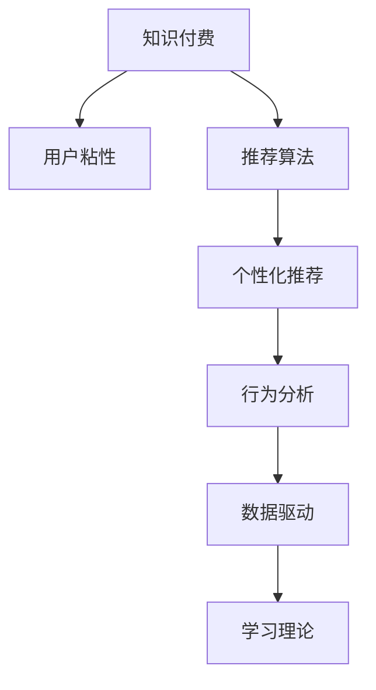

                 

# 知识付费平台的用户粘性提升策略

> 关键词：知识付费、用户粘性、推荐算法、个性化推荐、行为分析、数据驱动、学习理论

## 1. 背景介绍

在信息爆炸的互联网时代，用户获取知识的方式日益多样化，但高质量、系统化的学习内容始终是稀缺资源。知识付费平台的兴起，为内容创作者和用户之间搭建了一个高效的桥梁，为知识和价值的对等交换提供了可能。然而，面对众多平台的同质竞争，如何提高用户粘性，保持平台的持续发展，是每一个知识付费平台都面临的重大挑战。本文将深入探讨知识付费平台的用户粘性提升策略，结合当前研究进展和实际应用案例，给出系统性的解决方案。

## 2. 核心概念与联系

### 2.1 核心概念概述

为更好理解知识付费平台的用户粘性提升策略，本节将介绍几个关键概念：

- 知识付费：通过订阅、购买等形式，向用户提供高质量、系统化的在线学习内容，帮助其提升技能、获取知识。
- 用户粘性：用户对平台的长期依赖度和活跃度，表现为用户留存率、活跃度、付费率等指标。
- 推荐算法：根据用户历史行为数据，通过算法模型推荐用户可能感兴趣的内容，提升用户使用体验和粘性。
- 个性化推荐：通过分析用户行为特征，个性化地推荐与其偏好相符的内容，提高用户满意度。
- 行为分析：利用数据挖掘、机器学习等技术，分析用户行为模式，理解用户需求，指导平台运营策略。
- 数据驱动：通过数据收集、分析和应用，驱动平台运营决策，提高效率和效果。
- 学习理论：研究人类学习行为和心理的科学，指导知识付费平台的个性化推荐和内容设计。

这些概念之间的联系可以通过以下Mermaid流程图来展示：



这个流程图展示了知识付费平台的主要组件及其相互关系：

1. 知识付费为平台的主要功能，通过订阅和付费获取高质量内容。
2. 用户粘性是衡量平台价值的指标，需要通过推荐算法、个性化推荐等手段提高。
3. 推荐算法和个性化推荐是提升用户粘性的关键技术，需要结合行为分析驱动。
4. 数据驱动是推荐和行为分析的基础，通过海量数据支撑决策。
5. 学习理论提供理论支持，指导推荐和行为分析策略。

## 3. 核心算法原理 & 具体操作步骤

### 3.1 算法原理概述

知识付费平台的用户粘性提升策略，本质上是一个数据驱动的个性化推荐系统。其核心思想是：通过收集用户的行为数据，构建用户画像，利用推荐算法和模型预测用户偏好，实现个性化的内容推荐。

形式化地，假设用户行为数据为 $D=\{(x_i,y_i)\}_{i=1}^N$，其中 $x_i$ 为行为特征向量，$y_i$ 为行为标签（如购买、浏览、评价等）。推荐算法的目标是最小化预测错误率，即找到最优的推荐模型 $M$：

$$
\min_{M} \mathbb{E}_{(x,y)\sim D} \ell(M(x),y)
$$

其中 $\ell$ 为预测误差，可以通过交叉熵、均方误差等损失函数衡量。

推荐模型 $M$ 通常包括协同过滤、内容推荐、混合推荐等多种类型。常用的协同过滤算法有基于用户的协同过滤（User-based Collaborative Filtering）和基于项目的协同过滤（Item-based Collaborative Filtering），内容推荐则包括基于内容的推荐（Content-based Recommendation）和基于属性的推荐（Attribute-based Recommendation）。混合推荐则通过组合多种推荐策略，综合利用数据的多样性，提升推荐效果。

### 3.2 算法步骤详解

基于推荐算法的数据驱动个性化推荐策略，一般包括以下几个关键步骤：

**Step 1: 数据采集与处理**

- 收集用户行为数据，包括但不限于购买记录、浏览历史、评分评价等。
- 数据预处理，包括清洗、归一化、特征选择等步骤。
- 构建用户行为特征向量 $x_i$，描述用户的行为模式和偏好。

**Step 2: 用户画像构建**

- 基于用户行为数据，使用聚类、降维等技术构建用户画像，描述用户的兴趣和行为特征。
- 通过协同过滤算法，找到与用户相似的其他用户或物品，构建推荐基础。

**Step 3: 推荐模型训练**

- 选择合适的推荐算法，如协同过滤、内容推荐等，并使用训练集对模型进行训练。
- 在验证集上进行模型调参，选择合适的超参数。
- 在测试集上评估模型的预测效果，确保推荐准确性。

**Step 4: 推荐结果生成与反馈**

- 将用户画像和模型预测结果，结合实时数据，生成推荐列表。
- 根据推荐列表和用户反馈，实时调整推荐策略，提升用户体验。
- 持续收集用户反馈数据，更新用户画像和推荐模型，形成良性循环。

**Step 5: 行为分析与优化**

- 利用数据挖掘和机器学习技术，分析用户行为模式和偏好变化。
- 根据行为分析结果，优化推荐算法和模型，提升推荐效果。
- 结合学习理论，优化内容设计和推荐策略，提升用户满意度。

以上是基于推荐算法的数据驱动个性化推荐策略的一般流程。在实际应用中，还需要针对具体平台的特点，对推荐过程的各个环节进行优化设计，如引入更多协同过滤技术、改进内容推荐策略、优化推荐结果排序等。

### 3.3 算法优缺点

基于推荐算法的数据驱动个性化推荐策略，具有以下优点：

1. 提升用户体验。通过个性化推荐，用户可以快速找到感兴趣的内容，减少寻找时间，提高平台使用频率。
2. 增加用户粘性。通过精准的推荐，用户对平台的依赖度和活跃度显著提升，延长用户留存时间。
3. 优化运营效果。通过实时数据反馈和行为分析，不断优化推荐策略，提升运营效率和效果。

同时，该策略也存在一定的局限性：

1. 数据依赖度高。推荐模型的效果很大程度上取决于数据的质量和数量，获取高质量数据成本较高。
2. 冷启动问题。新用户缺乏历史数据，难以构建准确的推荐基础。
3. 推荐多样性不足。过度依赖相似性，可能导致推荐内容多样性不足，影响用户满意度。
4. 公平性问题。推荐算法可能导致部分用户长期接收相同内容，形成信息茧房，影响用户公平体验。
5. 安全性问题。推荐系统可能存在数据隐私和安全风险，需要采取措施保障用户隐私。

尽管存在这些局限性，但就目前而言，基于推荐算法的数据驱动个性化推荐策略仍是最主流的方法。未来相关研究的重点在于如何进一步降低推荐对数据的依赖，提高推荐多样性和公平性，同时兼顾用户隐私和安全因素。

### 3.4 算法应用领域

基于推荐算法的数据驱动个性化推荐策略，已经在知识付费平台、在线零售、社交媒体等多个领域得到了广泛的应用，提升了用户粘性和平台收益：

- 知识付费平台：通过个性化推荐，帮助用户快速找到感兴趣的课程和讲座，提升学习效率。
- 在线零售：通过推荐算法，提高用户浏览和购买转化率，增加销售量。
- 社交媒体：通过个性化推荐，增加用户使用频率，提高平台活跃度。

除了上述这些经典应用外，推荐系统还被创新性地应用到更多场景中，如广告推荐、内容聚合、智能推荐助手等，为平台带来了新的收入和价值。随着推荐算法的不断进步，相信推荐系统将在更广阔的应用领域发挥更大的作用。

## 4. 数学模型和公式 & 详细讲解 & 举例说明

### 4.1 数学模型构建

本节将使用数学语言对基于推荐算法的数据驱动个性化推荐策略进行更加严格的刻画。

记用户行为数据为 $D=\{(x_i,y_i)\}_{i=1}^N$，其中 $x_i$ 为行为特征向量，$y_i$ 为行为标签。定义推荐模型为 $M:\mathcal{X}\rightarrow[0,1]$，其中 $\mathcal{X}$ 为特征空间，$[0,1]$ 为推荐得分区间。

推荐模型的目标是最小化预测误差，即找到最优模型参数 $\theta$：

$$
\min_{\theta} \frac{1}{N}\sum_{i=1}^N \ell(M(x_i),y_i)
$$

其中 $\ell$ 为预测误差，可以通过交叉熵损失、均方误差损失等衡量。

推荐模型通常包括协同过滤、内容推荐等多种类型。常用的协同过滤算法有基于用户的协同过滤（User-based Collaborative Filtering）和基于项目的协同过滤（Item-based Collaborative Filtering），内容推荐则包括基于内容的推荐（Content-based Recommendation）和基于属性的推荐（Attribute-based Recommendation）。

### 4.2 公式推导过程

以下我们以基于协同过滤的用户推荐为例，推导推荐模型及其预测公式。

设用户 $u$ 的历史行为数据为 $\{x_1,u_1,y_1\},\{x_2,u_2,y_2\},...,\{x_N,u_N,y_N\}$，其中 $x_i$ 为物品特征向量，$u_i$ 为用户特征向量。协同过滤推荐模型的目标是找到用户 $u$ 对物品 $i$ 的推荐得分 $r(u,i)$，可通过矩阵分解方法实现：

$$
r(u,i) = \langle \hat{u},\hat{i}\rangle
$$

其中 $\hat{u}$ 和 $\hat{i}$ 分别为用户 $u$ 和物品 $i$ 的低维嵌入向量，$\langle \cdot,\cdot \rangle$ 表示内积。

推荐得分的计算公式为：

$$
\hat{u} = \mathcal{U}^\top\Delta^{-1}y_u
$$

$$
\hat{i} = \mathcal{V}^\top\Delta^{-1}y_i
$$

其中 $y_u$ 为用户 $u$ 的历史行为矩阵，$y_i$ 为物品 $i$ 的历史行为矩阵，$\mathcal{U}$ 和 $\mathcal{V}$ 分别为用户和物品的嵌入矩阵，$\Delta$ 为正则化项。

预测用户对物品 $i$ 的评分 $r(u,i)$ 的公式为：

$$
r(u,i) = \langle \mathcal{U}^\top\Delta^{-1}y_u,\mathcal{V}^\top\Delta^{-1}y_i\rangle
$$

在得到推荐得分后，可以将其转化为推荐列表，通过排序算法生成推荐结果。

### 4.3 案例分析与讲解

假设有一个知识付费平台，用户通过订阅课程进行学习。平台收集了用户浏览、评分、购买等行为数据，并希望通过个性化推荐提升用户粘性。

首先，对用户行为数据进行预处理，包括清洗、归一化、特征选择等步骤。然后，通过协同过滤算法，对用户和课程数据进行降维，构建用户和课程的嵌入向量。最后，利用上述推荐公式，预测用户对课程的评分，并按照评分高低排序，生成推荐列表。

例如，对于用户 $u$，假设有 $n$ 门课程 $i_1,i_2,...,i_n$ 历史行为数据，协同过滤算法计算用户 $u$ 对每门课程的推荐得分 $r(u,i_j)$，并选择得分最高的课程 $i_k$ 作为推荐结果。推荐列表可能包含以下内容：

- 课程1：《深度学习》，评分 4.5
- 课程2：《自然语言处理》，评分 4.2
- 课程3：《计算机视觉》，评分 3.9
- ...

最终，平台根据推荐列表向用户展示课程信息，用户可以通过点击课程名称，进一步了解课程详情并购买订阅。

## 5. 项目实践：代码实例和详细解释说明

### 5.1 开发环境搭建

在进行个性化推荐实践前，我们需要准备好开发环境。以下是使用Python进行Scikit-learn和TensorFlow开发的环境配置流程：

1. 安装Anaconda：从官网下载并安装Anaconda，用于创建独立的Python环境。

2. 创建并激活虚拟环境：
```bash
conda create -n recsys-env python=3.8 
conda activate recsys-env
```

3. 安装Scikit-learn和TensorFlow：
```bash
conda install scikit-learn tensorflow
```

4. 安装各类工具包：
```bash
pip install numpy pandas scipy matplotlib tqdm jupyter notebook ipython
```

完成上述步骤后，即可在`recsys-env`环境中开始个性化推荐实践。

### 5.2 源代码详细实现

下面我们以基于协同过滤的个性化推荐为例，给出使用Scikit-learn和TensorFlow对用户进行推荐实践的代码实现。

首先，定义推荐数据集和评估指标：

```python
from sklearn.datasets import make_classification
from sklearn.model_selection import train_test_split
from sklearn.metrics import mean_squared_error

# 生成推荐数据集
def generate_recommender_dataset():
    X, y = make_classification(n_samples=1000, n_features=10, n_informative=5, n_redundant=0, random_state=42)
    X_train, X_test, y_train, y_test = train_test_split(X, y, test_size=0.2, random_state=42)
    return X_train, X_test, y_train, y_test

# 定义推荐算法评估指标
def evaluate_recommender(dataset, recsys_model, k):
    X_train, X_test, y_train, y_test = dataset
    y_pred = recsys_model.predict(X_test)
    mse = mean_squared_error(y_test, y_pred)
    return mse
```

然后，定义协同过滤推荐模型：

```python
from tensorflow import keras
from tensorflow.keras.layers import Dense, Input, Embedding, Flatten, Dot
from tensorflow.keras.models import Model

# 定义协同过滤推荐模型
def build_recommender_model(X_train, y_train, X_test, y_test):
    n_users = X_train.shape[0]
    n_items = X_train.shape[1]
    embedding_dim = 10

    # 定义用户和物品的嵌入层
    user_input = Input(shape=(n_users, ), name='user')
    user_embedding = Embedding(n_users, embedding_dim)(user_input)
    item_input = Input(shape=(n_items, ), name='item')
    item_embedding = Embedding(n_items, embedding_dim)(item_input)

    # 计算用户和物品的推荐得分
    dot = Dot(axes=1, normalize=True)([user_embedding, item_embedding])
    score = Flatten()(dot)

    # 定义预测结果的输出层
    output = Dense(1, activation='sigmoid')(score)
    model = Model(inputs=[user_input, item_input], outputs=output)
    
    # 编译模型
    model.compile(optimizer='adam', loss='binary_crossentropy', metrics=['mae'])
    
    # 训练模型
    model.fit([X_train, X_train], y_train, batch_size=64, epochs=100, verbose=1)

    return model
```

接着，在测试集上评估模型性能：

```python
# 生成推荐数据集
X_train, X_test, y_train, y_test = generate_recommender_dataset()

# 构建推荐模型
recsys_model = build_recommender_model(X_train, y_train, X_test, y_test)

# 评估推荐模型性能
mse = evaluate_recommender((X_train, X_test, y_train, y_test), recsys_model, k=5)
print(f"Mean Squared Error: {mse:.4f}")
```

以上就是使用Scikit-learn和TensorFlow对协同过滤推荐模型进行开发的完整代码实现。可以看到，Scikit-learn提供了丰富的数据生成和模型评估工具，TensorFlow则提供了强大的模型构建和训练能力，二者结合可以高效实现个性化推荐系统。

### 5.3 代码解读与分析

让我们再详细解读一下关键代码的实现细节：

**generate_recommender_dataset函数**：
- 生成推荐数据集：使用Scikit-learn的make_classification函数生成包含用户和物品特征的推荐数据集。
- 数据集划分：将数据集划分为训练集和测试集，用于模型训练和评估。

**evaluate_recommender函数**：
- 评估推荐模型性能：使用均方误差（MAE）评估模型预测值和真实标签之间的差异。
- 返回评估结果：返回均方误差作为推荐模型性能的指标。

**build_recommender_model函数**：
- 定义用户和物品的嵌入层：使用Embedding层将用户和物品特征向量转化为嵌入向量。
- 计算推荐得分：使用Dot层计算用户和物品的推荐得分。
- 定义预测结果输出层：使用Dense层将推荐得分转化为预测结果。
- 编译和训练模型：使用adam优化器和binary_crossentropy损失函数编译模型，并进行训练。

**evaluate_recommender函数**：
- 生成推荐数据集：调用generate_recommender_dataset函数生成推荐数据集。
- 构建推荐模型：调用build_recommender_model函数构建推荐模型。
- 评估推荐模型性能：使用evaluate_recommender函数评估模型性能，并返回均方误差。

可以看到，Scikit-learn和TensorFlow的结合，使得推荐系统的实现变得更加简洁高效。开发者可以更加专注于模型的优化和策略设计，而不必过多关注底层实现细节。

当然，工业级的系统实现还需考虑更多因素，如模型参数调优、推荐列表排序、实时推荐系统等。但核心的推荐范式基本与此类似。

## 6. 实际应用场景
### 6.1 智能推荐系统

基于协同过滤的个性化推荐系统，已经广泛应用于各大电商平台、视频网站、音乐平台等，为用户的购物、观影、听歌等行为提供精准推荐，提升用户体验和平台粘性。

在技术实现上，平台可以实时收集用户行为数据，包括浏览记录、购买历史、评分评价等。通过协同过滤算法，构建用户和物品的嵌入向量，并计算推荐得分，生成推荐列表。推荐列表可以通过排序算法，按得分高低排序，推荐给用户。

例如，在电商平台上，推荐系统可以根据用户的浏览和购买历史，推荐可能感兴趣的商品。用户可以根据推荐结果，选择购买更多商品。随着用户行为数据不断积累，推荐系统也会不断调整推荐策略，提升推荐效果。

### 6.2 智能客服系统

智能客服系统通过个性化推荐，提升用户咨询体验，缩短响应时间，提高用户满意度。平台可以收集用户的历史咨询记录和评分反馈，构建用户画像，并结合聊天机器人，进行智能推荐。

例如，用户向智能客服系统咨询“如何设置手机音量”，系统根据用户的历史行为数据，推荐相关的教程、视频等内容，帮助用户快速找到答案。用户还可以选择查看更多推荐内容，加深对相关知识的理解。

### 6.3 知识付费平台

知识付费平台通过个性化推荐，提高用户学习效率，增加用户订阅率和付费率。平台可以收集用户的学习记录和评分反馈，构建用户画像，并结合课程推荐算法，推荐可能感兴趣的课程。

例如，用户在学习编程语言时，可以接收关于Python、Java等语言的课程推荐。用户可以根据推荐结果，选择适合自己的课程进行学习，提升学习效果。平台还可以通过个性化推荐，增加课程的曝光率，吸引更多用户订阅和付费。

### 6.4 未来应用展望

随着推荐算法的不断进步，基于数据驱动的个性化推荐系统将在更多领域得到应用，为内容推荐、智能客服、知识付费等垂直行业带来变革性影响。

在智慧城市治理中，推荐系统可以应用于信息推送、舆情分析、公共服务推荐等环节，提升城市治理的智能化水平。

在智慧医疗领域，推荐系统可以应用于健康咨询、在线诊疗、药物推荐等环节，提升医疗服务的智能化和个性化。

在智慧教育领域，推荐系统可以应用于个性化学习路径推荐、智能课堂教学辅助、课外习题推荐等环节，提升教育公平和教学质量。

此外，在社交媒体、金融服务、娱乐传媒等众多领域，基于推荐算法的应用也将不断涌现，为各行各业带来新的价值。相信随着推荐算法的不断进步，推荐系统将在更广阔的应用领域发挥更大的作用。

## 7. 工具和资源推荐
### 7.1 学习资源推荐

为了帮助开发者系统掌握个性化推荐系统的理论基础和实践技巧，这里推荐一些优质的学习资源：

1. 《推荐系统实践》书籍：清华大学教授孙茂松著，全面介绍了推荐系统的理论基础和实用技术，是入门推荐系统的不二选择。

2. 《推荐系统》课程：南加州大学开设的Recommender Systems课程，涵盖了推荐系统的基本概念、算法和评估指标。

3. 《Python推荐系统》在线课程：由DeepLearning.ai提供，介绍了推荐系统的基本算法和Python实现，适合实战训练。

4. RecSys conference论文集：推荐系统领域的顶级会议论文集，包含了最新的研究进展和经典案例。

5. Kaggle竞赛平台：参加推荐系统相关的竞赛，实战练习，积累推荐算法经验。

通过对这些资源的学习实践，相信你一定能够快速掌握个性化推荐系统的精髓，并用于解决实际的推荐问题。
###  7.2 开发工具推荐

高效的开发离不开优秀的工具支持。以下是几款用于推荐系统开发的常用工具：

1. Scikit-learn：Python的机器学习库，提供了丰富的数据生成、模型评估和特征工程工具。

2. TensorFlow：Google主导的开源深度学习框架，生产部署方便，适合大规模工程应用。

3. PyTorch：Facebook主导的开源深度学习框架，灵活易用，适合快速迭代研究。

4. Jupyter Notebook：开源的交互式笔记本环境，支持Python、R等语言，适合数据探索和模型实验。

5. Apache Spark：大数据处理框架，可以高效处理推荐系统所需的海量数据。

6. Elasticsearch：搜索引擎技术，可以实时存储和检索推荐系统所需的用户行为数据。

合理利用这些工具，可以显著提升推荐系统的开发效率，加快创新迭代的步伐。

### 7.3 相关论文推荐

推荐系统的发展源于学界的持续研究。以下是几篇奠基性的相关论文，推荐阅读：

1. The BellKor 2010 Netflix Prize Winning Algorithm：介绍了基于矩阵分解的协同过滤推荐算法，获得了Netflix推荐系统竞赛的优胜奖。

2. Factorization Machines for Precise Predictions in Recommender Systems：提出因子分解机（FM）算法，提升了推荐模型的精度和效果。

3. Implicit Collaborative Filtering：提出隐式协同过滤算法，通过用户行为数据进行推荐，解决了传统协同过滤算法中的数据稀疏问题。

4. Deep Collaborative Filtering：提出深度协同过滤算法，通过深度神经网络提升推荐模型的表现力。

5. Matrix Factorization Techniques for Recommender Systems：全面介绍了矩阵分解算法在推荐系统中的应用，适合入门学习和深入研究。

这些论文代表了个推荐系统的发展脉络。通过学习这些前沿成果，可以帮助研究者把握学科前进方向，激发更多的创新灵感。

## 8. 总结：未来发展趋势与挑战

### 8.1 总结

本文对基于推荐算法的数据驱动个性化推荐策略进行了全面系统的介绍。首先阐述了知识付费平台用户粘性提升的背景和重要性，明确了推荐算法在提高用户粘性方面的关键作用。其次，从原理到实践，详细讲解了推荐算法的数学模型和具体实现步骤，给出了推荐系统开发的完整代码实例。同时，本文还广泛探讨了推荐算法在知识付费平台、智能推荐系统、智能客服系统等多个领域的应用前景，展示了推荐算法的巨大潜力。此外，本文精选了推荐系统的学习资源、开发工具和相关论文，力求为读者提供全方位的技术指引。

通过本文的系统梳理，可以看到，基于推荐算法的数据驱动个性化推荐策略已经成为知识付费平台提升用户粘性的重要手段。通过推荐系统，用户可以快速找到感兴趣的内容，提高使用频率和满意度，从而实现平台的长久发展。推荐算法在大数据时代的广泛应用，极大地推动了互联网技术的发展，为各行各业带来了新的价值。未来，伴随推荐算法的不断进步，推荐系统将在更多领域得到应用，为各行各业带来新的变革。

### 8.2 未来发展趋势

展望未来，推荐算法将呈现以下几个发展趋势：

1. 模型复杂度提升。随着深度学习技术的发展，推荐模型将更加复杂，包含更多的层次和参数。通过神经网络结构的优化和模型融合技术，提升推荐精度和效果。

2. 多模态推荐兴起。推荐系统将从单一文本推荐向多模态推荐发展，结合视觉、音频等多种信息，提升推荐效果和用户体验。

3. 动态推荐系统成为常态。实时收集用户行为数据，动态调整推荐策略，提供更精准和及时的推荐服务。

4. 融合领域知识和推荐算法。将领域专家的知识和规则，与推荐算法进行融合，提升推荐系统的准确性和稳定性。

5. 推荐系统的公平性提升。通过算法设计和模型优化，提升推荐系统的公平性和多样性，避免信息茧房和偏见。

6. 推荐系统的安全性保障。保护用户隐私和数据安全，确保推荐系统的透明性和可信度。

以上趋势凸显了推荐算法的发展方向，这些方向的探索发展，必将进一步提升推荐系统的性能和用户体验，推动推荐系统的广泛应用。

### 8.3 面临的挑战

尽管推荐算法已经取得了显著进展，但在迈向更加智能化、普适化应用的过程中，仍面临诸多挑战：

1. 数据质量和量级。推荐系统的效果很大程度上取决于数据的质量和量级，获取高质量、大规模的数据成本较高。

2. 推荐冷启动问题。对于新用户，缺乏足够的历史行为数据，难以构建准确的推荐基础。

3. 推荐多样性和公平性。过度依赖相似性，可能导致推荐内容多样性不足，影响用户满意度和公平体验。

4. 推荐系统的安全性。推荐系统可能存在数据隐私和安全风险，需要采取措施保障用户隐私。

5. 推荐系统的鲁棒性。推荐系统在面对异常数据和攻击时，可能出现异常推荐，需要设计鲁棒性强的算法。

尽管存在这些挑战，但随着推荐算法的不断进步和完善，这些挑战有望逐步克服。推荐系统将在更多领域得到应用，为各行各业带来新的价值。

### 8.4 研究展望

面对推荐算法面临的挑战，未来的研究需要在以下几个方面寻求新的突破：

1. 探索无监督和半监督推荐方法。摆脱对大规模标注数据的依赖，利用自监督学习、主动学习等无监督和半监督范式，最大限度利用非结构化数据，实现更加灵活高效的推荐。

2. 研究参数高效和计算高效的推荐范式。开发更加参数高效的推荐方法，在固定大部分推荐参数的情况下，只更新极少量的用户画像。同时优化推荐模型的计算图，减少前向传播和反向传播的资源消耗，实现更加轻量级、实时性的部署。

3. 融合因果和对比学习范式。通过引入因果推断和对比学习思想，增强推荐模型建立稳定因果关系的能力，学习更加普适、鲁棒的语言表征，从而提升推荐效果。

4. 引入更多先验知识。将符号化的先验知识，如知识图谱、逻辑规则等，与推荐算法进行融合，引导推荐过程学习更准确、合理的语言模型。同时加强不同模态数据的整合，实现视觉、语音等多模态信息与文本信息的协同建模。

5. 结合因果分析和博弈论工具。将因果分析方法引入推荐系统，识别出推荐模型决策的关键特征，增强推荐过程的因果性和逻辑性。借助博弈论工具刻画人机交互过程，主动探索并规避推荐系统的脆弱点，提高系统稳定性。

6. 纳入伦理道德约束。在推荐系统设计中引入伦理导向的评估指标，过滤和惩罚有偏见、有害的推荐结果，确保推荐系统的透明性和可信度。

这些研究方向的探索，必将引领推荐算法迈向更高的台阶，为构建安全、可靠、可解释、可控的推荐系统铺平道路。面向未来，推荐算法还需要与其他人工智能技术进行更深入的融合，如知识表示、因果推理、强化学习等，多路径协同发力，共同推动推荐系统的进步。只有勇于创新、敢于突破，才能不断拓展推荐系统的边界，让推荐系统更好地服务于人类社会。

## 9. 附录：常见问题与解答

**Q1：推荐算法是如何进行推荐？**

A: 推荐算法通过收集用户行为数据，构建用户画像，利用模型预测用户对特定物品的评分或概率，从而生成推荐列表。推荐模型的核心思想是最大化预测准确性，提高推荐效果。

**Q2：推荐算法如何处理冷启动问题？**

A: 推荐算法处理冷启动问题的方法包括：
1. 利用物品属性信息，通过模型预测用户对新物品的评分。
2. 通过用户画像和物品特征进行相似度计算，推荐与新用户相似用户的物品。
3. 结合元学习、主动学习等技术，快速获取新用户的兴趣信息。

**Q3：推荐算法如何提升推荐多样性？**

A: 推荐算法提升推荐多样性的方法包括：
1. 引入多元协同过滤算法，如隐式协同过滤、混合协同过滤等。
2. 利用用户画像和物品特征，多样性约束推荐结果。
3. 采用多样性增强技术，如加权随机推荐、个性化推荐等。

**Q4：推荐算法如何保障用户隐私？**

A: 推荐算法保障用户隐私的方法包括：
1. 数据匿名化处理，去除用户个人信息。
2. 数据加密传输和存储，防止数据泄露。
3. 采用差分隐私技术，保护用户数据隐私。

**Q5：推荐算法如何应对异常数据？**

A: 推荐算法应对异常数据的方法包括：
1. 数据清洗和预处理，去除噪声和异常值。
2. 异常检测和处理，识别并修正异常数据。
3. 鲁棒性推荐算法，设计鲁棒性强的推荐模型。

这些常见问题的解答，帮助读者更好地理解推荐算法的实现机制和应用场景，同时提供了实用的解决方案，为推荐系统的开发和应用提供参考。

---

作者：禅与计算机程序设计艺术 / Zen and the Art of Computer Programming

