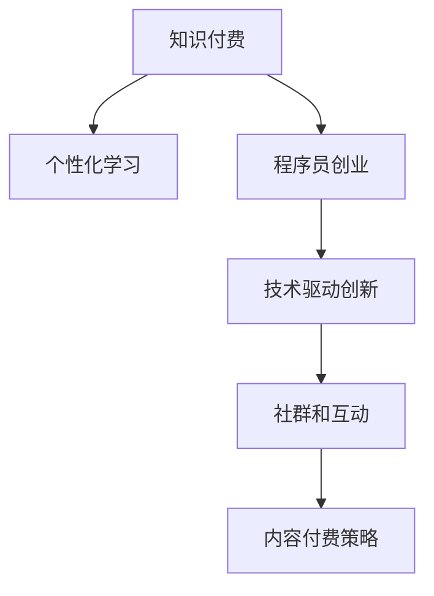

                 

# 知识付费时代程序员的创业思维

## 1. 背景介绍

### 1.1 问题由来

随着互联网的快速发展和知识经济的崛起，知识付费市场正迎来爆发式增长。在信息过载的时代，越来越多的人愿意为获取高质量、高效率的个性化知识付费，从而催生了知识付费产业的蓬勃发展。

而在程序员群体中，知识付费更是一个高频词汇。凭借着编程能力的专业性，程序员拥有着较为独特的市场优势。然而，传统的课程和培训往往存在内容冗余、针对性不足等问题，无法真正满足程序员的个性化学习需求。知识付费时代的来临，为程序员提供了更为灵活、高效的自学途径，也为程序员创业提供了新的机遇和挑战。

### 1.2 问题核心关键点

知识付费时代，程序员的创业思维应围绕以下几个核心关键点进行：

- **个性化学习需求**：知识付费市场的消费者更加注重个性化和实用性，传统课程无法满足的个性化学习需求，成为程序员创业的切入点。
- **高效学习方式**：随着时间成本的上升，程序员对于学习的效率要求越来越高，这也要求创业者提供更加高效的学习方式，如视频课程、实战项目、社群交流等。
- **内容付费策略**：高质量、有价值的内容是知识付费的核心竞争力，程序员创业应注重内容的独特性和实用性，打造自己的知识品牌。
- **社群和互动**：知识付费不仅是内容的消费，更是一种社区文化的形成。程序员创业者应建立有效的社群，促进知识分享和互动，提升用户粘性。
- **技术创新**：在竞争激烈的领域，技术创新是实现差异化的关键，程序员应积极利用前沿技术，提升产品的核心竞争力。

## 2. 核心概念与联系

### 2.1 核心概念概述

为更好地理解知识付费时代程序员的创业思维，本节将介绍几个关键概念：

- **知识付费**：用户为获取有价值、个性化的知识内容而支付费用的服务模式，体现了知识的稀缺性和价值性。
- **程序员创业**：指程序员利用自身专业技能和知识，创建满足市场需求的新型企业或产品。
- **个性化学习**：根据用户需求，提供定制化的学习方案，提升学习效率和满意度。
- **技术驱动创新**：通过技术的持续迭代和应用，推动产品和服务不断优化和升级，实现差异化竞争。

### 2.2 核心概念原理和架构的 Mermaid 流程图



这个流程图展示了知识付费时代程序员创业的核心概念及其之间的联系：

1. 知识付费市场推动了个性化学习的普及，这是程序员创业的切入点。
2. 程序员创业者通过提供个性化学习内容，吸引用户付费，形成良性循环。
3. 在个性化学习的基础上，技术驱动创新使得产品和服务持续优化。
4. 通过高效的社群和互动，提升用户粘性，实现用户增长和复购。
5. 内容付费策略使得内容创作者能够专注于提升内容质量，形成正反馈。

这些概念共同构成了知识付费时代程序员创业的全貌，使我们能够更好地把握其中的关键因素和机会。

## 3. 核心算法原理 & 具体操作步骤
### 3.1 算法原理概述

程序员创业者在知识付费领域的成功，需要依托于一系列的算法和模型来支持。这些算法和模型可以从数据采集、用户画像、个性化推荐、效果评估等多个维度提升用户体验和产品竞争力。

- **数据采集与处理**：通过爬虫技术、API接口等手段，获取海量用户行为数据，用于用户画像和推荐系统的训练。
- **用户画像**：通过对用户行为数据的分析，构建用户画像，识别用户兴趣和需求，为用户提供定制化的学习内容。
- **个性化推荐**：利用机器学习模型，如协同过滤、深度学习等，推荐与用户兴趣相匹配的课程和项目，提升用户满意度和转化率。
- **效果评估**：通过A/B测试、用户反馈等方法，评估个性化推荐和内容的质量，不断优化模型。

### 3.2 算法步骤详解

以下是知识付费平台的核心算法步骤：

**Step 1: 数据采集与处理**

1. 使用爬虫技术或API接口，获取用户行为数据，包括浏览记录、购买行为、评价反馈等。
2. 对数据进行清洗和预处理，去除噪声和无关数据，保证数据质量。
3. 对数据进行标准化处理，确保不同来源的数据格式一致。

**Step 2: 用户画像构建**

1. 利用用户行为数据，使用聚类算法（如K-means）对用户进行分类。
2. 对每个用户类别，通过特征工程，提取关键行为特征（如学习时间、购买频率等）。
3. 构建用户画像，保存每个用户的关键特征和标签。

**Step 3: 个性化推荐**

1. 根据用户画像，使用协同过滤算法（如ALS）或深度学习模型（如CTR），推荐课程或项目。
2. 实时更新推荐结果，根据用户反馈和行为数据，不断优化推荐模型。
3. 引入多臂老虎机算法，平衡推荐多样性和准确性。

**Step 4: 效果评估**

1. 使用A/B测试，对比不同推荐策略的效果。
2. 收集用户反馈，进行情感分析，评估推荐效果。
3. 定期进行模型评估，调整算法参数，优化推荐质量。

### 3.3 算法优缺点

知识付费平台的核心算法具有以下优点：

1. 提升用户体验：通过个性化推荐，满足用户多样化学习需求，提升学习效率和满意度。
2. 增加用户粘性：有效的社群和互动，提升用户粘性，增加用户留存率。
3. 提升转化率：精准的推荐系统，增加用户付费意愿，提升转化率。
4. 技术驱动创新：通过不断优化推荐算法和内容策略，保持产品竞争力。

同时，这些算法也存在一些局限性：

1. 数据依赖度高：算法的效果高度依赖于数据的质量和多样性，获取高质量的数据是关键。
2. 冷启动问题：新用户没有足够的历史行为数据，难以构建准确的画像，需要借助其他方式进行初始化。
3. 模型复杂度：深度学习模型需要较大的计算资源，可能面临性能和成本的挑战。
4. 内容生成难度高：高质量内容的生成和更新需要持续投入，成本较高。

尽管存在这些局限性，但知识付费平台的核心算法仍然是大规模用户需求和数据驱动的，能够有效提升用户满意度和平台收益。

### 3.4 算法应用领域

知识付费平台的算法主要应用于以下几个领域：

1. **个性化课程推荐**：基于用户画像和行为数据，推荐与用户兴趣相匹配的课程，提升用户学习体验。
2. **学习路径规划**：根据用户的学习进度和偏好，推荐合适的学习路径，帮助用户高效达成学习目标。
3. **社群互动**：利用智能算法，引导用户参与社群讨论，增强互动和用户粘性。
4. **智能客服**：通过自然语言处理技术，提升用户服务质量，解答用户咨询。
5. **广告投放**：通过精准的推荐算法，优化广告投放策略，提高广告转化率。

这些领域的应用，使知识付费平台能够更高效地满足用户需求，提升用户体验和平台收益。

## 4. 数学模型和公式 & 详细讲解 & 举例说明

### 4.1 数学模型构建

在知识付费平台的核心算法中，数学模型起到了至关重要的作用。以下以推荐系统为例，介绍推荐模型的构建和优化过程。

推荐系统的主要目标是通过训练模型，预测用户对特定课程或项目的评分（或点击率、购买率等），从而实现个性化推荐。

假设用户集合为 $U$，课程集合为 $I$，用户对课程的评分矩阵为 $R_{ui}$。推荐系统通过训练模型 $\hat{R}_{ui}$，使得 $\hat{R}_{ui}$ 尽可能接近 $R_{ui}$。推荐模型的目标函数为：

$$
\min_{\theta} \frac{1}{n} \sum_{u=1}^n \sum_{i=1}^m (R_{ui} - \hat{R}_{ui})^2
$$

其中 $\theta$ 为模型参数，$n$ 为用户数，$m$ 为课程数。

### 4.2 公式推导过程

基于协同过滤算法的推荐模型，假设用户 $u$ 对课程 $i$ 的评分由两部分组成：用户特征 $X_u$ 和课程特征 $X_i$。推荐模型为：

$$
\hat{R}_{ui} = \hat{\beta}_u^T X_i + \hat{\beta}_i^T X_u + \hat{\beta}_{ui}^T X_uX_i^T
$$

其中 $\hat{\beta}_u$ 为用户特征的权重，$\hat{\beta}_i$ 为课程特征的权重，$\hat{\beta}_{ui}$ 为用户和课程特征的交互权重。

模型的优化目标为最小化预测误差：

$$
\min_{\theta} \frac{1}{n} \sum_{u=1}^n \sum_{i=1}^m (R_{ui} - \hat{R}_{ui})^2
$$

通过梯度下降算法，求解模型参数 $\theta$，得到推荐结果 $\hat{R}_{ui}$。

### 4.3 案例分析与讲解

以一个简单的知识付费平台为例，分析推荐系统的实际应用。

假设有一个知识付费平台，用户 $u$ 对课程 $i$ 的评分矩阵为：

| 用户  | 课程1 | 课程2 | 课程3 |
| ---- | ---- | ---- | ---- |
| 用户1 | 4    | 3    | 2    |
| 用户2 | 5    | 2    | 1    |

平台通过协同过滤算法，预测用户 $u$ 对课程 $i$ 的评分，并推荐用户 $u$ 可能感兴趣的课程。

设用户特征 $X_u = [1, 0, 0]$，课程特征 $X_i = [0, 1, 0]$，用户和课程特征的交互权重 $\hat{\beta}_{ui} = [0, 0, 0]$。则推荐模型为：

$$
\hat{R}_{ui} = \hat{\beta}_u^T X_i + \hat{\beta}_i^T X_u + \hat{\beta}_{ui}^T X_uX_i^T = 0
$$

根据预测结果，平台可以向用户1推荐课程1和课程2，向用户2推荐课程2和课程3。

## 5. 项目实践：代码实例和详细解释说明
### 5.1 开发环境搭建

在进行知识付费平台开发前，我们需要准备好开发环境。以下是使用Python进行Flask开发的环境配置流程：

1. 安装Anaconda：从官网下载并安装Anaconda，用于创建独立的Python环境。

2. 创建并激活虚拟环境：
```bash
conda create -n knowledge-platform python=3.8 
conda activate knowledge-platform
```

3. 安装Flask：
```bash
pip install flask
```

4. 安装Flask-SQLAlchemy和Flask-RESTful：
```bash
pip install flask-sqlalchemy flask-restful
```

5. 安装SQLite数据库和Flask-Session：
```bash
pip install sqlalchemy sqlite3 flask-session
```

完成上述步骤后，即可在`knowledge-platform`环境中开始知识付费平台的开发。

### 5.2 源代码详细实现

下面我们以一个简单的知识付费平台为例，给出Flask框架下的代码实现。

首先，定义SQLite数据库和用户、课程模型：

```python
from flask_sqlalchemy import SQLAlchemy
from flask import Flask, jsonify

app = Flask(__name__)
app.config['SQLALCHEMY_DATABASE_URI'] = 'sqlite:///example.db'
db = SQLAlchemy(app)

class User(db.Model):
    id = db.Column(db.Integer, primary_key=True)
    name = db.Column(db.String(80), nullable=False)
    age = db.Column(db.Integer, nullable=False)
    courses = db.relationship('Course', backref='users', lazy=True)

class Course(db.Model):
    id = db.Column(db.Integer, primary_key=True)
    name = db.Column(db.String(80), nullable=False)
    user_id = db.Column(db.Integer, db.ForeignKey('user.id', ondelete='CASCADE'), nullable=False)
    ratings = db.relationship('Rating', backref='courses', lazy=True)

class Rating(db.Model):
    id = db.Column(db.Integer, primary_key=True)
    value = db.Column(db.Float, nullable=False)
    course_id = db.Column(db.Integer, db.ForeignKey('course.id', ondelete='CASCADE'), nullable=False)
    user_id = db.Column(db.Integer, db.ForeignKey('user.id', ondelete='CASCADE'), nullable=False)
```

然后，定义推荐模型和推荐算法：

```python
import numpy as np
from sklearn.metrics.pairwise import cosine_similarity

class RecommendationEngine:
    def __init__(self, db, top_n=5):
        self.db = db
        self.top_n = top_n
    
    def recommend(self, user_id):
        user = self.db.session.query(User).get(user_id)
        courses = self.db.session.query(Course).all()
        user_ratings = np.array([r.value for r in user.ratings])
        user_vector = user_ratings / np.linalg.norm(user_ratings)
        similarities = cosine_similarity(user_vector, [np.array([0]*len(courses), dtype=float)])
        sorted_indices = np.argsort(similarities)[::-1]
        recommendations = [(c.id, similarities[0, i]) for i in sorted_indices[:self.top_n]]
        return jsonify(recommendations)
```

最后，定义Flask视图和API接口：

```python
@app.route('/recommend', methods=['GET'])
def recommend():
    user_id = request.args.get('user_id')
    recommendations = RecommendationEngine(db).recommend(int(user_id))
    return recommendations

if __name__ == '__main__':
    app.run(debug=True)
```

完成上述代码后，即可运行知识付费平台，并通过API接口获取个性化推荐结果。

### 5.3 代码解读与分析

让我们再详细解读一下关键代码的实现细节：

**User、Course、Rating类**：
- 定义了用户、课程、评分表的数据库模型，并建立了多对多关系，表示用户对课程的评分。

**RecommendationEngine类**：
- 定义了推荐引擎的类，包含推荐方法。
- 在推荐方法中，首先从数据库获取用户和课程的评分数据，计算用户向量。
- 使用余弦相似度计算用户和课程之间的相似度，并按相似度排序，选取Top N推荐课程。

**Flask视图和API接口**：
- 定义了Flask视图，实现推荐API接口。
- 通过API接口获取用户ID，调用推荐引擎的推荐方法，返回推荐课程列表。

可以看到，Flask框架和SQLite数据库使得知识付费平台的开发变得相对简单高效。开发者可以专注于算法和业务逻辑的实现，而不必过多关注底层技术细节。

当然，工业级的系统实现还需考虑更多因素，如用户认证、数据存储、缓存策略等。但核心的推荐算法基本与此类似。

## 6. 实际应用场景

### 6.1 智能教育

智能教育是知识付费平台的重要应用领域之一。在传统教育中，教师资源和教学内容往往存在不足，难以满足学生的个性化学习需求。知识付费平台通过推荐系统，能够为学生提供个性化的学习方案和资源，提升学习效果。

具体而言，平台可以通过分析学生的学习历史和行为数据，推荐合适的课程和资料。例如，通过推荐系统推荐个性化的学习路径，帮助学生高效达成学习目标；通过智能作业批改，及时反馈学生的学习情况，提升学习效率。

### 6.2 企业培训

企业培训市场同样是大规模知识付费的应用场景。随着企业对员工技能要求的不断提高，传统的培训方式无法满足多样化的需求。知识付费平台通过推荐系统，能够为员工提供定制化的培训资源和课程，提升培训效果。

平台可以整合企业内部的课程资源，并通过推荐系统，根据员工的职业规划和发展需求，推荐合适的培训课程。例如，通过推荐系统推荐员工感兴趣的培训内容，提升员工的学习动力和参与度；通过学习分析，评估培训效果，优化培训方案。

### 6.3 在线课程

在线课程市场是知识付费平台的核心业务。平台通过推荐系统，能够为不同兴趣和需求的学员推荐合适的课程，提升课程销售和用户粘性。

具体而言，平台可以通过分析用户的学习历史和行为数据，推荐符合用户兴趣和需求的课程。例如，通过推荐系统推荐热门课程，提升课程曝光和销售；通过个性化课程推荐，提升用户的满意度和续费率。

### 6.4 未来应用展望

随着知识付费市场的不断成熟，未来的知识付费平台将呈现以下几个发展趋势：

1. **内容多样化**：平台将提供更丰富的内容形式，如视频课程、直播互动、社群讨论等，满足用户多样化需求。
2. **技术智能化**：平台将引入更多先进技术，如自然语言处理、图像识别、语音识别等，提升内容生成和推荐效果。
3. **社区化运营**：平台将加强社区建设，通过社群互动和知识分享，增强用户粘性和平台活力。
4. **个性化定制**：平台将深入挖掘用户需求，提供更加个性化的学习方案和资源，提升用户体验。
5. **多元化盈利模式**：平台将探索更多盈利模式，如广告、会员、增值服务等，实现多元化发展。

## 7. 工具和资源推荐
### 7.1 学习资源推荐

为了帮助开发者系统掌握知识付费平台的开发和优化，这里推荐一些优质的学习资源：

1. **《Python网络爬虫开发实战》**：详细介绍了网络爬虫的开发和应用，是获取用户行为数据的重要工具。
2. **《机器学习实战》**：介绍了机器学习的基本原理和算法，是推荐系统开发的基础。
3. **《深度学习入门》**：介绍了深度学习的基本原理和模型，是构建推荐系统核心算法的基础。
4. **《Flask Web开发》**：介绍了Flask框架的使用方法，是知识付费平台后端开发的基础。
5. **《SQL入门与实践》**：介绍了SQL语言的基本用法和实践技巧，是知识付费平台数据库管理的基础。

通过对这些资源的学习实践，相信你一定能够快速掌握知识付费平台的开发和优化技能，实现技术突破和商业成功。

### 7.2 开发工具推荐

高效的开发离不开优秀的工具支持。以下是几款用于知识付费平台开发的常用工具：

1. **Jupyter Notebook**：提供交互式编程环境，支持多种语言和框架，是数据科学和机器学习的常用工具。
2. **PyCharm**：提供强大的代码编辑和调试功能，支持多种语言和框架，是知识付费平台开发的主流工具。
3. **Visual Studio Code**：轻量级的代码编辑器，支持多种语言和扩展，是知识付费平台开发的高效工具。
4. **GitHub**：全球最大的开源社区，提供代码托管和协作功能，是知识付费平台开发的必备工具。
5. **Anaconda**：提供数据科学和机器学习的综合开发环境，是知识付费平台开发的重要支持。

合理利用这些工具，可以显著提升知识付费平台的开发效率，加快创新迭代的步伐。

### 7.3 相关论文推荐

知识付费平台的算法和模型涉及众多前沿研究，以下是几篇奠基性的相关论文，推荐阅读：

1. **《协同过滤推荐系统》**：介绍了协同过滤推荐系统的基本原理和算法，是推荐系统开发的基础。
2. **《深度学习在推荐系统中的应用》**：介绍了深度学习在推荐系统中的最新进展，是构建高效推荐系统的重要参考。
3. **《个性化学习推荐系统》**：介绍了个性化学习推荐系统的基本原理和算法，是知识付费平台推荐系统开发的重要参考。
4. **《用户画像在推荐系统中的应用》**：介绍了用户画像在推荐系统中的重要性，是优化推荐效果的重要方法。

这些论文代表了大数据、机器学习和知识图谱在知识付费平台推荐系统中的应用，将为开发者提供深厚的理论基础和实践指导。

## 8. 总结：未来发展趋势与挑战

### 8.1 总结

本文对知识付费时代程序员的创业思维进行了全面系统的介绍。首先阐述了知识付费市场的兴起背景，明确了程序员在知识付费领域的机会和挑战。其次，从原理到实践，详细讲解了知识付费平台的核心算法和实现方法，给出了知识付费平台开发的完整代码实例。同时，本文还广泛探讨了知识付费平台在智能教育、企业培训、在线课程等多个行业领域的应用前景，展示了知识付费平台的广阔前景。最后，本文精选了知识付费平台的各类学习资源，力求为读者提供全方位的技术指引。

通过本文的系统梳理，可以看到，知识付费平台在满足用户个性化学习需求方面具有巨大潜力，为程序员创业者提供了新的机遇。伴随知识付费市场的不断成熟，知识付费平台的算法和模型也将不断优化和升级，为程序员创业者带来更多技术创新和商业机会。

### 8.2 未来发展趋势

展望未来，知识付费平台将呈现以下几个发展趋势：

1. **技术创新**：随着技术的发展，知识付费平台将引入更多先进技术，如自然语言处理、图像识别、语音识别等，提升内容生成和推荐效果。
2. **社区化运营**：知识付费平台将加强社区建设，通过社群互动和知识分享，增强用户粘性和平台活力。
3. **多元化盈利模式**：平台将探索更多盈利模式，如广告、会员、增值服务等，实现多元化发展。
4. **国际化拓展**：知识付费平台将拓展海外市场，提供多语言支持和国际化服务，提升全球竞争力。
5. **内容差异化**：平台将不断优化内容，提升课程和资料的差异化水平，满足用户多样化的需求。

以上趋势凸显了知识付费平台的广阔前景。这些方向的探索发展，将进一步提升平台的用户体验和收益，实现技术的深度融合和商业的持续创新。

### 8.3 面临的挑战

尽管知识付费平台的发展前景广阔，但在迈向更加智能化、普适化应用的过程中，它仍面临诸多挑战：

1. **数据质量问题**：平台的数据质量对算法效果有着重要影响，如何获取和处理高质量的数据是关键。
2. **用户粘性提升**：平台需要不断优化用户体验和内容质量，才能提升用户粘性，防止用户流失。
3. **内容生成难度**：高质量内容的生成和更新需要持续投入，成本较高。
4. **技术复杂度**：推荐算法和内容生成技术的复杂度较高，需要持续优化和迭代。
5. **市场竞争**：知识付费平台面临众多竞争对手，需要不断创新和优化，保持市场竞争力。

正视这些挑战，积极应对并寻求突破，将是大数据、机器学习等技术在知识付费领域成功应用的重要保障。相信随着技术的不断进步和市场的持续发展，知识付费平台必将迎来更加光明的未来。

### 8.4 研究展望

面对知识付费平台面临的挑战，未来的研究需要在以下几个方面寻求新的突破：

1. **数据质量提升**：引入更多元化数据源，提升数据质量和多样性，确保算法效果。
2. **内容生成创新**：引入更多技术创新，如生成对抗网络（GAN）、自然语言生成（NLG）等，提升内容生成效果。
3. **个性化推荐优化**：优化推荐算法，引入更多先进技术，如深度强化学习、因果推理等，提升推荐效果。
4. **用户行为分析**：深入挖掘用户行为数据，提升用户画像的准确性和个性化推荐效果。
5. **技术协同优化**：引入更多技术协同机制，如知识图谱、AI芯片等，提升平台的整体性能和效率。

这些研究方向将为知识付费平台的持续优化和创新提供坚实的基础，为程序员创业者带来更多的技术突破和商业机会。

## 9. 附录：常见问题与解答

**Q1：知识付费平台如何获取高质量数据？**

A: 知识付费平台的数据来源主要有两种：一是通过爬虫技术从互联网上抓取数据，二是通过API接口从第三方平台获取数据。

在爬虫技术中，需要选择合适的数据源，编写高效的爬虫脚本，进行数据清洗和预处理，确保数据质量。常见的数据源包括公开的API接口、社交媒体、公开的文档等。

在API接口获取数据中，需要选择合适的API服务，申请相应的访问权限，进行数据调用和处理，确保数据准确性和完整性。常见的API服务包括天气API、金融API、电商API等。

**Q2：知识付费平台如何进行数据清洗和预处理？**

A: 数据清洗和预处理是确保数据质量的重要环节。常见的数据清洗和预处理技术包括：

1. **数据去重**：去除重复数据，确保数据的唯一性。
2. **数据清洗**：去除噪声和无关数据，确保数据的质量和完整性。
3. **数据标准化**：对不同来源的数据进行格式转换，确保数据的一致性。
4. **数据填充**：对缺失数据进行填补，确保数据的完整性。
5. **数据采样**：对数据进行采样，确保样本的代表性。

通过以上技术手段，可以确保数据的质量和一致性，为推荐算法和内容生成提供可靠的输入。

**Q3：知识付费平台如何进行个性化推荐？**

A: 个性化推荐是知识付费平台的核心功能之一，主要通过协同过滤算法和深度学习算法实现。

协同过滤算法通过分析用户和课程的评分数据，计算用户和课程的相似度，推荐与用户兴趣相匹配的课程。常见的协同过滤算法包括ALS（交替最小二乘法）和SVD（奇异值分解）。

深度学习算法通过训练神经网络模型，预测用户对课程的评分，推荐与用户兴趣相匹配的课程。常见的深度学习模型包括CTR（点击率预测）和RNN（循环神经网络）。

**Q4：知识付费平台如何进行效果评估？**

A: 知识付费平台的效果评估主要通过A/B测试和用户反馈实现。

A/B测试通过对比不同推荐策略的效果，评估推荐算法的性能。常见的A/B测试方法包括逐级分组和随机分组。

用户反馈通过收集用户对推荐结果的评分和评价，评估推荐效果。常见的用户反馈方法包括满意度调查和情感分析。

通过A/B测试和用户反馈，可以不断优化推荐算法，提升平台的用户满意度和收益。

---

作者：禅与计算机程序设计艺术 / Zen and the Art of Computer Programming

