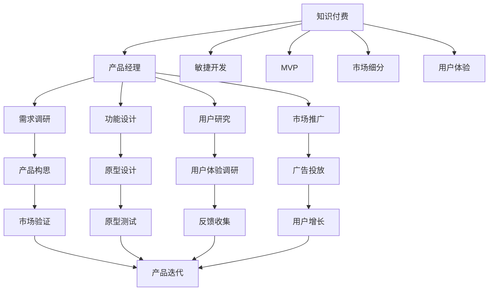

                 

# 知识付费时代程序员的创业思维与策略

## 1. 背景介绍

### 1.1 问题由来

随着互联网技术的迅猛发展，数字经济逐渐成为推动全球经济增长的重要引擎。在这一过程中，知识和信息作为重要的生产要素，其价值日益凸显。程序员作为数字经济的核心力量，自然也成为了知识付费的受益者和驱动者。

然而，传统的程序员创业模式面临着成本高、风险大、周期长等诸多问题。如何在知识付费时代，利用程序员在技术和市场洞察上的优势，快速迭代产品，获取市场反馈，同时保持创业的灵活性和低成本性，成为程序员创业的关键挑战。

### 1.2 问题核心关键点

程序员在知识付费时代的创业过程中，需要关注的核心关键点包括：

- **市场需求**：如何快速洞察市场变化，准确把握用户需求，设计出满足用户痛点的产品。
- **技术壁垒**：如何利用自身技术优势，构建具有创新性的产品差异化，形成核心竞争力。
- **商业模式**：如何构建可持续的商业模式，实现从技术到产品的快速转换，并确保盈利。
- **用户获取**：如何高效获取和留存用户，利用知识付费的优势，提高用户体验和粘性。
- **市场竞争**：如何应对激烈的市场竞争，不断迭代产品，保持领先优势。

本文将围绕上述核心关键点，探讨程序员在知识付费时代进行创业时所应具备的思维方式和具体策略。

### 1.3 问题研究意义

在知识付费时代，程序员的创业思维和策略直接决定了项目的成功与否。快速获取市场反馈，优化产品，构建良好的用户体验，是程序员创业成功的关键。

本文旨在为程序员提供一套完整的创业思维和策略，通过案例分析和实战经验，帮助程序员更好地应对市场变化，把握技术发展趋势，从而提升创业成功率。同时，本文还将介绍一些实用的工具和资源，为程序员提供创业过程中的有力支持。

## 2. 核心概念与联系

### 2.1 核心概念概述

要深入理解程序员在知识付费时代的创业思维与策略，需要理解以下几个核心概念：

- **知识付费**：指消费者为获取知识、技术、经验等有价值的信息而支付费用的商业模式。知识付费可以帮助消费者更快地获取专业知识和技能。

- **产品经理**：负责产品从构思到上市的全过程，包括需求调研、功能设计、用户研究、市场推广等环节。产品经理在创业团队中起到桥梁作用，确保技术和市场需求之间的匹配。

- **敏捷开发**：一种以迭代、增量、反馈为特点的软件开发模式，通过快速迭代，实现产品快速上市和持续改进。

- **最小可行产品(MVP)**：指最小功能集合的产品，用于验证商业模型和产品原型。MVP可以快速上线，获取市场反馈，降低风险。

- **市场细分**：指将大市场分割成若干细分市场，针对特定细分市场进行精准定位和市场推广。市场细分可以帮助产品更好地满足目标用户需求。

- **用户体验(UX)**：指用户在使用产品过程中的整体体验，包括界面设计、交互设计、内容呈现等环节。良好的用户体验可以提高用户满意度和忠诚度。

### 2.2 核心概念原理和架构的 Mermaid 流程图



这个流程图展示了知识付费时代程序员创业的基本流程：

1. 从知识付费的商业模式出发，产品经理进行需求调研和市场分析，设计出满足用户需求的产品构思。
2. 敏捷开发模式和最小可行产品(MVP)策略，快速迭代产品原型，获取市场反馈，降低风险。
3. 通过市场细分和用户体验设计，实现精准定位和用户粘性提升。
4. 市场推广和用户增长策略，确保产品上线后的成功推广和用户留存。
5. 根据市场验证和用户体验反馈，持续迭代产品，不断优化用户体验，保持产品竞争力。

## 3. 核心算法原理 & 具体操作步骤

### 3.1 算法原理概述

程序员在知识付费时代的创业，本质上是一个市场驱动的决策和迭代过程。其核心算法原理可以归纳为以下几个方面：

- **市场导向**：通过用户调研和市场分析，把握市场需求和趋势，设计出满足用户痛点的产品。
- **敏捷迭代**：采用敏捷开发方法，快速迭代产品原型，不断获取市场反馈，及时调整产品策略。
- **数据驱动**：利用数据分析工具，量化用户行为和市场表现，为产品优化提供依据。
- **反馈循环**：建立用户反馈机制，及时获取用户意见，根据反馈调整产品功能和服务。

### 3.2 算法步骤详解

程序员在知识付费时代的创业过程中，可以遵循以下算法步骤：

**Step 1: 市场调研与需求分析**
- 通过问卷调查、用户访谈等方式，深入了解目标用户群体，挖掘用户需求。
- 分析竞品功能和市场表现，找出市场空缺和痛点。

**Step 2: 产品构思与功能设计**
- 结合市场需求和用户痛点，构思产品的核心功能和增值服务。
- 设计产品的原型和功能模块，确保产品的可扩展性和易用性。

**Step 3: 敏捷开发与MVP构建**
- 采用敏捷开发方法，将产品分为多个小迭代，快速构建最小可行产品。
- 进行原型测试，收集用户反馈，优化产品功能。

**Step 4: 市场推广与用户获取**
- 制定市场推广策略，通过社交媒体、广告投放等方式获取初始用户。
- 利用知识付费平台的优势，提供优质内容，提高用户粘性。

**Step 5: 数据分析与产品迭代**
- 利用数据分析工具，量化用户行为和市场表现，评估产品效果。
- 根据数据分析结果，调整产品策略，进行功能迭代和优化。

**Step 6: 用户反馈与产品优化**
- 建立用户反馈机制，及时获取用户意见和建议。
- 结合用户反馈，优化产品功能和用户体验，提升用户满意度。

### 3.3 算法优缺点

程序员在知识付费时代的创业算法，具有以下优点：

- **快速迭代**：通过敏捷开发和MVP策略，可以快速验证市场需求，降低风险。
- **用户导向**：注重用户调研和需求分析，确保产品满足用户痛点。
- **数据驱动**：利用数据分析工具，提供决策依据，提高产品优化效率。
- **反馈循环**：建立用户反馈机制，持续改进产品，提升用户粘性。

同时，该算法也存在一些局限性：

- **技术依赖**：依赖敏捷开发和数据分析工具，需要一定的技术基础和实践经验。
- **资源投入**：在敏捷迭代和市场推广阶段，需要一定的时间和资金投入。
- **用户体验要求高**：需要不断优化产品功能和用户体验，提高用户满意度。

### 3.4 算法应用领域

程序员在知识付费时代的创业算法，可以广泛应用到以下几个领域：

- **SaaS产品**：通过最小可行产品(MVP)策略，快速验证市场需求，构建可扩展的SaaS平台。
- **B2B解决方案**：利用敏捷开发方法，快速迭代产品，满足企业级客户的需求。
- **内容创业**：通过知识付费平台的优势，提供高质量内容和增值服务，吸引用户订阅和付费。
- **教育培训**：结合教育行业特性，设计个性化学习平台，提供高质量的在线教育服务。
- **健康医疗**：通过数据分析和用户反馈，优化健康医疗产品的功能和用户体验，提升用户满意度。

## 4. 数学模型和公式 & 详细讲解 & 举例说明

### 4.1 数学模型构建

在知识付费时代的程序员创业过程中，涉及的数学模型主要与用户行为分析和市场推广相关。

假设市场上有$N$个潜在用户，每个用户的付费概率为$p$。根据二项分布，可以构建用户付费的数学模型：

$$
P(X=k) = \binom{N}{k} p^k (1-p)^{N-k}
$$

其中$X$表示实际付费用户数，$k$为期望的付费用户数。

### 4.2 公式推导过程

为了优化产品功能和市场策略，需要对用户行为和市场表现进行量化分析。假设有$m$个用户对产品进行了评价，评价数据$R$服从均值为$\mu$，标准差为$\sigma$的正态分布：

$$
R \sim N(\mu, \sigma^2)
$$

则用户评价的期望值和方差分别为：

$$
\mu = \frac{\sum_{i=1}^m R_i}{m}, \sigma^2 = \frac{\sum_{i=1}^m (R_i - \mu)^2}{m}
$$

通过统计分析，可以得到用户对产品的整体满意度，并据此优化产品功能和市场策略。

### 4.3 案例分析与讲解

假设某程序员创业团队开发了一款在线编程教育平台，根据市场需求调研，确定用户群体的主要需求为高效学习、互动教学和个性化推荐。因此，团队设计了MVP产品，并邀请100名目标用户进行测试。测试结果如下：

- 80%的用户表示对MVP产品的界面和交互体验满意，但仍有20%的用户对某些功能表示不满。
- 60%的用户表示愿意付费订阅MVP产品的高级功能，40%的用户愿意免费使用基础功能。

根据上述数据分析，团队进行了以下优化：

1. 对用户界面进行优化，提升用户体验。
2. 新增一些热门编程语言的在线教程，满足更多用户需求。
3. 提供个性化编程题目推荐，提升学习效率。

优化后，团队再次邀请100名用户进行测试，满意度提升至90%，付费用户比例提升至70%。

## 5. 项目实践：代码实例和详细解释说明

### 5.1 开发环境搭建

在进行知识付费时代程序员创业实践前，需要先搭建好开发环境。以下是Python环境搭建的步骤：

1. 安装Python：
```bash
sudo apt-get install python3 python-pip
```

2. 创建虚拟环境：
```bash
python3 -m venv pyenv
source pyenv/bin/activate
```

3. 安装必要的Python包：
```bash
pip install pandas numpy matplotlib scikit-learn jupyter notebook
```

完成上述步骤后，即可在虚拟环境中进行项目开发。

### 5.2 源代码详细实现

以下是一个简单的Python代码示例，展示了如何利用数据分析工具（如pandas）进行用户行为分析：

```python
import pandas as pd

# 读取用户行为数据
data = pd.read_csv('user_behavior.csv')

# 统计每个用户的行为次数
behavior_counts = data.groupby('user_id')['action'].count()

# 计算用户活跃度（月活跃用户数）
active_users = behavior_counts[behavior_counts > 1].count()

# 计算用户留存率
retention_rate = (active_users / len(behavior_counts)) * 100

print(f"Active users: {active_users}")
print(f"Retention rate: {retention_rate:.2f}%")
```

### 5.3 代码解读与分析

**行为数据读取**：
- 使用pandas的`read_csv`函数读取用户行为数据，数据格式为CSV格式。
- 将数据存储在`data`变量中，包含用户ID、行为类型等信息。

**行为次数统计**：
- 利用`groupby`函数对用户ID进行分组，统计每个用户的行为次数。
- 使用`count`函数计算每个用户的行动次数，并统计月活跃用户数。

**用户留存率计算**：
- 计算月活跃用户数与总用户数的比率，得到用户留存率。
- 输出月活跃用户数和用户留存率。

## 6. 实际应用场景

### 6.1 智能教育平台

在知识付费时代，程序员可以开发智能教育平台，提供高质量的在线课程和个性化学习体验。通过市场调研和用户需求分析，团队可以设计出满足用户需求的教育产品。利用敏捷开发和MVP策略，快速迭代产品，获取用户反馈，不断优化用户体验。通过知识付费平台，用户可以按需订阅课程，获取高质量的学习资源，提升学习效果。

### 6.2 医疗健康应用

程序员可以开发医疗健康应用，结合医疗行业的特性，设计个性化健康管理平台。通过市场调研和用户行为分析，团队可以了解用户对健康管理的痛点和需求，设计出满足用户需求的产品。利用敏捷开发和MVP策略，快速迭代产品，获取用户反馈，不断优化产品功能和用户体验。通过知识付费平台，用户可以获取健康管理的咨询服务，提升健康管理效果。

### 6.3 在线培训服务

程序员可以开发在线培训服务，提供高质量的在线培训课程和个性化培训体验。通过市场调研和用户需求分析，团队可以设计出满足用户需求的教育产品。利用敏捷开发和MVP策略，快速迭代产品，获取用户反馈，不断优化用户体验。通过知识付费平台，用户可以按需订阅培训课程，获取高质量的培训资源，提升培训效果。

### 6.4 未来应用展望

未来，知识付费时代程序员的创业将更加注重数据驱动和用户导向。通过市场调研和用户行为分析，团队可以更精准地把握市场需求和用户痛点，设计出满足用户需求的产品。利用敏捷开发和MVP策略，快速迭代产品，获取用户反馈，不断优化产品功能和用户体验。通过知识付费平台，用户可以获取高质量的知识和资源，提升个人技能和职业素养。

## 7. 工具和资源推荐

### 7.1 学习资源推荐

为了帮助程序员系统掌握知识付费时代的创业思维和策略，这里推荐一些优质的学习资源：

1. **《精益创业》书籍**：Eric Ries所写，介绍了精益创业的核心思想和方法，适用于创业初期的团队。
2. **《硅谷钢铁侠》视频课程**：由Coursera开设，介绍了创业公司的成功经验，适用于创业中后期的团队。
3. **《数据驱动的产品管理》课程**：由Coursera开设，介绍了利用数据分析工具进行产品优化的方法，适用于产品经理和创业团队。
4. **《创业融资指南》书籍**：Gary Keegan所写，介绍了创业融资的基本知识和技巧，适用于创业初期的团队。
5. **《知识付费平台的兴起》文章**：深入分析了知识付费平台的发展趋势和市场机会，适用于创业者参考。

通过学习这些资源，相信你一定能够掌握知识付费时代程序员的创业思维和策略，快速获取市场反馈，优化产品，提升创业成功率。

### 7.2 开发工具推荐

为了提高程序员在知识付费时代创业的效率，这里推荐几款常用的开发工具：

1. **Jupyter Notebook**：一个交互式的笔记本环境，支持Python、R、SQL等多种语言，适合数据分析和机器学习任务。
2. **PyCharm**：一款功能强大的Python IDE，支持智能编辑、代码调试和版本控制，适合开发复杂的Python项目。
3. **Visual Studio Code**：一款轻量级的代码编辑器，支持多种编程语言和插件，适合开发Web和移动应用。
4. **GitHub**：一个流行的代码托管平台，支持版本控制、协作开发和开源项目，适合团队协作和代码共享。
5. **AWS云平台**：一个云服务提供商，提供丰富的云资源和工具，适合部署和扩展Web应用。

合理利用这些工具，可以显著提升程序员在知识付费时代创业的效率，加速产品的迭代和优化。

### 7.3 相关论文推荐

知识付费时代的程序员创业，是一个多学科交叉的领域。以下是几篇具有代表性的相关论文，推荐阅读：

1. **《知识付费平台的兴起及其影响》**：分析了知识付费平台的发展现状和市场机会，探讨了其对教育、信息产业的影响。
2. **《程序员创业的案例分析》**：对多个程序员创业案例进行详细分析，总结了成功的经验和失败的教训。
3. **《敏捷开发在创业中的实践》**：介绍了敏捷开发的核心思想和方法，适用于创业团队快速迭代产品。
4. **《知识付费平台的用户行为分析》**：研究了知识付费平台上用户的行为模式和需求，为产品设计和市场推广提供了数据支持。
5. **《利用数据分析优化产品策略》**：介绍了如何利用数据分析工具，量化用户行为和市场表现，优化产品功能和市场策略。

这些论文代表了大数据时代程序员创业的最新研究进展，通过学习这些前沿成果，可以帮助程序员更好地把握创业机会，提升产品竞争力。

## 8. 总结：未来发展趋势与挑战

### 8.1 研究成果总结

在知识付费时代，程序员的创业需要具备数据驱动和用户导向的思维方式，采用敏捷开发和MVP策略，快速迭代产品，获取用户反馈，不断优化用户体验。通过数据分析和用户行为分析，可以量化市场表现和用户满意度，优化产品策略和市场推广，提升创业成功率。

### 8.2 未来发展趋势

展望未来，知识付费时代的程序员创业将呈现以下几个发展趋势：

1. **数据驱动**：越来越多的创业团队将利用大数据和人工智能技术，进行市场调研和用户行为分析，提高决策的科学性和准确性。
2. **用户导向**：关注用户体验和用户粘性，提供个性化和高质量的服务，增强用户满意度和忠诚度。
3. **敏捷迭代**：采用敏捷开发方法，快速迭代产品原型，获取市场反馈，优化产品功能，提升产品竞争力。
4. **平台化运营**：利用知识付费平台的优势，提供多渠道的分销和服务，提升市场覆盖率和用户规模。
5. **多元化服务**：结合多种技术和市场，提供多元化、综合性服务，满足用户多方面的需求。

### 8.3 面临的挑战

尽管知识付费时代的程序员创业具有广阔的发展前景，但在实际过程中，仍面临一些挑战：

1. **市场竞争激烈**：知识付费市场的竞争日益激烈，需要不断创新和优化产品，保持竞争力。
2. **技术壁垒高**：知识付费时代对技术和数据分析能力的要求较高，需要不断学习和提升。
3. **用户获取成本高**：获取高质量用户的成本较高，需要找到有效的用户获取和留存策略。
4. **产品迭代难度大**：快速迭代产品的过程中，需要平衡用户需求和产品功能，确保产品稳定性和用户体验。
5. **法律和伦理风险**：知识付费平台上涉及的知识产权和隐私保护问题，需要严格遵守法律法规，确保合规经营。

### 8.4 研究展望

未来，知识付费时代的程序员创业需要在技术、市场和用户等多个方面进行深入研究和探索，以应对挑战，抓住机遇：

1. **技术创新**：利用新技术和新工具，提升产品功能和用户体验，增强产品差异化。
2. **市场洞察**：深入分析市场需求和趋势，找到未被满足的市场空缺，设计出满足用户需求的产品。
3. **用户研究**：关注用户行为和需求变化，通过用户反馈持续优化产品，提升用户满意度。
4. **合规经营**：严格遵守法律法规，保障用户隐私和知识产权，确保合规经营。
5. **跨学科融合**：结合心理学、经济学、社会学等多个学科，进行综合分析，提升产品设计和服务水平。

总之，知识付费时代的程序员创业，需要不断创新和优化产品，关注用户体验和市场变化，确保技术领先和合规经营，方能在激烈的市场竞争中脱颖而出。

## 9. 附录：常见问题与解答

**Q1：如何选择合适的知识付费平台？**

A: 选择合适的知识付费平台，需要考虑以下因素：平台的用户规模、用户质量、课程种类、定价模式、技术支持等。可以通过市场调研和用户反馈，综合评估各平台的优势和劣势，选择最适合自己的平台。

**Q2：如何设计用户友好的界面？**

A: 设计用户友好的界面，需要考虑以下因素：界面的简洁性、易用性、视觉设计等。可以借鉴成功的产品设计案例，通过用户测试和反馈，不断优化界面设计，提升用户体验。

**Q3：如何快速获取用户？**

A: 快速获取用户，可以通过以下策略：利用社交媒体和广告投放，进行市场推广；提供免费试用和优惠活动，吸引用户注册；通过内容营销，吸引目标用户关注。

**Q4：如何确保产品安全和合规？**

A: 确保产品安全和合规，需要严格遵守法律法规和行业规范。可以建立合规管理体系，定期进行安全审计和风险评估，确保数据安全和个人隐私保护。

**Q5：如何优化用户留存率？**

A: 优化用户留存率，可以通过以下策略：提供优质的内容和增值服务，提升用户满意度；建立用户反馈机制，及时获取用户意见；提供个性化推荐和个性化服务，增强用户粘性。

本文深入探讨了知识付费时代程序员的创业思维与策略，通过案例分析和实战经验，帮助程序员更好地应对市场变化，把握技术发展趋势，提升创业成功率。同时，本文还介绍了一些实用的工具和资源，为程序员提供创业过程中的有力支持。希望通过本文的系统梳理，程序员能够更好地在知识付费时代进行创业，实现技术与市场的双赢。

