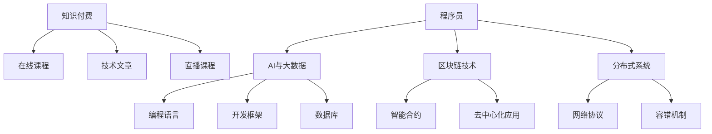

                 

# 知识付费时代程序员的致富之道与机遇

> 关键词：知识付费, 程序员, 人工智能, 算法, 大数据, 区块链, 区块链技术, 分布式系统

## 1. 背景介绍

### 1.1 问题由来
随着互联网和信息技术的高速发展，程序员作为推动这一进程的核心力量，其需求和价值不断上升。然而，在技术快速迭代的今天，如何提高编程技能，快速适应新技术、新趋势，同时实现个人财富增长，成为越来越多程序员面临的挑战。

知识付费平台的兴起，为程序员提供了一个全新的职业发展路径。通过系统学习新知识、掌握新技能，程序员不仅可以提高自身市场竞争力，还能在知识付费领域实现自我价值和财富积累。本文将深入探讨知识付费时代程序员的致富之道和未来机遇，帮助程序员在数字经济的浪潮中抓住机遇，实现职业生涯的飞跃。

## 2. 核心概念与联系

### 2.1 核心概念概述

在知识付费时代，程序员面临的核心概念包括但不限于：

- **知识付费**：指用户为获取有价值的知识内容而支付费用的行为，包括在线课程、技术文章、直播课程等多种形式。
- **程序员**：指从事软件开发、系统架构、数据分析等技术工作的人员，通常具有较强的编程能力和技术理解能力。
- **人工智能（AI）**：涉及机器学习、深度学习、自然语言处理等前沿技术，是知识付费时代的重要应用领域。
- **大数据**：指海量数据的收集、存储、处理和分析，是实现人工智能和知识付费技术的基础。
- **区块链技术**：一种去中心化的分布式账本技术，具有不可篡改、高度透明等特点，正在被应用于知识付费和程序员职业发展的各个方面。
- **分布式系统**：涉及多台计算机协同工作，实现高性能和可扩展性，是知识付费平台和企业级应用的核心架构之一。

这些概念之间的联系可以通过以下Mermaid流程图来展示：



这个流程图展示了一些核心概念及其之间的关系：

1. 知识付费平台的搭建和运营，需要依托程序员构建的在线课程、技术文章和直播课程。
2. 程序员通过学习AI与大数据技术，掌握相关编程语言和开发框架，实现高效的知识生产和内容传播。
3. 区块链技术为知识付费提供了去中心化、安全可靠的解决方案，程序员可以通过区块链技术参与知识付费生态的构建。
4. 分布式系统架构是知识付费平台和企业级应用的底层技术支持，程序员在这一领域的研究和应用也是实现职业发展的关键。

## 3. 核心算法原理 & 具体操作步骤

### 3.1 算法原理概述

知识付费平台通常采用基于订阅或按需付费的商业模式，利用算法推荐系统为用户推荐高质量的内容。程序员通过参与知识付费，不仅能提升自己的技能水平，还能获得相应的经济回报。

基于监督学习的推荐算法，通过用户行为数据（如观看时长、评价等）训练出推荐模型，预测用户可能感兴趣的内容。常见的算法包括协同过滤、基于内容的推荐、深度学习推荐系统等。

### 3.2 算法步骤详解

基于监督学习的推荐算法步骤一般包括以下几个关键步骤：

1. **数据收集与处理**：收集用户行为数据（如观看时长、评价等）和内容特征（如标题、标签等），进行数据清洗和预处理。
2. **特征工程**：设计并提取用户和内容的特征向量，常用的特征包括用户ID、内容ID、时间戳、标签等。
3. **模型训练**：选择适当的推荐算法，并使用训练数据集进行模型训练。常用的算法有基于矩阵分解的协同过滤算法、基于深度神经网络的推荐系统等。
4. **模型评估**：使用测试集对模型进行评估，常用的指标包括准确率、召回率、F1-score等。
5. **模型部署**：将训练好的模型部署到推荐系统服务器，实时推荐内容给用户。

### 3.3 算法优缺点

基于监督学习的推荐算法具有以下优点：

- **高效性**：能够快速处理大规模数据，推荐系统实时性高。
- **准确性**：通过学习用户和内容的特征，能够较为准确地预测用户偏好。
- **可扩展性**：适用于各种推荐场景，包括视频、文章、商品等。

然而，这些算法也存在一些缺点：

- **冷启动问题**：新用户或新内容难以获取推荐，需要一定时间积累数据。
- **过拟合风险**：当数据量不足时，模型可能过拟合用户历史行为，无法推荐新内容。
- **推荐多样性不足**：用户容易陷入内容推荐中的"信息茧房"，无法获得多样化的信息。

### 3.4 算法应用领域

基于监督学习的推荐算法广泛应用于以下几个领域：

- **视频推荐**：根据用户观看历史，推荐相似或相关的视频内容。
- **文章推荐**：根据用户阅读行为，推荐相关主题或作者的文章。
- **商品推荐**：根据用户购买历史，推荐相关商品或搭配。
- **音乐推荐**：根据用户听歌历史，推荐相似风格或相似艺人的音乐。

## 4. 数学模型和公式 & 详细讲解  
### 4.1 数学模型构建

知识付费平台的推荐算法通常基于监督学习，常用的数学模型包括矩阵分解、深度神经网络等。以下以协同过滤算法为例，进行详细讲解。

**协同过滤算法**：
- 训练数据集 $D$：$N$ 个用户 $U$ 和 $M$ 个物品 $I$，每个用户对 $K$ 个物品进行评分，得到 $N \times M$ 的评分矩阵 $R$。
- 用户特征 $u$：$n$ 个特征组成的向量。
- 物品特征 $i$：$m$ 个特征组成的向量。
- 预测评分 $\hat{r}_{ui}$：根据用户 $u$ 和物品 $i$ 的特征，预测用户对物品的评分。

**目标函数**：
$$
\min_{\theta} \sum_{u \in U} \sum_{i \in I} \ell (\hat{r}_{ui}, r_{ui})
$$

其中 $\ell$ 为损失函数，常用的包括均方误差、绝对误差等。

### 4.2 公式推导过程

假设使用矩阵分解的方式对协同过滤算法进行建模：

- 用户特征矩阵：$X_{N\times n}$
- 物品特征矩阵：$Y_{M\times m}$
- 预测评分矩阵：$\hat{R}_{N\times M}$
- 实际评分矩阵：$R_{N\times M}$

令 $\hat{R}_{ui} = X_u \Theta_i$，其中 $\Theta_i$ 为物品的特征向量。则目标函数可以表示为：

$$
\min_{X, Y, \Theta} \frac{1}{2} \| R - \hat{R} \|_F^2 + \lambda (\|X\|_F^2 + \|Y\|_F^2 + \|\Theta\|_F^2)
$$

其中 $\|\cdot\|_F$ 表示Frobenius范数，$\lambda$ 为正则化系数。

通过求解上述最小化问题，得到用户和物品的特征矩阵和物品特征向量，进而计算预测评分。

### 4.3 案例分析与讲解

以在线编程课程为例，展示如何应用协同过滤算法进行推荐：

1. **数据收集**：收集用户学习历史数据（如观看时长、评价等）和课程特征数据（如课程名称、作者、时长等）。
2. **特征工程**：提取用户ID、课程ID、时间戳、评分等特征，设计用户和课程的特征向量。
3. **模型训练**：使用训练数据集对协同过滤模型进行训练，得到用户和课程的特征矩阵。
4. **模型评估**：使用测试集对模型进行评估，计算准确率和召回率。
5. **模型部署**：将训练好的模型部署到推荐系统服务器，实时推荐课程给用户。

## 5. 项目实践：代码实例和详细解释说明
### 5.1 开发环境搭建

在进行知识付费平台开发前，需要准备好开发环境。以下是使用Python进行TensorFlow开发的流程：

1. 安装Anaconda：从官网下载并安装Anaconda，用于创建独立的Python环境。
2. 创建并激活虚拟环境：
```bash
conda create -n tf-env python=3.8 
conda activate tf-env
```
3. 安装TensorFlow：根据CUDA版本，从官网获取对应的安装命令。例如：
```bash
conda install tensorflow tensorflow-gpu=2.8.0 -c conda-forge
```
4. 安装相关工具包：
```bash
pip install numpy pandas scikit-learn matplotlib tqdm jupyter notebook ipython
```
完成上述步骤后，即可在`tf-env`环境中开始开发。

### 5.2 源代码详细实现

我们以协同过滤算法为例，展示如何使用TensorFlow实现知识付费平台推荐系统：

首先，定义协同过滤算法的训练数据集：

```python
import tensorflow as tf
import numpy as np

# 用户和物品评分矩阵
R = np.array([[5, 4, 0, 0],
              [0, 0, 5, 4],
              [4, 0, 5, 0],
              [0, 4, 0, 5]])

# 用户特征矩阵
X = np.array([[1, 2],
              [2, 3],
              [3, 4],
              [4, 5]])

# 物品特征矩阵
Y = np.array([[1, 2],
              [3, 4],
              [5, 6],
              [7, 8]])
```

接着，定义模型参数：

```python
# 模型参数
n_users = X.shape[0]
n_items = Y.shape[0]
n_features = X.shape[1]
lambda_reg = 1e-4
batch_size = 32
learning_rate = 0.01
epochs = 100

# 初始化模型参数
theta = tf.Variable(tf.random.normal([n_items, n_features]))
```

然后，定义模型预测函数：

```python
def predict(user, item):
    # 计算用户对物品的预测评分
    user_feature = X[user]
    item_feature = Y[item]
    prediction = tf.matmul(user_feature, theta[item_feature])
    return prediction
```

接着，定义模型损失函数和优化器：

```python
def loss_function(y_true, y_pred):
    # 均方误差损失
    return tf.reduce_mean(tf.square(y_true - y_pred))

optimizer = tf.optimizers.Adam(learning_rate=learning_rate)
```

最后，定义模型训练函数：

```python
def train_model():
    for epoch in range(epochs):
        for user in range(n_users):
            for item in range(n_items):
                # 随机抽取一批数据
                batch_size = 32
                batch = R[np.random.choice(n_users, batch_size), np.random.choice(n_items, batch_size)]
                y_true, y_pred = batch[:, 0], predict(batch[:, 1])
                with tf.GradientTape() as tape:
                    loss = loss_function(y_true, y_pred)
                gradients = tape.gradient(loss, theta)
                optimizer.apply_gradients(zip(gradients, [theta]))
```

启动训练流程：

```python
train_model()

# 输出模型预测结果
print(predict(0, 0))
```

以上就是使用TensorFlow实现协同过滤算法的完整代码。可以看到，TensorFlow封装了矩阵分解和优化器的计算，使得算法实现变得简洁高效。

### 5.3 代码解读与分析

让我们再详细解读一下关键代码的实现细节：

**定义数据集**：
- 使用NumPy创建用户和物品评分矩阵 $R$。
- 定义用户特征矩阵 $X$ 和物品特征矩阵 $Y$，特征向量维度为 $n$。

**定义模型参数**：
- 定义模型参数 $\theta$，表示物品特征向量。

**预测函数**：
- 根据用户ID和物品ID，计算预测评分。

**损失函数**：
- 使用均方误差损失函数，计算预测评分与实际评分之间的差异。

**优化器**：
- 使用Adam优化器进行梯度更新，学习率为 $0.01$。

**训练函数**：
- 循环遍历每个用户和物品，随机抽取一批数据。
- 计算损失，使用梯度下降更新模型参数。

**训练流程**：
- 在每个epoch内，随机抽取一批数据进行训练。
- 逐步更新模型参数，直至收敛。
- 输出模型预测结果。

可以看到，TensorFlow通过简单的接口，使得复杂的协同过滤算法变得易于实现和优化。开发者可以将更多精力放在算法设计、超参数调优等核心环节上，而不必过多关注底层的实现细节。

## 6. 实际应用场景

### 6.1 知识付费平台

知识付费平台的兴起，为程序员提供了新的职业发展路径。平台通过算法推荐系统，将优质的编程课程、技术文章、直播课程推荐给用户，帮助用户高效学习新知识。

程序员可以借助知识付费平台，提升自己的编程技能，获取市场认可。同时，通过平台上发布内容、参与讨论，获得经济回报和社区认可。例如，LeetCode、CSDN、慕课网等平台，都是程序员获取知识、实现致富的重要渠道。

### 6.2 在线编程平台

在线编程平台如LeetCode、CodeSignal、HackerRank等，提供了丰富的编程题目和代码挑战，吸引了大量程序员参与。

通过这些平台，程序员不仅能够提高编程技能，还能获得编程挑战和开源项目的机会，进一步提升自己的技术水平和市场竞争力。平台通过算法推荐系统，将优质题目和项目推荐给程序员，帮助其快速提升能力。例如，LeetCode通过基于协同过滤的推荐系统，为程序员推荐题目和项目，提升编程能力。

### 6.3 开源社区

开源社区如GitHub、Stack Overflow等，是程序员获取知识、分享经验的重要平台。

程序员可以通过参与开源项目、贡献代码，展示自己的技术实力和编程能力。同时，开源社区的算法推荐系统，能够帮助程序员发现感兴趣的项目和资源，加速学习和成长。例如，GitHub通过基于协同过滤的推荐系统，为程序员推荐开源项目和库，帮助其快速掌握新技术。

## 7. 工具和资源推荐

### 7.1 学习资源推荐

为了帮助程序员系统掌握知识付费领域的技术和知识，这里推荐一些优质的学习资源：

1. 《深度学习》系列书籍：由Ian Goodfellow、Yoshua Bengio、Aaron Courville合著，全面介绍了深度学习的基本概念和应用技术，是程序员学习知识付费算法的重要参考资料。

2. 《Python深度学习》一书：由François Chollet撰写，介绍了TensorFlow和Keras的使用，通过实战项目帮助程序员掌握深度学习技术。

3. 《程序员的深度学习》一书：由Andreas C. Müller和Sarah Guido合著，介绍了TensorFlow和PyTorch的使用，适合程序员学习知识付费平台和推荐系统开发。

4. TensorFlow官方文档：提供详细的TensorFlow使用指南和API文档，是程序员学习TensorFlow的重要资源。

5. PyTorch官方文档：提供详细的PyTorch使用指南和API文档，是程序员学习PyTorch的重要资源。

通过对这些资源的学习实践，相信你一定能够快速掌握知识付费领域的技术和知识，提升个人技能和市场竞争力。

### 7.2 开发工具推荐

高效的开发离不开优秀的工具支持。以下是几款用于知识付费平台开发的常用工具：

1. Jupyter Notebook：提供交互式编程环境，支持多种编程语言和数据可视化，是程序员进行算法实验和数据分析的理想工具。

2. TensorBoard：TensorFlow配套的可视化工具，可实时监测模型训练状态，并提供丰富的图表呈现方式，是程序员调试和优化模型的得力助手。

3. Weights & Biases：模型训练的实验跟踪工具，可以记录和可视化模型训练过程中的各项指标，方便程序员对比和调优。

4. Google Colab：谷歌推出的在线Jupyter Notebook环境，免费提供GPU/TPU算力，方便程序员快速上手实验最新模型，分享学习笔记。

合理利用这些工具，可以显著提升知识付费平台开发的效率，加快创新迭代的步伐。

### 7.3 相关论文推荐

知识付费平台的兴起，催生了诸多相关领域的学术研究。以下是几篇奠基性的相关论文，推荐阅读：

1. A Neural Collaborative Filtering Model：提出基于神经网络的协同过滤算法，提高了推荐系统的准确性和鲁棒性。

2. Netflix Prize Competition：Netflix公司举办了一场机器学习竞赛，使用协同过滤算法解决个性化推荐问题，推动了推荐系统的发展。

3. Recommender Systems Handbook：由Ian Koren等编著，全面介绍了推荐系统的理论和实践，是程序员学习知识付费算法的重要参考资料。

4. Factorization Machines for Recommender Systems：提出因子分解机算法，进一步提升了协同过滤算法的性能。

5. Multi-task Learning for Recommender Systems：提出多任务学习算法，提高了推荐系统的泛化能力和推荐多样性。

这些论文代表了大数据和推荐系统的发展脉络。通过学习这些前沿成果，可以帮助程序员深入理解知识付费领域的核心技术，为未来的职业发展奠定坚实基础。

## 8. 总结：未来发展趋势与挑战

### 8.1 总结

本文对知识付费时代程序员的致富之道进行了全面系统的介绍。首先阐述了知识付费平台的兴起，程序员可以通过平台获取新知识、提升技能，实现职业发展和经济回报。其次，从原理到实践，详细讲解了知识付费平台的算法推荐系统，包括协同过滤、深度学习等技术，帮助程序员掌握推荐算法的核心思想和实现方法。最后，本文还探讨了知识付费平台在视频课程、在线编程、开源社区等领域的实际应用，展示了知识付费技术在程序员职业发展中的重要价值。

通过本文的系统梳理，可以看到，知识付费平台为程序员提供了新的职业发展路径，帮助其在数字化浪潮中抓住机遇，实现职业生涯的飞跃。未来，伴随知识付费技术的不断发展，相信程序员将会在数字经济中获得更多的发展机会和财富增长空间。

### 8.2 未来发展趋势

展望未来，知识付费平台的推荐算法和技术将呈现以下几个发展趋势：

1. **个性化推荐**：基于深度学习和协同过滤的推荐系统，将进一步提升推荐精准度，满足用户个性化需求。
2. **多模态推荐**：结合视频、文本、图像等多模态信息，提升推荐系统的丰富度和多样性。
3. **实时推荐**：通过流式处理和大规模分布式计算，实现实时推荐，满足用户即时需求。
4. **社交推荐**：结合用户社交关系和行为数据，提升推荐系统的社会化属性，增强用户粘性。
5. **边缘计算**：在边缘设备上部署推荐算法，提升推荐系统响应速度，减少延迟。
6. **混合推荐**：结合协同过滤、内容推荐和基于深度学习的推荐方法，提升推荐系统性能。

以上趋势凸显了知识付费平台的强大发展潜力和广阔应用前景。这些方向的探索发展，必将进一步提升推荐系统的性能和用户体验，推动知识付费技术的不断进步。

### 8.3 面临的挑战

尽管知识付费平台和推荐算法取得了显著成果，但在迈向更加智能化、普适化应用的过程中，仍面临诸多挑战：

1. **数据隐私和安全**：推荐系统依赖大量用户数据，如何在保障用户隐私和数据安全的同时，实现推荐效果，是一个重要的技术难题。
2. **冷启动问题**：新用户和物品难以获得推荐，需要更多时间积累数据，制约了平台的扩展性。
3. **推荐多样性不足**：用户容易陷入内容推荐中的"信息茧房"，难以获取多样化的信息，需要进一步优化推荐算法。
4. **算法公平性**：推荐系统可能存在偏见，需要建立公平性评估指标，消除歧视性推荐。
5. **模型可解释性**：推荐系统的黑盒特性，难以解释推荐结果的因果关系，需要增强模型的可解释性。

这些挑战需要程序员不断创新，探索新的技术和方法，以提升推荐系统的性能和用户体验。

### 8.4 研究展望

面对知识付费平台和推荐系统面临的挑战，未来的研究需要在以下几个方面寻求新的突破：

1. **推荐算法的公平性**：引入公平性评估指标，优化推荐算法，消除推荐偏见。
2. **推荐系统的透明性**：增强推荐算法的可解释性，使用户能够理解和信任推荐结果。
3. **多模态融合**：结合视频、文本、图像等多种信息源，提升推荐系统的丰富度和多样性。
4. **实时推荐系统**：通过流式处理和大规模分布式计算，实现实时推荐，满足用户即时需求。
5. **个性化推荐模型**：基于深度学习和协同过滤的推荐系统，进一步提升推荐精准度，满足用户个性化需求。
6. **冷启动问题解决**：通过引入协同过滤、深度学习等技术，解决冷启动问题，提升平台扩展性。

这些研究方向将推动知识付费平台和推荐系统的不断进步，为程序员在数字经济中获得更多发展机会和财富增长空间提供技术保障。

## 9. 附录：常见问题与解答

**Q1：知识付费平台的推荐算法如何提升推荐精准度？**

A: 知识付费平台的推荐算法通过协同过滤、深度学习等技术，对用户行为数据进行分析，预测用户可能感兴趣的内容。具体来说，协同过滤算法通过用户和物品评分矩阵，计算用户对物品的预测评分，深度学习推荐系统通过神经网络模型，学习用户和物品的特征表示，提升推荐精度。

**Q2：知识付费平台如何保障用户数据隐私？**

A: 知识付费平台通常采用数据匿名化和加密技术，保护用户隐私。具体来说，通过对用户数据进行匿名化处理，去除敏感信息；采用数据加密技术，保护数据传输和存储安全。同时，平台需要对用户进行隐私保护教育，引导用户合理使用平台功能。

**Q3：如何优化知识付费平台的推荐多样性？**

A: 知识付费平台可以通过引入多模态推荐、社交推荐等技术，提升推荐多样性。例如，结合用户社交关系和行为数据，进行多模态融合，推荐不同领域的内容，避免用户陷入"信息茧房"。

**Q4：知识付费平台如何处理冷启动问题？**

A: 知识付费平台可以通过引入深度学习推荐系统、协同过滤等技术，处理冷启动问题。例如，深度学习推荐系统通过学习用户历史行为数据，预测用户兴趣，提升冷启动推荐效果。

**Q5：知识付费平台的推荐算法如何避免过拟合？**

A: 知识付费平台的推荐算法通常采用正则化技术、模型集成等方法，避免过拟合。例如，采用L2正则化、Dropout等技术，减少模型复杂度，避免过拟合。同时，通过模型集成，结合多个推荐算法的结果，提升推荐系统的鲁棒性。

---

作者：禅与计算机程序设计艺术 / Zen and the Art of Computer Programming

