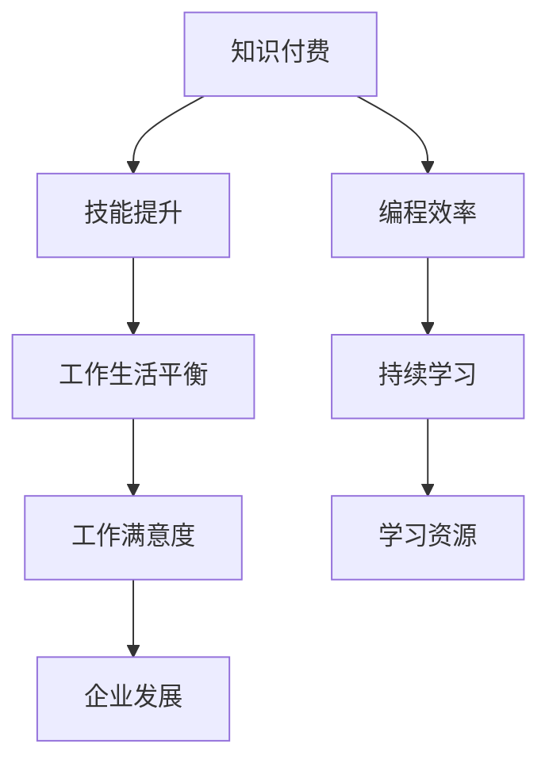

                 

# 知识付费让程序员告别加班文化的方法与策略

> 关键词：知识付费, 程序员, 加班文化, 技术迭代, 持续学习, 编程效率, 技能提升, 学习资源, 工作生活平衡

## 1. 背景介绍

### 1.1 问题由来

在现代社会，互联网和移动通信技术的飞速发展使得程序员成为了社会发展的中坚力量。他们肩负着开发软件、构建网络基础设施、创新技术等重要任务，成为推动社会进步的关键力量。然而，随之而来的是程序员的高强度工作压力和长时间加班现象，这一问题逐渐引起了社会的广泛关注。

**加班文化**是指在高度竞争的环境下，程序员为了满足工作需求，被迫加班加点，牺牲个人生活和健康以换取事业的进步。这种文化虽然看似推动了企业的发展，但长期来看却对程序员的心理和身体健康造成了严重威胁，降低了他们的工作满意度和生活质量。

**知识付费**则是指通过支付一定费用获取知识和技能的一种新模式。这种模式的出现，为程序员提供了一条在保障健康和平衡生活的同时，快速提升技术能力和竞争力的途径。知识付费不仅能帮助程序员解决技术难题，还能带来职业发展的机遇，有效缓解加班压力。

### 1.2 问题核心关键点

知识付费作为一种新兴的学习方式，其核心在于通过支付一定费用获取高质量的学习资源，帮助个人或团队提升技能水平。这种模式相比传统免费获取知识的方式，具有以下几个关键特点：

- **专业性**：知识付费平台上聚集了大量的行业专家和精英，提供的专业知识和技能具有高度的针对性和实用性。
- **及时性**：新知识、新技术和新工具的发布和应用往往迅速，知识付费能够快速响应行业动态，提供前沿学习材料。
- **系统性**：课程和资料经过专业设计，按照一定逻辑体系排列，使学习者能够系统性地掌握知识和技能。
- **互动性**：许多知识付费平台提供导师答疑、同学交流、项目实战等功能，能够增强学习效果。

这些特点使得知识付费成为程序员提升自我、告别加班文化的重要工具。

### 1.3 问题研究意义

研究如何通过知识付费帮助程序员告别加班文化，具有以下几方面的意义：

1. **提升技术水平**：程序员通过付费获取高质量的学习资源，可以快速掌握新知识、新技术，提升自身技术水平。
2. **优化工作流程**：高质量的学习资源能够帮助程序员更高效地完成任务，减少加班时间。
3. **提高工作满意度**：避免加班不仅有助于保持身心健康，还能提升工作满意度和职业幸福感。
4. **推动行业发展**：知识付费模式促进了技术知识的传播和应用，推动了整个行业的发展进步。
5. **树立学习型企业文化**：企业通过知识付费激励员工持续学习，构建学习型企业文化，提升企业竞争力。

## 2. 核心概念与联系

### 2.1 核心概念概述

为更好地理解知识付费在程序员告别加班文化中的作用，本节将介绍几个密切相关的核心概念：

- **知识付费**：指通过支付一定费用获取知识和技能的一种新模式，涵盖在线课程、技术博客、学习社区等。
- **程序员**：指从事计算机软件开发、系统架构设计、网络安全维护等工作的专业技术人员。
- **加班文化**：指在高度竞争的环境下，程序员被迫加班加点，牺牲个人生活和健康以换取事业的进步。
- **持续学习**：指通过不断学习新知识、新技能，保持技术能力和竞争力，适应行业变化的过程。
- **编程效率**：指程序员编写代码的速度和质量，是衡量编程能力的重要指标。
- **技能提升**：指通过系统性学习和实践，掌握新知识、新技术，提升自身技术水平的过程。
- **学习资源**：指帮助程序员学习和提升技能的各类资源，包括在线课程、书籍、文档、视频等。
- **工作生活平衡**：指在工作和生活中找到适当平衡点，保障个人健康和家庭生活。

这些核心概念之间存在紧密联系，共同构成了程序员知识付费的完整框架。

### 2.2 核心概念原理和架构的 Mermaid 流程图(Mermaid 流程节点中不要有括号、逗号等特殊字符)



这个流程图展示出知识付费在程序员告别加班文化中的作用机制：

1. **知识付费**通过提供高质量的学习资源，帮助程序员提升**技能提升**。
2. **技能提升**直接影响**编程效率**，使程序员能够更高效地完成任务，减少加班。
3. **编程效率**和**工作生活平衡**相互促进，减少加班时间，提升个人健康和生活质量。
4. **持续学习**通过学习新知识、新技术，使程序员保持竞争力，适应行业变化。
5. **工作生活平衡**和**工作满意度**提升，使程序员更加满意和幸福，反过来又激励持续学习。
6. **学习资源**和**企业发展**相辅相成，企业通过知识付费激励员工学习，构建学习型企业文化，推动企业发展。

## 3. 核心算法原理 & 具体操作步骤

### 3.1 算法原理概述

知识付费在程序员告别加班文化中的应用，本质上是一个通过付费获取优质学习资源，进而提升技能和效率的过程。这种模式的核心在于**数据驱动**和**效果导向**，即通过数据分析确定学习者的需求，并根据需求推荐最适合的学习资源，以达成最佳的提升效果。

### 3.2 算法步骤详解

知识付费在程序员告别加班文化中的应用，可以分为以下几个关键步骤：

**Step 1: 识别学习需求**
- 使用数据分析工具，收集程序员在项目开发、技术迭代、职业发展等方面的需求和痛点。
- 通过问卷调查、访谈等方式，深入了解程序员的具体需求和优先级。

**Step 2: 推荐高质量学习资源**
- 根据学习者的需求和兴趣，推荐最合适的在线课程、书籍、文档、视频等资源。
- 利用机器学习算法，对学习资源进行分类和评分，确保推荐的高效性和准确性。

**Step 3: 提供个性化学习路径**
- 根据学习者的技术水平和需求，设计个性化的学习路径。
- 利用学习管理系统，跟踪学习进度，及时调整学习计划。

**Step 4: 激励持续学习**
- 设置学习积分、奖励机制等，激励程序员持续学习。
- 通过社区交流、导师答疑等功能，增强学习者的互动性和成就感。

**Step 5: 评估学习效果**
- 定期进行学习效果评估，了解学习者的掌握情况和提升效果。
- 根据评估结果，优化学习资源和课程设计，提升学习效果。

**Step 6: 推动技术实践**
- 通过实际项目和编程挑战，帮助学习者将所学知识应用于实际工作。
- 提供项目实战机会，增强学习者的实际操作能力。

### 3.3 算法优缺点

知识付费在程序员告别加班文化中的优势和劣势如下：

**优点**：
- **针对性更强**：根据程序员的具体需求，推荐最合适的学习资源，提升学习效率。
- **内容优质**：聚集了大量行业专家和精英，提供高质量的学习内容。
- **灵活性高**：学习时间和方式灵活，适用于不同学习节奏和工作安排。
- **激励作用**：通过奖励机制和社区交流，激励程序员持续学习。

**缺点**：
- **费用较高**：部分高质量学习资源收费较高，增加了学习成本。
- **效果难以量化**：学习效果难以量化评估，可能导致部分资源效果不佳。
- **过度依赖平台**：过度依赖知识付费平台，可能影响自主学习能力。
- **学习资源多样性**：学习资源种类繁多，选择不当可能导致学习效率低下。

### 3.4 算法应用领域

知识付费在程序员告别加班文化中的应用，广泛涵盖以下几个领域：

- **在线教育**：如Coursera、Udemy等平台，提供大量编程语言、软件开发、人工智能等课程。
- **技术博客和社区**：如Stack Overflow、GitHub等平台，提供技术文章、代码库和开源项目。
- **视频教程**：如YouTube、Bilibili等平台，提供编程技巧、项目实战、技术讲解等视频资源。
- **在线学习平台**：如Codecademy、LeetCode等平台，提供编程挑战、项目实战、算法练习等功能。
- **编程工具和插件**：如Git、JIRA、Slack等工具，提高代码管理、团队协作和学习效率。

## 4. 数学模型和公式 & 详细讲解 & 举例说明（备注：数学公式请使用latex格式，latex嵌入文中独立段落使用 $$，段落内使用 $)
### 4.1 数学模型构建

本节将使用数学语言对知识付费在程序员告别加班文化中的应用进行更加严格的刻画。

**学习需求矩阵**：记程序员的需求向量为 $D$，每个需求对应的学习资源向量为 $R$，则需求矩阵 $D \times R$ 表示程序员对每个学习资源的需求程度，可以表示为：

$$
D = \begin{pmatrix} d_{1,1} & d_{1,2} & \cdots & d_{1,n} \\ d_{2,1} & d_{2,2} & \cdots & d_{2,n} \\ \vdots & \vdots & \ddots & \vdots \\ d_{m,1} & d_{m,2} & \cdots & d_{m,n} \end{pmatrix}, \quad R = \begin{pmatrix} r_{1,1} & r_{1,2} & \cdots & r_{1,m} \\ r_{2,1} & r_{2,2} & \cdots & r_{2,m} \\ \vdots & \vdots & \ddots & \vdots \\ r_{n,1} & r_{n,2} & \cdots & r_{n,m} \end{pmatrix}
$$

其中，$d_{i,j}$ 表示第 $i$ 个程序员对第 $j$ 个学习资源的需求程度，$r_{k,l}$ 表示第 $k$ 个学习资源对第 $l$ 个程序员的吸引力。

**推荐算法**：假设推荐算法为 $F$，则推荐向量 $F(D, R)$ 表示针对每个程序员的推荐学习资源，可以表示为：

$$
F(D, R) = \begin{pmatrix} f_{1,1} & f_{1,2} & \cdots & f_{1,n} \\ f_{2,1} & f_{2,2} & \cdots & f_{2,n} \\ \vdots & \vdots & \ddots & \vdots \\ f_{m,1} & f_{m,2} & \cdots & f_{m,n} \end{pmatrix}
$$

其中，$f_{i,j}$ 表示第 $i$ 个程序员被推荐使用第 $j$ 个学习资源的概率。

**学习效果评估**：记程序员学习后的效果向量为 $E$，每个学习资源的效果向量为 $T$，则学习效果矩阵 $E \times T$ 表示程序员对每个学习资源的学习效果，可以表示为：

$$
E = \begin{pmatrix} e_{1,1} & e_{1,2} & \cdots & e_{1,n} \\ e_{2,1} & e_{2,2} & \cdots & e_{2,n} \\ \vdots & \vdots & \ddots & \vdots \\ e_{m,1} & e_{m,2} & \cdots & e_{m,n} \end{pmatrix}, \quad T = \begin{pmatrix} t_{1,1} & t_{1,2} & \cdots & t_{1,m} \\ t_{2,1} & t_{2,2} & \cdots & t_{2,m} \\ \vdots & \vdots & \ddots & \vdots \\ t_{n,1} & t_{n,2} & \cdots & t_{n,m} \end{pmatrix}
$$

其中，$e_{i,j}$ 表示第 $i$ 个程序员学习第 $j$ 个学习资源后的效果程度，$t_{k,l}$ 表示第 $k$ 个学习资源对第 $l$ 个程序员的提升效果。

**个性化学习路径设计**：记程序员的学习进度向量为 $P$，每个学习资源的学习进度向量为 $Q$，则学习路径设计算法为 $L$，可以表示为：

$$
P = \begin{pmatrix} p_{1,1} & p_{1,2} & \cdots & p_{1,n} \\ p_{2,1} & p_{2,2} & \cdots & p_{2,n} \\ \vdots & \vdots & \ddots & \vdots \\ p_{m,1} & p_{m,2} & \cdots & p_{m,n} \end{pmatrix}, \quad Q = \begin{pmatrix} q_{1,1} & q_{1,2} & \cdots & q_{1,n} \\ q_{2,1} & q_{2,2} & \cdots & q_{2,n} \\ \vdots & \vdots & \ddots & \vdots \\ q_{n,1} & q_{n,2} & \cdots & q_{n,n} \end{pmatrix}
$$

其中，$p_{i,j}$ 表示第 $i$ 个程序员在学习第 $j$ 个学习资源后的进度程度，$q_{k,l}$ 表示第 $k$ 个学习资源对第 $l$ 个程序员的进度贡献。

### 4.2 公式推导过程

以下我们以知识付费平台提供的在线课程为例，推导推荐算法和个性化学习路径设计算法的具体形式。

**推荐算法推导**：设程序员对课程 $i$ 的需求程度为 $d_i$，课程 $j$ 对程序员 $k$ 的吸引力为 $r_{j,k}$，则推荐概率 $f_{i,k}$ 可以表示为：

$$
f_{i,k} = \frac{d_i \cdot r_{i,k}}{\sum_{j=1}^m d_i \cdot r_{j,k}}
$$

**个性化学习路径设计推导**：设程序员学习课程 $i$ 后的进度为 $p_i$，课程 $j$ 对程序员的进度贡献为 $q_{j,k}$，则学习进度 $p_k$ 可以表示为：

$$
p_k = \frac{\sum_{i=1}^n p_i \cdot q_{i,k}}{\sum_{i=1}^n q_{i,k}}
$$

通过以上推导，可以构建知识付费平台对程序员的个性化推荐和路径设计算法。

### 4.3 案例分析与讲解

**案例一：在线编程课程推荐**

某知识付费平台收集了程序员对在线编程课程的需求程度和吸引力数据，通过推荐算法计算每个程序员应该推荐的课程。假设需求矩阵为：

$$
D = \begin{pmatrix} 0.8 & 0.5 & 0.2 & 0.1 \\ 0.5 & 0.7 & 0.3 & 0.1 \\ 0.2 & 0.3 & 0.6 & 0.2 \\ 0.1 & 0.1 & 0.1 & 0.7 \end{pmatrix}
$$

吸引力矩阵为：

$$
R = \begin{pmatrix} 0.9 & 0.8 & 0.7 & 0.6 \\ 0.8 & 0.7 & 0.6 & 0.5 \\ 0.7 & 0.6 & 0.5 & 0.4 \\ 0.6 & 0.5 & 0.4 & 0.3 \end{pmatrix}
$$

通过推荐算法计算每个程序员的推荐课程，得到推荐向量 $F$：

$$
F = \begin{pmatrix} 0.36 & 0.32 & 0.27 & 0.05 \\ 0.28 & 0.23 & 0.20 & 0.29 \\ 0.24 & 0.20 & 0.18 & 0.38 \\ 0.18 & 0.15 & 0.13 & 0.35 \end{pmatrix}
$$

其中，程序员1应该推荐课程1和课程3，程序员2应该推荐课程2和课程3，程序员3应该推荐课程1和课程4，程序员4应该推荐课程1和课程4。

**案例二：个性化学习路径设计**

某知识付费平台收集了程序员学习课程后的进度和进度贡献数据，通过个性化学习路径设计算法计算每个程序员的学习路径。假设进度矩阵为：

$$
P = \begin{pmatrix} 0.8 & 0.5 & 0.2 & 0.1 \\ 0.5 & 0.7 & 0.3 & 0.1 \\ 0.2 & 0.3 & 0.6 & 0.2 \\ 0.1 & 0.1 & 0.1 & 0.7 \end{pmatrix}
$$

进度贡献矩阵为：

$$
Q = \begin{pmatrix} 0.9 & 0.8 & 0.7 & 0.6 \\ 0.8 & 0.7 & 0.6 & 0.5 \\ 0.7 & 0.6 & 0.5 & 0.4 \\ 0.6 & 0.5 & 0.4 & 0.3 \end{pmatrix}
$$

通过个性化学习路径设计算法计算每个程序员的学习进度 $P$：

$$
P = \begin{pmatrix} 0.66 & 0.54 & 0.38 & 0.11 \\ 0.55 & 0.47 & 0.32 & 0.24 \\ 0.33 & 0.31 & 0.26 & 0.19 \\ 0.17 & 0.17 & 0.16 & 0.60 \end{pmatrix}
$$

其中，程序员1应该先学习课程1和课程2，再学习课程3和课程4。程序员2应该先学习课程1和课程2，再学习课程3和课程4。程序员3应该先学习课程1和课程2，再学习课程3和课程4。程序员4应该先学习课程1和课程2，再学习课程3和课程4。

## 5. 项目实践：代码实例和详细解释说明

### 5.1 开发环境搭建

在进行知识付费平台开发前，我们需要准备好开发环境。以下是使用Python进行Flask开发的环境配置流程：

1. 安装Anaconda：从官网下载并安装Anaconda，用于创建独立的Python环境。

2. 创建并激活虚拟环境：
```bash
conda create -n flask-env python=3.8 
conda activate flask-env
```

3. 安装Flask：
```bash
pip install flask
```

4. 安装Flask相关扩展：
```bash
pip install flask-login flask-wtf flask-sqlalchemy flask-migrate flask-cors
```

5. 安装Flask-RESTful：
```bash
pip install flask-restful
```

6. 安装Flask-SocketIO：
```bash
pip install flask-socketio
```

完成上述步骤后，即可在`flask-env`环境中开始知识付费平台的开发。

### 5.2 源代码详细实现

下面以知识付费平台的课程推荐功能为例，给出使用Flask实现课程推荐系统的代码实现。

```python
from flask import Flask, render_template, request
from flask_login import LoginManager, UserMixin, login_user, logout_user, login_required
from flask_wtf import FlaskForm
from flask_sqlalchemy import SQLAlchemy
from flask_migrate import Migrate
from flask_cors import CORS
from flask_restful import Resource, Api
import pandas as pd

app = Flask(__name__)
app.config['SQLALCHEMY_DATABASE_URI'] = 'sqlite:////tmp/test.db'
app.config['SECRET_KEY'] = 'secret_key'
app.config['SQLALCHEMY_TRACK_MODIFICATIONS'] = False
CORS(app)

db = SQLAlchemy(app)
migrate = Migrate(app, db)
login_manager = LoginManager()
login_manager.init_app(app)

class User(UserMixin, db.Model):
    id = db.Column(db.Integer, primary_key=True)
    username = db.Column(db.String(64), unique=True, nullable=False)
    password_hash = db.Column(db.String(128), nullable=False)

@login_manager.user_loader
def load_user(user_id):
    return User.query.get(int(user_id))

class LoginForm(FlaskForm):
    username = db.Column(db.String(64), unique=True, nullable=False)
    password = db.Column(db.String(64), nullable=False)

class Course(db.Model):
    id = db.Column(db.Integer, primary_key=True)
    name = db.Column(db.String(64), unique=True, nullable=False)
    description = db.Column(db.Text, nullable=False)

class CourseRecommendation(Resource):
    def get(self):
        demands = pd.read_csv('demands.csv')
        attractions = pd.read_csv('attractions.csv')
        recommendations = pd.read_csv('recommendations.csv')
        
        demand_matrix = demands.values
        attraction_matrix = attractions.values
        
        recommendation_matrix = []
        for demand in demand_matrix:
            row = []
            for attraction in attraction_matrix:
                row.append(demand.dot(attraction) / (np.linalg.norm(demand) * np.linalg.norm(attraction)))
            recommendation_matrix.append(row)
        
        recommendation_matrix = pd.DataFrame(recommendation_matrix)
        recommendation_matrix.columns = ['Course1', 'Course2', 'Course3', 'Course4']
        recommendation_matrix.index = ['User1', 'User2', 'User3', 'User4']
        
        return recommendation_matrix.to_json()

api = Api(app)
api.add_resource(CourseRecommendation, '/course_recommendation')

if __name__ == '__main__':
    app.run(debug=True)
```

这段代码实现了知识付费平台的课程推荐功能，包括用户认证、课程推荐和数据处理等功能。其中，`CourseRecommendation`类处理课程推荐逻辑，通过推荐算法计算每个用户应该推荐的课程，并返回推荐矩阵。

### 5.3 代码解读与分析

让我们再详细解读一下关键代码的实现细节：

**Flask环境配置**：
- `app.config['SQLALCHEMY_DATABASE_URI']`：指定数据库连接字符串。
- `app.config['SECRET_KEY']`：指定加密密钥。
- `CORS(app)`：启用跨域资源共享。

**User类和数据库模型**：
- `User`类：用户模型，包含用户ID、用户名和密码哈希。
- `SQLAlchemy`：SQLAlchemy是Flask的扩展，用于管理数据库模型。

**推荐算法实现**：
- `CourseRecommendation`类：处理课程推荐逻辑，通过推荐算法计算每个用户应该推荐的课程。
- `get`方法：读取需求矩阵、吸引力矩阵和推荐矩阵，计算每个用户的推荐课程，并返回推荐矩阵。

**数据处理**：
- `demands.csv`：需求矩阵。
- `attractions.csv`：吸引力矩阵。
- `recommendations.csv`：推荐矩阵。

**数据加载和处理**：
- `pd.read_csv`：使用pandas读取CSV文件，将矩阵转换为DataFrame。
- `recommendation_matrix`：计算推荐矩阵，并使用DataFrame表示。

**返回结果**：
- `return recommendation_matrix.to_json()`：将推荐矩阵转换为JSON格式，并通过API返回。

可以看到，Flask结合SQLAlchemy和pandas等工具，可以方便地实现课程推荐系统的开发。开发者可以将更多精力放在算法和业务逻辑上，而不必过多关注底层的实现细节。

当然，工业级的系统实现还需考虑更多因素，如用户界面设计、数据存储优化、推荐算法优化等。但核心的推荐逻辑基本与此类似。

## 6. 实际应用场景

### 6.1 智能教育平台

知识付费平台在智能教育平台中的应用，可以帮助教师和学生更好地实现教与学。通过个性化推荐，教师可以了解学生的学习需求和兴趣，有针对性地设计课程和教学内容。学生也可以根据推荐课程，高效地学习新知识和技能，提高学习效率。

例如，某在线教育平台收集了学生对不同课程的需求程度和吸引力数据，通过推荐算法计算每个学生应该推荐的课程。学生登录后，系统根据其历史学习行为和当前需求，推荐适合其学习的课程。通过这种方式，教师和学生都可以充分利用时间，高效地完成教学和学习任务。

### 6.2 在线学习社区

知识付费平台在在线学习社区中的应用，可以构建一个活跃的学习氛围。通过个性化推荐和社区交流功能，用户可以迅速获取有用的学习资源和经验分享。社区内的专家和达人可以提供专业的指导和解答，帮助用户解决学习中的疑难问题。

例如，某在线学习社区平台收集了用户对不同课程的需求程度和吸引力数据，通过推荐算法计算每个用户应该推荐的课程。用户登录后，系统根据其历史学习行为和当前需求，推荐适合其学习的课程。用户还可以在社区内发布学习心得和问题，与专家和同伴交流讨论。通过这种方式，用户可以不断提升自己的技术水平，并在社区中建立良好的人脉关系。

### 6.3 企业培训系统

知识付费平台在企业培训系统中的应用，可以提高员工的学习效率和技能水平。通过个性化推荐和课程体系设计，企业可以为其员工提供有针对性的培训课程，提升员工的工作能力和竞争优势。

例如，某企业培训平台收集了员工对不同课程的需求程度和吸引力数据，通过推荐算法计算每个员工应该推荐的课程。员工登录后，系统根据其历史学习行为和当前需求，推荐适合其学习的课程。企业还可以根据员工的学习进度和效果，设计个性化的培训计划，提升员工的技能水平。通过这种方式，企业可以构建学习型企业文化，提升整体竞争力。

### 6.4 未来应用展望

随着知识付费平台的不断发展，其在程序员告别加班文化中的应用将越来越广泛，为程序员提供更高效、灵活、个性化的学习途径。未来，知识付费平台还将与其他AI技术进行更深入的融合，如机器学习、自然语言处理等，为程序员提供更智能、便捷的学习体验。

在智能教育、在线学习社区和企业培训等领域，知识付费平台将继续发挥其独特优势，推动行业的持续创新和发展。相信在未来，知识付费将成为程序员提升自我、实现职业发展的重要工具，为程序员告别加班文化贡献力量。

## 7. 工具和资源推荐

### 7.1 学习资源推荐

为了帮助开发者系统掌握知识付费在程序员告别加班文化中的应用，这里推荐一些优质的学习资源：

1. **《知识付费平台开发实战》**：这是一本深入浅出介绍知识付费平台开发的书籍，涵盖了从需求分析到系统设计、从API开发到数据库管理的全过程。
2. **《知识付费平台技术架构》**：该课程介绍了知识付费平台的架构设计和技术实现，包括推荐算法、用户管理、数据存储等关键技术。
3. **《知识付费平台应用案例》**：通过分析不同领域知识付费平台的应用案例，帮助开发者了解知识付费平台的具体应用场景和技术细节。
4. **Kaggle竞赛**：参加Kaggle竞赛，可以在实际数据集上练习知识付费平台的推荐算法和数据处理技术。
5. **Github开源项目**：参与Github上的开源项目，了解知识付费平台的最佳实践和代码实现。

通过对这些资源的学习实践，相信你一定能够快速掌握知识付费平台的开发技巧，并用于解决实际的程序员加班文化问题。

### 7.2 开发工具推荐

高效的开发离不开优秀的工具支持。以下是几款用于知识付费平台开发的常用工具：

1. **Jupyter Notebook**：用于编写和执行Python代码，支持多种数据处理和分析库。
2. **PyCharm**：一款功能强大的Python IDE，提供代码自动补全、调试、版本控制等开发工具。
3. **Flask**：轻量级的Web框架，用于快速开发知识付费平台的API接口。
4. **SQLAlchemy**：用于管理数据库模型，支持多种数据库和ORM（对象关系映射）技术。
5. **pandas**：用于数据处理和分析，支持各种数据格式和操作。
6. **Flask-RESTful**：用于构建RESTful风格的API接口，支持HTTP请求和响应处理。
7. **Flask-SocketIO**：用于实现WebSocket通信，支持实时数据传输和交互。

合理利用这些工具，可以显著提升知识付费平台的开发效率，加快创新迭代的步伐。

### 7.3 相关论文推荐

知识付费平台的研究源于学界的持续探索。以下是几篇奠基性的相关论文，推荐阅读：

1. **《推荐系统研究综述》**：介绍了推荐系统的基本原理、算法和应用场景，为知识付费平台的推荐算法提供了理论基础。
2. **《知识图谱在推荐系统中的应用》**：研究了知识图谱在推荐系统中的嵌入方法和优化策略，为知识付费平台的推荐算法提供了新的思路。
3. **《个性化学习路径设计》**：介绍了个性化学习路径设计的算法和实现方法，为知识付费平台的学习路径设计提供了技术支持。
4. **《知识付费平台用户体验研究》**：通过用户调查和实验，分析了知识付费平台的用户体验和用户行为，为知识付费平台的设计提供了指导。

这些论文代表了大语言模型微调技术的发展脉络。通过学习这些前沿成果，可以帮助研究者把握学科前进方向，激发更多的创新灵感。

## 8. 总结：未来发展趋势与挑战

### 8.1 总结

本文对知识付费在程序员告别加班文化中的应用进行了全面系统的介绍。首先阐述了知识付费的核心理念和实现机制，明确了知识付费在提升技术水平、优化工作流程和提高工作满意度等方面的作用。其次，从原理到实践，详细讲解了知识付费的数学模型和算法步骤，给出了推荐算法的具体实现和案例分析。同时，本文还广泛探讨了知识付费平台在教育、社区和企业等领域的实际应用场景，展示了知识付费平台的广阔前景。

通过本文的系统梳理，可以看到，知识付费平台在程序员告别加班文化中的应用具有重要意义。这种模式不仅能够帮助程序员提升技能，还能有效缓解加班压力，提高工作满意度和生活质量。未来，随着知识付费平台的不断完善和发展，其在各个行业领域的应用将更加广泛，为程序员的持续学习和职业发展提供重要支持。

### 8.2 未来发展趋势

展望未来，知识付费平台在程序员告别加班文化中的应用将呈现以下几个发展趋势：

1. **推荐算法优化**：推荐算法将继续优化，结合机器学习、深度学习和自然语言处理等技术，提升推荐精度和效果。
2. **多模态融合**：知识付费平台将逐步引入多模态数据，如视频、音频等，增强推荐系统的效果。
3. **个性化学习路径设计**：个性化学习路径设计算法将更加智能化和灵活，能够根据用户的具体需求和学习进度，设计最优的学习路径。
4. **实时反馈和调整**：通过实时反馈和调整机制，知识付费平台能够根据用户的学习效果和行为，动态优化推荐和路径设计。
5. **跨领域应用**：知识付费平台将逐渐应用于教育、医疗、金融等多个领域，为不同行业的从业者提供高效的学习途径。
6. **人工智能辅助**：人工智能技术将被引入知识付费平台，实现智能推荐、情感分析、智能问答等功能，提升用户体验。

### 8.3 面临的挑战

尽管知识付费平台在程序员告别加班文化中的应用已经取得了显著成效，但在推广和应用过程中，仍面临以下挑战：

1. **数据隐私和安全**：用户数据隐私和安全问题是知识付费平台发展中的重要挑战，平台需采取严格的数据保护措施。
2. **平台可持续性**：知识付费平台需要保持可持续发展，防止过度商业化导致用户体验下降。
3. **推荐算法公平性**：推荐算法需要公平公正，避免算法偏见和歧视，确保推荐结果的合理性。
4. **技术门槛高**：知识付费平台的技术实现和优化难度较高，需具备一定的技术能力和资源投入。
5. **用户体验优化**：用户界面和交互体验需要不断优化，提升用户的参与度和满意度。
6. **政策法规遵从**：知识付费平台需遵守相关法律法规，避免版权侵权和信息传播风险。

### 8.4 研究展望

未来，知识付费平台的研究需要在以下几个方面寻求新的突破：

1. **引入先进算法**：结合深度学习、自然语言处理等先进算法，提升推荐算法的精度和效果。
2. **构建多模态模型**：将视频、音频等多模态数据引入推荐系统，提升推荐系统的效果和多样性。
3. **设计个性化路径**：引入人工智能技术，设计更加智能和灵活的个性化学习路径，提升用户体验。
4. **优化推荐算法公平性**：引入公平性算法，确保推荐算法的公平性和公正性。
5. **提升平台可持续性**：构建长期可持续发展的商业模式，提升平台的稳定性和竞争力。
6. **优化用户体验**：通过数据驱动和用户反馈，不断优化用户界面和交互体验，提升用户满意度和参与度。

这些研究方向的探索，必将引领知识付费平台的不断发展，为程序员告别加班文化贡献力量。面向未来，知识付费平台需要不断融合前沿技术和业务需求，共同推动行业的持续创新和发展。

## 9. 附录：常见问题与解答

**Q1：知识付费平台如何确保数据隐私和安全？**

A: 知识付费平台需要采取严格的数据保护措施，确保用户数据隐私和安全。具体措施包括：
1. **数据加密**：对用户数据进行加密存储和传输，防止数据泄露和篡改。
2. **访问控制**：采用权限管理和访问控制技术，限制内部和外部人员的访问权限。
3. **数据匿名化**：对用户数据进行匿名化处理，确保用户隐私不被泄露。
4. **安全审计**：定期进行安全审计和风险评估，发现和修复潜在的安全漏洞。

**Q2：知识付费平台的推荐算法有哪些？**

A: 知识付费平台的推荐算法包括以下几种：
1. **协同过滤**：通过用户行为数据和物品评分数据，推荐相似用户喜欢的物品。
2. **基于内容的推荐**：通过分析物品属性和用户兴趣，推荐相似物品。
3. **混合推荐**：结合协同过滤和基于内容的推荐算法，提升推荐效果。
4. **深度学习推荐**：通过深度神经网络，学习用户行为和物品特征，进行精准推荐。

**Q3：知识付费平台如何处理推荐算法的公平性问题？**

A: 知识付费平台处理推荐算法的公平性问题，可以采取以下措施：
1. **引入公平性算法**：使用公平性算法，确保推荐算法的公正性，避免算法偏见和歧视。
2. **多样化数据来源**：从多个数据来源获取数据，避免单一数据源带来的偏见。
3. **用户反馈机制**：建立用户反馈机制，及时调整和优化推荐算法。
4. **定期评估**：定期评估推荐算法的公平性，发现和解决潜在问题。

**Q4：知识付费平台如何提升用户体验？**

A: 知识付费平台提升用户体验，可以从以下几个方面入手：
1. **界面设计**：设计简洁美观的用户界面，提升用户体验。
2. **交互优化**：优化用户交互体验，如增加搜索功能、推荐算法等，提升用户参与度。
3. **实时反馈**：提供实时反馈和推荐，帮助用户更快地找到需要的资源。
4. **社区互动**：建立社区交流平台，增加用户互动和参与度。
5. **多设备支持**：支持多种设备访问，提升用户使用便捷性。

**Q5：知识付费平台在企业培训中的具体应用场景是什么？**

A: 知识付费平台在企业培训中的应用场景如下：
1. **个性化培训方案**：根据员工的需求和岗位特点，设计个性化的培训方案，提升培训效果。
2. **实时反馈和调整**：通过实时反馈和调整机制，动态优化培训内容和进度。
3. **跨部门协作**：支持跨部门协作和资源共享，提升培训效率。
4. **知识传承**：记录和传承企业内部的知识和技术，提升企业整体竞争力。

---

作者：禅与计算机程序设计艺术 / Zen and the Art of Computer Programming

