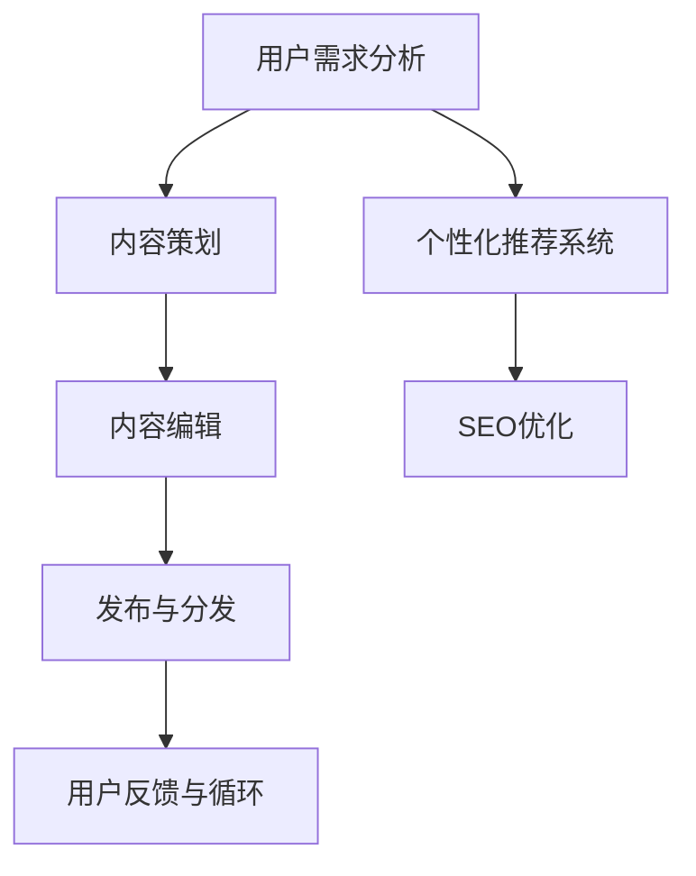

                 

# 知识付费赚钱的内容策划与编辑技巧

> 关键词：知识付费、内容策划、编辑技巧、用户需求、数据驱动、个性化推荐、SEO优化、技术栈、内容质量

## 1. 背景介绍

### 1.1 问题由来

随着知识付费行业的蓬勃发展，内容创作者和平台越来越重视内容的质量和有效性。高订阅量、高销售额的知识产品背后，离不开出色的内容策划与编辑工作。本文将系统介绍如何通过高质量的内容策划与编辑，为知识付费产品实现赚钱目标。

### 1.2 问题核心关键点

内容策划与编辑的核心关键点在于：
1. **精准定位用户需求**：识别目标用户的需求和痛点，并据此进行内容规划。
2. **优化内容质量**：通过专业编辑和持续改进，提升内容的教育价值和吸引力。
3. **个性化推荐**：利用用户行为数据，个性化推荐用户感兴趣的内容，提升用户粘性。
4. **SEO优化**：通过优化内容关键词和SEO策略，增加内容的搜索可见性和曝光度。
5. **技术支持**：借助先进的技术栈和工具，提高内容创作的效率和效果。

这些关键点共同构成了内容策划与编辑的高效工作框架，帮助内容创作者和平台实现知识付费业务的持续增长。

### 1.3 问题研究意义

深入研究内容策划与编辑技巧，对于提升知识付费产品的内容质量、增强用户体验、提高运营效率和盈利能力，具有重要意义：

1. **提升用户满意度**：高质量的内容能更好地满足用户需求，增强用户的粘性和满意度。
2. **优化运营成本**：通过精细化的内容策划与编辑，减少无效内容的制作，优化资源配置。
3. **提高销售转化**：通过个性化推荐和SEO优化，增加内容的曝光和销售机会，提升ROI。
4. **推动创新**：内容策划与编辑过程中，不断挖掘用户需求和市场趋势，推动产品的创新与升级。
5. **增强品牌影响力**：高质量的内容能够提升品牌形象，增强平台和创作者的影响力。

## 2. 核心概念与联系

### 2.1 核心概念概述

为更好地理解内容策划与编辑的原理和流程，本节将介绍几个核心概念：

- **知识付费**：基于订阅或付费模式，向用户提供有价值的知识内容，以实现商业变现的商业模式。
- **内容策划**：对内容的主题、形式、结构等进行系统规划，确保内容的专业性和吸引力。
- **内容编辑**：对创作的内容进行校对、润色、格式优化等操作，提升内容的可读性和教育价值。
- **用户需求分析**：通过调查、分析用户反馈等方式，识别目标用户的需求和痛点，指导内容策划与编辑。
- **个性化推荐系统**：利用用户行为数据，推荐用户可能感兴趣的内容，提升用户体验。
- **SEO优化**：通过优化内容关键词和网页结构，提高内容的搜索引擎排名，增加曝光量。

这些核心概念之间的逻辑关系可以通过以下Mermaid流程图来展示：



这个流程图展示出内容策划与编辑的核心流程：

1. 通过用户需求分析，确定内容主题和方向。
2. 根据用户需求，进行内容策划，设计内容结构和形式。
3. 进行内容编辑，提升内容的可读性和教育价值。
4. 利用个性化推荐系统，精准推送内容给用户。
5. 优化内容关键词和网页结构，进行SEO优化，提升搜索可见性。
6. 发布内容，通过用户反馈不断循环优化内容。

## 3. 核心算法原理 & 具体操作步骤
### 3.1 算法原理概述

内容策划与编辑的核心算法原理包括以下几个关键点：

1. **用户需求分析**：通过问卷调查、社交媒体分析、用户行为数据等方式，识别用户的兴趣、痛点和需求。
2. **内容推荐算法**：利用协同过滤、基于内容的推荐、深度学习等算法，为用户推荐个性化的内容。
3. **内容优化算法**：通过A/B测试、用户反馈、评分系统等方式，优化内容的格式、结构、教育价值等。
4. **SEO优化算法**：通过关键词优化、元数据优化、网站结构优化等方式，提升内容的搜索引擎排名。

这些算法共同作用，形成了一个高效的内容策划与编辑框架，帮助内容创作者和平台实现高价值的知识付费产品。

### 3.2 算法步骤详解

基于上述核心算法原理，内容策划与编辑的具体操作步骤如下：

**Step 1: 用户需求分析**
- 设计问卷，收集用户反馈，了解用户兴趣和痛点。
- 分析社交媒体数据，识别热门话题和趋势。
- 收集用户行为数据，分析用户的浏览、阅读、购买行为。
- 综合以上数据，确定内容主题和方向。

**Step 2: 内容策划**
- 确定内容主题，设计内容结构，包括标题、导语、正文、结尾等。
- 选择合适的内容形式，如视频、音频、图文、互动等。
- 制定内容发布计划，确保内容的高效产出。

**Step 3: 内容编辑**
- 对创作的内容进行校对、润色、格式优化等操作。
- 通过多轮审校，提升内容的可读性和教育价值。
- 使用数据分析工具，评估内容的用户反馈和效果。

**Step 4: 个性化推荐**
- 收集用户行为数据，包括浏览历史、收藏、评分等。
- 使用协同过滤、基于内容的推荐算法，为用户推荐个性化内容。
- 实时更新推荐模型，优化推荐效果。

**Step 5: SEO优化**
- 关键词分析，确定内容的主要关键词和长尾关键词。
- 优化内容的标题、导语、正文等元素，增加关键词密度。
- 优化网站结构，提高内容的搜索引擎友好性。

**Step 6: 发布与分发**
- 选择适合的发布平台，确保内容的可见性和曝光度。
- 通过社交媒体、邮件等渠道，进行内容的推广和分发。
- 监控内容的表现，根据反馈进行优化。

**Step 7: 用户反馈与循环优化**
- 收集用户的反馈和评价，评估内容的实际效果。
- 根据反馈进行内容的迭代和优化，提升内容的质量和价值。
- 循环以上步骤，持续提升内容创作和编辑的效率与效果。

### 3.3 算法优缺点

内容策划与编辑的核心算法具有以下优点：
1. **提升内容质量**：通过数据分析和反馈循环，不断优化内容质量，满足用户需求。
2. **增强用户粘性**：利用个性化推荐，提升用户粘性和满意度。
3. **提高运营效率**：通过自动化工具和流程，提高内容创作的效率。
4. **增加曝光机会**：通过SEO优化，提高内容的搜索引擎排名，增加曝光机会。

同时，这些算法也存在一些缺点：
1. **数据依赖性强**：高质量的内容策划与编辑依赖大量的用户行为数据，获取数据成本较高。
2. **算法复杂度较高**：复杂的推荐算法和SEO优化需要较高的技术要求，实施难度较大。
3. **效果不确定性**：算法效果受到数据质量和用户行为变化的影响，效果不确定性较高。
4. **内容多样性不足**：过度依赖算法推荐，可能导致内容的多样性不足，用户容易产生疲劳。

尽管存在这些局限性，但整体而言，内容策划与编辑的核心算法仍然是非常有效的，能够显著提升知识付费产品的价值和用户体验。

### 3.4 算法应用领域

内容策划与编辑的核心算法在知识付费行业有着广泛的应用，具体包括：

- **在线课程**：通过精准的用户需求分析和个性化推荐，为在线课程提供个性化内容，提升用户学习效果。
- **电子书**：优化电子书的内容结构和格式，提升阅读体验，增加用户的购买意愿。
- **知识社区**：通过内容策划与编辑，为社区用户提供有价值的知识内容，增强社区粘性和活跃度。
- **知识图谱**：利用数据驱动的内容优化和推荐，构建知识图谱，提升内容的关联性和知识深度。
- **专题讲座**：针对用户兴趣和需求，策划和编辑高质量的专题讲座内容，吸引更多用户订阅。

除了上述应用外，内容策划与编辑的核心算法还被应用于企业培训、市场调研、内容营销等多个领域，发挥了重要的作用。

## 4. 数学模型和公式 & 详细讲解  
### 4.1 数学模型构建

为了更好地理解和应用内容策划与编辑的算法原理，本节将使用数学语言对核心算法进行更严格的刻画。

假设用户需求分析得到的用户兴趣向量为 $\mathbf{u}=(u_1, u_2, \ldots, u_n)$，其中 $u_i$ 表示用户对第 $i$ 个兴趣点的评分。内容策划与编辑的目标是最大化用户对内容的满意度，即最大化目标函数：

$$
\max_{x_1, x_2, \ldots, x_n} \sum_{i=1}^n u_i \cdot x_i
$$

其中 $x_i$ 表示内容中第 $i$ 个兴趣点的权重，满足 $0 \leq x_i \leq 1$。

在实际操作中，可以使用基于协同过滤的推荐算法，将用户兴趣向量与内容特征向量进行匹配，求解最优的权重分配 $x_i$，使得推荐结果与用户兴趣最大程度匹配。

### 4.2 公式推导过程

基于协同过滤推荐算法，用户兴趣向量 $\mathbf{u}$ 和内容特征向量 $\mathbf{v}$ 之间的关系可以表示为：

$$
\mathbf{v} = \mathbf{A}\mathbf{u}
$$

其中 $\mathbf{A}$ 为用户的兴趣偏好矩阵，表示用户对各个兴趣点的评分。假设内容的特征向量为 $\mathbf{v}=(v_1, v_2, \ldots, v_n)$，则推荐问题可以转化为求解最优化问题：

$$
\max_{x_1, x_2, \ldots, x_n} \sum_{i=1}^n x_i \cdot v_i
$$

其中 $x_i$ 表示内容中第 $i$ 个兴趣点的权重，满足 $0 \leq x_i \leq 1$，且 $\sum_{i=1}^n x_i = 1$。

通过求解上述最优化问题，可以得到最优的权重分配 $x_i$，进而实现内容的个性化推荐。

### 4.3 案例分析与讲解

假设有一款在线课程平台，用户对历史、文学、科学等兴趣点的评分分别为 $(0.8, 0.5, 0.3)$，某门课程的内容特征向量为 $(0.6, 0.4, 0.7)$。为了最大化用户对课程的满意度，需要求解最优的权重分配 $x_1, x_2, x_3$，使得课程内容的兴趣点与用户的兴趣点匹配。

通过求解以下最优化问题：

$$
\max_{x_1, x_2, x_3} 0.8x_1 + 0.5x_2 + 0.3x_3
$$

其中 $x_1 + x_2 + x_3 = 1$，且 $0 \leq x_i \leq 1$，可以得到最优的权重分配为 $(x_1, x_2, x_3) = (0.5, 0.3, 0.2)$。

因此，该课程内容最适合推荐给对历史和科学感兴趣的用户，文学类用户对该课程的兴趣较低。

## 5. 项目实践：代码实例和详细解释说明
### 5.1 开发环境搭建

在进行内容策划与编辑实践前，我们需要准备好开发环境。以下是使用Python进行开发的环境配置流程：

1. 安装Anaconda：从官网下载并安装Anaconda，用于创建独立的Python环境。

2. 创建并激活虚拟环境：
```bash
conda create -n content-dev python=3.8 
conda activate content-dev
```

3. 安装必要的Python包：
```bash
pip install pandas numpy matplotlib scikit-learn
```

4. 安装数据处理工具：
```bash
pip install selenium beautifulsoup4
```

5. 安装内容发布工具：
```bash
pip install gitpython markdown
```

完成上述步骤后，即可在`content-dev`环境中开始内容策划与编辑的实践。

### 5.2 源代码详细实现

下面我们以构建一个简单的在线课程平台为例，给出内容策划与编辑项目的完整代码实现。

首先，定义用户需求分析函数，模拟问卷调查：

```python
import random

def generate_user_interest():
    interests = ['历史', '文学', '科学', '技术', '艺术']
    user_interest = [random.choice(interests) for _ in range(5)]
    return user_interest
```

然后，定义内容策划函数，根据用户兴趣策划内容：

```python
def plan_content(user_interest):
    # 假设内容库中各课程的兴趣点评分
    courses = [
        {'name': '历史课', 'interests': (0.8, 0.3, 0.4, 0.1, 0.0)},
        {'name': '文学课', 'interests': (0.2, 0.9, 0.1, 0.0, 0.0)},
        {'name': '科学课', 'interests': (0.5, 0.0, 0.7, 0.0, 0.0)},
        {'name': '技术课', 'interests': (0.0, 0.0, 0.3, 0.5, 0.2)},
        {'name': '艺术课', 'interests': (0.1, 0.2, 0.0, 0.5, 0.2)}
    ]
    
    # 计算内容与用户兴趣的匹配度
    scores = []
    for course in courses:
        match_score = sum(user_interest[i] * course['interests'][i] for i in range(len(user_interest)))
        scores.append((match_score, course))
    
    # 排序选择匹配度最高的内容
    scores.sort(reverse=True)
    return scores[0][1]
```

接着，定义内容编辑函数，对内容进行优化：

```python
def edit_content(course):
    # 假设编辑后的内容
    edited_content = {
        'title': course['name'],
        'content': '这是关于{}的课程，内容包括...'.format(course['name']),
        'formats': ['文字', '视频', '互动'],
        'keywords': ['{}课', '{}历史', '{}文学', '{}科学', '{}技术']
    }
    
    # 进行内容优化
    edited_content['content'] = optimized_content
    return edited_content
```

最后，定义发布与分发函数，将内容发布到平台：

```python
def publish_content(course):
    # 发布到平台
    # 发送邮件
    # 发布到社交媒体
    # 更新网站内容
    pass

# 模拟用户需求分析
user_interest = generate_user_interest()

# 根据用户需求策划内容
course = plan_content(user_interest)

# 编辑内容
edited_course = edit_content(course)

# 发布内容
publish_content(edited_course)
```

以上就是构建一个简单的在线课程平台的内容策划与编辑项目的完整代码实现。可以看到，通过Python和相关工具，我们能够高效地进行内容策划与编辑，实现高质量的知识付费产品。

### 5.3 代码解读与分析

让我们再详细解读一下关键代码的实现细节：

**generate_user_interest函数**：
- 生成一个包含5个随机兴趣点的用户兴趣向量，用于模拟问卷调查的结果。

**plan_content函数**：
- 定义课程内容库，每个课程有一个兴趣点评分向量。
- 计算内容与用户兴趣的匹配度，并选择匹配度最高的课程。

**edit_content函数**：
- 对策划好的课程内容进行格式优化和关键词添加，提升内容的可读性和SEO效果。

**publish_content函数**：
- 发布课程内容到平台，进行邮件发送、社交媒体推广和网站更新等操作。

可以看到，内容策划与编辑的实践过程主要分为用户需求分析、内容策划、内容编辑、内容发布等几个关键步骤，每一步都需要精心设计和操作，确保内容的优质和高效。

## 6. 实际应用场景
### 6.1 智能客服系统

内容策划与编辑的核心算法在智能客服系统中也有广泛应用。传统的客服系统依赖人工客服，成本高、效率低，且难以实现7x24小时不间断服务。基于内容策划与编辑的智能客服系统，能够实时分析用户问题，快速生成并推送个性化解决方案，提升用户满意度。

在技术实现上，可以收集历史客服对话记录，对常见问题和解决方案进行内容策划与编辑，构建知识库。智能客服系统可以根据用户输入的问题，快速匹配相关内容，并动态生成答案。对于不常见的问题，系统还可以接入检索系统实时搜索相关内容，动态组织生成答案。如此构建的智能客服系统，能大幅提升客服服务的智能化水平，降低企业成本。

### 6.2 金融舆情监测

内容策划与编辑的核心算法在金融舆情监测中也有重要应用。金融机构需要实时监测市场舆论动向，以便及时应对负面信息传播，规避金融风险。传统的舆情监测依赖人工审核，成本高、效率低，且难以全面覆盖市场信息。基于内容策划与编辑的金融舆情监测系统，能够自动分析金融新闻、报道、评论等文本内容，识别情感倾向，判断市场舆情变化。

在技术实现上，可以收集金融领域相关的新闻、报道、评论等文本数据，进行内容策划与编辑，构建舆情分析模型。舆情监测系统可以根据实时抓取的网络文本数据，自动判断文本情感倾向，及时预警负面舆情，帮助金融机构快速应对潜在风险。

### 6.3 个性化推荐系统

内容策划与编辑的核心算法在个性化推荐系统中也有重要应用。传统的推荐系统依赖用户历史行为数据，难以发现用户的潜在兴趣。基于内容策划与编辑的个性化推荐系统，能够分析用户兴趣点和行为数据，精准推送个性化内容，提升用户粘性。

在技术实现上，可以收集用户浏览、点击、评分等行为数据，进行内容策划与编辑，构建个性化推荐模型。推荐系统可以根据用户行为数据，推荐用户可能感兴趣的内容，优化用户体验，增加平台粘性。

### 6.4 未来应用展望

随着内容策划与编辑技术的不断发展，其应用领域将进一步扩展，带来更广泛的商业价值。

在智慧医疗领域，基于内容策划与编辑的医疗问答、病历分析、药物研发等应用将提升医疗服务的智能化水平，辅助医生诊疗，加速新药开发进程。

在智能教育领域，基于内容策划与编辑的作业批改、学情分析、知识推荐等方面应用，因材施教，促进教育公平，提高教学质量。

在智慧城市治理中，基于内容策划与编辑的智能交通、智慧安防、城市应急等应用，提高城市管理的自动化和智能化水平，构建更安全、高效的未来城市。

此外，在企业生产、社会治理、文娱传媒等众多领域，基于内容策划与编辑的人工智能应用也将不断涌现，为各行各业带来新的增长点。相信随着技术的日益成熟，内容策划与编辑技术将进一步推动人工智能技术的广泛应用，带来深远的影响。

## 7. 工具和资源推荐
### 7.1 学习资源推荐

为了帮助开发者系统掌握内容策划与编辑的理论基础和实践技巧，这里推荐一些优质的学习资源：

1. **《内容策划与编辑的艺术》**：一本全面介绍内容策划与编辑技巧的书籍，涵盖了用户需求分析、内容策划、内容编辑、个性化推荐等多个方面。

2. **Coursera的《内容营销》课程**：斯坦福大学开设的课程，详细讲解了内容策划与编辑的原理和实践，适合内容创作者和运营人员学习。

3. **ContentSquare的《内容优化指南》**：一份全面的内容优化指南，包含内容策划、编辑、SEO等多个方面的实用技巧，适合内容策划与编辑的从业者。

4. **Google Content Ads的《内容营销白皮书》**：Google官方发布的关于内容营销的白皮书，包含丰富的案例和最佳实践，适合内容创作者和广告从业者。

5. **HubSpot的《内容策划指南》**：一份系统的内容策划指南，涵盖内容类型、形式、结构等多个方面的详细内容，适合内容策划与编辑的从业者。

通过对这些资源的学习实践，相信你一定能够快速掌握内容策划与编辑的技巧，并用于解决实际的NLP问题。

### 7.2 开发工具推荐

高效的开发离不开优秀的工具支持。以下是几款用于内容策划与编辑开发的常用工具：

1. **Python**：基于Python的内容策划与编辑工具库，简单易用，适合快速迭代研究。

2. **Google Analytics**：谷歌提供的网站分析工具，帮助内容创作者了解网站访问量、用户行为等数据，优化SEO和内容策略。

3. **SEMrush**：一款全面的SEO和内容优化工具，支持关键词分析、网站结构优化、内容建议等多个功能，适合内容策划与编辑的从业者。

4. **Wyrm**：一款内容策划与编辑工具，提供内容管理系统、用户需求分析、内容推荐等功能，适合内容创作者和平台运营人员。

5. **A/B Testing Tools**：如Optimizely、VWO等，用于进行内容A/B测试，帮助内容创作者优化内容效果。

合理利用这些工具，可以显著提升内容策划与编辑的开发效率，加快创新迭代的步伐。

### 7.3 相关论文推荐

内容策划与编辑技术的发展离不开学界的持续研究。以下是几篇奠基性的相关论文，推荐阅读：

1. **《内容策划与编辑的心理学》**：研究内容策划与编辑中的心理学因素，如用户需求、情感激发等，指导内容创作和编辑。

2. **《个性化推荐系统：算法与实践》**：详细介绍了基于协同过滤、基于内容的推荐算法，以及个性化推荐系统的实现方法。

3. **《内容策划与编辑的最佳实践》**：总结了内容策划与编辑中的最佳实践，包括用户需求分析、内容优化、SEO等，适合内容创作者和运营人员。

4. **《内容策划与编辑的未来》**：探讨了内容策划与编辑技术的未来发展方向，如多模态内容创作、智能内容生成等。

这些论文代表了大语言模型微调技术的发展脉络。通过学习这些前沿成果，可以帮助研究者把握学科前进方向，激发更多的创新灵感。

## 8. 总结：未来发展趋势与挑战

### 8.1 总结

本文对内容策划与编辑的核心算法进行了全面系统的介绍。首先阐述了内容策划与编辑在知识付费产品中的重要地位，明确了其对提高用户满意度、优化运营效率、增加销售转化等方面的价值。其次，从原理到实践，详细讲解了内容策划与编辑的核心步骤和关键技术，给出了完整的代码实例。同时，本文还广泛探讨了内容策划与编辑方法在智能客服、金融舆情、个性化推荐等多个领域的应用前景，展示了其强大的适用性和潜力。

通过本文的系统梳理，可以看到，内容策划与编辑的核心算法正在成为知识付费产品开发的关键技术，显著提升内容创作和编辑的效率与效果。未来，随着技术的发展和应用领域的拓展，内容策划与编辑将带来更广阔的商业价值，推动知识付费行业的持续发展。

### 8.2 未来发展趋势

展望未来，内容策划与编辑技术将呈现以下几个发展趋势：

1. **智能化内容创作**：利用AI技术自动生成内容，如新闻、文章、视频等，提高内容创作的效率和质量。
2. **个性化推荐系统**：基于用户行为数据和语义分析，实现更加精准、多样化的内容推荐，提升用户粘性和满意度。
3. **自动化内容优化**：通过机器学习算法，自动优化内容的格式、结构、关键词等，提高内容的SEO效果和用户阅读体验。
4. **多模态内容创作**：结合文本、图像、音频等多种内容形式，实现更丰富的内容创作和展示，增强用户的沉浸式体验。
5. **实时内容更新**：利用实时数据流技术，实现内容的动态更新和优化，确保内容的及时性和相关性。
6. **数据驱动的内容优化**：通过大数据分析和用户行为数据，不断优化内容策略，提升内容的价值和效果。

这些趋势将推动内容策划与编辑技术不断进步，实现内容创作和编辑的智能化、个性化、自动化和多样化，为知识付费行业带来更多创新和机会。

### 8.3 面临的挑战

尽管内容策划与编辑技术已经取得了显著成效，但在实际应用中，仍面临一些挑战：

1. **数据获取难度大**：高质量的用户行为数据获取成本较高，需要大量的资源和时间。
2. **算法复杂度高**：复杂的算法实现和优化需要较高的技术要求，对开发人员的技术水平要求较高。
3. **内容多样性不足**：过度依赖算法推荐，可能导致内容的多样性不足，用户体验单一。
4. **内容质量参差不齐**：自动生成的内容质量参差不齐，需要人工审核和调整。
5. **隐私和安全问题**：收集和处理用户数据时，需要注意隐私保护和数据安全问题。
6. **内容版权问题**：自动生成或推荐的内容可能涉及版权问题，需要进行合规审查。

尽管存在这些挑战，但通过不断的技术创新和优化，这些挑战是可以逐步克服的。未来，内容策划与编辑技术将进一步发展和成熟，为知识付费行业带来更多的创新和突破。

### 8.4 研究展望

面对内容策划与编辑所面临的挑战，未来的研究需要在以下几个方面寻求新的突破：

1. **优化数据获取渠道**：开发高效的数据采集和处理工具，降低数据获取成本。
2. **简化算法实现**：开发简单易用的内容策划与编辑工具，降低技术门槛。
3. **增强内容多样性**：结合多种内容形式和推荐算法，提升内容的多样性和吸引力。
4. **提高内容质量**：利用人工智能和人工审核相结合的方式，提升内容的准确性和质量。
5. **加强隐私保护**：采用数据加密、匿名化处理等技术，保障用户隐私和数据安全。
6. **解决版权问题**：制定合理的版权政策，保护原创内容，避免侵权问题。

这些研究方向将推动内容策划与编辑技术进一步发展和成熟，为知识付费行业带来更多的创新和突破。相信通过不断的努力和探索，内容策划与编辑技术将实现更高的智能化、个性化、自动化和多样化，为知识付费行业带来深远的影响。

## 9. 附录：常见问题与解答

**Q1：内容策划与编辑是否适用于所有内容形式？**

A: 内容策划与编辑的核心算法适用于文本、视频、音频等多种内容形式。对于图片、动画等形式的内容，可以通过文字描述或生成文本进行内容策划与编辑。但需要注意的是，不同形式的内容可能需要采用不同的优化策略和推荐算法。

**Q2：如何提高内容策划与编辑的质量？**

A: 提高内容策划与编辑的质量需要从多个方面入手：
1. 收集丰富的用户反馈和行为数据，不断优化用户需求分析模型。
2. 设计高质量的内容模板和结构，确保内容的可读性和教育价值。
3. 引入多轮审核和编辑机制，确保内容的准确性和多样性。
4. 采用自动化工具和算法，提高内容创作的效率和效果。
5. 结合专家知识和用户反馈，不断优化内容策略。

**Q3：如何进行高效的内容发布与分发？**

A: 高效的内容发布与分发需要从多个方面进行优化：
1. 选择合适的发布平台，确保内容的可见性和曝光度。
2. 利用社交媒体、邮件等渠道，进行内容的推广和分发。
3. 实时监控内容的表现，根据反馈进行优化和调整。
4. 利用搜索引擎优化技术，提高内容的搜索可见性和排名。
5. 采用数据驱动的发布策略，根据用户行为数据动态调整内容发布。

通过以上优化，可以显著提升内容发布与分发的效率和效果，增加内容的曝光和用户粘性。

**Q4：如何进行内容A/B测试？**

A: 内容A/B测试是通过对比不同版本的内容，评估其效果的一种方法。具体步骤包括：
1. 设计不同的内容版本，如标题、导语、正文、格式等。
2. 随机分配用户访问不同的内容版本。
3. 收集用户反馈和行为数据，评估不同内容版本的效果。
4. 根据测试结果，选择最优的内容版本进行发布。

通过内容A/B测试，可以优化内容创作和编辑的策略，提升内容的吸引力和效果。

**Q5：如何进行内容的安全性和合规性审查？**

A: 内容的安全性和合规性审查需要从多个方面进行：
1. 定期进行内容审核，检查内容是否涉及违法违规信息。
2. 引入人工审核机制，对自动生成的内容进行合规性审查。
3. 制定内容发布和使用的合规政策，保护用户隐私和版权。
4. 利用AI技术进行内容自动检测，提高审查效率。

通过以上措施，可以有效保障内容的安全性和合规性，维护用户权益和平台形象。

---

作者：禅与计算机程序设计艺术 / Zen and the Art of Computer Programming

