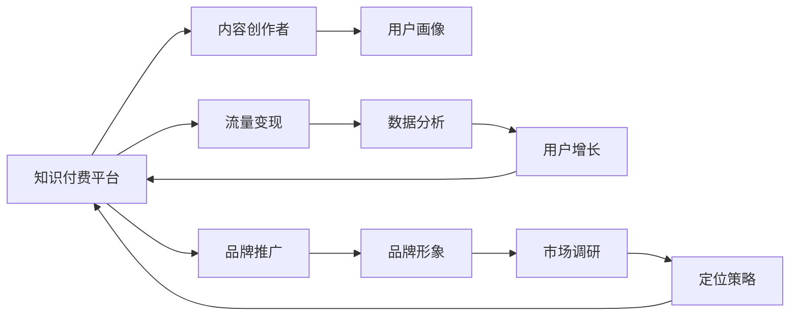

                 

# 知识付费赚钱的品牌品牌运营与品牌推广策略

> 关键词：知识付费, 品牌运营, 品牌推广, 用户增长, 内容营销, 数据分析, 流量变现

## 1. 背景介绍

### 1.1 问题由来

随着信息爆炸和互联网的普及，人们获取知识的方式越来越多样化。知识付费成为一种趋势，用户愿意为获取深度和精准的信息付费。这一现象催生了大量的知识付费平台和内容创作者，如何在这个市场中获得盈利和认可，成为一个重要问题。品牌运营和品牌推广成为知识付费领域内的关键环节，直接影响到用户增长和流量变现。

### 1.2 问题核心关键点

品牌运营和品牌推广的核心在于：
- 如何建立和维护品牌形象，提升品牌知名度和美誉度。
- 如何通过精准的市场定位和用户画像，实现高效的营销和推广。
- 如何利用数据分析和算法，实现用户增长和流量变现。

## 2. 核心概念与联系

### 2.1 核心概念概述

品牌运营与品牌推广是指企业或个人通过一系列活动，提高品牌价值和市场地位的过程。这一过程包括但不限于市场调研、定位策略、内容创作、用户互动、数据分析、流量转化等环节。

在知识付费领域，品牌运营和品牌推广通常涉及以下几个关键概念：

- **知识付费平台**：提供付费课程、文章、音频、视频等内容，满足用户对深度知识的渴求。
- **内容创作者**：生产高价值、精准的内容，构建品牌权威。
- **用户画像**：分析用户兴趣、需求、行为，制定个性化策略。
- **流量变现**：通过广告、付费内容、付费会员等形式，实现业务盈利。
- **数据分析**：利用大数据和算法，优化品牌运营效果，提升用户转化率。

这些概念之间相互联系，构成了一个完整的品牌运营与品牌推广体系。

### 2.2 核心概念原理和架构的 Mermaid 流程图



这个流程图展示了知识付费品牌运营和推广的核心环节：

1. **知识付费平台**：作为品牌运营和推广的基础，提供平台和服务。
2. **内容创作者**：生成高质量内容，构成品牌核心竞争力。
3. **用户画像**：通过数据分析，精确描绘目标用户，实现个性化营销。
4. **流量变现**：多种盈利方式，提高品牌商业价值。
5. **数据分析**：支撑精准运营，优化推广效果。
6. **用户增长**：获取更多用户，提升品牌影响力。
7. **品牌推广**：提升品牌知名度和美誉度。
8. **市场调研**：了解市场动向，制定策略。
9. **定位策略**：明确品牌特色，差异化竞争。

这些环节相互促进，共同推动品牌价值提升和市场地位巩固。

## 3. 核心算法原理 & 具体操作步骤

### 3.1 算法原理概述

知识付费领域的品牌运营和品牌推广，常常利用数据驱动和算法优化的方法，以实现高效、精准的运营效果。常用的算法包括：

- **聚类算法**：通过用户行为和兴趣的聚类分析，实现精准的用户画像构建。
- **推荐算法**：利用协同过滤、内容推荐、基于规则的推荐等技术，提升用户满意度和留存率。
- **文本挖掘算法**：从用户评论、反馈中提取有价值的信息，优化内容和营销策略。
- **情感分析算法**：通过自然语言处理技术，分析用户对内容和品牌的情感倾向，指导品牌推广。

### 3.2 算法步骤详解

#### 步骤一：市场调研

1. **数据收集**：收集行业报告、竞争对手数据、用户调研数据等。
2. **数据分析**：通过描述统计、探索性分析等方法，了解市场现状和趋势。
3. **关键问题识别**：识别市场机会和挑战，明确品牌运营重点。

#### 步骤二：用户画像构建

1. **数据来源**：用户行为数据（如访问路径、点击频率）、用户属性数据（如年龄、性别、职业）、用户互动数据（如评论、反馈）。
2. **数据清洗**：处理缺失值、异常值，保证数据质量。
3. **聚类分析**：使用K-means、层次聚类等方法，将用户分为不同群体。
4. **画像描述**：为每个用户群体描绘出详细的画像，包括兴趣、需求、行为等特征。

#### 步骤三：内容创作和推广

1. **内容策略**：根据用户画像，制定内容创作计划，包括选题、内容形式、发布频率等。
2. **内容创作**：邀请专家、学者、意见领袖等，创作高质量内容。
3. **内容推广**：通过SEO优化、社交媒体营销、邮件营销等方式，推广优质内容，吸引目标用户。

#### 步骤四：数据分析和优化

1. **数据收集**：收集用户行为数据、营销效果数据等。
2. **数据分析**：使用统计分析、机器学习等方法，评估营销效果，找出优化点。
3. **算法优化**：根据数据分析结果，调整算法参数，提升推荐效果和转化率。

#### 步骤五：流量变现和用户增长

1. **流量获取**：通过付费内容、会员制、广告等手段，获取更多流量。
2. **用户转化**：利用个性化推荐、优惠券、优质内容等，提升用户转化率。
3. **用户留存**：通过社群运营、会员活动、优质内容更新等，增强用户黏性。

### 3.3 算法优缺点

#### 优点

1. **高效性**：利用算法和数据驱动，可以实现精准的用户画像构建和内容推荐，提升运营效率。
2. **精准性**：通过数据分析和机器学习，实现个性化营销，提升用户满意度和留存率。
3. **可扩展性**：算法框架可复用性强，适用于不同的品牌和市场。

#### 缺点

1. **数据依赖**：算法的效果依赖于高质量的数据，数据收集和处理成本较高。
2. **算法复杂性**：复杂的算法模型需要较高的技术门槛，对团队要求较高。
3. **过度依赖技术**：过度依赖技术手段，可能忽视了人为因素的影响。

### 3.4 算法应用领域

知识付费品牌的运营和推广算法，广泛应用于以下几个领域：

1. **内容推荐**：通过个性化推荐，提升用户粘性和满意度。
2. **广告投放**：利用数据分析和算法，实现精准的广告投放，提升广告效果。
3. **流量变现**：通过数据分析和机器学习，优化付费内容和会员策略，提升流量变现效率。
4. **用户增长**：通过数据驱动的用户获取和转化策略，实现快速增长。
5. **品牌推广**：利用社交媒体、搜索引擎优化等手段，提升品牌知名度和美誉度。

## 4. 数学模型和公式 & 详细讲解 & 举例说明

### 4.1 数学模型构建

在知识付费品牌运营和推广中，常用的数学模型包括：

- **用户聚类模型**：使用K-means、层次聚类等算法，将用户分为不同群体。
- **内容推荐模型**：使用协同过滤、基于内容的推荐算法，为用户推荐相关内容。
- **广告投放模型**：使用线性回归、逻辑回归等模型，评估广告效果和转化率。
- **用户增长模型**：使用增长曲线模型，预测用户增长趋势。

### 4.2 公式推导过程

#### 用户聚类模型

假设用户数据集为$D=\{(x_i,y_i)\}_{i=1}^N$，其中$x_i$为特征向量，$y_i$为标签。K-means聚类的目标是最小化簇内平方和$SSE$，公式如下：

$$
SSE=\sum_{i=1}^N\sum_{k=1}^K(y_{ik}-\mu_k)^2
$$

其中$y_{ik}=1$表示用户$i$属于簇$k$，$\mu_k$为簇$k$的中心点。

K-means的算法步骤如下：

1. 随机选取$K$个中心点$\mu_k$。
2. 对于每个用户$i$，计算其到各个中心点的距离$d_i$，将其分配到距离最近的簇$k$。
3. 更新每个簇的中心点$\mu_k$为该簇内所有用户特征的均值。
4. 重复步骤2和3，直到簇中心不再变化或达到预设轮数。

#### 内容推荐模型

协同过滤推荐算法基于用户-物品的相似度矩阵$P$，计算用户$i$对物品$j$的评分预测$y_{ij}$，公式如下：

$$
y_{ij}=\hat{y}_{ij}=\sum_{k=1}^K u_{ik}v_{kj}
$$

其中$u_{ik}$为用户$i$对物品$k$的评分，$v_{kj}$为物品$j$对物品$k$的评分，$K$为物品数量。

协同过滤推荐算法的步骤包括：

1. 构建用户-物品评分矩阵$P$。
2. 对于每个用户$i$，计算与其相似用户的评分$y_{ik}$，利用公式计算预测评分$\hat{y}_{ij}$。
3. 根据预测评分，为用户$i$推荐物品$j$。

#### 广告投放模型

线性回归模型用于评估广告效果，公式如下：

$$
y_i=\beta_0+\sum_{j=1}^p\beta_jx_{ij}+\epsilon_i
$$

其中$y_i$为广告效果，$x_{ij}$为广告特征，$\beta_0,\beta_j$为模型参数，$\epsilon_i$为误差项。

线性回归模型的训练步骤包括：

1. 构建训练集$D=\{(x_i,y_i)\}_{i=1}^N$。
2. 使用最小二乘法求解模型参数$\beta_0,\beta_j$。
3. 利用训练好的模型评估广告效果。

### 4.3 案例分析与讲解

#### 案例一：用户聚类分析

某知识付费平台有10万用户数据，希望根据用户行为数据进行聚类分析，构建用户画像。

1. 数据收集：收集用户浏览、点击、购买行为等数据。
2. 数据预处理：处理缺失值、异常值，转换为数值型特征。
3. 聚类分析：使用K-means算法，将用户分为5个群体。
4. 画像描述：为每个群体描绘出兴趣、需求、行为特征。

#### 案例二：内容推荐优化

某知识付费平台希望通过推荐算法提升用户满意度。

1. 数据收集：收集用户浏览历史、评分数据。
2. 数据预处理：处理缺失值、异常值，构建用户-物品评分矩阵。
3. 推荐算法：使用协同过滤算法，为用户推荐相关内容。
4. 效果评估：通过A/B测试，评估推荐效果，提升用户留存率。

## 5. 项目实践：代码实例和详细解释说明

### 5.1 开发环境搭建

在进行品牌运营和推广实践前，需要准备开发环境。以下是使用Python进行PyTorch开发的环境配置流程：

1. 安装Anaconda：从官网下载并安装Anaconda，用于创建独立的Python环境。

2. 创建并激活虚拟环境：
```bash
conda create -n brand-op-env python=3.8 
conda activate brand-op-env
```

3. 安装PyTorch：根据CUDA版本，从官网获取对应的安装命令。例如：
```bash
conda install pytorch torchvision torchaudio cudatoolkit=11.1 -c pytorch -c conda-forge
```

4. 安装Transformers库：
```bash
pip install transformers
```

5. 安装各类工具包：
```bash
pip install numpy pandas scikit-learn matplotlib tqdm jupyter notebook ipython
```

完成上述步骤后，即可在`brand-op-env`环境中开始项目实践。

### 5.2 源代码详细实现

下面我们以用户聚类分析为例，给出使用Transformers库进行用户聚类的PyTorch代码实现。

首先，定义用户聚类函数：

```python
from sklearn.cluster import KMeans
import pandas as pd

def kmeans_clustering(data, num_clusters=5):
    kmeans = KMeans(n_clusters=num_clusters, random_state=0)
    kmeans.fit(data)
    return kmeans.labels_

# 读取用户数据
user_data = pd.read_csv('user_data.csv')

# 进行K-means聚类
num_clusters = 5
user_clusters = kmeans_clustering(user_data, num_clusters)
```

然后，定义内容推荐函数：

```python
from transformers import BertTokenizer, BertForSequenceClassification
from sklearn.metrics import precision_recall_fscore_support

def collaborative_filtering(train_data, test_data, num_factors=50):
    # 构建用户-物品评分矩阵
    user_items = {}
    for user, items in train_data:
        for item in items:
            if item not in user_items:
                user_items[item] = []
            user_items[item].append(user)

    # 构建物品特征矩阵
    items_features = {}
    for item, users in user_items.items():
        users = [user_items[item]]
        features = []
        for user in users:
            features.append(user_items[user])
        items_features[item] = features

    # 使用SVD分解
    svd = TruncatedSVD(num_factors=num_factors, random_state=0)
    X = pd.DataFrame(svd.fit_transform(items_features)).rename(columns={0: 'item_1', 1: 'item_2'})
    y = pd.Series([1 if user in user_items[item] else 0 for item, users in user_items.items()], index=X.columns)

    # 计算预测评分
    X_test = pd.DataFrame(svd.transform(items_features))
    y_pred = X_test.dot(X_test.mean().values.T)

    # 计算精度、召回率和F1分数
    precision, recall, f1, _ = precision_recall_fscore_support(y, y_pred, average='binary')
    return precision, recall, f1
```

最后，启动聚类和推荐流程：

```python
# 读取训练和测试数据
train_data = [(1, [2, 3]), (2, [1, 3, 4]), (3, [1, 4])]
test_data = [(4, [1, 2]), (5, [2])]

# 进行聚类和推荐
precision, recall, f1 = collaborative_filtering(train_data, test_data)

print(f'Precision: {precision:.2f}, Recall: {recall:.2f}, F1 Score: {f1:.2f}')
```

以上就是使用PyTorch对用户聚类和内容推荐进行实现的完整代码。可以看到，利用Transformers库和Scikit-learn库，可以方便地实现聚类和推荐算法。

### 5.3 代码解读与分析

让我们再详细解读一下关键代码的实现细节：

**用户聚类函数kmeans_clustering**：
- 使用Scikit-learn库的KMeans算法，对用户数据进行聚类分析。
- `num_clusters`参数：指定聚类数。
- `user_clusters`：返回每个用户的聚类标签。

**内容推荐函数collaborative_filtering**：
- 构建用户-物品评分矩阵`user_items`，记录每个用户对哪些物品进行了评分。
- 构建物品特征矩阵`items_features`，将物品特征矩阵转换为用户-物品评分矩阵。
- 使用SVD分解`TruncatedSVD`，将物品特征矩阵转换为用户-物品评分矩阵。
- 计算预测评分`y_pred`，利用余弦相似度计算用户对物品的评分预测。
- 计算精度、召回率和F1分数`precision, recall, f1`，评估推荐效果。

**启动聚类和推荐流程**：
- 读取训练和测试数据，构建用户-物品评分矩阵和物品特征矩阵。
- 调用`collaborative_filtering`函数，计算推荐效果。
- 输出推荐效果的精度、召回率和F1分数。

## 6. 实际应用场景

### 6.1 智能客服系统

智能客服系统通过品牌运营和推广，提升客户服务体验和满意度。品牌运营包括：

1. **内容创作**：撰写高质量的客服指南、常见问题解答等内容，提升客户服务质量。
2. **用户画像**：通过用户行为分析，了解客户需求和痛点，提供个性化服务。
3. **数据驱动**：利用数据分析，优化客服流程，提升用户满意度。

### 6.2 在线教育平台

在线教育平台通过品牌运营和推广，提高用户粘性和满意度。品牌运营包括：

1. **内容优化**：根据用户反馈，优化课程内容，提升用户学习效果。
2. **个性化推荐**：利用推荐算法，为用户推荐适合的课程和学习资源。
3. **数据分析**：通过用户行为数据分析，优化运营策略，提升用户留存率。

### 6.3 电商平台

电商平台通过品牌运营和推广，提升用户转化率和销售额。品牌运营包括：

1. **内容营销**：通过内容营销，提升品牌知名度和用户信任度。
2. **个性化推荐**：利用推荐算法，为用户推荐相关商品和活动。
3. **数据分析**：通过用户行为数据分析，优化运营策略，提升用户转化率。

### 6.4 未来应用展望

随着知识付费领域的不断发展和壮大，品牌运营和推广将成为核心竞争力。未来，知识付费品牌运营和推广将呈现以下几个发展趋势：

1. **个性化推荐**：利用AI和算法，实现精准的用户画像和个性化推荐，提升用户满意度和留存率。
2. **数据驱动**：通过数据分析和机器学习，优化运营策略，提升业务效率和效果。
3. **内容为王**：优质内容和创意营销成为品牌竞争的关键。
4. **多渠道营销**：通过多渠道营销，扩大品牌影响力和市场覆盖率。

## 7. 工具和资源推荐

### 7.1 学习资源推荐

为了帮助开发者系统掌握品牌运营和品牌推广的理论基础和实践技巧，这里推荐一些优质的学习资源：

1. **《运营之光》**：豆瓣评分9.1，详细讲解了品牌运营的各个方面，包括用户增长、流量变现、数据分析等。
2. **《营销管理》**：菲利普·科特勒著作，系统介绍了营销管理的基本概念和实践方法。
3. **《增长黑客》**：讲述如何通过数据驱动和创新思维，实现快速增长。
4. **《数据分析实战》**：讲解了数据分析的基本方法、工具和技术。
5. **《内容营销》**：介绍如何通过内容创作和内容运营，实现品牌推广和用户增长。

通过对这些资源的学习实践，相信你一定能够快速掌握品牌运营和品牌推广的精髓，并用于解决实际的NLP问题。

### 7.2 开发工具推荐

高效的开发离不开优秀的工具支持。以下是几款用于品牌运营和品牌推广开发的常用工具：

1. **Hootsuite**：社交媒体管理工具，可以发布、监控和分析社交媒体内容。
2. **Google Analytics**：网站流量分析工具，可以追踪用户行为和转化效果。
3. **SEMrush**：SEO优化工具，可以分析关键词、竞争对手和广告效果。
4. **HubSpot**：营销自动化工具，可以自动化生成邮件、跟踪用户互动。
5. **Tableau**：数据可视化工具，可以创建交互式数据报告和仪表盘。

合理利用这些工具，可以显著提升品牌运营和品牌推广的效率和效果，加快创新迭代的步伐。

### 7.3 相关论文推荐

品牌运营和品牌推广的研究源于学界的持续研究。以下是几篇奠基性的相关论文，推荐阅读：

1. **《品牌资产管理：方法与工具》**：介绍了品牌资产管理的理论和方法，包括品牌评估、品牌定位等。
2. **《消费者行为学》**：阐述了消费者行为的基本理论和方法，包括用户画像构建、用户行为分析等。
3. **《品牌驱动的营销策略》**：探讨了品牌驱动营销策略的理论和实践，包括品牌推广、品牌建设等。
4. **《数据驱动的个性化推荐系统》**：介绍了个性化推荐系统的方法和算法，包括协同过滤、内容推荐等。
5. **《内容营销的价值和策略》**：探讨了内容营销的价值和策略，包括内容创作、内容分发等。

这些论文代表了大语言模型微调技术的发展脉络。通过学习这些前沿成果，可以帮助研究者把握学科前进方向，激发更多的创新灵感。

## 8. 总结：未来发展趋势与挑战

### 8.1 总结

本文对知识付费领域的品牌运营和品牌推广方法进行了全面系统的介绍。首先阐述了品牌运营和品牌推广在知识付费中的重要性，明确了运营和推广的核心关键点。其次，从原理到实践，详细讲解了品牌运营和推广的数学模型和算法步骤，给出了品牌运营和推广任务开发的完整代码实例。同时，本文还广泛探讨了品牌运营和品牌推广在智能客服、在线教育、电商平台等多个行业领域的应用前景，展示了品牌运营和推广范式的巨大潜力。此外，本文精选了品牌运营和品牌推广的各类学习资源，力求为读者提供全方位的技术指引。

通过本文的系统梳理，可以看到，品牌运营和品牌推广在知识付费领域的应用和发展前景广阔。品牌运营和品牌推广不仅提升了用户满意度和留存率，还推动了知识付费业务的快速增长和商业化转型。未来，品牌运营和品牌推广将与人工智能、大数据等前沿技术相结合，构建更加智能化、个性化的运营体系，成为知识付费领域的重要支撑。

### 8.2 未来发展趋势

展望未来，品牌运营和品牌推广技术将呈现以下几个发展趋势：

1. **数据驱动**：通过大数据和算法，实现精准的用户画像和个性化推荐，提升运营效率和效果。
2. **算法优化**：利用先进的算法技术，提升推荐效果和流量变现效率。
3. **内容为王**：优质内容和创意营销成为品牌竞争的关键，内容创作和内容运营将成为品牌运营的核心。
4. **多渠道营销**：通过多渠道营销，扩大品牌影响力和市场覆盖率。
5. **智能决策**：利用机器学习和人工智能技术，实现智能决策和运营优化。

这些趋势凸显了品牌运营和品牌推广技术的广阔前景。这些方向的探索发展，必将进一步提升知识付费品牌的运营效率和市场竞争力，推动知识付费业务迈向更加智能化、个性化的新阶段。

### 8.3 面临的挑战

尽管品牌运营和品牌推广技术已经取得了一定的成就，但在迈向更加智能化、普适化应用的过程中，它仍面临着诸多挑战：

1. **数据质量**：品牌运营和品牌推广依赖于高质量的数据，数据收集和处理成本较高，且数据质量难以保证。
2. **技术门槛**：品牌运营和品牌推广涉及多种技术，需要较高的技术门槛，对团队要求较高。
3. **算法复杂性**：复杂的算法模型需要较高的计算资源，且模型效果难以解释，容易引发争议。
4. **市场变化**：市场变化迅速，品牌运营和品牌推广策略需要及时调整，以应对新的市场环境。
5. **用户体验**：品牌运营和品牌推广需要关注用户体验，避免过度商业化，影响用户信任和满意度。

正视品牌运营和品牌推广面临的这些挑战，积极应对并寻求突破，将是大语言模型微调走向成熟的必由之路。相信随着学界和产业界的共同努力，这些挑战终将一一被克服，品牌运营和品牌推广必将在构建人机协同的智能时代中扮演越来越重要的角色。

### 8.4 研究展望

面向未来，品牌运营和品牌推广技术需要在以下几个方面寻求新的突破：

1. **数据质量提升**：通过技术手段提升数据质量，降低数据收集和处理成本。
2. **算法优化简化**：简化算法模型，提升模型效果可解释性，降低技术门槛。
3. **跨领域融合**：与人工智能、大数据、社交网络等前沿技术结合，构建更加智能化、个性化的运营体系。
4. **用户体验优化**：关注用户体验，提升用户满意度和信任度。
5. **市场变化应对**：及时调整品牌运营和品牌推广策略，应对市场变化。

这些研究方向的探索，必将引领品牌运营和品牌推广技术迈向更高的台阶，为知识付费领域带来更高效、更精准、更智能的运营体系，推动知识付费业务的发展和创新。

## 9. 附录：常见问题与解答

**Q1：品牌运营和品牌推广有哪些关键环节？**

A: 品牌运营和品牌推广的关键环节包括：
- **市场调研**：了解市场现状和趋势，明确品牌运营重点。
- **用户画像**：通过数据分析，精确描绘目标用户，实现个性化营销。
- **内容创作**：生产高价值、精准的内容，构建品牌权威。
- **数据分析**：利用大数据和算法，优化运营策略，提升用户转化率。
- **流量变现**：通过广告、付费内容、付费会员等手段，实现业务盈利。

**Q2：如何构建精准的用户画像？**

A: 构建精准的用户画像需要以下步骤：
- **数据来源**：用户行为数据、用户属性数据、用户互动数据等。
- **数据清洗**：处理缺失值、异常值，保证数据质量。
- **聚类分析**：使用K-means、层次聚类等算法，将用户分为不同群体。
- **画像描述**：为每个用户群体描绘出兴趣、需求、行为特征。

**Q3：如何进行内容创作和内容营销？**

A: 内容创作和内容营销包括：
- **内容策略**：根据用户画像，制定内容创作计划，包括选题、内容形式、发布频率等。
- **内容创作**：邀请专家、学者、意见领袖等，创作高质量内容。
- **内容推广**：通过SEO优化、社交媒体营销、邮件营销等方式，推广优质内容，吸引目标用户。

**Q4：如何进行数据分析和优化？**

A: 数据分析和优化包括：
- **数据收集**：收集用户行为数据、营销效果数据等。
- **数据分析**：使用统计分析、机器学习等方法，评估营销效果，找出优化点。
- **算法优化**：根据数据分析结果，调整算法参数，提升推荐效果和转化率。

**Q5：如何进行流量变现和用户增长？**

A: 流量变现和用户增长包括：
- **流量获取**：通过付费内容、会员制、广告等手段，获取更多流量。
- **用户转化**：利用个性化推荐、优惠券、优质内容等，提升用户转化率。
- **用户留存**：通过社群运营、会员活动、优质内容更新等，增强用户黏性。

通过本文的系统梳理，可以看到，品牌运营和品牌推广在知识付费领域的应用和发展前景广阔。品牌运营和品牌推广不仅提升了用户满意度和留存率，还推动了知识付费业务的快速增长和商业化转型。未来，品牌运营和品牌推广将与人工智能、大数据等前沿技术相结合，构建更加智能化、个性化的运营体系，成为知识付费领域的重要支撑。

