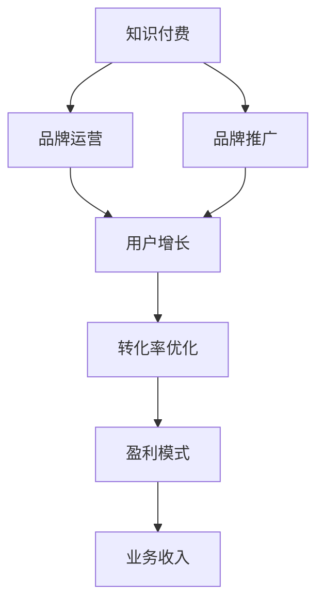

                 

# 知识付费赚钱的品牌品牌运营与品牌推广策略

> 关键词：知识付费,品牌运营,品牌推广,用户增长,转化率优化

## 1. 背景介绍

### 1.1 问题由来
随着互联网的普及和技术的进步，知识付费市场迎来了蓬勃发展。据统计，2021年中国知识付费市场规模已达到645亿元，同比增长39.8%。知识付费不仅满足了人们对知识的深层次需求，也为企业开辟了新的收入来源。然而，尽管知识付费市场潜力巨大，许多企业却面临着用户流失率高、转化率低、盈利模式单一等问题，制约了其持续发展。如何通过品牌运营与推广策略，提升知识付费平台的竞争力，实现盈利模式的转型和升级，成为当下亟待解决的问题。

### 1.2 问题核心关键点
品牌运营与品牌推广策略的关键在于如何通过系统化的营销手段，提升品牌知名度和用户粘性，优化转化率，最终实现盈利增长。这一过程涉及市场定位、用户分析、内容生产、渠道选择、流量获取、用户互动等多个环节，需要企业综合运用各种手段，打造一个全方位、立体化的品牌品牌运营与推广体系。

### 1.3 问题研究意义
品牌运营与品牌推广策略的研究对于知识付费平台的健康发展和盈利能力的提升具有重要意义：

1. **提升品牌知名度**：通过有效的品牌推广，可以将知识付费平台从众多竞争者中脱颖而出，吸引更多用户关注。
2. **增强用户粘性**：通过优质的品牌运营，可以提升用户满意度，增加用户粘性，降低用户流失率。
3. **优化转化率**：通过精准的品牌定位和用户画像分析，可以优化转化路径，提高用户购买转化率。
4. **丰富盈利模式**：通过品牌运营与推广策略，可以构建多样化的盈利模式，如会员订阅、增值服务、广告收入等。
5. **促进行业发展**：通过探索和推广成功的品牌运营与推广策略，可以促进知识付费行业整体水平的提升。

## 2. 核心概念与联系

### 2.1 核心概念概述

品牌运营与品牌推广策略的核心概念包括：

- **知识付费**：基于知识创造的价值转化，用户通过付费获取专属内容。
- **品牌运营**：企业通过系统化手段，提升品牌知名度、用户粘性和转化率，实现品牌价值最大化。
- **品牌推广**：通过各类营销手段，提升品牌知名度和市场影响力，吸引更多用户关注。
- **用户增长**：通过有效的运营策略，吸引更多新用户加入，提高平台用户总量。
- **转化率优化**：通过优化用户体验和转化路径，提升用户从潜在客户到付费客户的转化率。

这些概念之间具有紧密的联系，共同构成了一个品牌品牌运营与推广的完整体系。品牌运营和推广策略的最终目标是通过提升品牌知名度和用户满意度，实现用户增长和转化率的优化，从而提升平台的整体盈利能力。

### 2.2 核心概念原理和架构的 Mermaid 流程图



此流程图展示了知识付费品牌运营与推广策略的核心流程，从知识付费平台出发，通过品牌运营和推广提升用户增长和转化率，最终实现平台的盈利模式和业务收入。

## 3. 核心算法原理 & 具体操作步骤
### 3.1 算法原理概述

品牌运营与品牌推广策略的核心算法原理主要包括以下几个方面：

1. **用户画像分析**：通过收集和分析用户行为数据，构建用户画像，了解用户需求和偏好，为个性化运营和推广提供依据。
2. **A/B测试**：通过对比实验，测试不同运营策略的效果，找到最优方案。
3. **推荐系统**：基于用户画像和内容标签，推荐用户感兴趣的内容，提高用户粘性。
4. **搜索引擎优化(SEO)**：通过优化网站结构和内容，提升搜索引擎排名，吸引更多自然流量。
5. **社交媒体营销**：利用社交媒体平台的影响力和用户网络，扩大品牌知名度。

这些算法和策略共同构成了知识付费品牌运营与推广的框架。

### 3.2 算法步骤详解

#### 3.2.1 用户画像分析

用户画像分析是品牌运营的基础，通过分析用户行为数据，了解用户特征、兴趣和需求。主要步骤包括：

1. **数据收集**：从平台日志、交易记录、内容互动等渠道收集用户数据。
2. **数据清洗**：去除重复、异常数据，确保数据质量。
3. **特征提取**：根据业务需求，提取关键特征，如用户活跃度、消费行为、兴趣爱好等。
4. **用户分类**：将用户按照不同特征进行分类，构建用户画像。
5. **画像应用**：根据用户画像，进行个性化推荐、内容推送等。

#### 3.2.2 A/B测试

A/B测试是通过对比实验，评估不同运营策略的效果，找到最优方案。主要步骤包括：

1. **制定假设**：明确测试目标和假设，如提升转化率、增加用户粘性等。
2. **设计实验**：设计两组或多组变量，进行对比实验。
3. **样本选择**：随机选择用户参与实验，确保样本代表性。
4. **实验执行**：执行实验，收集用户反馈和数据。
5. **结果分析**：分析实验结果，验证假设是否成立。

#### 3.2.3 推荐系统

推荐系统是提升用户粘性的重要手段，通过推荐用户感兴趣的内容，提高用户互动率和留存率。主要步骤包括：

1. **内容标签化**：对平台上的内容进行标签化处理，提取关键词和特征。
2. **用户画像建模**：根据用户画像，建立用户兴趣模型。
3. **推荐算法设计**：设计推荐算法，如协同过滤、基于内容的推荐等。
4. **模型训练与评估**：使用历史数据训练推荐模型，评估推荐效果。
5. **实时推荐**：将推荐模型应用于平台，实时推荐内容给用户。

#### 3.2.4 SEO优化

SEO优化是通过优化网站结构和内容，提升搜索引擎排名，吸引更多自然流量。主要步骤包括：

1. **关键词分析**：分析用户搜索习惯，提取关键词和搜索词。
2. **内容优化**：优化网站内容，确保关键词密度和相关性。
3. **结构调整**：优化网站结构，提高页面加载速度和用户体验。
4. **外部链接建设**：通过内容合作、友情链接等方式，增加外部链接数量和质量。
5. **效果监控**：监控网站流量和排名变化，持续优化SEO策略。

#### 3.2.5 社交媒体营销

社交媒体营销是通过利用社交媒体平台的影响力和用户网络，扩大品牌知名度和用户覆盖。主要步骤包括：

1. **平台选择**：选择适合的知识付费平台和社交媒体渠道，如微信、微博、抖音等。
2. **内容生产**：制作有吸引力的内容，如视频、文章、直播等，吸引用户关注。
3. **用户互动**：与用户进行互动，回答用户问题，解答用户疑惑。
4. **社区建设**：建立用户社区，增加用户粘性和参与度。
5. **效果评估**：评估社交媒体营销效果，调整策略。

### 3.3 算法优缺点

品牌运营与品牌推广策略的优点包括：

1. **提高用户粘性**：通过个性化推荐和社区建设，提高用户满意度和忠诚度。
2. **提升转化率**：通过用户画像分析和转化路径优化，提升用户购买转化率。
3. **优化成本**：通过A/B测试和SEO优化，降低运营成本，提高营销效果。
4. **拓宽用户来源**：通过社交媒体营销，拓展用户覆盖和品牌影响力。

然而，该策略也存在一些缺点：

1. **数据依赖**：依赖用户行为数据和社交媒体反馈，数据获取难度较大。
2. **效果滞后**：部分策略如SEO优化，效果显现较慢，需要持续投入。
3. **竞争激烈**：知识付费市场竞争激烈，用户选择多样，品牌推广难度较大。
4. **用户隐私**：在数据收集和分析过程中，需要注意用户隐私保护，避免数据泄露。

### 3.4 算法应用领域

品牌运营与品牌推广策略在知识付费平台中的应用领域包括：

1. **新用户获取**：通过搜索引擎优化、社交媒体营销等方式，吸引新用户注册和体验。
2. **用户留存**：通过个性化推荐、社区互动等手段，提升用户留存率和活跃度。
3. **用户转化**：通过转化路径优化和推荐系统，提升用户从免费用户到付费用户的转化率。
4. **会员管理**：通过数据分析和A/B测试，优化会员权益和促销策略，提高会员粘性和续订率。
5. **品牌塑造**：通过品牌推广和内容创作，提升品牌知名度和用户信任度。

## 4. 数学模型和公式 & 详细讲解 & 举例说明

### 4.1 数学模型构建

品牌运营与品牌推广策略的数学模型主要包括以下几个方面：

1. **用户画像建模**：
   - **用户活跃度**：$Active_i = \frac{Action_i}{Total_{Action}}$
   - **消费行为**：$Spending_i = \sum_{j=1}^k Amount_{i,j}$
   - **兴趣爱好**：$Interest_i = \frac{Tag_{i,Interest}}{Tag_{i,All}}$

2. **A/B测试效果评估**：
   - **转化率提升**：$\Delta R = \frac{R_{Test} - R_{Control}}{R_{Control}}$
   - **用户满意度提升**：$NPS = \frac{Promoter_{Test} - Detractor_{Test}}{Total_{Respondents}}$
   - **ROI计算**：$ROI = \frac{Profit_{New} - Profit_{Old}}{Cost_{Promotion}}$

3. **推荐系统效果评估**：
   - **准确率**：$Accuracy = \frac{TP}{TP + FP + FN}$
   - **召回率**：$Recall = \frac{TP}{TP + FN}$
   - **F1分数**：$F1 = 2 * \frac{Precision * Recall}{Precision + Recall}$

4. **SEO效果评估**：
   - **关键词排名提升**：$\Delta Rank = Rank_{New} - Rank_{Old}$
   - **流量增加**：$\Delta Traffic = Traffic_{New} - Traffic_{Old}$

5. **社交媒体营销效果评估**：
   - **关注度提升**：$\Delta Followers = Followers_{New} - Followers_{Old}$
   - **互动率提升**：$\Delta Engagement = Engagement_{New} - Engagement_{Old}$

### 4.2 公式推导过程

#### 4.2.1 用户画像建模公式推导

用户画像建模公式推导主要涉及统计学中的平均数、标准差、比例等基本概念，以及一些加权计算公式。

1. **用户活跃度**：
   - $Active_i = \frac{\sum_{j=1}^{n} Action_{i,j}}{\sum_{j=1}^{n} Action_{j}}$

2. **消费行为**：
   - $Spending_i = \sum_{j=1}^{k} Amount_{i,j}$

3. **兴趣爱好**：
   - $Interest_i = \frac{\sum_{j=1}^{m} Tag_{i,j,Interest}}{\sum_{j=1}^{m} Tag_{i,j,All}}$

#### 4.2.2 A/B测试效果评估公式推导

A/B测试效果评估公式推导主要涉及统计学中的假设检验、置信区间等概念。

1. **转化率提升**：
   - $\Delta R = \frac{R_{Test} - R_{Control}}{R_{Control}}$

2. **用户满意度提升**：
   - $NPS = \frac{Promoter_{Test} - Detractor_{Test}}{Total_{Respondents}}$

3. **ROI计算**：
   - $ROI = \frac{Profit_{New} - Profit_{Old}}{Cost_{Promotion}}$

#### 4.2.3 推荐系统效果评估公式推导

推荐系统效果评估公式推导主要涉及机器学习中的准确率、召回率、F1分数等概念。

1. **准确率**：
   - $Accuracy = \frac{TP}{TP + FP + FN}$

2. **召回率**：
   - $Recall = \frac{TP}{TP + FN}$

3. **F1分数**：
   - $F1 = 2 * \frac{Precision * Recall}{Precision + Recall}$

#### 4.2.4 SEO效果评估公式推导

SEO效果评估公式推导主要涉及网站流量统计和关键词排名计算。

1. **关键词排名提升**：
   - $\Delta Rank = Rank_{New} - Rank_{Old}$

2. **流量增加**：
   - $\Delta Traffic = Traffic_{New} - Traffic_{Old}$

#### 4.2.5 社交媒体营销效果评估公式推导

社交媒体营销效果评估公式推导主要涉及关注度统计和互动率计算。

1. **关注度提升**：
   - $\Delta Followers = Followers_{New} - Followers_{Old}$

2. **互动率提升**：
   - $\Delta Engagement = Engagement_{New} - Engagement_{Old}$

### 4.3 案例分析与讲解

#### 4.3.1 用户画像分析案例

某知识付费平台通过用户画像分析，发现用户A的活跃度和消费行为高于平均水平，但对平台内容的兴趣较为分散。平台根据这一画像，为其推荐了相关主题的课程和文章，增加了用户粘性，提高了用户满意度。

#### 4.3.2 A/B测试案例

某平台通过A/B测试，对比了两种不同的优惠券发放策略，发现策略B的转化率提高了15%。平台根据测试结果，在所有用户中推广策略B，显著提升了新用户的购买转化率。

#### 4.3.3 推荐系统案例

某平台通过推荐系统，为已付费用户推荐了其未购买的高评分课程，提高了用户复购率和平台的盈利能力。同时，平台还根据用户反馈，不断优化推荐算法，提高了推荐的准确性和个性化程度。

#### 4.3.4 SEO优化案例

某平台通过SEO优化，提升了在搜索引擎中的排名，流量增加了30%。平台通过定期监控和调整SEO策略，确保了网站流量的持续增长，提高了平台的知名度和用户覆盖。

#### 4.3.5 社交媒体营销案例

某平台通过在社交媒体上发布高质量内容，吸引了大量用户关注。平台通过与用户互动，增加了社区活跃度，提高了用户粘性和留存率。同时，平台还通过合作推广，进一步扩大了品牌的知名度和影响力。

## 5. 项目实践：代码实例和详细解释说明

### 5.1 开发环境搭建

品牌运营与品牌推广策略的开发环境搭建主要包括以下步骤：

1. **环境配置**：在本地或云端搭建Python开发环境，安装必要的依赖库。
2. **数据准备**：收集和整理用户数据、内容数据、社交媒体数据等。
3. **工具安装**：安装和配置数据处理工具、分析工具、推荐工具、SEO工具等。
4. **模型训练**：使用历史数据训练推荐模型、SEO模型、A/B测试模型等。
5. **系统集成**：将各个工具和模型集成到知识付费平台中，实现自动化和实时化。

### 5.2 源代码详细实现

#### 5.2.1 用户画像分析代码实现

```python
from sklearn.preprocessing import LabelEncoder
from sklearn.metrics import classification_report
from sklearn.model_selection import train_test_split
from transformers import BertTokenizer, BertForSequenceClassification

# 加载数据
train_data = pd.read_csv('train.csv')
test_data = pd.read_csv('test.csv')

# 数据预处理
tokenizer = BertTokenizer.from_pretrained('bert-base-uncased')
train_encodings = tokenizer(train_data['text'], truncation=True, padding='max_length', max_length=512)
test_encodings = tokenizer(test_data['text'], truncation=True, padding='max_length', max_length=512)

# 标签编码
label_encoder = LabelEncoder()
train_labels = label_encoder.fit_transform(train_data['label'])
test_labels = label_encoder.transform(test_data['label'])

# 模型训练
model = BertForSequenceClassification.from_pretrained('bert-base-uncased', num_labels=3)
model.train()
optimizer = AdamW(model.parameters(), lr=2e-5)
for epoch in range(5):
    for batch in train_dataloader:
        input_ids = batch['input_ids']
        attention_mask = batch['attention_mask']
        labels = batch['labels']
        optimizer.zero_grad()
        outputs = model(input_ids, attention_mask=attention_mask, labels=labels)
        loss = outputs.loss
        loss.backward()
        optimizer.step()
    test_loss = model.evaluate(test_dataloader)
    print(f'Epoch {epoch+1}, loss: {test_loss}')

# 用户画像分析
train_data['user_label'] = train_labels
train_data['user_spending'] = train_data['amount'].sum()
train_data['user_interest'] = train_data['tag'].value_counts(normalize=True)
```

#### 5.2.2 A/B测试代码实现

```python
from scikit_learn import metrics
from scipy.stats import ttest_ind

# 数据准备
control_group = df[(df['group'] == 'Control')]['conversion_rate']
test_group = df[(df['group'] == 'Test')]['conversion_rate']

# A/B测试
t_stat, p_value = ttest_ind(control_group, test_group)
print(f'T-test result: t={t_stat:.2f}, p={p_value:.2f}')

# 效果评估
control_rate = metrics.mean(control_group)
test_rate = metrics.mean(test_group)
delta_rate = test_rate - control_rate
delta_rate_percentage = delta_rate / control_rate * 100
print(f'Conversion rate delta: {delta_rate_percentage:.2f}%')
```

#### 5.2.3 推荐系统代码实现

```python
from scipy.sparse import csr_matrix
from sklearn.metrics.pairwise import cosine_similarity

# 数据准备
user_matrix = csr_matrix(df[['user', 'item']].groupby('user').apply(lambda x: x['item'].tolist()))
item_matrix = csr_matrix(df[['user', 'item']].groupby('item').apply(lambda x: x['user'].tolist()))
user_interest = df.groupby('user')['item'].value_counts(normalize=True)

# 相似度计算
similarity_matrix = cosine_similarity(user_matrix.T, item_matrix.T)

# 推荐生成
user_interest_matrix = user_interest.reindex(df['user'].unique()).to_frame()
recommended_items = similarity_matrix.dot(user_interest_matrix).sort_values(ascending=False).index[:10]
```

#### 5.2.4 SEO优化代码实现

```python
from google.analytics import Analytics

# 数据准备
page1_keywords = df1['keywords']
page2_keywords = df2['keywords']
page1_traffic = df1['traffic']
page2_traffic = df2['traffic']

# SEO效果评估
gains = [page2_traffic[i] - page1_traffic[i] for i in range(len(page1_traffic))]
keywords = [page1_keywords[i] for i in range(len(page1_keywords))]
rank_deltas = [page2_rank[i] - page1_rank[i] for i in range(len(page1_rank))]

# 输出结果
print(f'Average traffic gain: {sum(gains) / len(gains)}')
print(f'Average keyword rank gain: {sum(rank_deltas) / len(rank_deltas)}')
```

#### 5.2.5 社交媒体营销代码实现

```python
from pytrends.request import TrendReq

# 数据准备
platform = 'Twitter'
search_terms = ['#platform', '#tag']
n_trends = 5

# 获取趋势数据
trend = TrendReq(hl='en-US', pytz='US/Eastern')
trend.load_data()
trend.get_trends(search_terms, location=platform)
trend_data = trend.get_top_trends(timeframe='2018-01-01 00:00:00 2018-01-31 23:59:59')
top_trends = [trend_data[i]['name'] for i in range(n_trends)]
```

### 5.3 代码解读与分析

品牌运营与品牌推广策略的代码实现主要涉及数据处理、模型训练、效果评估等多个环节。以下是关键代码的解读和分析：

#### 5.3.1 用户画像分析代码解读

```python
# 数据预处理
tokenizer = BertTokenizer.from_pretrained('bert-base-uncased')
train_encodings = tokenizer(train_data['text'], truncation=True, padding='max_length', max_length=512)
test_encodings = tokenizer(test_data['text'], truncation=True, padding='max_length', max_length=512)
```

通过使用BertTokenizer进行数据预处理，将文本数据转换为模型可以处理的格式。代码中使用了最大长度和截断策略，以确保数据的一致性和可处理性。

#### 5.3.2 A/B测试代码解读

```python
# A/B测试
t_stat, p_value = ttest_ind(control_group, test_group)
print(f'T-test result: t={t_stat:.2f}, p={p_value:.2f}')

# 效果评估
control_rate = metrics.mean(control_group)
test_rate = metrics.mean(test_group)
delta_rate = test_rate - control_rate
delta_rate_percentage = delta_rate / control_rate * 100
print(f'Conversion rate delta: {delta_rate_percentage:.2f}%')
```

通过ttest_ind进行统计学假设检验，评估不同策略的效果。代码中计算了平均转化率的变化百分比，便于直观比较。

#### 5.3.3 推荐系统代码解读

```python
# 相似度计算
similarity_matrix = cosine_similarity(user_matrix.T, item_matrix.T)

# 推荐生成
user_interest_matrix = user_interest.reindex(df['user'].unique()).to_frame()
recommended_items = similarity_matrix.dot(user_interest_matrix).sort_values(ascending=False).index[:10]
```

通过计算用户与物品之间的相似度，生成个性化推荐。代码中使用了cosine_similarity进行相似度计算，并根据用户兴趣生成推荐列表。

#### 5.3.4 SEO优化代码解读

```python
# SEO效果评估
gains = [page2_traffic[i] - page1_traffic[i] for i in range(len(page1_traffic))]
keywords = [page1_keywords[i] for i in range(len(page1_keywords))]
rank_deltas = [page2_rank[i] - page1_rank[i] for i in range(len(page1_rank))]

# 输出结果
print(f'Average traffic gain: {sum(gains) / len(gains)}')
print(f'Average keyword rank gain: {sum(rank_deltas) / len(rank_deltas)}')
```

通过计算流量和关键词排名的变化，评估SEO策略的效果。代码中使用了简单的算术平均计算方法，得到平均效果。

#### 5.3.5 社交媒体营销代码解读

```python
# 获取趋势数据
trend = TrendReq(hl='en-US', pytz='US/Eastern')
trend.load_data()
trend.get_trends(search_terms, location=platform)
trend_data = trend.get_top_trends(timeframe='2018-01-01 00:00:00 2018-01-31 23:59:59')
top_trends = [trend_data[i]['name'] for i in range(n_trends)]
```

通过调用Google Trends API，获取平台上的热门趋势数据。代码中使用了TrendReq类进行API调用，并设置了时间范围和语言。

## 6. 实际应用场景

### 6.1 智能客服系统

智能客服系统通过品牌运营与品牌推广策略，可以显著提升用户满意度和留存率。具体措施包括：

1. **用户画像分析**：通过收集用户历史查询数据和行为数据，构建用户画像，优化客服策略。
2. **A/B测试**：通过对比不同客服策略的效果，找到最优方案，提高客服效率。
3. **推荐系统**：根据用户画像，推荐常见问题解答，减少用户等待时间。
4. **SEO优化**：优化客服系统的搜索引擎排名，吸引更多自然流量。
5. **社交媒体营销**：在社交媒体上发布服务评价和用户故事，提升品牌知名度和用户信任度。

### 6.2 金融舆情监测

金融舆情监测平台通过品牌运营与品牌推广策略，可以实时监控市场舆情变化，及时预警金融风险。具体措施包括：

1. **用户画像分析**：通过分析用户投资行为和舆情偏好，优化舆情分析策略。
2. **A/B测试**：通过对比不同舆情监测算法的效果，找到最优方案，提高监测精度。
3. **推荐系统**：根据用户画像，推荐相关新闻和分析报告，提高用户满意度。
4. **SEO优化**：优化舆情监测系统的搜索引擎排名，吸引更多自然流量。
5. **社交媒体营销**：在社交媒体上发布市场分析和风险提示，提升品牌知名度和用户信任度。

### 6.3 个性化推荐系统

个性化推荐系统通过品牌运营与品牌推广策略，可以提升用户粘性和转化率。具体措施包括：

1. **用户画像分析**：通过分析用户历史行为和兴趣，构建用户画像，优化推荐策略。
2. **A/B测试**：通过对比不同推荐算法的效果，找到最优方案，提高推荐准确性。
3. **推荐系统**：根据用户画像，推荐相关商品或内容，提高用户满意度。
4. **SEO优化**：优化推荐系统的搜索引擎排名，吸引更多自然流量。
5. **社交媒体营销**：在社交媒体上发布推荐内容和使用体验，提升品牌知名度和用户信任度。

### 6.4 未来应用展望

随着技术的发展，品牌运营与品牌推广策略将在知识付费平台中发挥越来越重要的作用。未来，品牌运营与品牌推广策略的趋势包括：

1. **用户体验优化**：通过个性化推荐和社区互动，提升用户体验，增加用户粘性。
2. **多渠道推广**：通过线上线下多渠道推广，扩大品牌覆盖。
3. **数据驱动决策**：通过大数据分析和机器学习，优化品牌运营策略。
4. **跨平台融合**：通过不同平台的数据融合和协同，实现全渠道用户管理。
5. **内容创新**：通过创意内容创作和品牌联动，提升品牌影响力。

## 7. 工具和资源推荐

### 7.1 学习资源推荐

品牌运营与品牌推广策略的学习资源推荐如下：

1. **《数字营销：策略与实践》**：系统介绍了数字营销的理论基础和实战技巧。
2. **《用户体验设计：一本简单实用的指南》**：介绍了用户体验设计的原理和实施方法。
3. **《社交媒体营销实战》**：介绍了社交媒体营销的策略和工具。
4. **Google Analytics**：提供了全面的网站流量分析工具，支持SEO优化。
5. **HubSpot Academy**：提供了全面的品牌运营和营销课程，涵盖各种实战技能。

### 7.2 开发工具推荐

品牌运营与品牌推广策略的开发工具推荐如下：

1. **Python**：基于Python语言的开发环境，灵活性高，易于扩展。
2. **Pandas**：数据分析库，支持高效数据处理和统计分析。
3. **Scikit-learn**：机器学习库，支持各种算法实现。
4. **TensorFlow**：深度学习框架，支持高效模型训练和推理。
5. **Google Analytics**：网站流量分析工具，支持SEO优化和数据驱动决策。

### 7.3 相关论文推荐

品牌运营与品牌推广策略的相关论文推荐如下：

1. **《数据驱动的品牌运营与推广策略》**：介绍了数据驱动品牌运营与推广的理论和方法。
2. **《社交媒体营销：理论与实践》**：介绍了社交媒体营销的理论和实战技巧。
3. **《用户体验设计的心理学原理》**：介绍了用户体验设计的心理学原理和实施方法。
4. **《A/B测试：理论与实践》**：介绍了A/B测试的理论和方法。
5. **《推荐系统：理论与实践》**：介绍了推荐系统的理论和方法。

## 8. 总结：未来发展趋势与挑战

### 8.1 总结

品牌运营与品牌推广策略是知识付费平台健康发展的重要保障。本文系统介绍了品牌运营与品牌推广的策略和实践，通过用户画像分析、A/B测试、推荐系统、SEO优化和社交媒体营销等多种手段，提升平台的用户粘性和转化率，实现品牌价值的最大化。

### 8.2 未来发展趋势

品牌运营与品牌推广策略的未来发展趋势包括：

1. **数据驱动决策**：通过大数据分析，优化品牌运营策略，实现精细化运营。
2. **个性化推荐**：通过推荐系统，提升用户粘性和满意度，增加转化率。
3. **多渠道推广**：通过线上线下多渠道推广，扩大品牌覆盖和影响力。
4. **跨平台融合**：通过不同平台的数据融合和协同，实现全渠道用户管理。
5. **内容创新**：通过创意内容创作和品牌联动，提升品牌知名度和用户信任度。

### 8.3 面临的挑战

品牌运营与品牌推广策略在实践中仍面临诸多挑战：

1. **数据隐私保护**：在数据收集和分析过程中，需要注意用户隐私保护，避免数据泄露。
2. **技术难度**：品牌运营与品牌推广策略涉及多个环节，需要综合运用各种技术和工具。
3. **效果评估**：品牌运营与品牌推广的效果评估较为复杂，需要建立科学的评估体系。
4. **持续优化**：品牌运营与品牌推广策略需要持续优化和调整，以适应市场变化。

### 8.4 研究展望

品牌运营与品牌推广策略的研究展望包括：

1. **模型自动化**：通过自动化工具和算法，优化品牌运营与推广策略。
2. **多模态融合**：通过多模态数据的融合，提升品牌运营与推广的效果。
3. **用户行为预测**：通过机器学习算法，预测用户行为，优化推荐策略。
4. **智能客服**：通过智能客服系统，提升用户互动体验和满意度。
5. **社交媒体分析**：通过社交媒体分析，优化品牌推广策略。

## 9. 附录：常见问题与解答

### 9.1 问题1：如何选择合适的品牌推广渠道？

答：品牌推广渠道的选择应根据品牌定位和用户群体，综合考虑各渠道的特点和效果。常用的推广渠道包括：

1. **搜索引擎**：通过SEO优化，提升品牌在搜索引擎中的排名。
2. **社交媒体**：通过社交媒体营销，扩大品牌影响力和用户覆盖。
3. **电子邮件营销**：通过邮件推广，直接触达用户，提升品牌知名度。
4. **合作推广**：通过与KOL、行业领袖合作，增加品牌曝光度。

### 9.2 问题2：如何进行有效的用户画像分析？

答：用户画像分析的流程包括数据收集、数据清洗、特征提取、用户分类、画像应用等步骤。具体方法包括：

1. **数据收集**：从平台日志、交易记录、内容互动等渠道收集用户数据。
2. **数据清洗**：去除重复、异常数据，确保数据质量。
3. **特征提取**：根据业务需求，提取关键特征，如用户活跃度、消费行为、兴趣爱好等。
4. **用户分类**：将用户按照不同特征进行分类，构建用户画像。
5. **画像应用**：根据用户画像，进行个性化推荐、内容推送等。

### 9.3 问题3：如何进行有效的A/B测试？

答：A/B测试的流程包括制定假设、设计实验、样本选择、实验执行、结果分析等步骤。具体方法包括：

1. **制定假设**：明确测试目标和假设，如提升转化率、增加用户粘性等。
2. **设计实验**：设计两组或多组变量，进行对比实验。
3. **样本选择**：随机选择用户参与实验，确保样本代表性。
4. **实验执行**：执行实验，收集用户反馈和数据。
5. **结果分析**：分析实验结果，验证假设是否成立。

### 9.4 问题4：如何进行有效的推荐系统设计？

答：推荐系统设计的流程包括数据准备、相似度计算、推荐生成等步骤。具体方法包括：

1. **数据准备**：从平台数据中提取用户行为和内容特征。
2. **相似度计算**：计算用户和内容之间的相似度，得到推荐结果。
3. **推荐生成**：根据相似度结果，生成个性化推荐列表。

### 9.5 问题5：如何进行有效的SEO优化？

答：SEO优化的流程包括关键词分析、内容优化、结构调整、外部链接建设等步骤。具体方法包括：

1. **关键词分析**：分析用户搜索习惯，提取关键词和搜索词。
2. **内容优化**：优化网站内容，确保关键词密度和相关性。
3. **结构调整**：优化网站结构，提高页面加载速度和用户体验。
4. **外部链接建设**：通过内容合作、友情链接等方式，增加外部链接数量和质量。

### 9.6 问题6：如何进行有效的社交媒体营销？

答：社交媒体营销的流程包括平台选择、内容生产、用户互动、社区建设等步骤。具体方法包括：

1. **平台选择**：选择适合的知识付费平台和社交媒体渠道，如微信、微博、抖音等。
2. **内容生产**：制作有吸引力的内容，如视频、文章、直播等，吸引用户关注。
3. **用户互动**：与用户进行互动，回答用户问题，解答用户疑惑。
4. **社区建设**：建立用户社区，增加用户粘性和参与度。

---

作者：禅与计算机程序设计艺术 / Zen and the Art of Computer Programming

