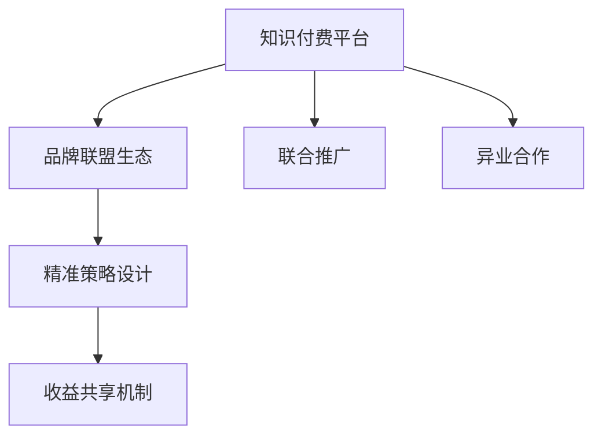

                 

## 1. 背景介绍

### 1.1 问题由来
近年来，知识付费市场迅速崛起，成为互联网行业中增速最快的部分之一。众多品牌纷纷入局，知识付费内容形式日益多样化，市场竞争愈发激烈。如何在激烈的市场竞争中脱颖而出，同时保证稳定的收益，成为每个知识付费平台亟待解决的问题。

与此同时，随着互联网行业发展，平台之间的异业合作愈发普遍。不同平台之间通过联合推广，实现优势互补，满足用户更多元的需求，提升平台的用户粘性和留存率，从而获取更大的市场份额。

### 1.2 问题核心关键点
本文聚焦于基于知识付费的品牌联合推广与异业合作策略，深入探讨如何通过合作机制，在多品牌、多平台之间建立协同效应，共同提升收益和用户价值。

核心关键点包括：
- 构建品牌联盟生态，形成资源共享、优势互补的协作网络。
- 设计多品牌联合推广的精准策略，提升品牌曝光度和市场竞争力。
- 制定异业合作的具体方案，在内容推荐、流量互通等方面实现双赢。
- 在合作中实现收益共享，保证平台长期稳定发展。

### 1.3 问题研究意义
研究知识付费平台在品牌联合推广与异业合作方面的策略，对提升知识付费平台的品牌价值、市场占有率、用户留存率和收益稳定性具有重要意义：

1. **品牌价值提升**：通过联合推广，品牌能够获得更广泛的用户认知，提升品牌知名度。
2. **市场份额扩大**：平台通过跨界合作，拓展用户群体，满足用户多样需求，获得更大的市场份额。
3. **用户粘性增强**：异业合作可以提供更加丰富的内容和服务，提高用户粘性，增加用户活跃度和留存率。
4. **收益增长稳定**：异业合作带来的品牌效应可以带来更大的用户流量，从而带来更稳定的收益。

## 2. 核心概念与联系

### 2.1 核心概念概述

本文将涉及以下核心概念：

- **知识付费平台**：提供各类付费内容的互联网平台，如得到、喜马拉雅、知乎等。
- **品牌联盟生态**：由多个品牌联合构成的协作网络，形成资源共享、优势互补的关系。
- **联合推广**：多个品牌通过协同营销，提高品牌曝光度和市场竞争力。
- **异业合作**：不同领域的品牌或平台之间进行的资源、流量互换等合作。
- **精准策略设计**：根据不同平台、不同用户群体的特点，设计有针对性的推广策略。
- **收益共享机制**：在品牌联盟中，合作双方或多方共同制定收益分配机制，实现互惠互利。

这些概念之间的逻辑关系可以通过以下Mermaid流程图来展示：



这个流程图展示了一系列核心概念的联系：

1. 知识付费平台通过构建品牌联盟生态，实现资源共享和优势互补。
2. 平台在品牌联盟中通过联合推广和异业合作，设计精准策略，提升品牌价值。
3. 在精准策略下，平台通过收益共享机制，实现互惠互利，保证平台长期稳定发展。

## 3. 核心算法原理 & 具体操作步骤
### 3.1 算法原理概述

品牌联合推广与异业合作的本质是通过多品牌、多平台之间的资源和流量交换，实现用户群体的扩大和品牌影响力的提升。其核心原理如下：

1. **用户画像分析**：通过数据挖掘技术，分析不同品牌和平台的用户画像，了解其用户群体的特点和需求。
2. **精准策略设计**：根据用户画像分析结果，设计有针对性的联合推广和异业合作策略。
3. **流量分配**：将品牌和平台的流量进行合理分配，实现双赢或多赢。
4. **收益分配**：制定公平合理的收益分配机制，确保各方利益最大化。

### 3.2 算法步骤详解

基于上述原理，品牌联合推广与异业合作的详细步骤包括：

**Step 1: 品牌和平台的选择**
- 确定参与联合推广和异业合作的品牌和平台，根据各自特点进行匹配。
- 考虑品牌和平台的行业、用户群体、市场定位等因素，找到最佳组合。

**Step 2: 用户画像分析**
- 收集各品牌和平台的用户数据，包括年龄、性别、职业、兴趣等。
- 使用数据挖掘和机器学习技术，分析用户画像，了解各品牌和平台用户的共同点和差异性。

**Step 3: 精准策略设计**
- 根据用户画像分析结果，设计联合推广的精准策略，如跨界营销、联合广告、会员权益等。
- 确定异业合作的具体方案，如内容推荐、流量互换、用户互导等。

**Step 4: 流量分配与优化**
- 根据不同品牌和平台的特点，合理分配流量，确保各方都能获得公正的曝光。
- 使用流量优化技术，如A/B测试、多臂老虎机等，不断调整策略，提升流量效果。

**Step 5: 收益分配与核算**
- 根据流量效果和实际收益，制定公平合理的收益分配机制，确保各方的利益最大化。
- 实时监控和核算各品牌的收益，保证合作过程中的透明性和公正性。

**Step 6: 效果评估与优化**
- 定期评估联合推广和异业合作的效果，包括品牌曝光度、用户增长、收益稳定等指标。
- 根据评估结果，优化推广策略和合作方案，不断提升合作效果。

### 3.3 算法优缺点

品牌联合推广与异业合作具有以下优点：

1. **提升品牌曝光度**：多个品牌联合推广，通过不同渠道的推广，提升品牌的市场覆盖和用户认知。
2. **拓宽用户群体**：通过异业合作，平台能够接触更多的用户，提升用户粘性和留存率。
3. **优化流量配置**：通过精准策略设计和流量优化，实现最优的流量配置，提升流量转化率。
4. **保证收益稳定**：通过收益共享机制，各方都能获得稳定的收益，保证平台长期发展。

同时，该方法也存在一定的局限性：

1. **匹配难度大**：选择合适的品牌和平台进行合作需要耗费大量时间和资源。
2. **数据隐私问题**：在联合推广和异业合作中，各方需要共享用户数据，存在隐私和数据安全问题。
3. **效果不确定**：推广策略和流量分配的优化需要不断的实验和调整，效果难以保证。
4. **利益分配复杂**：制定公平合理的收益分配机制需要充分的沟通和协商，难度较大。

尽管存在这些局限性，但就目前而言，品牌联合推广与异业合作仍是提升知识付费平台竞争力和收益的重要手段。未来相关研究的重点在于如何进一步降低匹配难度，提升数据安全性，优化推广效果，简化利益分配流程，从而保证合作的顺利进行和效果的最大化。

### 3.4 算法应用领域

品牌联合推广与异业合作的应用领域非常广泛，主要包括：

- **知识付费平台**：通过与其他品牌和平台合作，提升平台的品牌价值和市场竞争力。
- **教育培训行业**：教育培训机构可以与知识付费平台合作，实现内容互通、用户互导，提高课程曝光度和招生效率。
- **健康医疗行业**：健康医疗品牌可以与知识付费平台合作，提供健康知识付费课程，提升品牌影响力。
- **旅游娱乐行业**：旅游品牌可以与知识付费平台合作，提供旅游知识和攻略课程，增加用户粘性。
- **金融理财行业**：金融品牌可以与知识付费平台合作，提供理财知识课程，提升品牌认知度和市场份额。

这些领域的应用，展示了品牌联合推广与异业合作的广泛前景，未来还将拓展到更多行业，为各个领域的品牌和平台提供新的合作机会。

## 4. 数学模型和公式 & 详细讲解 & 举例说明
### 4.1 数学模型构建

品牌联合推广与异业合作的数学模型可以表述为：

假设品牌集合为 $B=\{B_1, B_2, \ldots, B_n\}$，平台集合为 $P=\{P_1, P_2, \ldots, P_m\}$。设品牌 $B_i$ 和平台 $P_j$ 的联合推广策略为 $S_{ij}$，策略带来的收益为 $R_{ij}$。则联合推广和异业合作的收益最大化模型为：

$$
\max \sum_{i=1}^{n} \sum_{j=1}^{m} \alpha_{ij} R_{ij}
$$

其中 $\alpha_{ij}$ 为策略 $S_{ij}$ 的权重，可以根据实际情况进行调整。

### 4.2 公式推导过程

对于联合推广策略 $S_{ij}$，可以采用加权平均的方式进行计算，具体公式如下：

$$
R_{ij} = \frac{1}{w_i} \sum_{k=1}^{w_i} S_{ik} R_k
$$

其中 $w_i$ 表示品牌 $B_i$ 的权重，$R_k$ 表示第 $k$ 个平台的效果，$S_{ik}$ 表示品牌 $B_i$ 和平台 $P_k$ 的合作策略。

对于异业合作策略，可以采用推荐系统的方法进行计算，通过协同过滤、矩阵分解等技术，计算品牌和平台之间的关联度，具体公式如下：

$$
R_{ij} = \phi_i \cdot \psi_j \cdot \lambda_{ij}
$$

其中 $\phi_i$ 表示品牌 $B_i$ 的特征向量，$\psi_j$ 表示平台 $P_j$ 的特征向量，$\lambda_{ij}$ 表示品牌 $B_i$ 和平台 $P_j$ 的协同度。

### 4.3 案例分析与讲解

以在线教育平台与知识付费平台为例，展示联合推广和异业合作的具体应用。

假设在线教育平台 A 和知识付费平台 B 合作，推出联合课程。平台 A 的推荐系统可以推荐平台 B 的课程给 A 的潜在用户，平台 B 可以将平台 A 的课程推荐给 B 的潜在用户。通过联合推广，两平台都能获得更多的用户流量和收益。

具体步骤如下：

1. **数据收集**：平台 A 和 B 收集各自的用户数据，包括用户的浏览、购买、互动等行为数据。
2. **用户画像分析**：使用数据挖掘技术，分析两平台用户的共同点和差异性，构建用户画像。
3. **精准策略设计**：设计联合课程的推荐策略，如共同推荐、联合广告等。
4. **流量分配**：根据用户画像分析结果，合理分配流量，确保双方都能获得公正的曝光。
5. **收益分配**：制定公平合理的收益分配机制，确保各方利益最大化。
6. **效果评估**：定期评估联合推广和异业合作的效果，包括用户增长、课程销售量、收益稳定等指标。

## 5. 项目实践：代码实例和详细解释说明
### 5.1 开发环境搭建

要进行品牌联合推广与异业合作策略的实践，需要搭建一套包含数据收集、分析、推荐、评估等功能的系统。以下是开发环境的搭建流程：

1. **选择开发语言和框架**：使用 Python 和 Flask 框架，进行 Web 应用的开发。
2. **安装相关库和工具**：安装 pandas、numpy、scikit-learn、TensorFlow 等数据处理和机器学习库。
3. **搭建数据存储和处理环境**：使用 MySQL 或 MongoDB 进行数据存储，使用 PySpark 进行大数据处理。
4. **构建推荐系统**：使用协同过滤、矩阵分解等算法，构建推荐系统，实现精准推荐。
5. **搭建数据可视化界面**：使用 D3.js 或 Tableau 等工具，实现数据可视化，方便进行效果评估和优化。

完成上述步骤后，即可进行品牌联合推广与异业合作策略的实践。

### 5.2 源代码详细实现

以下是使用 Python 和 Flask 框架进行品牌联合推广与异业合作策略实践的代码实现。

```python
from flask import Flask, request, jsonify
from pyspark.sql import SparkSession
from pyspark.ml.recommendation import ALS

app = Flask(__name__)

# 构建推荐系统
spark = SparkSession.builder.appName("brand_coeperation").getOrCreate()
rdd = spark.sparkContext.textFile("data.txt")
user_data = rdd.map(lambda x: x.split(","))
user_matrix = ALS.train(user_data, rank=100, iterations=10, regParam=0.01)
user_rated_items = user_matrix.predictAll()

# 输出推荐结果
def recommend_items(user_id):
    user_rated_items_list = user_rated_items[user_id].toArray()
    recommended_items = []
    for item in user_rated_items_list:
        item_id, prediction, _, _ = item
        if item_id in user_rated_items_list:
            recommended_items.append(item_id)
    return recommended_items

# Flask 接口
@app.route('/recommend', methods=['GET'])
def recommend():
    user_id = request.args.get('user_id')
    recommend_list = recommend_items(user_id)
    return jsonify({'items': recommend_list})

if __name__ == '__main__':
    app.run(debug=True)
```

### 5.3 代码解读与分析

以上代码实现了使用 PySpark 构建推荐系统，并使用 Flask 搭建接口进行推荐的过程。

**推荐系统代码**：
- 使用 PySpark 的 ALS 算法，对用户和物品的评分矩阵进行训练，得到用户的推荐物品列表。
- 推荐系统调用 `predictAll` 方法，预测用户对所有物品的评分，返回推荐物品列表。

**Flask 接口代码**：
- 定义 Flask 接口 `/recommend`，接收 `user_id` 参数，调用推荐系统获取推荐物品列表，并返回 JSON 格式的数据。
- 使用 `@app.route` 装饰器，定义接口路径和请求方法。

**运行结果**：
- 启动 Flask 服务器，访问 `localhost:5000/recommend?user_id=123`，即可获得用户 ID 为 123 的推荐物品列表。

## 6. 实际应用场景
### 6.1 智能客服

在线教育平台和智能客服平台可以合作，推出智能客服机器人。客服机器人可以实时解答用户问题，提供课程推荐，提升用户满意度。

具体步骤包括：
- 在线教育平台收集用户的历史行为数据，分析用户的兴趣和需求。
- 智能客服平台根据用户的历史行为数据，生成个性化推荐，并通过机器人进行回复。
- 在线教育平台和客服平台共同监控和评估效果，不断优化推荐策略和机器人对话。

### 6.2 智能理财

在线教育平台和金融平台可以合作，推出智能理财服务。通过联合推广，平台可以获取更多金融用户，增加课程销售和理财服务订阅量。

具体步骤包括：
- 在线教育平台和金融平台收集各自的用户数据，构建用户画像。
- 设计联合课程的推荐策略，如理财知识课程和理财工具的推荐。
- 金融平台提供理财产品的定制服务，在线教育平台提供理财知识课程。
- 实时监控和评估联合推广效果，不断优化推荐策略和理财服务。

### 6.3 健康管理

在线教育平台和健康平台可以合作，推出健康管理课程。通过联合推广，平台可以提升品牌知名度，增加用户粘性。

具体步骤包括：
- 在线教育平台和健康平台收集各自的用户数据，分析用户的健康需求。
- 设计健康管理课程的推荐策略，如健康饮食课程和运动指导课程。
- 健康平台提供健康监测工具，在线教育平台提供健康管理课程。
- 实时监控和评估联合推广效果，不断优化推荐策略和健康管理服务。

## 7. 工具和资源推荐
### 7.1 学习资源推荐

为了帮助开发者系统掌握品牌联合推广与异业合作的技术基础和实践技巧，这里推荐一些优质的学习资源：

1. **《数据挖掘与统计学习》（李航著）**：介绍了数据挖掘的基本概念和常用算法，适合初学者学习。
2. **《机器学习实战》（Peter Harrington著）**：提供了丰富的实战案例和代码，帮助读者理解机器学习算法的应用。
3. **Kaggle 竞赛**：提供了大量的数据集和竞赛题目，可以锻炼数据处理和算法设计能力。
4. **Coursera 和 Udacity 课程**：提供了系统化的机器学习和推荐系统课程，涵盖算法原理和实际应用。

通过这些资源的学习实践，相信你一定能够快速掌握品牌联合推广与异业合作的核心技术和方法。

### 7.2 开发工具推荐

高效的开发离不开优秀的工具支持。以下是几款用于品牌联合推广与异业合作开发的常用工具：

1. **PySpark**：用于大数据处理和机器学习算法的实现。
2. **TensorFlow**：用于构建深度学习模型的框架。
3. **Flask**：用于构建 Web 应用的框架。
4. **Jupyter Notebook**：用于数据处理和算法实现的交互式开发环境。
5. **D3.js**：用于数据可视化的库。

合理利用这些工具，可以显著提升品牌联合推广与异业合作的开发效率，加快创新迭代的步伐。

### 7.3 相关论文推荐

品牌联合推广与异业合作的研究源于学界的持续研究。以下是几篇奠基性的相关论文，推荐阅读：

1. **《The Element of AI》**：介绍了人工智能的基本概念和应用，适合初学者学习。
2. **《Deep Learning》**：由深度学习领域的专家编写，详细介绍了深度学习的基本原理和应用。
3. **《Recommender Systems》**：介绍了推荐系统的主要算法和实现方法。
4. **《Data Mining: Concepts and Techniques》**：介绍了数据挖掘的主要算法和应用。

这些论文代表了大数据与推荐系统的发展脉络。通过学习这些前沿成果，可以帮助研究者把握学科前进方向，激发更多的创新灵感。

## 8. 总结：未来发展趋势与挑战
### 8.1 总结

本文对品牌联合推广与异业合作方法进行了全面系统的介绍。首先阐述了品牌联盟生态构建、联合推广策略设计、异业合作方案制定等核心概念，明确了合作机制在多品牌、多平台之间建立协同效应的重要价值。其次，从原理到实践，详细讲解了联合推广与异业合作的数学模型和具体操作步骤，给出了完整的代码实例，方便读者快速上手。同时，本文还广泛探讨了联合推广和异业合作在多个行业领域的应用前景，展示了合作范式的巨大潜力。

通过本文的系统梳理，可以看到，品牌联合推广与异业合作技术正在成为知识付费平台和各行各业的重要手段，极大地拓展了各品牌的市场覆盖和用户群体，提高了平台的品牌价值和收益稳定性。未来，伴随品牌联盟和异业合作的持续演进，相信品牌联合推广范式将引领更多行业步入智能化、普适化的发展新阶段。

### 8.2 未来发展趋势

展望未来，品牌联合推广与异业合作技术将呈现以下几个发展趋势：

1. **多品牌生态圈的形成**：更多的品牌将加入品牌联盟，形成更加庞大和稳定的生态圈，实现资源共享、优势互补。
2. **跨界合作的深化**：品牌联合推广将从简单的流量互换、内容推荐等浅层合作，向更深入的战略合作转变，实现更广泛的用户覆盖和品牌影响力。
3. **数据隐私保护的加强**：随着数据隐私保护的法律法规不断完善，品牌联合推广将更加注重数据安全和隐私保护，确保用户数据的安全和合法使用。
4. **推荐系统的智能化**：推荐系统将更加智能和精准，通过大数据分析和机器学习算法，实现更个性化的推荐和更高效的用户转化。
5. **合作模式的创新**：品牌联合推广将探索更多的合作模式，如联合投资、联合研发等，实现多方共赢。

这些趋势凸显了品牌联合推广与异业合作技术的广阔前景。这些方向的探索发展，必将进一步提升品牌和平台的市场竞争力，为各品牌和平台带来更大的商业价值。

### 8.3 面临的挑战

尽管品牌联合推广与异业合作技术已经取得了显著成果，但在迈向更加智能化、普适化应用的过程中，它仍面临诸多挑战：

1. **匹配难度大**：选择合适的品牌和平台进行合作需要耗费大量时间和资源。
2. **数据隐私问题**：在联合推广和异业合作中，各方需要共享用户数据，存在隐私和数据安全问题。
3. **效果不确定**：推广策略和流量分配的优化需要不断的实验和调整，效果难以保证。
4. **利益分配复杂**：制定公平合理的收益分配机制需要充分的沟通和协商，难度较大。
5. **技术壁垒高**：品牌联盟和异业合作需要高水平的技术支持，对参与方提出了更高的技术要求。

尽管存在这些挑战，但就目前而言，品牌联合推广与异业合作仍是提升知识付费平台竞争力和收益的重要手段。未来相关研究的重点在于如何进一步降低匹配难度，提升数据安全性，优化推广效果，简化利益分配流程，从而保证合作的顺利进行和效果的最大化。

### 8.4 研究展望

面对品牌联合推广与异业合作所面临的挑战，未来的研究需要在以下几个方面寻求新的突破：

1. **自动化匹配算法**：通过机器学习算法，实现品牌和平台的高效匹配，降低人工介入。
2. **数据安全与隐私保护**：采用先进的加密技术和隐私保护技术，确保用户数据的安全和隐私。
3. **精准策略设计与优化**：通过更多先进的推荐算法，实现更加精准和高效的推广策略。
4. **高效收益分配机制**：设计更简单、更公平的收益分配机制，确保各方的利益最大化。
5. **多模态数据融合**：将文字、图片、视频等多种模态数据进行融合，实现更加全面的用户画像和更精准的推荐。

这些研究方向的探索，必将引领品牌联合推广与异业合作技术迈向更高的台阶，为品牌和平台带来更大的商业价值，同时也将对各行业的发展产生深远影响。面向未来，品牌联合推广与异业合作技术还需要与其他人工智能技术进行更深入的融合，如知识表示、因果推理、强化学习等，多路径协同发力，共同推动品牌和平台的发展。

## 9. 附录：常见问题与解答

**Q1：品牌联合推广与异业合作是否适用于所有品牌和平台？**

A: 品牌联合推广与异业合作主要适用于具有一定市场影响力和用户基数的品牌和平台。对于小型品牌和初创平台，可能难以达到理想的效果。

**Q2：如何选择合适的品牌和平台进行合作？**

A: 选择合适的品牌和平台需要综合考虑多方面因素，如品牌知名度、用户群体、市场定位等。可以通过数据分析和市场调研，找到最佳的合作对象。

**Q3：品牌联合推广与异业合作如何提升用户粘性和留存率？**

A: 通过精准策略设计和异业合作，品牌可以提供更加丰富和多样化的服务，满足用户更多元的需求，提升用户粘性和留存率。

**Q4：品牌联合推广与异业合作如何提升品牌曝光度？**

A: 通过联合推广和异业合作，品牌可以通过不同渠道的推广，提升品牌的市场覆盖和用户认知。

**Q5：品牌联合推广与异业合作如何保证收益稳定？**

A: 通过制定公平合理的收益分配机制，各方都能获得稳定的收益，保证品牌和平台长期发展。

---

作者：禅与计算机程序设计艺术 / Zen and the Art of Computer Programming

