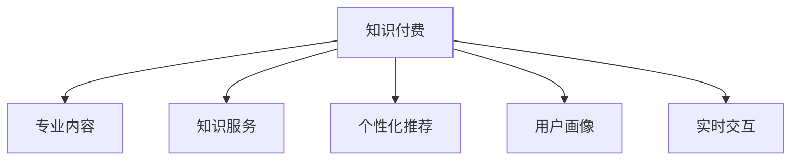

                 

# 知识付费赚钱的核心：专业内容与服务

## 1. 背景介绍

### 1.1 问题由来

随着互联网的普及，知识付费市场迅速崛起，从在线教育到专业课程，再到技能培训，各类平台如雨后春笋般涌现。然而，尽管内容丰富，但有效率、有价值的付费内容仍然稀缺。如何真正实现高质量的专业内容与服务，成为知识付费平台盈利和发展的核心问题。

### 1.2 问题核心关键点

知识付费的核心在于将专业内容有效转化为有价值的知识服务，这涉及内容的精准性、适用性、可理解性等多个方面。传统的一对多教学模式难以实现个性化、实时化的服务，无法有效解决学员的学习需求和痛点。因此，必须探索更高效、更个性化的内容和服务提供方式，才能真正吸引用户、满足需求、实现盈利。

## 2. 核心概念与联系

### 2.1 核心概念概述

为更好地理解如何实现知识付费的盈利，本节将介绍几个密切相关的核心概念：

- **知识付费**：指通过互联网平台为用户提供专业化、系统化、结构化的知识内容，并通过收费形式实现盈利。
- **专业内容**：指在特定领域内，经过深入研究和实践积累形成的，具有独特视角和深入见解的内容。
- **知识服务**：指将专业内容转化为用户可操作、可执行的知识服务，如在线咨询、个性化辅导、技能培训等。
- **个性化推荐**：指根据用户的历史行为和兴趣偏好，推荐适合其需求的内容和服务。
- **用户画像**：指通过数据分析，构建的描述用户特征的模型，用于优化推荐效果。
- **实时交互**：指通过在线互动形式，实现内容与用户的实时沟通和反馈，提升学习体验。

这些核心概念之间的逻辑关系可以通过以下Mermaid流程图来展示：



这个流程图展示的知识付费的核心概念及其之间的关系：

1. 知识付费以专业内容为基石，通过知识服务实现其商业价值。
2. 个性化推荐和用户画像技术优化服务质量，提升用户体验。
3. 实时交互使得内容与服务更贴合用户需求，提高互动性。

## 3. 核心算法原理 & 具体操作步骤

### 3.1 算法原理概述

知识付费的盈利主要依赖于专业内容的优质和服务的精准。其核心算法原理包括：

- **内容推荐算法**：根据用户的历史行为和兴趣，推荐适合其需求的内容。常见的算法包括协同过滤、内容基于过滤、矩阵分解等。
- **用户画像模型**：通过用户的行为数据，构建详细的用户画像，以便更准确地进行内容推荐和个性化服务。
- **实时交互技术**：使用即时通讯工具、在线课堂等技术，实现内容与服务和用户之间的实时沟通，提升用户体验。

### 3.2 算法步骤详解

知识付费的盈利算法主要分为以下几个关键步骤：

**Step 1: 数据采集与清洗**
- 收集用户的历史行为数据，包括浏览记录、学习记录、付费记录等。
- 对数据进行清洗，去除噪声和异常值，保证数据质量。

**Step 2: 用户画像构建**
- 使用聚类算法或因子分析方法，对用户行为数据进行降维，构建用户画像。
- 根据用户画像特征，定义用户标签，如兴趣领域、专业技能、学习进度等。

**Step 3: 内容推荐算法设计**
- 选择推荐算法模型，如协同过滤、矩阵分解等，设计推荐系统。
- 训练模型，评估其准确率和召回率等指标。

**Step 4: 实时交互平台搭建**
- 搭建在线课堂、即时通讯工具等实时交互平台，支持用户与内容之间的互动。
- 实现交互平台的个性化和自适应功能，满足不同用户的学习需求。

**Step 5: 盈利模式设计**
- 设计多样化的盈利模式，如课程订阅、单次付费、会员制等。
- 根据用户画像和内容特点，进行差异化定价，实现最大利润。

**Step 6: 效果评估与优化**
- 对推荐系统效果进行定期评估，使用A/B测试等方法进行优化。
- 根据用户反馈和行为数据，不断调整推荐算法和定价策略。

以上是知识付费盈利算法的通用流程。在实际应用中，还需要针对具体平台和用户需求，对各环节进行优化设计，如改进推荐算法、引入多模态数据等。

### 3.3 算法优缺点

知识付费的算法盈利具有以下优点：

- 提升用户体验：通过个性化推荐和实时交互，满足用户的学习需求，提升学习效果和满意度。
- 提高内容价值：推荐精准的内容，增加用户粘性，提升内容订阅率和复购率。
- 优化资源利用：通过用户画像模型，实现资源的有效配置和优化，提高服务质量。

同时，该算法也存在以下局限性：

- 数据隐私问题：用户的各类行为数据需要收集和存储，如何保障数据安全和隐私保护是一大挑战。
- 推荐算法复杂度：个性化推荐算法设计复杂，需要大量的数据和计算资源。
- 实时交互成本高：在线课堂和即时通讯工具等实时交互平台，需要高昂的硬件和维护成本。

尽管存在这些局限性，但就目前而言，知识付费的算法盈利方法仍是大规模商业化应用的主流范式。未来相关研究的重点在于如何进一步降低数据隐私风险，提高推荐算法效率，优化实时交互平台设计，同时兼顾用户体验和盈利目标。

### 3.4 算法应用领域

知识付费的算法盈利方法已经广泛应用于在线教育、职业培训、企业内训等多个领域，具体包括：

- **在线教育平台**：如Coursera、Udemy等，通过推荐系统将高质量课程推送给用户，提升学习效果和平台收入。
- **职业培训市场**：如LinkedIn Learning、skillshare等，为用户提供个性化职业发展课程，增加培训订阅率。
- **企业内训体系**：如企业大学、在线学习平台，通过推荐系统进行岗位培训和技能提升，满足企业人才需求。

除了上述这些经典应用外，知识付费的算法盈利范式还将在更多领域得到推广，如健康管理、技能认证、科普教育等，为知识传播和应用开辟新的空间。

## 4. 数学模型和公式 & 详细讲解 & 举例说明

### 4.1 数学模型构建

本节将使用数学语言对知识付费算法盈利过程进行更加严格的刻画。

记用户集为 $U$，内容集为 $I$。用户和内容之间的交互关系可以表示为二元关系 $R \subset U \times I$。记 $R$ 中的元素为 $(r,u,i)$，其中 $r$ 表示用户行为，$u$ 表示用户，$i$ 表示内容。

定义用户画像特征向量 $\mathbf{p}_u$，内容特征向量 $\mathbf{q}_i$。用户在内容上的行为向量为 $\mathbf{r}_{ui}$。推荐系统通过相似度度量，计算用户和内容之间的相似度 $s_{ui}$。推荐结果 $\mathbf{R}_{ui}$ 可通过以下公式计算：

$$
\mathbf{R}_{ui} = s_{ui} \cdot \mathbf{q}_i
$$

在实际应用中，通常使用协同过滤、矩阵分解等方法构建推荐系统，优化推荐效果。

### 4.2 公式推导过程

以协同过滤算法为例，推导推荐结果的计算公式。

假设用户 $u$ 对内容集 $I$ 的评分矩阵为 $M_{ui}$，用户画像特征向量为 $\mathbf{p}_u$，内容特征向量为 $\mathbf{q}_i$。协同过滤算法基于用户之间的相似度 $s_{ui}$，计算推荐结果。

$$
\mathbf{R}_{ui} = \sum_{v \in N(u)} s_{uv} \cdot M_{vi}
$$

其中 $N(u)$ 表示与用户 $u$ 相似的用户集合。在实际应用中，可以通过余弦相似度、皮尔逊相关系数等方法计算用户之间的相似度。

### 4.3 案例分析与讲解

**案例：在线教育平台的个性化推荐系统**

某在线教育平台有10万名用户，提供1000门课程。用户通过平台浏览课程、观看视频、完成作业等行为，与课程产生交互。平台通过数据分析，构建用户画像特征向量 $\mathbf{p}_u$，课程特征向量 $\mathbf{q}_i$，用户和课程之间的行为向量 $\mathbf{r}_{ui}$。

假设用户 $u$ 对课程 $i$ 的评分矩阵为 $M_{ui}$，使用协同过滤算法进行推荐，计算推荐结果 $\mathbf{R}_{ui}$。根据用户行为和相似度计算，推荐系统能够精准推荐适合用户学习需求的课程，提升用户满意度和平台收入。

## 5. 项目实践：代码实例和详细解释说明

### 5.1 开发环境搭建

在进行知识付费盈利算法开发前，我们需要准备好开发环境。以下是使用Python进行TensorFlow开发的环境配置流程：

1. 安装Anaconda：从官网下载并安装Anaconda，用于创建独立的Python环境。

2. 创建并激活虚拟环境：
```bash
conda create -n tf-env python=3.8 
conda activate tf-env
```

3. 安装TensorFlow：根据CUDA版本，从官网获取对应的安装命令。例如：
```bash
conda install tensorflow tensorflow-gpu
```

4. 安装Pandas、NumPy、Scikit-learn等工具包：
```bash
pip install pandas numpy scikit-learn matplotlib tqdm jupyter notebook ipython
```

完成上述步骤后，即可在`tf-env`环境中开始知识付费盈利算法的实践。

### 5.2 源代码详细实现

下面我们以在线教育平台的个性化推荐系统为例，给出使用TensorFlow和Keras实现协同过滤推荐算法的PyTorch代码实现。

首先，定义协同过滤推荐系统的基本架构：

```python
import tensorflow as tf
from tensorflow.keras.layers import Embedding, DotProduct
from tensorflow.keras.models import Model

class RecommendationSystem(tf.keras.Model):
    def __init__(self, num_users, num_contents, embedding_dim=128, num_factors=20):
        super().__init__()
        self.user_embedding = Embedding(input_dim=num_users, output_dim=embedding_dim, name='user_embedding')
        self.item_embedding = Embedding(input_dim=num_contents, output_dim=embedding_dim, name='item_embedding')
        self.similarity = DotProduct(name='similarity')
        self.predictions = tf.keras.layers.Dense(num_contents, activation='softmax', name='predictions')
        
    def call(self, user, item):
        user_emb = self.user_embedding(user)
        item_emb = self.item_embedding(item)
        similarity = self.similarity([user_emb, item_emb])
        predictions = self.predictions(similarity)
        return predictions
```

然后，实现推荐系统的前向传播和训练过程：

```python
def train_model(model, data, epochs=10, batch_size=32):
    model.compile(optimizer='adam', loss='categorical_crossentropy', metrics=['accuracy'])
    model.fit(data, epochs=epochs, batch_size=batch_size)
    
def test_model(model, data):
    test_loss, test_acc = model.evaluate(data)
    print(f'Test loss: {test_loss:.4f}')
    print(f'Test accuracy: {test_acc:.4f}')
```

最后，启动推荐系统的训练流程并在测试集上评估：

```python
user_ids = [1, 2, 3, 4, 5]  # 假设有5个用户
item_ids = [6, 7, 8, 9, 10]  # 假设有5门课程
num_users = len(user_ids)
num_contents = len(item_ids)

# 假设评分矩阵为
rating_matrix = tf.constant([[4.0, 3.0, 5.0, 2.0, 0.0],
                             [0.0, 5.0, 2.0, 4.0, 3.0],
                             [2.0, 1.0, 0.0, 3.0, 5.0],
                             [3.0, 0.0, 1.0, 5.0, 2.0],
                             [0.0, 4.0, 2.0, 3.0, 1.0]])

# 训练模型
model = RecommendationSystem(num_users, num_contents)
train_model(model, rating_matrix, epochs=10, batch_size=32)

# 测试模型
test_model(model, rating_matrix)
```

以上就是使用TensorFlow实现协同过滤推荐算法的完整代码实现。可以看到，得益于TensorFlow的强大封装，我们可以用相对简洁的代码完成协同过滤推荐算法的构建和训练。

### 5.3 代码解读与分析

让我们再详细解读一下关键代码的实现细节：

**RecommendationSystem类**：
- `__init__`方法：初始化用户和内容的嵌入层、相似度计算层和预测层。
- `call`方法：实现前向传播过程，计算相似度和预测结果。

**train_model和test_model函数**：
- 使用TensorFlow的compile和fit方法进行模型训练，使用evaluate方法进行模型评估。
- 在训练和测试过程中，分别指定损失函数、优化器和评估指标。

**训练流程**：
- 定义用户和课程的ID列表，计算评分矩阵。
- 构建协同过滤推荐模型，指定训练轮数和批大小。
- 调用train_model函数训练模型，输出训练损失和测试准确率。

可以看到，TensorFlow配合Keras使得协同过滤推荐算法的代码实现变得简洁高效。开发者可以将更多精力放在数据处理、模型改进等高层逻辑上，而不必过多关注底层的实现细节。

当然，工业级的系统实现还需考虑更多因素，如模型的保存和部署、超参数的自动搜索、更灵活的推荐逻辑等。但核心的推荐范式基本与此类似。

## 6. 实际应用场景

### 6.1 在线教育平台

在线教育平台利用协同过滤、矩阵分解等推荐算法，能够根据用户的历史行为和兴趣，推荐适合其学习需求的课程。通过个性化推荐，提升学习效果和平台收入。

在技术实现上，可以收集用户浏览、观看视频、完成作业等行为数据，构建用户画像特征向量 $\mathbf{p}_u$ 和内容特征向量 $\mathbf{q}_i$，使用协同过滤算法进行推荐。推荐系统能够精准推荐适合用户学习需求的课程，增加用户粘性和平台收入。

### 6.2 职业培训市场

职业培训市场通过推荐系统，能够为用户推荐适合其职业发展的课程。通过个性化推荐，提升培训效果和用户满意度。

在技术实现上，可以收集用户的技能掌握情况、职业背景、学习进度等数据，构建用户画像特征向量 $\mathbf{p}_u$ 和课程特征向量 $\mathbf{q}_i$，使用协同过滤算法进行推荐。推荐系统能够精准推荐适合用户职业发展的课程，增加培训订阅率和复购率。

### 6.3 企业内训体系

企业内训体系通过推荐系统，能够根据员工的岗位需求和学习进度，推荐适合的培训课程。通过个性化推荐，提升员工技能和培训效果。

在技术实现上，可以收集员工的岗位需求、技能掌握情况、学习进度等数据，构建用户画像特征向量 $\mathbf{p}_u$ 和课程特征向量 $\mathbf{q}_i$，使用协同过滤算法进行推荐。推荐系统能够精准推荐适合员工岗位需求的培训课程，提升员工技能和培训效果。

### 6.4 未来应用展望

随着推荐算法的不断发展，知识付费平台的盈利模式将不断拓展，带来更多创新的应用场景：

1. **多模态推荐**：融合视觉、语音等多模态数据，提升推荐精准度。
2. **实时动态推荐**：根据用户实时行为数据，进行动态调整，提升推荐时效性。
3. **跨领域推荐**：实现不同领域内容的融合推荐，增加平台的多样性。
4. **交互式推荐**：通过在线互动形式，提升推荐系统的互动性和用户体验。
5. **情感计算**：利用情感分析技术，优化推荐策略，提升推荐效果。

这些应用场景的探索，将进一步丰富知识付费平台的盈利模式，拓展其市场空间。

## 7. 工具和资源推荐

### 7.1 学习资源推荐

为了帮助开发者系统掌握知识付费算法盈利的基础和实践技巧，这里推荐一些优质的学习资源：

1. 《推荐系统：理论、算法与应用》系列博文：由推荐系统专家撰写，深入浅出地介绍了推荐系统的原理、算法和应用。

2. CS387《推荐系统》课程：斯坦福大学开设的推荐系统经典课程，有Lecture视频和配套作业，带你入门推荐系统的基本概念和经典算法。

3. 《Deep Learning for Recommendation Systems》书籍：深度学习领域的推荐系统经典书籍，全面介绍了深度学习在推荐系统中的应用。

4. Weights & Biases：模型训练的实验跟踪工具，可以记录和可视化模型训练过程中的各项指标，方便对比和调优。与主流深度学习框架无缝集成。

5. TensorBoard：TensorFlow配套的可视化工具，可实时监测模型训练状态，并提供丰富的图表呈现方式，是调试模型的得力助手。

通过对这些资源的学习实践，相信你一定能够快速掌握知识付费算法的精髓，并用于解决实际的推荐问题。

### 7.2 开发工具推荐

高效的开发离不开优秀的工具支持。以下是几款用于知识付费推荐算法开发的常用工具：

1. TensorFlow：由Google主导开发的开源深度学习框架，生产部署方便，适合大规模工程应用。提供丰富的推荐系统组件和工具库。

2. PyTorch：基于Python的开源深度学习框架，灵活动态的计算图，适合快速迭代研究。TensorFlow库提供大量预训练模型，可以快速构建推荐系统。

3. Keras：提供高层API，简化深度学习模型的搭建和训练过程，适合快速原型开发和模型实验。

4. Weights & Biases：模型训练的实验跟踪工具，可以记录和可视化模型训练过程中的各项指标，方便对比和调优。与主流深度学习框架无缝集成。

5. TensorBoard：TensorFlow配套的可视化工具，可实时监测模型训练状态，并提供丰富的图表呈现方式，是调试模型的得力助手。

合理利用这些工具，可以显著提升知识付费推荐算法的开发效率，加快创新迭代的步伐。

### 7.3 相关论文推荐

知识付费推荐算法的研究源于学界的持续研究。以下是几篇奠基性的相关论文，推荐阅读：

1. Factorization Machines for Recommender Systems（FM论文）：提出FM模型，在协同过滤推荐算法中引入矩阵分解，提升推荐效果。

2. Multi-Task Learning for Personalized Recommendation（MMT论文）：提出多任务学习框架，通过多个任务共享参数，提升推荐效果和鲁棒性。

3. Deep Neural Networks for Multi-Task Learning（DMT论文）：提出深度神经网络，用于协同过滤推荐算法，提升推荐效果和特征表示能力。

4. BPR: Bayesian Personalized Ranking from Implicit Feedback（BPR论文）：提出BPR算法，通过优化损失函数，提升推荐效果和鲁棒性。

5. Wide & Deep Collaborative Filtering（W&D论文）：提出Wide & Deep框架，结合线性模型和深度模型，提升推荐效果和鲁棒性。

这些论文代表了大数据推荐算法的最新进展，通过学习这些前沿成果，可以帮助研究者把握学科前进方向，激发更多的创新灵感。

## 8. 总结：未来发展趋势与挑战

### 8.1 总结

本文对知识付费算法的盈利原理进行了全面系统的介绍。首先阐述了知识付费的核心在于将专业内容转化为优质服务，并详细讲解了个性化推荐算法的数学原理和关键步骤，给出了推荐任务开发的完整代码实例。同时，本文还广泛探讨了推荐算法在在线教育、职业培训、企业内训等多个领域的应用前景，展示了知识付费算法的巨大潜力。此外，本文精选了推荐算法的各类学习资源，力求为读者提供全方位的技术指引。

通过本文的系统梳理，可以看到，知识付费的算法盈利方法正在成为大数据应用的重要范式，极大地拓展了数据驱动型业务的盈利模式。得益于个性化推荐算法和大数据技术，知识付费平台能够更好地满足用户需求，提升用户体验和平台收入。未来，伴随推荐算法的不断演进，知识付费平台将拥有更多创新的盈利手段，开启全新的商业模式。

### 8.2 未来发展趋势

展望未来，知识付费的推荐算法将呈现以下几个发展趋势：

1. **多模态融合**：融合视觉、语音等多模态数据，提升推荐精准度。
2. **实时动态推荐**：根据用户实时行为数据，进行动态调整，提升推荐时效性。
3. **跨领域推荐**：实现不同领域内容的融合推荐，增加平台的多样性。
4. **交互式推荐**：通过在线互动形式，提升推荐系统的互动性和用户体验。
5. **情感计算**：利用情感分析技术，优化推荐策略，提升推荐效果。
6. **集成学习**：融合多种推荐算法，提升推荐效果和鲁棒性。

这些趋势凸显了知识付费推荐算法的广阔前景。这些方向的探索发展，将进一步提升推荐系统的精度和时效性，为知识付费平台带来更高的商业价值。

### 8.3 面临的挑战

尽管知识付费的推荐算法已经取得了瞩目成就，但在迈向更加智能化、普适化应用的过程中，它仍面临着诸多挑战：

1. **数据隐私问题**：用户的各类行为数据需要收集和存储，如何保障数据安全和隐私保护是一大挑战。
2. **推荐算法复杂度**：个性化推荐算法设计复杂，需要大量的数据和计算资源。
3. **实时交互成本高**：在线课堂和即时通讯工具等实时交互平台，需要高昂的硬件和维护成本。
4. **推荐效果波动**：推荐系统面临的冷启动问题，即新用户或新内容的推荐效果不佳。

尽管存在这些局限性，但就目前而言，知识付费的推荐算法盈利方法仍是大规模商业化应用的主流范式。未来相关研究的重点在于如何进一步降低数据隐私风险，提高推荐算法效率，优化实时交互平台设计，同时兼顾用户体验和盈利目标。

### 8.4 研究展望

面对知识付费推荐算法所面临的种种挑战，未来的研究需要在以下几个方面寻求新的突破：

1. **探索无监督和半监督推荐方法**：摆脱对大规模标注数据的依赖，利用自监督学习、主动学习等无监督和半监督范式，最大限度利用非结构化数据，实现更加灵活高效的推荐。
2. **研究参数高效和计算高效的推荐范式**：开发更加参数高效的推荐方法，在固定大部分预训练参数的同时，只更新极少量的任务相关参数。同时优化推荐模型的计算图，减少前向传播和反向传播的资源消耗，实现更加轻量级、实时性的部署。
3. **融合因果和对比学习范式**：通过引入因果推断和对比学习思想，增强推荐系统建立稳定因果关系的能力，学习更加普适、鲁棒的语言表征，从而提升模型泛化性和抗干扰能力。
4. **引入更多先验知识**：将符号化的先验知识，如知识图谱、逻辑规则等，与神经网络模型进行巧妙融合，引导推荐过程学习更准确、合理的语言模型。同时加强不同模态数据的整合，实现视觉、语音等多模态信息与文本信息的协同建模。
5. **结合因果分析和博弈论工具**：将因果分析方法引入推荐系统，识别出推荐过程的关键特征，增强输出解释的因果性和逻辑性。借助博弈论工具刻画人机交互过程，主动探索并规避推荐系统的脆弱点，提高系统稳定性。
6. **纳入伦理道德约束**：在推荐算法设计中引入伦理导向的评估指标，过滤和惩罚有害的输出倾向。同时加强人工干预和审核，建立推荐系统的监管机制，确保推荐结果符合人类价值观和伦理道德。

这些研究方向的探索，将引领知识付费推荐算法走向更高的台阶，为构建智能推荐系统提供新的技术路径。

## 9. 附录：常见问题与解答

**Q1：知识付费推荐算法如何处理新用户或新内容？**

A: 知识付费推荐算法面临冷启动问题，即新用户或新内容的推荐效果不佳。为解决这一问题，通常采用以下方法：

1. **基于物品的协同过滤**：仅使用物品之间的相似度进行推荐，不依赖用户历史行为，适用于新用户。
2. **基于内容的协同过滤**：仅使用物品特征进行推荐，不依赖用户历史行为，适用于新物品。
3. **混合推荐**：结合基于用户和物品的协同过滤，提升推荐效果。
4. **基于模型的推荐**：使用深度学习模型，通过学习物品特征和用户特征，进行推荐。

这些方法可以结合使用，根据具体场景选择最适合的推荐策略。

**Q2：知识付费推荐算法如何优化推荐效果？**

A: 优化推荐效果需要从多个方面入手，以下是一些常见的优化策略：

1. **数据增强**：通过数据增强技术，丰富训练数据集，提升模型的泛化能力。
2. **模型集成**：结合多种推荐算法，提升推荐效果和鲁棒性。
3. **参数优化**：通过超参数调优和正则化技术，提升模型的稳定性和泛化能力。
4. **实时调整**：根据用户实时行为数据，动态调整推荐策略，提升推荐效果。
5. **用户反馈**：通过用户反馈数据，优化推荐策略，提升用户满意度。

这些策略可以结合使用，根据具体场景选择最适合的优化方案。

**Q3：知识付费推荐算法如何保障用户隐私？**

A: 保障用户隐私是推荐系统设计中的重要问题。以下是一些常见的隐私保护策略：

1. **差分隐私**：通过加入噪声，保护用户数据隐私。
2. **联邦学习**：在本地设备上训练模型，不传输用户数据，保护用户隐私。
3. **匿名化处理**：对用户数据进行匿名化处理，保护用户隐私。
4. **数据加密**：对用户数据进行加密处理，保护用户隐私。

这些策略可以结合使用，根据具体场景选择最适合的隐私保护方案。

**Q4：知识付费推荐算法如何处理数据不平衡问题？**

A: 数据不平衡问题指推荐系统中的部分物品或用户，数据量较少，导致推荐效果不佳。为解决这一问题，通常采用以下方法：

1. **过采样**：对数据量较少的物品或用户进行过采样，增加其数据量。
2. **欠采样**：对数据量较多的物品或用户进行欠采样，平衡数据分布。
3. **加权损失函数**：对数据量较少的物品或用户，增加损失函数的权重，提升其推荐效果。
4. **异常检测**：通过异常检测技术，识别数据不平衡的部分，进行特殊处理。

这些方法可以结合使用，根据具体场景选择最适合的处理方案。

---

作者：禅与计算机程序设计艺术 / Zen and the Art of Computer Programming

