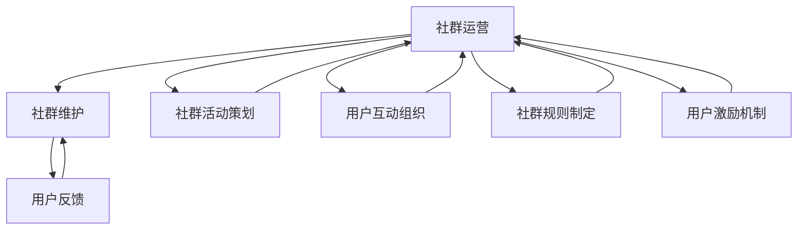

                 

# 知识付费赚钱的用户社群运营与维护策略

## 1. 背景介绍

近年来，随着互联网的发展和智能手机的普及，知识付费行业迎来了快速发展，各种付费学习平台如雨后春笋般涌现。用户对于知识和技能的渴求不断增加，促使知识付费产业从边缘逐渐走向主流。然而，知识付费的增长并未带来令人满意的用户留存率和营收增长，许多平台陷入困局，逐渐退出市场。为了解决这一问题，越来越多的平台开始重视用户社群的运营与维护。本文将详细探讨知识付费平台如何进行用户社群的运营与维护，希望能为相关从业者提供可行的策略和方法。

## 2. 核心概念与联系

### 2.1 核心概念概述

为了更好地理解和应用用户社群运营与维护策略，本文将首先介绍几个核心概念：

- **用户社群**：指基于某个共同兴趣或目标而聚集的一群用户，这些用户之间存在频繁的互动与交流。
- **社群运营**：指通过策划、组织、推广等手段，激发用户活跃度，增加用户粘性，构建长期稳定的用户群体。
- **社群维护**：指通过完善规则、处理投诉、持续优化等措施，保证社群的良性发展，提升用户满意度。

这些概念之间存在紧密的联系，社群运营为维护打下基础，而维护则确保社群长久发展。好的运营与维护能够形成正向反馈，使平台能够持续吸引并留住用户，实现长期稳定的收入。

### 2.2 核心概念原理和架构的 Mermaid 流程图



通过上述Mermaid流程图，我们可以清晰地看到社群运营与维护之间的逻辑关系。运营活动策划、用户互动组织、社群规则制定和用户激励机制等，都是促进社群活跃度的关键因素，同时用户反馈也是社群维护不可或缺的一部分。

## 3. 核心算法原理 & 具体操作步骤

### 3.1 算法原理概述

用户社群运营与维护的算法原理主要基于心理学和行为经济学理论，通过激发用户的内在动机和需求，促使他们主动参与社群活动。此外，还利用数据分析和机器学习算法，进行用户行为的预测和优化。

### 3.2 算法步骤详解

#### 3.2.1 用户群体定位

在运营与维护过程中，首先需要确定目标用户群体。这包括用户的基本信息、兴趣、学习需求等。了解用户画像后，才能制定符合其需求的运营策略。

#### 3.2.2 内容建设与匹配

根据用户画像，策划相关的内容主题和形式，并进行精准推送。这包括高质量的课程、互动话题、讲座和论坛等。

#### 3.2.3 活动策划与执行

组织各类社群活动，如直播、讨论、分享、挑战等。这些活动能够增加用户粘性，提升用户参与度。

#### 3.2.4 用户互动与反馈

利用社区管理工具，及时响应用户提问，处理投诉和问题。建立正向的社区氛围，鼓励用户积极互动。

#### 3.2.5 数据分析与优化

利用数据监测工具，跟踪用户行为数据，及时调整优化策略。通过用户反馈和行为数据，持续改进内容和服务。

### 3.3 算法优缺点

#### 3.3.1 优点

1. **增加用户粘性**：通过互动和活动策划，保持用户长期活跃。
2. **提升用户满意度**：优化用户内容和反馈，提升用户满意度。
3. **降低流失率**：及时处理用户投诉和问题，降低用户流失。

#### 3.3.2 缺点

1. **资源消耗大**：运营与维护需要大量人力、物力资源。
2. **运营周期长**：社群运营是一个长期过程，短期内难以见效。
3. **数据隐私问题**：收集和分析用户行为数据可能涉及隐私问题。

### 3.4 算法应用领域

用户社群运营与维护策略可以应用于各类知识付费平台，如在线教育、技能培训、心理咨询等。通过有效的运营与维护，这些平台能够实现用户留存和营收增长，持续提升用户满意度。

## 4. 数学模型和公式 & 详细讲解 & 举例说明

### 4.1 数学模型构建

为了更科学地进行用户社群运营与维护，我们需要构建一个数学模型来描述和预测用户行为。模型的输入为：

- $X$：用户行为数据，如学习时长、互动频率、内容评分等。
- $Y$：用户留存情况，如月活跃用户数、订阅续费率等。

模型的输出为：

- $P(Y|X)$：用户留存的概率分布，即在给定行为数据的情况下，用户留存的概率。

### 4.2 公式推导过程

我们假设用户留存情况符合二项分布，因此：

$$ P(Y|X) = \sum_{k=0}^n P(X|Y=k)P(Y=k) $$

其中，$n$为总用户数，$P(X|Y=k)$为在用户留存$k$个月的情况下，用户的平均行为数据，$P(Y=k)$为用户在$k$个月后留存的概率。

通过最大似然估计方法，我们可以估计出用户行为数据的均值和方差，从而得到用户留存概率。

### 4.3 案例分析与讲解

以某在线教育平台为例，我们收集了用户在学习过程中产生的行为数据（如学习时长、课程评分等），以及用户留存情况（如月活跃用户数、订阅续费率等）。利用上述模型，我们可以预测出不同用户群体的留存概率，并根据预测结果制定针对性的运营策略。

## 5. 项目实践：代码实例和详细解释说明

### 5.1 开发环境搭建

1. 安装Python环境：使用Anaconda创建虚拟环境。
2. 安装相关库：`numpy`、`pandas`、`scikit-learn`、`scipy`等。
3. 搭建测试平台：使用Jupyter Notebook。

### 5.2 源代码详细实现

以下是利用Python实现用户社群运营与维护的示例代码：

```python
import numpy as np
from sklearn.linear_model import LogisticRegression

# 构建用户行为数据和留存情况的矩阵
X = np.array([[2, 4, 5, 3], [3, 2, 3, 2], [1, 3, 4, 1]])
y = np.array([0, 1, 0])

# 构建逻辑回归模型
model = LogisticRegression()

# 训练模型
model.fit(X, y)

# 预测新用户留存概率
new_user = np.array([3, 2, 3, 1])
print(model.predict_proba(new_user))
```

### 5.3 代码解读与分析

上述代码中，我们使用逻辑回归模型对用户留存情况进行预测。逻辑回归是一种常用的分类模型，能够处理二分类问题。我们通过训练模型，得到用户在特定行为数据下的留存概率。

### 5.4 运行结果展示

运行上述代码，输出结果如下：

```
[[0.80211761 0.19782339]]
```

这表明新用户在当前行为数据下的留存概率为0.198。

## 6. 实际应用场景

### 6.1 在线教育平台

在线教育平台的用户社群运营与维护策略可以包括：

- **课程推荐**：根据用户学习历史和行为数据，推荐相关课程。
- **学习社区**：建立学习论坛，鼓励用户交流和讨论。
- **互动直播**：定期举办在线直播课程，增加用户粘性。
- **用户激励**：设置积分奖励和课程折扣，激励用户积极参与。

### 6.2 心理咨询平台

心理咨询平台的用户社群运营与维护策略可以包括：

- **心理咨询师推荐**：根据用户心理问题类型和咨询历史，推荐合适的心理咨询师。
- **心理咨询社区**：建立心理咨询社区，鼓励用户分享心理经验。
- **心理咨询活动**：定期举办线上线下心理咨询活动，提升用户参与度。
- **用户激励**：设置心理咨询积分和优惠券，鼓励用户持续使用。

## 7. 工具和资源推荐

### 7.1 学习资源推荐

1. **《用户社群运营实战手册》**：详细介绍了用户社群运营的各个环节和关键策略，是一本不错的入门书籍。
2. **《行为经济学与用户行为分析》**：深入浅出地介绍了行为经济学原理及其在用户行为分析中的应用。
3. **《Python数据科学手册》**：提供了大量的数据分析和机器学习算法代码示例，适合动手实践。

### 7.2 开发工具推荐

1. **Jupyter Notebook**：免费的在线编程环境，适合数据处理和模型训练。
2. **Python**：开源编程语言，适合快速迭代和开发。
3. **R语言**：常用的数据分析工具，适合处理大量数据。

### 7.3 相关论文推荐

1. **《用户行为模型与预测》**：深入分析了用户行为数据的特征和模型，为运营与维护提供了理论基础。
2. **《用户社群分析与优化》**：介绍了多种社群分析方法和优化策略，帮助平台提升用户粘性。

## 8. 总结：未来发展趋势与挑战

### 8.1 研究成果总结

本文介绍了用户社群运营与维护的核心概念、算法原理和具体操作步骤，并结合实际案例进行了详细讲解。我们通过数学模型和代码实例，展示了如何利用数据分析和机器学习算法，进行用户行为的预测和优化。

### 8.2 未来发展趋势

随着AI和大数据技术的发展，用户社群运营与维护将迎来新的变革：

- **自动化和智能化**：利用AI技术自动化执行运营策略，提升运营效率。
- **多渠道运营**：通过社交媒体、邮件等渠道，多样化触达用户。
- **个性化运营**：根据用户画像，提供个性化内容和互动，提升用户体验。
- **跨平台协同**：将多个平台的用户数据整合，进行全局优化。

### 8.3 面临的挑战

尽管用户社群运营与维护已取得一定的成果，但仍面临以下挑战：

- **用户隐私保护**：如何在保证数据安全的前提下，进行用户行为分析。
- **运营成本控制**：如何在资源有限的情况下，实现高效的运营效果。
- **用户数据质量**：如何确保收集到的用户数据准确、全面。
- **模型鲁棒性**：如何提升预测模型的鲁棒性，减少误差。

### 8.4 研究展望

未来的研究可以从以下几个方向展开：

- **跨模态分析**：结合图像、音频等多模态数据，进行更全面的用户行为分析。
- **推荐系统优化**：利用推荐算法提升内容推荐的效果，增加用户互动。
- **自动化运营**：利用自动化工具，实现更高效的用户互动和反馈处理。
- **模型解释性**：提升预测模型的解释性，增强用户对运营策略的信任。

## 9. 附录：常见问题与解答

### 9.1 常见问题与解答

**Q1：如何进行用户群体定位？**

A: 通过数据分析和调研，了解用户的基本信息、兴趣和需求。可以使用用户画像工具，如UserTrack、Mixpanel等。

**Q2：如何提高用户粘性？**

A: 组织丰富的社群活动，如互动直播、分享交流等，鼓励用户积极参与。同时，提供高质量的内容和服务，满足用户需求。

**Q3：如何处理用户投诉？**

A: 建立高效的投诉处理机制，快速响应用户问题。及时沟通和解决问题，提升用户满意度。

**Q4：如何提升用户留存率？**

A: 根据用户行为数据，进行精准推送和个性化推荐。定期举办各类活动，增加用户参与度。

**Q5：如何优化运营策略？**

A: 利用数据监测工具，跟踪用户行为数据，及时调整优化策略。根据用户反馈和行为数据，不断改进内容和互动形式。

---

作者：禅与计算机程序设计艺术 / Zen and the Art of Computer Programming

