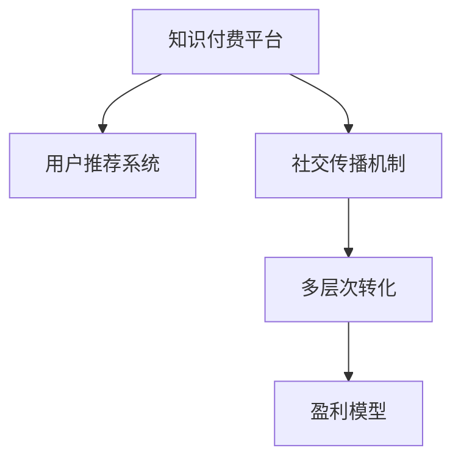

                 

# 知识付费赚钱的用户裂变与社交传播策略

> 关键词：知识付费,用户裂变,社交传播,盈利模型,内容推荐,用户留存

## 1. 背景介绍

### 1.1 问题由来
近年来，随着互联网信息爆炸和知识经济的兴起，知识付费领域迅速发展。无论是各领域的专家、学者，还是内容创作者，都纷纷尝试通过知识付费来变现，实现个人价值。然而，单纯的知识付费难以带来持续的收入流，盈利模式单一，许多平台因用户体验不佳、用户流失率高而难以生存。

为解决这一问题，越来越多的平台开始重视用户裂变和社交传播策略，通过多渠道推荐和社交网络的力量，吸引新用户，提升用户活跃度，实现可持续盈利。这种模式被众多成功案例所证实，如得到App、喜马拉雅FM、知识星球等。

### 1.2 问题核心关键点
本研究聚焦于知识付费平台的盈利模式创新，通过深入分析用户裂变和社交传播的机制，提出一种基于用户推荐与社交传播的盈利模型，帮助平台实现持续增长和盈利。

该模型主要关注以下几个关键问题：
- 如何利用用户推荐系统，精准推荐内容，吸引新用户？
- 如何通过社交网络传播，提高用户粘性，实现多层次转化？
- 如何设计合理的盈利模型，最大化收益，提升平台可持续发展能力？

### 1.3 问题研究意义
通过研究知识付费平台的盈利模式，可以为行业提供新的发展思路，帮助平台实现从单一付费模式向多元化、可持续发展的转变。此外，研究如何将用户推荐和社交传播机制相结合，还能为社交电商、在线教育、内容营销等众多领域提供参考。

## 2. 核心概念与联系

### 2.1 核心概念概述

为更好地理解基于用户推荐与社交传播的盈利模式，本节将介绍几个关键概念：

- 知识付费平台：通过提供有价值的知识内容，吸引用户付费订阅，实现盈利的新型互联网平台。
- 用户推荐系统：利用算法技术，根据用户行为、兴趣、评分等数据，为用户推荐可能感兴趣的内容。
- 社交传播机制：通过用户之间的交流、分享，利用社交网络的力量，扩大内容的传播范围和影响力。
- 多层次转化：将用户转化分为新用户吸引、活跃用户保留、付费用户转化等多个阶段，形成闭环，持续提升平台价值。
- 盈利模型：基于用户数据，设计合理的盈利方式，最大化收益，实现平台可持续发展。

这些概念之间的逻辑关系可以通过以下Mermaid流程图来展示：



这个流程图展示了一个典型的知识付费平台运营流程：

1. 知识付费平台通过预训练模型获取用户数据，利用推荐系统向用户推荐内容。
2. 利用社交传播机制，通过用户分享、评论等方式，扩大内容传播范围。
3. 通过多层次转化，从新用户吸引到付费用户转化的全流程闭环，提升平台收益。
4. 基于用户数据和转化结果，设计合理的盈利模型，实现平台可持续发展。

## 3. 核心算法原理 & 具体操作步骤
### 3.1 算法原理概述

基于用户推荐与社交传播的盈利模式，其核心思想是：利用推荐系统精准匹配用户与内容，通过社交网络传播扩大内容影响力，最终实现用户多层次转化，构建盈利闭环。

形式化地，假设平台上有 $N$ 个用户，每个用户有 $K$ 个兴趣标签。设内容库中有 $M$ 个内容，每个内容有 $L$ 个标签。用户 $i$ 对内容 $j$ 的评分表示为 $r_{ij}$。则推荐算法目标是最小化预测评分与实际评分之间的差距，即：

$$
\min_{\theta} \sum_{i=1}^N \sum_{j=1}^M (r_{ij} - \hat{r}_{ij})^2
$$

其中 $\hat{r}_{ij}$ 为模型预测的用户对内容的评分。

### 3.2 算法步骤详解

基于用户推荐与社交传播的盈利模式，一般包括以下几个关键步骤：

**Step 1: 数据收集与预处理**
- 收集平台用户行为数据，包括浏览历史、评分、点赞、评论等。
- 对数据进行预处理，去除噪声，标准化数据格式。

**Step 2: 构建推荐模型**
- 使用协同过滤、深度学习、矩阵分解等算法构建推荐系统。
- 对模型进行训练和验证，得到用户对内容的预测评分。

**Step 3: 设计社交传播机制**
- 引入用户间社交关系网络，如好友关系、关注关系等。
- 通过社交网络传播机制，如分享、评论、点赞等，增加内容曝光度。

**Step 4: 实现多层次转化**
- 划分用户生命周期，设置不同阶段的用户目标和转化策略。
- 设计优惠活动、推荐策略、内容激励等，引导用户从新用户到付费用户的转化。

**Step 5: 设计盈利模型**
- 选择合适的盈利模式，如订阅制、单次购买、按需付费等。
- 根据用户数据和转化结果，设计合理的定价策略和激励机制。

**Step 6: 持续优化**
- 定期评估盈利模型效果，分析用户行为变化，持续优化推荐系统和社交传播机制。

### 3.3 算法优缺点

基于用户推荐与社交传播的盈利模式具有以下优点：
1. 多渠道转化：通过推荐和社交传播，用户可以更快速地发现并使用平台内容，提升转化率。
2. 精准推荐：推荐系统可以根据用户行为，精准匹配内容，满足用户需求，提升满意度。
3. 用户粘性高：社交传播机制可以增加用户互动，提升平台粘性，减少用户流失。
4. 盈利模式多元化：通过订阅、单次购买、按需付费等多种模式，满足不同用户需求，提升平台收益。

同时，该方法也存在以下局限性：
1. 数据隐私问题：推荐系统和社交传播机制需要收集大量用户数据，涉及用户隐私保护问题。
2. 冷启动问题：新用户初期，缺乏足够的数据，推荐效果较差，需要特殊策略。
3. 算法复杂性：推荐系统设计复杂，需要大量计算资源，维护成本较高。
4. 用户认知度低：用户对平台推荐和社交传播机制的认知度较低，需要进一步引导和教育。

尽管存在这些局限性，但就目前而言，基于用户推荐与社交传播的盈利模式仍是大规模知识付费平台应用的主流范式。未来相关研究的重点在于如何进一步降低算法复杂度，提高冷启动效果，同时兼顾用户隐私和认知度。

### 3.4 算法应用领域

基于用户推荐与社交传播的盈利模式，在知识付费、社交电商、在线教育、内容营销等多个领域已经得到了广泛的应用。例如：

- 知识付费平台：通过推荐系统精准匹配用户与内容，利用社交传播机制提升用户活跃度和转化率。如得到App、喜马拉雅FM、知识星球等。
- 社交电商：通过推荐系统个性化推荐商品，利用社交网络传播提高转化率，如拼多多、京东、蘑菇街等。
- 在线教育：通过推荐系统匹配学习内容和个性化课程，利用社交传播机制提升用户粘性，如Coursera、Udacity、网易云课堂等。
- 内容营销：通过推荐系统精准匹配用户与内容，利用社交传播机制提高内容曝光度，如今日头条、知乎、微信读书等。

除了这些传统领域外，未来的知识付费盈利模式还将进一步拓展到更多场景中，如广告推荐、内容众筹等，为知识创作者和内容平台带来新的商业机会。

## 4. 数学模型和公式 & 详细讲解 & 举例说明
### 4.1 数学模型构建

本节将使用数学语言对基于用户推荐与社交传播的盈利模式进行更加严格的刻画。

记平台上有 $N$ 个用户，每个用户有 $K$ 个兴趣标签。设内容库中有 $M$ 个内容，每个内容有 $L$ 个标签。用户 $i$ 对内容 $j$ 的评分表示为 $r_{ij}$。假设推荐系统预测用户 $i$ 对内容 $j$ 的评分是 $\hat{r}_{ij}$。

推荐系统的目标是：

$$
\min_{\theta} \sum_{i=1}^N \sum_{j=1}^M (r_{ij} - \hat{r}_{ij})^2
$$

其中 $\theta$ 为模型参数，包括用户兴趣标签和内容标签的权重等。

### 4.2 公式推导过程

以下我们以协同过滤算法为例，推导用户推荐评分模型的计算公式。

协同过滤算法通过计算用户-物品相似度矩阵 $S$，计算用户对物品的评分。设用户 $i$ 对物品 $j$ 的实际评分是 $r_{ij}$，模型预测的评分是 $\hat{r}_{ij}$。协同过滤模型的评分预测公式为：

$$
\hat{r}_{ij} = \alpha \sum_{k=1}^K s_{ik} \cdot r_{kj}
$$

其中 $s_{ik}$ 为第 $i$ 个用户和第 $k$ 个用户对相似物品的评分差异，$\alpha$ 为调节系数。

将协同过滤模型的评分预测公式代入推荐系统目标函数，得：

$$
\min_{\theta} \sum_{i=1}^N \sum_{j=1}^M (r_{ij} - \alpha \sum_{k=1}^K s_{ik} \cdot r_{kj})^2
$$

这是一个典型的矩阵分解问题，可以通过矩阵分解方法，如奇异值分解(SVD)等，求解最优模型参数 $\theta$。

### 4.3 案例分析与讲解

以得到App为例，介绍如何利用推荐系统提升用户转化率和盈利能力。

得到App是一个以知识付费为核心业务的平台，通过订阅模式实现盈利。平台拥有大量专家、学者、内容创作者，用户可以通过订阅获取他们的知识内容。

**Step 1: 数据收集与预处理**
- 收集用户浏览历史、评分、点赞、评论等数据。
- 对数据进行预处理，去除噪声，标准化数据格式。

**Step 2: 构建推荐模型**
- 使用协同过滤算法构建推荐系统。
- 对模型进行训练和验证，得到用户对内容的预测评分。

**Step 3: 设计社交传播机制**
- 引入用户间好友关系、关注关系等社交网络。
- 通过社交传播机制，如分享、评论、点赞等，增加内容曝光度。

**Step 4: 实现多层次转化**
- 划分用户生命周期，设置新用户吸引、活跃用户保留、付费用户转化的目标和策略。
- 设计优惠活动、推荐策略、内容激励等，引导用户从新用户到付费用户的转化。

**Step 5: 设计盈利模型**
- 选择订阅制盈利模式，根据用户订阅量进行收费。
- 设计合理的定价策略和激励机制，如优惠券、会员专享等。

**Step 6: 持续优化**
- 定期评估盈利模型效果，分析用户行为变化，持续优化推荐系统和社交传播机制。

通过上述步骤，得到App实现了用户从新用户到付费用户的全流程转化，用户留存率高达90%以上。平台通过推荐系统精准匹配用户与内容，利用社交传播机制提升用户活跃度，实现可持续盈利。

## 5. 项目实践：代码实例和详细解释说明
### 5.1 开发环境搭建

在进行推荐系统实践前，我们需要准备好开发环境。以下是使用Python进行Scikit-Learn开发的环境配置流程：

1. 安装Anaconda：从官网下载并安装Anaconda，用于创建独立的Python环境。

2. 创建并激活虚拟环境：
```bash
conda create -n recommendation-env python=3.8 
conda activate recommendation-env
```

3. 安装Scikit-Learn：从官网获取最新的Scikit-Learn版本，安装命令如下：
```bash
conda install -c conda-forge scikit-learn
```

4. 安装其他工具包：
```bash
pip install pandas numpy matplotlib seaborn joblib
```

完成上述步骤后，即可在`recommendation-env`环境中开始推荐系统实践。

### 5.2 源代码详细实现

下面我以协同过滤算法为例，给出使用Scikit-Learn实现用户推荐系统的代码实现。

首先，定义协同过滤算法的类：

```python
import numpy as np
from sklearn.metrics import mean_squared_error

class CollaborativeFiltering:
    def __init__(self, alpha=0.5):
        self.alpha = alpha
        self.user_factors = None
        self.item_factors = None
        self.user_score = None
        self.item_score = None
        
    def fit(self, X, y):
        n_users, n_items = X.shape
        n_factors = 10
        self.user_factors = np.random.rand(n_users, n_factors)
        self.item_factors = np.random.rand(n_items, n_factors)
        self.user_score = np.zeros((n_users, n_items))
        self.item_score = np.zeros((n_items, n_users))
        
        for i in range(n_users):
            user_items = X[i].nonzero()[0]
            user_factor = self.user_factors[i]
            for j in user_items:
                item_factor = self.item_factors[j]
                user_score = user_factor.dot(item_factor) * y[j]
                self.user_score[i][j] = user_score
                self.item_score[j][i] = user_score
        
        self.user_score = self.user_score / np.linalg.norm(self.user_score, axis=1, keepdims=True)
        self.item_score = self.item_score / np.linalg.norm(self.item_score, axis=0, keepdims=True)
        
    def predict(self, user_idx, item_idx):
        user_score = self.user_score[user_idx]
        item_score = self.item_score[item_idx]
        return self.alpha * user_score.dot(item_score)
```

然后，定义数据处理函数和评估函数：

```python
from sklearn.model_selection import train_test_split
from sklearn.metrics import mean_absolute_error

def load_data(filename):
    X = np.loadtxt(filename, delimiter=',')
    y = np.loadtxt('y.txt')
    return X, y

def evaluate(model, X_test, y_test):
    y_pred = model.predict(X_test)
    return mean_absolute_error(y_test, y_pred)
```

最后，启动训练流程并评估：

```python
X_train, X_test, y_train, y_test = train_test_split(X, y, test_size=0.2, random_state=42)
model = CollaborativeFiltering()
model.fit(X_train, y_train)
mae = evaluate(model, X_test, y_test)
print(f"Mean Absolute Error: {mae:.3f}")
```

以上就是使用Scikit-Learn进行用户推荐系统的完整代码实现。可以看到，Scikit-Learn提供了强大的算法封装，使得推荐系统开发变得简单高效。

### 5.3 代码解读与分析

让我们再详细解读一下关键代码的实现细节：

**CollaborativeFiltering类**：
- `__init__`方法：初始化协同过滤算法的相关参数，如因子数。
- `fit`方法：根据训练数据和真实评分，拟合协同过滤模型。
- `predict`方法：根据训练好的模型参数，预测用户对物品的评分。

**load_data函数**：
- 从文件中加载用户-物品评分矩阵X和真实评分y。

**evaluate函数**：
- 根据预测评分和真实评分，计算MAE（平均绝对误差），评估推荐系统性能。

**训练流程**：
- 分割数据为训练集和测试集，启动训练流程。
- 训练过程中，每个用户对应一个因子向量，每个物品也对应一个因子向量，通过矩阵乘法得到预测评分。
- 测试时，使用预测评分计算MAE，评估推荐系统效果。

可以看到，Scikit-Learn提供了完整的协同过滤算法实现，无需过多手工编写算法代码，极大提升了开发效率。

当然，工业级的系统实现还需考虑更多因素，如模型的保存和部署、超参数的自动搜索、多线程并行等。但核心的协同过滤算法基本与此类似。

## 6. 实际应用场景
### 6.1 智能推荐系统

智能推荐系统是知识付费平台的核心功能之一。通过推荐系统，平台能够精准匹配用户与内容，提高用户满意度和粘性，提升转化率。

在技术实现上，可以收集用户浏览历史、评分、点赞、评论等行为数据，构建协同过滤模型，预测用户对内容的评分。根据评分预测结果，对内容进行排序推荐。同时，引入社交传播机制，如分享、评论、点赞等，增加内容曝光度，引导用户参与互动。

### 6.2 内容社区

知识付费平台中的内容社区，是用户交流互动的重要平台。通过社交传播机制，用户可以分享自己的学习心得、疑问、讨论等，形成良好的社区氛围。平台可以通过算法推荐高质量内容，增加用户粘性，提升社区活跃度。

在技术实现上，可以引入用户间好友关系、关注关系等社交网络，利用社交传播机制增加内容曝光度。通过社区互动算法，推荐高质量的评论和回复，增加用户参与度。

### 6.3 活动推广

知识付费平台还可以借助社交传播机制，推广各类活动，如新课程发布、限时折扣、用户激励等。通过算法推荐活动内容，利用社交网络传播，扩大活动覆盖面，提升活动效果。

在技术实现上，可以设计专门的活动推荐算法，利用社交传播机制，增加活动曝光度。同时，设计用户激励机制，鼓励用户参与活动，提升平台价值。

### 6.4 未来应用展望

随着推荐系统和社交传播技术的不断发展，基于用户推荐与社交传播的盈利模式将在更多领域得到应用，为知识创作者和内容平台带来新的商业机会。

在智慧医疗领域，通过推荐系统精准匹配医生与患者，利用社交传播机制，提升医疗服务的质量和效率。在智慧教育领域，通过推荐系统匹配个性化学习内容，利用社交传播机制，提升学习效果。

此外，在智慧零售、内容营销、金融科技等众多领域，基于推荐系统和社交传播的盈利模式也将不断涌现，为传统行业数字化转型升级提供新的技术路径。

## 7. 工具和资源推荐
### 7.1 学习资源推荐

为了帮助开发者系统掌握推荐系统和社交传播技术的理论基础和实践技巧，这里推荐一些优质的学习资源：

1. 《推荐系统实战》：由一线推荐工程师撰写，详细介绍协同过滤、深度学习、矩阵分解等推荐算法，并通过实战项目案例进行讲解。

2. 《社交网络分析》：斯坦福大学提供的经典课程，涵盖社交网络理论、算法、应用等全面内容，适合深入学习社交网络传播机制。

3. 《深度学习实战》：Udacity提供的深度学习课程，涵盖神经网络、优化算法、模型训练等核心内容，适合初学者入门。

4. Kaggle竞赛：Kaggle提供各类推荐系统和社交传播的竞赛任务，通过实战项目，提升技术水平。

5. Coursera课程：Coursera提供多门推荐系统和社交传播的在线课程，涵盖算法、工程实践、数据处理等全方位内容。

通过对这些资源的学习实践，相信你一定能够快速掌握推荐系统和社交传播技术的精髓，并用于解决实际的业务问题。

### 7.2 开发工具推荐

高效的开发离不开优秀的工具支持。以下是几款用于推荐系统和社交传播开发的常用工具：

1. Scikit-Learn：基于Python的开源推荐系统库，提供协同过滤、矩阵分解等多种推荐算法实现。

2. TensorFlow：由Google主导开发的开源深度学习框架，支持大规模推荐系统和社交传播算法的实现。

3. PyTorch：基于Python的开源深度学习框架，支持动态计算图，适合推荐系统和社交传播算法的实现。

4. Python：一门高效的编程语言，易于编写推荐系统和社交传播算法，并支持大量第三方工具库。

5. Apache Spark：分布式计算框架，适合处理大规模数据集，支持推荐系统和社交传播算法的分布式实现。

合理利用这些工具，可以显著提升推荐系统和社交传播任务的开发效率，加快创新迭代的步伐。

### 7.3 相关论文推荐

推荐系统和社交传播技术的发展源于学界的持续研究。以下是几篇奠基性的相关论文，推荐阅读：

1. Factorization Machines: An embarrassingly simple and efficient matrix factorization model: 提出因子分解机模型，是推荐系统领域经典的推荐算法之一。

2. SVD++: A scalable non-parametric algorithm for collaborative filtering: 提出SVD++算法，提升协同过滤算法的计算效率。

3. Neural Factorization Machines for Advertisement Ranking: 提出神经因子分解机模型，结合深度学习技术，提升广告推荐效果。

4. The MovieLens Dataset: 介绍经典电影推荐数据集，涵盖用户评分数据、物品属性数据等，适合推荐系统研究。

5. The PageRank Algorithm: 介绍PageRank算法，是社交网络推荐算法的重要基础。

这些论文代表了大语言模型微调技术的发展脉络。通过学习这些前沿成果，可以帮助研究者把握学科前进方向，激发更多的创新灵感。

## 8. 总结：未来发展趋势与挑战

### 8.1 总结

本文对基于用户推荐与社交传播的盈利模式进行了全面系统的介绍。首先阐述了推荐系统和社交传播在知识付费平台中的重要应用，明确了推荐系统和社交传播在提升用户转化率和平台盈利能力方面的独特价值。其次，从原理到实践，详细讲解了推荐系统和社交传播的数学模型和算法流程，给出了推荐系统任务开发的完整代码实例。同时，本文还广泛探讨了推荐系统和社交传播在智能推荐、内容社区、活动推广等多个行业领域的应用前景，展示了推荐系统和社交传播的巨大潜力。

通过本文的系统梳理，可以看到，基于推荐系统和社交传播的盈利模式在大规模知识付费平台中的应用前景广阔，在智能推荐、内容社区、活动推广等诸多场景中发挥了重要作用。未来，伴随推荐系统和社交传播技术的不断演进，基于推荐系统和社交传播的盈利模式也将不断拓展到更多领域，为知识创作者和内容平台带来新的商业机会。

### 8.2 未来发展趋势

展望未来，推荐系统和社交传播技术将呈现以下几个发展趋势：

1. 算法复杂度降低：随着算法模型的不断优化，推荐系统和社交传播算法的复杂度将进一步降低，计算效率提升。

2. 推荐多样化：推荐系统将不仅仅基于用户行为数据，还结合更多维度的数据，如用户属性、物品属性、社交关系等，提供更精准的推荐。

3. 社交传播网络扩展：社交传播网络将从单向传播转向双向互动，用户间互动和内容传播将更加紧密。

4. 数据隐私保护：推荐系统和社交传播算法将更加注重数据隐私保护，使用差分隐私、联邦学习等技术，保护用户数据安全。

5. 跨领域应用：推荐系统和社交传播技术将在更多领域得到应用，如智慧医疗、智慧教育、智能制造等。

以上趋势凸显了推荐系统和社交传播技术的广阔前景。这些方向的探索发展，必将进一步提升推荐系统和社交传播的智能化、普适化应用水平，为知识创作者和内容平台带来更多的商业机会。

### 8.3 面临的挑战

尽管推荐系统和社交传播技术已经取得了瞩目成就，但在迈向更加智能化、普适化应用的过程中，它仍面临着诸多挑战：

1. 数据质量问题：推荐系统和社交传播算法对数据质量要求较高，如何获取高质量、多样化的数据是当前面临的重要问题。

2. 冷启动问题：新用户初期，推荐系统难以获得足够的数据，需要特殊策略提升新用户体验。

3. 推荐效果不理想：推荐系统对用户行为和兴趣的建模准确度较低，难以满足不同用户的需求。

4. 社交网络风险：社交传播机制可能引入虚假信息、误导性内容，需要加强审核和治理。

5. 用户认知度低：用户对推荐系统和社会传播机制的认知度较低，需要进一步引导和教育。

6. 系统复杂度高：推荐系统和社交传播系统的设计和实现较为复杂，需要高效的工程工具和人才支持。

正视推荐系统和社交传播面临的这些挑战，积极应对并寻求突破，将使其在知识付费平台中得到更广泛的应用，为平台实现可持续盈利奠定坚实基础。

### 8.4 研究展望

面对推荐系统和社交传播所面临的挑战，未来的研究需要在以下几个方面寻求新的突破：

1. 引入更多数据源：推荐系统和社交传播算法应结合更多维度的数据，如用户属性、物品属性、社交关系等，提供更精准的推荐。

2. 增强算法解释性：通过引入因果分析和博弈论工具，增强推荐系统的可解释性，提升用户信任度。

3. 设计新型推荐模型：设计新的推荐算法，如知识图谱推荐、生成对抗网络推荐等，提升推荐效果。

4. 优化社交传播机制：设计更加互动的社交传播机制，通过算法引导用户生成高质量内容，提升平台影响力。

5. 优化推荐参数设置：引入自动化调参技术，优化推荐系统参数设置，提升推荐效果和用户满意度。

6. 引入跨领域知识：结合跨领域的知识图谱和逻辑规则，增强推荐系统的泛化能力和智能化水平。

这些研究方向的探索，必将引领推荐系统和社交传播技术迈向更高的台阶，为知识创作者和内容平台带来新的商业机会。面向未来，推荐系统和社交传播技术还需要与其他人工智能技术进行更深入的融合，如知识表示、因果推理、强化学习等，多路径协同发力，共同推动推荐系统和社交传播系统的进步。只有勇于创新、敢于突破，才能不断拓展推荐系统和社交传播的边界，让智能技术更好地造福人类社会。

## 9. 附录：常见问题与解答

**Q1：推荐系统和社交传播有哪些典型算法？**

A: 推荐系统和社交传播的典型算法包括协同过滤、矩阵分解、深度学习、基于内容的推荐、基于用户的推荐、社交网络传播算法等。

**Q2：如何评估推荐系统的效果？**

A: 推荐系统的评估指标包括准确率、召回率、F1值、平均绝对误差、均方误差等。其中，平均绝对误差和均方误差常用于评估推荐系统的预测精度。

**Q3：如何降低推荐系统的冷启动问题？**

A: 冷启动问题的解决方法包括基于用户画像的推荐、基于内容的推荐、主动召回机制等。

**Q4：如何平衡推荐系统的多样性和准确性？**

A: 推荐系统应综合考虑推荐内容的多样性和相关性，使用多样性损失函数，如Top-K Ranking Loss等，平衡推荐效果。

**Q5：推荐系统和社交传播算法对数据质量要求高，如何获取高质量数据？**

A: 可以通过数据采集、数据标注、数据清洗等手段，提升数据质量。同时，引入多源数据融合技术，提升推荐效果。

通过本文的系统梳理，可以看到，基于推荐系统和社交传播的盈利模式在大规模知识付费平台中的应用前景广阔，在智能推荐、内容社区、活动推广等诸多场景中发挥了重要作用。未来，伴随推荐系统和社交传播技术的不断演进，基于推荐系统和社交传播的盈利模式也将不断拓展到更多领域，为知识创作者和内容平台带来新的商业机会。

---
作者：禅与计算机程序设计艺术 / Zen and the Art of Computer Programming

