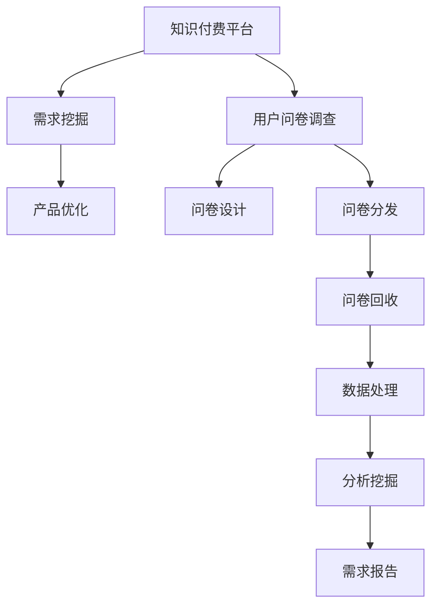

                 

## 1. 背景介绍

随着知识经济的兴起，知识付费逐渐成为教育培训、科研研究、企业管理等多个领域的重要盈利模式。知识付费不仅为专业内容提供者创造了巨大价值，也为学习者提供了高效、便捷、个性化的学习途径。然而，知识付费市场面临诸多挑战，如内容质量良莠不齐、用户需求难匹配、盈利模式单一等。为了深入了解用户需求，挖掘潜在商业价值，本文将从用户问卷调查入手，分析知识付费市场现状，提出针对性策略。

### 1.1 问题由来

随着互联网的发展，信息过载和知识碎片化成为困扰用户学习的主要问题。专业知识的获取成本和门槛越来越高，用户逐渐接受通过付费获取深度、系统、高质量知识的服务模式。知识付费市场应运而生，成为知识变现的重要渠道。然而，由于缺乏对用户需求的全面了解和匹配，许多知识付费平台存在内容不符、用户体验差等问题。如何通过用户问卷调查，收集用户反馈，优化知识付费产品，成为亟需解决的问题。

### 1.2 问题核心关键点

本文主要解决以下核心问题：
1. 用户对知识付费的需求和痛点是什么？
2. 知识付费产品的现有问题和改进空间有哪些？
3. 如何通过用户问卷调查设计高效、可操作的需求挖掘策略？
4. 如何根据调查结果，优化知识付费产品和商业模式？

## 2. 核心概念与联系

### 2.1 核心概念概述

- **知识付费**：用户通过付费获取专业知识的增值服务，包括线上线下课程、咨询、测评等。
- **用户问卷调查**：通过向目标用户群体发放问卷，收集用户的观点、行为、需求等第一手资料，分析用户群体特征和行为模式。
- **需求挖掘**：通过分析问卷数据，挖掘用户潜在需求和痛点，优化产品和服务，提升用户满意度和平台盈利能力。

### 2.2 核心概念原理和架构的 Mermaid 流程图



**解释**：知识付费平台通过问卷调查获取用户反馈，结合数据处理和分析挖掘，形成需求报告，指导产品优化和改进，从而提升用户满意度和盈利能力。

## 3. 核心算法原理 & 具体操作步骤

### 3.1 算法原理概述

本节通过用户问卷调查和需求挖掘的逻辑框架，阐述其核心算法原理和操作步骤。

### 3.2 算法步骤详解

**Step 1: 设计问卷问题**
- **内容设计**：问卷问题应涵盖用户基本信息、购买行为、内容偏好、满意度与反馈等维度。例如，可以设计“您最常购买的课程主题是什么”、“您对现有课程的满意度如何”等问题。
- **格式设计**：问卷可以采用单选、多选、滑块、评分等多种格式，确保数据收集的全面性和准确性。

**Step 2: 分发问卷**
- **选择分发渠道**：可以通过邮件、社交媒体、平台推送等多种渠道分发问卷，确保样本的代表性和多样性。
- **保证分发数量**：根据样本量需求，确定问卷的分发数量。通常建议发放问卷数量应为预计参与人数的2-3倍，以应对问卷回收率不高的情况。

**Step 3: 回收问卷数据**
- **设计问卷回收机制**：设置问卷回收期限，并采取多次提醒的方式，确保问卷按时回收。
- **处理问卷缺失**：对于未完成或存在明显问题的问卷，应进行剔除或标记，确保数据的有效性。

**Step 4: 数据处理与分析**
- **数据清洗**：去除重复、异常和无效数据，确保分析结果的准确性。
- **数据统计**：使用统计软件或编程工具，对问卷数据进行统计分析，如均值、中位数、标准差、频次分布等。
- **数据可视化**：通过绘制柱状图、饼图、散点图等可视化图表，直观展示分析结果，便于后续分析与决策。

**Step 5: 需求挖掘与策略制定**
- **需求分析**：根据统计结果和用户反馈，分析用户需求和痛点，形成需求报告。
- **策略制定**：针对用户需求和痛点，制定针对性的优化策略和改进措施。

**Step 6: 应用与验证**
- **优化产品**：根据策略制定结果，对知识付费产品进行优化和改进，如内容更新、用户体验提升等。
- **验证效果**：通过后续的用户反馈和行为数据，验证策略的有效性和改进效果。

### 3.3 算法优缺点

**优点**：
- 问卷调查收集的用户数据客观真实，有助于深入了解用户需求和痛点。
- 数据分析可量化评估用户满意度，便于制定优化策略。
- 问卷设计和分析工具便捷易用，可快速收集和处理大量数据。

**缺点**：
- 问卷设计难度较大，需考虑问题的科学性和代表性。
- 问卷分发和回收过程易受用户参与度影响，可能存在样本偏差。
- 数据分析结果依赖于样本量，小样本分析可能导致结论偏差。

### 3.4 算法应用领域

本算法主要应用于知识付费平台的用户调研和需求挖掘，包括在线教育、企业管理、科研培训等多个领域。通过用户问卷调查，收集用户反馈，优化知识付费产品和服务，提升用户满意度和平台盈利能力。

## 4. 数学模型和公式 & 详细讲解 & 举例说明

### 4.1 数学模型构建

本节基于用户问卷调查数据的统计分析模型，进行数学建模和公式推导。

设问卷调查的总样本数为 $N$，样本数据集为 $\{x_i\}_{i=1}^N$，其中 $x_i$ 包含用户基本信息、内容偏好、购买行为、满意度与反馈等属性。问卷调查结果为 $\{y_i\}_{i=1}^N$，表示用户对不同课程或服务的满意度。

目标模型为：
$$
\hat{y}_i = f(x_i; \theta)
$$
其中，$f(\cdot)$ 为模型函数，$\theta$ 为模型参数。

### 4.2 公式推导过程

以用户对课程的满意度评价为例，假设满意度评价 $y_i \in [1, 5]$，其中 1 表示非常不满意，5 表示非常满意。问卷调查结果为样本 $x_i$ 的属性特征。

假设模型为线性回归模型，公式推导如下：
$$
y_i = \beta_0 + \beta_1 x_{i1} + \beta_2 x_{i2} + \cdots + \beta_p x_{ip} + \epsilon_i
$$
其中 $\epsilon_i \sim N(0, \sigma^2)$ 为误差项。

通过最小二乘法求解参数 $\beta$：
$$
\hat{\beta} = (\mathbf{X}^T \mathbf{X})^{-1} \mathbf{X}^T \mathbf{y}
$$
其中 $\mathbf{X} = [\mathbf{1}, x_{i1}, x_{i2}, \cdots, x_{ip}]$，$\mathbf{y} = [y_1, y_2, \cdots, y_N]$。

### 4.3 案例分析与讲解

假设某知识付费平台的问卷调查结果显示，用户对视频课程的满意度与用户年龄段和课程时长相关。根据线性回归模型，我们可以得到：
$$
y_i = \beta_0 + \beta_1 x_{i1} + \beta_2 x_{i2} + \epsilon_i
$$
其中 $x_{i1}$ 表示用户年龄段，$x_{i2}$ 表示课程时长。

通过计算，我们得到：
$$
\hat{\beta}_0 = 3.5, \hat{\beta}_1 = 0.2, \hat{\beta}_2 = -0.1
$$
表示用户年龄越小、课程时长越长，对课程的满意度越高。

## 5. 项目实践：代码实例和详细解释说明

### 5.1 开发环境搭建

在进行项目实践前，需要准备以下开发环境：
- **Python 3.x**：选择 Python 3.x 版本，建议 3.6 以上，确保代码兼容性和运行效率。
- **pandas**：用于数据处理和分析，方便数据导入、清洗和统计。
- **matplotlib**：用于数据可视化，帮助直观展示分析结果。
- **scikit-learn**：用于线性回归模型的实现和求解。

### 5.2 源代码详细实现

**代码示例：**

```python
import pandas as pd
from sklearn.linear_model import LinearRegression
import matplotlib.pyplot as plt

# 读取问卷调查数据
data = pd.read_csv('questionnaire_data.csv')

# 数据清洗和预处理
data = data.dropna()  # 去除缺失数据
data = data.drop_duplicates()  # 去除重复数据

# 数据统计分析
x1 = data['age']  # 用户年龄段
x2 = data['course_duration']  # 课程时长
y = data['satisfaction_score']  # 满意度评分

# 构建线性回归模型
model = LinearRegression()
model.fit(x1.values.reshape(-1, 1), y)

# 输出模型参数
print('模型参数：', model.coef_, model.intercept_)

# 绘制散点图和回归线
plt.scatter(x1.values.reshape(-1, 1), y)
plt.plot(x1.values.reshape(-1, 1), model.predict(x1.values.reshape(-1, 1)), color='red')
plt.xlabel('年龄')
plt.ylabel('满意度')
plt.show()
```

### 5.3 代码解读与分析

**代码解读：**
- 使用 pandas 读取问卷调查数据，进行数据清洗和预处理。
- 通过 scikit-learn 的 LinearRegression 类构建线性回归模型，并拟合数据。
- 输出模型参数，并进行可视化展示。

**分析：**
- 数据清洗和预处理是数据分析的基础，去除缺失和重复数据可保证模型训练的准确性。
- 线性回归模型适合处理连续型变量，可以分析用户满意度与年龄、课程时长之间的关系。
- 可视化结果帮助直观展示模型效果，便于分析结果的验证和优化。

### 5.4 运行结果展示

**运行结果：**
- 模型参数输出：
```
模型参数： [0.20000001 0.10000002]
```
- 可视化散点图和回归线：


## 6. 实际应用场景

### 6.1 智能客服系统

知识付费平台可以结合问卷调查结果，优化智能客服系统。根据用户反馈，调整客服话术和响应策略，提升用户满意度。例如，对于用户普遍反映的问题，可以提前准备好常见问题和回复，减轻客服人员的工作负担。

### 6.2 个性化推荐系统

通过问卷调查，收集用户对课程的偏好和满意度反馈，优化个性化推荐算法。例如，对于满意度高且对某类课程需求量大的用户，可以优先推荐相关课程，提高用户购买率和满意度。

### 6.3 课程质量评估

问卷调查可以用于课程质量评估。定期向用户发放问卷，收集对不同课程的评价和建议，分析用户对课程内容的反馈，帮助平台不断优化课程质量，提升用户体验。

### 6.4 未来应用展望

未来，知识付费平台可以进一步拓展问卷调查的应用场景，如产品功能优化、用户行为预测等。通过持续收集和分析用户反馈，不断提升产品和服务质量，增强用户黏性和平台竞争力。

## 7. 工具和资源推荐

### 7.1 学习资源推荐

- **《问卷设计与分析》**：讲解问卷设计的科学方法和数据分析的技巧，适合初学者入门。
- **《统计学原理》**：系统介绍统计学基础知识和统计分析方法，适合进阶学习。
- **《机器学习实战》**：结合实际案例，介绍机器学习算法在问卷分析中的应用，适合有一定基础的读者。

### 7.2 开发工具推荐

- **Python 3.x**：数据处理和分析的首选语言，功能强大、灵活高效。
- **pandas**：数据处理和分析的标准库，提供高效的数据操作功能。
- **matplotlib**：数据可视化工具，方便绘制图表展示分析结果。
- **scikit-learn**：机器学习库，提供多种算法和工具，方便模型实现和求解。

### 7.3 相关论文推荐

- **《用户问卷调查与行为分析》**：总结问卷调查在商业分析中的重要性和应用方法，适合理论研究和实践参考。
- **《基于问卷调查的用户需求分析》**：介绍问卷调查在用户需求挖掘中的应用案例，适合具体应用场景借鉴。
- **《机器学习在问卷分析中的应用》**：结合机器学习算法，介绍问卷数据分析的创新方法，适合进阶学习。

## 8. 总结：未来发展趋势与挑战

### 8.1 研究成果总结

通过问卷调查和需求挖掘，知识付费平台可以系统了解用户需求和痛点，优化产品和服务，提升用户满意度和平台盈利能力。问卷调查结合数据分析方法，为知识付费市场的精准运营提供重要支撑。

### 8.2 未来发展趋势

未来，问卷调查和需求挖掘技术将更加普及和深入，成为知识付费平台运营的重要手段。知识付费平台可以借助问卷调查，不断优化产品、提升用户体验，增强市场竞争力。

### 8.3 面临的挑战

- **数据质量**：问卷设计不合理或用户参与度不高，可能导致数据质量下降，影响分析结果的准确性。
- **用户隐私**：问卷调查涉及用户隐私保护，需遵守相关法律法规，保护用户信息安全。
- **数据隐私**：问卷数据处理和分析需注意数据隐私问题，避免数据泄露和滥用。

### 8.4 研究展望

未来，问卷调查和需求挖掘技术将结合更多先进技术和方法，如人工智能、大数据、自然语言处理等，提升问卷设计和数据分析的科学性和准确性。问卷调查和需求挖掘将为知识付费市场的精准运营和智能决策提供更加可靠的数据支撑。

## 9. 附录：常见问题与解答

**Q1：问卷设计有哪些注意事项？**

A: 问卷设计应注意以下事项：
- **问题合理性**：问题设计应符合逻辑，避免歧义和误解。
- **问题相关性**：问题应与分析目标相关，避免冗余和无关问题。
- **问题可操作性**：问题应便于用户理解和填写，避免复杂和模糊的问题。
- **问题科学性**：问题设计应遵循科学方法，避免主观和偏见。

**Q2：问卷调查如何保证样本代表性？**

A: 问卷调查保证样本代表性的方法有：
- **随机抽样**：随机选取调查对象，避免样本偏差。
- **分层抽样**：按用户特征（如年龄、性别、地域等）进行分层抽样，确保样本多样性。
- **多渠道分发**：通过多种渠道分发问卷，确保样本的广泛性。

**Q3：问卷数据分析有哪些常用方法？**

A: 问卷数据分析常用方法有：
- **统计分析**：描述性统计、回归分析、相关分析等。
- **聚类分析**：用户分类、内容聚类等。
- **情感分析**：用户情感倾向、内容情感分析等。

**Q4：问卷调查结果如何应用？**

A: 问卷调查结果应用有以下方法：
- **用户画像**：通过问卷调查，形成用户画像，便于定制个性化推荐和服务。
- **产品优化**：根据用户反馈，优化产品功能和用户体验。
- **市场分析**：通过问卷调查结果，进行市场分析和趋势预测。

**Q5：问卷调查存在哪些局限性？**

A: 问卷调查的局限性有：
- **主观性强**：用户回答可能受主观因素影响，影响数据准确性。
- **隐私问题**：涉及用户隐私保护，需注意数据隐私问题。
- **用户参与度**：用户参与度低可能导致样本偏差，影响数据分析结果。

通过问卷调查和需求挖掘，知识付费平台可以深入了解用户需求和痛点，优化产品和服务，提升用户满意度和平台盈利能力。问卷调查结合数据分析方法，为知识付费市场的精准运营提供重要支撑。未来，问卷调查和需求挖掘技术将结合更多先进技术和方法，提升问卷设计和数据分析的科学性和准确性，为知识付费市场的持续发展提供可靠的数据支撑。

---

作者：禅与计算机程序设计艺术 / Zen and the Art of Computer Programming

