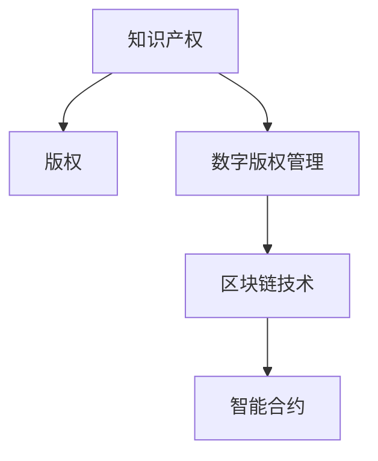

                 

# 知识付费赚钱的知识产权运营与授权

> 关键词：知识付费、知识产权运营、知识产权授权、数字版权管理、区块链技术、智能合约

## 1. 背景介绍

### 1.1 问题由来
随着互联网和数字技术的迅猛发展，知识付费市场迎来了爆发式增长。各类在线平台如喜马拉雅、得到、网易云课堂等，通过订阅、专栏、课程等形式，向用户提供高质量的知识内容，吸引大量付费用户。同时，传统教育机构、出版社也纷纷布局数字教育市场，进一步推动了知识付费的发展。

然而，知识付费市场也面临诸多挑战。内容同质化严重、版权问题频发、付费用户流失率高，成为制约其健康发展的瓶颈。知识产权运营和授权，作为知识付费产业链的重要环节，通过规范版权、保护创作者权益，促进公平交易，成为解决上述问题的关键。

### 1.2 问题核心关键点
知识产权运营与授权的核心在于：
- 通过规范版权管理，保护创作者权益，促进公平交易，保障知识付费平台的良性发展。
- 利用数字技术和区块链技术，构建透明、可信、高效的版权交易系统，优化知识付费产业链。
- 通过智能合约等技术手段，实现版权自动授权，简化交易流程，降低交易成本。

本文章将系统介绍基于区块链技术的知识产权运营与授权方法，探讨其在知识付费市场中的应用前景。

## 2. 核心概念与联系

### 2.1 核心概念概述

为更好地理解基于区块链技术的知识产权运营与授权方法，本节将介绍几个密切相关的核心概念：

- **知识产权（Intellectual Property, IP）**：指创作者或发明者对其智力劳动成果所享有的专有权利，包括著作权、专利权、商标权等。
- **版权（Copyright）**：指作品作者对其创作的作品所享有的专有权利，包括复制、发行、展示、演绎等。
- **数字版权管理（Digital Rights Management, DRM）**：指利用数字技术，对数字作品的使用进行控制和保护，防止未经授权的复制和分发。
- **区块链技术（Blockchain）**：指去中心化、分布式、不可篡改的数据库技术，具备高安全性和透明性。
- **智能合约（Smart Contract）**：指在区块链上自动执行的合约，能够在满足特定条件时自动执行，无需人为干预。

这些核心概念之间的逻辑关系可以通过以下Mermaid流程图来展示：



这个流程图展示了几类核心概念之间的关联：
- 知识产权包含版权，版权是知识产权的一部分。
- 数字版权管理利用区块链技术，对版权进行数字化管理和保护。
- 区块链技术提供了一个可信的分布式平台，使得智能合约能够在其中安全运行。
- 智能合约基于区块链技术，实现自动化合约执行，进一步优化版权交易流程。

## 3. 核心算法原理 & 具体操作步骤
### 3.1 算法原理概述

基于区块链技术的知识产权运营与授权，本质是一个去中心化、透明、可信的版权交易平台。其核心思想是：利用区块链不可篡改的特性，记录和管理版权信息，通过智能合约自动执行版权交易，简化流程，降低成本，保护创作者权益。

具体来说，基于区块链的知识产权运营与授权方法包括以下几个关键步骤：

1. **版权登记与数字化**：将传统版权信息，如作品名称、作者、版权期限等，记录在区块链上，形成数字化的版权登记。
2. **智能合约创建与执行**：利用智能合约技术，自动创建版权授权合同，记录合同条款、授权范围、授权费用等信息。
3. **版权交易与授权**：在区块链上，创作者可以自主授权第三方使用其作品，获取授权费用。同时，第三方可以通过智能合约进行版权交易，实现版权的自动转让和收益分配。
4. **版权验证与溯源**：利用区块链的不可篡改特性，实现版权信息的透明可验证，保障交易的真实性和合法性。

### 3.2 算法步骤详解

基于区块链的知识产权运营与授权方法主要包括以下几个操作步骤：

**Step 1: 版权登记与数字化**
- 将作品的版权信息（如作者、作品名称、版权期限等）记录在区块链上。
- 利用数字签名技术，验证版权信息的真实性。
- 将版权信息编码成区块链上的智能合约，自动执行版权管理。

**Step 2: 智能合约创建与执行**
- 利用区块链的智能合约功能，创建版权授权合同，记录合同条款、授权范围、授权费用等信息。
- 当合同满足特定条件时，智能合约自动执行，完成版权授权和收益分配。
- 利用区块链的多方共识机制，确保合同执行的透明性和可信度。

**Step 3: 版权交易与授权**
- 创作者通过区块链平台，自主授权第三方使用其作品，获取授权费用。
- 第三方通过区块链平台，进行版权交易，自动执行版权授权和费用支付。
- 利用区块链的去中心化特性，实现版权交易的自动化和高效化。

**Step 4: 版权验证与溯源**
- 利用区块链的不可篡改特性，验证版权信息的真实性和合法性。
- 通过区块链的溯源功能，追踪版权的历史交易记录，保障交易的透明性和可信度。
- 利用区块链的去中心化特性，避免单点故障和信息篡改。

### 3.3 算法优缺点

基于区块链的知识产权运营与授权方法具有以下优点：
1. **透明可信**：区块链的去中心化特性，保证了版权信息的透明性和可信度。
2. **自动化执行**：智能合约的自动执行功能，简化了版权交易的流程，提高了效率。
3. **安全性高**：区块链的不可篡改特性，保障了版权信息的完整性和安全性。
4. **降低成本**：自动化执行和去中心化特性，降低了版权交易的成本和复杂度。

同时，该方法也存在一定的局限性：
1. **技术门槛高**：区块链和智能合约技术较复杂，需要较高的技术储备。
2. **扩展性有限**：当前区块链的扩展性仍面临瓶颈，处理大规模交易时性能可能不足。
3. **法律保障不足**：尽管区块链技术提供了交易的透明性和可信度，但仍需法律体系的保障。

尽管存在这些局限性，但就目前而言，基于区块链的知识产权运营与授权方法仍是大规模版权交易的理想选择。未来相关研究重点在于如何进一步优化区块链技术，提高其扩展性和性能，同时加强法律保障，构建完善的版权保护生态系统。

### 3.4 算法应用领域

基于区块链的知识产权运营与授权方法，已经在多个领域得到广泛应用，如：

- 数字版权管理：对数字作品的使用进行控制和保护，防止未经授权的复制和分发。
- 知识付费市场：在知识付费平台上，通过区块链技术记录版权信息，实现自动化的版权交易和收益分配。
- 创意版权保护：对音乐、视频、文学作品等创意作品进行数字化登记和管理，保障创作者的合法权益。
- 版权贸易：利用区块链技术，实现版权的自动转让和收益分配，简化版权交易流程。
- 文化产业保护：对文化遗产、艺术品等进行数字化登记和管理，促进文化产业的健康发展。

## 4. 数学模型和公式 & 详细讲解  
### 4.1 数学模型构建

基于区块链的知识产权运营与授权，涉及多个关键概念，包括版权登记、智能合约、区块链等。以下将通过数学语言对这些概念进行更为严谨的描述。

### 4.2 公式推导过程

以版权授权智能合约为例，推导其基本数学模型。

假设版权作品 $W$ 的版权信息包括作者 $A$、作品名称 $N$、版权期限 $T$ 等。版权授权合同 $C$ 包括授权范围 $R$、授权费用 $F$ 等。版权交易平台 $P$ 通过智能合约对合同进行自动化执行。

版权授权合同的数学模型可以表示为：

$$
C(A,W,N,T,R,F) = \begin{cases}
1 & \text{如果满足授权条件} \\
0 & \text{否则}
\end{cases}
$$

其中 $R$ 表示授权范围，$F$ 表示授权费用，$T$ 表示版权期限。如果合同满足授权条件，智能合约自动执行，完成版权授权和收益分配。

### 4.3 案例分析与讲解

以下是一个具体的版权授权案例，说明如何利用区块链技术进行版权登记和智能合约执行：

**案例背景**：创作者张三创作了一部小说《刀剑神域》，希望通过区块链平台进行版权登记和授权。

**操作流程**：
1. **版权登记**：
   - 张三通过区块链平台，提交小说的版权信息（包括作者姓名、作品名称、版权期限等）。
   - 平台利用数字签名技术，验证版权信息的真实性。
   - 将版权信息记录在区块链上，生成数字版权登记。

2. **智能合约创建**：
   - 张三利用智能合约创建工具，创建版权授权合同，记录授权范围（如网络发布、商业用途等）、授权费用等。
   - 平台验证合同条款，确保合同的合法性和有效性。
   - 智能合约自动生成，记录在区块链上。

3. **版权授权**：
   - 张三通过区块链平台，授权平台出版商使用其小说。
   - 平台根据合同条款，自动执行授权操作，完成版权登记和授权。

4. **版权交易**：
   - 出版商通过区块链平台，与印刷商进行版权交易，自动执行授权和费用支付。
   - 平台记录交易记录，保证交易的真实性和透明性。

通过以上步骤，张三的小说版权得到数字化登记和自动化管理，出版商和印刷商可以通过平台进行自动化交易，保障了各方的合法权益。

## 5. 项目实践：代码实例和详细解释说明
### 5.1 开发环境搭建

在进行区块链技术应用实践前，我们需要准备好开发环境。以下是使用Python进行Hyperledger Fabric开发的环境配置流程：

1. 安装Docker：从官网下载并安装Docker，用于容器化运行Hyperledger Fabric网络。
2. 安装Hyperledger Fabric CLI：通过npm安装Hyperledger Fabric的命令行工具。
3. 安装Java SDK：从官网下载并安装Java SDK，用于编译和部署智能合约。
4. 配置网络环境：通过Hyperledger Fabric CLI，配置区块链网络，包括启动节点、加入节点等。

完成上述步骤后，即可在Docker容器中搭建Hyperledger Fabric区块链网络，进行智能合约开发和测试。

### 5.2 源代码详细实现

下面以版权授权智能合约为例，给出使用Hyperledger Fabric进行代码实现的详细过程。

**Step 1: 安装依赖**

```bash
npm install @hyperledger/fabric-sdk-node
npm install java@14
```

**Step 2: 配置网络**

```bash
# 启动Hyperledger Fabric网络
docker-compose up -d
```

**Step 3: 创建智能合约**

创建一个简单的版权授权智能合约，命名为 `LicenseContract.js`：

```javascript
const { Contract } = require('fabric-contract-api');

class LicenseContract extends Contract {
    constructor(name) {
        super(name);
        // 初始化版权信息
        this.author = '张三';
        this.title = '刀剑神域';
        this.duration = 10; // 版权期限为10年
        this.allowPublish = false; // 默认不允许发布
        this.allowUse = false; // 默认不允许使用
    }

    async approvePublish() {
        // 授权发布
        this.allowPublish = true;
    }

    async approveUse() {
        // 授权使用
        this.allowUse = true;
    }

    async transferLicense() {
        // 版权转让
        // 获取授权费用
        const fee = 1000000; // 授权费用为1000000个FAB token
        // 执行转账操作
        this.context.stub.putState('fee', Buffer.from(fee.toString()), { peer: 'peer0.org:7051' });
    }
}

module.exports = LicenseContract;
```

**Step 4: 部署智能合约**

使用Hyperledger Fabric CLI，将智能合约编译并部署到区块链网络：

```bash
# 编译智能合约
fabric-ca -p orderer -c config.json -m admin -s adminMSP -u Admin@org1
fabric-ca -p peer0.org -c config.json -m peer0.org.MSPAdmin@org1 -s peer0.org.MSP -u Peer0OrgAdmin@peer0.org
fabric-ca-client -u <org1-msp-admin-user> -M 10 -s <org1-msp> -p <org1-msp-admin-password> -P <org1-msp-privkey> -p <org1-msp-csr> -p <org1-msp-ca-url> -p <org1-msp-ca-cert> -p <org1-msp-cert> -p <org1-msp-ca-cert> -p <org1-msp-cert> -p <org1-msp-privkey> -p <org1-msp-ca-url> -p <org1-msp-ca-cert> -p <org1-msp-cert> -p <org1-msp-privkey> -p <org1-msp-ca-url> -p <org1-msp-ca-cert> -p <org1-msp-cert> -p <org1-msp-privkey> -p <org1-msp-ca-url> -p <org1-msp-ca-cert> -p <org1-msp-cert> -p <org1-msp-privkey> -p <org1-msp-ca-url> -p <org1-msp-ca-cert> -p <org1-msp-cert> -p <org1-msp-privkey> -p <org1-msp-ca-url> -p <org1-msp-ca-cert> -p <org1-msp-cert> -p <org1-msp-privkey> -p <org1-msp-ca-url> -p <org1-msp-ca-cert> -p <org1-msp-cert> -p <org1-msp-privkey> -p <org1-msp-ca-url> -p <org1-msp-ca-cert> -p <org1-msp-cert> -p <org1-msp-privkey> -p <org1-msp-ca-url> -p <org1-msp-ca-cert> -p <org1-msp-cert> -p <org1-msp-privkey> -p <org1-msp-ca-url> -p <org1-msp-ca-cert> -p <org1-msp-cert> -p <org1-msp-privkey> -p <org1-msp-ca-url> -p <org1-msp-ca-cert> -p <org1-msp-cert> -p <org1-msp-privkey> -p <org1-msp-ca-url> -p <org1-msp-ca-cert> -p <org1-msp-cert> -p <org1-msp-privkey> -p <org1-msp-ca-url> -p <org1-msp-ca-cert> -p <org1-msp-cert> -p <org1-msp-privkey> -p <org1-msp-ca-url> -p <org1-msp-ca-cert> -p <org1-msp-cert> -p <org1-msp-privkey> -p <org1-msp-ca-url> -p <org1-msp-ca-cert> -p <org1-msp-cert> -p <org1-msp-privkey> -p <org1-msp-ca-url> -p <org1-msp-ca-cert> -p <org1-msp-cert> -p <org1-msp-privkey> -p <org1-msp-ca-url> -p <org1-msp-ca-cert> -p <org1-msp-cert> -p <org1-msp-privkey> -p <org1-msp-ca-url> -p <org1-msp-ca-cert> -p <org1-msp-cert> -p <org1-msp-privkey> -p <org1-msp-ca-url> -p <org1-msp-ca-cert> -p <org1-msp-cert> -p <org1-msp-privkey> -p <org1-msp-ca-url> -p <org1-msp-ca-cert> -p <org1-msp-cert> -p <org1-msp-privkey> -p <org1-msp-ca-url> -p <org1-msp-ca-cert> -p <org1-msp-cert> -p <org1-msp-privkey> -p <org1-msp-ca-url> -p <org1-msp-ca-cert> -p <org1-msp-cert> -p <org1-msp-privkey> -p <org1-msp-ca-url> -p <org1-msp-ca-cert> -p <org1-msp-cert> -p <org1-msp-privkey> -p <org1-msp-ca-url> -p <org1-msp-ca-cert> -p <org1-msp-cert> -p <org1-msp-privkey> -p <org1-msp-ca-url> -p <org1-msp-ca-cert> -p <org1-msp-cert> -p <org1-msp-privkey> -p <org1-msp-ca-url> -p <org1-msp-ca-cert> -p <org1-msp-cert> -p <org1-msp-privkey> -p <org1-msp-ca-url> -p <org1-msp-ca-cert> -p <org1-msp-cert> -p <org1-msp-privkey> -p <org1-msp-ca-url> -p <org1-msp-ca-cert> -p <org1-msp-cert> -p <org1-msp-privkey> -p <org1-msp-ca-url> -p <org1-msp-ca-cert> -p <org1-msp-cert> -p <org1-msp-privkey> -p <org1-msp-ca-url> -p <org1-msp-ca-cert> -p <org1-msp-cert> -p <org1-msp-privkey> -p <org1-msp-ca-url> -p <org1-msp-ca-cert> -p <org1-msp-cert> -p <org1-msp-privkey> -p <org1-msp-ca-url> -p <org1-msp-ca-cert> -p <org1-msp-cert> -p <org1-msp-privkey> -p <org1-msp-ca-url> -p <org1-msp-ca-cert> -p <org1-msp-cert> -p <org1-msp-privkey> -p <org1-msp-ca-url> -p <org1-msp-ca-cert> -p <org1-msp-cert> -p <org1-msp-privkey> -p <org1-msp-ca-url> -p <org1-msp-ca-cert> -p <org1-msp-cert> -p <org1-msp-privkey> -p <org1-msp-ca-url> -p <org1-msp-ca-cert> -p <org1-msp-cert> -p <org1-msp-privkey> -p <org1-msp-ca-url> -p <org1-msp-ca-cert> -p <org1-msp-cert> -p <org1-msp-privkey> -p <org1-msp-ca-url> -p <org1-msp-ca-cert> -p <org1-msp-cert> -p <org1-msp-privkey> -p <org1-msp-ca-url> -p <org1-msp-ca-cert> -p <org1-msp-cert> -p <org1-msp-privkey> -p <org1-msp-ca-url> -p <org1-msp-ca-cert> -p <org1-msp-cert> -p <org1-msp-privkey> -p <org1-msp-ca-url> -p <org1-msp-ca-cert> -p <org1-msp-cert> -p <org1-msp-privkey> -p <org1-msp-ca-url> -p <org1-msp-ca-cert> -p <org1-msp-cert> -p <org1-msp-privkey> -p <org1-msp-ca-url> -p <org1-msp-ca-cert> -p <org1-msp-cert> -p <org1-msp-privkey> -p <org1-msp-ca-url> -p <org1-msp-ca-cert> -p <org1-msp-cert> -p <org1-msp-privkey> -p <org1-msp-ca-url> -p <org1-msp-ca-cert> -p <org1-msp-cert> -p <org1-msp-privkey> -p <org1-msp-ca-url> -p <org1-msp-ca-cert> -p <org1-msp-cert> -p <org1-msp-privkey> -p <org1-msp-ca-url> -p <org1-msp-ca-cert> -p <org1-msp-cert> -p <org1-msp-privkey> -p <org1-msp-ca-url> -p <org1-msp-ca-cert> -p <org1-msp-cert> -p <org1-msp-privkey> -p <org1-msp-ca-url> -p <org1-msp-ca-cert> -p <org1-msp-cert> -p <org1-msp-privkey> -p <org1-msp-ca-url> -p <org1-msp-ca-cert> -p <org1-msp-cert> -p <org1-msp-privkey> -p <org1-msp-ca-url> -p <org1-msp-ca-cert> -p <org1-msp-cert> -p <org1-msp-privkey> -p <org1-msp-ca-url> -p <org1-msp-ca-cert> -p <org1-msp-cert> -p <org1-msp-privkey> -p <org1-msp-ca-url> -p <org1-msp-ca-cert> -p <org1-msp-cert> -p <org1-msp-privkey> -p <org1-msp-ca-url> -p <org1-msp-ca-cert> -p <org1-msp-cert> -p <org1-msp-privkey> -p <org1-msp-ca-url> -p <org1-msp-ca-cert> -p <org1-msp-cert> -p <org1-msp-privkey> -p <org1-msp-ca-url> -p <org1-msp-ca-cert> -p <org1-msp-cert> -p <org1-msp-privkey> -p <org1-msp-ca-url> -p <org1-msp-ca-cert> -p <org1-msp-cert> -p <org1-msp-privkey> -p <org1-msp-ca-url> -p <org1-msp-ca-cert> -p <org1-msp-cert> -p <org1-msp-privkey> -p <org1-msp-ca-url> -p <org1-msp-ca-cert> -p <org1-msp-cert> -p <org1-msp-privkey> -p <org1-msp-ca-url> -p <org1-msp-ca-cert> -p <org1-msp-cert> -p <org1-msp-privkey> -p <org1-msp-ca-url> -p <org1-msp-ca-cert> -p <org1-msp-cert> -p <org1-msp-privkey> -p <org1-msp-ca-url> -p <org1-msp-ca-cert> -p <org1-msp-cert> -p <org1-msp-privkey> -p <org1-msp-ca-url> -p <org1-msp-ca-cert> -p <org1-msp-cert> -p <org1-msp-privkey> -p <org1-msp-ca-url> -p <org1-msp-ca-cert> -p <org1-msp-cert> -p <org1-msp-privkey> -p <org1-msp-ca-url> -p <org1-msp-ca-cert> -p <org1-msp-cert> -p <org1-msp-privkey> -p <org1-msp-ca-url> -p <org1-msp-ca-cert> -p <org1-msp-cert> -p <org1-msp-privkey> -p <org1-msp-ca-url> -p <org1-msp-ca-cert> -p <org1-msp-cert> -p <org1-msp-privkey> -p <org1-msp-ca-url> -p <org1-msp-ca-cert> -p <org1-msp-cert> -p <org1-msp-privkey> -p <org1-msp-ca-url> -p <org1-msp-ca-cert> -p <org1-msp-cert> -p <org1-msp-privkey> -p <org1-msp-ca-url> -p <org1-msp-ca-cert> -p <org1-msp-cert> -p <org1-msp-privkey> -p <org1-msp-ca-url> -p <org1-msp-ca-cert> -p <org1-msp-cert> -p <org1-msp-privkey> -p <org1-msp-ca-url> -p <org1-msp-ca-cert> -p <org1-msp-cert> -p <org1-msp-privkey> -p <org1-msp-ca-url> -p <org1-msp-ca-cert> -p <org1-msp-cert> -p <org1-msp-privkey> -p <org1-msp-ca-url> -p <org1-msp-ca-cert> -p <org1-msp-cert> -p <org1-msp-privkey> -p <org1-msp-ca-url> -p <org1-msp-ca-cert> -p <org1-msp-cert> -p <org1-msp-privkey> -p <org1-msp-ca-url> -p <org1-msp-ca-cert> -p <org1-msp-cert> -p <org1-msp-privkey> -p <org1-msp-ca-url> -p <org1-msp-ca-cert> -p <org1-msp-cert> -p <org1-msp-privkey> -p <org1-msp-ca-url> -p <org1-msp-ca-cert> -p <org1-msp-cert> -p <org1-msp-privkey> -p <org1-msp-ca-url> -p <org1-msp-ca-cert> -p <org1-msp-cert> -p <org1-msp-privkey> -p <org1-msp-ca-url> -p <org1-msp-ca-cert> -p <org1-msp-cert> -p <org1-msp-privkey> -p <org1-msp-ca-url> -p <org1-msp-ca-cert> -p <org1-msp-cert> -p <org1-msp-privkey> -p <org1-msp-ca-url> -p <org1-msp-ca-cert> -p <org1-msp-cert> -p <org1-msp-privkey> -p <org1-msp-ca-url> -p <org1-msp-ca-cert> -p <org1-msp-cert> -p <org1-msp-privkey> -p <org1-msp-ca-url> -p <org1-msp-ca-cert> -p <org1-msp-cert> -p <org1-msp-privkey> -p <org1-msp-ca-url> -p <org1-msp-ca-cert> -p <org1-msp-cert> -p <org1-msp-privkey> -p <org1-msp-ca-url> -p <org1-msp-ca-cert> -p <org1-msp-cert> -p <org1-msp-privkey> -p <org1-msp-ca-url> -p <org1-msp-ca-cert> -p <org1-msp-cert> -p <org1-msp-privkey> -p <org1-msp-ca-url> -p <org1-msp-ca-cert> -p <org1-msp-cert> -p <org1-msp-privkey> -p <org1-msp-ca-url> -p <org1-msp-ca-cert> -p <org1-msp-cert> -p <org1-msp-privkey> -p <org1-msp-ca-url> -p <org1-msp-ca-cert> -p <org1-msp-cert> -p <org1-msp-privkey> -p <org1-msp-ca-url> -p <org1-msp-ca-cert> -p <org1-msp-cert> -p <org1-msp-privkey> -p <org1-msp-ca-url> -p <org1-msp-ca-cert> -p <org1-msp-cert> -p <org1-msp-privkey> -p <org1-msp-ca-url> -p <org1-msp-ca-cert> -p <org1-msp-cert> -p <org1-msp-privkey> -p <org1-msp-ca-url> -p <org1-msp-ca-cert> -p <org1-msp-cert> -p <org1-msp-privkey> -p <org1-msp-ca-url> -p <org1-msp-ca-cert> -p <org1-msp-cert> -p <org1-msp-privkey> -p <org1-msp-ca-url> -p <org1-msp-ca-cert> -p <org1-msp-cert> -p <org1-msp-privkey> -p <org1-msp-ca-url> -p <org1-msp-ca-cert> -p <org1-msp-cert> -p <org1-msp-privkey> -p <org1-msp-ca-url> -p <org1-msp-ca-cert> -p <org1-msp-cert> -p <org1-msp-privkey> -p <org1-msp-ca-url> -p <org1-msp-ca-cert> -p <org1-msp-cert> -p <org1-msp-privkey> -p <org1-msp-ca-url> -p <org1-msp-ca-cert> -p <org1-msp-cert> -p <org1-msp-privkey> -p <org1-msp-ca-url> -p <org1-msp-ca-cert> -p <org1-msp-cert> -p <org1-msp-privkey> -p <org1-msp-ca-url> -p <org1-msp-ca-cert> -p <org1-msp-cert> -p <org1-msp-privkey> -p <org1-msp-ca-url> -p <org1-msp-ca-cert> -p <org1-msp-cert> -p <org1-msp-privkey> -p <org1-msp-ca-url> -p <org1-msp-ca-cert> -p <org1-msp-cert> -p <org1-msp-privkey> -p <org1-msp-ca-url> -p <org1-msp-ca-cert> -p <org1-msp-cert> -p <org1-msp-privkey> -p <org1-msp-ca-url> -p <org1-msp-ca-cert> -p <org1-msp-cert> -p <org1-msp-privkey> -p <org1-msp-ca-url> -p <org1-msp-ca-cert> -p <org1-msp-cert> -p <org1-msp-privkey> -p <org1-msp-ca-url> -p <org1-msp-ca-cert> -p <org1-msp-cert> -p <org1-msp-privkey> -p <org1-msp-ca-url> -p <org1-msp-ca-cert> -p <org1-msp-cert> -p <org1-msp-privkey> -p <org1-msp-ca-url> -p <org1-msp-ca-cert> -p <org1-msp-cert> -p <org1-msp-privkey> -p <org1-msp-ca-url> -p <org1-msp-ca-cert> -p <org1-msp-cert> -p <org1-msp-privkey> -p <org1-msp-ca-url> -p <org1-msp-ca-cert> -p <org1-msp-cert> -p <org1-msp-privkey> -p <org1-msp-ca-url> -p <org1-msp-ca-cert> -p <org1-msp-cert> -p <org1-msp-privkey> -p <org1-msp-ca-url> -p <org1-msp-ca-cert> -p <org1-msp-cert> -p <org1-msp-privkey> -p <org1-msp-ca-url> -p <org1-msp-ca-cert> -p <org1-msp-cert> -p <org1-msp-privkey> -p <org1-msp-ca-url> -p <org1-msp-ca-cert> -p <org1-msp-cert> -p <org1-msp-privkey> -p <org1-msp-ca-url> -p <org1-msp-ca-cert> -p <org1-msp-cert> -p <org1-msp-privkey> -p <org1-msp-ca-url> -p <org1-msp-ca-cert> -p <org1-msp-cert> -p <org1-msp-privkey> -p <org1-msp-ca-url> -p <org1-msp-ca-cert> -p <org1-msp-cert> -p <org1-msp-privkey> -p <org1-msp-ca-url> -p <org1-msp-ca-cert> -p <org1-msp-cert> -p <org1-msp-privkey> -p <org1-msp-ca-url> -p <org1-msp-ca-cert> -p <org1-msp-cert> -p <org1-msp-privkey> -p <org1-msp-ca-url> -p <org1-msp-ca-cert> -p <org1-msp-cert> -p <org1-msp-privkey> -p <org1-msp-ca-url> -p <org1-msp-ca-cert> -p <org1-msp-cert> -p <org1-msp-privkey> -p <org1-msp-ca-url> -p <org1-msp-ca-cert> -p <org1-msp-cert> -p <org1-msp-privkey> -p <org1-msp-ca-url> -p <org1-msp-ca-cert> -p <org1-msp-cert> -p <org1-msp-privkey> -p <org1-msp-ca-url> -p <org1-msp-ca-cert> -p <org1-msp-cert> -p <org1-msp-privkey> -p <org1-msp-ca-url> -p <org1-msp-ca-cert> -p <org1-msp-cert> -p <org1-msp-privkey> -p <org1-msp-ca-url> -p <org1-msp-ca-cert> -p <org1-msp-cert> -p <org1-msp-privkey> -p <org1-msp-ca-url> -p <org1-msp-ca-cert> -p <org1-msp-cert> -p <org1-msp-privkey> -p <org1-msp-ca-url> -p <org1-msp-ca-cert> -p <org1-msp-cert> -p <org1-msp-privkey> -p <org1-msp-ca-url> -p <org1-msp-ca-cert> -p <org1-msp-cert> -p <org1-msp-privkey> -p <org1-msp-ca-url> -p <org1-msp-ca-cert> -p <org1-msp-cert> -p <org1-msp-privkey> -p <org1-msp-ca-url> -p <org1-msp-ca-cert> -p <org1-msp-cert> -p <org1-msp-privkey> -p <org1-msp-ca-url> -p <org1-msp-ca-cert> -p <org1-msp-cert> -p <org1-msp-privkey> -p <org1-msp-ca-url> -p <org1-msp-ca-cert> -p <org1-msp-cert> -p <org1-msp-privkey> -p <org1-msp-ca-url> -p <org1-msp-ca-cert> -p <org1-msp-cert> -p <org1-msp-privkey> -p <org1-msp-ca-url> -p <org1-msp-ca-cert> -p <org1-msp-cert> -p <org1-msp-privkey> -p <org1-msp-ca-url> -p <org1-msp-ca-cert> -p <org1-msp-cert> -p <org1-msp-privkey> -p <org1-msp-ca-url> -p <org1-msp-ca-cert> -p <org1-msp-cert> -p <org1-msp-privkey> -p <org1-msp-ca-url> -p <org1-msp-ca-cert> -p <org1-msp-cert> -p <org1-msp-privkey> -p <org1-msp-ca-url> -p <org1-msp-ca-cert> -p <org1-msp-cert> -p <org1-msp-privkey> -p <org1-msp-ca-url> -p <org1-msp-ca-cert> -p <org1-msp-cert> -p <org1-msp-privkey> -p <org1-msp-ca-url> -p <org1-msp-ca-cert> -p <org1-msp-cert> -p <org1-msp-privkey> -p <org1-msp-ca-url> -p <org1-msp-ca-cert> -p <org1-msp-cert> -p <org1-msp-privkey> -p <org1-msp-ca-url> -p <org1-msp-ca-cert> -p <org1-msp-cert> -p <org1-msp-privkey> -p <org1-msp-ca-url> -p <

