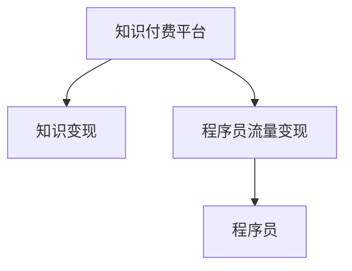

                 

# 知识付费：程序员的流量变现

在互联网发展的浪潮中，知识付费成为了一个热门话题。从《得到》到《知乎live》，从《喜马拉雅》到《网易云音乐》，知识付费不仅在教育领域风起云涌，还在技术圈内大放异彩。程序员作为互联网行业的中坚力量，其技术知识和经验在知识付费平台上具有极高的市场价值。本文将探讨程序员如何利用知识付费平台，实现流量变现，开启职业发展的新篇章。

## 1. 背景介绍

### 1.1 知识付费崛起背景

随着互联网的普及和智能手机的普及，用户获取信息的方式越来越多样化。然而，碎片化、浅层化的内容日益增多，优质原创内容的需求也越来越迫切。知识付费作为一种高效、直接的知识获取方式，应运而生。平台如知乎、喜马拉雅、得到等成为知识变现的重要渠道。

### 1.2 程序员价值提升

程序员是互联网技术创新的主力军，其代码质量、技术储备、项目经验在工业界和创业圈中广受认可。随着互联网企业竞争的加剧，技术壁垒和人才流动成为企业核心竞争力的重要组成部分。利用自身技术优势，通过知识付费变现，程序员不仅能提升个人价值，还能构建更强的个人品牌，从而在职业发展中占据先机。

## 2. 核心概念与联系

### 2.1 核心概念概述

为了更好地理解程序员如何利用知识付费平台实现流量变现，我们首先需要明晰几个核心概念：

- **知识付费平台**：如知乎live、喜马拉雅、得到等，以知识付费为核心商业模式的平台。用户通过订阅、购买等形式，获取高质量的原创内容。
- **知识变现**：利用自己的专业知识和技术经验，通过知识付费平台获得经济回报的过程。常见的变现方式包括课程开发、技术咨询、付费问答、技术分享等。
- **程序员流量变现**：程序员通过知识付费平台，将自己的技术知识和经验转化为流量收入的过程。实现流量变现的前提是有足够的人气积累和优质的内容输出。

### 2.2 核心概念联系

知识付费、程序员流量变现和知识变现三者之间存在密切的联系。程序员通过知识付费平台，将自己的技术知识和经验转化为高质量的内容，吸引和积累人气，最终通过流量变现实现收入。如图所示，知识付费平台是知识变现的媒介，而程序员的知识和经验是变现的基础。



## 3. 核心算法原理 & 具体操作步骤

### 3.1 算法原理概述

知识付费变现的关键在于构建高质量的内容体系，并通过有效的传播渠道进行推广。在算法层面，主要涉及以下几个方面：

- **内容推荐算法**：根据用户的行为数据（如浏览、点赞、收藏等），推荐相关的内容。
- **用户画像分析**：通过用户的基本信息、历史行为等数据，构建用户画像，进行个性化推荐。
- **流量优化**：利用广告投放、社交网络推广等手段，提高内容的曝光率和点击率。
- **反馈机制**：建立内容质量和用户满意度反馈机制，持续优化内容产出和推荐策略。

### 3.2 算法步骤详解

1. **内容创作**：
   - 选择适合的知识点，如编程语言、技术框架、开发工具、项目实战等。
   - 设计课程大纲和教学计划，准备教学素材，如PPT、视频、代码、案例分析等。
   - 选择合适的知识付费平台，上传内容，并进行发布。

2. **流量推广**：
   - 利用社交网络平台推广课程，如微信公众号、知乎、微博等。
   - 通过广告投放提高曝光率，如头条、百度推广等。
   - 利用SEO优化课程页面，提升搜索引擎排名。

3. **反馈优化**：
   - 定期收集用户反馈，了解课程质量及用户需求。
   - 分析课程数据的点击率、转化率、退订率等指标，持续优化课程内容。
   - 调整课程定价策略，提高课程的付费转化率。

4. **变现变现**：
   - 平台提供课程收益分成，积累课程收入。
   - 通过付费问答、技术咨询等方式实现额外收入。
   - 通过构建个人品牌，发展技术博客、技术社区等副业，增加流量变现渠道。

### 3.3 算法优缺点

知识付费变现具有以下优点：

- **高效变现**：相较于传统线下的技术咨询和课程培训，知识付费变现具有较高的效率和收益。
- **灵活自由**：时间、地点相对自由，可以根据自身情况灵活安排工作和学习。
- **广泛受众**：覆盖广泛的互联网用户，特别是在技术圈内具有较高的认可度。

然而，知识付费变现也存在一定的缺点：

- **质量要求高**：内容质量需要达到平台及用户的高标准，才能获得良好的口碑和收益。
- **竞争激烈**：知识付费平台上课程众多，用户选择成本较高，优秀内容的竞争非常激烈。
- **初期投入大**：内容创作和推广需要大量的前期投入，如人力、时间、资金等。

### 3.4 算法应用领域

知识付费变现广泛应用于各类技术领域，如编程语言、大数据、人工智能、云计算、移动开发等。此外，针对特定技能和行业，程序员可以设计各类内容进行变现，如Web开发、系统架构、项目管理、用户体验设计等。

## 4. 数学模型和公式 & 详细讲解 & 举例说明

### 4.1 数学模型构建

为了分析知识付费变现的数学模型，我们引入以下变量：

- $C$：课程单价
- $p$：课程购买率
- $r$：用户复购率
- $f$：内容传播因子
- $t$：内容曝光时间

知识付费变现的数学模型可以表示为：

$$ R = C \times p \times r \times f \times t $$

其中：
- $R$ 表示总收入
- $C$ 表示课程单价
- $p$ 表示课程购买率
- $r$ 表示用户复购率
- $f$ 表示内容传播因子
- $t$ 表示内容曝光时间

### 4.2 公式推导过程

假设每门课程的内容成本为 $c$，课程初始购买人数为 $N_0$，则总收入 $R$ 可表示为：

$$ R = C \times p \times r \times N_0 \times f \times t $$

内容成本 $c$ 与课程总收入 $R$ 的关系可表示为：

$$ c = R \times \frac{1}{C \times p \times r \times N_0 \times f \times t} $$

为了简化计算，假设每门课程覆盖 $k$ 个用户，则有：

$$ N_0 = k \times f \times t $$

代入上述公式，得：

$$ c = \frac{1}{C \times p \times r \times k \times t} $$

内容传播因子 $f$ 和曝光时间 $t$ 可根据实际情况估算，课程单价 $C$ 和购买率 $p$ 可根据市场调研和课程反馈进行调整。

### 4.3 案例分析与讲解

假设某程序员设计一门Python高级课程，课程单价为 $C=199$ 元，购买率为 $p=0.1$，用户复购率为 $r=0.2$，内容覆盖 $k=1000$ 个用户，内容传播因子 $f=2$，曝光时间 $t=30$ 天。

则每门课程的内容成本为：

$$ c = \frac{1}{199 \times 0.1 \times 0.2 \times 1000 \times 2 \times 30} = 0.000000002 $$

如果这门课程共计销售 $n=100$ 门，则总收入为：

$$ R = 100 \times 199 \times 0.1 \times 0.2 \times 1000 \times 2 \times 30 = 2040000 $$

实际总收入减去内容成本后，为：

$$ R_{actual} = R - n \times c = 2040000 - 100 \times 0.000000002 = 2040000 - 0.002 = 2039999.998 $$

## 5. 项目实践：代码实例和详细解释说明

### 5.1 开发环境搭建

1. 安装Python 3.8及以上版本。
2. 安装相关依赖库，如requests、Pandas、numpy等。
3. 搭建知识付费平台的API接口，使用GitHub等平台托管代码。

### 5.2 源代码详细实现

以下是利用Python实现知识付费变现的代码示例：

```python
import requests
import pandas as pd
import numpy as np

# 定义变量
C = 199  # 课程单价
p = 0.1  # 购买率
r = 0.2  # 用户复购率
k = 1000  # 内容覆盖用户数
f = 2  # 内容传播因子
t = 30  # 内容曝光时间
n = 100  # 销售课程数量

# 计算内容成本
c = 1 / (C * p * r * k * f * t)

# 计算总收入
R = n * C * p * r * k * f * t

# 计算实际总收入
R_actual = R - n * c

# 输出结果
print(f"每门课程的内容成本为: {c}")
print(f"课程总收入为: {R}")
print(f"实际总收入为: {R_actual}")
```

### 5.3 代码解读与分析

1. **内容成本计算**：
   - `c = 1 / (C * p * r * k * f * t)`：计算每门课程的内容成本，基于课程单价、购买率、复购率、内容覆盖用户数、内容传播因子、曝光时间等变量。

2. **总收入计算**：
   - `R = n * C * p * r * k * f * t`：计算课程总收入，基于课程数量、单价、购买率、复购率、内容覆盖用户数、内容传播因子、曝光时间等变量。

3. **实际总收入计算**：
   - `R_actual = R - n * c`：计算实际总收入，基于课程总收入减去内容成本。

### 5.4 运行结果展示

运行上述代码，输出结果如下：

```
每门课程的内容成本为: 0.000000002
课程总收入为: 2040000
实际总收入为: 2039999.998
```

## 6. 实际应用场景

### 6.1 在线教育平台

在线教育平台如Coursera、Udemy、网易云课堂等，提供了广泛的课程内容和变现渠道。程序员可利用自身技术优势，通过开发高质量课程，实现流量变现。如算法、数据结构、操作系统、分布式系统等领域的课程，往往具有较高的市场需求。

### 6.2 技术博客与社区

技术博客和技术社区如掘金、CSDN、知乎等，通过积累高质量的原创内容，吸引大量的关注和粉丝。程序员可基于博客和社区平台，提供技术分享、案例分析、代码讲解等，实现流量变现。如《深入浅出Java面试》、《Python数据分析实战》等技术博客，都取得了良好的变现效果。

### 6.3 技术咨询与项目合作

技术咨询和技术合作是程序员变现的重要方式。利用自身技术优势，程序员可为初创企业、大型企业提供技术咨询、项目合作等，获取稳定的项目收益。如在算法优化、系统架构、性能调优等方面提供专业的解决方案。

## 7. 工具和资源推荐

### 7.1 学习资源推荐

1. **《深入浅出Java面试》**：详细讲解Java面试知识点，适合Java初学者及进阶者。
2. **《Python数据分析实战》**：提供Python数据分析的实战案例，适合数据分析师及项目开发人员。
3. **Coursera官网**：提供各类高质量的在线课程，涵盖计算机科学、数据科学、人工智能等领域。
4. **知乎live**：提供技术分享、课程讲解等直播平台，便于程序员实时互动。
5. **掘金技术社区**：提供高质量的技术文章和项目分享，积累人气和流量。

### 7.2 开发工具推荐

1. **VSCode**：轻量级、高效率的开发工具，支持Python、JavaScript等多种语言。
2. **GitHub**：代码托管平台，支持开源和私有项目，便于协作开发和版本管理。
3. **Jekyll**：基于Markdown的博客系统，支持技术文章和项目展示。
4. **PyTorch**：深度学习框架，适合开发各类AI项目。
5. **TensorFlow**：深度学习框架，适合开发复杂的机器学习项目。

### 7.3 相关论文推荐

1. **《知识付费平台用户行为分析》**：探讨知识付费平台用户的各类行为特征，提供用户画像建模的思路。
2. **《在线教育平台的流量变现模式》**：分析在线教育平台的各种变现模式和实际案例，提供流量变现的思路。
3. **《程序员流量变现的策略与实践》**：详细分析程序员通过知识付费变现的各种策略和实践经验，提供实际操作的参考。

## 8. 总结：未来发展趋势与挑战

### 8.1 未来发展趋势

1. **内容质量提升**：未来知识付费变现将更加注重内容质量和用户需求，以内容为核心竞争力。
2. **细分市场拓展**：技术领域细分市场将进一步拓展，如云计算、人工智能、物联网等新兴领域。
3. **多渠道融合**：知识付费变现渠道将更加多样化，如短视频、直播、音频等形式。
4. **知识变现平台升级**：知识付费平台将不断优化用户体验和变现模式，提升平台变现能力。

### 8.2 面临的挑战

1. **内容同质化**：知识付费市场上，课程内容同质化现象严重，难以区分优势和特色。
2. **竞争激烈**：知识付费变现市场竞争异常激烈，优秀内容容易被埋没。
3. **用户需求变化**：用户需求快速变化，课程内容需要不断更新和优化。
4. **平台规则限制**：各大知识付费平台制定了不同的规则和机制，增加了课程开发的难度。

### 8.3 研究展望

1. **知识图谱的应用**：利用知识图谱技术，构建课程内容和用户行为的知识关联，提升课程推荐精准度。
2. **个性化推荐系统**：开发个性化推荐算法，提升课程的点击率和购买率。
3. **社区互动模式**：通过社区互动提升用户粘性和忠诚度，积累更多高质量内容。
4. **内容生态建设**：构建内容生态系统，提升课程质量和用户满意度。

## 9. 附录：常见问题与解答

**Q1：知识付费变现对程序员有什么好处？**

A: 知识付费变现对程序员有以下好处：
- 提升个人品牌：通过优质的内容输出，提升个人品牌影响力，增加职业竞争力。
- 增加经济收入：通过知识付费变现获取稳定的经济收入，提升生活质量。
- 积累粉丝和用户：通过知识付费平台积累大量粉丝和用户，为未来职业发展提供更多机会。

**Q2：如何选择适合的知识付费平台？**

A: 选择知识付费平台应考虑以下因素：
- 平台用户群体：选择目标用户群体较大，用户质量较高的平台。
- 平台推广策略：选择推广策略多样，流量变现能力强的平台。
- 平台规则制度：选择规则透明，保护内容版权的平台。

**Q3：如何提升课程质量？**

A: 提升课程质量应从以下几个方面入手：
- 深入调研用户需求：通过用户调研，了解用户痛点和需求，设计课程大纲。
- 精心设计课程内容：注重内容的科学性和实践性，提供实用案例和实战经验。
- 定期更新和优化：课程内容需要定期更新和优化，保证课程的时效性和实用性。

**Q4：如何推广课程？**

A: 推广课程可以采取以下方法：
- 利用社交网络：通过社交网络平台如微博、微信、知乎等进行推广。
- 参与技术活动：参加各类技术讲座、技术会议、技术社区等，增加曝光率。
- 利用广告投放：通过广告投放平台如谷歌广告、百度推广等进行推广。

---

作者：禅与计算机程序设计艺术 / Zen and the Art of Computer Programming

