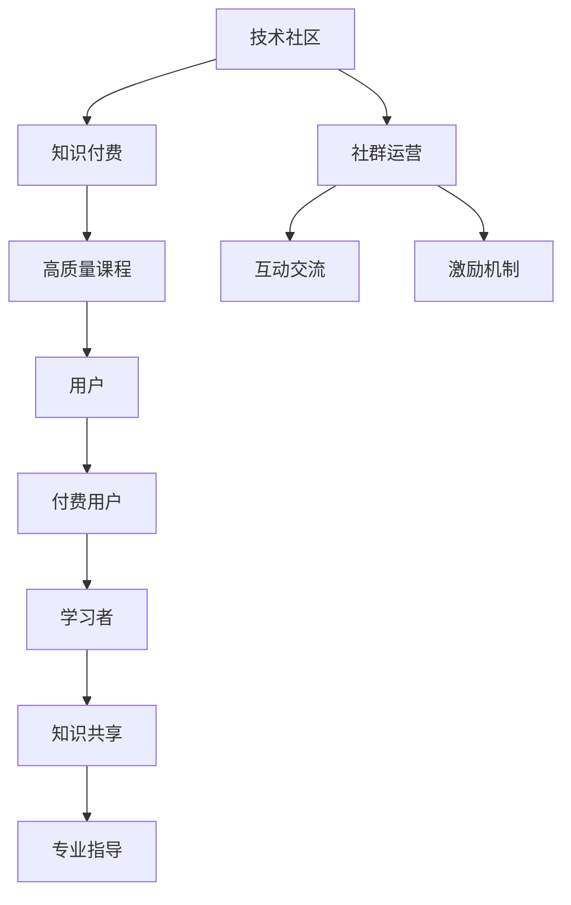

                 

# 知识付费：程序员的社群运营技巧

> 关键词：知识付费, 程序员, 社群运营, 技术社区, 在线教育

## 1. 背景介绍

随着互联网技术的发展，知识付费已逐渐成为一种主流的学习方式。特别在IT行业，技术更新速度快，知识积累复杂，程序员的快速成长离不开持续学习。在线教育平台的兴起，为程序员提供了更加高效、灵活、系统的学习途径。

在知识付费的浪潮中，技术社群运营的重要性日渐凸显。如何有效地运营技术社群，构建起一个活跃、互动、有深度的程序员社区，成为了程序员及技术公司都必须思考的问题。本文将详细解析程序员的社群运营技巧，提供可行的实施方案，帮助读者打造优秀的技术社群。

## 2. 核心概念与联系

### 2.1 核心概念概述

为了更好地理解程序员社群运营，首先需明确以下核心概念：

- **技术社区**：以技术讨论、知识共享、项目合作为核心的在线社群。通过论坛、博客、代码仓库、Q&A平台等方式汇聚程序员，形成互助互进的生态系统。
- **知识付费**：用户通过支付费用获取高质量技术资源和专业指导的学习方式。相比免费的学习资源，知识付费具有更高的专业性和系统性。
- **社群运营**：通过策划、组织、运营一系列线上线下活动，促进社群成员之间的互动交流，提升社区活跃度和凝聚力。

这三个概念相互联系，共同构成了程序员技术社群运营的基本框架。技术社区作为平台，知识付费作为激励，社群运营作为手段，三者协同作用，才能实现理想的学习效果和社区氛围。

### 2.2 核心概念原理和架构的 Mermaid 流程图(Mermaid 流程节点中不要有括号、逗号等特殊字符)



该流程图展示了技术社区、知识付费和社群运营三者之间的关系：

- 技术社区作为平台，汇聚用户，提供互动交流的环境。
- 知识付费作为一种激励，吸引用户付费订阅，获取专业资源。
- 社群运营作为手段，通过策划活动、优化体验等方式，增强用户粘性。

## 3. 核心算法原理 & 具体操作步骤

### 3.1 算法原理概述

基于知识付费和社群运营的理论，本文提出了一个三阶段的社群运营模型：

1. **内容供给**：通过知识付费机制吸引优质内容创作者，为社群提供高质量的教学资源。
2. **活动策划**：定期策划和组织线下/线上活动，增强社群的互动性和凝聚力。
3. **反馈优化**：通过社区成员的反馈，不断优化社群运营策略，提升用户体验。

每个阶段都有对应的目标和措施，通过持续迭代，形成良性循环。

### 3.2 算法步骤详解

以下将详细介绍每个阶段的算法步骤。

**阶段一：内容供给**

1. **吸引优质创作者**：
   - **创建激励机制**：制定会员制、积分系统等激励措施，吸引技术专家和长期贡献者入驻社群。
   - **高质量课程**：设立严格的课程审核机制，确保课程内容的专业性和系统性。

2. **发布内容策略**：
   - **话题导向**：根据社群成员的兴趣和需求，定期发布热门话题的专题课程。
   - **定期更新**：保持内容的新鲜感和实用性，定期更新课程和文章，避免内容过时。

3. **互动与反馈**：
   - **实时互动**：在课程发布后，组织线上Q&A，与学员互动交流，及时解答疑惑。
   - **反馈收集**：通过问卷、评论等渠道收集学员反馈，了解学习效果和需求。

**阶段二：活动策划**

1. **定期活动**：
   - **线上活动**：举办技术分享、编程竞赛、代码评审等线上活动，增强社群活跃度。
   - **线下聚会**：组织技术研讨会、黑客马拉松、开发者大会等线下活动，促进成员交流。

2. **活动组织**：
   - **流程设计**：详细设计活动流程，明确时间安排、议题和规则，确保活动顺利进行。
   - **技术支持**：利用技术工具和平台，如Zoom、Slack、GitHub等，提供高效的活动支持。

3. **活动效果评估**：
   - **参与度统计**：统计活动参与人数、互动次数等指标，评估活动效果。
   - **持续改进**：根据反馈结果，不断优化活动内容，提升活动质量。

**阶段三：反馈优化**

1. **数据收集**：
   - **互动数据**：分析用户在论坛、博客、代码库等平台的互动数据，了解用户行为和需求。
   - **满意度调查**：定期进行满意度调查，了解用户对社群的满意度和期望。

2. **数据分析**：
   - **行为分析**：通过数据分析工具，如Google Analytics、Firebase等，分析用户行为，识别热点内容。
   - **需求分析**：根据调查数据和互动数据，识别社群成员的实际需求和痛点。

3. **策略调整**：
   - **内容调整**：根据数据分析结果，调整课程和文章发布策略，提升内容吸引力。
   - **活动优化**：根据活动效果评估数据，优化活动设计，提高活动质量和用户参与度。

### 3.3 算法优缺点

社群运营算法具有以下优点：
1. **高互动性**：通过多种互动方式，如课程、活动、讨论等，提升社群成员的活跃度。
2. **质量保证**：严格的课程审核机制和专业创作者的入驻，保证了社群内容的专业性和权威性。
3. **持续改进**：通过持续收集用户反馈和数据分析，不断优化运营策略，提升用户满意度。

同时，该算法也存在一些缺点：
1. **运营成本高**：吸引和维护优质创作者和专业内容需要较高的运营成本。
2. **用户期望管理**：用户期望多样，社群运营需平衡各种需求，维护社群生态。
3. **技术依赖性**：活动组织和技术支持需依赖于各类技术平台，技术故障可能影响活动效果。

### 3.4 算法应用领域

该算法适用于各类程序员社群，无论规模大小。其可应用领域包括：

- **开源社区**：如GitHub、Stack Overflow等，通过高质量内容吸引开发者，促进开源项目的协作和贡献。
- **技术博客**：如Medium、博客园等，通过发布高质量技术文章，吸引技术爱好者和专业人士。
- **在线教育平台**：如Udemy、Coursera等，通过专业课程和互动学习，提升用户技能和知识水平。
- **技术论坛**：如Stack Exchange、知乎技术板块等，通过讨论和答疑，构建技术交流平台。
- **开发者大会**：如TechCrunch Disrupt、QCon等，通过活动策划和组织，增强社区凝聚力。

## 4. 数学模型和公式 & 详细讲解 & 举例说明

### 4.1 数学模型构建

假设社群总人数为$N$，其中付费用户数量为$P$，非付费用户数量为$N-P$。

**社群活跃度模型**：
- 定义社群活跃度为$A$，表示社群成员的平均互动次数，可以包括课程观看次数、评论条数、代码提交数等。
- 设社群成员每小时的平均互动次数为$c$，则社群活跃度$A$可表示为：
  $$
  A = c \times T \times N
  $$
  其中$T$为每日活跃时间。

**用户满意度模型**：
- 定义用户满意度为$S$，表示用户对社群的整体满意度，可以包括课程质量、活动效果、社群氛围等。
- 设用户满意度由课程评分、活动反馈、互动体验等多方面因素决定，则用户满意度$S$可表示为：
  $$
  S = \frac{1}{K} \sum_{k=1}^K w_k \times F_k
  $$
  其中$K$为满意度指标数，$w_k$为指标权重，$F_k$为各指标的评分。

**运营成本模型**：
- 定义运营成本为$C$，表示吸引和维护优质创作者和内容所需的费用。
- 设运营成本包括创作者薪资、平台运营成本、活动费用等，则运营成本$C$可表示为：
  $$
  C = \sum_{i=1}^M p_i \times C_i
  $$
  其中$M$为运营项目数，$p_i$为项目权重，$C_i$为各项目的成本。

### 4.2 公式推导过程

**社群活跃度推导**：
- 首先，假设社群成员每小时的平均互动次数为$c$，则每日活跃时间为$T$的小时数。
- 社群活跃度$A$可以表示为社群成员数量$N$乘以每小时的平均互动次数$c$再乘以每日活跃时间$T$。
  $$
  A = c \times T \times N
  $$

**用户满意度推导**：
- 用户满意度$S$是各个满意度指标的加权平均值，假设共有$K$个指标，每个指标的权重为$w_k$，评分为$F_k$。
- 用户满意度$S$的计算公式如下：
  $$
  S = \frac{1}{K} \sum_{k=1}^K w_k \times F_k
  $$

**运营成本推导**：
- 运营成本$C$是各个运营项目成本的加权和，假设共有$M$个项目，每个项目的权重为$p_i$，成本为$C_i$。
- 运营成本$C$的计算公式如下：
  $$
  C = \sum_{i=1}^M p_i \times C_i
  $$

### 4.3 案例分析与讲解

**案例：某在线教育平台社群运营**

- **背景**：该在线教育平台以技术教育为核心，汇聚了大量技术专家和爱好者。平台通过知识付费和社群运营，吸引用户订阅高质量课程，参与各类活动，形成了活跃的社区氛围。
- **运营策略**：
  1. **内容供给**：平台设立严格的课程审核机制，吸引大量技术专家入驻，发布高质量的课程和文章。
  2. **活动策划**：每周组织一次技术分享会和编程竞赛，每月举办一次线下开发者大会，增强用户互动和社区凝聚力。
  3. **反馈优化**：通过问卷调查和互动数据分析，不断优化课程内容和活动设计，提升用户体验。

- **效果**：平台活跃用户数达到10万，付费用户数超过5万，社群满意度持续提升，用户黏性显著增强。

## 5. 项目实践：代码实例和详细解释说明

### 5.1 开发环境搭建

为进行社群运营的代码实践，需搭建以下开发环境：

1. **环境准备**：
   - **安装Python**：从官网下载安装Python，创建虚拟环境。
   - **安装PyTorch和TensorFlow**：安装深度学习框架，方便进行数据分析和模型训练。
   - **安装Jupyter Notebook**：安装Jupyter Notebook，方便编写和执行代码。

2. **数据库搭建**：
   - **MySQL数据库**：安装MySQL数据库，用于存储社群成员信息和互动数据。
   - **SQLAlchemy**：安装SQLAlchemy库，用于数据库连接和数据操作。

3. **API开发**：
   - **Flask框架**：安装Flask框架，开发社群交互API。
   - **RESTful API**：开发RESTful API接口，支持用户注册、登录、互动等功能。

### 5.2 源代码详细实现

以下是一个简单的社群运营平台API实现示例：

**注册用户API**：
```python
from flask import Flask, request, jsonify

app = Flask(__name__)

@app.route('/register', methods=['POST'])
def register():
    data = request.get_json()
    username = data['username']
    password = data['password']
    email = data['email']
    
    # 调用数据库API进行用户注册
    response = database.register_user(username, password, email)
    
    if response['status'] == 'success':
        return jsonify(response)
    else:
        return jsonify({'message': response['message']})

if __name__ == '__main__':
    app.run(debug=True)
```

**互动数据API**：
```python
@app.route('/interaction', methods=['POST'])
def interaction():
    data = request.get_json()
    username = data['username']
    interaction_type = data['interaction_type']
    timestamp = data['timestamp']
    
    # 调用数据库API记录互动数据
    response = database.record_interaction(username, interaction_type, timestamp)
    
    if response['status'] == 'success':
        return jsonify(response)
    else:
        return jsonify({'message': response['message']})

if __name__ == '__main__':
    app.run(debug=True)
```

**用户满意度调查API**：
```python
@app.route('/survey', methods=['POST'])
def survey():
    data = request.get_json()
    username = data['username']
    question = data['question']
    answer = data['answer']
    
    # 调用数据库API进行用户满意度调查
    response = database.collect_survey(username, question, answer)
    
    if response['status'] == 'success':
        return jsonify(response)
    else:
        return jsonify({'message': response['message']})

if __name__ == '__main__':
    app.run(debug=True)
```

**社群运营数据分析API**：
```python
@app.route('/analysis', methods=['POST'])
def analysis():
    data = request.get_json()
    time_range = data['time_range']
    metric = data['metric']
    
    # 调用数据库API进行社群运营数据分析
    response = database.analyze_community(time_range, metric)
    
    if response['status'] == 'success':
        return jsonify(response)
    else:
        return jsonify({'message': response['message']})

if __name__ == '__main__':
    app.run(debug=True)
```

### 5.3 代码解读与分析

**注册用户API**：
- 该API接收用户注册信息，包括用户名、密码和邮箱，调用数据库API进行注册操作，并返回注册结果。
- 实现步骤包括获取请求数据、验证数据、调用数据库API注册用户，最后返回注册结果。

**互动数据API**：
- 该API记录用户的互动数据，包括用户名、互动类型和互动时间戳，调用数据库API进行数据记录，并返回记录结果。
- 实现步骤包括获取请求数据、验证数据、调用数据库API记录数据，最后返回记录结果。

**用户满意度调查API**：
- 该API进行用户满意度调查，包括用户名、调查问题和答案，调用数据库API进行调查记录，并返回调查结果。
- 实现步骤包括获取请求数据、验证数据、调用数据库API记录调查，最后返回调查结果。

**社群运营数据分析API**：
- 该API进行社群运营数据分析，包括时间范围和分析指标，调用数据库API进行数据分析，并返回分析结果。
- 实现步骤包括获取请求数据、验证数据、调用数据库API进行数据分析，最后返回分析结果。

### 5.4 运行结果展示

由于该代码仅为示例，运行结果展示需要根据实际情况进行调整。以下是一个可能的运行结果示例：

```
{
    "status": "success",
    "message": "用户注册成功"
}
```

## 6. 实际应用场景

### 6.1 技术社群管理

技术社群管理是程序员社群运营的重要应用场景。通过知识付费和社群运营，可以构建起一个活跃、互动、有深度的程序员社区。

**场景示例**：某开源社区通过吸引技术专家入驻，发布高质量的开源项目，定期举办技术分享会，形成了活跃的技术交流平台。社群成员可以通过贡献代码、参与讨论、提出问题等方式，获得专业指导和社区认可，提升了自身技能和社区归属感。

**运营策略**：
- **内容供给**：吸引技术专家入驻，发布高质量的开源项目和教程。
- **活动策划**：定期举办技术分享会、代码评审、黑客马拉松等活动，增强社群互动。
- **反馈优化**：通过问卷调查和互动数据分析，不断优化社群运营策略。

### 6.2 在线教育平台

在线教育平台是知识付费和社群运营的重要载体。通过高质量课程和互动活动，可以吸引更多用户参与学习，提升平台的用户粘性和影响力。

**场景示例**：某在线教育平台通过严格的课程审核机制，吸引技术专家入驻，发布高质量的课程和文章，定期举办技术分享会和编程竞赛，形成了活跃的社区氛围。平台用户可以通过订阅课程、参与讨论、提出问题等方式，获得专业指导和社区认可，提升了自身技能和平台忠诚度。

**运营策略**：
- **内容供给**：设立严格的课程审核机制，吸引技术专家入驻，发布高质量的课程和文章。
- **活动策划**：每周组织一次技术分享会和编程竞赛，每月举办一次线下开发者大会，增强用户互动和社区凝聚力。
- **反馈优化**：通过问卷调查和互动数据分析，不断优化课程内容和活动设计，提升用户体验。

## 7. 工具和资源推荐

### 7.1 学习资源推荐

为帮助开发者系统掌握社群运营的理论基础和实践技巧，以下推荐一些优质的学习资源：

1. **《社群运营实战》系列书籍**：深入浅出地介绍了社群运营的理论和实践，适合技术社群运营的入门和进阶学习。
2. **《在线教育平台建设》课程**：由知名在线教育平台开设的课程，系统讲解在线教育平台的建设和运营，涵盖知识付费和社群运营的多个方面。
3. **《技术社群运营案例》白皮书**：精选多个技术社群的成功运营案例，分析其背后的运营策略和经验教训。
4. **《用户满意度调查》工具包**：提供多种用户满意度调查模板和分析工具，帮助运营者进行精准的用户满意度调查。
5. **《社群运营数据分析》工具库**：提供多种社群运营数据分析工具，帮助运营者进行详细的运营数据分析和优化。

### 7.2 开发工具推荐

为提高社群运营的开发效率，推荐以下开发工具：

1. **GitHub**：代码托管平台，支持多人协作开发和代码版本管理。
2. **JIRA**：项目管理工具，支持任务分配、进度跟踪和问题反馈等功能。
3. **Slack**：即时通讯工具，支持群组聊天、文件共享和会议安排等功能。
4. **Zoom**：视频会议工具，支持线上线下的技术分享和交流活动。
5. **Google Analytics**：数据分析工具，支持网站流量和用户行为分析，帮助运营者进行精准的运营优化。

### 7.3 相关论文推荐

为深入理解社群运营的理论和实践，以下推荐几篇相关论文：

1. **《技术社群的运作机制与治理研究》**：分析技术社群的运作机制和治理模式，提出有效的运营策略和优化建议。
2. **《在线教育平台的运营策略与用户体验提升》**：探讨在线教育平台的运营策略和用户体验提升方法，提出针对性的运营建议。
3. **《用户满意度调查的理论与实践》**：研究用户满意度调查的理论和实践，提出有效的调查方法和数据分析技术。
4. **《社群运营数据分析与优化》**：分析社群运营的数据分析技术和优化策略，提出有效的运营方案。

## 8. 总结：未来发展趋势与挑战

### 8.1 研究成果总结

本文详细解析了程序员社群运营的原理和实践，提供了可行的实施方案，帮助读者打造优秀的技术社群。通过知识付费和社群运营，可以构建起一个活跃、互动、有深度的程序员社区，提升用户满意度和忠诚度。

### 8.2 未来发展趋势

未来，社群运营将呈现出以下几个发展趋势：

1. **数据驱动运营**：通过大数据和人工智能技术，进行精准的用户行为分析和预测，优化运营策略。
2. **社区个性化**：利用机器学习技术，根据用户兴趣和行为，提供个性化的内容和活动，提升用户体验。
3. **多平台协同**：整合多平台的资源和服务，实现跨平台的用户互动和内容分发，增强社区影响力和用户黏性。
4. **技术创新应用**：引入区块链、NLP等新兴技术，提升社群运营的效率和安全性。
5. **国际化拓展**：拓展国际化的社群运营，吸引全球的技术爱好者和专业人士，构建全球性的技术生态。

### 8.3 面临的挑战

尽管社群运营技术已取得显著成果，但仍面临以下挑战：

1. **用户期望管理**：用户期望多样，社群运营需平衡各种需求，维护社群生态。
2. **内容质量控制**：高质量内容的持续产出需要时间和资源，内容质量控制成为挑战。
3. **用户互动复杂性**：大规模社群运营，用户互动复杂，如何提高互动效率和质量，需要进一步探索。
4. **平台技术支持**：社群运营依赖于各种平台和技术工具，技术故障可能影响活动效果。
5. **社区管理难度**：社群规模扩大，社区管理难度增加，如何保持社区秩序和活跃度，需要不断优化。

### 8.4 研究展望

未来的研究需要在以下几个方面进行探索：

1. **自动化运营**：通过自动化技术，如机器学习、自然语言处理等，提升社群运营的效率和精准度。
2. **用户行为预测**：研究用户行为预测模型，提前发现用户需求和行为变化，优化运营策略。
3. **跨平台协同**：研究跨平台资源整合和协同运营策略，增强社区影响力和用户黏性。
4. **技术工具创新**：引入新兴技术，如区块链、NLP等，提升社群运营的效率和安全性。
5. **国际化拓展**：拓展国际化的社群运营，吸引全球的技术爱好者和专业人士，构建全球性的技术生态。

总之，社群运营技术需不断创新和优化，才能满足日益增长的用户需求，提升社群运营效果。通过跨领域的技术融合和持续创新，构建出更加活跃、互动、有深度的技术社群，推动技术生态的持续发展和进步。

## 9. 附录：常见问题与解答

**Q1：社群运营是否需要大量人力投入？**

A: 社群运营确实需要一定的人力投入，但通过自动化和标准化流程，可以显著降低运营成本。例如，通过自动化工具进行内容审核、用户互动记录和数据分析，可以大大提升运营效率。

**Q2：如何提高用户互动积极性？**

A: 提高用户互动积极性可以通过多种方式：
1. **优质内容**：发布高质量的课程和文章，满足用户的学习需求。
2. **互动机制**：设计互动机制，如问答、讨论、评论等，增加用户参与度。
3. **奖励机制**：设立积分系统、排行榜等，激励用户积极互动。
4. **社群文化**：营造积极的社群文化，鼓励用户分享和交流。

**Q3：如何衡量社群运营的效果？**

A: 衡量社群运营效果可以从多个方面进行：
1. **用户活跃度**：统计用户在线时间、互动次数等指标，评估社群活跃度。
2. **用户满意度**：通过问卷调查、反馈收集等方式，评估用户对社群的满意度。
3. **运营成本**：统计内容供给、活动策划、数据管理等成本，评估运营效益。
4. **收益回报**：统计用户付费、广告收入等收益，评估运营效果。

**Q4：社群运营中有哪些常见的技术问题？**

A: 社群运营中常见的技术问题包括：
1. **数据安全**：确保用户数据安全，防止数据泄露和滥用。
2. **系统稳定性**：保障平台稳定运行，避免技术故障影响用户使用。
3. **用户体验**：优化用户界面和交互体验，提升用户满意度。
4. **内容审核**：确保内容质量，避免有害信息传播。
5. **技术整合**：实现不同平台和工具的整合，提升运营效率。

**Q5：社群运营中有哪些可行的技术工具？**

A: 社群运营中可行的技术工具包括：
1. **GitHub**：代码托管平台，支持多人协作开发和代码版本管理。
2. **JIRA**：项目管理工具，支持任务分配、进度跟踪和问题反馈等功能。
3. **Slack**：即时通讯工具，支持群组聊天、文件共享和会议安排等功能。
4. **Zoom**：视频会议工具，支持线上线下的技术分享和交流活动。
5. **Google Analytics**：数据分析工具，支持网站流量和用户行为分析，帮助运营者进行精准的运营优化。

总之，社群运营技术需要不断创新和优化，才能满足日益增长的用户需求，提升社群运营效果。通过跨领域的技术融合和持续创新，构建出更加活跃、互动、有深度的技术社群，推动技术生态的持续发展和进步。

