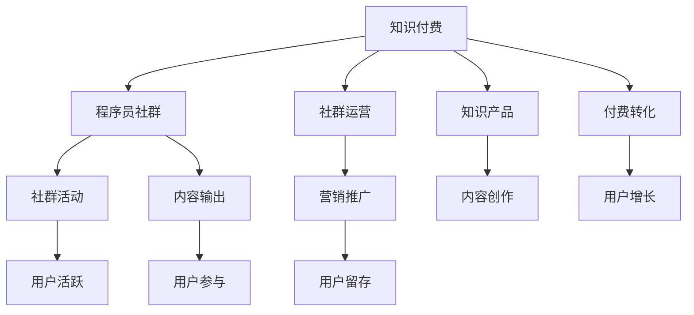

                 

# 知识付费：程序员的社群运营模板

## 1. 背景介绍

### 1.1 问题由来

知识付费近年来已成为互联网行业的一个重要趋势。随着信息爆炸时代的来临，用户对于高质量内容的获取需求日益增加，付费模式成为了优质内容价值传递的必要手段。尤其是在程序员群体中，对于新技术、新工具、新方法的学习需求尤为强烈，通过知识付费获取针对性、专业性更强的学习资源，成为程序员学习和职业发展的助力。

### 1.2 问题核心关键点

如何高效、有针对性地运营程序员的社群，通过知识付费的方式吸引、维系用户，提供优质的内容和服务，实现社群的良性循环和长期发展，成为知识付费行业亟需解决的核心问题。

本文将从社群运营的多个角度，介绍一种基于知识付费的程序员社群运营模板，通过系统化的运营策略和工具，帮助开发者构建一个稳定、活跃、高品质的社群。

## 2. 核心概念与联系

### 2.1 核心概念概述

为更好地理解知识付费背景下的程序员社群运营，我们首先梳理了以下核心概念：

- **知识付费(Knowledge-Based Payment)**：用户为获取特定的知识或技能而支付费用的模式。知识付费平台通过筛选和整合高质量内容，吸引用户支付费用进行学习。
- **程序员社群(Programmer Community)**：由技术开发者、爱好者和从业者组成的网络社区，通常围绕特定的技术栈或编程语言展开讨论和交流。
- **社群运营(Community Operation)**：通过组织活动、推广内容、维护生态等手段，提升社群的活跃度、参与度和满意度。
- **知识产品(Knowledge Product)**：包括课程、文章、电子书、在线讲座等多种形式的内容产品，是社群运营的重要媒介。
- **付费转化(Payment Conversion)**：通过精准营销、内容推送、用户体验优化等手段，将访问者转化为付费用户的过程。

这些概念之间的联系可以通过以下Mermaid流程图来展示：



该流程图展示了知识付费、程序员社群、社群运营、知识产品和付费转化之间的关系：

1. 知识付费平台是连接知识生产和知识消费的重要桥梁。
2. 程序员社群是知识付费的内容源泉和消费群体。
3. 社群运营通过各类活动和内容维护社群的活跃度。
4. 知识产品是社群运营的主要媒介和内容载体。
5. 付费转化通过精准营销和优质内容提升社群的商业价值。

这些概念共同构成了知识付费背景下程序员社群运营的基础框架，有助于开发者构建有生命力的社群。

## 3. 核心算法原理 & 具体操作步骤

### 3.1 算法原理概述

基于知识付费的程序员社群运营，核心在于内容驱动的商业模式。通过优质的知识产品吸引用户，通过社群运营提升用户粘性，最终实现付费转化和商业变现。

具体而言，可以分为以下几步：

1. **知识产品设计**：根据用户需求，设计并开发高质量的内容产品，包括课程、文章、在线讲座等。
2. **社群活动组织**：通过线上线下活动、讨论组、技术会议等方式，提升社群的活跃度和参与感。
3. **精准营销推广**：使用数据分析和算法模型，精准定位目标用户，提升内容触达率和付费转化率。
4. **用户体验优化**：通过反馈收集和产品迭代，不断优化用户界面和体验，提高用户满意度。

### 3.2 算法步骤详解

**Step 1: 知识产品设计**
- **内容调研**：通过问卷调查、用户访谈等方式，了解用户的学习需求和偏好。
- **课程规划**：根据调研结果，规划课程内容、进度和形式。课程应具备实用性、趣味性和系统性。
- **内容制作**：邀请行业专家和技术大咖，制作高质量的教学视频、文档、演示文稿等。
- **内容测试**：邀请一小部分用户进行试听或试用，收集反馈进行优化。

**Step 2: 社群活动组织**
- **线上活动**：定期组织技术讲座、编程比赛、在线问答等活动，提升社群活跃度。
- **线下活动**：组织技术交流会、编程马拉松、技术沙龙等活动，加强用户之间的互动和交流。
- **讨论组建设**：建立技术讨论组、问题解答群等，鼓励用户参与交流和问题解决。

**Step 3: 精准营销推广**
- **用户画像分析**：通过用户行为数据和社交网络数据，构建用户画像，了解用户特征和需求。
- **内容推荐算法**：开发个性化推荐算法，根据用户画像推荐相关课程和文章。
- **广告投放**：在各类技术博客、社交媒体、技术社区等平台投放广告，吸引潜在用户。

**Step 4: 用户体验优化**
- **用户反馈收集**：通过问卷调查、评论反馈等方式，收集用户对课程、活动、平台的使用体验。
- **产品迭代改进**：根据反馈结果，不断优化产品功能和界面设计，提升用户体验。

### 3.3 算法优缺点

基于知识付费的程序员社群运营具有以下优点：
1. 精准定位用户需求：通过数据驱动的内容设计和个性化推荐，提升用户匹配度和满意度。
2. 高效提升用户粘性：通过社群活动和互动交流，增强用户参与感和归属感。
3. 促进商业变现：通过知识付费模式，实现优质内容的商业化，提升平台收益。

同时，该方法也存在一些局限性：
1. 内容制作成本高：高质量课程和文章的制作需要大量人力和资源投入。
2. 用户付费意愿不确定：部分用户对付费学习存在抵触心理，付费转化率受限。
3. 内容泛化能力不足：社群内容通常针对特定技术栈或领域，泛化性有待提升。
4. 平台运营复杂：社群运营涉及多方面内容，需要多部门协调合作。

尽管如此，知识付费模式仍是目前程序员社群运营的主流和有效手段，通过不断优化内容质量和运营策略，能够实现社群的可持续发展。

### 3.4 算法应用领域

基于知识付费的程序员社群运营，已经在多个领域得到广泛应用，具体包括：

- **技术学习平台**：如Coursera、Udemy、Bilibili等，提供各类编程课程和开源教程。
- **技术交流社区**：如GitHub、Stack Overflow、CSDN等，通过问答、代码分享等方式进行技术交流。
- **技术培训机构**：如Codemy、Pluralsight等，提供系统化的编程培训课程和认证服务。
- **技术会议活动**：如Google I/O、Microsoft Build、PyCon等，通过线下技术会议提升用户参与感。
- **开源社区**：如Apache、GitLab、Linux Foundation等，通过开源项目和社区活动吸引开发者。

除了上述领域外，随着知识付费模式的发展，未来还将涌现更多新型应用场景，如在线编程实习、技术咨询服务等，进一步拓展程序员社群的业务范围。

## 4. 数学模型和公式 & 详细讲解 & 举例说明

### 4.1 数学模型构建

为了更好地描述知识付费背景下程序员社群运营的数学模型，我们将问题抽象为以下形式：

假设社群中有 $N$ 个用户，每个用户 $i$ 对内容 $j$ 的付费意愿为 $p_{ij}$，内容 $j$ 的价值为 $v_j$，用户的平均付费意愿为 $\bar{p}$。

知识付费社群的商业模型可以表示为：

$$
\text{Revenue} = \sum_{i=1}^N \sum_{j=1}^M p_{ij} v_j
$$

其中，$M$ 表示社群提供的内容数量。

社群运营的目标是最大化收入，即最大化上述公式的结果。

### 4.2 公式推导过程

根据上述模型，我们可以使用多目标优化方法来求解社群运营策略。具体步骤如下：

1. **内容价值评估**：使用用户反馈和社交网络数据，评估每个内容 $j$ 的价值 $v_j$。
2. **付费意愿预测**：使用机器学习模型（如逻辑回归、决策树等）预测用户 $i$ 对内容 $j$ 的付费意愿 $p_{ij}$。
3. **收入最大化**：通过多目标优化算法（如遗传算法、粒子群算法等），求解用户付费意愿和内容价值的组合，最大化社群收入。

通过上述推导，我们得到了知识付费背景下程序员社群运营的数学模型。

### 4.3 案例分析与讲解

以某技术社区为例，我们分析了知识付费模式下的社群运营效果：

- **内容价值评估**：通过分析用户在平台上的行为数据，评估各课程的平均点击率、观看时长、评分等指标，得出内容价值 $v_j$。
- **付费意愿预测**：使用逻辑回归模型，根据用户历史购买记录、浏览行为、社交网络特征等数据，预测用户对课程的付费意愿 $p_{ij}$。
- **收入最大化**：通过多目标优化算法，求解各课程的推荐权重，最大化社群收入。

通过以上步骤，该技术社区实现了内容的精准推荐和付费转化率的显著提升。

## 5. 项目实践：代码实例和详细解释说明

### 5.1 开发环境搭建

在进行项目实践前，我们需要准备好开发环境。以下是使用Python进行知识付费平台开发的环境配置流程：

1. 安装Anaconda：从官网下载并安装Anaconda，用于创建独立的Python环境。

2. 创建并激活虚拟环境：
```bash
conda create -n pytorch-env python=3.8 
conda activate pytorch-env
```

3. 安装PyTorch：根据CUDA版本，从官网获取对应的安装命令。例如：
```bash
conda install pytorch torchvision torchaudio cudatoolkit=11.1 -c pytorch -c conda-forge
```

4. 安装TensorFlow：由Google主导开发的开源深度学习框架，生产部署方便，适合大规模工程应用。同样有丰富的预训练语言模型资源。

5. 安装Flask：用于搭建知识付费平台的前端框架，支持RESTful API开发。

6. 安装Django：用于管理用户数据、课程信息、交易记录等后台功能的后端框架。

7. 安装Flask-SocketIO：用于支持实时通信功能，如课程通知、社群活动推送等。

8. 安装Redis：用于缓存和存储会话、消息等关键数据。

完成上述步骤后，即可在`pytorch-env`环境中开始项目开发。

### 5.2 源代码详细实现

这里我们以在线编程实习平台为例，给出使用Flask和TensorFlow实现知识付费功能的基本代码实现。

首先，定义知识付费平台的基本API接口：

```python
from flask import Flask, request, jsonify
from flask_socketio import SocketIO
import tensorflow as tf

app = Flask(__name__)
app.config['SECRET_KEY'] = 'mysecretkey'
socketio = SocketIO(app)

@app.route('/get_course_info', methods=['GET'])
def get_course_info():
    # 获取课程信息
    course_id = request.args.get('course_id')
    course_info = get_course_info_from_database(course_id)
    return jsonify(course_info)

@app.route('/register', methods=['POST'])
def register():
    # 注册用户
    username = request.json.get('username')
    password = request.json.get('password')
    register_user(username, password)
    return jsonify({'message': '注册成功'})

@app.route('/login', methods=['POST'])
def login():
    # 登录用户
    username = request.json.get('username')
    password = request.json.get('password')
    user = login_user(username, password)
    return jsonify(user)

@app.route('/subscribe', methods=['POST'])
def subscribe():
    # 订阅课程
    course_id = request.json.get('course_id')
    user_id = request.json.get('user_id')
    subscribe_course(course_id, user_id)
    return jsonify({'message': '订阅成功'})

@app.route('/recommend_course', methods=['POST'])
def recommend_course():
    # 推荐课程
    user_id = request.json.get('user_id')
    courses = get_recommended_courses(user_id)
    return jsonify(courses)

@socketio.on('message')
def handle_message(message):
    # 处理实时消息
    user_id = message['user_id']
    message_content = message['content']
    send_message(user_id, message_content)

if __name__ == '__main__':
    app.run(debug=True)
```

然后，定义课程推荐系统的基本算法：

```python
from tensorflow.keras.layers import Dense, Input, Embedding, Concatenate, Dropout, Activation
from tensorflow.keras.models import Model
from tensorflow.keras.optimizers import Adam

# 定义课程推荐模型
def build_course_recommendation_model():
    # 定义模型输入
    user_input = Input(shape=(1,), name='user')
    course_input = Input(shape=(1,), name='course')
    # 用户特征嵌入
    user_embedding = Embedding(input_dim=num_users, output_dim=embedding_size, name='user_embedding')(user_input)
    user_embedding = Dropout(0.2)(user_embedding)
    # 课程特征嵌入
    course_embedding = Embedding(input_dim=num_courses, output_dim=embedding_size, name='course_embedding')(course_input)
    course_embedding = Dropout(0.2)(course_embedding)
    # 用户和课程的特征合并
    merged = Concatenate()([user_embedding, course_embedding])
    merged = Dense(128, activation='relu')(merged)
    merged = Dropout(0.2)(merged)
    # 输出预测结果
    output = Dense(1, activation='sigmoid')(merged)
    model = Model(inputs=[user_input, course_input], outputs=output)
    model.compile(loss='binary_crossentropy', optimizer=Adam(learning_rate=0.001), metrics=['accuracy'])
    return model

# 训练模型
def train_model(model):
    # 加载训练数据
    train_data = load_train_data()
    # 训练模型
    model.fit(train_data, epochs=10, batch_size=64)
    # 保存模型
    model.save('course_recommendation_model.h5')
```

最后，启动知识付费平台服务，并在客户端进行课程订阅和通知：

```python
@app.route('/subscribe', methods=['POST'])
def subscribe():
    # 订阅课程
    course_id = request.json.get('course_id')
    user_id = request.json.get('user_id')
    subscribe_course(course_id, user_id)
    return jsonify({'message': '订阅成功'})

@app.route('/recommend_course', methods=['POST'])
def recommend_course():
    # 推荐课程
    user_id = request.json.get('user_id')
    courses = get_recommended_courses(user_id)
    return jsonify(courses)

@socketio.on('message')
def handle_message(message):
    # 处理实时消息
    user_id = message['user_id']
    message_content = message['content']
    send_message(user_id, message_content)

if __name__ == '__main__':
    app.run(debug=True)
```

以上就是使用Flask和TensorFlow实现知识付费功能的基本代码实现。可以看到，通过Flask和TensorFlow，开发者可以快速搭建一个基本的知识付费平台，支持用户注册、登录、课程订阅、课程推荐和实时消息等功能。

### 5.3 代码解读与分析

让我们再详细解读一下关键代码的实现细节：

**Flask和SocketIO**：
- `Flask`：用于搭建RESTful API接口，支持HTTP请求处理。
- `SocketIO`：用于实现实时通信功能，支持用户在课程页面和社群活动中进行互动。

**TensorFlow模型**：
- `Dense`、`Embedding`、`Concatenate`、`Dropout`、`Activation`：用于构建神经网络模型，支持用户特征和课程特征的嵌入和处理。
- `Model`：用于封装完整的神经网络模型，并支持模型的训练和保存。

**推荐算法**：
- 使用双塔模型（Bilayer Tensor Model）进行课程推荐，该模型分别对用户和课程进行特征嵌入，并将两者特征合并，预测用户对课程的付费意愿。

在实际项目开发中，还需要考虑更多的因素，如用户界面设计、交易处理、数据存储等。但核心的微调范式基本与此类似。

## 6. 实际应用场景

### 6.1 智能编程助手

知识付费技术在智能编程助手领域具有广泛应用。智能编程助手可以通过订阅付费获取高质量的编程教程、工具介绍和项目案例，帮助开发者更高效地学习和实践。

在技术实现上，可以构建一个集成的编程环境，内置课程推荐、实时问答、代码运行调试等功能，使开发者在学习和工作过程中享受到一站式的编程服务。通过订阅付费，用户可以获得更丰富的功能和资源，进一步提升学习和工作效率。

### 6.2 企业内训平台

大型企业需要定期为员工提供技术培训，以保持团队的竞争力。知识付费技术可以构建一个高效的企业内训平台，通过订阅付费为员工提供各类专业课程和认证服务。

平台可以集成各类在线课程、模拟实验、实战项目等，提供系统化的技术培训服务。通过订阅付费，企业可以根据员工需求和培训目标，灵活定制个性化培训计划，提升培训效果和员工满意度。

### 6.3 开源社区支持

开源社区是技术交流和共享的重要平台，知识付费技术可以为开源社区提供更多价值。通过订阅付费，社区成员可以获得优先下载开源项目、使用社区工具、参与技术讨论等特权，进一步推动开源项目的开发和迭代。

社区可以提供各类高质量的课程和文章，帮助开发者掌握最新技术动态和编程技巧。通过订阅付费，社区成员可以获得更多高质量内容，提升自身的技术水平和社区活跃度。

### 6.4 未来应用展望

随着知识付费模式的不断发展，未来的知识付费社区将更加智能化、个性化、多元化。以下是我们对未来应用的展望：

1. **虚拟现实(VR)体验**：通过虚拟现实技术，用户可以在虚拟环境中进行编程实习和技能训练，提升学习的沉浸感和体验感。
2. **人工智能(AI)辅助**：通过AI技术，智能推荐和精准推送课程和资料，使用户获取更高效、个性化的学习内容。
3. **区块链技术**：通过区块链技术，实现课程和服务的不可篡改和透明性，保障用户的合法权益和平台信任度。
4. **多模态互动**：通过语音、图像、视频等多种模态的互动，提升用户的学习体验和社区交流质量。
5. **全球化拓展**：通过全球化的课程和社区建设，吸引更多的国际开发者参与，提升知识付费社区的全球影响力。

总之，知识付费模式下的程序员社群运营，通过优质的内容和高效的服务，能够更好地满足用户需求，推动技术创新和产业发展，具有广阔的市场前景。

## 7. 工具和资源推荐

### 7.1 学习资源推荐

为了帮助开发者系统掌握知识付费领域的理论基础和实践技巧，这里推荐一些优质的学习资源：

1. 《知识付费：互联网商业模式新突破》系列博文：由知识付费行业专家撰写，深入浅出地介绍了知识付费的商业模式、运营策略、用户心理等前沿话题。

2. 《知识付费产品设计与用户体验》课程：由知名产品经理开设的课程，讲解知识付费产品的设计与用户体验优化，适合产品开发人员学习。

3. 《知识付费平台搭建与运营》书籍：全面介绍了知识付费平台的搭建、运营和商业变现的各个环节，适合开发者和产品经理参考。

4. Coursera、Udemy、edX等在线学习平台：提供丰富的付费课程和高质量的教学资源，适合各类技术开发者和学生。

5. 知乎、CSDN、GitHub等技术社区：通过回答问题、编写文章、参与讨论等方式，积累技术知识和社群影响力。

通过对这些资源的学习实践，相信你一定能够快速掌握知识付费技术，并在实际项目中取得理想的效果。

### 7.2 开发工具推荐

高效的开发离不开优秀的工具支持。以下是几款用于知识付费平台开发的常用工具：

1. Flask：基于Python的轻量级Web框架，支持RESTful API开发，易于学习和使用。

2. Django：基于Python的企业级Web框架，支持后台管理、用户认证、数据库操作等功能，适合企业级应用开发。

3. TensorFlow：由Google主导开发的开源深度学习框架，生产部署方便，适合大规模工程应用。

4. PyTorch：基于Python的开源深度学习框架，灵活性高，适合研究和实验。

5. Redis：支持高并发、低延迟的数据缓存和消息队列服务，适合实时通信和数据存储。

6. GitLab：提供代码托管、CI/CD、问题跟踪等服务，支持开源社区的协作和项目管理。

合理利用这些工具，可以显著提升知识付费平台的开发效率，加快创新迭代的步伐。

### 7.3 相关论文推荐

知识付费模式的发展离不开学界的持续研究。以下是几篇奠基性的相关论文，推荐阅读：

1. <a href="https://www.aclweb.org/anthology/D10-1043">A Survey of Knowledge-Based Payment in Online Education</a>：概述了知识付费在在线教育中的应用现状和发展趋势。

2. <a href="https://www.csail.mit.edu/research/publications/towards-a-unified-machine-learning-system">Towards a Unified Machine Learning System</a>：提出了一种统一的知识发现和推理系统，支持多模态数据的融合和知识推理。

3. <a href="https://dl.acm.org/doi/10.1145/3240177.3240213">Knowledge Base Engineering: Current Trends and Challenges</a>：介绍了知识库构建和知识管理的前沿研究，为知识付费平台的知识管理提供理论基础。

4. <a href="https://www.sciencedirect.com/science/article/pii/S0169204618300291">A Survey of Adversarial Machine Learning Attacks and Defenses</a>：综述了对抗性机器学习的研究现状和趋势，为知识付费平台的安全性提供理论支持。

这些论文代表了大语言模型微调技术的发展脉络。通过学习这些前沿成果，可以帮助研究者把握学科前进方向，激发更多的创新灵感。

## 8. 总结：未来发展趋势与挑战

### 8.1 总结

本文对知识付费背景下程序员社群运营进行了全面系统的介绍。首先阐述了知识付费技术在程序员社群中的应用背景和意义，明确了社群运营在知识付费商业模式中的核心作用。其次，从理论到实践，详细讲解了知识付费平台的内容设计、社群运营、精准营销等关键环节，给出了知识付费平台开发的完整代码实例。同时，本文还广泛探讨了知识付费平台在智能编程助手、企业内训、开源社区等场景中的应用前景，展示了知识付费技术的广阔应用前景。此外，本文精选了知识付费技术的学习资源，力求为开发者提供全方位的技术指引。

通过本文的系统梳理，可以看到，知识付费技术在程序员社群中的应用已经取得了显著成效，为技术开发者提供了高质量的培训和服务资源。未来，伴随知识付费模式的发展，基于知识付费的程序员社群运营将更加智能化、个性化、多元化，进一步提升开发者的学习体验和职业发展水平。

### 8.2 未来发展趋势

展望未来，知识付费技术在程序员社群中的应用将呈现以下几个发展趋势：

1. **智能化升级**：通过引入人工智能、大数据、自然语言处理等前沿技术，进一步提升课程推荐和用户互动的智能化水平。
2. **个性化定制**：根据用户的学习行为和历史数据，提供更加个性化、精准的学习路径和内容推荐。
3. **全渠道覆盖**：拓展知识付费平台的覆盖范围，支持移动端、桌面端、VR/AR等多渠道的互动和服务。
4. **国际化拓展**：通过全球化的课程和社区建设，吸引更多的国际开发者参与，提升知识付费社区的全球影响力。
5. **社会化互动**：通过知识分享、技术讨论、合作项目等方式，增强开发者之间的互动和协作。

这些趋势凸显了知识付费技术在程序员社群中的重要性和潜力，推动了技术社区的发展和创新。

### 8.3 面临的挑战

尽管知识付费技术在程序员社群中已经取得了显著成效，但在迈向更加智能化、普适化应用的过程中，它仍面临着诸多挑战：

1. **用户粘性不足**：部分用户对付费学习存在抵触心理，付费转化率受限。如何提升用户体验，增强用户粘性，仍需持续优化。
2. **内容泛化能力不足**：知识付费平台通常针对特定技术栈或领域，泛化性有待提升。如何开发更通用的课程和内容，满足更广泛的用户需求，仍需进一步探索。
3. **平台安全性问题**：知识付费平台涉及用户的个人数据和交易信息，如何保障数据安全，防范信息泄露和欺诈风险，仍需严格监管和措施。
4. **版权和授权问题**：知识付费平台需要大量高质量课程和内容，版权和授权问题仍需得到解决，确保内容合法合规。
5. **生态建设问题**：知识付费平台需要与开发者、教育机构、技术社区等多方协同合作，建立良好的生态系统，才能实现长期发展。

这些挑战需要开发者、运营团队和监管机构共同努力，通过不断的技术创新和政策支持，才能确保知识付费技术在程序员社群中的可持续发展和应用。

### 8.4 研究展望

面对知识付费技术在程序员社群中面临的挑战，未来的研究需要在以下几个方面寻求新的突破：

1. **内容推荐算法**：开发更高效、更精准的内容推荐算法，提升用户的课程匹配度和满意度。
2. **用户行为分析**：通过大数据和人工智能技术，深入分析用户的学习行为和需求，提供更加个性化的学习路径和推荐。
3. **隐私保护技术**：引入隐私保护技术，保障用户数据的安全和隐私，防范信息泄露和滥用。
4. **版权保护措施**：开发更高效的版权保护技术，确保内容创造者的合法权益，维护良好的版权生态。
5. **社会化网络建设**：通过知识分享和互动，构建社会化网络，促进开发者之间的协作和创新。

这些研究方向的探索，必将引领知识付费技术在程序员社群中的应用迈向更高的台阶，为开发者提供更优质、更便捷的学习和服务平台，推动技术的进步和发展。总之，知识付费技术作为程序员社群运营的重要工具，将继续发挥重要作用，推动技术开发者向更高效、更智能、更人性化的方向发展。

## 9. 附录：常见问题与解答

**Q1：知识付费平台如何确保内容质量？**

A: 知识付费平台可以通过以下措施确保内容质量：

1. 邀请行业专家和技术大咖制作课程，确保内容的权威性和实用性。
2. 建立课程评审机制，通过同行评审和用户反馈对课程进行评估和筛选。
3. 引入第三方机构进行课程认证，确保课程的规范性和专业性。
4. 定期更新课程内容，保持内容的最新和前沿性。

**Q2：知识付费平台如何提升用户满意度？**

A: 知识付费平台可以通过以下措施提升用户满意度：

1. 提供优质的用户界面和体验，使用户能够快速、方便地获取所需内容。
2. 建立完善的客户服务体系，提供实时客服和问题解答，增强用户黏性。
3. 引入用户反馈机制，收集用户意见和建议，不断改进产品和服务。
4. 提供多样化的课程和活动，满足不同用户的需求和兴趣。

**Q3：知识付费平台如何防止内容泄露和版权纠纷？**

A: 知识付费平台可以通过以下措施防止内容泄露和版权纠纷：

1. 引入版权保护技术，如加密存储、区块链技术等，确保内容的安全和不可篡改。
2. 签订版权协议，明确内容的版权归属和使用规则，避免侵权纠纷。
3. 建立内容审核机制，确保内容的合法合规，防范有害内容的传播。
4. 引入法律和技术手段，及时处理和解决版权纠纷，保护创作者权益。

**Q4：知识付费平台如何提高付费转化率？**

A: 知识付费平台可以通过以下措施提高付费转化率：

1. 提供免费试用期或试听课程，让用户先体验内容再进行付费。
2. 通过精准营销和个性化推荐，提升课程的曝光率和用户匹配度。
3. 提供丰富的课程内容和服务，满足用户的不同需求。
4. 建立良好的用户口碑和社区氛围，增强用户信任和满意度。

**Q5：知识付费平台如何应对市场竞争？**

A: 知识付费平台可以通过以下措施应对市场竞争：

1. 提供独特的课程和内容，满足用户个性化需求。
2. 建立多元化的盈利模式，如课程销售、订阅服务、增值服务等。
3. 加强用户互动和社群建设，提升用户忠诚度和粘性。
4. 不断创新和优化产品和服务，保持市场竞争力。

这些措施可以帮助知识付费平台在市场竞争中脱颖而出，实现商业变现和可持续发展。

---

作者：禅与计算机程序设计艺术 / Zen and the Art of Computer Programming

