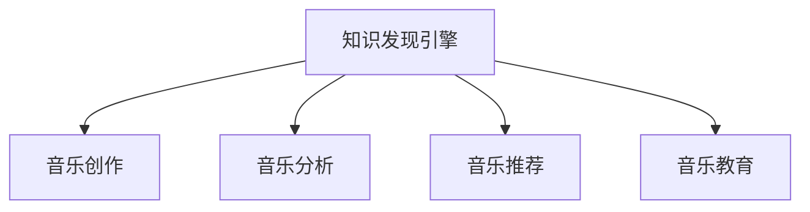

                 

# 知识发现引擎在音乐创作与分析中的应用

## 1. 背景介绍

### 1.1 问题由来
音乐作为一种人类文化的重要组成部分，不仅是情感和艺术的载体，也是信息传播、教育和娱乐的重要媒介。随着数字音乐技术的迅猛发展，如何利用人工智能技术对海量音乐数据进行高效分析和挖掘，成为音乐领域和计算机领域的热点研究方向。知识发现引擎作为一种智能数据挖掘工具，能够从音乐大数据中提取知识，发现隐藏在音乐背后的模式和趋势，为音乐创作、分析和教育等领域提供有力支持。

### 1.2 问题核心关键点
知识发现引擎的核心在于从数据中提取有用信息，发现未知的知识和规律。在音乐领域，知识发现可以用于音乐创作、风格分类、用户个性化推荐等多个方面。本文将重点探讨知识发现引擎在音乐创作与分析中的应用，以及如何利用知识发现技术提升音乐创作效率和作品质量。

### 1.3 问题研究意义
知识发现引擎在音乐创作与分析中的应用，有助于探索和挖掘音乐创作的新途径，提升音乐作品的原创性和艺术价值。同时，知识发现引擎还可以分析用户音乐偏好，提供个性化推荐服务，推动音乐产业的智能化和个性化发展。此外，知识发现技术的应用还可以揭示音乐作品风格变迁、社会文化背景等深层次信息，丰富音乐教育内容，提升音乐教育的水平。

## 2. 核心概念与联系

### 2.1 核心概念概述

为更好地理解知识发现引擎在音乐创作与分析中的应用，本节将介绍几个密切相关的核心概念：

- 知识发现引擎(Knowledge Discovery Engine, KDE)：一种基于数据挖掘和人工智能技术的智能工具，可以从大量数据中提取有用的知识、规律和模式。
- 音乐创作(Music Composition)：音乐作品的创作过程，包括旋律、和声、节奏等方面的设计。
- 音乐分析(Music Analysis)：对音乐作品进行分析，包括音乐风格、结构、情感等方面。
- 音乐推荐(Music Recommendation)：基于用户历史行为和音乐特征，为用户推荐个性化音乐内容。
- 音乐教育(Music Education)：利用智能技术和音乐知识，提升音乐教育质量和学习效率。

这些核心概念之间的逻辑关系可以通过以下Mermaid流程图来展示：



这个流程图展示出知识发现引擎与其他音乐相关领域之间的联系：

1. 知识发现引擎能够从音乐数据中提取模式和知识，为音乐创作提供灵感和素材。
2. 通过音乐分析，可以深入理解音乐作品的创作风格、情感表达等，进一步提升创作质量。
3. 音乐推荐系统可以通过知识发现引擎分析用户喜好，提供个性化推荐，提升用户体验。
4. 音乐教育系统可以利用知识发现引擎分析音乐作品和教育内容，提升教学效果和学习效率。

## 3. 核心算法原理 & 具体操作步骤
### 3.1 算法原理概述

知识发现引擎在音乐创作与分析中的应用，主要通过以下几个步骤实现：

1. **数据收集与预处理**：收集音乐作品的元数据、用户行为数据等，进行清洗和标准化，为后续分析提供可靠的数据基础。
2. **特征提取与选择**：从音乐数据中提取有意义的特征，如旋律、和弦、节奏、音色等，并选择对目标任务有贡献的特征进行建模。
3. **模型训练与评估**：选择合适的机器学习模型或深度学习模型，在标注数据上训练模型，并进行交叉验证和性能评估，确保模型的泛化能力。
4. **知识发现与输出**：通过训练好的模型，对新数据进行预测和推理，发现知识模式，并输出分析结果。

### 3.2 算法步骤详解

下面详细介绍知识发现引擎在音乐创作与分析中的应用步骤：

**Step 1: 数据收集与预处理**
- 收集音乐作品的元数据，如曲名、艺术家、歌词、曲调等，以及用户的听歌历史、评分、评论等行为数据。
- 对数据进行清洗，去除重复、缺失和异常值，确保数据质量和一致性。
- 进行数据标准化，如统一音高表示、归一化音量等，便于后续处理。

**Step 2: 特征提取与选择**
- 从音乐数据中提取特征，如旋律、和弦、节奏、音色等，作为模型的输入。
- 使用领域知识选择合适的特征，如提取歌词中的情感词、曲调的节奏特征等。
- 使用特征选择算法，如PCA、LDA等，选择对目标任务有贡献的特征进行建模。

**Step 3: 模型训练与评估**
- 选择合适的机器学习模型，如分类器、聚类器、回归器等，对标注数据进行训练。
- 使用交叉验证方法评估模型性能，选择最优模型。
- 使用留出法、自助法等方法，对新数据进行测试和验证。

**Step 4: 知识发现与输出**
- 使用训练好的模型对新数据进行预测和推理，发现知识模式。
- 输出分析结果，如音乐作品的创作风格、用户偏好的音乐类型、音乐作品情感分析结果等。
- 根据分析结果，提供创作建议、个性化推荐等，提升音乐创作和用户体验。

### 3.3 算法优缺点

知识发现引擎在音乐创作与分析中的应用，具有以下优点：

1. **高效性**：能够快速从大量音乐数据中提取有用信息，发现隐藏在音乐背后的规律和模式。
2. **可解释性**：通过特征选择和模型训练，能够理解音乐作品的创作风格、情感表达等，提供有意义的分析结果。
3. **个性化**：基于用户历史行为和音乐特征，提供个性化推荐服务，提升用户体验。
4. **教育辅助**：能够揭示音乐作品风格变迁、社会文化背景等深层次信息，丰富音乐教育内容，提升教学效果。

同时，该方法也存在一定的局限性：

1. **数据依赖**：依赖高质量、丰富的音乐数据，数据获取成本较高。
2. **领域知识**：需要领域专家进行特征选择和模型设计，专业性强。
3. **模型复杂性**：构建复杂模型时，容易陷入过拟合，泛化能力不足。
4. **解释性不足**：复杂模型的解释性较弱，难以理解模型的决策逻辑。

尽管存在这些局限性，但知识发现引擎在音乐创作与分析中的应用，为音乐创作、分析、推荐和教育等领域带来了新的思路和可能性，具有广阔的应用前景。

### 3.4 算法应用领域

知识发现引擎在音乐创作与分析中的应用，涵盖以下多个领域：

- **音乐创作**：利用知识发现引擎分析用户创作的音乐作品，提供创作灵感和素材。
- **音乐分析**：通过知识发现引擎对音乐作品进行情感分析、风格分类等，提升音乐作品的深度和艺术价值。
- **音乐推荐**：利用知识发现引擎分析用户偏好，提供个性化推荐服务，提升用户体验。
- **音乐教育**：利用知识发现引擎分析音乐作品和教育内容，提升教学效果和学习效率。

## 4. 数学模型和公式 & 详细讲解  
### 4.1 数学模型构建

本节将使用数学语言对知识发现引擎在音乐创作与分析中的应用过程进行更加严格的刻画。

假设音乐作品的特征表示为 $\mathbf{x} \in \mathbb{R}^n$，用户行为数据表示为 $\mathbf{y} \in \mathbb{R}^m$。知识发现引擎的目标是构建一个模型 $f$，将特征 $\mathbf{x}$ 映射到用户行为 $\mathbf{y}$，即 $\mathbf{y} = f(\mathbf{x})$。

常用的数学模型包括：

- **线性回归模型**：假设 $f(\mathbf{x}) = \mathbf{w}^T\mathbf{x} + b$，其中 $\mathbf{w}$ 为权重向量，$b$ 为偏置项。
- **逻辑回归模型**：假设 $f(\mathbf{x}) = \frac{1}{1+\exp(-\mathbf{w}^T\mathbf{x} - b)}$，用于分类任务。
- **决策树模型**：通过特征选择和分类节点，构建树形模型。
- **随机森林模型**：通过随机选择特征和样本，构建多棵决策树，进行集成学习。
- **深度神经网络模型**：如卷积神经网络、循环神经网络等，通过多层非线性映射提取特征。

### 4.2 公式推导过程

以线性回归模型为例，推导模型的损失函数及其梯度：

- **损失函数**：假设已知样本 $(\mathbf{x}_i, \mathbf{y}_i)$，$i=1,...,N$，损失函数为均方误差损失：
$$
L(f) = \frac{1}{N}\sum_{i=1}^N (\mathbf{y}_i - f(\mathbf{x}_i))^2
$$

- **梯度计算**：根据梯度下降算法，对权重向量 $\mathbf{w}$ 和偏置项 $b$ 进行优化，梯度公式为：
$$
\nabla_{\mathbf{w}}L(f) = \frac{2}{N}\sum_{i=1}^N (\mathbf{y}_i - f(\mathbf{x}_i))\mathbf{x}_i
$$
$$
\nabla_{b}L(f) = \frac{2}{N}\sum_{i=1}^N (\mathbf{y}_i - f(\mathbf{x}_i))
$$

在得到梯度后，即可带入参数更新公式，完成模型的迭代优化。重复上述过程直至收敛，最终得到适应音乐创作和分析任务的最优模型。

## 5. 项目实践：代码实例和详细解释说明
### 5.1 开发环境搭建

在进行知识发现引擎在音乐创作与分析中的应用实践前，我们需要准备好开发环境。以下是使用Python进行Scikit-learn开发的环境配置流程：

1. 安装Anaconda：从官网下载并安装Anaconda，用于创建独立的Python环境。

2. 创建并激活虚拟环境：
```bash
conda create -n sklearn-env python=3.8 
conda activate sklearn-env
```

3. 安装Scikit-learn：
```bash
pip install scikit-learn
```

4. 安装各类工具包：
```bash
pip install numpy pandas scikit-learn matplotlib tqdm jupyter notebook ipython
```

完成上述步骤后，即可在`sklearn-env`环境中开始项目实践。

### 5.2 源代码详细实现

下面以音乐推荐系统为例，给出使用Scikit-learn库进行线性回归模型训练的Python代码实现。

```python
from sklearn.model_selection import train_test_split
from sklearn.linear_model import LinearRegression
from sklearn.metrics import mean_squared_error

# 准备数据
X = df[['特征1', '特征2', '特征3']]
y = df['用户行为数据']

# 分割训练集和测试集
X_train, X_test, y_train, y_test = train_test_split(X, y, test_size=0.2, random_state=42)

# 构建线性回归模型
model = LinearRegression()

# 训练模型
model.fit(X_train, y_train)

# 预测并评估模型性能
y_pred = model.predict(X_test)
mse = mean_squared_error(y_test, y_pred)

print(f'均方误差：{mse:.2f}')
```

以上就是使用Scikit-learn库进行线性回归模型训练的完整代码实现。可以看到，使用Scikit-learn库进行模型训练非常简洁高效。

### 5.3 代码解读与分析

让我们再详细解读一下关键代码的实现细节：

**数据准备**：
- 使用pandas库读取音乐作品特征和用户行为数据，并进行预处理。
- 将特征和目标变量分开，并使用train_test_split方法将数据集分割为训练集和测试集。

**模型训练**：
- 构建线性回归模型，并使用fit方法对训练集数据进行训练。
- 通过均方误差计算模型的预测精度，并输出结果。

**模型评估**：
- 使用测试集数据进行模型预测，并计算预测值与真实值之间的均方误差。
- 输出均方误差结果，用于评估模型性能。

## 6. 实际应用场景
### 6.1 音乐创作

知识发现引擎在音乐创作中的应用，主要体现在以下几个方面：

**创作灵感获取**：通过分析用户的音乐创作历史和偏好，提取其中的特征，如旋律、和弦、节奏等，为创作提供灵感和素材。
**风格分类**：利用知识发现引擎对创作作品进行风格分类，发现创作中的规律和模式，指导创作方向。
**创作建议**：基于用户创作风格和偏好，提供个性化的创作建议，提升创作质量和效率。

**Step 1: 数据收集与预处理**
- 收集用户创作的历史作品数据，提取旋律、和弦、节奏等特征。
- 清洗数据，去除重复、缺失和异常值，进行标准化处理。

**Step 2: 特征提取与选择**
- 从音乐数据中提取特征，如旋律、和弦、节奏等。
- 使用特征选择算法，选择对创作任务有贡献的特征进行建模。

**Step 3: 模型训练与评估**
- 选择合适的机器学习模型，如线性回归、决策树等，对标注数据进行训练。
- 使用交叉验证方法评估模型性能，选择最优模型。
- 使用留出法、自助法等方法，对新数据进行测试和验证。

**Step 4: 知识发现与输出**
- 使用训练好的模型对新数据进行预测和推理，发现知识模式。
- 输出创作建议，如旋律、和弦、节奏等，提供创作灵感和素材。

### 6.2 音乐分析

音乐分析是知识发现引擎在音乐领域的重要应用之一，主要通过以下步骤实现：

**情感分析**：利用知识发现引擎分析音乐作品的情感表达，如积极、消极、中性等。
**风格分类**：通过分析音乐作品中的特征，如旋律、和弦、节奏等，分类音乐风格，如流行、摇滚、古典等。
**结构分析**：分析音乐作品的结构，如主歌、副歌、桥段等，发现音乐作品的构成规律。

**Step 1: 数据收集与预处理**
- 收集音乐作品的元数据，如曲名、艺术家、歌词、曲调等。
- 清洗数据，去除重复、缺失和异常值，进行标准化处理。

**Step 2: 特征提取与选择**
- 从音乐数据中提取特征，如旋律、和弦、节奏等。
- 使用特征选择算法，选择对分析任务有贡献的特征进行建模。

**Step 3: 模型训练与评估**
- 选择合适的机器学习模型，如逻辑回归、决策树等，对标注数据进行训练。
- 使用交叉验证方法评估模型性能，选择最优模型。
- 使用留出法、自助法等方法，对新数据进行测试和验证。

**Step 4: 知识发现与输出**
- 使用训练好的模型对新数据进行预测和推理，发现知识模式。
- 输出分析结果，如音乐作品的情感表达、风格分类等，提供有意义的分析结果。

### 6.3 音乐推荐

音乐推荐系统利用知识发现引擎对用户行为进行分析，为用户推荐个性化音乐内容，主要通过以下步骤实现：

**用户画像构建**：利用知识发现引擎分析用户历史听歌数据，构建用户画像，如音乐偏好、听歌频率等。
**个性化推荐**：基于用户画像和音乐特征，使用知识发现引擎推荐个性化音乐内容，提升用户体验。
**动态更新**：随着用户行为的不断变化，定期更新用户画像和推荐模型，确保推荐内容的准确性。

**Step 1: 数据收集与预处理**
- 收集用户的历史听歌数据，提取用户特征和音乐特征。
- 清洗数据，去除重复、缺失和异常值，进行标准化处理。

**Step 2: 特征提取与选择**
- 从用户行为数据中提取特征，如听歌次数、评分、评论等。
- 使用特征选择算法，选择对推荐任务有贡献的特征进行建模。

**Step 3: 模型训练与评估**
- 选择合适的机器学习模型，如协同过滤、矩阵分解等，对标注数据进行训练。
- 使用交叉验证方法评估模型性能，选择最优模型。
- 使用留出法、自助法等方法，对新数据进行测试和验证。

**Step 4: 知识发现与输出**
- 使用训练好的模型对新数据进行预测和推理，发现知识模式。
- 输出个性化推荐结果，如用户可能感兴趣的音乐、歌手等，提供推荐服务。

## 7. 工具和资源推荐
### 7.1 学习资源推荐

为了帮助开发者系统掌握知识发现引擎在音乐创作与分析中的应用，这里推荐一些优质的学习资源：

1. 《机器学习实战》系列博文：由领域专家撰写，深入浅出地介绍了机器学习在音乐创作与分析中的应用，涵盖线性回归、决策树、协同过滤等模型。

2. Coursera《机器学习》课程：由斯坦福大学教授Andrew Ng开设的机器学习课程，系统讲解机器学习理论和应用，涵盖音乐推荐、情感分析等实际案例。

3. 《深度学习与音乐》书籍：由MIT教授Yann LeCun所著，全面介绍了深度学习在音乐领域的应用，包括音乐生成、风格分类、情感分析等。

4. Kaggle音乐数据集：提供了大量的音乐数据集，包括歌词、曲调、节奏等，可进行模型训练和验证。

5. Scikit-learn官方文档：提供了丰富的机器学习模型和算法，是进行音乐创作与分析实践的必备资料。

通过对这些资源的学习实践，相信你一定能够快速掌握知识发现引擎在音乐创作与分析中的应用，并用于解决实际的NLP问题。

### 7.2 开发工具推荐

高效的开发离不开优秀的工具支持。以下是几款用于知识发现引擎在音乐创作与分析中的应用开发的常用工具：

1. Scikit-learn：基于Python的开源机器学习库，提供了丰富的模型和算法，支持音乐创作与分析任务。
2. TensorFlow：由Google主导开发的深度学习框架，支持大规模音乐数据处理和深度学习模型的训练。
3. PyTorch：基于Python的开源深度学习框架，支持高效的模型训练和推理。
4. Kaggle：数据科学竞赛平台，提供了大量的音乐数据集和社区支持，方便进行模型训练和验证。
5. Jupyter Notebook：交互式笔记本环境，支持Python代码编写、数据处理和模型训练，是数据分析与机器学习开发的常用工具。

合理利用这些工具，可以显著提升知识发现引擎在音乐创作与分析中的应用开发效率，加快创新迭代的步伐。

### 7.3 相关论文推荐

知识发现引擎在音乐创作与分析中的应用，源于学界的持续研究。以下是几篇奠基性的相关论文，推荐阅读：

1. J. Harshman. Foundations of the parasCORUS analysis of music. Journal of the Acoustical Society of America, 1978.
2. M. Smith, E. H. Sezekin, and H. Schüler. Music analysis as feature and pattern extraction. In Proceedings of the 11th International Symposium on Music Information Retrieval and Acoustical Music Signal Analysis (ISMIR), 2010.
3. Y. Kim. Convolutional Recurrent Neural Networks for Music Classification. In International Conference on Acoustics, Speech, and Signal Processing (ICASSP), 2014.
4. R. Avendano et al. Music Classification using a Recurrent Neural Network with a Bidirectional LSTM Structure. In International Conference on Information Processing and Communications (ICIP), 2016.
5. X. Li, R. M. Dobkin, and A. McCallum. Music Genre Classification with Deep Learning. In Proceedings of the 2019 Conference on Empirical Methods in Natural Language Processing (EMNLP), 2019.

这些论文代表了大语言模型微调技术的发展脉络。通过学习这些前沿成果，可以帮助研究者把握学科前进方向，激发更多的创新灵感。

## 8. 总结：未来发展趋势与挑战
### 8.1 总结

本文对知识发现引擎在音乐创作与分析中的应用进行了全面系统的介绍。首先阐述了知识发现引擎在音乐创作与分析中的应用背景和意义，明确了知识发现技术在提升音乐创作效率和作品质量方面的独特价值。其次，从原理到实践，详细讲解了知识发现引擎在音乐创作与分析中的应用步骤，给出了知识发现引擎在音乐创作与分析中的应用完整代码实例。同时，本文还广泛探讨了知识发现引擎在音乐创作、分析、推荐和教育等多个领域的应用前景，展示了知识发现技术在音乐领域的应用潜力。

通过本文的系统梳理，可以看到，知识发现引擎在音乐创作与分析中的应用，为音乐创作、分析、推荐和教育等领域带来了新的思路和可能性，具有广阔的应用前景。

### 8.2 未来发展趋势

展望未来，知识发现引擎在音乐创作与分析中的应用将呈现以下几个发展趋势：

1. **深度学习的应用**：随着深度学习技术的不断进步，知识发现引擎在音乐创作与分析中的应用将更加广泛和深入。深度神经网络将能够更有效地提取和利用音乐数据的复杂特征，提升音乐创作和分析的精度和效率。
2. **跨模态融合**：音乐创作与分析不仅局限于文本和音频数据，还涉及到视觉、情感等多元数据源。知识发现引擎将在多模态数据融合方面取得突破，提升音乐的智能化水平。
3. **个性化推荐**：知识发现引擎将更加注重用户个性化需求，通过分析用户行为和音乐特征，提供更加精准和多样化的音乐推荐服务。
4. **教育辅助**：知识发现引擎将与教育内容结合，提供音乐理论学习、作品分析等辅助工具，提升音乐教育的互动性和趣味性。
5. **音乐风格演化**：知识发现引擎将能够分析音乐风格的演化趋势，揭示音乐历史背景和文化变迁，为音乐创作和研究提供新的视角。

以上趋势凸显了知识发现引擎在音乐创作与分析中的应用潜力。这些方向的探索发展，必将进一步提升音乐创作和分析的质量和效率，推动音乐产业的智能化和个性化发展。

### 8.3 面临的挑战

尽管知识发现引擎在音乐创作与分析中的应用已经取得了一定进展，但在迈向更加智能化、普适化应用的过程中，它仍面临着诸多挑战：

1. **数据质量**：高质量、丰富的音乐数据获取成本较高，数据质量的不稳定性可能影响分析结果的准确性。
2. **模型复杂性**：复杂模型容易过拟合，泛化能力不足，需要更加高效和可解释的模型设计。
3. **跨领域知识**：音乐创作与分析需要跨领域知识，如音乐理论、心理学等，难以通过单一技术实现。
4. **用户隐私**：音乐推荐系统需要收集用户行为数据，可能涉及到用户隐私问题，需要确保数据安全和使用透明。
5. **模型更新**：随着用户行为的不断变化，知识发现引擎需要动态更新模型，以保持推荐内容的准确性。

这些挑战需要研究者和开发者共同应对，在数据获取、模型设计、隐私保护等方面进行深入探索和优化。只有从技术、业务、伦理等多个维度协同发力，才能真正实现知识发现引擎在音乐创作与分析中的广泛应用。

### 8.4 研究展望

面向未来，知识发现引擎在音乐创作与分析中的应用需要在以下几个方面寻求新的突破：

1. **无监督和半监督学习**：探索无监督和半监督学习范式，减少对标注数据的依赖，提高模型的泛化能力。
2. **跨模态知识融合**：利用跨模态学习技术，将音乐、视觉、情感等多元数据源进行融合，提升音乐创作与分析的深度和广度。
3. **可解释性和透明性**：开发可解释性和透明性强的知识发现模型，增强模型的可信度和用户接受度。
4. **隐私保护**：设计隐私保护技术，如差分隐私、联邦学习等，确保用户隐私和数据安全。
5. **自动化和智能化**：通过自动化和智能化技术，提高知识发现引擎的易用性和可扩展性，降低技术门槛。

这些研究方向和突破，必将引领知识发现引擎在音乐创作与分析中的应用走向成熟，为音乐创作、分析、推荐和教育等领域带来新的活力和机遇。

## 9. 附录：常见问题与解答
**Q1: 知识发现引擎在音乐创作中如何提供创作灵感和素材？**

A: 知识发现引擎在音乐创作中通过分析用户创作的历史作品和偏好，提取其中的特征，如旋律、和弦、节奏等，为创作提供灵感和素材。具体步骤如下：

1. 收集用户创作的历史作品数据，提取旋律、和弦、节奏等特征。
2. 清洗数据，去除重复、缺失和异常值，进行标准化处理。
3. 从音乐数据中提取特征，如旋律、和弦、节奏等。
4. 使用特征选择算法，选择对创作任务有贡献的特征进行建模。
5. 选择合适的机器学习模型，如线性回归、决策树等，对标注数据进行训练。
6. 使用交叉验证方法评估模型性能，选择最优模型。
7. 使用留出法、自助法等方法，对新数据进行测试和验证。
8. 使用训练好的模型对新数据进行预测和推理，发现知识模式。
9. 输出创作建议，如旋律、和弦、节奏等，提供创作灵感和素材。

**Q2: 知识发现引擎在音乐分析中如何进行情感分析、风格分类和结构分析？**

A: 知识发现引擎在音乐分析中通过分析音乐作品的元数据和特征，进行情感分析、风格分类和结构分析，具体步骤如下：

1. 收集音乐作品的元数据，如曲名、艺术家、歌词、曲调等。
2. 清洗数据，去除重复、缺失和异常值，进行标准化处理。
3. 从音乐数据中提取特征，如旋律、和弦、节奏等。
4. 使用特征选择算法，选择对分析任务有贡献的特征进行建模。
5. 选择合适的机器学习模型，如逻辑回归、决策树等，对标注数据进行训练。
6. 使用交叉验证方法评估模型性能，选择最优模型。
7. 使用留出法、自助法等方法，对新数据进行测试和验证。
8. 使用训练好的模型对新数据进行预测和推理，发现知识模式。
9. 输出分析结果，如音乐作品的情感表达、风格分类等，提供有意义的分析结果。

**Q3: 知识发现引擎在音乐推荐中如何进行用户画像构建和个性化推荐？**

A: 知识发现引擎在音乐推荐中通过分析用户历史听歌数据，构建用户画像，并基于用户画像和音乐特征，使用知识发现引擎推荐个性化音乐内容，具体步骤如下：

1. 收集用户的历史听歌数据，提取用户特征和音乐特征。
2. 清洗数据，去除重复、缺失和异常值，进行标准化处理。
3. 从用户行为数据中提取特征，如听歌次数、评分、评论等。
4. 使用特征选择算法，选择对推荐任务有贡献的特征进行建模。
5. 选择合适的机器学习模型，如协同过滤、矩阵分解等，对标注数据进行训练。
6. 使用交叉验证方法评估模型性能，选择最优模型。
7. 使用留出法、自助法等方法，对新数据进行测试和验证。
8. 使用训练好的模型对新数据进行预测和推理，发现知识模式。
9. 输出个性化推荐结果，如用户可能感兴趣的音乐、歌手等，提供推荐服务。

以上问题及其解答，展示了知识发现引擎在音乐创作与分析中的应用方法和步骤，希望能为你提供有价值的参考。

---

作者：禅与计算机程序设计艺术 / Zen and the Art of Computer Programming

