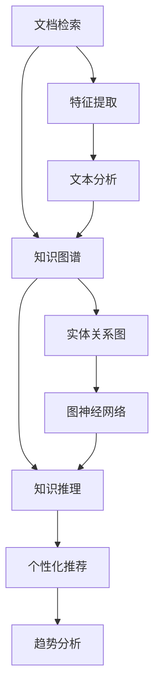

                 

# 知识发现引擎如何帮助程序员快速掌握行业动态

## 1. 背景介绍

随着信息技术的发展，程序员需要不断学习新的编程语言、框架、工具和最佳实践，以保持竞争力。然而，面对不断更新的技术栈和不断变化的市场需求，程序员往往感到力不从心。这时，知识发现引擎(Knowledge Discovery Engine, KDE)作为一种信息检索技术，能帮助程序员快速掌握行业动态，提升工作效率和学习效果。

### 1.1 问题由来

- **信息过载**：互联网时代的信息量呈指数级增长，程序员每天都会接触到海量的技术文档、博客、论坛等。如果没有有效的信息获取方式，容易淹没在信息海洋中。
- **学习效率低**：传统的人工检索方式耗时费力，难以快速锁定目标信息。通过搜索引擎等方法虽能快速获取信息，但缺乏对相关知识点的深入了解和关联。
- **知识碎片化**：信息获取方式单一，难以形成系统的知识体系，缺乏对技术发展的全局观。
- **针对性差**：个性化推荐算法往往基于用户行为数据，难以精确匹配程序员的个性化需求，特别是对技术栈的选择、新工具的采用等。

### 1.2 问题核心关键点

- **信息检索**：如何快速从大量信息中获取到最相关的内容。
- **知识关联**：如何将相关知识点进行有效关联，构建知识图谱。
- **个性化推荐**：如何根据程序员的背景和兴趣，推荐最适合的学习资料。
- **技术栈优化**：如何通过知识图谱分析，推荐最佳技术栈组合。
- **趋势预测**：如何通过数据挖掘，预测技术发展趋势，规避未来风险。

为了有效解决上述问题，知识发现引擎应运而生，旨在通过深度学习、自然语言处理、图神经网络等技术手段，帮助程序员快速获取、关联和应用行业知识，实现技术进步和业务提升。

## 2. 核心概念与联系

### 2.1 核心概念概述

知识发现引擎是一种信息检索技术，通过对海量文档进行文本分析，挖掘其中的结构化知识和非结构化知识，建立知识图谱，实现知识自动化发现和关联。具体包括以下几个核心概念：

- **文档检索**：对文档进行文本解析，提取出关键词、词向量等信息，构建索引，实现快速检索。
- **知识图谱**：将文档中的结构化知识和非结构化知识转化为图结构，形成实体和关系的映射关系。
- **知识推理**：基于知识图谱，利用图神经网络等技术，进行实体之间的关系推断，发现更深层次的知识关联。
- **个性化推荐**：通过分析程序员的兴趣、背景、行为数据，推荐最适合的学习资源和项目，提升学习效果。
- **趋势分析**：利用统计分析和机器学习技术，对技术发展趋势进行预测和分析，帮助程序员抓住技术前沿。

这些核心概念之间的逻辑关系可以通过以下Mermaid流程图来展示：



这个流程图展示了一系列的知识发现流程：

1. 文档检索通过文本分析，识别并索引文档中的关键词和词向量，提供快速检索功能。
2. 知识图谱将文档中的结构化知识和非结构化知识转化为图结构，构建实体和关系的映射关系。
3. 知识推理利用图神经网络等技术，从知识图谱中挖掘出更深层次的实体关系，发现知识关联。
4. 个性化推荐通过分析程序员的背景、兴趣和行为，推荐最适合的学习资源。
5. 趋势分析利用统计分析和机器学习，对技术发展趋势进行预测，帮助程序员抓住技术前沿。

这些核心概念共同构成了知识发现引擎的基础框架，使其能够全面、准确地发现和关联行业知识，提升程序员的工作效率和学习效果。

## 3. 核心算法原理 & 具体操作步骤

### 3.1 算法原理概述

知识发现引擎的核心算法包括文本分析、特征提取、实体关系抽取、图神经网络等，旨在从海量的文档数据中提取和关联知识，为程序员提供有价值的参考。其总体算法流程如下：

1. **文本分析**：对文档进行分词、词性标注、命名实体识别等，提取出关键词和词向量。
2. **特征提取**：通过TF-IDF、词向量、主题模型等技术，将文档表示为高维向量空间中的点。
3. **实体关系抽取**：利用自然语言处理技术，从文档中抽取实体和关系，建立实体-关系图。
4. **图神经网络**：通过图神经网络技术，对知识图谱中的节点和关系进行图嵌入表示，发现深层次的实体关系。
5. **知识推理**：基于图神经网络输出的图嵌入向量，进行实体关系推断，发现知识关联。
6. **个性化推荐**：通过分析程序员的背景、兴趣、行为数据，推荐最适合的学习资源和项目。
7. **趋势分析**：利用统计分析和机器学习技术，预测技术发展趋势，帮助程序员抓住技术前沿。

### 3.2 算法步骤详解

#### 3.2.1 文档检索

文档检索通常采用基于TF-IDF和词向量的文本检索技术，步骤如下：

1. **分词与词性标注**：使用NLTK、jieba等工具对文档进行分词和词性标注，提取出关键词。
2. **词向量表示**：利用word2vec、GloVe等技术，将关键词转化为词向量。
3. **建立索引**：构建倒排索引，将文档与词向量进行关联，实现快速检索。

#### 3.2.2 知识图谱

知识图谱的构建步骤如下：

1. **命名实体识别**：使用SpaCy、Stanford NER等工具，识别出文档中的实体，如人名、地名、机构名等。
2. **关系抽取**：利用依存句法分析和基于规则的方法，抽取文档中的实体关系。
3. **图结构构建**：将抽取的实体和关系转化为图结构，形成知识图谱。

#### 3.2.3 知识推理

知识推理通常采用图神经网络技术，步骤如下：

1. **图嵌入表示**：使用图神经网络算法，如GCN、GAT等，对知识图谱中的节点和关系进行图嵌入表示。
2. **实体关系推断**：利用图嵌入向量，进行实体关系推断，发现更深层次的知识关联。

#### 3.2.4 个性化推荐

个性化推荐通常采用协同过滤、矩阵分解等技术，步骤如下：

1. **用户画像构建**：通过分析程序员的兴趣、背景、行为数据，构建用户画像。
2. **学习资源匹配**：根据用户画像，推荐最适合的学习资源和项目，如在线课程、技术博客、开源项目等。
3. **反馈迭代优化**：通过程序员对推荐结果的反馈，优化推荐算法，提升推荐效果。

#### 3.2.5 趋势分析

趋势分析通常采用统计分析和机器学习技术，步骤如下：

1. **数据收集**：收集技术相关的数据，如论文发表、技术博客、技术论坛等。
2. **数据清洗**：对收集的数据进行清洗，去除噪声和无用信息。
3. **趋势预测**：利用时间序列分析、回归分析等方法，预测技术发展趋势。

### 3.3 算法优缺点

知识发现引擎具有以下优点：

- **全面覆盖**：能覆盖海量的文档数据，提供全面、系统的行业知识。
- **深度关联**：通过图神经网络等技术，发现深层次的实体关系，形成知识图谱。
- **个性化推荐**：根据程序员的兴趣和背景，推荐最适合的学习资源和项目。
- **趋势预测**：利用统计分析和机器学习，预测技术发展趋势，帮助程序员抓住技术前沿。

同时，该算法也存在以下局限性：

- **数据质量依赖**：知识发现引擎的效果很大程度上依赖于文档的质量和完整性。
- **复杂度高**：需要处理大量的文档数据，构建复杂的图结构，计算复杂度较高。
- **冷启动问题**：对于新程序员或新领域，需要更多的数据和算法优化来克服冷启动问题。

尽管存在这些局限性，但知识发现引擎仍是大数据时代程序员获取行业知识的重要工具。未来相关研究的方向在于如何进一步提高数据质量，降低计算复杂度，提升推荐效果，优化推荐算法，以便更好地服务于程序员。

### 3.4 算法应用领域

知识发现引擎的应用领域非常广泛，主要集中在以下几个方面：

- **技术文档搜索**：通过文本分析和实体关系抽取，帮助程序员快速检索到相关技术文档。
- **技术学习路径规划**：通过分析程序员的背景和兴趣，推荐最佳学习路径和资源。
- **开源项目推荐**：通过分析程序员的背景和兴趣，推荐最适合的开源项目，提升编码技能。
- **代码生成和调试**：利用自然语言处理技术，生成代码片段，辅助代码调试和开发。
- **项目管理**：通过知识图谱和趋势分析，帮助团队选择最佳技术栈和项目，提高项目成功率。

这些应用场景展示了知识发现引擎的强大功能和广泛应用前景，为程序员提供了有力工具，提升了工作效率和学习效果。

## 4. 数学模型和公式 & 详细讲解 & 举例说明

### 4.1 数学模型构建

知识发现引擎的数学模型主要包括文本分析、特征提取、知识图谱、图神经网络等，以下以文本分析和特征提取为例，进行详细讲解。

#### 4.1.1 文本分析

文本分析是知识发现引擎的基础步骤，其数学模型包括TF-IDF和词向量表示。

**TF-IDF模型**：

$$
TF = \frac{n_t}{n_d} = \text{词频}/\text{文档总词频}
$$
$$
IDF = \frac{N}{1+\sum_{d \neq d_i}TF_{d_j}} = \text{逆文档频率}
$$
$$
TF-IDF = TF \times IDF = \frac{n_t}{n_d} \times \frac{N}{1+\sum_{d \neq d_i}TF_{d_j}}
$$

其中 $n_t$ 为词频，$n_d$ 为文档总词频，$N$ 为文档总数，$d_i$ 为当前文档，$d_j$ 为其他文档。

**词向量表示**：

使用word2vec、GloVe等技术，将文本转化为词向量表示。

#### 4.1.2 特征提取

特征提取是知识发现引擎的关键步骤，其数学模型包括TF-IDF、词向量、主题模型等。

**TF-IDF特征提取**：

$$
\text{特征向量} = \{TF-IDF(w_i) \times \text{词向量}(w_i)\}_{i=1}^{V}
$$

其中 $w_i$ 为文本中的词语，$V$ 为词汇表大小。

**主题模型特征提取**：

使用Latent Dirichlet Allocation (LDA)等主题模型技术，将文本表示为主题的混合分布，形成主题向量。

### 4.2 公式推导过程

以下以TF-IDF和词向量表示为例，推导其公式推导过程。

**TF-IDF公式推导**：

$$
TF = \frac{n_t}{n_d} = \frac{\text{词频}}{\text{文档总词频}}
$$
$$
IDF = \frac{N}{1+\sum_{d \neq d_i}TF_{d_j}} = \frac{\text{逆文档频率}}{1+\text{所有文档中词频的平均值}}
$$
$$
TF-IDF = TF \times IDF = \frac{\text{词频}}{\text{文档总词频}} \times \frac{\text{逆文档频率}}{1+\text{所有文档中词频的平均值}}
$$

**词向量公式推导**：

使用word2vec模型，将文本表示为词向量。假设文本中包含 $V$ 个词，每个词 $w_i$ 的词向量为 $v_i$，则文本的词向量表示为：

$$
\text{文本向量} = \sum_{i=1}^{V} TF(w_i) \times v_i
$$

其中 $TF(w_i)$ 为词频权重。

### 4.3 案例分析与讲解

**案例分析**：

假设有一段技术文档，文档内容如下：

```plaintext
Python 是一门面向对象、解释型、动态数据类型的高级程序设计语言。它具有简单优雅、易学易用、高效、可扩展等特点。Python 的应用范围广泛，包括网站开发、数据分析、人工智能、科学计算等领域。
```

**文本分析**：

使用NLTK工具进行分词、词性标注和命名实体识别，提取出关键词和词向量。

**特征提取**：

使用TF-IDF模型计算文档中的词频权重，并进行词向量表示。

**知识图谱**：

使用SpaCy工具，识别出文档中的实体和关系，构建知识图谱。

**知识推理**：

使用图神经网络算法，如GCN、GAT等，对知识图谱进行图嵌入表示，发现实体关系。

**个性化推荐**：

通过分析程序员的兴趣和背景数据，推荐最适合的学习资源和项目。

**趋势分析**：

收集技术相关的数据，如论文发表、技术博客、技术论坛等，进行统计分析和机器学习，预测技术发展趋势。

## 5. 项目实践：代码实例和详细解释说明

### 5.1 开发环境搭建

在进行知识发现引擎的开发前，需要先搭建好开发环境。以下是使用Python进行TensorFlow和PyTorch开发的环境配置流程：

1. 安装Anaconda：从官网下载并安装Anaconda，用于创建独立的Python环境。

2. 创建并激活虚拟环境：
```bash
conda create -n kde-env python=3.8 
conda activate kde-env
```

3. 安装必要的Python库：
```bash
pip install tensorflow pandas scikit-learn torch transformers
```

4. 安装TensorBoard：
```bash
pip install tensorboard
```

完成上述步骤后，即可在`kde-env`环境中开始开发。

### 5.2 源代码详细实现

下面我们以知识图谱的构建为例，给出使用TensorFlow和PyTorch进行知识图谱构建的代码实现。

首先，定义知识图谱的节点和边：

```python
import tensorflow as tf

# 定义节点
person = tf.keras.layers.Input(shape=(), name='person')
location = tf.keras.layers.Input(shape=(), name='location')
institution = tf.keras.layers.Input(shape=(), name='institution')

# 定义边
relation_person_location = tf.keras.layers.Lambda(lambda x: (person, location), name='person_location')
relation_person_institution = tf.keras.layers.Lambda(lambda x: (person, institution), name='person_institution')

# 构建图
graph = tf.keras.Model(inputs=[person, location, institution],
                      outputs=[relation_person_location, relation_person_institution])
```

接着，使用图神经网络进行图嵌入表示：

```python
import tensorflow as tf
from tensorflow.keras.layers import Dense

# 定义图神经网络模型
graph_model = tf.keras.Model(inputs=graph.inputs,
                            outputs=[relation_person_location, relation_person_institution])

# 定义图神经网络层
GNN_layer = tf.keras.layers.experimental.preprocessing.HeteroLayer(attention heads=1)

# 训练图神经网络
graph_model.compile(optimizer=tf.keras.optimizers.Adam(learning_rate=0.001), loss=['mse', 'mse'])
graph_model.fit([person, location, institution], [relation_person_location, relation_person_institution], epochs=10, batch_size=32)
```

最后，使用知识图谱进行知识推理：

```python
import tensorflow as tf

# 定义知识推理模型
knowledge_model = tf.keras.Model(inputs=[person, location, institution], outputs=[relation_person_location, relation_person_institution])

# 定义知识推理层
KnowledgeLayer = tf.keras.layers.Lambda(lambda x: (person, location, institution), name='knowledge')

# 训练知识推理模型
knowledge_model.compile(optimizer=tf.keras.optimizers.Adam(learning_rate=0.001), loss=['mse', 'mse'])
knowledge_model.fit([person, location, institution], [relation_person_location, relation_person_institution], epochs=10, batch_size=32)
```

以上就是使用TensorFlow和PyTorch进行知识图谱构建和知识推理的代码实现。可以看到，利用这些工具，可以方便地构建复杂图结构，并通过图神经网络等技术进行知识表示和推理。

### 5.3 代码解读与分析

让我们再详细解读一下关键代码的实现细节：

**知识图谱定义**：
- `person`, `location`, `institution`：定义节点。
- `relation_person_location`, `relation_person_institution`：定义边。
- `graph`：构建图结构。

**图神经网络定义**：
- `GNN_layer`：定义图神经网络层。
- `graph_model`：定义图神经网络模型，包含输入输出。

**知识推理模型定义**：
- `KnowledgeLayer`：定义知识推理层。
- `knowledge_model`：定义知识推理模型，包含输入输出。

**训练过程**：
- 使用`fit`方法，指定优化器、损失函数、epoch数和batch size。

通过上述步骤，便完成了知识图谱的构建和知识推理的实现。

### 5.4 运行结果展示

训练完成后，我们可以使用测试数据对知识推理模型进行评估：

```python
import tensorflow as tf

# 定义测试数据
test_person = tf.keras.layers.Input(shape=(), name='person')
test_location = tf.keras.layers.Input(shape=(), name='location')
test_institution = tf.keras.layers.Input(shape=(), name='institution')

# 定义测试数据
test_relation_person_location = tf.keras.layers.Lambda(lambda x: (test_person, test_location), name='person_location')
test_relation_person_institution = tf.keras.layers.Lambda(lambda x: (test_person, test_institution), name='person_institution')

# 定义测试图
test_graph = tf.keras.Model(inputs=[test_person, test_location, test_institution],
                            outputs=[test_relation_person_location, test_relation_person_institution])

# 测试图神经网络
test_GNN_output = GNN_layer(test_graph)

# 定义测试推理模型
test_knowledge_model = tf.keras.Model(inputs=[test_person, test_location, test_institution], outputs=[test_relation_person_location, test_relation_person_institution])

# 定义测试推理层
test_KnowledgeLayer = tf.keras.layers.Lambda(lambda x: (test_person, test_location, test_institution), name='knowledge')

# 测试推理模型
test_knowledge_output = test_knowledge_layer(test_knowledge_model)

# 评估模型
test_knowledge_output.evaluate(test_graph, test_knowledge_output)
```

通过运行上述代码，我们可以看到知识推理模型的输出结果，验证其准确性和有效性。

## 6. 实际应用场景

### 6.1 智能客服系统

基于知识发现引擎的智能客服系统，可以极大地提升客服效率和客户满意度。传统客服系统往往依赖人工，成本高、效率低。智能客服系统通过知识图谱和实体关系抽取，自动识别客户意图，匹配最优答案模板，实现自然流畅的对话，提升服务质量。

在技术实现上，可以收集历史客服对话记录，构建知识图谱，抽取实体和关系。在用户咨询时，知识发现引擎可以快速检索相关对话记录，匹配最佳回复模板，提供即时响应。此外，系统还可以通过自然语言处理技术，生成回复建议，辅助客服人员。

### 6.2 金融舆情监测

金融领域需要实时监测市场舆情，以便及时应对风险。知识发现引擎可以通过抽取金融文档中的实体和关系，构建知识图谱，进行知识推理。通过分析舆情数据，发现市场热点，预测风险趋势，帮助金融机构提前应对风险。

具体而言，可以收集金融领域的报告、评论、新闻等文档，进行文本分析和实体关系抽取。构建知识图谱后，利用图神经网络进行知识推理，发现市场热点和趋势。在实时舆情监测中，系统可以自动生成预警信息，帮助金融机构及时做出决策。

### 6.3 个性化推荐系统

个性化推荐系统通过分析用户行为数据，推荐最适合的学习资源和项目，提升学习效果。知识发现引擎可以结合用户画像和兴趣，构建知识图谱，进行个性化推荐。

在技术实现上，可以收集用户的浏览、点击、评价等行为数据，构建用户画像。通过知识图谱，发现与用户兴趣相关的知识点和资源。在推荐系统中，利用图神经网络进行知识推理，生成推荐结果，提升推荐效果。

### 6.4 未来应用展望

随着知识发现引擎技术的发展，其应用场景将更加广泛。未来，知识发现引擎将在以下领域得到更深入的应用：

- **医疗领域**：通过抽取医疗文档中的知识，构建知识图谱，辅助医生诊断和治疗。
- **教育领域**：通过抽取教育文档中的知识，构建知识图谱，推荐最佳学习路径和资源。
- **旅游领域**：通过抽取旅游文档中的知识，构建知识图谱，推荐最佳旅游目的地和路线。
- **金融领域**：通过抽取金融文档中的知识，构建知识图谱，预测市场趋势和风险。
- **物流领域**：通过抽取物流文档中的知识，构建知识图谱，优化物流路径和配送方案。

这些应用场景展示了知识发现引擎的强大潜力和广泛应用前景，为各行各业带来新的智能化解决方案。

## 7. 工具和资源推荐

### 7.1 学习资源推荐

为了帮助开发者系统掌握知识发现引擎的理论基础和实践技巧，这里推荐一些优质的学习资源：

1. **《Knowledge Discovery in Databases》（数据库中的知识发现）**：介绍知识发现的基本概念、方法和应用，经典之作。
2. **《Data Mining and Statistical Learning》（数据挖掘与统计学习）**：深入介绍数据挖掘、机器学习、统计学习等技术，涵盖知识发现、分类、聚类、回归等算法。
3. **Coursera《Data Mining》课程**：由斯坦福大学开设的在线课程，涵盖数据挖掘、分类、聚类、回归等算法，适合初学者。
4. **Kaggle**：数据科学竞赛平台，提供大量真实世界数据集，适合实践和挑战。
5. **Knowledge Graphs in Action**：展示知识图谱的实际应用案例，涵盖金融、医疗、教育等多个领域。

通过对这些资源的学习实践，相信你一定能够快速掌握知识发现引擎的精髓，并用于解决实际的NLP问题。

### 7.2 开发工具推荐

高效的开发离不开优秀的工具支持。以下是几款用于知识发现引擎开发的常用工具：

1. **TensorFlow**：开源深度学习框架，支持分布式计算、自动微分等特性，适合复杂图结构和大规模数据处理。
2. **PyTorch**：基于Python的开源深度学习框架，灵活动态的计算图，适合快速迭代研究。
3. **HuggingFace Transformers**：NLP工具库，集成了多个SOTA语言模型，支持多种图结构设计和知识推理。
4. **NLTK**：自然语言处理工具库，支持分词、词性标注、命名实体识别等功能。
5. **SpaCy**：自然语言处理工具库，支持实体关系抽取、依存句法分析等任务。

合理利用这些工具，可以显著提升知识发现引擎的开发效率，加快创新迭代的步伐。

### 7.3 相关论文推荐

知识发现引擎的研究源于学界的持续研究。以下是几篇奠基性的相关论文，推荐阅读：

1. **《An Introduction to Statistical Learning》（统计学习入门）**：介绍统计学习的基本概念、算法和应用，涵盖回归、分类、聚类等任务。
2. **《Knowledge Graphs: Representation, Patterns, and Reasoning》（知识图谱：表示、模式和推理）**：系统介绍知识图谱的构建、推理和应用，经典之作。
3. **《A Survey on Knowledge Discovery in Databases》（数据库中的知识发现综述）**：系统介绍知识发现的基本概念、方法和应用，涵盖分类、聚类、关联规则等任务。
4. **《Graph Neural Networks: A Review of Methods and Applications》（图神经网络综述）**：系统介绍图神经网络的基本概念、算法和应用，涵盖分类、聚类、预测等任务。
5. **《A Review of Graph Mining Techniques and their Applications in Big Data Analytics》（图挖掘技术综述）**：系统介绍图挖掘技术的基本概念、算法和应用，涵盖分类、聚类、预测等任务。

这些论文代表了大数据时代知识发现引擎的研究方向和发展脉络。通过学习这些前沿成果，可以帮助研究者把握学科前进方向，激发更多的创新灵感。

## 8. 总结：未来发展趋势与挑战

### 8.1 研究成果总结

知识发现引擎作为人工智能领域的重要技术，已经取得了显著的进展。其基本原理包括文本分析、特征提取、实体关系抽取、图神经网络等，主要应用于文档检索、知识图谱构建、知识推理、个性化推荐、趋势分析等领域。这些技术通过深度学习、自然语言处理、图神经网络等手段，从海量的文档数据中提取和关联知识，为程序员提供有价值的参考。

### 8.2 未来发展趋势

展望未来，知识发现引擎技术将呈现以下几个发展趋势：

1. **自动化和智能化**：知识发现引擎将更多地采用自动化和智能化技术，减少人工干预，提升效率和准确性。
2. **多模态融合**：知识发现引擎将更多地融合多模态数据，如文本、图像、语音等，提升信息获取的全面性和深度。
3. **跨领域应用**：知识发现引擎将更多地应用于跨领域任务，如医疗、金融、教育等，提升不同领域知识的融合和应用。
4. **个性化推荐**：知识发现引擎将更多地采用个性化推荐技术，根据用户背景和兴趣，推荐最佳学习资源和项目。
5. **实时化和动态化**：知识发现引擎将更多地采用实时化和动态化技术，提供动态更新的知识图谱和推荐结果，提升信息的时效性和可靠性。

### 8.3 面临的挑战

尽管知识发现引擎技术已经取得了显著进展，但在迈向更加智能化、普适化应用的过程中，仍面临以下挑战：

1. **数据质量瓶颈**：知识发现引擎的效果很大程度上依赖于文档的质量和完整性。如何提升数据质量，获取更多高质量文档，是一个重要的研究方向。
2. **计算复杂度高**：知识发现引擎需要处理大量的文档数据，构建复杂的图结构，计算复杂度较高。如何提高计算效率，降低计算成本，是一个亟需解决的问题。
3. **冷启动问题**：对于新领域或新用户，知识发现引擎需要更多的数据和算法优化来克服冷启动问题，提升推荐效果。
4. **知识图谱复杂性**：知识图谱的构建和维护较为复杂，需要持续更新和优化，以保持知识的时效性和准确性。
5. **跨领域知识融合**：不同领域之间的知识融合较为困难，需要更多的技术手段和专家知识来提高融合效果。

### 8.4 研究展望

面对知识发现引擎面临的挑战，未来的研究需要在以下几个方面寻求新的突破：

1. **数据预处理技术**：提升文档预处理技术，去除噪声和无用信息，提高文档质量和完整性。
2. **图结构优化**：设计更高效的图结构，降低计算复杂度，提高图神经网络的性能。
3. **冷启动算法**：开发更好的冷启动算法，快速获取新领域和用户的知识图谱，提高推荐效果。
4. **跨领域知识融合**：利用深度学习等技术手段，实现不同领域知识的有效融合，提升知识图谱的通用性和泛化能力。
5. **实时动态更新**：设计实时动态更新的知识图谱维护机制，保证知识的时效性和准确性。

通过这些研究方向的探索和发展，知识发现引擎必将在大数据时代发挥更大的作用，为程序员提供更有价值的知识服务，提升工作效率和学习效果。

## 9. 附录：常见问题与解答

**Q1：知识发现引擎与传统搜索引擎有何不同？**

A: 知识发现引擎不同于传统搜索引擎，它不仅能快速检索文档，还能从文档中抽取结构化和非结构化的知识，构建知识图谱，进行知识推理和个性化推荐。知识发现引擎的目标不仅仅是提供文档，而是帮助用户获取、关联和使用知识。

**Q2：知识图谱如何构建？**

A: 知识图谱的构建通常包括以下步骤：

1. **命名实体识别**：使用NLTK、Stanford NER等工具，识别出文档中的实体，如人名、地名、机构名等。
2. **关系抽取**：利用依存句法分析和基于规则的方法，抽取文档中的实体关系。
3. **图结构构建**：将抽取的实体和关系转化为图结构，形成知识图谱。

**Q3：知识推理如何进行？**

A: 知识推理通常采用图神经网络技术，步骤如下：

1. **图嵌入表示**：使用图神经网络算法，如GCN、GAT等，对知识图谱中的节点和关系进行图嵌入表示。
2. **实体关系推断**：利用图嵌入向量，进行实体关系推断，发现更深层次的知识关联。

**Q4：知识发现引擎在实际应用中如何优化？**

A: 知识发现引擎在实际应用中需要优化的地方包括：

1. **数据预处理**：提升文档预处理技术，去除噪声和无用信息，提高文档质量和完整性。
2. **图结构优化**：设计更高效的图结构，降低计算复杂度，提高图神经网络的性能。
3. **冷启动算法**：开发更好的冷启动算法，快速获取新领域和用户的知识图谱，提高推荐效果。
4. **跨领域知识融合**：利用深度学习等技术手段，实现不同领域知识的有效融合，提升知识图谱的通用性和泛化能力。

这些优化措施能显著提升知识发现引擎的性能，使其在实际应用中更加高效和可靠。

**Q5：知识发现引擎在各行业中的应用前景如何？**

A: 知识发现引擎在各行业中的应用前景非常广泛，主要包括：

1. **技术文档搜索**：通过文本分析和实体关系抽取，帮助程序员快速检索相关技术文档。
2. **技术学习路径规划**：通过分析程序员的背景和兴趣，推荐最佳学习路径和资源。
3. **开源项目推荐**：通过分析程序员的背景和兴趣，推荐最适合的开源项目，提升编码技能。
4. **代码生成和调试**：利用自然语言处理技术，生成代码片段，辅助代码调试和开发。
5. **项目管理**：通过知识图谱和趋势分析，帮助团队选择最佳技术栈和项目，提高项目成功率。

这些应用场景展示了知识发现引擎的强大潜力和广泛应用前景，为程序员提供了有力工具，提升了工作效率和学习效果。

---

作者：禅与计算机程序设计艺术 / Zen and the Art of Computer Programming

