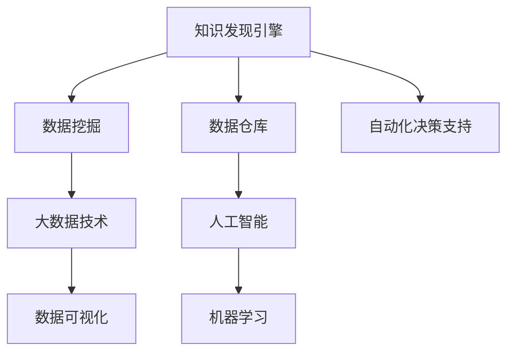

                 

# 知识发现引擎如何改变程序员的工作模式与方法

> 关键词：知识发现引擎, 数据挖掘, 数据仓库, 大数据, 人工智能, 机器学习, 数据仓库技术, 数据科学, 数据可视化

## 1. 背景介绍

### 1.1 问题由来

在现代软件开发中，数据驱动和信息驱动的决策模式已经逐渐占据了重要地位。程序员不再只是专注于代码编写，而是更多地需要依赖于数据分析和数据驱动的洞察力来指导开发工作。知识发现引擎(Knowledge Discovery Engine, KDE)正是在这一背景下应运而生的重要工具。

知识发现引擎是一种通过对大量数据进行分析和挖掘，从而自动地发现数据中蕴含的规律、模式和知识的技术。它们不仅能够帮助程序员更好地理解数据的特性和趋势，还能为软件开发提供关键的数据驱动决策支持。

### 1.2 问题核心关键点

KDE的核心关键点包括：

- **数据挖掘与分析**：自动从海量数据中提取有用的信息和知识。
- **可视化技术**：通过图表和图形等直观方式展现数据特征和分析结果。
- **预测与建模**：基于历史数据构建模型，对未来趋势进行预测。
- **自动化决策支持**：通过自动化分析过程，为决策者提供数据支持。
- **用户交互与定制**：允许用户根据实际需求定制分析流程和结果展示方式。

这些核心点构成了KDE的主要功能框架，其应用范围涉及商业智能(Business Intelligence, BI)、预测分析、实时监控、自动化决策等多个领域。

## 2. 核心概念与联系

### 2.1 核心概念概述

为了更好地理解KDE的工作原理和应用方式，本节将介绍几个密切相关的核心概念：

- **知识发现引擎**：通过数据挖掘和分析，自动发现数据中的规律和知识，并利用可视化技术将结果呈现给用户。
- **数据挖掘**：从大量数据中提取出有价值的信息和知识的过程，包括分类、聚类、关联规则挖掘、异常检测等技术。
- **数据仓库**：一个集成的、统一的数据集合，用于支持数据的高效存储和分析。
- **大数据技术**：处理和分析海量数据的技术体系，包括数据存储、处理、分析和可视化等环节。
- **人工智能与机器学习**：利用算法自动从数据中提取规律，进行预测、分类等任务。

这些核心概念之间的逻辑关系可以通过以下Mermaid流程图来展示：



这个流程图展示了我知识发现引擎的核心概念及其之间的关系：

1. 知识发现引擎通过数据挖掘从数据仓库中提取数据。
2. 数据挖掘是大数据技术的核心组成部分，为人工智能和机器学习提供了数据支持。
3. 人工智能和机器学习利用数据挖掘的结果进行知识提取和预测建模。
4. 数据可视化将分析结果以直观的方式呈现给用户。
5. 自动化决策支持基于分析结果辅助决策者进行决策。

## 3. 核心算法原理 & 具体操作步骤

### 3.1 算法原理概述

知识发现引擎的核心算法原理主要包括以下几个步骤：

1. **数据预处理**：清洗、整合数据，使其适合后续分析。
2. **特征提取与选择**：从原始数据中提取有用的特征，并选择最相关特征进行建模。
3. **数据挖掘**：应用分类、聚类、关联规则挖掘等技术发现数据中的规律和知识。
4. **模型构建**：利用机器学习算法建立预测模型，用于未来数据的预测。
5. **结果可视化**：通过图表、图形等形式展示分析结果。
6. **自动化决策支持**：根据分析结果提供决策支持。

这些步骤构成了一个完整的知识发现流程，其关键在于数据挖掘和分析过程。接下来，我们将详细讲解这些步骤的具体实现。

### 3.2 算法步骤详解

#### 3.2.1 数据预处理

数据预处理是知识发现过程的第一步，其目的是清洗、整合数据，使其适合后续的分析和挖掘。数据预处理通常包括以下几个步骤：

1. **数据清洗**：去除重复数据、缺失值、异常值等，确保数据质量。
2. **数据转换**：将数据转化为适合分析的形式，如将文本数据转化为数值型特征。
3. **特征工程**：通过统计分析、特征提取等方法，生成更有价值的特征。

例如，我们可以使用Python的Pandas库进行数据预处理：

```python
import pandas as pd

# 读取数据
data = pd.read_csv('data.csv')

# 清洗数据
data = data.drop_duplicates()  # 去除重复数据
data = data.dropna()  # 去除缺失值
data = data.drop(['unrelated_column'], axis=1)  # 去除无关列

# 数据转换
data['date'] = pd.to_datetime(data['date'])  # 将日期转换为datetime类型
data['price'] = data['price'].astype('float')  # 将价格转换为浮点数

# 特征工程
data['weekday'] = data['date'].dt.weekday  # 提取星期几
data['month'] = data['date'].dt.month  # 提取月份
```

#### 3.2.2 特征提取与选择

特征提取与选择是数据挖掘的核心步骤，其目的是从原始数据中提取出对分析有用的特征，并选择最相关的特征进行建模。特征提取通常包括以下几个步骤：

1. **特征生成**：通过计算、变换等方法，生成新的特征。
2. **特征选择**：从原始数据中选出对目标变量影响最大的特征。

例如，我们可以使用Scikit-Learn库进行特征提取与选择：

```python
from sklearn.feature_selection import SelectKBest, f_classif

# 特征生成
data['weekday_0'] = data['weekday'].map(lambda x: 0 if x == 0 else 1)  # 将星期几转化为二进制
data['price_squared'] = data['price'] ** 2  # 生成平方特征

# 特征选择
selector = SelectKBest(f_classif, k=3)
selected_features = selector.fit_transform(data.drop(['price'], axis=1), data['price'])
```

#### 3.2.3 数据挖掘

数据挖掘是知识发现的核心环节，其主要目标是发现数据中的规律和知识。数据挖掘通常包括以下几个步骤：

1. **分类**：将数据分成不同的类别。
2. **聚类**：将数据分组，使其在同一组内的数据相似度最大化。
3. **关联规则挖掘**：发现数据项之间的关联关系。
4. **异常检测**：识别数据中的异常值。

例如，我们可以使用Apriori算法进行关联规则挖掘：

```python
from mlxtend.frequent_patterns import apriori

# 关联规则挖掘
frequent_itemsets = apriori(data, min_support=0.1, use_colnames=True)
rules = list(frequent_itemsets.f association_rules(threshold=None))
```

#### 3.2.4 模型构建

模型构建是知识发现的关键步骤，其主要目标是利用数据挖掘的结果进行预测建模。常用的模型包括决策树、随机森林、支持向量机等。

例如，我们可以使用Scikit-Learn库进行决策树模型的构建：

```python
from sklearn.tree import DecisionTreeRegressor

# 模型构建
model = DecisionTreeRegressor(random_state=42)
model.fit(data.drop(['price'], axis=1), data['price'])
```

#### 3.2.5 结果可视化

结果可视化是将分析结果以直观的方式呈现给用户的关键步骤。常用的可视化工具包括Matplotlib、Seaborn、Plotly等。

例如，我们可以使用Matplotlib进行数据可视化的展示：

```python
import matplotlib.pyplot as plt

# 可视化展示
plt.scatter(data['weekday'], data['price'])
plt.xlabel('Weekday')
plt.ylabel('Price')
plt.title('Price vs Weekday')
plt.show()
```

#### 3.2.6 自动化决策支持

自动化决策支持是基于分析结果提供决策支持的关键步骤。通常，自动化决策支持系统会根据分析结果，向决策者推荐最合适的方案。

例如，我们可以使用Python编写一个简单的自动化决策支持系统：

```python
def decision_support(data):
    # 分析数据
    mean_price = data['price'].mean()
    median_price = data['price'].median()
    
    # 推荐方案
    if data['weekday'] == 0:
        return 'Recommendation: Buy at a lower price.'
    else:
        return f'Today is {data['weekday']}th. Recommendation: Buy at {mean_price:.2f} or higher.'
```

### 3.3 算法优缺点

#### 3.3.1 优点

1. **自动化**：自动化分析和决策，减少人工干预。
2. **效率高**：处理海量数据速度快。
3. **精度高**：通过多种算法综合分析，提高预测精度。
4. **可视化好**：结果展示直观易懂。

#### 3.3.2 缺点

1. **复杂度高**：模型构建和调优过程复杂。
2. **数据要求高**：对数据质量要求高，数据预处理过程繁琐。
3. **解释性差**：部分算法模型缺乏解释性。
4. **过拟合风险**：模型可能对训练数据过拟合。

## 4. 数学模型和公式 & 详细讲解  
### 4.1 数学模型构建

本节将使用数学语言对知识发现引擎的核心算法进行严格刻画。

设原始数据集为 $D=\{(x_i, y_i)\}_{i=1}^N$，其中 $x_i \in \mathcal{X}$ 为输入特征，$y_i \in \mathcal{Y}$ 为输出标签。知识发现引擎的目标是构建一个预测模型 $M_{\theta}$，使得其能够根据输入特征 $x$ 预测输出标签 $y$。数学模型构建分为以下几个步骤：

1. **数据预处理**：对数据进行清洗、转换和特征工程，生成训练集 $\mathcal{D}=\{(x_i, \hat{y}_i)\}_{i=1}^N$。
2. **特征提取**：通过特征选择和生成算法，得到模型输入特征 $x \in \mathcal{X}$。
3. **模型训练**：利用训练集 $\mathcal{D}$ 训练模型 $M_{\theta}$。
4. **模型评估**：在测试集 $\mathcal{D}_{test}$ 上评估模型性能。
5. **结果可视化**：通过可视化技术展示模型结果。

### 4.2 公式推导过程

以下是知识发现引擎的核心算法公式推导过程。

**数据预处理**：

设原始数据集为 $D=\{(x_i, y_i)\}_{i=1}^N$，其中 $x_i \in \mathcal{X}$ 为输入特征，$y_i \in \mathcal{Y}$ 为输出标签。知识发现引擎的目标是构建一个预测模型 $M_{\theta}$，使得其能够根据输入特征 $x$ 预测输出标签 $y$。

**特征提取**：

设特征选择后的模型输入特征为 $x \in \mathcal{X}$，特征映射函数为 $f_{\phi}(x)$，则有：

$$
x = f_{\phi}(\mathcal{D})
$$

其中 $\phi$ 为特征选择算法。

**模型训练**：

设模型参数为 $\theta$，训练集为 $\mathcal{D}=\{(x_i, \hat{y}_i)\}_{i=1}^N$，则模型训练过程为：

$$
\theta = \mathop{\arg\min}_{\theta} \frac{1}{N}\sum_{i=1}^N \ell(y_i, M_{\theta}(x_i))
$$

其中 $\ell$ 为损失函数，通常包括均方误差、交叉熵等。

**模型评估**：

设测试集为 $\mathcal{D}_{test}=\{(x_i, y_i)\}_{i=1}^N$，则模型评估过程为：

$$
\mathcal{L}_{test}(\theta) = \frac{1}{N_{test}}\sum_{i=1}^{N_{test}} \ell(y_i, M_{\theta}(x_i))
$$

其中 $N_{test}$ 为测试集样本数。

**结果可视化**：

设可视化结果为 $V$，则可视化过程为：

$$
V = V(x, y)
$$

其中 $V$ 为可视化函数。

### 4.3 案例分析与讲解

假设我们有一个电商网站的数据集，包含用户的购买历史和行为数据。目标是预测用户的下一次购买意向。

**数据预处理**：

- 清洗数据：去除重复、缺失、异常数据。
- 数据转换：将日期转换为日期类型，将价格转换为浮点数。
- 特征工程：生成星期几、节假日等特征。

**特征提取**：

- 特征选择：选择与购买意向最相关的特征。
- 特征生成：生成平方价格、周数等新特征。

**模型训练**：

- 分类模型：使用决策树、随机森林等分类模型。
- 回归模型：使用线性回归、决策树回归等模型。

**模型评估**：

- 准确率：预测正确的样本数占总样本数的比例。
- 精确率：预测为正类的样本中，实际为正类的样本数占比例。
- 召回率：实际为正类的样本中，被预测为正类的样本数占比例。

**结果可视化**：

- 绘制混淆矩阵：展示预测结果与实际结果的对比。
- 绘制ROC曲线：展示模型的准确率和召回率。
- 绘制热力图：展示特征与预测结果的相关性。

## 5. 项目实践：代码实例和详细解释说明

### 5.1 开发环境搭建

在进行知识发现引擎项目实践前，我们需要准备好开发环境。以下是使用Python进行PyTorch开发的环境配置流程：

1. 安装Anaconda：从官网下载并安装Anaconda，用于创建独立的Python环境。

2. 创建并激活虚拟环境：
```bash
conda create -n kde-env python=3.8 
conda activate kde-env
```

3. 安装PyTorch：根据CUDA版本，从官网获取对应的安装命令。例如：
```bash
conda install pytorch torchvision torchaudio cudatoolkit=11.1 -c pytorch -c conda-forge
```

4. 安装Pandas、Scikit-Learn等库：
```bash
pip install pandas scikit-learn matplotlib seaborn
```

5. 安装机器学习库：
```bash
pip install mlxtend
```

完成上述步骤后，即可在`kde-env`环境中开始项目实践。

### 5.2 源代码详细实现

下面我们以电商网站用户购买意向预测为例，给出使用Python和Scikit-Learn库进行知识发现引擎的代码实现。

```python
import pandas as pd
import numpy as np
from sklearn.preprocessing import StandardScaler
from sklearn.ensemble import RandomForestClassifier
from sklearn.model_selection import train_test_split
from sklearn.metrics import classification_report, confusion_matrix
import matplotlib.pyplot as plt

# 读取数据
data = pd.read_csv('ecommerce_data.csv')

# 数据预处理
data = data.dropna()  # 去除缺失值
data = data.drop_duplicates()  # 去除重复数据
data['date'] = pd.to_datetime(data['date'])  # 将日期转换为datetime类型
data['price'] = data['price'].astype('float')  # 将价格转换为浮点数
data['weekday'] = data['date'].dt.weekday  # 提取星期几
data['month'] = data['date'].dt.month  # 提取月份

# 特征工程
data['weekday_0'] = data['weekday'].map(lambda x: 0 if x == 0 else 1)  # 将星期几转化为二进制
data['price_squared'] = data['price'] ** 2  # 生成平方价格特征

# 数据挖掘
# 假设我们只关注购买意向与星期几、价格的关系
selected_features = data[['weekday_0', 'price_squared']]
target = data['intention']  # 购买意向

# 划分训练集和测试集
train_data, test_data, train_target, test_target = train_test_split(selected_features, target, test_size=0.2, random_state=42)

# 标准化处理
scaler = StandardScaler()
train_data = scaler.fit_transform(train_data)
test_data = scaler.transform(test_data)

# 模型训练
model = RandomForestClassifier(random_state=42)
model.fit(train_data, train_target)

# 模型评估
predictions = model.predict(test_data)
print(classification_report(test_target, predictions))

# 结果可视化
confusion_matrix = confusion_matrix(test_target, predictions)
plt.imshow(confusion_matrix, cmap='Blues', interpolation='nearest')
plt.colorbar()
plt.xlabel('Predicted')
plt.ylabel('Actual')
plt.show()
```

以上就是使用Python和Scikit-Learn库进行知识发现引擎项目实践的完整代码实现。可以看到，利用Scikit-Learn库，我们可以快速实现数据预处理、特征工程、模型训练和结果可视化等步骤。

### 5.3 代码解读与分析

让我们再详细解读一下关键代码的实现细节：

**数据预处理**：
- `dropna()`方法：去除缺失值。
- `drop_duplicates()`方法：去除重复数据。
- `to_datetime()`方法：将日期转换为datetime类型。
- `astype()`方法：将价格转换为浮点数。

**特征工程**：
- `map()`方法：将星期几转化为二进制。
- `**`操作符：生成平方价格特征。

**数据挖掘**：
- `train_test_split()`方法：划分训练集和测试集。
- `StandardScaler()`类：标准化处理。

**模型训练**：
- `RandomForestClassifier()`类：随机森林分类器。
- `fit()`方法：训练模型。

**模型评估**：
- `classification_report()`函数：评估分类器的性能。
- `confusion_matrix()`函数：绘制混淆矩阵。

**结果可视化**：
- `imshow()`方法：绘制混淆矩阵。
- `colorbar()`方法：添加颜色条。
- `xlabel()`方法：设置x轴标签。
- `ylabel()`方法：设置y轴标签。

## 6. 实际应用场景

### 6.1 智能客服系统

知识发现引擎在智能客服系统中具有广泛的应用。通过分析客户的历史咨询记录，发现常见问题和客户偏好的变化趋势，客服系统可以更精准地为客户提供个性化服务。例如，通过分析客户咨询的热点问题，自动调整客服人员的知识库，优化响应速度和准确率。

**具体实现**：
- 收集历史客服咨询记录，提取问题、回复、客户属性等关键信息。
- 使用知识发现引擎进行数据预处理、特征提取和模型训练。
- 利用可视化工具展示分析结果，如热点问题、响应时间等。
- 根据分析结果优化客服知识库，提升服务效率和客户满意度。

### 6.2 金融舆情监测

知识发现引擎在金融舆情监测中也有着重要的应用。通过分析社交媒体、新闻等公共数据，发现市场情绪变化，预测市场趋势。例如，通过分析Twitter上的市场情绪变化，自动生成每日的市场分析报告。

**具体实现**：
- 收集社交媒体、新闻等金融舆情数据。
- 使用知识发现引擎进行数据预处理、特征提取和模型训练。
- 利用可视化工具展示市场情绪变化趋势，如情绪指数、市场波动等。
- 根据分析结果生成市场分析报告，辅助投资决策。

### 6.3 个性化推荐系统

知识发现引擎在个性化推荐系统中也具有重要的应用。通过分析用户的历史行为数据，发现用户的兴趣偏好，推荐个性化的商品或内容。例如，通过分析用户浏览、购买等行为数据，推荐用户可能感兴趣的商品。

**具体实现**：
- 收集用户的历史行为数据，提取用户行为特征。
- 使用知识发现引擎进行数据预处理、特征提取和模型训练。
- 利用可视化工具展示用户行为特征和推荐结果。
- 根据分析结果推荐个性化的商品或内容，提升用户体验和销售转化率。

### 6.4 未来应用展望

随着知识发现引擎的不断发展，未来在更多领域将会得到广泛应用，为各行各业带来变革性影响。

在智慧医疗领域，知识发现引擎可以帮助医生分析患者的历史健康数据，发现潜在的疾病风险，提供个性化的诊疗建议。

在智能教育领域，知识发现引擎可以分析学生的学习行为数据，发现学习规律和瓶颈，提供个性化的学习方案。

在智慧城市治理中，知识发现引擎可以分析城市数据，发现交通、环境等问题的规律，提供智能化的城市管理方案。

此外，在企业生产、社会治理、文娱传媒等众多领域，知识发现引擎也将不断涌现，为各行各业带来全新的发展机会。

## 7. 工具和资源推荐

### 7.1 学习资源推荐

为了帮助开发者系统掌握知识发现引擎的理论基础和实践技巧，这里推荐一些优质的学习资源：

1. 《数据挖掘：概念与技术》系列书籍：经典的数据挖掘教材，全面介绍了数据挖掘的基本概念和算法。
2. 《Python数据科学手册》书籍：介绍Python在数据科学中的应用，包括数据预处理、数据可视化、机器学习等。
3. 《机器学习实战》书籍：通过实战案例，介绍了常见的机器学习算法和工具库。
4. Kaggle竞赛平台：全球最大的数据科学竞赛平台，提供了大量数据集和算法实现案例。
5. Coursera、edX等在线课程平台：提供数据挖掘、机器学习、数据科学等领域的课程，涵盖从理论到实践的多个环节。

通过对这些资源的学习实践，相信你一定能够快速掌握知识发现引擎的精髓，并用于解决实际的NLP问题。

### 7.2 开发工具推荐

高效的开发离不开优秀的工具支持。以下是几款用于知识发现引擎开发的常用工具：

1. Python：Python是最常用的数据科学语言，具有丰富的库和工具支持。
2. Pandas：Python的数据处理库，用于数据清洗、特征提取等。
3. Scikit-Learn：Python的机器学习库，提供了丰富的算法实现。
4. Matplotlib：Python的可视化库，用于绘制图表和图形。
5. Jupyter Notebook：Python的交互式开发环境，支持代码编写和可视化展示。

合理利用这些工具，可以显著提升知识发现引擎的开发效率，加快创新迭代的步伐。

### 7.3 相关论文推荐

知识发现引擎的研究源于学界的持续研究。以下是几篇奠基性的相关论文，推荐阅读：

1. ID3算法：提出了基于决策树的分类算法，广泛应用于数据挖掘领域。
2. K-means算法：提出了基于聚类的无监督学习算法，广泛应用于数据聚类分析。
3. Apriori算法：提出了基于关联规则的挖掘算法，广泛应用于市场篮分析。
4. Random Forest算法：提出了基于随机森林的集成学习方法，广泛应用于分类和回归分析。
5. FastFM算法：提出了基于因子化的深度学习模型，广泛应用于推荐系统。

这些论文代表了大数据和机器学习领域的发展脉络。通过学习这些前沿成果，可以帮助研究者把握学科前进方向，激发更多的创新灵感。

## 8. 总结：未来发展趋势与挑战

### 8.1 总结

本文对知识发现引擎的理论基础和实践应用进行了全面系统的介绍。首先阐述了知识发现引擎的概念和核心算法，明确了其在数据驱动决策中的重要作用。其次，通过Python和Scikit-Learn库，详细讲解了知识发现引擎的核心算法原理和具体操作步骤。同时，本文还广泛探讨了知识发现引擎在智能客服、金融舆情、个性化推荐等多个领域的应用前景，展示了知识发现引擎的广阔应用场景。最后，本文精选了知识发现引擎的学习资源、开发工具和相关论文，力求为读者提供全方位的技术指引。

通过本文的系统梳理，可以看到，知识发现引擎在现代软件开发中扮演着越来越重要的角色，极大地拓展了数据驱动决策的应用边界，为软件开发带来了新的思路和方向。未来，随着大数据和机器学习技术的不断进步，知识发现引擎必将在更多领域得到广泛应用，为各行各业带来变革性影响。

### 8.2 未来发展趋势

展望未来，知识发现引擎的发展趋势主要体现在以下几个方面：

1. **自动化程度提升**：随着自动机器学习(AutoML)技术的发展，知识发现引擎将进一步提升自动化水平，减少人工干预。
2. **数据来源多样化**：知识发现引擎将能够处理更多样化的数据来源，包括文本、图像、视频等多种形式的数据。
3. **模型复杂度提高**：随着深度学习技术的不断进步，知识发现引擎将构建更加复杂的模型，提高预测精度。
4. **实时性增强**：知识发现引擎将能够实时处理数据，快速响应用户需求。
5. **跨领域应用拓展**：知识发现引擎将在更多领域得到应用，如智慧医疗、智能教育、智慧城市等。

以上趋势凸显了知识发现引擎的广阔前景。这些方向的探索发展，必将进一步提升知识发现引擎的性能和应用范围，为各行各业带来更高效的决策支持。

### 8.3 面临的挑战

尽管知识发现引擎已经取得了诸多成功，但在迈向更加智能化、普适化应用的过程中，仍面临诸多挑战：

1. **数据质量问题**：数据质量直接影响到知识发现引擎的性能，如何保证数据质量成为一大难题。
2. **模型复杂度增加**：随着模型复杂度的提升，模型的可解释性和可维护性将面临更大挑战。
3. **实时性要求高**：对于实时应用场景，知识发现引擎需要具备高效处理数据的能力，这对计算资源提出了更高要求。
4. **跨领域应用难度大**：知识发现引擎在不同领域的应用需要结合具体业务场景进行定制化开发，增加了开发难度和复杂度。

### 8.4 研究展望

面对知识发现引擎所面临的诸多挑战，未来的研究需要在以下几个方面寻求新的突破：

1. **数据预处理技术**：研究新的数据预处理方法，提升数据质量，减少模型偏差。
2. **可解释性增强**：研究模型解释性方法，提升模型的可解释性和可维护性。
3. **跨领域应用方法**：研究通用的跨领域应用方法，提升知识发现引擎的普适性。
4. **实时性优化**：研究实时数据处理和存储技术，提升知识发现引擎的实时处理能力。
5. **自动化优化**：研究自动化模型优化方法，提升知识发现引擎的自动化水平。

这些研究方向将引领知识发现引擎技术迈向更高的台阶，为各行各业带来更高效、更智能的数据驱动决策支持。面向未来，知识发现引擎需要与其他人工智能技术进行更深入的融合，如自然语言处理、计算机视觉等，多路径协同发力，共同推动人工智能技术的进步。

## 9. 附录：常见问题与解答

**Q1：知识发现引擎如何处理海量数据？**

A: 知识发现引擎通过分布式计算和并行处理技术，能够高效处理海量数据。具体实现方式包括：
1. 使用Hadoop、Spark等分布式计算框架，将数据分割成多个小批次处理。
2. 使用MapReduce、Spark Streaming等并行处理技术，提高数据处理速度。
3. 使用内存计算技术，如Hadoop MR、Spark MLib等，减少数据读写开销。

**Q2：知识发现引擎是否适用于所有数据类型？**

A: 知识发现引擎适用于多种数据类型，包括数值型、分类型、文本型、图像型等。但对于不同类型的数据，需要采用不同的处理方法和算法。例如，对于文本数据，可以使用NLP技术进行特征提取和处理；对于图像数据，可以使用计算机视觉技术进行特征提取和处理。

**Q3：知识发现引擎的性能如何提升？**

A: 知识发现引擎的性能可以通过以下几个方面进行提升：
1. 数据预处理：采用更高效的预处理方法，提升数据质量。
2. 特征工程：通过特征选择和生成，提升特征的有效性。
3. 模型优化：采用更高效的算法和模型结构，提升预测精度。
4. 并行计算：使用分布式计算和并行处理技术，提高数据处理速度。

**Q4：知识发现引擎与机器学习有何区别？**

A: 知识发现引擎与机器学习的区别在于，机器学习更侧重于从数据中学习知识，进行预测和分类等任务，而知识发现引擎更侧重于从数据中挖掘规律和模式，进行可视化展示和决策支持。机器学习通常需要标注数据进行训练，而知识发现引擎则可以通过无监督学习进行模式挖掘。

**Q5：知识发现引擎如何应对数据分布变化？**

A: 知识发现引擎应对数据分布变化的方式包括：
1. 动态数据处理：根据数据分布的变化，动态调整数据处理方法和算法。
2. 数据更新策略：定期更新数据集，保持数据的实时性和时效性。
3. 跨领域应用：结合领域专家知识，构建跨领域的知识发现引擎，提升模型的泛化能力。

这些问题的回答展示了知识发现引擎在不同场景下的实际应用，并指出了未来研究的方向和挑战。通过深入了解知识发现引擎的原理和应用，相信读者能够更好地掌握这一强大的数据驱动决策工具，并应用于实际项目中。

