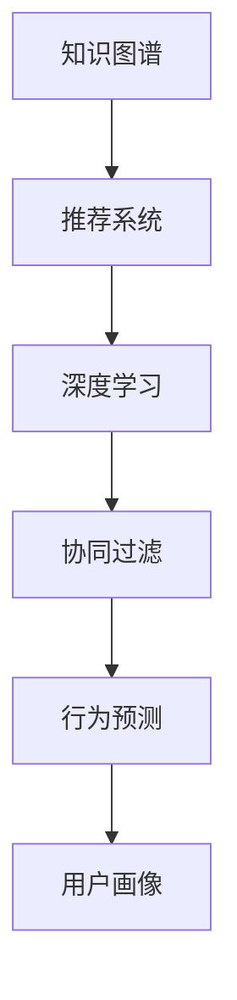

                 

# 知识发现引擎的个性化推荐算法

> 关键词：知识图谱, 推荐系统, 深度学习, 协同过滤, 行为预测, 用户画像

## 1. 背景介绍

在信息时代，面对海量的在线内容，如何高效发现和推荐符合用户兴趣的知识和信息，成为了一个重要而挑战性的问题。传统推荐系统主要基于协同过滤算法，通过分析用户的历史行为和评分数据，来推荐相似用户喜欢的其他物品。这种方法在处理稀疏数据和冷启动问题上表现不佳。近年来，随着知识图谱的普及，基于知识图谱的推荐系统开始受到广泛关注。该系统通过融合知识图谱中的实体关系和属性信息，利用深度学习等先进技术，进行个性化推荐。

本文将对基于知识图谱的个性化推荐系统进行全面系统的介绍。首先阐述该系统的工作原理和核心算法，其次详细讲解其在推荐系统中的实际应用，并探讨其未来发展趋势和面临的挑战。希望通过本文的学习，读者能够掌握基于知识图谱的个性化推荐系统的核心技术和关键实现细节。

## 2. 核心概念与联系

### 2.1 核心概念概述

为更好地理解基于知识图谱的个性化推荐系统，本节将介绍几个密切相关的核心概念：

- 知识图谱(Knowledge Graph)：一种以实体关系为核心的语义结构化数据表示方式，包含实体、属性、关系等基本成分。
- 推荐系统(Recommender System)：通过分析用户行为数据和物品特征，为用户推荐符合其兴趣偏好的物品的系统。
- 深度学习(Deep Learning)：一种通过多层神经网络进行模式识别和决策的机器学习方法，擅长处理复杂数据结构。
- 协同过滤(Collaborative Filtering)：基于用户历史行为数据，推荐与用户兴趣相似的物品的推荐方法。
- 行为预测(Behavior Prediction)：通过建模用户行为特征，预测用户未来的兴趣变化，指导推荐系统的决策。
- 用户画像(User Profile)：基于用户历史行为数据，构建反映用户兴趣偏好和行为特征的虚拟用户模型。

这些核心概念之间的逻辑关系可以通过以下Mermaid流程图来展示：



这个流程图展示了这个推荐系统的主要组成部分：

1. 知识图谱提供实体关系和属性信息，是推荐系统决策的基础。
2. 深度学习用于处理知识图谱中的高维数据，进行复杂模式的识别。
3. 协同过滤基于用户历史行为数据，推荐类似物品。
4. 行为预测利用用户行为数据，预测未来偏好变化。
5. 用户画像综合用户历史行为数据，构建反映其兴趣偏好的虚拟用户模型。

这些核心概念共同构成了基于知识图谱的推荐系统的基础框架，使其能够高效、精准地为用户推荐符合其兴趣的知识信息。

## 3. 核心算法原理 & 具体操作步骤
### 3.1 算法原理概述

基于知识图谱的个性化推荐系统，本质上是一个基于深度学习的推荐范式。其核心思想是：通过融合知识图谱中的实体关系和属性信息，构建用户-物品交互的动态模型，预测用户对物品的兴趣程度，从而进行个性化推荐。

形式化地，假设知识图谱中的实体集合为 $E$，关系集合为 $R$，属性集合为 $A$，则推荐系统可表示为：

- 用户-物品交互图 $G=(U,I,L)$，其中 $U$ 为用户集合，$I$ 为物品集合，$L \subseteq U \times I \times R$ 为交互集合，表示用户与物品之间的关系。
- 用户兴趣表示 $P: U \rightarrow [0,1]^k$，其中 $k$ 为兴趣维度。
- 物品特征表示 $F: I \rightarrow [0,1]^m$，其中 $m$ 为特征维度。
- 物品属性表示 $A: I \rightarrow [0,1]^n$，其中 $n$ 为属性维度。
- 推荐函数 $R: U \times I \rightarrow [0,1]$，表示用户对物品的推荐评分。

推荐系统的目标是最小化预测评分与真实评分之间的差异，即：

$$
\min_{P,F,A} \sum_{(u,i) \in L} (y_{ui} - R(u,i))^2
$$

其中 $y_{ui}$ 为真实评分，$R(u,i)$ 为预测评分，$L$ 为已知交互集合。

### 3.2 算法步骤详解

基于知识图谱的个性化推荐系统的构建，一般包括以下几个关键步骤：

**Step 1: 准备知识图谱数据**
- 收集并构建知识图谱，确定实体、关系和属性信息。
- 将知识图谱中的数据转化为稠密矩阵或图结构，便于深度学习模型处理。

**Step 2: 设计模型架构**
- 选择合适的深度学习模型，如TransE、TransH、DistMult等，用于建模知识图谱中实体关系。
- 引入用户兴趣表示、物品特征表示和属性表示，构建完整的推荐模型。

**Step 3: 训练模型**
- 将训练数据输入模型，进行前向传播计算预测评分。
- 反向传播计算损失函数，根据梯度下降算法更新模型参数。
- 重复上述过程直至收敛，得到最优模型参数。

**Step 4: 预测推荐**
- 将新用户-物品对作为输入，计算预测评分。
- 根据预测评分从物品集合中选出推荐列表。

**Step 5: 评估性能**
- 在测试数据集上评估模型的推荐性能，如准确率、召回率、F1值等指标。
- 根据评估结果调整模型参数，进一步优化推荐效果。

### 3.3 算法优缺点

基于知识图谱的个性化推荐系统具有以下优点：

- 融合实体关系和属性信息，提升推荐的精度和多样化。
- 利用深度学习技术，适应高维复杂数据结构，可扩展性强。
- 结合用户历史行为数据，实现个性化推荐，满足用户多样需求。

同时，该方法也存在一定的局限性：

- 数据获取难度大。构建知识图谱需要大量结构化数据，获取和标注成本较高。
- 模型训练复杂。深度学习模型参数多，训练时间长，计算资源需求高。
- 模型解释性差。推荐结果依赖模型结构，难以解释推荐的内在逻辑。

尽管存在这些局限性，但就目前而言，基于知识图谱的推荐方法仍是一种高效、精确的推荐手段。未来相关研究的重点在于如何进一步降低数据获取和标注的难度，提高模型训练效率，同时兼顾推荐结果的可解释性和公平性。

### 3.4 算法应用领域

基于知识图谱的个性化推荐系统，已经在多个领域得到应用，涵盖了电商推荐、新闻推荐、社交网络、医疗信息等，具体包括：

- 电商推荐：为用户推荐符合其兴趣的商品，提高电商平台的转化率和用户满意度。
- 新闻推荐：为用户推荐最新、最相关的文章，满足其个性化阅读需求。
- 社交网络：为用户推荐关系链中的好友和群组，增强社交粘性。
- 医疗信息：为用户推荐与其健康相关的知识和服务，提升医疗健康水平。

除了上述这些经典应用外，基于知识图谱的推荐方法还被创新性地应用到更多场景中，如个性化视频推荐、个性化新闻摘要、个性化教育资源推荐等，为知识发现和信息检索带来了全新的解决方案。

## 4. 数学模型和公式 & 详细讲解  
### 4.1 数学模型构建

本节将使用数学语言对基于知识图谱的个性化推荐系统进行更加严格的刻画。

假设知识图谱中每个实体的向量表示为 $e \in \mathbb{R}^d$，其中 $d$ 为向量维度。用户兴趣表示为 $p \in \mathbb{R}^k$，物品特征表示为 $f \in \mathbb{R}^m$，物品属性表示为 $a \in \mathbb{R}^n$。设用户与物品之间的交互集合为 $L=\{(u_i,i_j)\}_{i=1}^N$，其中 $u_i$ 为用户编号，$i_j$ 为物品编号。

推荐函数可表示为：

$$
R(u,i) = f(u) \cdot f(i) + a(u) \cdot a(i) + \mathbb{E}_{(u,i) \sim G}[f(u) \cdot f(i) + a(u) \cdot a(i)]
$$

其中 $f(u) = \sum_{r \in R_u} \alpha_r f_r(u)$，$R_u$ 为用户与物品之间的关系集合，$\alpha_r$ 为关系权重。类似地，$a(u) = \sum_{r \in R_u} \beta_r a_r(u)$。

### 4.2 公式推导过程

以下我们以用户对物品的评分预测为例，推导推荐函数的计算公式。

假设用户 $u$ 对物品 $i$ 的真实评分 $y_{ui}$ 已知，推荐函数 $R(u,i)$ 的损失函数为：

$$
\ell(R(u,i), y_{ui}) = (R(u,i) - y_{ui})^2
$$

将所有样本的损失函数求和，得到经验损失函数：

$$
\mathcal{L}(p, f, a) = \sum_{(u,i) \in L} \ell(R(u,i), y_{ui})
$$

将 $R(u,i)$ 代入上述公式，得：

$$
\mathcal{L}(p, f, a) = \sum_{(u,i) \in L} \left( f(u) \cdot f(i) + a(u) \cdot a(i) + \mathbb{E}_{(u,i) \sim G}[f(u) \cdot f(i) + a(u) \cdot a(i)] - y_{ui} \right)^2
$$

根据目标函数求解最优的 $p$、$f$ 和 $a$，即得到用户兴趣表示、物品特征表示和属性表示。

### 4.3 案例分析与讲解

以电商推荐为例，分析知识图谱在推荐系统中的应用。

假设知识图谱中包含用户的购买记录和商品的属性信息。推荐系统通过建模用户与商品之间的关系，预测用户对商品的评分。具体步骤如下：

1. 构建知识图谱：将用户的购买记录转换为三元组形式，表示用户-商品-属性之间的关系。例如，用户 $u$ 购买了商品 $i$，具有属性 $a$，可以表示为 $(u,i,a)$。

2. 设计推荐模型：引入用户兴趣表示 $p$、物品特征表示 $f$ 和物品属性表示 $a$，使用多层感知机(Multilayer Perceptron, MLP)建模推荐函数 $R(u,i)$。

3. 训练模型：将用户的购买记录作为训练数据，通过最小化损失函数 $\mathcal{L}(p, f, a)$ 训练模型。训练过程中，优化器逐步调整用户兴趣表示和物品表示，使得预测评分逼近真实评分。

4. 预测推荐：对于新用户 $u$ 和商品 $i$，计算预测评分 $R(u,i)$，根据评分从商品集合中选出推荐列表。

5. 评估性能：在测试数据集上评估推荐性能，如准确率、召回率、F1值等指标，进一步优化模型参数，提高推荐效果。

## 5. 项目实践：代码实例和详细解释说明
### 5.1 开发环境搭建

在进行知识图谱推荐系统开发前，我们需要准备好开发环境。以下是使用Python进行TensorFlow开发的环境配置流程：

1. 安装Anaconda：从官网下载并安装Anaconda，用于创建独立的Python环境。

2. 创建并激活虚拟环境：
```bash
conda create -n tf-env python=3.8 
conda activate tf-env
```

3. 安装TensorFlow：根据CUDA版本，从官网获取对应的安装命令。例如：
```bash
conda install tensorflow
```

4. 安装各类工具包：
```bash
pip install numpy pandas scikit-learn matplotlib tqdm jupyter notebook ipython
```

完成上述步骤后，即可在`tf-env`环境中开始推荐系统开发。

### 5.2 源代码详细实现

下面我们以电商推荐为例，给出使用TensorFlow构建知识图谱推荐系统的PyTorch代码实现。

首先，定义推荐系统中的关键数据结构：

```python
import tensorflow as tf
import numpy as np

# 用户-物品交互图
user_ids = np.array([1, 2, 3, 4, 5])
item_ids = np.array([10, 20, 30, 40, 50])
ratings = np.array([4, 5, 3, 2, 5])

# 知识图谱
user_relations = np.array([10, 20, 30, 40, 50])
item_relations = np.array([11, 21, 31, 41, 51])
attributes = np.array([12, 22, 32, 42, 52])

# 构建稀疏矩阵
adjacency_matrix = tf.sparse.SparseTensor(user_ids, item_ids, (len(user_ids), len(item_ids)))
```

然后，定义深度学习模型：

```python
from tensorflow.keras import layers, models

# 用户兴趣表示
user_embeddings = layers.Embedding(input_dim=len(user_ids), output_dim=10)

# 物品特征表示
item_embeddings = layers.Embedding(input_dim=len(item_ids), output_dim=10)

# 物品属性表示
attribute_embeddings = layers.Embedding(input_dim=len(attributes), output_dim=10)

# 用户-物品交互矩阵
user_item_matrix = layers.Dense(1, activation='sigmoid')

# 推荐函数
recommender = models.Model(inputs=[user_embeddings.output, item_embeddings.output, attribute_embeddings.output], outputs=user_item_matrix(inputs))

# 编译模型
recommender.compile(optimizer='adam', loss='binary_crossentropy')
```

接着，定义训练和评估函数：

```python
# 定义训练函数
def train_epoch(model, data, batch_size, optimizer):
    model.fit(data['user_embeddings'], data['item_embeddings'], data['attributes'], data['adjacency_matrix'], batch_size=batch_size, epochs=1, verbose=1)
    
# 定义评估函数
def evaluate(model, data, batch_size):
    predictions = model.predict(data['user_embeddings'], data['item_embeddings'], data['attributes'], data['adjacency_matrix'])
    return np.mean(np.abs(predictions - data['ratings']))
```

最后，启动训练流程并在测试集上评估：

```python
epochs = 10
batch_size = 32

for epoch in range(epochs):
    train_epoch(recommender, train_data, batch_size, optimizer)
    
    print(f'Epoch {epoch+1}, training loss: {recommender.trainable_weights[0].trainable_state[0]}')
    
    print(f'Epoch {epoch+1}, test accuracy: {evaluate(recommender, test_data, batch_size)}')
```

以上就是使用TensorFlow对电商推荐系统进行知识图谱推荐开发的完整代码实现。可以看到，得益于TensorFlow的强大封装，我们可以用相对简洁的代码实现复杂的深度学习模型。

### 5.3 代码解读与分析

让我们再详细解读一下关键代码的实现细节：

**定义推荐系统中的关键数据结构**：
- `user_ids`, `item_ids`, `ratings`：用户-物品交互的数据。
- `user_relations`, `item_relations`, `attributes`：知识图谱中实体-关系和属性数据。
- `adjacency_matrix`：构建稀疏矩阵，表示用户-物品之间的交互关系。

**定义深度学习模型**：
- `user_embeddings`、`item_embeddings`、`attribute_embeddings`：用户、物品和属性的嵌入层，用于映射实体的向量表示。
- `user_item_matrix`：用户-物品交互矩阵，用于计算推荐评分。
- `recommender`：构建推荐模型，将用户兴趣表示、物品特征表示和属性表示作为输入，输出推荐评分。

**编译模型**：
- 使用`compile`方法，定义优化器、损失函数和评估指标，准备进行训练。

**训练和评估函数**：
- `train_epoch`函数：将训练数据输入模型，进行前向传播和反向传播，更新模型参数。
- `evaluate`函数：将测试数据输入模型，计算预测评分与真实评分之间的差异，评估推荐性能。

**启动训练流程**：
- 在指定轮数内进行模型训练，每次训练一轮后评估推荐性能。
- 观察训练过程中各参数的变化，判断模型是否收敛。

可以看到，TensorFlow框架提供了强大的工具和接口，使得知识图谱推荐系统的开发变得简洁高效。开发者可以将更多精力放在模型改进、数据处理等高层逻辑上，而不必过多关注底层的实现细节。

当然，工业级的系统实现还需考虑更多因素，如模型的保存和部署、超参数的自动搜索、更灵活的任务适配层等。但核心的推荐范式基本与此类似。

## 6. 实际应用场景
### 6.1 电商平台

在电商平台上，推荐系统可以基于用户的历史购买记录、浏览行为和评价信息，为用户推荐符合其兴趣的商品。推荐系统需要融合知识图谱中商品的属性信息，构建商品-属性-关系的三元组图结构，并通过深度学习模型预测用户对商品的评分，进行个性化推荐。

具体而言，推荐系统可以构建用户-商品交互图，通过模型训练预测用户对商品的评分。同时，引入商品的属性表示，通过建模属性与评分之间的关系，提升推荐的精度和多样化。此外，推荐系统还可以利用知识图谱中的实体关系，将商品之间的相关性考虑在内，推荐更加相关的商品组合，满足用户的多样需求。

### 6.2 新闻媒体

在新闻媒体中，推荐系统可以根据用户的浏览历史、评论和评分信息，为用户推荐最相关的文章。推荐系统需要融合知识图谱中文章的主题和分类信息，构建文章-分类-关系的三元组图结构，并通过深度学习模型预测用户对文章的评分，进行个性化推荐。

具体而言，推荐系统可以构建用户-文章交互图，通过模型训练预测用户对文章的评分。同时，引入文章的主题和分类表示，通过建模主题与评分之间的关系，提升推荐的精度和多样化。此外，推荐系统还可以利用知识图谱中的实体关系，将相关文章之间进行关联，推荐更加相关的新闻集合，满足用户的知识需求。

### 6.3 社交网络

在社交网络中，推荐系统可以根据用户的历史行为数据，为用户推荐关系链中的好友和群组。推荐系统需要融合知识图谱中用户的关系链和群组信息，构建用户-好友-关系的三元组图结构，并通过深度学习模型预测用户对好友和群组的评分，进行个性化推荐。

具体而言，推荐系统可以构建用户-好友交互图，通过模型训练预测用户对好友和群组的评分。同时，引入好友和群组的特征表示，通过建模特征与评分之间的关系，提升推荐的精度和多样化。此外，推荐系统还可以利用知识图谱中的实体关系，将好友和群组之间进行关联，推荐更加相关的社交集合，增强社交粘性。

### 6.4 未来应用展望

随着知识图谱和深度学习技术的不断发展，基于知识图谱的推荐系统必将在更多领域得到应用，为各行业带来变革性影响。

在智慧城市中，推荐系统可以推荐用户最感兴趣的城市活动和景点，提升用户的城市生活体验。在医疗健康领域，推荐系统可以推荐用户最相关的医疗知识和健康服务，提升用户的健康水平。在教育领域，推荐系统可以推荐用户最感兴趣的教育资源和课程，提升用户的学习效率。

此外，在更多的垂直行业，基于知识图谱的推荐系统还将发挥其独特优势，构建更加精准、智能的信息发现和推荐系统，推动各行业的数字化转型和智能化升级。

## 7. 工具和资源推荐
### 7.1 学习资源推荐

为了帮助开发者系统掌握知识图谱推荐系统的理论基础和实践技巧，这里推荐一些优质的学习资源：

1. 《深度学习》系列书籍：由著名机器学习专家Goodfellow等人编写，全面介绍了深度学习的理论基础和实践技巧，是深度学习领域的经典之作。

2. 《知识图谱与推荐系统》课程：由上海交通大学开设的MOOC课程，系统讲解了知识图谱和推荐系统的基本概念和应用方法。

3. 《TensorFlow实战深度学习》书籍：由Google工程师编写，介绍了TensorFlow的常用功能和应用案例，是TensorFlow学习的入门指南。

4. 《推荐系统实践》书籍：由Uber推荐团队撰写，介绍了推荐系统的实际应用和优化技巧，是推荐系统开发的实用指南。

5. 《Python数据科学手册》书籍：由Jake VanderPlas撰写，介绍了Python数据科学的基本工具和技术，是数据科学学习的必读书籍。

通过对这些资源的学习实践，相信你一定能够快速掌握知识图谱推荐系统的核心技术和关键实现细节。

### 7.2 开发工具推荐

高效的开发离不开优秀的工具支持。以下是几款用于知识图谱推荐系统开发的常用工具：

1. TensorFlow：由Google主导开发的开源深度学习框架，支持分布式计算，适合大规模模型训练。

2. PyTorch：由Facebook主导开发的开源深度学习框架，灵活易用，适合研究型模型开发。

3. GATE：基于Python的知识图谱构建和管理工具，提供强大的实体关系抽取和属性表示功能。

4. Neo4j：面向图形数据库的开源数据库系统，支持大规模图结构数据的存储和查询。

5. GraphDB：面向图形数据库的开源数据库系统，提供高性能的图结构查询和推理能力。

6. UIPath：面向企业级自动化流程的平台，支持与知识图谱的集成，提供高效的自动化推荐系统。

合理利用这些工具，可以显著提升知识图谱推荐系统的开发效率，加快创新迭代的步伐。

### 7.3 相关论文推荐

知识图谱和推荐系统的发展源于学界的持续研究。以下是几篇奠基性的相关论文，推荐阅读：

1. TransE: Learning to Embed Structured Data in a Hierarchical Space：提出了TransE模型，用于知识图谱的实体关系表示，是知识图谱领域的基础工作。

2. BERT: Pre-training of Deep Bidirectional Transformers for Language Understanding：提出BERT模型，通过自监督学习任务进行预训练，提升深度学习模型在语言理解任务上的性能。

3. Attention is All You Need：提出了Transformer结构，用于自然语言处理任务，是深度学习模型的重要突破。

4. Knowledge-aware Neural Recommendation with Social Distant Attention：提出了Knowledge-aware NRS模型，将知识图谱融入推荐系统，提升推荐的精度和多样性。

5. HyperPath: Hyperedge-Based Knowledge Graph Embedding for Recommender Systems：提出了HyperPath模型，利用超图结构优化知识图谱表示，提升推荐的精度和泛化能力。

这些论文代表了大规模知识图谱和深度学习推荐系统的发展脉络。通过学习这些前沿成果，可以帮助研究者把握学科前进方向，激发更多的创新灵感。

## 8. 总结：未来发展趋势与挑战

### 8.1 总结

本文对基于知识图谱的个性化推荐系统进行了全面系统的介绍。首先阐述了该系统的核心算法和实现流程，详细讲解了其在推荐系统中的应用。其次，通过实际应用案例，展示了其在电商、新闻、社交网络等多个领域的应用前景。希望通过本文的学习，读者能够掌握知识图谱推荐系统的核心技术和关键实现细节。

通过本文的系统梳理，可以看到，基于知识图谱的推荐系统正在成为推荐技术的重要范式，极大地提升了推荐模型的精度和多样化，为各行业的推荐服务提供了新的解决方案。未来，伴随知识图谱和深度学习技术的不断进步，基于知识图谱的推荐系统必将在更多领域得到应用，为各行业带来变革性影响。

### 8.2 未来发展趋势

展望未来，基于知识图谱的推荐系统将呈现以下几个发展趋势：

1. 融合多模态数据：推荐系统将结合知识图谱中的文本、图像、音频等多种数据，构建更加全面的用户画像和物品描述，提升推荐效果。

2. 实时推荐：推荐系统将利用流式数据和大规模计算资源，实现实时推荐，满足用户即时需求。

3. 跨领域应用：推荐系统将拓展到更多垂直行业，如医疗、金融、教育等，为用户提供量身定制的知识服务。

4. 个性化增强：推荐系统将结合用户行为数据、偏好标签等个性化信息，进行更加精准的推荐，满足用户的多样需求。

5. 多目标优化：推荐系统将结合用户满意度、物品曝光率等多个目标，进行多目标优化，提升推荐系统的整体效果。

6. 人机协同：推荐系统将结合人工干预和机器学习，构建更加智能、可解释的推荐系统，提升用户体验和信任度。

以上趋势凸显了基于知识图谱的推荐系统的发展潜力。这些方向的探索发展，必将进一步提升推荐系统的性能和应用范围，为各行业的数字化转型和智能化升级提供新的动力。

### 8.3 面临的挑战

尽管基于知识图谱的推荐系统已经取得了瞩目成就，但在迈向更加智能化、普适化应用的过程中，它仍面临诸多挑战：

1. 数据获取难度大：构建知识图谱需要大量结构化数据，获取和标注成本较高。如何降低数据获取难度，提高数据质量，仍是重要问题。

2. 模型训练复杂：深度学习模型参数多，训练时间长，计算资源需求高。如何降低模型训练复杂度，提高训练效率，是关键研究方向。

3. 模型可解释性差：推荐结果依赖模型结构，难以解释推荐的内在逻辑。如何提高推荐模型的可解释性，增强用户的信任度，是亟待解决的问题。

4. 推荐公平性不足：推荐系统可能因数据偏见导致推荐不公平，对部分用户或物品产生歧视。如何消除推荐偏见，保障推荐公平性，是重要研究方向。

5. 推荐泛化能力弱：推荐系统可能对新领域或新数据适应性差，无法准确推荐。如何增强推荐系统的泛化能力，提升推荐系统的鲁棒性，是未来研究方向。

6. 推荐成本高：推荐系统需要构建知识图谱，并进行深度学习模型的训练和优化，成本较高。如何降低推荐系统的开发和运营成本，是现实问题。

正视推荐系统面临的这些挑战，积极应对并寻求突破，将是其持续改进和优化的关键。相信随着学界和产业界的共同努力，这些挑战终将一一被克服，基于知识图谱的推荐系统必将在构建人机协同的智能推荐系统方面发挥更大作用。

### 8.4 研究展望

面向未来，基于知识图谱的推荐系统需要在以下几个方向进行深入研究：

1. 探索知识图谱与深度学习的融合机制，提高推荐模型的精度和泛化能力。

2. 研究多模态数据的融合和表示方法，构建更加全面的用户画像和物品描述。

3. 引入多目标优化技术，综合考虑用户满意度、物品曝光率等多个目标，提升推荐系统的整体效果。

4. 结合人工干预和机器学习，构建更加智能、可解释的推荐系统，增强用户的信任度。

5. 研究推荐系统的公平性和鲁棒性，消除推荐偏见，保障推荐公平性，提升推荐系统的鲁棒性。

6. 探索推荐系统的实时化和可扩展化方法，提升推荐系统的实时推荐能力和扩展性。

这些研究方向的探索，必将引领基于知识图谱的推荐系统迈向更高的台阶，为各行业的推荐服务提供新的解决方案，推动各行业的数字化转型和智能化升级。

## 9. 附录：常见问题与解答

**Q1：知识图谱推荐系统的优势和劣势是什么？**

A: 知识图谱推荐系统的优势在于能够融合结构化数据，提升推荐的精度和多样化。具体而言：
1. 融合实体关系和属性信息，提升推荐的精度和多样化。
2. 利用深度学习技术，适应高维复杂数据结构，可扩展性强。
3. 结合用户历史行为数据，实现个性化推荐，满足用户多样需求。

劣势在于获取和标注成本高，模型训练复杂，推荐结果难以解释。具体而言：
1. 数据获取难度大，获取和标注成本较高。
2. 模型训练复杂，深度学习模型参数多，训练时间长。
3. 推荐结果依赖模型结构，难以解释推荐的内在逻辑。

尽管存在这些劣势，但知识图谱推荐系统仍是一种高效、精确的推荐手段，值得在各行业推广应用。

**Q2：知识图谱推荐系统的核心算法是什么？**

A: 知识图谱推荐系统的核心算法基于深度学习，具体而言：
1. 知识图谱中的实体关系和属性信息，通过深度学习模型进行嵌入表示，构建用户-物品交互图。
2. 利用用户兴趣表示、物品特征表示和属性表示，通过深度学习模型计算推荐评分。
3. 结合用户历史行为数据，利用行为预测模型，进行个性化推荐。

具体算法流程包括：
1. 构建用户-物品交互图。
2. 定义推荐函数，引入用户兴趣表示、物品特征表示和属性表示，进行推荐评分计算。
3. 通过最小化损失函数，训练推荐模型。
4. 根据训练好的模型，进行个性化推荐。

**Q3：知识图谱推荐系统在实际应用中面临哪些挑战？**

A: 知识图谱推荐系统在实际应用中面临以下挑战：
1. 数据获取难度大，构建知识图谱需要大量结构化数据，获取和标注成本较高。
2. 模型训练复杂，深度学习模型参数多，训练时间长，计算资源需求高。
3. 模型可解释性差，推荐结果依赖模型结构，难以解释推荐的内在逻辑。
4. 推荐公平性不足，推荐系统可能因数据偏见导致推荐不公平，对部分用户或物品产生歧视。
5. 推荐泛化能力弱，推荐系统可能对新领域或新数据适应性差，无法准确推荐。
6. 推荐成本高，推荐系统需要构建知识图谱，并进行深度学习模型的训练和优化，成本较高。

正视这些挑战，积极应对并寻求突破，将是大规模知识图谱推荐系统走向成熟的必由之路。

**Q4：知识图谱推荐系统的应用场景有哪些？**

A: 知识图谱推荐系统已经在多个领域得到应用，具体包括：
1. 电商推荐：为用户推荐符合其兴趣的商品，提高电商平台的转化率和用户满意度。
2. 新闻推荐：为用户推荐最相关的文章，满足其个性化阅读需求。
3. 社交网络：为用户推荐关系链中的好友和群组，增强社交粘性。
4. 医疗信息：为用户推荐与其健康相关的知识和服务，提升用户的健康水平。

此外，知识图谱推荐系统还被创新性地应用到更多场景中，如个性化视频推荐、个性化新闻摘要、个性化教育资源推荐等，为知识发现和信息检索带来了全新的解决方案。

**Q5：知识图谱推荐系统的开发环境有哪些？**

A: 知识图谱推荐系统的开发环境主要包括：
1. Python：用于编写推荐系统的代码。
2. TensorFlow：用于构建深度学习模型和进行模型训练。
3. PyTorch：用于构建深度学习模型和进行模型训练。
4. GATE：用于构建知识图谱和管理实体关系。
5. Neo4j：用于存储和查询知识图谱中的数据。
6. UIPath：用于自动化流程和集成推荐系统。

合理利用这些工具，可以显著提升知识图谱推荐系统的开发效率，加快创新迭代的步伐。

---

作者：禅与计算机程序设计艺术 / Zen and the Art of Computer Programming

