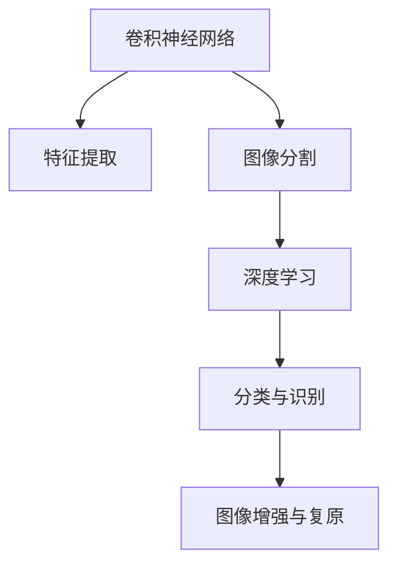

                 

# 知识发现引擎的图像识别与处理技术

> 关键词：知识发现引擎, 图像识别, 数据处理, 特征提取, 深度学习, 计算机视觉, 图像处理

## 1. 背景介绍

### 1.1 问题由来

在数字化时代，数据的爆炸式增长带来了新的挑战和机遇。海量数据中蕴含着丰富的知识和信息，需要高效的算法和工具来进行探索和发现。图像识别与处理作为计算机视觉的重要分支，已经成为知识发现引擎中的关键技术。

图像识别与处理技术，通过深度学习和计算机视觉方法，可以从图像中自动提取有用的信息，如图像中的对象、场景、颜色等，帮助人们更好地理解和利用图像数据。这些技术广泛应用于医疗影像分析、智能监控、自动驾驶、安防识别等多个领域。

然而，现有的图像处理技术还存在诸多局限性，如处理速度慢、精度低、鲁棒性差等问题。如何开发更高效、更鲁棒的图像识别与处理引擎，成为了当前计算机视觉领域的重要研究课题。

### 1.2 问题核心关键点

图像识别与处理技术的核心在于将图像数据转换为机器可理解的形式，从中提取有用的特征，并利用深度学习模型对这些特征进行分类、识别、分割等操作。核心关键点包括：

1. **特征提取**：将图像数据转换为特征向量，使得模型能够理解图像中的语义信息。
2. **分类与识别**：通过训练好的深度学习模型对图像进行分类或识别，输出对应的类别或对象。
3. **图像分割**：将图像中的每个像素点归属于不同的类别，实现像素级的分割和标记。
4. **图像增强与复原**：通过对图像进行增强、去噪、复原等操作，提升图像质量，便于后续处理。

这些核心关键点共同构成了图像识别与处理技术的基本框架，其应用广泛且深远，涉及诸多前沿技术，如卷积神经网络、循环神经网络、生成对抗网络等。

## 2. 核心概念与联系

### 2.1 核心概念概述

为更好地理解图像识别与处理技术，本节将介绍几个关键概念：

1. **卷积神经网络（CNN）**：一种特殊的深度神经网络，主要应用于图像处理任务，通过卷积操作提取图像的局部特征。
2. **图像分割**：将图像划分为若干个像素级或区域级的类别，实现对图像的精细划分和标注。
3. **深度学习**：一种基于多层神经网络的机器学习技术，通过反向传播算法训练模型，实现复杂的模式识别和预测。
4. **特征提取**：从原始图像中提取出特征向量，使得模型能够理解图像的语义信息。
5. **图像增强**：通过一系列图像处理操作，提升图像质量，便于后续处理和分析。

这些核心概念之间的逻辑关系可以通过以下Mermaid流程图来展示：



这个流程图展示了大语言模型的核心概念及其之间的关系：

1. 卷积神经网络作为特征提取的基础，通过卷积操作提取图像的局部特征。
2. 图像分割将图像划分为若干个类别，有助于对图像进行精细分析和理解。
3. 深度学习模型通过对特征进行分类和识别，实现对图像的语义理解。
4. 图像增强和复原操作提升图像质量，便于后续处理和分析。

这些概念共同构成了图像识别与处理技术的基本框架，使得模型能够高效地处理和理解图像数据。

## 3. 核心算法原理 & 具体操作步骤
### 3.1 算法原理概述

图像识别与处理技术的核心算法原理是卷积神经网络（CNN）和深度学习。其中，CNN通过卷积操作提取图像的局部特征，再通过池化层和全连接层进行特征融合和分类。深度学习模型通过对大量数据进行训练，学习到复杂的特征表示，实现对图像的语义理解。

具体而言，CNN模型由多个卷积层、池化层和全连接层组成。卷积层通过滤波器对输入图像进行卷积操作，提取局部特征。池化层通过下采样操作减少特征图的大小，提高计算效率。全连接层将池化层的输出进行连接，进行分类或回归等任务。

深度学习模型通过反向传播算法进行训练，不断调整模型参数，使得模型能够更准确地预测图像类别。常用的深度学习模型包括VGG、ResNet、Inception等，它们在图像处理任务上取得了广泛应用。

### 3.2 算法步骤详解

图像识别与处理技术的一般步骤包括：

1. **数据准备**：收集和标注图像数据集，进行预处理和增强操作。
2. **模型搭建**：选择合适的卷积神经网络模型，搭建深度学习模型。
3. **模型训练**：使用标注数据集对模型进行训练，通过反向传播算法优化模型参数。
4. **模型评估**：使用测试数据集对模型进行评估，计算分类准确率、损失等指标。
5. **模型应用**：将训练好的模型应用于实际图像数据，进行分类、识别、分割等操作。

### 3.3 算法优缺点

卷积神经网络和深度学习模型在图像处理技术中具有以下优点：

1. **高效的特征提取**：CNN通过卷积操作能够高效地提取图像的局部特征，提高模型的分类和识别精度。
2. **鲁棒性强**：深度学习模型通过大量数据训练，能够学习到复杂的特征表示，具有较强的鲁棒性和泛化能力。
3. **应用广泛**：CNN和深度学习模型已经在图像处理任务中得到了广泛应用，如物体检测、图像分割、人脸识别等。

同时，这些算法也存在一些局限性：

1. **计算资源需求高**：卷积神经网络和深度学习模型需要大量的计算资源进行训练和推理，对硬件设施要求较高。
2. **过拟合风险**：在数据量不足的情况下，模型容易发生过拟合现象，导致在测试集上性能下降。
3. **可解释性不足**：深度学习模型通常是黑盒系统，难以解释其内部的决策过程。

### 3.4 算法应用领域

图像识别与处理技术在多个领域得到了广泛应用，例如：

1. **医疗影像分析**：通过卷积神经网络对医学影像进行分类和分割，辅助医生进行诊断和治疗。
2. **自动驾驶**：利用图像识别技术进行车道识别、交通信号识别、行人检测等操作，提升自动驾驶的安全性和准确性。
3. **智能监控**：通过图像识别技术进行目标检测和行为分析，实现对公共安全的实时监控。
4. **安防识别**：通过人脸识别、行为识别等技术，提高安防系统的识别能力和效率。
5. **工业检测**：通过图像处理技术进行质量检测、缺陷识别等操作，提升工业生产的自动化水平。

## 4. 数学模型和公式 & 详细讲解 & 举例说明

### 4.1 数学模型构建

卷积神经网络模型的数学模型可以表示为：

$$
y = f(Wx + b)
$$

其中，$y$ 表示模型输出，$x$ 表示输入图像，$W$ 表示卷积核权重，$b$ 表示偏置项，$f$ 表示激活函数。卷积层的操作可以表示为：

$$
h(x) = \max\limits_{i,j} \left\{ \sum\limits_{k=0}^{n-1} \sum\limits_{m=0}^{m-1} W_{k,i,j,m} \cdot x_{i+k,j+m} + b_{k,i,j} \right\}
$$

其中，$h(x)$ 表示卷积后的特征图，$W_{k,i,j,m}$ 表示卷积核权重，$b_{k,i,j}$ 表示偏置项。

### 4.2 公式推导过程

以卷积神经网络的基本单元——卷积层为例，推导其计算公式。假设输入图像大小为$H \times W$，卷积核大小为$k \times k$，步长为$s$，输出特征图大小为$H' \times W'$，则卷积层的计算公式为：

$$
h_{i,j} = f\left( \sum\limits_{k=0}^{k-1} \sum\limits_{m=0}^{m-1} W_{k,i+k,j+m} \cdot x_{i+k,j+m} + b_{k,i,j} \right)
$$

其中，$f$ 表示激活函数，$W_{k,i,j,m}$ 表示卷积核权重，$b_{k,i,j}$ 表示偏置项。

### 4.3 案例分析与讲解

以VGG网络为例，分析其卷积层和池化层的计算过程。VGG网络通过堆叠多个卷积层和池化层，逐渐提取图像的高级特征。以VGG16为例，其卷积层计算过程如下：

1. 第一层卷积层：使用$3 \times 3$ 的卷积核，步长为1，无填充，输出特征图大小为$13 \times 13 \times 64$。
2. 第二层卷积层：使用$3 \times 3$ 的卷积核，步长为2，无填充，输出特征图大小为$6 \times 6 \times 128$。
3. 第三层卷积层：使用$3 \times 3$ 的卷积核，步长为1，无填充，输出特征图大小为$5 \times 5 \times 256$。
4. 第四层卷积层：使用$3 \times 3$ 的卷积核，步长为1，无填充，输出特征图大小为$3 \times 3 \times 512$。

池化层的操作可以表示为：

$$
h_{i,j} = f\left( \max\limits_{i'=0}^{i'=k-1} \max\limits_{j'=0}^{j'=k-1} x_{i'+i,j'+j} \right)
$$

其中，$f$ 表示激活函数，$x_{i'+i,j'+j}$ 表示池化区域内的像素值，$k$ 表示池化核大小。

## 5. 项目实践：代码实例和详细解释说明

### 5.1 开发环境搭建

在进行图像识别与处理实践前，我们需要准备好开发环境。以下是使用Python进行Keras框架开发的开发环境配置流程：

1. 安装Anaconda：从官网下载并安装Anaconda，用于创建独立的Python环境。

2. 创建并激活虚拟环境：
```bash
conda create -n cv_env python=3.8 
conda activate cv_env
```

3. 安装依赖库：
```bash
pip install numpy pandas scikit-learn matplotlib torch torchvision
```

4. 安装Keras库：
```bash
pip install keras tensorflow
```

完成上述步骤后，即可在`cv_env`环境中开始图像识别与处理实践。

### 5.2 源代码详细实现

下面是使用Keras框架对图像进行分类和识别的Python代码实现。

```python
import numpy as np
from keras.datasets import cifar10
from keras.models import Sequential
from keras.layers import Conv2D, MaxPooling2D, Flatten, Dense, Dropout

# 加载CIFAR-10数据集
(x_train, y_train), (x_test, y_test) = cifar10.load_data()

# 数据预处理
x_train = x_train / 255.0
x_test = x_test / 255.0

# 模型搭建
model = Sequential()
model.add(Conv2D(32, (3, 3), padding='same', activation='relu', input_shape=(32, 32, 3)))
model.add(Conv2D(32, (3, 3), padding='same', activation='relu'))
model.add(MaxPooling2D(pool_size=(2, 2)))
model.add(Dropout(0.25))

model.add(Conv2D(64, (3, 3), padding='same', activation='relu'))
model.add(Conv2D(64, (3, 3), padding='same', activation='relu'))
model.add(MaxPooling2D(pool_size=(2, 2)))
model.add(Dropout(0.25))

model.add(Flatten())
model.add(Dense(512, activation='relu'))
model.add(Dropout(0.5))
model.add(Dense(10, activation='softmax'))

# 编译模型
model.compile(loss='categorical_crossentropy',
              optimizer='adam',
              metrics=['accuracy'])

# 训练模型
model.fit(x_train, y_train, batch_size=64, epochs=50, validation_data=(x_test, y_test))

# 评估模型
score = model.evaluate(x_test, y_test, batch_size=64)
print('Test loss:', score[0])
print('Test accuracy:', score[1])
```

在这个示例中，我们使用CIFAR-10数据集进行图像分类任务，搭建了一个包含两个卷积层和两个池化层的卷积神经网络模型。通过反向传播算法，训练模型并在测试集上评估其性能。

### 5.3 代码解读与分析

让我们再详细解读一下关键代码的实现细节：

**模型搭建**：
- `Sequential`模型：使用Keras的序列模型，逐层搭建网络结构。
- `Conv2D`层：使用卷积层进行特征提取，通过滤波器提取图像的局部特征。
- `MaxPooling2D`层：使用池化层进行特征下采样，减少特征图的大小。
- `Dropout`层：使用Dropout层进行正则化，防止过拟合。
- `Dense`层：使用全连接层进行特征融合和分类。

**数据预处理**：
- 对输入图像进行归一化处理，将像素值缩放到0-1之间。

**模型训练**：
- 使用`fit`方法进行模型训练，指定训练集和测试集，设置批量大小和迭代次数。

**模型评估**：
- 使用`evaluate`方法评估模型在测试集上的性能，输出损失和准确率。

可以看出，Keras框架使得模型搭建和训练过程变得简洁高效，非常适合快速原型设计和迭代优化。

## 6. 实际应用场景

### 6.1 医疗影像分析

在医疗领域，图像识别与处理技术被广泛应用于医学影像的分析中。通过卷积神经网络对医学影像进行分类和分割，医生可以更准确地诊断疾病。

以乳腺癌影像分析为例，通过训练好的卷积神经网络对乳腺X光片进行分类和分割，可以自动检测出病灶区域，辅助医生进行诊断和治疗。

### 6.2 自动驾驶

在自动驾驶领域，图像识别与处理技术被用于车道识别、交通信号识别、行人检测等任务。通过卷积神经网络对摄像头采集的图像进行实时处理，自动驾驶系统可以感知周围环境，做出安全决策。

例如，在自动驾驶车辆上安装多个摄像头，通过图像识别技术对路面进行实时监测，实现对车道线的检测和跟踪，保证车辆的稳定行驶。

### 6.3 智能监控

在智能监控领域，图像识别与处理技术被用于实时监测和行为分析。通过卷积神经网络对摄像头采集的图像进行实时处理，监控系统可以自动识别异常行为，及时预警和响应。

例如，在商场中安装多个摄像头，通过图像识别技术对行人行为进行实时监测，自动识别可疑行为，及时通知安保人员进行干预。

### 6.4 安防识别

在安防领域，图像识别与处理技术被用于人脸识别、行为识别等任务。通过卷积神经网络对监控摄像头采集的图像进行实时处理，安防系统可以自动识别目标，提升安防效率。

例如，在机场、车站等公共场所，通过人脸识别技术对进出人员进行身份验证，保证安全。

### 6.5 工业检测

在工业生产中，图像识别与处理技术被用于质量检测和缺陷识别等任务。通过卷积神经网络对生产过程中的图像进行实时处理，工业检测系统可以自动识别产品质量，提升生产效率。

例如，在汽车制造厂中，通过图像识别技术对生产线上的汽车零件进行缺陷检测，及时发现和修复问题，保证产品质量。

## 7. 工具和资源推荐
### 7.1 学习资源推荐

为了帮助开发者系统掌握图像识别与处理技术，这里推荐一些优质的学习资源：

1. 《深度学习》（Ian Goodfellow等著）：该书系统介绍了深度学习的基本原理和应用，包括图像处理等领域的经典模型和算法。
2. 《计算机视觉：模型、学习和推理》（Simard等著）：该书深入浅出地介绍了计算机视觉的基本概念和算法，包括卷积神经网络和图像分割等技术。
3. 《动手学深度学习》（李沐等著）：该书提供了丰富的代码和实践案例，帮助读者快速上手深度学习模型和算法。
4. Coursera《Convolutional Neural Networks》课程：由Geoffrey Hinton等教授主讲，介绍了卷积神经网络的基本原理和应用。
5. Udacity《计算机视觉基础》课程：该课程由谷歌工程师主讲，涵盖了计算机视觉和深度学习的基本知识，包括图像分类、目标检测等任务。

通过对这些资源的学习实践，相信你一定能够快速掌握图像识别与处理技术的精髓，并用于解决实际的图像处理问题。

### 7.2 开发工具推荐

高效的开发离不开优秀的工具支持。以下是几款用于图像识别与处理开发的常用工具：

1. Keras：基于Python的开源深度学习框架，灵活动态的计算图，适合快速迭代研究。
2. TensorFlow：由Google主导开发的开源深度学习框架，生产部署方便，适合大规模工程应用。
3. PyTorch：由Facebook开发的开源深度学习框架，灵活可扩展，适合学术研究和工程应用。
4. OpenCV：开源计算机视觉库，提供了丰富的图像处理和计算机视觉算法。
5. ImageJ：开源图像处理软件，提供了强大的图像处理和分析功能。

合理利用这些工具，可以显著提升图像识别与处理任务的开发效率，加快创新迭代的步伐。

### 7.3 相关论文推荐

图像识别与处理技术的快速发展得益于学界的持续研究。以下是几篇奠基性的相关论文，推荐阅读：

1. AlexNet：卷积神经网络在图像分类任务上的突破性应用，奠定了深度学习在图像处理领域的基础。
2. VGGNet：通过堆叠多个卷积层和全连接层，提升了图像分类的精度。
3. ResNet：通过引入残差连接，解决了深度神经网络的退化问题，提升了模型的深度和精度。
4. InceptionNet：通过多分支结构，提升了特征提取和分类效率。
5. ImageNet Large Scale Visual Recognition Challenge（ILSVRC）：每年举行的图像识别比赛，推动了深度学习在图像处理领域的进展。

这些论文代表了大语言模型微调技术的发展脉络。通过学习这些前沿成果，可以帮助研究者把握学科前进方向，激发更多的创新灵感。

## 8. 总结：未来发展趋势与挑战

### 8.1 总结

本文对图像识别与处理技术进行了全面系统的介绍。首先阐述了图像识别与处理技术的背景和应用前景，明确了该技术在计算机视觉领域的重要地位。其次，从原理到实践，详细讲解了卷积神经网络和深度学习模型的核心算法和操作步骤，给出了图像处理任务开发的完整代码实例。同时，本文还广泛探讨了图像处理技术在医疗影像分析、自动驾驶、智能监控等多个行业领域的应用前景，展示了图像处理范式的巨大潜力。最后，本文精选了图像处理技术的各类学习资源，力求为读者提供全方位的技术指引。

通过本文的系统梳理，可以看到，图像识别与处理技术正在成为计算机视觉领域的重要范式，极大地拓展了深度学习模型的应用边界，催生了更多的落地场景。未来，伴随深度学习模型和图像处理技术的持续演进，相信计算机视觉技术必将迎来更加智能、高效、可解释的图像处理系统，为人类生产生活带来更多便捷和可能。

### 8.2 未来发展趋势

展望未来，图像识别与处理技术将呈现以下几个发展趋势：

1. **模型规模持续增大**：随着算力成本的下降和数据规模的扩张，卷积神经网络和深度学习模型将具备更强的特征提取和分类能力，进一步提升图像处理精度。
2. **高效计算范式**：通过引入稀疏化、量化加速等技术，提升模型的计算效率，降低硬件资源需求。
3. **多模态融合**：将视觉、语音、文本等多模态信息进行融合，提升图像处理的鲁棒性和泛化能力。
4. **自监督学习**：利用自监督学习任务，提高模型的特征提取和分类能力，降低对标注数据的依赖。
5. **低资源部署**：开发适用于移动设备、嵌入式系统的轻量级图像处理模型，提高设备的响应速度和计算效率。
6. **可解释性增强**：通过可视化、解释器等技术，提高模型的可解释性，帮助用户理解模型的决策过程。

以上趋势凸显了图像识别与处理技术的广阔前景。这些方向的探索发展，必将进一步提升图像处理系统的性能和应用范围，为计算机视觉技术带来新的突破。

### 8.3 面临的挑战

尽管图像识别与处理技术已经取得了瞩目成就，但在迈向更加智能化、普适化应用的过程中，它仍面临着诸多挑战：

1. **计算资源瓶颈**：卷积神经网络和深度学习模型需要大量的计算资源进行训练和推理，对硬件设施要求较高。
2. **数据质量和分布**：图像处理任务对数据质量和分布要求较高，数据集的不平衡和噪声会影响模型的性能。
3. **可解释性不足**：深度学习模型通常是黑盒系统，难以解释其内部的决策过程。
4. **鲁棒性问题**：模型在面对复杂场景时，容易受到光照变化、遮挡等因素的影响，鲁棒性有待提升。
5. **跨领域迁移能力**：不同领域的图像处理任务差异较大，模型难以在不同领域间进行迁移。

这些挑战凸显了图像识别与处理技术的复杂性，需要跨学科、多领域的研究者共同努力，才能不断突破技术瓶颈，提升图像处理系统的性能和应用范围。

### 8.4 研究展望

面对图像识别与处理技术所面临的挑战，未来的研究需要在以下几个方面寻求新的突破：

1. **数据增强**：通过数据增强技术，生成更多的训练样本，提高模型的鲁棒性和泛化能力。
2. **迁移学习**：通过迁移学习技术，在不同领域的图像处理任务间进行知识迁移，提升模型的跨领域适应能力。
3. **元学习**：通过元学习技术，使模型具备更快的学习和适应能力，降低对数据的依赖。
4. **生成对抗网络**：通过生成对抗网络技术，生成更加多样化的图像样本，提升模型的鲁棒性和泛化能力。
5. **联合学习**：通过联合学习技术，多设备协同训练模型，提升模型的性能和泛化能力。
6. **零样本学习**：通过零样本学习技术，使模型能够无需训练数据，直接对新图像进行分类和识别。

这些研究方向将推动图像识别与处理技术向更加智能化、高效化、普适化方向发展，为计算机视觉技术带来新的突破。面向未来，图像识别与处理技术还需要与其他人工智能技术进行更深入的融合，如知识表示、因果推理、强化学习等，多路径协同发力，共同推动计算机视觉技术的进步。只有勇于创新、敢于突破，才能不断拓展图像处理系统的边界，让计算机视觉技术更好地服务于人类生产生活。

## 9. 附录：常见问题与解答

**Q1：图像识别与处理技术的局限性有哪些？**

A: 图像识别与处理技术的局限性主要体现在以下几个方面：
1. 计算资源需求高：卷积神经网络和深度学习模型需要大量的计算资源进行训练和推理，对硬件设施要求较高。
2. 数据质量和分布：图像处理任务对数据质量和分布要求较高，数据集的不平衡和噪声会影响模型的性能。
3. 可解释性不足：深度学习模型通常是黑盒系统，难以解释其内部的决策过程。
4. 鲁棒性问题：模型在面对复杂场景时，容易受到光照变化、遮挡等因素的影响，鲁棒性有待提升。
5. 跨领域迁移能力：不同领域的图像处理任务差异较大，模型难以在不同领域间进行迁移。

这些局限性限制了图像识别与处理技术的广泛应用，需要进一步优化和改进。

**Q2：如何提升图像处理任务的鲁棒性？**

A: 提升图像处理任务的鲁棒性需要从以下几个方面进行改进：
1. 数据增强：通过数据增强技术，生成更多的训练样本，提高模型的鲁棒性和泛化能力。
2. 多模态融合：将视觉、语音、文本等多模态信息进行融合，提升图像处理的鲁棒性和泛化能力。
3. 对抗训练：通过对抗样本训练，提升模型的鲁棒性和泛化能力。
4. 迁移学习：通过迁移学习技术，在不同领域的图像处理任务间进行知识迁移，提升模型的跨领域适应能力。
5. 生成对抗网络：通过生成对抗网络技术，生成更加多样化的图像样本，提升模型的鲁棒性和泛化能力。

这些方法可以综合应用，提升图像处理任务的鲁棒性和泛化能力。

**Q3：如何开发适用于移动设备的图像处理模型？**

A: 开发适用于移动设备的图像处理模型需要考虑以下几个方面：
1. 模型压缩：通过模型压缩技术，减少模型的参数量和计算量，提升移动设备的响应速度和计算效率。
2. 量化加速：将浮点模型转为定点模型，压缩存储空间，提高计算效率。
3. 硬件加速：利用GPU、TPU等硬件设备进行加速，提升模型的处理速度。
4. 稀疏化存储：通过稀疏化存储技术，减少模型存储空间，提升移动设备的响应速度和计算效率。
5. 低资源部署：开发适用于移动设备的轻量级图像处理模型，提高设备的响应速度和计算效率。

这些方法可以综合应用，开发适用于移动设备的图像处理模型。

---

作者：禅与计算机程序设计艺术 / Zen and the Art of Computer Programming

