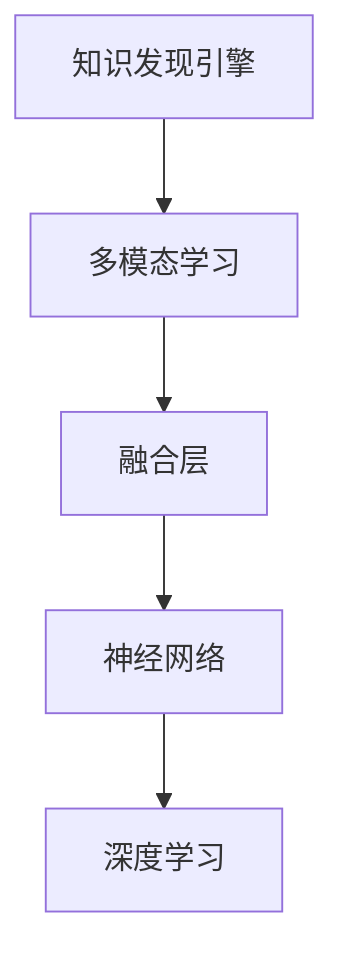
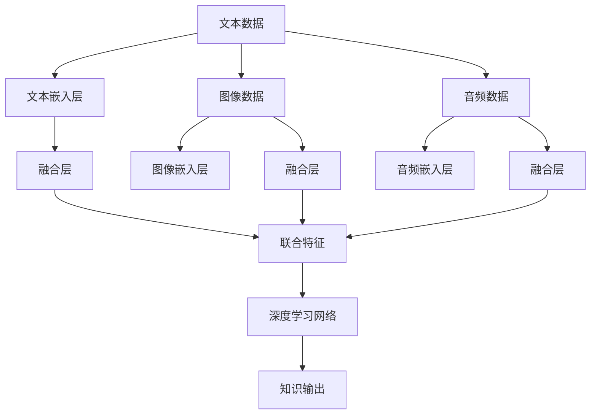

                 

# 知识发现引擎的多模态学习技术

## 1. 背景介绍

在数字化转型的大潮下，企业海量数据中蕴藏着无数潜在价值。如何从中提取、整合和挖掘出有意义的知识，成为推动企业发展的重要课题。知识发现引擎(Knowledge Discovery Engine, KDE)正是基于此需求，借助数据挖掘、机器学习等技术，从企业大数据中自动发现知识，并将其转换为易于利用的信息产品。

多模态学习（Multimodal Learning）是知识发现引擎的核心技术之一，通过对不同类型数据的联合建模和推理，挖掘出更加全面、准确的知识。文章将重点讨论多模态学习的算法原理、具体操作步骤、数学模型及应用实例，帮助读者全面理解并掌握这一前沿技术。

## 2. 核心概念与联系

### 2.1 核心概念概述

为更好地理解多模态学习，需要了解几个核心概念：

- **知识发现引擎**：利用数据挖掘、机器学习等技术，从大数据中发现潜在知识的系统。
- **多模态学习**：结合使用文本、图像、音频等多种类型的数据，进行联合建模和推理，提升知识发现效果。
- **融合层（Fusion Layer）**：将不同类型的数据通过特定方式集成，产生更具代表性和通用性的融合特征，便于后续的建模和推理。
- **神经网络（Neural Networks）**：通过多个层次的节点及权重，进行复杂的多模态数据融合和特征提取。
- **深度学习（Deep Learning）**：基于多层神经网络，自动学习特征表示的算法框架。

这些概念之间的逻辑关系可以通过以下Mermaid流程图来展示：



### 2.2 核心概念原理和架构的 Mermaid 流程图



这个流程图展示了从不同类型数据到知识输出的整个过程，其中：

- 不同模态的数据经过各自嵌入层转换为向量表示。
- 融合层将转换后的向量表示融合为一组联合特征，捕捉不同数据之间的关联。
- 联合特征输入到深度学习网络进行建模和推理，最终输出知识。

## 3. 核心算法原理 & 具体操作步骤

### 3.1 算法原理概述

多模态学习的核心思想是：通过将不同类型的数据（如文本、图像、音频等）映射到同一个语义空间，并联合建模，从而获得更具代表性、全面性的知识。其原理可以简单描述为：

1. **数据嵌入（Data Embedding）**：将不同模态的数据通过嵌入层转换为向量表示，如将文本转换为词向量，图像转换为视觉向量，音频转换为声学向量等。
2. **特征融合（Feature Fusion）**：将转换后的向量通过融合层进行联合建模，生成综合性的融合特征。
3. **建模推理（Modeling Inference）**：将融合特征输入到深度学习模型进行建模和推理，得到知识表示。

### 3.2 算法步骤详解

以多模态新闻推荐系统为例，具体步骤如下：

1. **数据预处理**：
   - 收集新闻数据集，包括标题、正文、图片、视频等不同类型的数据。
   - 对数据进行清洗、归一化、分词等预处理操作，便于后续嵌入。
   - 对图片、视频等非结构化数据进行预处理，如降维、特征提取等。

2. **数据嵌入**：
   - 对文本数据使用预训练语言模型（如BERT、GPT等）进行词嵌入，获得文本向量表示。
   - 对图像数据使用卷积神经网络（CNN）进行视觉特征提取，获得图像向量表示。
   - 对音频数据使用声学模型进行特征提取，获得声学向量表示。

3. **特征融合**：
   - 将文本、图像、声学向量表示通过融合层进行联合建模，生成综合性的融合特征。
   - 常用的融合方式包括加权平均、最大池化、注意力机制等。

4. **建模推理**：
   - 将融合特征输入到深度学习模型（如CNN、RNN等）进行建模和推理，输出新闻与用户之间的相似度。
   - 常用模型包括RNN、LSTM、GRU等，通过时序信息进行特征提取和推理。

5. **结果输出**：
   - 根据相似度排序，向用户推荐可能感兴趣的新闻。
   - 不断收集用户反馈，对模型进行微调，提升推荐效果。

### 3.3 算法优缺点

**优点**：
- **融合多源信息**：通过融合多模态数据，获得更全面、准确的知识。
- **提升模型性能**：多模态学习结合不同类型数据，可以显著提升模型的推理和预测能力。
- **应用广泛**：可以应用于新闻推荐、智能客服、安防监控、智能制造等多个领域。

**缺点**：
- **复杂度较高**：多模态数据联合建模复杂，模型训练和推理耗时较长。
- **数据对齐问题**：不同模态数据的特征维度和表达方式不同，如何有效对齐和融合是一个挑战。
- **计算资源需求高**：多模态学习需要较大的计算资源和存储空间，硬件成本较高。

### 3.4 算法应用领域

多模态学习在多个领域得到了广泛应用，以下是几个典型的应用场景：

1. **智能推荐系统**：通过对用户行为数据（如点击、浏览、评分等）和产品属性数据（如图片、文本、音频等）联合建模，推荐用户可能感兴趣的商品、新闻、视频等内容。
2. **智能客服系统**：结合用户输入文本、语音、表情等多种数据，通过自然语言处理（NLP）和语音识别技术，自动回复用户问题，提升客户满意度。
3. **安防监控系统**：结合图像、声音、传感器等数据，通过深度学习进行行为分析和异常检测，提高安全防护能力。
4. **智能制造系统**：结合设备运行数据、图像、声音等多种类型数据，通过多模态学习进行设备故障诊断和预测性维护，提高生产效率。
5. **医疗诊断系统**：结合医学影像、电子病历、基因数据等多种类型数据，通过多模态学习进行疾病诊断和预测，提升诊疗效果。

## 4. 数学模型和公式 & 详细讲解 & 举例说明

### 4.1 数学模型构建

多模态学习的数学模型构建可以分为三个步骤：数据嵌入、特征融合和建模推理。

**数据嵌入**：
- 文本数据嵌入：$x_t = f_t(x)$，其中 $x$ 为原始文本，$f_t$ 为文本嵌入函数，如BERT、Word2Vec等。
- 图像数据嵌入：$x_v = f_v(x)$，其中 $x$ 为原始图像，$f_v$ 为视觉嵌入函数，如CNN等。
- 音频数据嵌入：$x_a = f_a(x)$，其中 $x$ 为原始音频，$f_a$ 为声学嵌入函数，如MFCC等。

**特征融合**：
- 加权平均融合：$x_f = \alpha_1 x_t + \alpha_2 x_v + \alpha_3 x_a$，其中 $\alpha$ 为权重，表示不同数据类型的贡献。
- 最大池化融合：$x_f = \max(x_t, x_v, x_a)$，选择每种数据类型的最大值作为融合特征。
- 注意力机制融合：$x_f = \sum_{i=1}^n \alpha_i x_i$，其中 $\alpha$ 为注意力权重，通过注意力机制自适应地融合不同类型的数据。

**建模推理**：
- 基于多模态的深度学习模型：$y = g(x_f, \theta)$，其中 $y$ 为输出结果，$g$ 为深度学习模型，$\theta$ 为模型参数。

### 4.2 公式推导过程

以加权平均融合为例，假设文本数据嵌入后的向量为 $x_t \in \mathbb{R}^{d_t}$，图像数据嵌入后的向量为 $x_v \in \mathbb{R}^{d_v}$，音频数据嵌入后的向量为 $x_a \in \mathbb{R}^{d_a}$，权重分别为 $\alpha_t, \alpha_v, \alpha_a$，则融合后的向量 $x_f$ 的计算公式为：

$$
x_f = \alpha_t x_t + \alpha_v x_v + \alpha_a x_a
$$

假设融合后的向量输入到深度学习模型 $g$ 中进行建模推理，输出结果为 $y$，则有：

$$
y = g(x_f, \theta)
$$

### 4.3 案例分析与讲解

假设有一个多模态新闻推荐系统，其推荐结果需基于用户阅读历史和新闻内容。具体步骤如下：

1. **数据预处理**：
   - 用户阅读历史数据：$u = (u_1, u_2, ..., u_n)$，其中 $u_i$ 为第 $i$ 篇文章的阅读时间。
   - 新闻内容数据：$n = (n_1, n_2, ..., n_m)$，其中 $n_i$ 为第 $i$ 篇文章的标题、正文、图片、视频等。

2. **数据嵌入**：
   - 使用BERT进行文本数据嵌入，获得用户阅读历史和新闻内容的向量表示。
   - 使用CNN进行图像数据嵌入，获得新闻图片向量表示。
   - 使用MFCC进行音频数据嵌入，获得新闻视频声学特征向量表示。

3. **特征融合**：
   - 对用户阅读历史和新闻内容向量进行加权平均融合，得到用户特征向量。
   - 对新闻图片和声学特征向量进行融合，得到新闻特征向量。
   - 将用户特征向量和新闻特征向量进行联合建模，生成融合特征向量。

4. **建模推理**：
   - 将融合特征向量输入到深度学习模型（如LSTM、GRU等）进行建模推理，输出用户与新闻之间的相似度。
   - 根据相似度排序，向用户推荐可能感兴趣的新闻。

## 5. 项目实践：代码实例和详细解释说明

### 5.1 开发环境搭建

多模态学习项目开发通常需要以下环境：

1. **编程语言**：Python是最常用的编程语言，因其丰富的第三方库支持。
2. **深度学习框架**：TensorFlow、PyTorch等深度学习框架提供了强大的模型构建和训练能力。
3. **数据处理库**：Pandas、NumPy等数据处理库，方便数据清洗、预处理和加载。
4. **可视化工具**：Matplotlib、Seaborn等可视化工具，便于结果展示和分析。
5. **云计算平台**：AWS、Google Cloud、阿里云等云计算平台，提供强大的计算和存储资源。

以下是搭建环境的示例代码：

```bash
# 创建虚拟环境
conda create --name multimodal-env python=3.8

# 激活虚拟环境
conda activate multimodal-env

# 安装所需的第三方库
pip install tensorflow torch pandas matplotlib seaborn

# 安装TensorFlow和PyTorch
pip install tensorflow==2.4.1 torch==1.9.0

# 安装可视化工具
pip install matplotlib seaborn

# 安装其他数据处理库
pip install pandas numpy

# 安装云计算平台SDK
pip install awscli google-cloud-sdk aliyun-sdk
```

### 5.2 源代码详细实现

以下是一个简单的多模态新闻推荐系统的实现代码示例：

```python
import tensorflow as tf
from tensorflow.keras.layers import Input, LSTM, Dense, Embedding, Conv2D, MaxPooling2D, concatenate
from tensorflow.keras.models import Model
import pandas as pd
import numpy as np
from sklearn.model_selection import train_test_split

# 加载数据
train_df = pd.read_csv('train.csv')
test_df = pd.read_csv('test.csv')

# 文本数据预处理
texts = train_df['text'].tolist()
labels = train_df['label'].tolist()
word2id = {}  # 词汇表
id2word = {}  # 逆词汇表

# 加载预训练语言模型
embedding_index = {}
with open('glove.6B.100d.txt', encoding='utf-8') as f:
    for line in f:
        values = line.split()
        word = values[0]
        coefs = np.asarray(values[1:], dtype='float32')
        embedding_index[word] = coefs

# 构建词汇表
for i, word in enumerate(texts):
    if word not in word2id:
        word2id[word] = len(word2id)
        id2word[len(word2id)] = word

# 构建文本嵌入矩阵
embedding_dim = 100
embeddings = np.zeros((len(word2id) + 1, embedding_dim))
for word, i in word2id.items():
    embedding = embedding_index.get(word)
    if embedding is not None:
        embeddings[i] = embedding

# 构建文本嵌入层
text_input = Input(shape=(max_len,), dtype='int32')
text_embedding = Embedding(len(word2id) + 1, embedding_dim, weights=[embeddings], trainable=False)(text_input)

# 构建图像数据嵌入层
image_input = Input(shape=(height, width, 3))
image_embedding = Conv2D(64, (3, 3), activation='relu')(image_input)

# 构建音频数据嵌入层
audio_input = Input(shape=(segments,))
audio_embedding = Conv1D(64, (3,), activation='relu')(audio_input)

# 构建融合层
fused_input = concatenate([text_embedding, image_embedding, audio_embedding])

# 构建深度学习模型
lstm_input = LSTM(64)(fused_input)
output = Dense(1, activation='sigmoid')(lstm_input)

# 定义模型
model = Model(inputs=[text_input, image_input, audio_input], outputs=output)
model.compile(optimizer='adam', loss='binary_crossentropy', metrics=['accuracy'])

# 训练模型
history = model.fit([train_texts, train_images, train_audio], train_labels, epochs=10, batch_size=32)

# 评估模型
test_loss, test_acc = model.evaluate([test_texts, test_images, test_audio], test_labels)
print('Test Loss:', test_loss)
print('Test Accuracy:', test_acc)
```

### 5.3 代码解读与分析

**数据预处理**：
- 加载并清洗数据，将文本数据转换为词汇表形式。
- 加载预训练语言模型，构建词汇表和逆词汇表。
- 使用嵌入矩阵将文本数据转换为向量表示。

**模型构建**：
- 使用LSTM进行建模推理，输出新闻与用户之间的相似度。
- 定义模型，指定输入输出，并编译模型。
- 使用fit方法训练模型，指定训练数据和批大小。

**结果输出**：
- 使用evaluate方法评估模型性能，输出测试集上的损失和精度。

## 6. 实际应用场景

多模态学习在多个领域得到了广泛应用，以下是几个典型的应用场景：

1. **智能推荐系统**：通过联合模型多模态数据，提升推荐效果。例如在Amazon上，结合用户浏览历史和商品图片，提升推荐相关性。

2. **智能客服系统**：结合用户输入文本、语音、表情等多种数据，通过NLP和语音识别技术，自动回复用户问题。例如在华为客服系统中，通过自然语言处理技术，实现智能对话。

3. **安防监控系统**：结合图像、声音、传感器等数据，通过深度学习进行行为分析和异常检测。例如在机场安检中，结合图像和声学特征进行人脸识别和异常行为检测。

4. **智能制造系统**：结合设备运行数据、图像、声音等多种类型数据，通过多模态学习进行设备故障诊断和预测性维护。例如在GE公司中，通过多模态学习技术，实现设备状态监测和故障预测。

5. **医疗诊断系统**：结合医学影像、电子病历、基因数据等多种类型数据，通过多模态学习进行疾病诊断和预测。例如在IBM Watson中，通过结合文本和图像数据，辅助医生进行疾病诊断。

## 7. 工具和资源推荐

### 7.1 学习资源推荐

为帮助开发者全面掌握多模态学习技术，这里推荐一些优质的学习资源：

1. **《深度学习》（Ian Goodfellow）**：全面介绍深度学习基础知识和深度学习模型的构建，涵盖多模态学习相关内容。
2. **《动手学深度学习》（李沐、张异宾等）**：结合TensorFlow、PyTorch等深度学习框架，通过实践项目，深入理解深度学习模型。
3. **《Python深度学习》（Francois Chollet）**：通过大量案例和代码，详细讲解深度学习模型构建和训练方法。
4. **《多模态深度学习》（Tao Mei）**：全面介绍多模态深度学习理论和技术，涵盖多模态数据融合、多模态模型构建等内容。
5. **Coursera、Udacity、edX等在线课程**：提供多模态学习相关课程，涵盖理论和实践内容，方便灵活学习。

### 7.2 开发工具推荐

多模态学习项目开发需要以下工具：

1. **深度学习框架**：TensorFlow、PyTorch等深度学习框架提供了强大的模型构建和训练能力。
2. **数据处理库**：Pandas、NumPy等数据处理库，方便数据清洗、预处理和加载。
3. **可视化工具**：Matplotlib、Seaborn等可视化工具，便于结果展示和分析。
4. **云计算平台**：AWS、Google Cloud、阿里云等云计算平台，提供强大的计算和存储资源。
5. **工具链**：TensorBoard、Weights & Biases等工具，方便模型训练和调试。

### 7.3 相关论文推荐

多模态学习领域的研究不断推进，以下是几篇重要的相关论文：

1. **Convolutional Multimodal Deep Learning for Coherent Text and Image Question Answering**：提出了一种多模态卷积神经网络模型，在问答系统中获得优异的性能。
2. **Multimodal Document Image Search with Online Learning and Unsupervised Embeddings**：提出了一种基于多模态数据的学习方法，用于文档图像搜索。
3. **Multimodal Deep Learning with Fusion Networks for Speaker Verification**：提出了一种多模态深度学习模型，用于说话人识别任务。
4. **Graph Convolutional Multimodal Learning for Visual Question Answering**：提出了一种多模态图卷积神经网络模型，用于视觉问答任务。
5. **Deep Joint Multimodal Adversarial Networks for Socially-Aware Image and Text Generation**：提出了一种多模态对抗网络模型，用于图像和文本生成任务。

## 8. 总结：未来发展趋势与挑战

### 8.1 研究成果总结

多模态学习技术近年来在多个领域得到了广泛应用，取得了显著成效。主要研究成果包括：

1. **深度学习框架的普及和优化**：深度学习框架如TensorFlow、PyTorch等得到广泛应用，并提供丰富的API和工具支持。
2. **多模态数据融合技术**：融合层、注意力机制等技术不断优化，提升了多模态数据融合效果。
3. **模型结构设计**：设计了多种多模态深度学习模型，如LSTM、GRU、Transformer等，提升了模型推理能力。
4. **应用场景扩展**：多模态学习应用从推荐、安防等传统场景扩展到医疗、制造等领域。

### 8.2 未来发展趋势

未来多模态学习技术的发展趋势包括：

1. **多模态数据融合技术**：融合层、注意力机制等技术将进一步优化，提升多模态数据融合效果。
2. **跨模态数据联合建模**：探索多模态数据联合建模的新方法，提升模型的推理和预测能力。
3. **知识图谱与多模态结合**：结合知识图谱进行多模态建模，提升知识发现效果。
4. **跨领域数据融合**：将不同领域的知识进行融合，提升多模态学习的泛化能力。
5. **边缘计算与多模态学习结合**：在边缘计算环境中进行多模态学习，提升计算效率和数据隐私保护。

### 8.3 面临的挑战

多模态学习技术在发展过程中也面临一些挑战：

1. **数据对齐问题**：不同模态数据的特征维度和表达方式不同，如何有效对齐和融合是一个挑战。
2. **计算资源需求高**：多模态学习需要较大的计算资源和存储空间，硬件成本较高。
3. **多模态数据质量**：多模态数据质量参差不齐，如何保证数据标注和处理的准确性。
4. **模型复杂度**：多模态学习模型复杂度较高，训练和推理耗时较长。
5. **知识图谱构建**：知识图谱的构建和维护是一个复杂的工程问题，需要大量的专家知识。

### 8.4 研究展望

未来多模态学习技术的研究方向包括：

1. **数据预处理技术**：探索高效的多模态数据预处理技术，提升数据质量。
2. **多模态数据融合技术**：进一步优化多模态数据融合技术，提升模型推理能力。
3. **多模态迁移学习**：探索多模态迁移学习的方法，提升模型泛化能力。
4. **跨模态联合推理**：探索跨模态联合推理的方法，提升知识发现效果。
5. **边缘计算与多模态结合**：在边缘计算环境中进行多模态学习，提升计算效率和数据隐私保护。

## 9. 附录：常见问题与解答

### Q1：多模态学习和深度学习有什么区别？

A: 多模态学习是一种结合使用多种类型数据的深度学习技术。它通过对不同类型的数据进行联合建模和推理，获得更全面、准确的知识表示。深度学习则是通过多层神经网络，自动学习特征表示，提升模型性能。

### Q2：多模态学习需要哪些步骤？

A: 多模态学习通常需要以下步骤：数据预处理、数据嵌入、特征融合、建模推理、结果输出。数据预处理包括数据清洗、归一化、分词等操作。数据嵌入将不同类型的数据转换为向量表示。特征融合将转换后的向量进行联合建模，生成综合性的融合特征。建模推理通过深度学习模型对融合特征进行推理，输出结果。结果输出将推理结果应用于实际场景。

### Q3：多模态学习有哪些应用场景？

A: 多模态学习广泛应用于智能推荐、智能客服、安防监控、智能制造、医疗诊断等多个领域。例如在智能推荐系统中，结合用户行为数据和产品属性数据，提升推荐效果。在智能客服系统中，结合用户输入文本和语音数据，实现智能对话。在安防监控系统中，结合图像和声学数据，进行行为分析和异常检测。

### Q4：多模态学习有哪些优点和缺点？

A: 多模态学习的优点包括融合多源信息、提升模型性能、应用广泛等。缺点包括计算资源需求高、数据对齐问题、复杂度高等。多模态学习通过融合多种类型的数据，获得更全面、准确的知识表示。但是，多模态数据的融合和推理过程复杂，需要大量的计算资源和存储空间。

### Q5：多模态学习如何提升推荐系统的效果？

A: 多模态学习通过联合模型用户行为数据和产品属性数据，提升推荐效果。例如在Amazon上，结合用户浏览历史和商品图片，提升推荐相关性。在智能推荐系统中，多模态学习通过联合模型用户行为数据和产品属性数据，提升推荐效果。

---

作者：禅与计算机程序设计艺术 / Zen and the Art of Computer Programming

