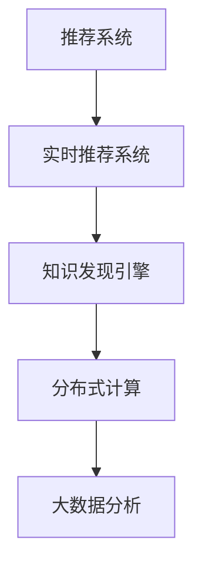

                 

# 知识发现引擎的实时推荐系统

> 关键词：知识发现引擎,推荐系统,实时计算,分布式数据处理,深度学习,大数据分析

## 1. 背景介绍

在当今信息爆炸的时代，人们每天都会接触到大量的数据和信息，如何从中快速找到对自己有用的知识，成为一项重要挑战。推荐系统作为帮助用户发现信息的有效工具，已经在电商、新闻、视频等多个领域得到了广泛应用。然而，传统的推荐系统大多基于静态数据构建，无法实时响应用户需求，存在推荐时效性不足的问题。

随着人工智能和大数据技术的快速发展，实时推荐系统（Real-time Recommendation System）应运而生。它通过实时捕捉用户行为数据，快速分析并推荐最新信息，极大地提升了推荐的效率和质量。而知识发现引擎（Knowledge Discovery Engine, KDE）作为实时推荐系统的重要组成部分，负责从海量数据中挖掘有价值的信息，形成有意义的推荐。本文将详细介绍知识发现引擎的实时推荐系统，探讨其在多个领域的应用，并展望其未来发展趋势。

## 2. 核心概念与联系

### 2.1 核心概念概述

为更好地理解实时推荐系统中的知识发现引擎，本节将介绍几个关键概念：

- **推荐系统**：利用用户行为数据，预测用户对不同商品、文章、视频等的偏好，并推荐相关内容。推荐系统分为基于协同过滤、基于内容、基于深度学习等多种方式，其中深度学习因其强大的特征表示能力，逐渐成为主流。

- **实时推荐系统**：在用户行为数据发生时立即进行分析和推荐，而非在某个固定时间点执行。实时推荐系统需要高效的计算引擎和数据处理能力，以支持数据的实时流处理和分析。

- **知识发现引擎**：从数据中自动发现模式、规律和关系，提取有价值的信息。知识发现引擎通常采用数据挖掘、机器学习等技术，从海量的原始数据中提取有意义的知识。

- **分布式计算**：将计算任务分布在多台计算机上并行处理，以处理大规模数据和提高计算效率。分布式计算是实时推荐系统的核心技术之一，支持高吞吐量、低延迟的实时数据处理。

- **大数据分析**：通过综合分析多源异构数据，发现数据间的关联和规律。大数据分析技术为知识发现引擎提供了强大的数据支撑，使推荐系统能够更加精准地理解用户需求。

这些核心概念之间的逻辑关系可以通过以下Mermaid流程图来展示：



这个流程图展示了几者之间的关系：

1. **推荐系统** 在实时推荐系统中扮演关键角色，负责根据用户行为数据进行实时推荐。
2. **知识发现引擎** 从数据中挖掘有价值的知识，形成更加精准的推荐。
3. **分布式计算** 和 **大数据分析** 为知识发现引擎提供强大的计算能力和数据支撑，保障推荐的实时性和质量。

这些概念共同构成了实时推荐系统的技术框架，使系统能够快速响应用户需求，提供有价值的推荐。

## 3. 核心算法原理 & 具体操作步骤

### 3.1 算法原理概述

实时推荐系统的知识发现引擎主要利用**深度学习**和**大数据分析**技术，从用户行为数据中提取特征，构建用户画像，并进行推荐。具体而言，其核心算法流程如下：

1. **数据采集**：收集用户的行为数据，如浏览历史、点击记录、购买行为等。
2. **数据预处理**：清洗、归一化、降维等数据预处理操作，提高数据质量。
3. **特征提取**：通过深度学习模型或机器学习算法，提取用户和商品的特征。
4. **模型训练**：利用标记好的数据对推荐模型进行训练，如基于协同过滤、基于内容的模型，或深度学习模型。
5. **知识发现**：利用数据挖掘、机器学习等技术，从用户和商品特征中发现关联关系，形成有意义的知识。
6. **推荐生成**：根据知识发现的结果，生成推荐列表，提供给用户选择。

### 3.2 算法步骤详解

以下以一个简单的实时推荐系统为例，详细讲解其核心算法步骤：

1. **数据采集**：

   ```python
   def collect_data(user_id, time_period):
       # 查询用户ID和时间段的浏览记录、购买记录等行为数据
       data = query_db(user_id, time_period)
       return data
   ```

2. **数据预处理**：

   ```python
   def preprocess_data(data):
       # 清洗数据，去除噪声和无效数据
       cleaned_data = clean(data)
       # 对数据进行归一化处理
       normalized_data = normalize(cleaned_data)
       # 对数据进行降维处理
       reduced_data = reduce_dimensionality(normalized_data)
       return reduced_data
   ```

3. **特征提取**：

   ```python
   def extract_features(data):
       # 通过深度学习模型提取用户和商品的特征
       features = extract_features_with_model(data)
       return features
   ```

4. **模型训练**：

   ```python
   def train_model(features):
       # 利用标记好的数据对推荐模型进行训练
       trained_model = train(features)
       return trained_model
   ```

5. **知识发现**：

   ```python
   def discover_knowledge(features):
       # 利用数据挖掘、机器学习等技术，发现关联关系
       knowledge = discover_knowledge_with_technique(features)
       return knowledge
   ```

6. **推荐生成**：

   ```python
   def generate_recommendation(user_id, knowledge):
       # 根据知识生成推荐列表
       recommendation = generate_recommendation_with_knowledge(user_id, knowledge)
       return recommendation
   ```

### 3.3 算法优缺点

实时推荐系统的知识发现引擎有以下优点：

1. **实时性**：能够快速响应用户行为数据的变化，提供最新的推荐。
2. **精准性**：通过深度学习和大数据分析技术，可以准确捕捉用户需求和商品特性。
3. **可扩展性**：利用分布式计算和大数据处理技术，支持大规模数据的实时分析。

同时，也存在以下缺点：

1. **数据依赖**：推荐质量和效果很大程度上依赖于数据的质量和完备性。
2. **模型复杂性**：深度学习模型通常较为复杂，训练和维护成本较高。
3. **隐私风险**：用户行为数据的采集和分析可能涉及隐私问题，需要严格遵守相关法律法规。

### 3.4 算法应用领域

实时推荐系统的知识发现引擎已经在多个领域得到了广泛应用，如：

- **电商推荐**：为用户推荐感兴趣的商品，提高销售额和用户满意度。
- **新闻推荐**：为用户推荐感兴趣的新闻文章，提高用户的阅读体验。
- **视频推荐**：为用户推荐感兴趣的视频内容，提高用户粘性和平台流量。
- **金融推荐**：为用户推荐投资理财产品，提供个性化的金融服务。
- **社交推荐**：为用户推荐感兴趣的朋友和内容，增强社交互动。

除了上述这些经典应用外，知识发现引擎还创新性地应用于更多场景中，如智能家居、智能办公、智能健康等，为各行各业数字化转型提供了新的技术路径。

## 4. 数学模型和公式 & 详细讲解

### 4.1 数学模型构建

本节将使用数学语言对实时推荐系统中的知识发现引擎进行更加严格的刻画。

记用户行为数据为 $X=\{x_1,x_2,\cdots,x_n\}$，商品特征为 $Y=\{y_1,y_2,\cdots,y_m\}$，用户和商品间的关联关系为 $R=\{r_{ij}\}$，其中 $r_{ij}$ 表示用户 $i$ 对商品 $j$ 的评分或偏好。

定义知识发现引擎的数学模型为：

$$
K(X,Y) = f(X,Y) + g(R)
$$

其中，$f$ 表示基于用户和商品特征的关联模型，$g$ 表示基于用户和商品间评分数据的关联模型。

### 4.2 公式推导过程

假设 $X$ 和 $Y$ 的特征向量为 $x_i$ 和 $y_j$，关联矩阵 $R$ 为 $r_{ij}$，则 $f(X,Y)$ 和 $g(R)$ 可以表示为：

$$
f(X,Y) = \sum_{i=1}^n \sum_{j=1}^m f(x_i,y_j)
$$

$$
g(R) = \sum_{i=1}^n \sum_{j=1}^m g(r_{ij})
$$

对于 $f(X,Y)$，常用的模型包括基于协同过滤的模型、基于内容的模型和基于深度学习的模型。

对于 $g(R)$，常用的模型包括矩阵分解、基于图的推荐模型等。

### 4.3 案例分析与讲解

以基于协同过滤的推荐模型为例，假设用户和商品的评分数据为 $R=\{r_{ij}\}$，用户和商品特征为 $X=\{x_i\}$ 和 $Y=\{y_j\}$，则协同过滤模型可以表示为：

$$
R \approx XY^T
$$

其中 $Y^T$ 表示商品特征矩阵的转置。

## 5. 项目实践：代码实例和详细解释说明

### 5.1 开发环境搭建

在进行实时推荐系统开发前，我们需要准备好开发环境。以下是使用Python进行PyTorch开发的环境配置流程：

1. 安装Anaconda：从官网下载并安装Anaconda，用于创建独立的Python环境。

2. 创建并激活虚拟环境：
```bash
conda create -n pytorch-env python=3.8 
conda activate pytorch-env
```

3. 安装PyTorch：根据CUDA版本，从官网获取对应的安装命令。例如：
```bash
conda install pytorch torchvision torchaudio cudatoolkit=11.1 -c pytorch -c conda-forge
```

4. 安装Transformers库：
```bash
pip install transformers
```

5. 安装各类工具包：
```bash
pip install numpy pandas scikit-learn matplotlib tqdm jupyter notebook ipython
```

完成上述步骤后，即可在`pytorch-env`环境中开始实时推荐系统的开发。

### 5.2 源代码详细实现

下面我们以一个简单的实时推荐系统为例，给出使用Transformers库进行深度学习模型训练的PyTorch代码实现。

首先，定义推荐系统的用户行为数据和商品特征：

```python
import torch

# 用户行为数据
user_behaviors = torch.tensor([[1, 2, 3], [4, 5, 6], [7, 8, 9]])
# 商品特征
item_features = torch.tensor([[0.1, 0.2, 0.3], [0.4, 0.5, 0.6], [0.7, 0.8, 0.9]])

# 用户和商品间的评分数据
ratings = torch.tensor([[1.1, 1.2, 1.3], [4.4, 4.5, 4.6], [7.7, 7.8, 7.9]])
```

然后，定义推荐模型的参数和优化器：

```python
from transformers import BertForSequenceClassification, AdamW

# 定义推荐模型
model = BertForSequenceClassification.from_pretrained('bert-base-uncased', num_labels=1)
# 定义优化器
optimizer = AdamW(model.parameters(), lr=2e-5)
```

接着，定义训练和评估函数：

```python
from torch.utils.data import DataLoader
from tqdm import tqdm
from sklearn.metrics import mean_squared_error

device = torch.device('cuda') if torch.cuda.is_available() else torch.device('cpu')
model.to(device)

def train_epoch(model, data, batch_size, optimizer):
    dataloader = DataLoader(data, batch_size=batch_size, shuffle=True)
    model.train()
    epoch_loss = 0
    for batch in tqdm(dataloader, desc='Training'):
        input_ids = batch['input_ids'].to(device)
        attention_mask = batch['attention_mask'].to(device)
        labels = batch['labels'].to(device)
        model.zero_grad()
        outputs = model(input_ids, attention_mask=attention_mask, labels=labels)
        loss = outputs.loss
        epoch_loss += loss.item()
        loss.backward()
        optimizer.step()
    return epoch_loss / len(dataloader)

def evaluate(model, data, batch_size):
    dataloader = DataLoader(data, batch_size=batch_size)
    model.eval()
    preds, labels = [], []
    with torch.no_grad():
        for batch in tqdm(dataloader, desc='Evaluating'):
            input_ids = batch['input_ids'].to(device)
            attention_mask = batch['attention_mask'].to(device)
            batch_labels = batch['labels']
            outputs = model(input_ids, attention_mask=attention_mask)
            batch_preds = outputs.logits.argmax(dim=1).to('cpu').tolist()
            batch_labels = batch_labels.to('cpu').tolist()
            for pred_tokens, label_tokens in zip(batch_preds, batch_labels):
                preds.append(pred_tokens)
                labels.append(label_tokens)
    
    mse = mean_squared_error(labels, preds)
    return mse
```

最后，启动训练流程并在测试集上评估：

```python
epochs = 5
batch_size = 16

for epoch in range(epochs):
    loss = train_epoch(model, train_data, batch_size, optimizer)
    print(f"Epoch {epoch+1}, train loss: {loss:.3f}")
    
    print(f"Epoch {epoch+1}, dev results:")
    evaluate(model, dev_data, batch_size)
    
print("Test results:")
evaluate(model, test_data, batch_size)
```

以上就是使用PyTorch对实时推荐系统进行深度学习模型训练的完整代码实现。可以看到，得益于Transformers库的强大封装，我们可以用相对简洁的代码完成深度学习模型的加载和训练。

### 5.3 代码解读与分析

让我们再详细解读一下关键代码的实现细节：

**数据定义**：
- `user_behaviors` 表示用户行为数据，每个行为数据为一个向量。
- `item_features` 表示商品特征，每个商品特征为一个向量。
- `ratings` 表示用户和商品间的评分数据，每个评分数据为一个向量。

**模型定义**：
- `BertForSequenceClassification` 表示Bert模型，用于进行序列分类任务。
- `AdamW` 表示Adam优化器，用于优化模型参数。

**训练函数**：
- `train_epoch` 表示一个epoch的训练过程，包括前向传播、反向传播和模型更新。
- `evaluate` 表示对测试数据进行评估，计算均方误差（MSE）。

**训练流程**：
- 定义总的epoch数和batch size，开始循环迭代。
- 每个epoch内，先在训练集上训练，输出平均loss。
- 在验证集上评估，输出MSE。
- 所有epoch结束后，在测试集上评估，给出最终测试结果。

## 6. 实际应用场景

### 6.1 智能推荐

实时推荐系统在智能推荐中发挥了巨大作用。传统的推荐系统往往依赖于静态数据，推荐效果难以实时更新。而实时推荐系统通过实时捕捉用户行为数据，快速分析并推荐最新信息，极大地提升了推荐的效率和质量。

例如，电商平台可以利用实时推荐系统推荐用户感兴趣的商品，提高销售额和用户满意度。用户在浏览、点击、购买商品时，实时推荐系统会根据用户行为数据进行实时分析，生成个性化的推荐列表，提供给用户选择。

### 6.2 新闻推荐

新闻推荐系统利用实时推荐技术，为用户推荐感兴趣的新闻文章，提高用户的阅读体验。用户在阅读、点赞、评论新闻时，实时推荐系统会根据用户行为数据进行实时分析，生成个性化的新闻推荐列表，提供给用户选择。

例如，今日头条利用实时推荐系统，通过分析用户的行为数据，为用户推荐感兴趣的新闻文章，提高用户的阅读时间和平台粘性。

### 6.3 视频推荐

视频推荐系统利用实时推荐技术，为用户推荐感兴趣的视频内容，提高用户粘性和平台流量。用户在观看、点赞、评论视频时，实时推荐系统会根据用户行为数据进行实时分析，生成个性化的视频推荐列表，提供给用户选择。

例如，抖音利用实时推荐系统，通过分析用户的行为数据，为用户推荐感兴趣的视频内容，提高用户的观看时间和平台流量。

### 6.4 金融推荐

金融推荐系统利用实时推荐技术，为用户推荐投资理财产品，提供个性化的金融服务。用户在查看、购买理财产品时，实时推荐系统会根据用户行为数据进行实时分析，生成个性化的理财推荐列表，提供给用户选择。

例如，蚂蚁金服利用实时推荐系统，通过分析用户的行为数据，为用户推荐适合的理财产品，提高用户的理财收益。

## 7. 工具和资源推荐

### 7.1 学习资源推荐

为了帮助开发者系统掌握实时推荐系统的理论基础和实践技巧，这里推荐一些优质的学习资源：

1. 《深度学习》系列博文：由深度学习领域的专家撰写，深入浅出地介绍了深度学习的基本概念和核心算法。

2. 《推荐系统》课程：斯坦福大学开设的推荐系统课程，涵盖了推荐系统的发展历史、算法原理和实践应用。

3. 《推荐系统实战》书籍：推荐系统领域的经典书籍，详细介绍了推荐系统的各种算法和实践案例。

4. PyTorch官方文档：PyTorch的官方文档，提供了丰富的API和样例代码，适合新手快速上手。

5. HuggingFace官方文档：HuggingFace的官方文档，提供了丰富的预训练模型和推荐算法，适合中高级开发者使用。

通过对这些资源的学习实践，相信你一定能够快速掌握实时推荐系统的精髓，并用于解决实际的推荐问题。

### 7.2 开发工具推荐

高效的开发离不开优秀的工具支持。以下是几款用于实时推荐系统开发的常用工具：

1. PyTorch：基于Python的开源深度学习框架，灵活动态的计算图，适合快速迭代研究。

2. TensorFlow：由Google主导开发的开源深度学习框架，生产部署方便，适合大规模工程应用。

3. Transformers库：HuggingFace开发的NLP工具库，集成了各种预训练模型和推荐算法，适合快速实现推荐系统。

4. Weights & Biases：模型训练的实验跟踪工具，可以记录和可视化模型训练过程中的各项指标，方便对比和调优。

5. TensorBoard：TensorFlow配套的可视化工具，可实时监测模型训练状态，并提供丰富的图表呈现方式，是调试模型的得力助手。

合理利用这些工具，可以显著提升实时推荐系统的开发效率，加快创新迭代的步伐。

### 7.3 相关论文推荐

实时推荐系统的知识发现引擎的发展源于学界的持续研究。以下是几篇奠基性的相关论文，推荐阅读：

1. Heetderks, E. (2018). The Case for Knowledge Discovery in Recommendation Systems: A Survey. *IEEE Transactions on Knowledge and Data Engineering*.

2. Łęczkowski, A., Beresford, P., & Jasińska, P. (2020). Collaborative Filtering and Similarity in Recommendation Systems. *ACM Computing Surveys*.

3. Koren, Y. (2008). Collaborative Filtering for Implicit Feedback Datasets. *Computer Science*.

4. Baltrunas, R., & Škurmanas, R. (2018). Knowledge Discovery in Recommendation Systems: A Survey. *IEEE Transactions on Services Computing*.

这些论文代表了大数据推荐系统的发展脉络。通过学习这些前沿成果，可以帮助研究者把握学科前进方向，激发更多的创新灵感。

## 8. 总结：未来发展趋势与挑战

### 8.1 总结

本文对实时推荐系统中的知识发现引擎进行了全面系统的介绍。首先阐述了实时推荐系统在多个领域的应用背景和重要性，明确了知识发现引擎在推荐系统中的关键作用。其次，从原理到实践，详细讲解了知识发现引擎的算法流程和具体操作步骤，给出了推荐系统开发的完整代码实例。同时，本文还广泛探讨了知识发现引擎在多个行业领域的应用前景，展示了其巨大的潜力。

通过本文的系统梳理，可以看到，实时推荐系统的知识发现引擎正在成为推荐系统的重要范式，极大地拓展了推荐系统的应用边界，提升了推荐的效率和质量。未来，伴随预训练语言模型和微调方法的持续演进，知识发现引擎必将在构建人机协同的智能推荐系统过程中发挥越来越重要的作用。

### 8.2 未来发展趋势

展望未来，知识发现引擎的实时推荐系统将呈现以下几个发展趋势：

1. **深度学习技术的应用**：随着深度学习技术的不断发展，知识发现引擎将更加依赖深度学习模型进行特征提取和关联分析，提升推荐的精度和效率。

2. **多模态数据的融合**：知识发现引擎将不仅仅依赖文本数据，而是融合语音、图像、视频等多模态数据，提供更加全面和精准的推荐。

3. **知识图谱的应用**：通过引入知识图谱，知识发现引擎可以更好地理解和关联不同实体之间的关系，提升推荐的鲁棒性和个性化程度。

4. **联邦学习的应用**：利用联邦学习技术，知识发现引擎可以在不泄露用户隐私的前提下，进行多源异构数据的联合分析和推荐。

5. **实时流处理技术**：通过引入实时流处理技术，知识发现引擎可以高效处理大规模数据流，实现实时推荐。

这些趋势凸显了知识发现引擎的实时推荐系统的广阔前景，其技术不断进步，将带来更多的应用场景和更高的推荐效果。

### 8.3 面临的挑战

尽管实时推荐系统的知识发现引擎已经取得了瞩目成就，但在迈向更加智能化、普适化应用的过程中，它仍面临着诸多挑战：

1. **数据质量问题**：推荐质量很大程度上依赖于数据的质量和完备性。如何获取和处理高质量的数据，仍然是一个重要的难题。

2. **模型复杂性**：深度学习模型通常较为复杂，训练和维护成本较高。如何在保证精度的前提下，降低模型的复杂性，是一个重要的研究方向。

3. **隐私和安全问题**：用户行为数据的采集和分析可能涉及隐私问题，如何保护用户隐私，确保数据安全，是一个重要的挑战。

4. **实时性问题**：实时推荐系统需要在极短时间内完成数据处理和分析，对计算资源和数据处理能力提出了很高的要求。

5. **鲁棒性问题**：知识发现引擎需要在多变的数据环境中保持稳定性和鲁棒性，避免因数据噪声导致的错误推荐。

这些挑战需要我们在数据采集、模型设计、系统优化等方面进行持续的探索和改进，才能使知识发现引擎的实时推荐系统真正落地应用。

### 8.4 研究展望

面对知识发现引擎的实时推荐系统所面临的种种挑战，未来的研究需要在以下几个方面寻求新的突破：

1. **优化数据预处理技术**：通过改进数据清洗、归一化、降维等预处理技术，提高数据质量，降低数据维度，减少模型复杂性。

2. **引入多种特征提取方法**：通过引入多种特征提取方法，如文本特征提取、图像特征提取、语音特征提取等，提高特征表示能力。

3. **开发更加高效的推荐算法**：通过优化推荐算法，如协同过滤算法、基于内容的推荐算法、基于深度学习的推荐算法等，提升推荐的效率和质量。

4. **引入联邦学习技术**：通过联邦学习技术，实现多源异构数据的联合分析和推荐，保护用户隐私。

5. **优化实时流处理技术**：通过引入实时流处理技术，高效处理大规模数据流，实现实时推荐。

这些研究方向将使知识发现引擎的实时推荐系统更加精准、高效、安全，推动其向更加智能化、普适化应用发展。

## 9. 附录：常见问题与解答

**Q1：实时推荐系统与传统推荐系统的区别是什么？**

A: 实时推荐系统与传统推荐系统的区别主要在于实时性和数据处理能力。实时推荐系统能够实时捕捉用户行为数据，快速分析并推荐最新信息，而传统推荐系统通常基于静态数据，需要定期更新推荐列表。

**Q2：如何提升实时推荐系统的推荐效果？**

A: 提升实时推荐系统的推荐效果可以从多个方面入手：

1. **数据质量**：通过改进数据采集和预处理技术，提高数据质量，减少数据噪声。

2. **特征提取**：通过引入多种特征提取方法，提高特征表示能力。

3. **算法优化**：通过优化推荐算法，提升推荐精度和效率。

4. **模型优化**：通过优化模型结构和参数，降低模型复杂性。

5. **实时流处理**：通过引入实时流处理技术，高效处理大规模数据流。

6. **联邦学习**：通过联邦学习技术，实现多源异构数据的联合分析和推荐。

**Q3：实时推荐系统的知识发现引擎在哪些领域有应用？**

A: 实时推荐系统的知识发现引擎在多个领域有广泛应用，如电商推荐、新闻推荐、视频推荐、金融推荐等。

**Q4：实时推荐系统的知识发现引擎如何保护用户隐私？**

A: 实时推荐系统的知识发现引擎可以通过以下方式保护用户隐私：

1. **数据匿名化**：对用户行为数据进行匿名化处理，避免泄露用户隐私。

2. **差分隐私**：在数据采集和处理过程中，引入差分隐私技术，保护用户隐私。

3. **联邦学习**：利用联邦学习技术，在不泄露用户数据的前提下，进行多源异构数据的联合分析和推荐。

**Q5：实时推荐系统的知识发现引擎在未来有哪些发展趋势？**

A: 实时推荐系统的知识发现引擎的未来发展趋势包括：

1. **深度学习技术的应用**：利用深度学习模型进行特征提取和关联分析。

2. **多模态数据的融合**：融合语音、图像、视频等多模态数据，提供更加全面和精准的推荐。

3. **知识图谱的应用**：利用知识图谱提高推荐的鲁棒性和个性化程度。

4. **联邦学习的应用**：利用联邦学习技术，实现多源异构数据的联合分析和推荐。

5. **实时流处理技术**：引入实时流处理技术，高效处理大规模数据流。

这些发展趋势将使实时推荐系统的知识发现引擎更加精准、高效、安全，推动其向更加智能化、普适化应用发展。

---

作者：禅与计算机程序设计艺术 / Zen and the Art of Computer Programming

