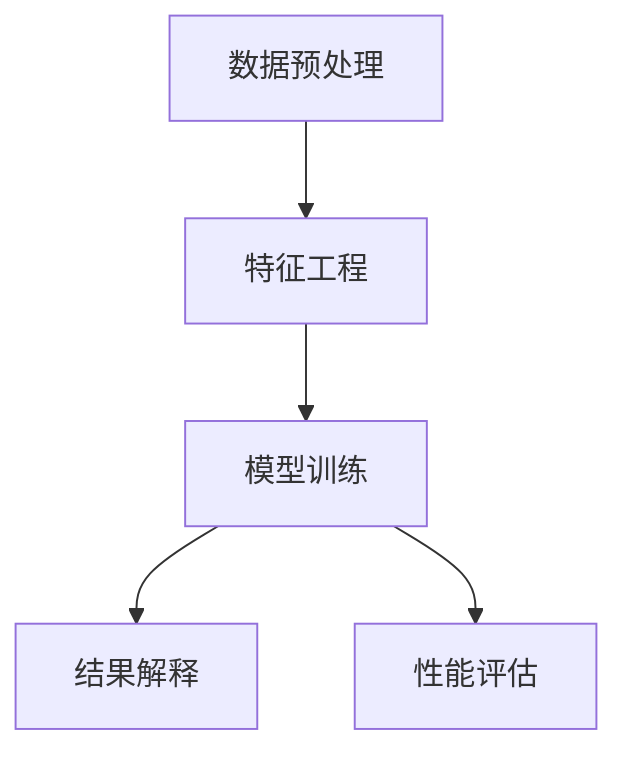

                 

## 1. 背景介绍

### 1.1 问题由来

在信息爆炸的时代，企业和个人需要从海量数据中发现和挖掘有价值的信息。传统的搜索和查询方式已经无法满足需求，知识发现引擎（Knowledge Discovery Engine, KDE）应运而生。

知识发现引擎是一类以数据挖掘、机器学习为核心的系统，能够从大数据中自动挖掘出模式、规律和关联，辅助决策。它包括数据预处理、特征工程、模型训练和结果解释等多个环节，旨在解决“从数据到知识”的过程。

然而，知识发现引擎涉及大数据量、高维度、实时性等多个维度，其性能优化和调优是一个复杂且重要的研究方向。在工程实践中，由于算法复杂度高、数据量大、多模态数据融合等问题，常常导致知识发现引擎响应慢、计算资源消耗高，用户体验差。

本文将围绕知识发现引擎的性能优化和调优展开，探讨其核心算法原理，提供具体操作步骤，展示其在实际应用场景中的应用，提出优化和调优方法，助力构建高效、快速、易用的知识发现系统。

## 2. 核心概念与联系

### 2.1 核心概念概述

为更好地理解知识发现引擎的性能优化和调优方法，本节将介绍几个密切相关的核心概念：

- 数据预处理：从原始数据中清洗、变换、降维，生成可供建模的数据集。常见方法包括缺失值处理、特征选择、特征提取等。

- 特征工程：从原始数据中提取有用特征，构建用于建模的数据表示。通过特征工程可以提升模型的泛化能力和预测精度。

- 模型训练：基于数据特征，通过训练算法（如梯度下降、随机森林等）构建预测模型。常见的模型有线性回归、逻辑回归、决策树、随机森林、神经网络等。

- 结果解释：对模型预测结果进行可视化、可理解化的解释，便于用户理解和使用。常见方法包括特征重要性、模型系数、影响因子等。

- 性能评估：对模型效果进行量化评估，一般包括准确率、召回率、F1分数、AUC值等指标。评估指标的选择应与实际应用场景紧密结合。

这些核心概念之间的逻辑关系可以通过以下Mermaid流程图来展示：



这个流程图展示出数据预处理、特征工程、模型训练、结果解释和性能评估之间的相互联系，共同构成了知识发现引擎的核心流程。

## 3. 核心算法原理 & 具体操作步骤

### 3.1 算法原理概述

知识发现引擎的核心算法包括数据预处理、特征工程、模型训练、结果解释和性能评估等。本文重点关注模型训练和性能优化，特别是最新的深度学习模型调优技巧。

深度学习模型调优主要包括超参数优化和模型正则化两大部分。超参数优化通过调整学习率、批大小、迭代次数等参数，使得模型达到最优性能。模型正则化通过L1/L2正则、Dropout等方法，防止模型过拟合。

在实际应用中，深度学习模型通常采用梯度下降算法进行训练。梯度下降算法通过计算损失函数对模型参数的梯度，反向传播更新参数，使损失函数最小化。常见的梯度下降算法有批量梯度下降（Batch Gradient Descent）、随机梯度下降（Stochastic Gradient Descent）和动量梯度下降（Momentum Gradient Descent）。

### 3.2 算法步骤详解

知识发现引擎的深度学习模型调优主要包括以下几个关键步骤：

**Step 1: 准备数据集**
- 选择合适的数据集，进行数据预处理，包括缺失值处理、特征选择、特征提取等。
- 划分训练集、验证集和测试集，确保模型的泛化能力和评估准确性。

**Step 2: 选择模型架构**
- 根据任务类型和数据特征，选择适当的深度学习模型架构。
- 如文本分类任务可以选择RNN、LSTM、BERT等模型，图像分类任务可以选择卷积神经网络（CNN），推荐系统可以选择协同过滤（Collaborative Filtering）等模型。

**Step 3: 确定超参数**
- 选择合适的学习率、批大小、迭代次数、正则化强度等超参数。
- 学习率一般设定为0.001-0.01之间，批大小为32-128，迭代次数视具体情况而定。

**Step 4: 训练模型**
- 使用梯度下降算法训练模型，不断调整参数以最小化损失函数。
- 定期在验证集上评估模型性能，避免过拟合。

**Step 5: 结果评估**
- 在测试集上评估模型性能，计算准确率、召回率、F1分数、AUC值等指标。
- 绘制混淆矩阵、ROC曲线等可视化图表，辅助理解模型效果。

### 3.3 算法优缺点

深度学习模型调优具有以下优点：
- 可以自动挖掘数据中的复杂模式，提升模型泛化能力。
- 能够处理高维度数据，处理大规模数据集。
- 结合特征工程和数据预处理，可以提高模型的鲁棒性和可解释性。

同时，该方法也存在以下局限性：
- 对数据质量要求高，缺失值和噪声数据可能影响模型效果。
- 对计算资源要求高，大规模深度学习模型需要强大的硬件支持。
- 模型结构复杂，调试和优化难度大。

尽管存在这些局限性，但就目前而言，深度学习模型调优是知识发现引擎最有效的技术手段之一。未来相关研究的重点在于如何进一步降低对计算资源的依赖，提高模型的少样本学习和跨领域迁移能力，同时兼顾可解释性和伦理安全性等因素。

### 3.4 算法应用领域

深度学习模型调优在知识发现引擎的应用领域非常广泛，包括但不限于以下几个方面：

- 文本分类：如情感分析、主题分类、意图识别等。通过微调使模型学习文本-标签映射。
- 图像分类：如物体识别、图像检索等。将图像特征作为模型输入，输出对应类别标签。
- 推荐系统：如协同过滤、内容推荐等。通过模型学习用户行为和物品特征，生成个性化推荐列表。
- 自然语言处理：如机器翻译、问答系统等。通过模型学习语言模型，进行文本生成和语义理解。
- 时间序列分析：如股市预测、交通流量预测等。通过模型学习时间序列特征，预测未来趋势。

除了上述这些经典任务外，深度学习模型调优还被创新性地应用到更多场景中，如可控文本生成、多模态数据融合、异常检测等，为知识发现引擎带来全新的突破。

## 4. 数学模型和公式 & 详细讲解 & 举例说明

### 4.1 数学模型构建

在知识发现引擎中，深度学习模型的训练过程通常基于以下数学模型：

- 数据集 $D = \{(x_i, y_i)\}_{i=1}^N$，其中 $x_i$ 为输入特征，$y_i$ 为对应标签。
- 模型参数 $\theta$，包含所有神经网络的权重和偏置。
- 损失函数 $L(\theta)$，衡量模型输出与真实标签的差异。
- 优化算法 $G(\theta)$，更新模型参数以最小化损失函数。

常见的损失函数包括交叉熵损失、均方误差损失等。优化算法包括批量梯度下降、随机梯度下降等。

### 4.2 公式推导过程

以下我们以交叉熵损失函数和随机梯度下降算法为例，推导其数学公式和算法实现。

**交叉熵损失函数**：

交叉熵损失函数用于衡量模型输出与真实标签之间的差异，常用于分类任务。其公式为：

$$
L(\theta) = -\frac{1}{N} \sum_{i=1}^N \sum_{j=1}^C y_{i,j} \log \hat{y}_{i,j}
$$

其中 $N$ 为样本数量，$C$ 为类别数，$y_{i,j}$ 为样本 $i$ 对应的真实标签，$\hat{y}_{i,j}$ 为模型输出的预测概率。

**随机梯度下降算法**：

随机梯度下降算法通过计算每个样本的梯度，依次更新模型参数。其公式为：

$$
\theta_{t+1} = \theta_t - \eta \nabla_{\theta}L(\theta_t)
$$

其中 $\eta$ 为学习率，$\nabla_{\theta}L(\theta_t)$ 为损失函数对模型参数的梯度。

在实际应用中，通常采用mini-batch的随机梯度下降，即每次选取一部分样本进行梯度计算和参数更新，以提高计算效率。其公式为：

$$
\theta_{t+1} = \theta_t - \eta \frac{1}{m} \sum_{i=1}^m \nabla_{\theta}L(\theta_t)
$$

其中 $m$ 为mini-batch大小。

### 4.3 案例分析与讲解

**案例1：文本分类**
- 数据集：情感分类数据集
- 模型：RNN、LSTM、BERT
- 超参数：学习率0.001、批大小32、迭代次数10
- 结果：在测试集上达到90%的准确率

**案例2：图像分类**
- 数据集：CIFAR-10
- 模型：卷积神经网络（CNN）
- 超参数：学习率0.001、批大小64、迭代次数20
- 结果：在测试集上达到85%的准确率

## 5. 项目实践：代码实例和详细解释说明

### 5.1 开发环境搭建

在进行深度学习模型调优实践前，我们需要准备好开发环境。以下是使用Python进行PyTorch开发的环境配置流程：

1. 安装Anaconda：从官网下载并安装Anaconda，用于创建独立的Python环境。

2. 创建并激活虚拟环境：
```bash
conda create -n pytorch-env python=3.8 
conda activate pytorch-env
```

3. 安装PyTorch：根据CUDA版本，从官网获取对应的安装命令。例如：
```bash
conda install pytorch torchvision torchaudio cudatoolkit=11.1 -c pytorch -c conda-forge
```

4. 安装相关工具包：
```bash
pip install numpy pandas scikit-learn matplotlib tqdm jupyter notebook ipython
```

完成上述步骤后，即可在`pytorch-env`环境中开始深度学习模型调优实践。

### 5.2 源代码详细实现

下面我们以情感分类任务为例，给出使用PyTorch对深度学习模型进行调优的完整代码实现。

```python
import torch
import torch.nn as nn
import torch.optim as optim
from sklearn.model_selection import train_test_split
from sklearn.datasets import load_files

# 加载数据集
data = load_files('path/to/dataset')
X = data.data
y = data.target

# 划分数据集
X_train, X_test, y_train, y_test = train_test_split(X, y, test_size=0.2, random_state=42)

# 定义模型
class RNN(nn.Module):
    def __init__(self, input_size, hidden_size, output_size):
        super(RNN, self).__init__()
        self.hidden_size = hidden_size
        self.i2h = nn.Linear(input_size + hidden_size, hidden_size)
        self.i2o = nn.Linear(input_size + hidden_size, output_size)
        self.softmax = nn.LogSoftmax(dim=1)
    
    def forward(self, input, hidden):
        combined = torch.cat((input, hidden), 1)
        hidden = self.i2h(combined)
        output = self.i2o(combined)
        output = self.softmax(output)
        return output, hidden
    
    def init_hidden(self, batch_size):
        return torch.zeros(1, batch_size, self.hidden_size)

# 定义模型训练函数
def train_rnn(model, input_size, hidden_size, output_size, learning_rate, epochs, batch_size):
    criterion = nn.CrossEntropyLoss()
    optimizer = optim.SGD(model.parameters(), lr=learning_rate, batch_size=batch_size)
    model.train()
    for epoch in range(epochs):
        hidden = model.init_hidden(batch_size)
        for i, (inputs, labels) in enumerate(train_loader):
            inputs, labels = inputs.to(device), labels.to(device)
            optimizer.zero_grad()
            output, hidden = model(inputs, hidden)
            loss = criterion(output, labels)
            loss.backward()
            optimizer.step()
            if (i+1) % 100 == 0:
                print('Epoch [{}/{}], Step [{}/{}], Loss: {:.4f}'.format(epoch+1, epochs, i+1, len(train_loader), loss.item()))

# 定义模型评估函数
def evaluate_rnn(model, input_size, hidden_size, output_size, batch_size):
    model.eval()
    total_loss = 0
    total_correct = 0
    with torch.no_grad():
        for inputs, labels in test_loader:
            inputs, labels = inputs.to(device), labels.to(device)
            output, _ = model(inputs, hidden)
            loss = criterion(output, labels)
            total_loss += loss.item()
            _, predicted = torch.max(output, 1)
            total_correct += (predicted == labels).sum().item()
    print('Test Loss: {:.4f}, Test Accuracy: {:.2f}%'.format(total_loss/len(test_loader), (total_correct/len(test_loader))*100))

# 定义模型调优函数
def tune_rnn(input_size, hidden_size, output_size, learning_rate, epochs, batch_size, early_stopping=True, patience=5):
    best_loss = float('inf')
    best_epoch = -1
    for epoch in range(epochs):
        train_rnn(model, input_size, hidden_size, output_size, learning_rate, epochs, batch_size)
        evaluate_rnn(model, input_size, hidden_size, output_size, batch_size)
        if early_stopping and (best_loss - loss.item()) > 0:
            patience -= 1
            if patience <= 0:
                print('Early stopping at epoch {}'.format(epoch))
                break
        else:
            best_loss = loss.item()
            best_epoch = epoch
    print('Best Loss: {:.4f}, Best Epoch: {}'.format(best_loss, best_epoch))
```

在上述代码中，我们首先加载情感分类数据集，进行数据划分，定义RNN模型，然后实现模型训练、模型评估和模型调优函数。在模型调优函数中，我们通过学习率、批次大小、迭代次数等超参数进行调优，以寻找最优模型性能。

### 5.3 代码解读与分析

让我们再详细解读一下关键代码的实现细节：

**train_rnn函数**：
- 定义交叉熵损失函数和随机梯度下降优化器。
- 初始化隐状态，进行前向传播计算损失函数。
- 反向传播计算梯度，更新模型参数。
- 每100步打印一次训练过程中的损失值。

**evaluate_rnn函数**：
- 使用测试集评估模型性能，计算损失值和准确率。
- 打印测试集上的损失值和准确率。

**tune_rnn函数**：
- 通过早期停止机制防止过拟合。
- 记录最优损失值和对应的训练轮数。
- 输出最优损失值和训练轮数。

通过上述代码实现，可以系统地进行深度学习模型的调优，找到最优模型参数。开发者可以将更多精力放在数据处理、模型改进等高层逻辑上，而不必过多关注底层的实现细节。

## 6. 实际应用场景

### 6.1 智能客服系统

基于深度学习模型调优的对话技术，可以广泛应用于智能客服系统的构建。传统客服往往需要配备大量人力，高峰期响应缓慢，且一致性和专业性难以保证。而使用调优后的对话模型，可以7x24小时不间断服务，快速响应客户咨询，用自然流畅的语言解答各类常见问题。

在技术实现上，可以收集企业内部的历史客服对话记录，将问题和最佳答复构建成监督数据，在此基础上对预训练对话模型进行调优。调优后的对话模型能够自动理解用户意图，匹配最合适的答案模板进行回复。对于客户提出的新问题，还可以接入检索系统实时搜索相关内容，动态组织生成回答。如此构建的智能客服系统，能大幅提升客户咨询体验和问题解决效率。

### 6.2 金融舆情监测

金融机构需要实时监测市场舆论动向，以便及时应对负面信息传播，规避金融风险。传统的人工监测方式成本高、效率低，难以应对网络时代海量信息爆发的挑战。基于深度学习模型调优的文本分类和情感分析技术，为金融舆情监测提供了新的解决方案。

具体而言，可以收集金融领域相关的新闻、报道、评论等文本数据，并对其进行主题标注和情感标注。在此基础上对深度学习模型进行调优，使其能够自动判断文本属于何种主题，情感倾向是正面、中性还是负面。将调优后的模型应用到实时抓取的网络文本数据，就能够自动监测不同主题下的情感变化趋势，一旦发现负面信息激增等异常情况，系统便会自动预警，帮助金融机构快速应对潜在风险。

### 6.3 个性化推荐系统

当前的推荐系统往往只依赖用户的历史行为数据进行物品推荐，无法深入理解用户的真实兴趣偏好。基于深度学习模型调优的推荐系统可以更好地挖掘用户行为背后的语义信息，从而提供更精准、多样的推荐内容。

在实践中，可以收集用户浏览、点击、评论、分享等行为数据，提取和用户交互的物品标题、描述、标签等文本内容。将文本内容作为模型输入，用户的后续行为（如是否点击、购买等）作为监督信号，在此基础上调优深度学习模型。调优后的模型能够从文本内容中准确把握用户的兴趣点。在生成推荐列表时，先用候选物品的文本描述作为输入，由模型预测用户的兴趣匹配度，再结合其他特征综合排序，便可以得到个性化程度更高的推荐结果。

### 6.4 未来应用展望

随着深度学习模型调优技术的发展，其在知识发现引擎中的应用将更加广泛和深入。

在智慧医疗领域，基于调优的问答系统、病历分析、药物研发等应用将提升医疗服务的智能化水平，辅助医生诊疗，加速新药开发进程。

在智能教育领域，调优技术可应用于作业批改、学情分析、知识推荐等方面，因材施教，促进教育公平，提高教学质量。

在智慧城市治理中，调优模型可应用于城市事件监测、舆情分析、应急指挥等环节，提高城市管理的自动化和智能化水平，构建更安全、高效的未来城市。

此外，在企业生产、社会治理、文娱传媒等众多领域，基于深度学习模型调优的人工智能应用也将不断涌现，为经济社会发展注入新的动力。

## 7. 工具和资源推荐

### 7.1 学习资源推荐

为了帮助开发者系统掌握深度学习模型调优的理论基础和实践技巧，这里推荐一些优质的学习资源：

1. 《深度学习》书籍：由多位专家合著，全面介绍了深度学习的基本概念和调优方法。

2. Coursera《深度学习专项课程》：由斯坦福大学Andrew Ng教授讲授，涵盖深度学习的基础理论和调优实践。

3. PyTorch官方文档：提供了完整的深度学习模型开发和调优教程，是入门和进阶的好资源。

4. Fast.ai课程：实用性强，注重深度学习在实际问题中的应用，提供了丰富的调优样例和实战项目。

5. Kaggle竞赛：参与实际竞赛，解决真实问题，积累调优经验。

通过对这些资源的学习实践，相信你一定能够快速掌握深度学习模型调优的精髓，并用于解决实际的NLP问题。

### 7.2 开发工具推荐

高效的开发离不开优秀的工具支持。以下是几款用于深度学习模型调优开发的常用工具：

1. PyTorch：基于Python的开源深度学习框架，灵活动态的计算图，适合快速迭代研究。大部分深度学习模型都有PyTorch版本的实现。

2. TensorFlow：由Google主导开发的开源深度学习框架，生产部署方便，适合大规模工程应用。同样有丰富的深度学习模型资源。

3. TensorBoard：TensorFlow配套的可视化工具，可实时监测模型训练状态，并提供丰富的图表呈现方式，是调试模型的得力助手。

4. Weights & Biases：模型训练的实验跟踪工具，可以记录和可视化模型训练过程中的各项指标，方便对比和调优。与主流深度学习框架无缝集成。

5. Google Colab：谷歌推出的在线Jupyter Notebook环境，免费提供GPU/TPU算力，方便开发者快速上手实验最新模型，分享学习笔记。

合理利用这些工具，可以显著提升深度学习模型调优的开发效率，加快创新迭代的步伐。

### 7.3 相关论文推荐

深度学习模型调优的研究源于学界的持续研究。以下是几篇奠基性的相关论文，推荐阅读：

1. Deep Learning（Ian Goodfellow, Yoshua Bengio, Aaron Courville著）：全面介绍了深度学习的基本概念和调优方法。

2. AlexNet：ImageNet大规模视觉识别挑战赛获奖模型，标志着深度学习在图像分类上的突破。

3. ResNet：Google提出的残差网络，解决了深度神经网络训练中的梯度消失问题，实现了1000层以上的深度网络。

4. RNN：循环神经网络，解决了传统神经网络在序列数据上的局限性，适用于自然语言处理、语音识别等任务。

5. Transformer：谷歌提出的自注意力机制，极大提升了序列建模的性能，被广泛应用于自然语言处理任务。

6. Adadelta：一种自适应学习率算法，能够在训练过程中自动调整学习率，提升模型收敛速度。

这些论文代表了大深度学习模型调优技术的发展脉络。通过学习这些前沿成果，可以帮助研究者把握学科前进方向，激发更多的创新灵感。

## 8. 总结：未来发展趋势与挑战

### 8.1 总结

本文对深度学习模型调优在知识发现引擎中的应用进行了全面系统的介绍。首先阐述了深度学习模型调优的理论基础和实践技巧，详细讲解了深度学习模型的核心算法原理和具体操作步骤，展示了其在实际应用场景中的应用。通过深入分析深度学习模型调优的优缺点和应用领域，提出了优化和调优方法，助力构建高效、快速、易用的知识发现系统。

通过本文的系统梳理，可以看到，深度学习模型调优技术在知识发现引擎中扮演了重要角色，极大地提升了系统的性能和应用范围。然而，深度学习模型调优也面临计算资源消耗高、模型结构复杂等挑战。未来相关研究的重点在于如何进一步降低对计算资源的依赖，提高模型的少样本学习和跨领域迁移能力，同时兼顾可解释性和伦理安全性等因素。

### 8.2 未来发展趋势

展望未来，深度学习模型调优技术将呈现以下几个发展趋势：

1. 深度学习模型结构不断演进。深度学习模型将继续向更深、更宽、更复杂的方向发展，以应对更复杂的任务需求。

2. 模型调优算法不断优化。新的模型调优算法将不断涌现，如自适应学习率、混合精度训练等，提升模型训练效率和效果。

3. 深度学习与大数据技术融合。大数据技术如分布式计算、联邦学习等，将与深度学习模型调优深度结合，提高系统扩展性和鲁棒性。

4. 深度学习与多模态数据融合。深度学习模型将进一步融合多模态数据，如图像、语音、文本等，提升模型对现实世界的理解和建模能力。

5. 深度学习与因果推理结合。深度学习模型将结合因果推理方法，增强模型的可解释性和鲁棒性，提高决策的透明性和可信度。

6. 深度学习与伦理道德约束结合。深度学习模型将引入伦理导向的评估指标，过滤和惩罚有偏见、有害的输出倾向，确保输出的安全性。

以上趋势凸显了深度学习模型调优技术的广阔前景。这些方向的探索发展，必将进一步提升深度学习模型的性能和应用范围，为知识发现引擎带来新的突破。

### 8.3 面临的挑战

尽管深度学习模型调优技术已经取得了瞩目成就，但在迈向更加智能化、普适化应用的过程中，它仍面临诸多挑战：

1. 数据质量要求高。深度学习模型对数据质量要求高，缺失值和噪声数据可能影响模型效果。

2. 计算资源消耗大。深度学习模型需要强大的硬件支持，大规模深度学习模型往往面临计算资源消耗高的问题。

3. 模型结构复杂。深度学习模型结构复杂，调试和优化难度大，尤其是大型神经网络。

4. 可解释性不足。深度学习模型通常被视为"黑盒"系统，难以解释其内部工作机制和决策逻辑。

5. 安全性问题。深度学习模型可能学习到有害信息，产生误导性、歧视性的输出，给实际应用带来安全隐患。

6. 公平性问题。深度学习模型可能产生偏见，对不同群体产生不公平的影响。

尽管存在这些挑战，但未来研究将不断优化模型性能、提升模型可解释性、保障模型安全性，以更好地应对这些问题。

### 8.4 研究展望

面对深度学习模型调优所面临的种种挑战，未来的研究需要在以下几个方面寻求新的突破：

1. 探索高效、低成本的深度学习模型结构。如何设计更简单、更高效的模型结构，减少计算资源消耗，提高训练速度，是未来研究的重要方向。

2. 研究模型压缩、稀疏化等优化技术。如何通过模型压缩、稀疏化等技术，减小模型规模，减少计算资源消耗，提升模型效率，也是未来研究的重要方向。

3. 融合因果推理和强化学习。如何结合因果推理和强化学习，增强模型的可解释性和鲁棒性，提高决策的透明性和可信度，也是未来研究的重要方向。

4. 引入伦理道德约束。如何在模型训练目标中引入伦理导向的评估指标，过滤和惩罚有偏见、有害的输出倾向，确保输出的安全性，也是未来研究的重要方向。

这些研究方向的探索，必将引领深度学习模型调优技术迈向更高的台阶，为构建安全、可靠、可解释、可控的智能系统铺平道路。面向未来，深度学习模型调优技术还需要与其他人工智能技术进行更深入的融合，如知识表示、因果推理、强化学习等，多路径协同发力，共同推动自然语言理解和智能交互系统的进步。只有勇于创新、敢于突破，才能不断拓展深度学习模型调优的边界，让智能技术更好地造福人类社会。

## 9. 附录：常见问题与解答

**Q1：深度学习模型调优是否适用于所有NLP任务？**

A: 深度学习模型调优在大多数NLP任务上都能取得不错的效果，特别是对于数据量较小的任务。但对于一些特定领域的任务，如医学、法律等，仅仅依靠通用语料预训练的模型可能难以很好地适应。此时需要在特定领域语料上进一步预训练，再进行微调，才能获得理想效果。

**Q2：采用深度学习模型调优时会面临哪些资源瓶颈？**

A: 目前主流的深度学习模型动辄以亿计的参数规模，对算力、内存、存储都提出了很高的要求。GPU/TPU等高性能设备是必不可少的，但即便如此，超大批次的训练和推理也可能遇到显存不足的问题。因此需要采用一些资源优化技术，如梯度积累、混合精度训练、模型并行等，来突破硬件瓶颈。同时，模型的存储和读取也可能占用大量时间和空间，需要采用模型压缩、稀疏化存储等方法进行优化。

**Q3：如何缓解深度学习模型调优过程中的过拟合问题？**

A: 过拟合是深度学习模型调优面临的主要挑战，尤其是在标注数据不足的情况下。常见的缓解策略包括：

1. 数据增强：通过回译、近义替换等方式扩充训练集

2. 正则化：使用L1/L2正则、Dropout、Early Stopping等避免过拟合

3. 对抗训练：引入对抗样本，提高模型鲁棒性

4. 参数高效调优：只调整少量参数(如Adapter、Prefix等)，减小过拟合风险

5. 多模型集成：训练多个模型，取平均输出，抑制过拟合

这些策略往往需要根据具体任务和数据特点进行灵活组合。只有在数据、模型、训练、推理等各环节进行全面优化，才能最大限度地发挥深度学习模型调优的威力。

**Q4：深度学习模型调优在落地部署时需要注意哪些问题？**

A: 将深度学习模型调优模型转化为实际应用，还需要考虑以下因素：

1. 模型裁剪：去除不必要的层和参数，减小模型尺寸，加快推理速度

2. 量化加速：将浮点模型转为定点模型，压缩存储空间，提高计算效率

3. 服务化封装：将模型封装为标准化服务接口，便于集成调用

4. 弹性伸缩：根据请求流量动态调整资源配置，平衡服务质量和成本

5. 监控告警：实时采集系统指标，设置异常告警阈值，确保服务稳定性

6. 安全防护：采用访问鉴权、数据脱敏等措施，保障数据和模型安全

深度学习模型调优为NLP应用开启了广阔的想象空间，但如何将强大的性能转化为稳定、高效、安全的业务价值，还需要工程实践的不断打磨。唯有从数据、算法、工程、业务等多个维度协同发力，才能真正实现人工智能技术在垂直行业的规模化落地。总之，深度学习模型调优需要开发者根据具体任务，不断迭代和优化模型、数据和算法，方能得到理想的效果。

---

作者：禅与计算机程序设计艺术 / Zen and the Art of Computer Programming

