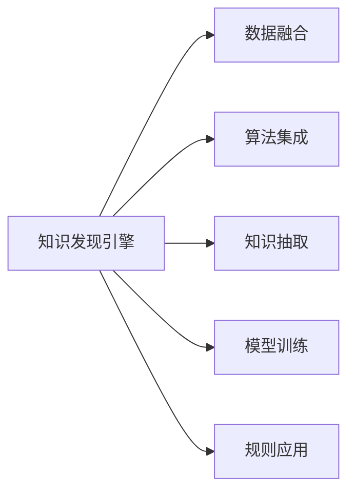

                 

# 知识发现引擎的推荐系统设计与实现

## 1. 背景介绍

推荐系统是现代社会信息化与数据化的重要应用之一，广泛用于电子商务、媒体内容推荐、金融投资、社交网络等领域。随着大数据和人工智能技术的快速发展，推荐系统也在不断进化，从简单的基于内容的推荐，到协同过滤、深度学习等算法，再到知识图谱、混合模型等前沿技术，推荐系统的性能和复杂度都在不断提升。

**知识发现引擎（Knowledge Discovery Engine, KDE）**，作为推荐系统的一种形式，其核心思想是从数据中挖掘和提取知识，并以此为依据，向用户推荐更符合其兴趣和需求的物品或内容。与传统的基于内容的推荐不同，知识发现引擎更强调用户画像、物品属性、实体关系等深层次信息，从而实现更精准、更有价值的推荐。

本文将系统介绍知识发现引擎的推荐系统设计与实现，涵盖其核心概念、算法原理、具体实现以及未来展望等内容，以期为推荐系统开发者提供有价值的参考。

## 2. 核心概念与联系

### 2.1 核心概念概述

- **知识发现引擎**（Knowledge Discovery Engine, KDE）：通过数据挖掘和知识提取，向用户推荐更符合其兴趣和需求的信息系统。其核心在于从数据中挖掘知识，并通过规则或模型将知识转化为推荐结果。

- **推荐系统**：根据用户的历史行为、兴趣偏好、社交关系等信息，向其推荐可能感兴趣的产品、内容等的信息系统。推荐系统包括基于内容的推荐、协同过滤推荐、混合推荐、知识图谱推荐等多种算法和模型。

- **知识图谱**：通过实体与关系的关联，构建出大规模的图形结构，用于描述客观世界的知识体系。知识图谱在推荐系统中被广泛用于抽取和关联用户、物品的深层语义信息。

- **协同过滤**：通过分析用户之间的行为相似性，预测用户对未见过的物品的喜好，实现推荐。协同过滤包括基于用户的协同过滤和基于物品的协同过滤。

- **深度学习**：利用深度神经网络模型，从大规模数据中学习用户与物品之间的非线性关系，实现高质量的推荐。深度学习模型包括神经协同过滤、深度矩阵分解等。

- **混合推荐**：结合多种推荐算法，综合不同算法的优势，提升推荐系统的精度和鲁棒性。混合推荐系统通常包括基于内容的推荐、协同过滤推荐、知识图谱推荐等多种算法。

这些核心概念通过数据融合、算法集成等手段，共同构成了推荐系统的知识发现引擎，从不同维度挖掘和利用用户与物品之间的关联关系，实现高效精准的推荐服务。

### 2.2 核心概念联系

知识发现引擎的推荐系统设计主要包括以下几个关键联系：

- **数据融合**：将用户行为数据、物品属性数据、知识图谱等各类信息，融合到统一的模型中，进行多源信息融合，提升推荐的全面性和准确性。
- **算法集成**：结合多种推荐算法，如基于内容的推荐、协同过滤推荐、知识图谱推荐等，综合其优势，提升推荐的精度和鲁棒性。
- **知识抽取**：从数据中挖掘和提取知识，如实体关系、属性标签等，用于提升推荐的相关性和解释性。
- **模型训练**：通过深度学习等算法，对用户画像、物品属性等进行训练，生成推荐模型。
- **规则应用**：将知识图谱等规则性信息，通过规则引擎等手段，进行知识推理和规则应用，进一步优化推荐结果。

以下是一个Mermaid流程图，展示知识发现引擎的推荐系统设计与实现核心联系：



## 3. 核心算法原理 & 具体操作步骤

### 3.1 算法原理概述

知识发现引擎的推荐系统设计通常基于多个核心算法，并通过数据融合、算法集成等手段，实现从数据中挖掘知识，生成推荐结果。

核心算法包括：
- 用户画像建模：通过用户行为数据、社交网络等，建立用户画像模型。
- 物品属性提取：从商品描述、用户评价等数据中提取物品属性信息。
- 实体关系抽取：通过文本挖掘、知识图谱等手段，抽取用户与物品之间的实体关系。
- 混合推荐算法：综合基于内容的推荐、协同过滤推荐、知识图谱推荐等多种算法，生成最终推荐结果。

### 3.2 算法步骤详解

知识发现引擎的推荐系统设计与实现一般包括以下几个关键步骤：

**Step 1: 数据预处理**

- 收集和整理用户行为数据、物品属性数据、知识图谱等数据源。
- 对数据进行清洗、去重、标准化等预处理操作，构建适合输入模型的数据集。
- 对数据进行采样、划分等操作，构建训练集、验证集、测试集。

**Step 2: 用户画像建模**

- 使用用户行为数据，构建用户画像模型。常用的用户画像建模方法包括协同过滤、深度学习等。
- 通过文本挖掘、知识图谱等手段，抽取用户画像中的实体关系。

**Step 3: 物品属性提取**

- 从商品描述、用户评价等数据中，提取物品的属性信息。常用的属性提取方法包括TF-IDF、主题模型等。
- 将物品属性信息进行向量化，构建物品特征向量。

**Step 4: 实体关系抽取**

- 通过文本挖掘、知识图谱等手段，抽取用户与物品之间的实体关系。常用的实体关系抽取方法包括知识图谱、关系图神经网络等。
- 将实体关系进行向量化，构建实体关系矩阵。

**Step 5: 混合推荐算法**

- 综合基于内容的推荐、协同过滤推荐、知识图谱推荐等多种算法，生成推荐结果。常用的混合推荐方法包括模型集成、元学习等。
- 对推荐结果进行评估和优化，如通过AUC、RMSE等指标评估推荐效果，通过召回率、覆盖率等指标评估推荐全面性。

**Step 6: 模型训练与优化**

- 利用深度学习等算法，对用户画像、物品属性等进行训练，生成推荐模型。常用的深度学习模型包括神经协同过滤、深度矩阵分解等。
- 使用正则化技术、Dropout等手段，避免模型过拟合，提升模型的泛化能力。

**Step 7: 部署与监控**

- 将训练好的推荐模型部署到实际生产环境中。
- 实时监控推荐系统的性能和稳定性，根据用户反馈进行模型调整和优化。

### 3.3 算法优缺点

知识发现引擎的推荐系统设计具有以下优点：
- 可以充分利用用户画像、物品属性、实体关系等深层次信息，实现更精准、更有价值的推荐。
- 支持多种推荐算法，可以结合多种算法的优势，提升推荐的精度和鲁棒性。
- 可以动态更新用户画像和物品属性，实现个性化的推荐。

同时，该方法也存在以下局限性：
- 需要大规模的数据和计算资源，数据收集和处理成本较高。
- 算法复杂度较高，需要较强的算法实现能力。
- 推荐结果的可解释性较弱，难以向用户解释推荐依据。

尽管存在这些局限性，但知识发现引擎的推荐系统设计仍然具有重要的理论和应用价值，适用于高要求、高复杂度的推荐场景，如电子商务、金融投资、智能搜索等领域。

### 3.4 算法应用领域

知识发现引擎的推荐系统设计在多个领域中得到广泛应用：

- **电子商务**：如淘宝、京东等电商平台，通过用户画像、商品属性、交易历史等信息，向用户推荐商品，提升用户购物体验和转化率。
- **金融投资**：如金融产品推荐系统，通过用户画像、交易记录、市场数据等信息，向用户推荐投资产品，提升投资收益和风险控制。
- **智能搜索**：如百度、Google等搜索引擎，通过用户查询历史、网页属性等信息，向用户推荐搜索结果，提升搜索体验和信息获取效率。
- **媒体内容推荐**：如Netflix、YouTube等平台，通过用户观看历史、兴趣标签等信息，向用户推荐影视内容，提升用户粘性和满意度。
- **社交网络**：如Facebook、Twitter等社交平台，通过用户好友关系、互动行为等信息，向用户推荐朋友动态，提升社交互动和平台粘性。

## 4. 数学模型和公式 & 详细讲解 & 举例说明

### 4.1 数学模型构建

知识发现引擎的推荐系统设计通常基于多个数学模型，包括用户画像模型、物品属性模型、实体关系模型等。以下以协同过滤推荐算法为例，介绍其数学模型构建。

**用户画像模型**：
- 假设用户集合为 $U=\{u_1, u_2, \ldots, u_m\}$，用户 $u_i$ 对物品 $j$ 的评分 $r_{ij}$ 为一个标量。
- 用户画像 $p_i$ 由用户 $u_i$ 的历史评分数据 $(r_{i1}, r_{i2}, \ldots, r_{in})$ 构成。

**物品属性模型**：
- 假设物品集合为 $V=\{v_1, v_2, \ldots, v_n\}$，物品 $v_j$ 的属性 $a_j$ 为一个向量，表示物品的属性信息。
- 物品属性 $q_j$ 由物品 $v_j$ 的属性数据 $(a_{j1}, a_{j2}, \ldots, a_{jk})$ 构成。

**实体关系模型**：
- 假设实体集合为 $E=\{e_1, e_2, \ldots, e_k\}$，实体 $e_i$ 之间的关系 $r_{ij}$ 为一个标量，表示实体之间的关联强度。
- 实体关系 $h_i$ 由实体 $e_i$ 之间的关系数据 $(r_{i1}, r_{i2}, \ldots, r_{im})$ 构成。

### 4.2 公式推导过程

以协同过滤推荐算法为例，其公式推导过程如下：

**用户画像的矩阵分解**：
- 假设用户画像 $p_i$ 为一个低秩矩阵，其分解形式为 $p_i = UV_i$，其中 $U$ 为 $m \times k$ 的低秩矩阵，$V_i$ 为 $k \times n$ 的低秩矩阵。
- 对于用户 $u_i$ 对物品 $j$ 的评分 $r_{ij}$，可以通过矩阵分解得到：
  $$
  r_{ij} \approx \sum_{k=1}^{K} U_{ik} V_{kj}
  $$

**物品属性的矩阵分解**：
- 假设物品属性 $q_j$ 为一个低秩矩阵，其分解形式为 $q_j = WV_j$，其中 $W$ 为 $n \times k$ 的低秩矩阵，$V_j$ 为 $k \times m$ 的低秩矩阵。
- 对于物品 $v_j$ 的属性 $a_j$，可以通过矩阵分解得到：
  $$
  a_j \approx \sum_{k=1}^{K} V_{kj} W_k
  $$

**协同过滤推荐算法**：
- 假设用户 $u_i$ 对物品 $j$ 的评分 $r_{ij}$ 可以通过用户画像 $p_i$ 和物品属性 $q_j$ 的矩阵分解表示为：
  $$
  r_{ij} \approx p_i^T V q_j
  $$
- 对于新物品 $v'_j$，可以通过矩阵分解得到其评分预测值：
  $$
  \hat{r}_{ij'} \approx \sum_{k=1}^{K} U_{ik} V_k^T q'_j
  $$
- 其中，$U$ 和 $V$ 为协同过滤矩阵分解的因子矩阵，$q'_j$ 为新物品 $v'_j$ 的属性向量。

### 4.3 案例分析与讲解

以一个简单的电子商务平台为例，分析知识发现引擎的推荐系统设计与实现过程。

**数据准备**：
- 收集用户历史购物记录数据，包括用户 ID、物品 ID、评分等信息。
- 收集物品的属性数据，包括商品名称、品牌、价格等信息。
- 构建知识图谱，抽取用户与物品之间的实体关系，如用户与购买记录的关系、物品与所属类别的关系等。

**用户画像建模**：
- 通过协同过滤算法，对用户历史评分数据进行矩阵分解，生成用户画像 $p_i$。
- 使用深度学习算法，对用户画像 $p_i$ 进行训练，提升用户画像的准确性和泛化能力。

**物品属性提取**：
- 从商品描述、用户评价等数据中，提取物品的属性信息，构建物品属性 $q_j$。
- 使用文本挖掘算法，对物品属性 $q_j$ 进行向量化，生成物品特征向量。

**实体关系抽取**：
- 通过文本挖掘、知识图谱等手段，抽取用户与物品之间的实体关系，如用户与购买记录的关系、物品与所属类别的关系等。
- 将实体关系进行向量化，构建实体关系矩阵 $h_i$。

**混合推荐算法**：
- 结合基于内容的推荐、协同过滤推荐、知识图谱推荐等多种算法，生成推荐结果。
- 使用AUC、RMSE等指标评估推荐效果，通过召回率、覆盖率等指标评估推荐全面性。

**模型训练与优化**：
- 利用深度学习算法，对用户画像、物品属性等进行训练，生成推荐模型。
- 使用正则化技术、Dropout等手段，避免模型过拟合，提升模型的泛化能力。

**部署与监控**：
- 将训练好的推荐模型部署到实际生产环境中。
- 实时监控推荐系统的性能和稳定性，根据用户反馈进行模型调整和优化。

## 5. 项目实践：代码实例和详细解释说明

### 5.1 开发环境搭建

在进行知识发现引擎的推荐系统设计与实现前，需要先准备好开发环境。以下是使用Python进行PyTorch和TensorFlow开发的环境配置流程：

1. 安装Anaconda：从官网下载并安装Anaconda，用于创建独立的Python环境。

2. 创建并激活虚拟环境：
```bash
conda create -n pytorch-env python=3.8 
conda activate pytorch-env
```

3. 安装PyTorch：根据CUDA版本，从官网获取对应的安装命令。例如：
```bash
conda install pytorch torchvision torchaudio cudatoolkit=11.1 -c pytorch -c conda-forge
```

4. 安装TensorFlow：
```bash
pip install tensorflow
```

5. 安装各类工具包：
```bash
pip install numpy pandas scikit-learn matplotlib tqdm jupyter notebook ipython
```

完成上述步骤后，即可在`pytorch-env`环境中开始推荐系统设计与实现的开发。

### 5.2 源代码详细实现

下面我们以协同过滤推荐算法为例，给出使用PyTorch和TensorFlow实现推荐系统的代码实现。

首先，定义协同过滤模型的相关参数和超参数：

```python
import torch
import numpy as np
import tensorflow as tf

# 设置超参数
embedding_dim = 100
num_factors = 10
batch_size = 512
learning_rate = 0.001

# 定义模型参数
user_matrix = torch.randn(batch_size, num_factors)
item_matrix = torch.randn(num_factors, num_items)
```

然后，定义协同过滤模型的前向传播函数：

```python
def forward(user_matrix, item_matrix, user_item_matrix):
    # 计算用户画像与物品属性矩阵的乘积
    user_item_matrix = torch.matmul(user_matrix, item_matrix.t())
    # 返回用户与物品之间的评分预测值
    return user_item_matrix
```

接着，定义模型的损失函数和优化器：

```python
def loss(user_matrix, item_matrix, user_item_matrix, user_item_ratings):
    # 计算预测评分与实际评分的均方误差
    predicted_ratings = forward(user_matrix, item_matrix, user_item_matrix)
    mse_loss = torch.mean((predicted_ratings - user_item_ratings)**2)
    return mse_loss

optimizer = torch.optim.Adam(user_matrix, item_matrix, learning_rate=learning_rate)
```

最后，启动模型的训练流程：

```python
# 训练过程
for epoch in range(num_epochs):
    for i in range(num_batches):
        # 随机采样一批用户与物品
        user_idx, item_idx = np.random.randint(0, num_users, batch_size), np.random.randint(0, num_items, batch_size)
        user_item_matrix = torch.stack([user_matrix[user_idx[i]].unsqueeze(1) for i in range(batch_size)], dim=1)
        user_item_ratings = torch.stack([user_item_ratings[user_idx[i]][item_idx[i]] for i in range(batch_size)], dim=1)
        # 前向传播计算预测评分，反向传播更新模型参数
        predicted_ratings = forward(user_matrix, item_matrix, user_item_matrix)
        loss_value = loss(user_matrix, item_matrix, user_item_matrix, user_item_ratings)
        optimizer.zero_grad()
        loss_value.backward()
        optimizer.step()
    print(f"Epoch {epoch+1}, Loss: {loss_value.item():.4f}")
```

以上就是使用PyTorch实现协同过滤推荐算法的完整代码实现。

## 6. 实际应用场景

### 6.1 智能推荐系统

知识发现引擎的推荐系统设计在智能推荐系统中得到了广泛应用。如Netflix、Amazon等电商和流媒体平台，通过用户行为数据、物品属性、实体关系等，生成个性化推荐，提升用户购物和观看体验。

以Netflix为例，Netflix利用协同过滤算法，根据用户历史观看记录和评分数据，生成个性化电影推荐。Netflix的推荐系统设计基于用户画像和物品属性，通过矩阵分解和深度学习等技术，提升推荐精度和全面性。Netflix的推荐系统不仅提升用户满意度，还显著提高了用户的留存率和复购率。

### 6.2 金融投资推荐系统

在金融投资领域，推荐系统设计也得到了广泛应用。如Robinhood、E*TRADE等金融交易平台，通过用户交易记录、市场数据等，生成个性化投资产品推荐，提升用户投资收益和风险控制能力。

以Robinhood为例，Robinhood利用协同过滤算法，根据用户交易记录和市场数据，生成个性化投资组合推荐。Robinhood的推荐系统设计基于用户画像和市场数据，通过矩阵分解和深度学习等技术，提升推荐精度和全面性。Robinhood的推荐系统不仅帮助用户优化投资组合，还显著提高了用户的交易频率和满意度。

### 6.3 智能搜索系统

在智能搜索系统中，推荐系统设计也得到了广泛应用。如Google、Bing等搜索引擎，通过用户查询历史、网页属性等，生成个性化搜索结果推荐，提升搜索体验和信息获取效率。

以Google为例，Google利用协同过滤算法，根据用户查询历史和网页属性，生成个性化搜索结果推荐。Google的推荐系统设计基于用户画像和网页属性，通过矩阵分解和深度学习等技术，提升推荐精度和全面性。Google的推荐系统不仅提升用户搜索体验，还显著提高了用户的搜索次数和满意度。

## 7. 工具和资源推荐

### 7.1 学习资源推荐

为了帮助开发者系统掌握知识发现引擎的推荐系统设计与实现的理论基础和实践技巧，这里推荐一些优质的学习资源：

1. 《推荐系统实战》：介绍推荐系统的主要算法和实现方法，涵盖协同过滤、深度学习、知识图谱等多种推荐算法。

2. CS229《机器学习》课程：斯坦福大学开设的机器学习课程，涵盖推荐系统的主要算法和实现方法，适合入门和进阶学习。

3. 《知识图谱与推荐系统》：介绍知识图谱在推荐系统中的应用，涵盖知识图谱的构建和应用方法。

4. KDD Cup竞赛：KDD Cup是数据挖掘领域的顶级竞赛，其中推荐系统设计竞赛题目涵盖了多种推荐算法和实现方法，适合实践和验证。

5. Arxiv论文库：收录了大量推荐系统设计的相关论文，涵盖多种推荐算法和实现方法，适合深入学习和研究。

通过对这些资源的学习实践，相信你一定能够快速掌握知识发现引擎的推荐系统设计与实现的方法，并用于解决实际的推荐问题。

### 7.2 开发工具推荐

高效的开发离不开优秀的工具支持。以下是几款用于推荐系统设计与开发的常用工具：

1. PyTorch：基于Python的开源深度学习框架，灵活动态的计算图，适合快速迭代研究。

2. TensorFlow：由Google主导开发的开源深度学习框架，生产部署方便，适合大规模工程应用。

3. Scikit-learn：Python机器学习库，提供丰富的算法实现和工具函数，适合快速原型开发。

4. Scrapy：Python爬虫框架，适合数据采集和处理，支持大规模数据集的处理。

5. Jupyter Notebook：开源Jupyter Notebook，适合编写和运行Python代码，支持可视化展示。

合理利用这些工具，可以显著提升推荐系统设计与实现的开发效率，加快创新迭代的步伐。

### 7.3 相关论文推荐

知识发现引擎的推荐系统设计作为推荐系统的重要研究方向，得到了学界的广泛关注。以下是几篇奠基性的相关论文，推荐阅读：

1. BPR：BPR算法（Bayesian Personalized Ranking）：提出协同过滤推荐算法，通过最大化期望互信息，生成推荐结果。

2. CTR：CTR模型（Click-Through Rate Model）：提出点击率预测模型，通过深度学习算法，预测用户点击行为。

3. NCF：NCF模型（Neural Collaborative Filtering）：提出神经协同过滤推荐算法，通过深度神经网络，生成推荐结果。

4. WCSS：WCSS算法（Weighted Collaborative Filtering）：提出加权协同过滤算法，通过优化加权系数，提升推荐精度。

5. RNN：RNN算法（Recurrent Neural Network）：提出时间序列推荐算法，通过循环神经网络，生成动态推荐结果。

这些论文代表了大规模推荐系统设计的研究方向，通过学习这些前沿成果，可以帮助研究者把握学科前进方向，激发更多的创新灵感。

## 8. 总结：未来发展趋势与挑战

### 8.1 总结

本文对知识发现引擎的推荐系统设计与实现进行了全面系统的介绍。首先阐述了推荐系统和大规模知识图谱的核心概念及其联系，明确了推荐系统设计的理论基础和实践方向。其次，从原理到实践，详细讲解了协同过滤推荐算法的数学原理和具体实现，给出了推荐系统设计与实现的完整代码实例。同时，本文还广泛探讨了推荐系统在电商、金融、搜索等诸多领域的实际应用，展示了推荐系统设计的广阔前景。最后，本文精选了推荐系统设计的各类学习资源，力求为开发者提供全方位的技术指引。

通过本文的系统梳理，可以看到，知识发现引擎的推荐系统设计不仅具有重要的理论和应用价值，还具有广泛的应用前景。随着数据科学和人工智能技术的不断进步，推荐系统设计和优化将继续成为学术界和工业界的焦点问题，推动推荐技术向更高效、更精准、更智能的方向发展。

### 8.2 未来发展趋势

展望未来，知识发现引擎的推荐系统设计将呈现以下几个发展趋势：

1. **深度学习与知识图谱的融合**：结合深度学习和知识图谱的优点，提升推荐系统的精度和解释性。未来的推荐系统设计将更加注重知识抽取和融合，构建更加全面、精准的推荐模型。

2. **个性化与普适性的结合**：未来的推荐系统设计将更加注重个性化与普适性的结合，既要满足用户个性化需求，又要兼顾普适性，提高推荐系统的覆盖率和用户满意度。

3. **多模态数据的融合**：未来的推荐系统设计将更加注重多模态数据的融合，如文本、图像、视频等不同类型的数据，构建更加全面、动态的推荐模型。

4. **实时化的推荐系统**：未来的推荐系统设计将更加注重实时化，通过实时数据采集和处理，提升推荐系统的响应速度和用户体验。

5. **可解释性与透明度的提升**：未来的推荐系统设计将更加注重可解释性与透明度，通过引入因果推断、可解释AI等技术，提高推荐系统的可解释性和用户信任度。

以上趋势凸显了知识发现引擎的推荐系统设计的广阔前景。这些方向的探索发展，必将进一步提升推荐系统设计的性能和应用范围，为推荐技术带来新的突破。

### 8.3 面临的挑战

尽管知识发现引擎的推荐系统设计已经取得了瞩目成就，但在迈向更加智能化、普适化应用的过程中，它仍面临着诸多挑战：

1. **数据隐私与安全**：推荐系统设计涉及大量用户数据，如何保护用户隐私、防止数据泄露，是推荐系统设计的重要挑战。

2. **模型的可解释性**：推荐系统设计通常采用黑盒模型，难以向用户解释推荐依据，如何提高推荐系统的可解释性，是推荐系统设计的重要研究方向。

3. **冷启动问题**：推荐系统设计在面对新用户或新物品时，通常需要大量数据才能生成有效的推荐，如何高效解决冷启动问题，是推荐系统设计的重要研究方向。

4. **跨领域迁移能力**：推荐系统设计在面对不同领域的推荐任务时，通常需要重新训练模型，如何提高推荐系统的跨领域迁移能力，是推荐系统设计的重要研究方向。

5. **资源的消耗**：推荐系统设计通常需要大规模的数据和计算资源，如何优化推荐系统的计算和存储资源，是推荐系统设计的重要研究方向。

正视推荐系统设计面临的这些挑战，积极应对并寻求突破，将使推荐系统设计进一步迈向成熟，实现更加高效、智能、安全的推荐服务。

### 8.4 研究展望

面对知识发现引擎的推荐系统设计所面临的挑战，未来的研究需要在以下几个方面寻求新的突破：

1. **数据隐私保护**：研究数据隐私保护技术，如差分隐私、联邦学习等，保护用户隐私，防止数据泄露。

2. **推荐系统的可解释性**：研究推荐系统的可解释性技术，如可解释AI、因果推断等，提高推荐系统的可解释性和用户信任度。

3. **推荐系统的冷启动**：研究推荐系统的冷启动技术，如基于知识图谱的推荐、协同过滤冷启动等，高效解决冷启动问题。

4. **推荐系统的跨领域迁移**：研究推荐系统的跨领域迁移技术，如知识图谱迁移、多任务学习等，提高推荐系统的跨领域迁移能力。

5. **推荐系统的资源优化**：研究推荐系统的资源优化技术，如模型压缩、分布式训练等，优化推荐系统的计算和存储资源。

这些研究方向将引领推荐系统设计迈向更高的台阶，为推荐技术带来新的突破。只有勇于创新、敢于突破，才能不断拓展推荐系统的边界，让推荐技术更好地造福人类社会。

## 9. 附录：常见问题与解答

**Q1：推荐系统设计的关键在于什么？**

A: 推荐系统设计的关键在于数据、模型和算法的融合。数据方面，需要收集和处理大规模的用户行为数据、物品属性数据、知识图谱等；模型方面，需要选择合适的推荐算法，如协同过滤、深度学习、知识图谱等；算法方面，需要进行模型训练、优化和调参，提升推荐系统的精度和鲁棒性。

**Q2：推荐系统设计的难点在哪里？**

A: 推荐系统设计的难点在于数据隐私保护、模型可解释性、冷启动问题、跨领域迁移能力等。这些难点需要通过技术创新和实践优化，逐步解决，才能实现更加高效、智能、安全的推荐服务。

**Q3：推荐系统设计的未来发展方向是什么？**

A: 推荐系统设计的未来发展方向包括深度学习与知识图谱的融合、个性化与普适性的结合、多模态数据的融合、实时化的推荐系统、可解释性与透明度的提升等。这些方向的探索发展，必将进一步提升推荐系统设计的性能和应用范围，为推荐技术带来新的突破。

**Q4：如何提高推荐系统的跨领域迁移能力？**

A: 提高推荐系统的跨领域迁移能力，可以通过知识图谱迁移、多任务学习等技术实现。这些技术可以在不同领域的推荐任务中，共享和利用已有知识，提升推荐系统的泛化能力和迁移能力。

**Q5：推荐系统设计的实践经验有哪些？**

A: 推荐系统设计的实践经验包括数据预处理、模型选择、超参数调优、模型训练与优化、模型部署与监控等。这些经验需要在实践中不断积累和总结，才能实现高效的推荐系统设计。

通过本文的系统梳理，可以看到，知识发现引擎的推荐系统设计不仅具有重要的理论和应用价值，还具有广泛的应用前景。随着数据科学和人工智能技术的不断进步，推荐系统设计和优化将继续成为学术界和工业界的焦点问题，推动推荐技术向更高效、更精准、更智能的方向发展。只有勇于创新、敢于突破，才能不断拓展推荐系统的边界，让推荐技术更好地造福人类社会。

