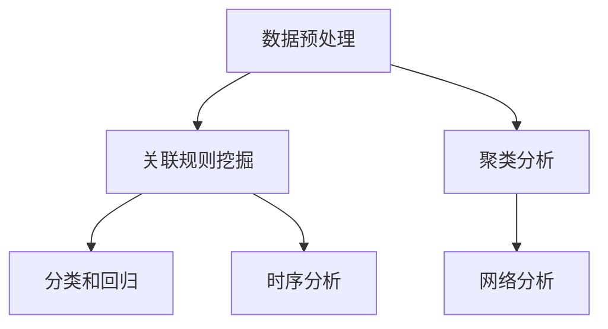

                 

# 知识发现引擎的核心算法解析

> 关键词：知识发现引擎,核心算法,数据挖掘,机器学习,人工智能

## 1. 背景介绍

### 1.1 问题由来
在信息爆炸的今天，数据的规模和复杂度不断增长，如何从中挖掘出有价值的信息和知识，成为了企业和社会面临的重大挑战。知识发现引擎（Knowledge Discovery Engine, KDE），作为数据挖掘和知识发现的重要工具，通过对大量数据进行分析和挖掘，能够从中提取出隐藏的规律、趋势和模式，为决策支持、商业智能等领域提供有力支撑。本文将重点解析知识发现引擎的核心算法，帮助读者深入理解其实现原理和应用场景。

### 1.2 问题核心关键点
知识发现引擎的核心算法主要包括以下几个关键点：

1. 数据预处理：清洗、归一化、特征工程等步骤，为后续的模型训练和知识挖掘打下基础。
2. 关联规则挖掘：通过频繁项集和关联规则算法，发现数据集中的潜在关联关系。
3. 聚类分析：将数据集划分为多个相似的子集，揭示数据的内在结构。
4. 分类和回归：利用监督学习算法，对数据进行分类和回归分析，发现数据的分类规律和趋势。
5. 时序分析：对时间序列数据进行建模和预测，发现其变化趋势和周期性特征。
6. 网络分析：通过构建图模型，发现数据之间的网络结构和关系。

## 2. 核心概念与联系

### 2.1 核心概念概述

为了更好地理解知识发现引擎的核心算法，本节将介绍几个密切相关的核心概念：

- 数据挖掘（Data Mining）：从大量数据中提取出隐藏的知识和规律的过程。
- 关联规则挖掘（Association Rule Mining）：通过频繁项集和关联规则算法，发现数据集中的关联关系。
- 聚类分析（Clustering）：将数据集划分为多个相似的子集，揭示数据的内在结构。
- 分类和回归（Classification and Regression）：利用监督学习算法，对数据进行分类和回归分析。
- 时序分析（Time Series Analysis）：对时间序列数据进行建模和预测，发现其变化趋势和周期性特征。
- 网络分析（Network Analysis）：通过构建图模型，发现数据之间的网络结构和关系。

这些核心概念之间的逻辑关系可以通过以下Mermaid流程图来展示：



这个流程图展示了一些核心概念及其之间的关系：

1. 数据预处理：清洗、归一化、特征工程等步骤。
2. 关联规则挖掘：通过频繁项集和关联规则算法，发现数据集中的关联关系。
3. 聚类分析：将数据集划分为多个相似的子集，揭示数据的内在结构。
4. 分类和回归：利用监督学习算法，对数据进行分类和回归分析。
5. 时序分析：对时间序列数据进行建模和预测，发现其变化趋势和周期性特征。
6. 网络分析：通过构建图模型，发现数据之间的网络结构和关系。

这些概念共同构成了知识发现引擎的核心算法框架，使其能够从大量数据中提取出有价值的知识。

## 3. 核心算法原理 & 具体操作步骤
### 3.1 算法原理概述

知识发现引擎的核心算法主要基于数据挖掘、机器学习和人工智能技术。其核心思想是通过对大量数据进行分析，从中提取潜在的关联关系、分类规律和趋势等知识。

形式化地，假设数据集为 $D$，目标是从 $D$ 中提取出有价值的知识 $K$，则知识发现引擎的优化目标可以表示为：

$$
\mathop{\arg\min}_{K} \text{distance}(K,\text{ground truth})
$$

其中，$\text{ground truth}$ 表示真实知识，$\text{distance}$ 为知识 $K$ 与真实知识之间的距离。这个目标可以分解为两个子目标：

1. 数据预处理：通过清洗、归一化、特征工程等步骤，构建数据集 $D'$。
2. 知识发现：在数据集 $D'$ 上应用关联规则挖掘、聚类分析、分类和回归、时序分析和网络分析等算法，发现潜在的知识 $K'$。

### 3.2 算法步骤详解

知识发现引擎的算法步骤通常包括以下几个关键步骤：

**Step 1: 数据预处理**
- 收集和清洗数据，去除噪声、缺失值和异常值。
- 对数据进行归一化、标准化和特征工程，将数据转换为适合模型训练的形式。

**Step 2: 关联规则挖掘**
- 构建数据集的频繁项集和关联规则。
- 通过 Apriori、FP-Growth 等算法，发现数据集中的关联关系。

**Step 3: 聚类分析**
- 选择合适的聚类算法，如 K-Means、DBSCAN、层次聚类等。
- 对数据集进行聚类，发现数据集的内在结构。

**Step 4: 分类和回归**
- 选择合适的分类和回归算法，如 SVM、决策树、随机森林、神经网络等。
- 在数据集上训练分类和回归模型，发现数据的分类规律和趋势。

**Step 5: 时序分析**
- 选择合适的时序分析模型，如 ARIMA、LSTM、GRU 等。
- 对时间序列数据进行建模和预测，发现其变化趋势和周期性特征。

**Step 6: 网络分析**
- 构建数据集的图模型，发现数据之间的网络结构和关系。
- 通过 PageRank、GCN、GNN 等算法，发现数据集的网络结构和关系。

### 3.3 算法优缺点

知识发现引擎的核心算法具有以下优点：

1. 高效性：能够快速处理大规模数据集，提取出潜在的知识。
2. 普适性：适用于多种数据类型和分析任务，包括分类、聚类、回归、时序分析和网络分析等。
3. 可解释性：能够提供详细的分析结果和可视化图表，便于理解和使用。

同时，这些算法也存在一定的局限性：

1. 对数据质量依赖高：数据预处理和特征工程对算法的准确性和稳定性具有重要影响。
2. 模型复杂度高：部分算法如神经网络和图模型，具有较高的计算复杂度，需要较长的训练时间和计算资源。
3. 结果解释困难：部分算法如深度学习和图模型，其内部工作机制复杂，难以解释其结果和推理过程。

尽管存在这些局限性，但知识发现引擎的核心算法仍然在数据挖掘和知识发现领域发挥着重要作用，是实现数据驱动决策的关键工具。

### 3.4 算法应用领域

知识发现引擎的核心算法广泛应用于以下几个领域：

- 商业智能：通过分析客户行为数据，发现客户群体和购买行为规律，制定精准的营销策略。
- 金融风险管理：通过分析金融数据，发现潜在的风险因素和趋势，制定风险管理策略。
- 医疗健康：通过分析医疗数据，发现疾病的关联因素和趋势，制定个性化的治疗方案。
- 网络安全：通过分析网络流量数据，发现潜在的攻击行为和漏洞，制定安全防护策略。
- 社交媒体分析：通过分析社交媒体数据，发现用户的兴趣和行为规律，制定针对性的内容推荐策略。

这些领域的应用，充分展示了知识发现引擎的强大功能和广泛应用场景。

## 4. 数学模型和公式 & 详细讲解 & 举例说明

### 4.1 数学模型构建

为了更好地理解知识发现引擎的核心算法，我们将从数学模型的角度对其进行详细的解析。

假设数据集 $D=\{(x_i,y_i)\}_{i=1}^N$，其中 $x_i$ 表示特征向量，$y_i$ 表示标签向量。知识发现引擎的目标是构建一个模型 $M$，使其能够根据新的输入特征 $x$，预测其对应的标签 $y$。

### 4.2 公式推导过程

以下我们以回归分析为例，推导最小二乘法（Least Squares Regression）的公式及其求解过程。

假设回归模型为 $y=wx+b$，其中 $w$ 表示权重向量，$b$ 表示偏置项。目标是最小化预测值与真实值之间的平方误差，即：

$$
\mathop{\arg\min}_{w,b} \sum_{i=1}^N (y_i - (wx_i + b))^2
$$

对上式求导，得：

$$
\frac{\partial \mathcal{L}(w,b)}{\partial w} = -2\sum_{i=1}^N x_i(y_i - wx_i - b)
$$

$$
\frac{\partial \mathcal{L}(w,b)}{\partial b} = -2\sum_{i=1}^N (y_i - wx_i - b)
$$

令导数等于零，解方程组，得：

$$
w = \frac{\sum_{i=1}^N x_iy_i}{\sum_{i=1}^N x_i^2}, b = \frac{\sum_{i=1}^N y_i - w\sum_{i=1}^N x_i}{N}
$$

该公式即为最小二乘法回归的求解公式，通过求解该方程组，得到最优的权重向量 $w$ 和偏置项 $b$。

### 4.3 案例分析与讲解

假设我们有一组学生的考试成绩数据 $D=\{(x_i,y_i)\}_{i=1}^N$，其中 $x_i$ 表示学生的数学成绩，$y_i$ 表示学生的英语成绩。我们希望构建一个回归模型，预测学生的英语成绩。

我们可以使用最小二乘法回归模型 $y=wx+b$ 来建模。首先，对数据进行归一化，将其转化为标准正态分布，然后构建特征向量 $x=\{x_i\}_{i=1}^N$，标签向量 $y=\{y_i\}_{i=1}^N$。

接着，使用公式求解得到最优的权重向量 $w$ 和偏置项 $b$。求解后，得到一个回归模型，可以用于预测新学生的英语成绩。

## 5. 项目实践：代码实例和详细解释说明
### 5.1 开发环境搭建

在进行知识发现引擎的开发实践前，我们需要准备好开发环境。以下是使用Python进行Scikit-learn开发的环境配置流程：

1. 安装Anaconda：从官网下载并安装Anaconda，用于创建独立的Python环境。

2. 创建并激活虚拟环境：
```bash
conda create -n sklearn-env python=3.8 
conda activate sklearn-env
```

3. 安装Scikit-learn：使用pip或conda安装Scikit-learn库。例如：
```bash
pip install scikit-learn
```

4. 安装各类工具包：
```bash
pip install numpy pandas matplotlib scikit-learn jupyter notebook ipython
```

完成上述步骤后，即可在`sklearn-env`环境中开始开发实践。

### 5.2 源代码详细实现

下面我们以回归分析为例，给出使用Scikit-learn库进行数据集回归分析的Python代码实现。

首先，定义数据集：

```python
import pandas as pd
from sklearn.model_selection import train_test_split

# 读取数据集
data = pd.read_csv('scores.csv')

# 分割数据集
x_train, x_test, y_train, y_test = train_test_split(data[['math_score']], data['english_score'], test_size=0.2, random_state=42)
```

然后，定义回归模型并进行训练：

```python
from sklearn.linear_model import LinearRegression

# 定义回归模型
model = LinearRegression()

# 训练模型
model.fit(x_train, y_train)
```

接着，在测试集上进行评估：

```python
# 在测试集上进行评估
score = model.score(x_test, y_test)
print(f"回归模型在测试集上的准确率为 {score:.3f}")
```

完整代码如下：

```python
import pandas as pd
from sklearn.model_selection import train_test_split
from sklearn.linear_model import LinearRegression

# 读取数据集
data = pd.read_csv('scores.csv')

# 分割数据集
x_train, x_test, y_train, y_test = train_test_split(data[['math_score']], data['english_score'], test_size=0.2, random_state=42)

# 定义回归模型
model = LinearRegression()

# 训练模型
model.fit(x_train, y_train)

# 在测试集上进行评估
score = model.score(x_test, y_test)
print(f"回归模型在测试集上的准确率为 {score:.3f}")
```

### 5.3 代码解读与分析

让我们再详细解读一下关键代码的实现细节：

**DataSplit函数**：
- 定义数据集的分割函数，使用train_test_split函数对数据集进行训练集和测试集的分割。

**LinearRegression模型**：
- 使用Scikit-learn库的LinearRegression模型进行回归分析，构建线性回归模型。

**fit函数**：
- 使用fit函数训练模型，将训练集输入模型，更新模型参数，使得模型能够准确预测新样本。

**score函数**：
- 使用score函数评估模型在测试集上的性能，返回模型的准确率。

**输出结果**：
- 输出模型在测试集上的准确率，以评估模型的性能。

可以看到，Scikit-learn库的线性回归模型实现简单，易于理解和使用，非常适合知识发现引擎的开发实践。

## 6. 实际应用场景
### 6.1 商业智能

知识发现引擎在商业智能领域有广泛的应用。通过分析客户行为数据，可以发现客户群体和购买行为规律，制定精准的营销策略，提高销售额和客户满意度。例如，某电商平台可以通过分析客户的浏览和购买记录，发现不同客户群体的购买偏好和购买频率，制定个性化的推荐策略，提高客户的购物体验。

### 6.2 金融风险管理

在金融领域，知识发现引擎可以用于风险管理和欺诈检测。通过分析交易数据，可以发现潜在的风险因素和异常交易，制定相应的风险管理策略，降低金融机构的损失。例如，银行可以通过分析客户的交易记录，发现异常交易行为，及时采取措施，防止金融诈骗。

### 6.3 医疗健康

在医疗领域，知识发现引擎可以用于疾病预测和个性化治疗。通过分析医疗数据，可以发现疾病的关联因素和趋势，制定个性化的治疗方案，提高治疗效果。例如，某医院可以通过分析患者的病历数据，发现不同疾病的关联因素，制定针对性的治疗方案，提高治疗效果。

### 6.4 网络安全

在网络安全领域，知识发现引擎可以用于攻击检测和入侵防御。通过分析网络流量数据，可以发现潜在的攻击行为和漏洞，制定相应的安全防护策略，提高网络安全水平。例如，某企业可以通过分析网络流量数据，发现潜在的攻击行为，及时采取措施，防止网络攻击。

### 6.5 社交媒体分析

在社交媒体领域，知识发现引擎可以用于舆情分析和内容推荐。通过分析社交媒体数据，可以发现用户的兴趣和行为规律，制定针对性的内容推荐策略，提高用户粘性和满意度。例如，某社交媒体平台可以通过分析用户的浏览和评论记录，发现用户的兴趣和行为规律，制定个性化的内容推荐策略，提高用户粘性。

## 7. 工具和资源推荐
### 7.1 学习资源推荐

为了帮助开发者系统掌握知识发现引擎的理论基础和实践技巧，这里推荐一些优质的学习资源：

1. 《机器学习》（周志华）：经典机器学习教材，涵盖了机器学习的基本概念和算法，适合初学者和进阶者阅读。

2. 《统计学习方法》（李航）：李航的经典教材，详细介绍了统计学习的基本原理和算法，适合深度学习爱好者。

3. 《Python机器学习》（Raschka）：介绍使用Python进行机器学习的实践指南，包括数据预处理、模型训练和评估等内容。

4. Kaggle：机器学习和数据挖掘竞赛平台，提供了大量公开数据集和竞赛机会，适合实战练习和经验积累。

5. UCI机器学习库：UCI提供的公开数据集和算法库，适合学习和研究使用。

通过对这些资源的学习实践，相信你一定能够快速掌握知识发现引擎的精髓，并用于解决实际的NLP问题。

### 7.2 开发工具推荐

高效的开发离不开优秀的工具支持。以下是几款用于知识发现引擎开发的常用工具：

1. Python：Python是机器学习和数据挖掘领域的主流语言，简单易学，生态丰富。

2. Scikit-learn：Python的机器学习库，提供了丰富的算法和工具，支持数据预处理、模型训练和评估等步骤。

3. TensorFlow：由Google主导开发的深度学习框架，支持大规模分布式训练和部署。

4. PyTorch：由Facebook开发的深度学习框架，支持动态计算图，易于调试和优化。

5. Weights & Biases：模型训练的实验跟踪工具，可以记录和可视化模型训练过程中的各项指标，方便对比和调优。

6. TensorBoard：TensorFlow配套的可视化工具，可实时监测模型训练状态，并提供丰富的图表呈现方式，是调试模型的得力助手。

合理利用这些工具，可以显著提升知识发现引擎的开发效率，加快创新迭代的步伐。

### 7.3 相关论文推荐

知识发现引擎的研究源于学界的持续研究。以下是几篇奠基性的相关论文，推荐阅读：

1.ID3算法：Quinlan提出，基于信息熵和信息增益的决策树算法，是早期数据挖掘和机器学习的经典算法。

2.C4.5算法：Quinlan改进ID3算法，引入决策树剪枝和连续值处理等技术，进一步提高了决策树的性能。

3.CART算法：Breiman提出，结合决策树和回归树，支持分类和回归任务，是数据挖掘和机器学习的常用算法。

4.K-Means算法：MacQueen提出，基于K个中心点的聚类算法，是聚类分析的经典算法。

5.Apriori算法：Agrawal提出，基于关联规则的频繁项集算法，是关联规则挖掘的经典算法。

这些论文代表了大数据挖掘和知识发现领域的发展脉络。通过学习这些前沿成果，可以帮助研究者把握学科前进方向，激发更多的创新灵感。

## 8. 总结：未来发展趋势与挑战
### 8.1 总结

本文对知识发现引擎的核心算法进行了全面系统的介绍。首先阐述了知识发现引擎的研究背景和意义，明确了核心算法在数据挖掘和知识发现中的重要作用。其次，从原理到实践，详细讲解了关联规则挖掘、聚类分析、分类和回归、时序分析和网络分析等核心算法的实现步骤，给出了完整的代码实例。同时，本文还广泛探讨了知识发现引擎在商业智能、金融风险管理、医疗健康、网络安全、社交媒体分析等多个领域的应用前景，展示了知识发现引擎的广泛应用价值。

通过本文的系统梳理，可以看到，知识发现引擎的核心算法在数据挖掘和知识发现领域具有重要的地位，能够从大量数据中提取出有价值的知识，助力决策支持和业务智能。未来，伴随数据规模的不断扩大和算法技术的不断演进，知识发现引擎必将在更多领域得到应用，为人类认知智能的进步做出更大的贡献。

### 8.2 未来发展趋势

展望未来，知识发现引擎的核心算法将呈现以下几个发展趋势：

1. 自动化和智能化：随着自动化学习和智能算法的发展，知识发现引擎将能够自动化地进行数据预处理、模型训练和结果解释，提高效率和准确性。

2. 跨领域应用：知识发现引擎将更多地应用于跨领域的数据挖掘和知识发现，如文本分析、图像识别、语音识别等领域，拓展其应用范围。

3. 实时化处理：知识发现引擎将支持实时数据挖掘和分析，提供更快速、实时的决策支持，适应动态变化的业务需求。

4. 多模态融合：知识发现引擎将支持多模态数据的融合，整合文本、图像、语音等多种数据源，提升数据挖掘和知识发现的深度和广度。

5. 隐私保护：知识发现引擎将支持隐私保护和数据安全，保护数据隐私和数据安全，降低隐私泄露风险。

这些趋势展示了知识发现引擎的广阔前景，未来必将为人类认知智能的发展做出更大的贡献。

### 8.3 面临的挑战

尽管知识发现引擎的核心算法已经取得了显著进展，但在迈向更加智能化、普适化应用的过程中，它仍面临以下挑战：

1. 数据质量问题：数据预处理和特征工程对算法的效果具有重要影响，但数据质量难以保证，如何降低数据质量对算法的影响，是亟待解决的问题。

2. 模型复杂性：部分算法如深度学习和图模型，具有较高的计算复杂度，如何优化模型结构，提高模型训练和推理效率，是重要研究方向。

3. 结果解释性：部分算法如深度学习和图模型，其内部工作机制复杂，难以解释其结果和推理过程，如何增强模型的可解释性，是研究热点。

4. 数据隐私保护：在处理敏感数据时，如何保护数据隐私和数据安全，是知识发现引擎应用中的重要问题。

5. 系统鲁棒性：知识发现引擎的算法模型需要具备较好的鲁棒性，能够应对数据分布变化和异常数据的影响，如何提高模型的鲁棒性，是研究难点。

6. 算法公平性：知识发现引擎的算法模型需要公平、公正，避免偏见和歧视，如何设计公平算法，是研究重点。

这些挑战展示了知识发现引擎的复杂性和多样性，需要研究者从多个角度进行探索和解决。

### 8.4 研究展望

面对知识发现引擎面临的种种挑战，未来的研究需要在以下几个方面寻求新的突破：

1. 自动化学习：引入自动化学习和智能算法，实现数据预处理、模型训练和结果解释的自动化。

2. 多模态融合：研究多模态数据融合方法，提升知识发现引擎的数据挖掘和知识发现能力。

3. 模型压缩：研究模型压缩和优化方法，提升知识发现引擎的模型训练和推理效率。

4. 隐私保护：研究数据隐私保护方法，提升知识发现引擎的安全性和可信度。

5. 公平算法：研究公平算法设计，避免算法偏见和歧视，提升知识发现引擎的公平性和公正性。

这些研究方向展示了知识发现引擎的广阔前景，未来必将为人类认知智能的发展做出更大的贡献。

## 9. 附录：常见问题与解答

**Q1：知识发现引擎适用于所有数据挖掘任务吗？**

A: 知识发现引擎适用于多种数据挖掘任务，包括关联规则挖掘、聚类分析、分类和回归、时序分析和网络分析等。但对于部分特殊任务，如图像识别和语音识别等，可能需要进行特定算法的优化。

**Q2：如何选择合适的知识发现算法？**

A: 选择合适的知识发现算法需要根据数据类型、任务目标和数据规模等因素综合考虑。一般来说，对于分类任务，可以使用决策树、随机森林、SVM等算法；对于聚类任务，可以使用K-Means、DBSCAN等算法；对于关联规则挖掘任务，可以使用Apriori、FP-Growth等算法。

**Q3：知识发现引擎在处理大规模数据时需要注意哪些问题？**

A: 处理大规模数据时，需要注意数据预处理和特征工程的时间复杂度，避免长时间预处理导致程序无法收敛。同时需要注意算法的计算复杂度和内存消耗，避免内存溢出或计算超时等问题。

**Q4：知识发现引擎在实际应用中需要注意哪些问题？**

A: 知识发现引擎在实际应用中需要注意模型的可解释性、鲁棒性、公平性和安全性等问题。同时需要考虑系统的实时性、可扩展性和稳定性，确保系统在实际应用中的稳定性和高效性。

这些问题是知识发现引擎应用中的常见问题，需要研究者在实际应用中不断优化和改进。

---

作者：禅与计算机程序设计艺术 / Zen and the Art of Computer Programming

