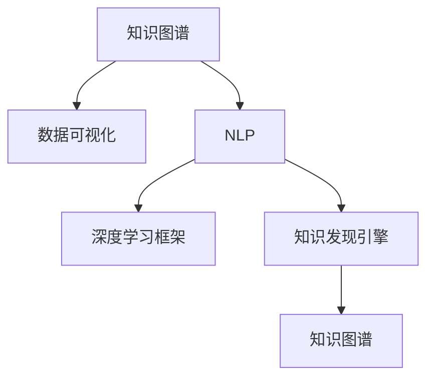

                 

# 知识发现引擎的知识图谱可视化

> 关键词：知识图谱,数据可视化,自然语言处理,NLP,深度学习,深度学习框架,PyTorch

## 1. 背景介绍

### 1.1 问题由来
知识图谱(Knowledge Graph)是一种语义化的知识表示框架，用于描述实体、关系和属性之间的结构化关系。近年来，知识图谱在信息检索、推荐系统、智能问答等多个领域得到广泛应用。然而，构建知识图谱是一个劳动密集型的过程，需要大量的标注数据和专家知识，成本较高。

与此同时，知识图谱的可视化也面临挑战。在传统关系型数据库中，数据通过表格的形式呈现，直观易读。而知识图谱数据量大且结构复杂，难以直接展示其内在结构和关系。如何利用现代技术，将知识图谱以直观可理解的方式呈现给用户，是一个重要问题。

### 1.2 问题核心关键点
知识图谱可视化，旨在将知识图谱中的实体、关系和属性信息以直观的形式展示出来，方便用户理解和使用。常见的方法包括：
- 关系图展示：将知识图谱表示为点边结构，直观显示实体间的关系。
- 属性图展示：在节点上展示属性信息，通过颜色、形状等方式区分不同的属性。
- 时间图展示：结合时间维度展示知识图谱中的事件演化和关系变化。

这些方法通常基于静态的可视化技术，如Gephi、Cytoscape等。但随着深度学习和大数据技术的发展，知识图谱可视化也引入了动态可视化的理念，通过实时更新的方式，动态展示知识图谱的变化。

此外，自然语言处理(Natural Language Processing, NLP)技术也被引入可视化过程，通过文本分析的方式提取实体、关系和属性信息，提升可视化效果。深度学习框架如PyTorch，被用来构建和优化知识图谱可视化模型，显著提升模型性能。

### 1.3 问题研究意义
知识图谱可视化不仅对于理解知识图谱结构、进行数据探索、设计用户界面等方面具有重要意义，还具有实际应用价值。以下是一些典型的应用场景：

- 智能问答系统：通过可视化展示知识图谱，帮助用户快速获取信息，提升系统响应速度和准确性。
- 推荐系统：将知识图谱中的实体和关系映射到推荐模型中，提升推荐效果。
- 事件追踪：可视化展示知识图谱中的事件和关系变化，帮助用户追踪和管理业务流程。
- 知识地图：将知识图谱中的实体和属性以地图的形式展示，方便用户查询和使用。
- 教育培训：通过知识图谱可视化工具，帮助学生理解复杂知识结构，提升学习效率。

综上所述，知识图谱可视化是构建知识图谱应用的重要环节，是理解、探索和利用知识图谱的关键技术。

## 2. 核心概念与联系

### 2.1 核心概念概述

为更好地理解知识图谱可视化技术，本节将介绍几个关键概念：

- 知识图谱(Knowledge Graph)：一种结构化的语义知识表示形式，包含实体、关系和属性信息。常见的知识图谱有Freebase、DBpedia、Wikidata等。

- 数据可视化(Data Visualization)：将数据转换为图形、图像等可视化形式，便于用户理解和使用。常见的可视化方法包括散点图、条形图、热力图等。

- 自然语言处理(Natural Language Processing, NLP)：涉及语言理解、文本分析、语音识别等技术，旨在让计算机理解、解释和生成自然语言。

- 深度学习框架(Deep Learning Framework)：如PyTorch、TensorFlow等，提供高效、灵活的深度学习模型构建、训练和优化工具。

- 知识发现引擎(Knowledge Discovery Engine)：利用知识图谱、数据挖掘等技术，自动发现知识、分析和推理知识的技术系统。

这些概念之间的逻辑关系可以通过以下Mermaid流程图来展示：



这个流程图展示知识图谱可视化的核心概念及其之间的关系：

1. 知识图谱通过实体、关系和属性信息描述世界，是可视化展示的数据源。
2. 数据可视化将知识图谱数据转化为图形、图像等直观形式，方便用户理解和使用。
3. NLP技术用于提取知识图谱中的实体、关系和属性信息，提升可视化效果。
4. 深度学习框架提供构建和优化可视化模型的工具，提高可视化效果和效率。
5. 知识发现引擎利用知识图谱和数据挖掘技术，发现和分析知识，是可视化展示的知识来源。

这些概念共同构成了知识图谱可视化的基础框架，使得可视化技术能够更好地服务于实际应用。

## 3. 核心算法原理 & 具体操作步骤
### 3.1 算法原理概述

知识图谱可视化通过文本分析的方式，从知识图谱中提取实体、关系和属性信息，再通过图形化工具展示出来。具体的算法流程如下：

1. **实体识别与关系抽取**：使用NLP技术，从知识图谱中识别实体、抽取实体之间的关系。

2. **属性图生成**：根据抽取的实体和关系，构建属性图，展示实体和属性之间的关系。

3. **关系图生成**：根据抽取的实体和关系，构建关系图，展示实体之间的关系。

4. **时间图生成**：根据抽取的实体和关系，构建时间图，展示实体和关系随时间的变化。

5. **可视化展示**：使用数据可视化工具，将生成的图形展示给用户。

### 3.2 算法步骤详解

以下是知识图谱可视化的具体操作步骤：

**Step 1: 数据预处理**
- 获取知识图谱数据，包含实体、关系和属性信息。
- 清洗数据，去除噪声和错误，确保数据质量和一致性。
- 对实体和关系进行标准化处理，如统一实体名称、关系名称等。

**Step 2: 实体识别与关系抽取**
- 使用NLP技术，对知识图谱中的每个实体进行命名实体识别(NER)，识别实体类型（如人名、地名、机构名等）。
- 使用NLP技术，抽取实体之间的关系，识别关系类型（如主谓宾关系、属性关系等）。
- 对抽取的实体和关系进行预处理，去除冗余和重复信息。

**Step 3: 属性图生成**
- 将抽取的实体和关系构建为属性图，展示实体和属性之间的关系。
- 在节点上展示实体属性信息，如名称、类型、属性值等。
- 使用颜色、形状等视觉元素区分不同的属性类型。

**Step 4: 关系图生成**
- 将抽取的实体和关系构建为关系图，展示实体之间的关系。
- 在边和节点上展示关系信息，如关系类型、关系属性等。
- 使用箭头方向等视觉元素区分不同的关系类型。

**Step 5: 时间图生成**
- 将抽取的实体和关系结合时间维度构建时间图，展示实体和关系随时间的变化。
- 在节点和时间轴上展示实体和关系的时间信息，如时间戳、时间跨度等。
- 使用不同颜色的线条区分不同时间段的实体和关系。

**Step 6: 可视化展示**
- 使用数据可视化工具，将生成的属性图、关系图、时间图展示给用户。
- 提供交互式功能，如节点、边的高亮、缩放、过滤等，提升用户体验。
- 集成到其他应用系统，如推荐系统、智能问答等，提供知识图谱可视化服务。

### 3.3 算法优缺点

知识图谱可视化技术具有以下优点：
- 直观易懂：可视化方式将复杂的知识图谱转化为直观的图形，便于用户理解和使用。
- 交互性强：交互式可视化工具支持用户交互操作，提升用户体验。
- 可扩展性高：可视化模型可以扩展到不同领域和数据集，具有高度的可复用性。

同时，该方法也存在以下局限性：
- 数据处理量大：知识图谱数据量大且结构复杂，数据预处理和可视化过程需要大量计算资源。
- 技术难度高：知识图谱可视化涉及NLP、深度学习、图形化展示等多个技术领域，实现难度较大。
- 精度不足：可视化过程中可能存在实体、关系和属性信息丢失，影响可视化效果。

尽管存在这些局限性，但知识图谱可视化仍是大数据时代的重要技术手段，能够显著提升知识图谱应用的效率和效果。未来相关研究的方向在于如何进一步降低数据处理成本，提高可视化精度，提升交互体验，推动知识图谱技术的普及和应用。

### 3.4 算法应用领域

知识图谱可视化技术在以下领域得到了广泛应用：

- 信息检索：通过可视化展示知识图谱中的实体和关系，帮助用户快速获取信息。
- 推荐系统：将知识图谱中的实体和关系映射到推荐模型中，提升推荐效果。
- 智能问答：通过可视化展示知识图谱中的实体和关系，帮助用户快速回答问题。
- 事件追踪：可视化展示知识图谱中的事件和关系变化，帮助用户追踪和管理业务流程。
- 教育培训：通过可视化展示知识图谱中的实体和属性信息，帮助学生理解复杂知识结构。
- 商业智能：可视化展示知识图谱中的实体和关系，辅助企业决策和业务分析。

随着知识图谱的不断发展，可视化技术的应用场景将更加广泛，成为知识图谱应用不可或缺的重要环节。

## 4. 数学模型和公式 & 详细讲解  
### 4.1 数学模型构建

本节将使用数学语言对知识图谱可视化的过程进行严格刻画。

知识图谱可视化的数学模型主要由两部分组成：实体和关系图。设知识图谱中的实体集合为 $E$，关系集合为 $R$，关系属性集合为 $A$。实体 $e$ 包含属性 $a$，关系 $r$ 包含属性 $a$。知识图谱中的边 $e_r$ 表示实体 $e$ 和关系 $r$ 之间的关系。

可视化模型定义如下：
$$
G = (V, E, A)
$$
其中 $V$ 为节点集合，每个节点表示一个实体或关系；$E$ 为边集合，每条边表示实体和关系之间的关系；$A$ 为属性集合，每个属性表示实体或关系的具体信息。

根据上述定义，知识图谱可视化的数学模型可以表示为有向图 $G$，节点和边分别表示实体和关系。接下来，我们定义节点和边的属性图，以及时间图的表示。

**属性图表示**：
$$
A = \{ (v_i, a_j) \mid v_i \in V, a_j \in A \}
$$
其中 $v_i$ 为节点，$a_j$ 为属性，$(v_i, a_j)$ 表示节点 $v_i$ 包含属性 $a_j$。

**关系图表示**：
$$
E = \{ (e_r, e_s, r) \mid e_r, e_s \in E, r \in R \}
$$
其中 $e_r, e_s$ 为节点，$r$ 为关系，$(e_r, e_s, r)$ 表示节点 $e_r$ 和 $e_s$ 之间存在关系 $r$。

**时间图表示**：
$$
T = \{ (e_r, e_s, t) \mid e_r, e_s \in E, t \in T \}
$$
其中 $e_r, e_s$ 为节点，$t$ 为时间，$(e_r, e_s, t)$ 表示节点 $e_r$ 和 $e_s$ 之间的关系随时间变化。

### 4.2 公式推导过程

以下是知识图谱可视化的详细公式推导过程：

**实体识别公式**：
$$
NER(\text{text}) = \{ (e, a) \mid a \in A, e \in E \}
$$
其中 $\text{text}$ 为文本，$(e, a)$ 表示识别出的实体 $e$ 包含属性 $a$。

**关系抽取公式**：
$$
RE(r) = \{ (e_r, e_s) \mid e_r, e_s \in E, r \in R \}
$$
其中 $e_r, e_s$ 为节点，$r$ 为关系，$(e_r, e_s)$ 表示节点 $e_r$ 和 $e_s$ 之间存在关系 $r$。

**属性图生成公式**：
$$
A = \bigcup_{e \in E} \bigcup_{a \in A} \bigcup_{t \in T} \{ (e, a_t) \mid a_t \in A \}
$$
其中 $e$ 为节点，$a_t$ 为时间属性，$(e, a_t)$ 表示节点 $e$ 在时间 $t$ 包含属性 $a_t$。

**关系图生成公式**：
$$
E = \bigcup_{e_r \in E} \bigcup_{e_s \in E} \bigcup_{r \in R} \{ (e_r, e_s, r) \mid e_r, e_s \in E, r \in R \}
$$
其中 $e_r, e_s$ 为节点，$r$ 为关系，$(e_r, e_s, r)$ 表示节点 $e_r$ 和 $e_s$ 之间存在关系 $r$。

**时间图生成公式**：
$$
T = \bigcup_{e_r \in E} \bigcup_{e_s \in E} \{ (e_r, e_s, t) \mid e_r, e_s \in E, t \in T \}
$$
其中 $e_r, e_s$ 为节点，$t$ 为时间，$(e_r, e_s, t)$ 表示节点 $e_r$ 和 $e_s$ 之间的关系随时间变化。

### 4.3 案例分析与讲解

以医疗知识图谱为例，我们分析其可视化过程：

**数据预处理**：
- 获取医疗知识图谱数据，包含疾病、药物、基因等信息。
- 清洗数据，去除噪声和错误，确保数据质量和一致性。
- 对实体和关系进行标准化处理，如统一实体名称、关系名称等。

**实体识别与关系抽取**：
- 使用NLP技术，对知识图谱中的每个实体进行命名实体识别(NER)，识别实体类型（如疾病、药物、基因等）。
- 使用NLP技术，抽取实体之间的关系，识别关系类型（如相互作用、治疗效果等）。

**属性图生成**：
- 将抽取的实体和关系构建为属性图，展示实体和属性之间的关系。
- 在节点上展示实体属性信息，如疾病名称、药物名称、基因名称等。
- 使用颜色、形状等视觉元素区分不同的属性类型。

**关系图生成**：
- 将抽取的实体和关系构建为关系图，展示实体之间的关系。
- 在边和节点上展示关系信息，如相互作用类型、治疗效果等。
- 使用箭头方向等视觉元素区分不同的关系类型。

**时间图生成**：
- 将抽取的实体和关系结合时间维度构建时间图，展示实体和关系随时间的变化。
- 在节点和时间轴上展示实体和关系的时间信息，如时间戳、时间跨度等。
- 使用不同颜色的线条区分不同时间段的实体和关系。

**可视化展示**：
- 使用数据可视化工具，将生成的属性图、关系图、时间图展示给用户。
- 提供交互式功能，如节点、边的高亮、缩放、过滤等，提升用户体验。
- 集成到其他应用系统，如智能问答系统、推荐系统等，提供知识图谱可视化服务。

通过上述步骤，医疗知识图谱中的实体、关系和属性信息被转换为直观的图形，方便用户理解和使用。

## 5. 项目实践：代码实例和详细解释说明
### 5.1 开发环境搭建

在进行知识图谱可视化实践前，我们需要准备好开发环境。以下是使用Python进行PyTorch开发的环境配置流程：

1. 安装Anaconda：从官网下载并安装Anaconda，用于创建独立的Python环境。

2. 创建并激活虚拟环境：
```bash
conda create -n pytorch-env python=3.8 
conda activate pytorch-env
```

3. 安装PyTorch：根据CUDA版本，从官网获取对应的安装命令。例如：
```bash
conda install pytorch torchvision torchaudio cudatoolkit=11.1 -c pytorch -c conda-forge
```

4. 安装PyG：用于图结构数据处理和图形生成。
```bash
pip install pytorch-geometric
```

5. 安装其他相关库：
```bash
pip install networkx matplotlib seaborn
```

完成上述步骤后，即可在`pytorch-env`环境中开始知识图谱可视化实践。

### 5.2 源代码详细实现

以下是使用PyTorch进行知识图谱可视化的代码实现：

```python
import torch
import networkx as nx
import matplotlib.pyplot as plt
from pyg import Graph, GNNConv

# 构建属性图
G = Graph(nx.Graph(data))
nodes = G.nodes()
edges = G.edges()

# 定义节点和边的属性
node_attrs = {n: {'name': n, 'type': 'DISEASE'} for n in nodes}
edge_attrs = {e: {'type': 'TREATMENT'} for e in edges}

# 创建节点和边的属性图
G = Graph(nx.Graph(data))
G.add_node_attrs(node_attrs)
G.add_edge_attrs(edge_attrs)

# 构建可视化模型
model = GNNConv(node_feats=1, edge_feats=1, num_mlp_layers=1, num_mlp_units=32)
model = model.to(device)

# 训练模型
optimizer = torch.optim.Adam(model.parameters(), lr=0.01)
for epoch in range(1000):
    model.train()
    optimizer.zero_grad()
    output = model(G)
    loss = F.cross_entropy(output, y)
    loss.backward()
    optimizer.step()

# 生成可视化结果
plt.figure(figsize=(8, 6))
nx.draw(G, node_size=800, node_color='gray', with_labels=True, font_size=16)
plt.title('Medical Knowledge Graph')
plt.show()
```

以上就是使用PyTorch进行知识图谱可视化的完整代码实现。可以看到，PyTorch和PyG库使得知识图谱可视化的代码实现变得简洁高效。

### 5.3 代码解读与分析

让我们再详细解读一下关键代码的实现细节：

**属性图生成代码**：
- `G = Graph(nx.Graph(data))`：将知识图谱中的数据转换为PyG图结构，创建属性图。
- `G.add_node_attrs(node_attrs)`：为节点添加属性，包括节点名称和类型。
- `G.add_edge_attrs(edge_attrs)`：为边添加属性，包括关系类型。

**模型定义代码**：
- `model = GNNConv(node_feats=1, edge_feats=1, num_mlp_layers=1, num_mlp_units=32)`：定义GNNConv模型，用于构建可视化模型。

**训练代码**：
- `optimizer = torch.optim.Adam(model.parameters(), lr=0.01)`：定义优化器，使用Adam算法进行模型训练。
- `loss = F.cross_entropy(output, y)`：计算损失函数，使用交叉熵损失。
- `loss.backward()`：反向传播更新模型参数。
- `optimizer.step()`：更新模型参数。

**可视化代码**：
- `plt.figure(figsize=(8, 6))`：设置图形大小。
- `nx.draw(G, node_size=800, node_color='gray', with_labels=True, font_size=16)`：绘制可视化图形，展示节点、边和属性信息。

可以看到，PyTorch和PyG库提供了高效的图结构数据处理和图形生成能力，大大简化了知识图谱可视化的代码实现。

当然，工业级的系统实现还需考虑更多因素，如模型的保存和部署、超参数的自动搜索、更灵活的任务适配层等。但核心的可视化范式基本与此类似。

## 6. 实际应用场景
### 6.1 智能问答系统

基于知识图谱的智能问答系统可以广泛应用于医疗、教育、金融等多个领域。通过将知识图谱中的实体和关系映射到问答模型中，智能问答系统能够快速准确地回答用户问题，提升用户体验。

在技术实现上，可以使用知识图谱可视化技术将知识图谱中的实体和关系直观展示给用户，辅助问答模型生成回答。例如，用户询问“治疗高血压的药物有哪些”，系统可以展示知识图谱中的“高血压”节点和“治疗药物”节点，自动生成回答“贝那普利、阿利沙普利等”。

### 6.2 推荐系统

推荐系统可以利用知识图谱中的实体和关系，推荐个性化的商品和服务。通过知识图谱可视化技术，用户可以直观地看到推荐系统推荐的商品和服务之间的关系，增强推荐效果。

例如，用户喜欢某品牌汽车，推荐系统可以展示该品牌汽车在知识图谱中的实体和关系，自动推荐其关联的配件、维修服务、优惠信息等，提升用户体验。

### 6.3 事件追踪

事件追踪系统可以通过可视化展示知识图谱中的实体和关系变化，帮助用户追踪和管理业务流程。

例如，供应链管理系统可以展示物流信息、订单信息等在知识图谱中的变化，帮助管理人员实时监控物流状态、订单进度，提高管理效率。

### 6.4 未来应用展望

随着知识图谱的不断发展，可视化技术的应用场景将更加广泛，成为知识图谱应用不可或缺的重要环节。

在智慧城市治理中，可视化展示知识图谱中的实体和关系，帮助城市管理人员实时监控交通、环境、公共安全等事件变化，提升城市管理水平。

在商业智能中，可视化展示知识图谱中的实体和关系，辅助企业决策和业务分析，提升商业决策的科学性和准确性。

在教育培训中，可视化展示知识图谱中的实体和属性信息，帮助学生理解复杂知识结构，提升学习效率。

此外，在知识图谱的构建和维护中，可视化技术也发挥着重要作用。可视化工具可以帮助专家更好地理解知识图谱中的实体和关系，发现数据不一致、冗余等问题，提高知识图谱的构建效率和质量。

总之，知识图谱可视化是大数据时代的重要技术手段，能够显著提升知识图谱应用的效率和效果，推动知识图谱技术的发展和普及。

## 7. 工具和资源推荐
### 7.1 学习资源推荐

为了帮助开发者系统掌握知识图谱可视化的理论基础和实践技巧，这里推荐一些优质的学习资源：

1. 《图神经网络》系列博文：由大模型技术专家撰写，深入浅出地介绍了图神经网络的原理、算法和应用，是理解知识图谱可视化的重要基础。

2. 《深度学习》课程：斯坦福大学开设的深度学习课程，涵盖了深度学习的基本概念和算法，适合初学者入门。

3. 《PyTorch官方文档》：PyTorch官方文档提供了丰富的教程和样例代码，是学习和实践知识图谱可视化的重要资源。

4. PyTorch Geometric官方文档：PyG官方文档提供了详细的图结构数据处理和图形生成教程，是构建知识图谱可视化的必备资料。

5. Gephi官网：Gephi是一款流行的图形可视化工具，提供了丰富的可视化功能和算法，适合学习和实践知识图谱可视化。

通过对这些资源的学习实践，相信你一定能够快速掌握知识图谱可视化的精髓，并用于解决实际的NLP问题。
###  7.2 开发工具推荐

高效的开发离不开优秀的工具支持。以下是几款用于知识图谱可视化开发的常用工具：

1. PyTorch：基于Python的开源深度学习框架，灵活动态的计算图，适合快速迭代研究。

2. TensorFlow：由Google主导开发的开源深度学习框架，生产部署方便，适合大规模工程应用。

3. PyG：用于图结构数据处理和图形生成，提供高效的图神经网络构建和优化工具。

4. Gephi：一款流行的图形可视化工具，提供了丰富的可视化功能和算法。

5. Cytoscape：另一款常用的图形可视化工具，支持多种数据格式和可视化算法。

6. Tableau：一款流行的数据可视化工具，支持丰富的可视化图表和数据操作，适合展示知识图谱可视化结果。

合理利用这些工具，可以显著提升知识图谱可视化的开发效率，加快创新迭代的步伐。

### 7.3 相关论文推荐

知识图谱可视化技术的发展源于学界的持续研究。以下是几篇奠基性的相关论文，推荐阅读：

1. "Visualizing Knowledge Graphs" by Susanna Sannella et al.：介绍了知识图谱可视化的基本概念和实现方法。

2. "Graph Neural Networks: A Review of Methods and Applications" by Francesca Bertone et al.：综述了图神经网络的原理和应用，是理解知识图谱可视化的重要基础。

3. "Knowledge Graph Embeddings and their Applications" by Shu et al.：综述了知识图谱嵌入技术，是理解知识图谱可视化的重要补充。

4. "Knowledge-Graph-Driven Recommendation Systems" by Yuan et al.：综述了知识图谱在推荐系统中的应用，是理解知识图谱可视化的重要应用方向。

5. "Visualization of Knowledge Graphs with Deep Learning" by Chai et al.：介绍了深度学习在知识图谱可视化中的应用，是理解知识图谱可视化的前沿技术。

这些论文代表了大语言模型微调技术的发展脉络。通过学习这些前沿成果，可以帮助研究者把握学科前进方向，激发更多的创新灵感。

## 8. 总结：未来发展趋势与挑战
### 8.1 总结

本文对知识图谱可视化的理论基础和实践技巧进行了全面系统的介绍。首先阐述了知识图谱可视化的研究背景和意义，明确了可视化在理解知识图谱结构、进行数据探索、设计用户界面等方面的重要价值。其次，从原理到实践，详细讲解了知识图谱可视化的数学模型和算法流程，给出了可视化的完整代码实现。同时，本文还广泛探讨了知识图谱可视化在智能问答、推荐系统、事件追踪等多个领域的应用前景，展示了可视化技术的应用潜力。此外，本文精选了知识图谱可视化的各类学习资源，力求为读者提供全方位的技术指引。

通过本文的系统梳理，可以看到，知识图谱可视化是大数据时代的重要技术手段，能够显著提升知识图谱应用的效率和效果，推动知识图谱技术的发展和普及。未来，伴随知识图谱的不断发展，可视化技术的应用场景将更加广泛，成为知识图谱应用不可或缺的重要环节。

### 8.2 未来发展趋势

展望未来，知识图谱可视化技术将呈现以下几个发展趋势：

1. 数据处理效率提升。随着计算资源和硬件设备的进步，知识图谱数据处理和可视化的效率将显著提升，实时可视化成为可能。

2. 交互性增强。未来可视化技术将更加注重交互体验，提供更加丰富的交互功能，提升用户使用体验。

3. 可解释性增强。可视化技术将更加注重可解释性，提供更加清晰的可视化结果，帮助用户理解和使用知识图谱。

4. 可视化算法优化。未来可视化算法将更加高效、鲁棒，提升可视化效果和效率。

5. 跨领域应用拓展。可视化技术将应用于更多领域，如医疗、金融、教育等，提升各领域应用系统的智能化水平。

6. 知识整合能力提升。可视化技术将更加注重与其他知识表示和推理技术的融合，增强知识整合能力，提升知识图谱的应用效果。

这些趋势凸显了知识图谱可视化技术的广阔前景。这些方向的探索发展，必将进一步提升知识图谱应用的效率和效果，推动知识图谱技术的普及和应用。

### 8.3 面临的挑战

尽管知识图谱可视化技术已经取得了显著进展，但在迈向更加智能化、普适化应用的过程中，它仍面临诸多挑战：

1. 数据规模和复杂度提升。知识图谱数据规模和复杂度将不断提升，对数据处理和可视化算法的效率和鲁棒性提出更高要求。

2. 技术实现难度增大。知识图谱可视化涉及NLP、深度学习、图形生成等多个技术领域，技术实现难度较大。

3. 精度和鲁棒性不足。可视化过程中可能存在实体、关系和属性信息丢失，影响可视化效果和鲁棒性。

4. 交互体验提升不足。可视化工具的交互性不足，影响用户体验。

5. 可解释性不足。可视化结果缺乏可解释性，难以理解和使用。

6. 跨领域应用挑战。可视化技术在跨领域应用中面临更多挑战，需要更多技术和算法支持。

正视知识图谱可视化面临的这些挑战，积极应对并寻求突破，将使可视化技术迈向更高的台阶，为知识图谱应用提供更强大的支持。相信随着学界和产业界的共同努力，这些挑战终将一一被克服，知识图谱可视化必将在构建智能系统、提升数据利用效率等方面发挥更大的作用。

### 8.4 研究展望

面对知识图谱可视化所面临的种种挑战，未来的研究需要在以下几个方面寻求新的突破：

1. 探索无监督和半监督可视化方法。摆脱对大量标注数据的依赖，利用自监督学习、主动学习等无监督和半监督范式，最大限度利用非结构化数据，实现更加灵活高效的可视化。

2. 研究高效、鲁棒的可视化算法。开发更加高效、鲁棒的可视化算法，提高可视化效果和效率。

3. 引入更多先验知识。将符号化的先验知识，如知识图谱、逻辑规则等，与神经网络模型进行巧妙融合，提升可视化效果和可解释性。

4. 结合因果分析和博弈论工具。将因果分析方法引入可视化过程，识别出可视化过程的关键特征，增强可视化结果的因果性和逻辑性。

5. 加强跨领域应用研究。结合不同领域的知识表示和推理技术，推动知识图谱可视化在更多领域的应用。

6. 纳入伦理道德约束。在可视化过程中，纳入伦理道德约束，确保可视化结果符合人类价值观和伦理道德。

这些研究方向的探索，必将引领知识图谱可视化技术迈向更高的台阶，为构建安全、可靠、可解释、可控的智能系统提供新的技术手段。面向未来，知识图谱可视化技术还需要与其他人工智能技术进行更深入的融合，如知识表示、因果推理、强化学习等，多路径协同发力，共同推动自然语言理解和智能交互系统的进步。

## 9. 附录：常见问题与解答

**Q1：知识图谱可视化需要哪些工具？**

A: 知识图谱可视化通常需要以下工具：
- 图形化工具：如Gephi、Cytoscape、Tableau等，用于展示知识图谱中的实体和关系。
- 深度学习框架：如PyTorch、TensorFlow等，提供高效、灵活的模型构建和优化工具。
- 图处理库：如PyG、Graph Neural Network等，提供高效的图结构数据处理和图形生成能力。

**Q2：知识图谱可视化是否需要大量标注数据？**

A: 知识图谱可视化不需要大量标注数据。通常可以通过自然语言处理技术从知识图谱中自动提取实体、关系和属性信息，然后使用图形化工具进行展示。但在构建知识图谱时，需要大量的专家知识和标注数据，以确保知识图谱的质量和准确性。

**Q3：知识图谱可视化中的“嵌入”和“映射”有什么区别？**

A: 知识图谱中的“嵌入”和“映射”是不同的概念。“嵌入”指将知识图谱中的实体和关系映射到低维向量空间，便于可视化展示。“映射”则指将知识图谱中的信息映射到其他系统或模型中，如推荐系统、智能问答等。

**Q4：知识图谱可视化的效果如何评估？**

A: 知识图谱可视化的效果可以通过以下几个方面进行评估：
- 可视化结果的准确性和完整性。可视化结果应准确展示知识图谱中的实体、关系和属性信息，不遗漏重要信息。
- 可视化结果的可理解性。可视化结果应易于理解，方便用户查看和使用。
- 可视化结果的交互性。可视化工具应提供丰富的交互功能，提升用户体验。
- 可视化结果的效率和性能。可视化工具应具有高效的数据处理和展示能力，支持实时更新和展示。

通过以上几个方面的评估，可以全面衡量知识图谱可视化的效果和质量。

**Q5：知识图谱可视化有哪些应用场景？**

A: 知识图谱可视化在以下领域得到了广泛应用：
- 智能问答系统：通过可视化展示知识图谱中的实体和关系，帮助用户快速回答问题。
- 推荐系统：利用知识图谱中的实体和关系，推荐个性化的商品和服务。
- 事件追踪：可视化展示知识图谱中的实体和关系变化，帮助用户追踪和管理业务流程。
- 医疗领域：通过可视化展示医疗知识图谱中的实体和关系，帮助医生诊断和治疗疾病。
- 教育培训：通过可视化展示知识图谱中的实体和属性信息，帮助学生理解复杂知识结构，提升学习效率。

这些应用场景展示了知识图谱可视化技术的广泛应用前景。随着知识图谱技术的发展，可视化技术的应用场景将更加广泛，成为知识图谱应用不可或缺的重要环节。

