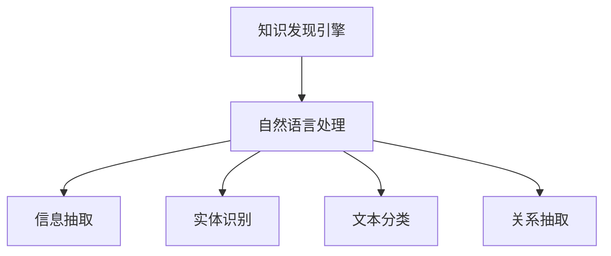

                 

# 知识发现引擎的自然语言处理技术应用

> 关键词：知识发现引擎,自然语言处理,信息抽取,实体识别,文本分类,关系抽取

## 1. 背景介绍

### 1.1 问题由来

在现代信息时代，企业的数据量呈爆炸式增长。如何从海量数据中快速、准确地挖掘出有用的知识，成为企业亟需解决的重要问题。知识发现引擎(Knowledge Discovery Engine, KDE)通过融合人工智能技术，自动从原始数据中抽取和组织知识，帮助决策者快速洞察数据价值。

自然语言处理(Natural Language Processing, NLP)作为KDE的重要技术手段，通过理解和分析文本内容，自动抽取和整合结构化信息。随着深度学习和大规模语料预训练技术的发展，NLP技术在KDE中应用得越来越广泛，逐渐成为知识发现的利器。

本文旨在全面系统地介绍NLP在KDE中的技术应用，涵盖信息抽取、实体识别、文本分类、关系抽取等多个核心技术，以期为KDE开发者提供有价值的指导和参考。

### 1.2 问题核心关键点

NLP在KDE中的应用，主要集中在以下几个核心技术上：

- **信息抽取**：从文本中自动识别和提取结构化信息，如时间、地点、事件等。
- **实体识别**：识别文本中的命名实体，如人名、地名、组织机构名等。
- **文本分类**：将文本按照预定义的类别进行分类，如新闻分类、情感分析等。
- **关系抽取**：从文本中抽取实体间的关系，如人物与事件、地点与时间等。

这些技术能够帮助企业在数据处理、智能推荐、市场分析等多个领域中自动化地获取和利用知识。通过深入理解这些技术的应用原理和实践细节，可以更好地构建知识发现引擎，实现数据价值最大化。

## 2. 核心概念与联系

### 2.1 核心概念概述

为更好地理解NLP在KDE中的应用，本节将介绍几个密切相关的核心概念：

- **知识发现引擎(KDE)**：基于人工智能技术，自动从原始数据中挖掘知识，形成结构化信息库。
- **自然语言处理(NLP)**：通过计算机自动理解、分析和生成人类语言的技术。
- **信息抽取**：从文本中自动识别和提取结构化信息，如时间、地点、事件等。
- **实体识别**：识别文本中的命名实体，如人名、地名、组织机构名等。
- **文本分类**：将文本按照预定义的类别进行分类，如新闻分类、情感分析等。
- **关系抽取**：从文本中抽取实体间的关系，如人物与事件、地点与时间等。

这些核心概念之间的逻辑关系可以通过以下Mermaid流程图来展示：



这个流程图展示了这个主题的各个核心概念及其之间的关系：

1. 知识发现引擎通过自然语言处理技术，从文本中抽取结构化信息。
2. 自然语言处理包括信息抽取、实体识别、文本分类和关系抽取等子任务。
3. 信息抽取、实体识别、文本分类和关系抽取都是自然语言处理的子任务，能够帮助知识发现引擎从文本中获取和组织知识。

这些概念共同构成了知识发现引擎的核心技术体系，使其能够高效地从海量数据中自动化地挖掘和利用知识。

## 3. 核心算法原理 & 具体操作步骤
### 3.1 算法原理概述

知识发现引擎中的NLP技术，主要基于预训练语言模型和微调方法。以下以实体识别为例，详细讲解其核心原理。

### 3.2 算法步骤详解

**Step 1: 数据准备**

实体识别的数据集包括标注好的实体和对应的文本。标注数据可以从开放数据集如CoNLL 2003、OntoNotes等中获取，或自行构建。标注格式通常为(B-PER I-PER B-LOC I-LOC等)，其中B表示实体的起始位置，I表示实体的中间位置。

**Step 2: 模型选择**

选择合适的预训练语言模型作为实体识别的初始化参数。目前主流的预训练模型包括BERT、GPT、XLNet等。这里以BERT为例，通过在预训练模型上进行微调，训练实体识别模型。

**Step 3: 模型微调**

在BERT模型的基础上，使用标注数据进行微调。实体识别通常定义成一个序列标注任务，模型输出每个token是否为实体的标签。微调时使用标准的交叉熵损失函数，通过优化算法(如AdamW)更新模型参数，使得模型输出与真实标签更接近。

**Step 4: 评估与优化**

在微调过程中，周期性地在验证集上评估模型性能，使用精确度、召回率和F1值等指标评估实体识别效果。根据评估结果，调整模型参数和超参数，进一步提升模型性能。

**Step 5: 测试与部署**

在测试集上对微调后的模型进行最终评估，并部署到实际应用场景中，对新数据进行实体识别。

### 3.3 算法优缺点

NLP在KDE中的应用，具有以下优点：

1. **自动化**：可以自动化地从大量文本数据中抽取和整合知识，减轻人工标注和分析的负担。
2. **高效性**：利用预训练语言模型，模型在少量标注数据上的微调可以取得较优效果。
3. **泛化性强**：预训练模型具有广泛的泛化能力，可以适应不同领域和语言的文本数据。
4. **可扩展性强**：知识发现引擎可以根据需要灵活扩展NLP应用，覆盖更多场景和任务。

同时，NLP在KDE中的应用也存在一些局限性：

1. **依赖标注数据**：高质量的标注数据是NLP应用的基础，但获取标注数据往往需要大量人工标注，成本较高。
2. **鲁棒性有限**：预训练模型和微调方法在面对噪声数据、长尾样本时，性能可能有所下降。
3. **可解释性不足**：NLP模型的决策过程缺乏可解释性，难以理解其内部工作机制。
4. **应用场景有限**：尽管NLP技术应用广泛，但在某些领域（如生物医药、金融等）的文本数据可能具有特殊性，NLP应用效果有限。

尽管存在这些局限性，但总体而言，NLP在KDE中的应用前景广阔，其自动化和高效性将大大提升知识发现引擎的能力。

### 3.4 算法应用领域

NLP在知识发现引擎中的应用，覆盖了多个领域，包括但不限于：

1. **市场分析**：通过分析新闻、社交媒体等文本数据，获取市场动态和消费者情感，辅助企业决策。
2. **情报分析**：从大量文献、报告等文本中提取关键信息和关系，快速生成情报摘要。
3. **客户服务**：分析客户反馈、评论等文本，识别客户需求和痛点，提供个性化的服务。
4. **合规监管**：从合规文档、新闻报道等文本中抽取关键信息，辅助企业合规管理。
5. **风险管理**：从金融报告、新闻等文本中识别潜在的风险和机会，辅助风险评估和投资决策。
6. **内容推荐**：分析用户评论、评分等文本数据，推荐用户可能感兴趣的产品或服务。

## 4. 数学模型和公式 & 详细讲解
### 4.1 数学模型构建

实体识别通常被定义为一个序列标注任务，目标是从给定文本中识别出所有实体，并标注每个实体的起始和结束位置。

假设输入文本为 $x=(x_1, x_2, ..., x_n)$，每个token $x_i$ 的标签为 $y_i$，其中 $y_i \in \{B, I, O\}$，分别表示起始、中间和结束位置。

实体识别的目标函数为：

$$
\min_{\theta} \frac{1}{N}\sum_{i=1}^N \ell(M_{\theta}(x_i), y_i)
$$

其中，$M_{\theta}$ 为预训练语言模型，$\ell$ 为交叉熵损失函数。

### 4.2 公式推导过程

以BERT模型为例，实体识别可以看作是在输入序列上执行分类任务。BERT模型输出的每个token $x_i$ 的表示为 $h_i$，通过softmax函数计算其对应的标签概率：

$$
P(y_i|x_i, \theta) = \text{softmax}(W_1 [h_i; h_{i-1}; h_{i+1}] W_2 b)
$$

其中，$h_i$ 为BERT模型在token $x_i$ 上的表示，$W_1$、$W_2$ 为线性投影层，$b$ 为偏置项。

通过最大化上述概率，可以得到最优的标签预测：

$$
\hat{y_i} = \arg\max_y P(y|x_i, \theta)
$$

### 4.3 案例分析与讲解

以下是一个简单的实体识别案例，使用Python和PyTorch实现：

```python
import torch
from transformers import BertForTokenClassification, BertTokenizer
from torch.utils.data import Dataset, DataLoader

class NERDataset(Dataset):
    def __init__(self, texts, tags, tokenizer):
        self.texts = texts
        self.tags = tags
        self.tokenizer = tokenizer
        
    def __len__(self):
        return len(self.texts)
    
    def __getitem__(self, item):
        text = self.texts[item]
        tags = self.tags[item]
        
        encoding = self.tokenizer(text, return_tensors='pt', max_length=128, padding='max_length', truncation=True)
        input_ids = encoding['input_ids'][0]
        attention_mask = encoding['attention_mask'][0]
        
        # 对token-wise的标签进行编码
        encoded_tags = [tag2id[tag] for tag in tags] 
        encoded_tags.extend([tag2id['O']] * (self.max_len - len(encoded_tags)))
        labels = torch.tensor(encoded_tags, dtype=torch.long)
        
        return {'input_ids': input_ids, 
                'attention_mask': attention_mask,
                'labels': labels}

# 标签与id的映射
tag2id = {'B-PER': 1, 'I-PER': 2, 'B-LOC': 3, 'I-LOC': 4, 'O': 0}
id2tag = {v: k for k, v in tag2id.items()}

# 创建dataset
tokenizer = BertTokenizer.from_pretrained('bert-base-cased')

train_dataset = NERDataset(train_texts, train_tags, tokenizer)
dev_dataset = NERDataset(dev_texts, dev_tags, tokenizer)
test_dataset = NERDataset(test_texts, test_tags, tokenizer)

# 定义模型和优化器
model = BertForTokenClassification.from_pretrained('bert-base-cased', num_labels=len(tag2id))

optimizer = AdamW(model.parameters(), lr=2e-5)

# 训练过程
device = torch.device('cuda') if torch.cuda.is_available() else torch.device('cpu')
model.to(device)

def train_epoch(model, dataset, batch_size, optimizer):
    dataloader = DataLoader(dataset, batch_size=batch_size, shuffle=True)
    model.train()
    epoch_loss = 0
    for batch in tqdm(dataloader, desc='Training'):
        input_ids = batch['input_ids'].to(device)
        attention_mask = batch['attention_mask'].to(device)
        labels = batch['labels'].to(device)
        model.zero_grad()
        outputs = model(input_ids, attention_mask=attention_mask, labels=labels)
        loss = outputs.loss
        epoch_loss += loss.item()
        loss.backward()
        optimizer.step()
    return epoch_loss / len(dataloader)

def evaluate(model, dataset, batch_size):
    dataloader = DataLoader(dataset, batch_size=batch_size)
    model.eval()
    preds, labels = [], []
    with torch.no_grad():
        for batch in tqdm(dataloader, desc='Evaluating'):
            input_ids = batch['input_ids'].to(device)
            attention_mask = batch['attention_mask'].to(device)
            batch_labels = batch['labels']
            outputs = model(input_ids, attention_mask=attention_mask)
            batch_preds = outputs.logits.argmax(dim=2).to('cpu').tolist()
            batch_labels = batch_labels.to('cpu').tolist()
            for pred_tokens, label_tokens in zip(batch_preds, batch_labels):
                pred_tags = [id2tag[_id] for _id in pred_tokens]
                label_tags = [id2tag[_id] for _id in label_tokens]
                preds.append(pred_tags[:len(label_tags)])
                labels.append(label_tags)
    print(classification_report(labels, preds))

# 训练流程
epochs = 5
batch_size = 16

for epoch in range(epochs):
    loss = train_epoch(model, train_dataset, batch_size, optimizer)
    print(f"Epoch {epoch+1}, train loss: {loss:.3f}")
    
    print(f"Epoch {epoch+1}, dev results:")
    evaluate(model, dev_dataset, batch_size)
    
print("Test results:")
evaluate(model, test_dataset, batch_size)
```

## 5. 项目实践：代码实例和详细解释说明
### 5.1 开发环境搭建

在进行实体识别实践前，我们需要准备好开发环境。以下是使用Python进行PyTorch开发的环境配置流程：

1. 安装Anaconda：从官网下载并安装Anaconda，用于创建独立的Python环境。

2. 创建并激活虚拟环境：
```bash
conda create -n pytorch-env python=3.8 
conda activate pytorch-env
```

3. 安装PyTorch：根据CUDA版本，从官网获取对应的安装命令。例如：
```bash
conda install pytorch torchvision torchaudio cudatoolkit=11.1 -c pytorch -c conda-forge
```

4. 安装Transformers库：
```bash
pip install transformers
```

5. 安装各类工具包：
```bash
pip install numpy pandas scikit-learn matplotlib tqdm jupyter notebook ipython
```

完成上述步骤后，即可在`pytorch-env`环境中开始实体识别实践。

### 5.2 源代码详细实现

这里我们以实体识别任务为例，给出使用Transformers库对BERT模型进行实体识别的PyTorch代码实现。

首先，定义实体识别任务的数据处理函数：

```python
from transformers import BertTokenizer
from torch.utils.data import Dataset
import torch

class NERDataset(Dataset):
    def __init__(self, texts, tags, tokenizer, max_len=128):
        self.texts = texts
        self.tags = tags
        self.tokenizer = tokenizer
        self.max_len = max_len
        
    def __len__(self):
        return len(self.texts)
    
    def __getitem__(self, item):
        text = self.texts[item]
        tags = self.tags[item]
        
        encoding = self.tokenizer(text, return_tensors='pt', max_length=self.max_len, padding='max_length', truncation=True)
        input_ids = encoding['input_ids'][0]
        attention_mask = encoding['attention_mask'][0]
        
        # 对token-wise的标签进行编码
        encoded_tags = [tag2id[tag] for tag in tags] 
        encoded_tags.extend([tag2id['O']] * (self.max_len - len(encoded_tags)))
        labels = torch.tensor(encoded_tags, dtype=torch.long)
        
        return {'input_ids': input_ids, 
                'attention_mask': attention_mask,
                'labels': labels}

# 标签与id的映射
tag2id = {'B-PER': 1, 'I-PER': 2, 'B-LOC': 3, 'I-LOC': 4, 'O': 0}
id2tag = {v: k for k, v in tag2id.items()}

# 创建dataset
tokenizer = BertTokenizer.from_pretrained('bert-base-cased')

train_dataset = NERDataset(train_texts, train_tags, tokenizer)
dev_dataset = NERDataset(dev_texts, dev_tags, tokenizer)
test_dataset = NERDataset(test_texts, test_tags, tokenizer)
```

然后，定义模型和优化器：

```python
from transformers import BertForTokenClassification, AdamW

model = BertForTokenClassification.from_pretrained('bert-base-cased', num_labels=len(tag2id))

optimizer = AdamW(model.parameters(), lr=2e-5)
```

接着，定义训练和评估函数：

```python
from torch.utils.data import DataLoader
from tqdm import tqdm
from sklearn.metrics import classification_report

device = torch.device('cuda') if torch.cuda.is_available() else torch.device('cpu')
model.to(device)

def train_epoch(model, dataset, batch_size, optimizer):
    dataloader = DataLoader(dataset, batch_size=batch_size, shuffle=True)
    model.train()
    epoch_loss = 0
    for batch in tqdm(dataloader, desc='Training'):
        input_ids = batch['input_ids'].to(device)
        attention_mask = batch['attention_mask'].to(device)
        labels = batch['labels'].to(device)
        model.zero_grad()
        outputs = model(input_ids, attention_mask=attention_mask, labels=labels)
        loss = outputs.loss
        epoch_loss += loss.item()
        loss.backward()
        optimizer.step()
    return epoch_loss / len(dataloader)

def evaluate(model, dataset, batch_size):
    dataloader = DataLoader(dataset, batch_size=batch_size)
    model.eval()
    preds, labels = [], []
    with torch.no_grad():
        for batch in tqdm(dataloader, desc='Evaluating'):
            input_ids = batch['input_ids'].to(device)
            attention_mask = batch['attention_mask'].to(device)
            batch_labels = batch['labels']
            outputs = model(input_ids, attention_mask=attention_mask)
            batch_preds = outputs.logits.argmax(dim=2).to('cpu').tolist()
            batch_labels = batch_labels.to('cpu').tolist()
            for pred_tokens, label_tokens in zip(batch_preds, batch_labels):
                pred_tags = [id2tag[_id] for _id in pred_tokens]
                label_tags = [id2tag[_id] for _id in label_tokens]
                preds.append(pred_tags[:len(label_tags)])
                labels.append(label_tags)
                
    print(classification_report(labels, preds))
```

最后，启动训练流程并在测试集上评估：

```python
epochs = 5
batch_size = 16

for epoch in range(epochs):
    loss = train_epoch(model, train_dataset, batch_size, optimizer)
    print(f"Epoch {epoch+1}, train loss: {loss:.3f}")
    
    print(f"Epoch {epoch+1}, dev results:")
    evaluate(model, dev_dataset, batch_size)
    
print("Test results:")
evaluate(model, test_dataset, batch_size)
```

以上就是使用PyTorch对BERT进行实体识别任务微调的完整代码实现。可以看到，得益于Transformers库的强大封装，我们可以用相对简洁的代码完成BERT模型的加载和微调。

### 5.3 代码解读与分析

让我们再详细解读一下关键代码的实现细节：

**NERDataset类**：
- `__init__`方法：初始化文本、标签、分词器等关键组件。
- `__len__`方法：返回数据集的样本数量。
- `__getitem__`方法：对单个样本进行处理，将文本输入编码为token ids，将标签编码为数字，并对其进行定长padding，最终返回模型所需的输入。

**tag2id和id2tag字典**：
- 定义了标签与数字id之间的映射关系，用于将token-wise的预测结果解码回真实的标签。

**训练和评估函数**：
- 使用PyTorch的DataLoader对数据集进行批次化加载，供模型训练和推理使用。
- 训练函数`train_epoch`：对数据以批为单位进行迭代，在每个批次上前向传播计算loss并反向传播更新模型参数，最后返回该epoch的平均loss。
- 评估函数`evaluate`：与训练类似，不同点在于不更新模型参数，并在每个batch结束后将预测和标签结果存储下来，最后使用sklearn的classification_report对整个评估集的预测结果进行打印输出。

**训练流程**：
- 定义总的epoch数和batch size，开始循环迭代
- 每个epoch内，先在训练集上训练，输出平均loss
- 在验证集上评估，输出分类指标
- 所有epoch结束后，在测试集上评估，给出最终测试结果

可以看到，PyTorch配合Transformers库使得BERT微调的代码实现变得简洁高效。开发者可以将更多精力放在数据处理、模型改进等高层逻辑上，而不必过多关注底层的实现细节。

当然，工业级的系统实现还需考虑更多因素，如模型的保存和部署、超参数的自动搜索、更灵活的任务适配层等。但核心的微调范式基本与此类似。

## 6. 实际应用场景
### 6.1 金融情报分析

金融情报分析是知识发现引擎的重要应用场景之一。通过自然语言处理技术，可以从新闻、报告、公告等文本中抽取关键信息，如企业业绩、市场趋势、政策变化等，辅助金融决策。

以新闻情感分析为例，实体识别可以识别出新闻中的公司名称、事件等关键实体，通过情感分类技术判断新闻的情感倾向，从而辅助分析师快速获取重要信息。例如，在金融危机期间，可以实时监测新闻情感，及时预警风险。

### 6.2 医疗诊断

医疗诊断是大数据应用的重要方向。通过自然语言处理技术，可以自动分析患者病历、临床报告等文本，提取关键信息，辅助医生诊断。

以实体识别为例，可以从病历中自动识别疾病名称、症状、治疗方案等信息，辅助医生快速理解患者病情。例如，在急诊室，医生可以通过病历实体抽取技术快速识别患者的症状，制定治疗方案。

### 6.3 社交媒体分析

社交媒体是实时数据的重要来源。通过自然语言处理技术，可以自动分析社交媒体上的文本内容，提取关键信息，辅助企业了解用户需求和市场趋势。

以实体识别为例，可以从微博、朋友圈等社交媒体中抽取关键词、品牌名等实体，通过情感分类技术分析用户情感，从而指导企业营销策略。例如，在产品发布会后，可以通过情感分析快速了解用户对产品的反馈。

### 6.4 未来应用展望

随着自然语言处理技术的发展，知识发现引擎将在更多领域得到应用，为各行各业带来变革性影响。

在智慧医疗领域，基于实体识别和关系抽取技术的医疗诊断系统，可以帮助医生快速理解患者病历，辅助诊断和治疗。

在智能客服领域，通过实体识别和情感分类技术，可以自动识别用户意图和情感，提供更加个性化的服务。

在智慧城市治理中，通过文本分类和情感分析技术，可以自动监测舆情变化，辅助政府决策。

此外，在企业生产、社会治理、文娱传媒等众多领域，基于自然语言处理技术的知识发现引擎，将进一步推动人工智能技术在垂直行业的落地应用。相信随着技术的日益成熟，自然语言处理技术将在构建智能知识发现引擎中扮演越来越重要的角色。

## 7. 工具和资源推荐
### 7.1 学习资源推荐

为了帮助开发者系统掌握自然语言处理技术的应用，这里推荐一些优质的学习资源：

1. 《自然语言处理综论》书籍：斯坦福大学李飞飞教授所著，全面介绍了自然语言处理的基本概念和经典模型。
2. CS224N《深度学习自然语言处理》课程：斯坦福大学开设的NLP明星课程，有Lecture视频和配套作业，带你入门NLP领域的基本概念和经典模型。
3. 《Deep Learning for Natural Language Processing》书籍：OpenAI联合创始人Ian Goodfellow等著作，全面介绍了深度学习在自然语言处理中的应用。
4. NLTK、spaCy、Gensim等Python自然语言处理库的官方文档，提供了丰富的示例和教程，方便快速上手。

通过对这些资源的学习实践，相信你一定能够快速掌握自然语言处理技术在知识发现引擎中的应用，并用于解决实际的业务问题。

### 7.2 开发工具推荐

高效的开发离不开优秀的工具支持。以下是几款用于自然语言处理开发的常用工具：

1. Python：作为自然语言处理开发的主要语言，Python具有丰富的第三方库和工具，方便快速迭代和实验。
2. PyTorch：基于Python的开源深度学习框架，灵活动态的计算图，适合快速迭代研究。
3. TensorFlow：由Google主导开发的开源深度学习框架，生产部署方便，适合大规模工程应用。
4. NLTK、spaCy、Gensim等Python自然语言处理库，提供了丰富的功能和工具，方便开发过程。
5. Weights & Biases：模型训练的实验跟踪工具，可以记录和可视化模型训练过程中的各项指标，方便对比和调优。
6. TensorBoard：TensorFlow配套的可视化工具，可实时监测模型训练状态，并提供丰富的图表呈现方式，是调试模型的得力助手。

合理利用这些工具，可以显著提升自然语言处理任务的开发效率，加快创新迭代的步伐。

### 7.3 相关论文推荐

自然语言处理技术的发展源于学界的持续研究。以下是几篇奠基性的相关论文，推荐阅读：

1. Attention is All You Need（即Transformer原论文）：提出了Transformer结构，开启了自然语言处理的预训练大模型时代。
2. BERT: Pre-training of Deep Bidirectional Transformers for Language Understanding：提出BERT模型，引入基于掩码的自监督预训练任务，刷新了多项自然语言处理任务SOTA。
3. Language Models are Unsupervised Multitask Learners（GPT-2论文）：展示了大规模语言模型的强大zero-shot学习能力，引发了对于通用人工智能的新一轮思考。
4. Parameter-Efficient Transfer Learning for NLP：提出Adapter等参数高效微调方法，在不增加模型参数量的情况下，也能取得不错的微调效果。
5. Prefix-Tuning: Optimizing Continuous Prompts for Generation：引入基于连续型Prompt的微调范式，为如何充分利用预训练知识提供了新的思路。
6. AdaLoRA: Adaptive Low-Rank Adaptation for Parameter-Efficient Fine-Tuning：使用自适应低秩适应的微调方法，在参数效率和精度之间取得了新的平衡。

这些论文代表了大语言模型微调技术的发展脉络。通过学习这些前沿成果，可以帮助研究者把握学科前进方向，激发更多的创新灵感。

## 8. 总结：未来发展趋势与挑战

### 8.1 总结

本文对知识发现引擎中的自然语言处理技术进行了全面系统的介绍。首先阐述了知识发现引擎和自然语言处理的研究背景和意义，明确了自然语言处理在知识发现中的重要价值。其次，从原理到实践，详细讲解了实体识别的数学模型和关键步骤，给出了自然语言处理任务开发的完整代码实例。同时，本文还广泛探讨了自然语言处理技术在知识发现引擎中的应用场景，展示了自然语言处理技术在多领域落地应用的巨大潜力。

通过本文的系统梳理，可以看到，自然语言处理技术在知识发现引擎中的应用前景广阔，其自动化和高效性将大大提升知识发现引擎的能力。未来，伴随自然语言处理技术的发展和创新，知识发现引擎必将在更广阔的领域中发挥更大的作用，推动人工智能技术在各行各业的应用。

### 8.2 未来发展趋势

展望未来，自然语言处理在知识发现引擎中的应用将呈现以下几个发展趋势：

1. **模型规模持续增大**：随着算力成本的下降和数据规模的扩张，预训练语言模型的参数量还将持续增长。超大规模语言模型蕴含的丰富语言知识，有望支撑更加复杂多变的自然语言处理任务。
2. **任务多样化**：除了实体识别、关系抽取等经典任务，自然语言处理技术还将拓展到情感分析、语义理解、多模态融合等多样化任务。
3. **计算高效化**：自然语言处理任务的计算复杂度较高，如何优化模型结构和计算图，提升推理速度和资源利用率，将成为重要的研究方向。
4. **可解释性增强**：自然语言处理模型的决策过程缺乏可解释性，如何增强模型的可解释性，提高其透明度和可信度，将是一个重要课题。
5. **多领域融合**：自然语言处理技术将在更多领域得到应用，如金融、医疗、社交媒体等，不同领域的知识发现引擎将得到深度整合。
6. **多模态数据融合**：自然语言处理技术将拓展到图像、视频、语音等多模态数据的融合，构建更加全面的知识发现引擎。

以上趋势凸显了自然语言处理技术在知识发现引擎中的应用前景。这些方向的探索发展，必将进一步提升知识发现引擎的能力，推动人工智能技术在各行各业的应用。

### 8.3 面临的挑战

尽管自然语言处理技术在知识发现引擎中的应用前景广阔，但在迈向更加智能化、普适化应用的过程中，它仍面临诸多挑战：

1. **标注数据依赖**：高质量的标注数据是自然语言处理任务的基础，但获取标注数据往往需要大量人工标注，成本较高。如何进一步降低标注数据的需求，将是一大难题。
2. **模型鲁棒性不足**：预训练模型和微调方法在面对噪声数据、长尾样本时，性能可能有所下降。如何提高自然语言处理模型的鲁棒性，避免灾难性遗忘，还需要更多理论和实践的积累。
3. **计算资源消耗大**：自然语言处理任务的计算复杂度较高，如何优化模型结构和计算图，提升推理速度和资源利用率，将是重要的优化方向。
4. **可解释性不足**：自然语言处理模型的决策过程缺乏可解释性，难以理解其内部工作机制。如何赋予自然语言处理模型更强的可解释性，将是亟待攻克的难题。
5. **跨领域适应能力有限**：自然语言处理模型在不同领域的适应性有限，如何构建跨领域适用的知识发现引擎，将是一个重要课题。
6. **知识整合能力不足**：现有的自然语言处理模型往往局限于文本数据，如何更好地整合多模态数据和外部知识，形成更加全面、准确的信息整合能力，还有很大的想象空间。

尽管存在这些挑战，但总体而言，自然语言处理技术在知识发现引擎中的应用前景广阔，其自动化和高效性将大大提升知识发现引擎的能力。

### 8.4 研究展望

面对自然语言处理技术所面临的种种挑战，未来的研究需要在以下几个方面寻求新的突破：

1. **无监督和半监督学习方法**：摆脱对大规模标注数据的依赖，利用自监督学习、主动学习等无监督和半监督范式，最大限度利用非结构化数据，实现更加灵活高效的自然语言处理任务。
2. **参数高效和计算高效的方法**：开发更加参数高效的自然语言处理方法，在固定大部分预训练参数的同时，只更新极少量的任务相关参数。同时优化计算图，减少前向传播和反向传播的资源消耗，实现更加轻量级、实时性的部署。
3. **因果分析和对比学习**：通过引入因果推断和对比学习思想，增强自然语言处理模型的因果关系建立能力，学习更加普适、鲁棒的语言表征，从而提升模型泛化性和抗干扰能力。
4. **融合外部知识**：将符号化的先验知识，如知识图谱、逻辑规则等，与自然语言处理模型进行巧妙融合，引导自然语言处理模型学习更准确、合理的语言模型。同时加强多模态数据的整合，实现视觉、语音等多模态信息与文本信息的协同建模。
5. **模型融合和集成**：自然语言处理技术将在多个领域得到应用，如何更好地将不同领域和任务的知识发现引擎进行融合，形成更加全面、准确的知识发现系统，将是一个重要的研究方向。
6. **多领域适应性**：构建跨领域适用的自然语言处理模型，增强其在不同领域和语言环境下的适应性，提升知识发现引擎的通用性和可靠性。

这些研究方向的探索，必将引领自然语言处理技术在知识发现引擎中走向更高的台阶，为构建安全、可靠、可解释、可控的智能系统铺平道路。面向未来，自然语言处理技术还需要与其他人工智能技术进行更深入的融合，如知识表示、因果推理、强化学习等，多路径协同发力，共同推动自然语言处理技术的进步。只有勇于创新、敢于突破，才能不断拓展自然语言处理技术的边界，让智能技术更好地造福人类社会。

## 9. 附录：常见问题与解答

**Q1：自然语言处理技术在大数据中的应用有哪些？**

A: 自然语言处理技术在大数据中的应用非常广泛，涵盖多个领域：

1. **信息抽取**：从文本中自动识别和提取结构化信息，如时间、地点、事件等。
2. **实体识别**：识别文本中的命名实体，如人名、地名、组织机构名等。
3. **文本分类**：将文本按照预定义的类别进行分类，如新闻分类、情感分析等。
4. **关系抽取**：从文本中抽取实体间的关系，如人物与事件、地点与时间等。
5. **问答系统**：对自然语言问题给出答案，通过问答模型进行推理和生成。
6. **对话系统**：使机器能够与人自然对话，通过对话模型进行回复生成。
7. **机器翻译**：将源语言文本翻译成目标语言，通过机器翻译模型进行翻译。
8. **文本摘要**：将长文本压缩成简短摘要，通过摘要模型进行文本压缩。

这些技术能够帮助企业在数据处理、智能推荐、市场分析等多个领域中自动化地获取和利用知识。

**Q2：自然语言处理技术在知识发现中的应用有哪些？**

A: 自然语言处理技术在知识发现中的应用主要包括以下几个方面：

1. **信息抽取**：从文本中自动识别和提取结构化信息，如时间、地点、事件等。
2. **实体识别**：识别文本中的命名实体，如人名、地名、组织机构名等。
3. **文本分类**：将文本按照预定义的类别进行分类，如新闻分类、情感分析等。
4. **关系抽取**：从文本中抽取实体间的关系，如人物与事件、地点与时间等。
5. **问答系统**：对自然语言问题给出答案，通过问答模型进行推理和生成。
6. **对话系统**：使机器能够与人自然对话，通过对话模型进行回复生成。
7. **机器翻译**：将源语言文本翻译成目标语言，通过机器翻译模型进行翻译。
8. **文本摘要**：将长文本压缩成简短摘要，通过摘要模型进行文本压缩。

这些技术能够帮助企业在数据处理、智能推荐、市场分析等多个领域中自动化地获取和利用知识。

**Q3：自然语言处理技术在知识发现中需要解决哪些问题？**

A: 自然语言处理技术在知识发现中需要解决以下问题：

1. **标注数据获取**：高质量的标注数据是自然语言处理任务的基础，但获取标注数据往往需要大量人工标注，成本较高。
2. **模型鲁棒性**：预训练模型和微调方法在面对噪声数据、长尾样本时，性能可能有所下降。
3. **计算资源消耗**：自然语言处理任务的计算复杂度较高，如何优化模型结构和计算图，提升推理速度和资源利用率，将是重要的优化方向。
4. **可解释性不足**：自然语言处理模型的决策过程缺乏可解释性，难以理解其内部工作机制。
5. **跨领域适应性**：自然语言处理模型在不同领域的适应性有限，如何构建跨领域适用的知识发现引擎，将是一个重要课题。
6. **知识整合能力**：现有的自然语言处理模型往往局限于文本数据，如何更好地整合多模态数据和外部知识，形成更加全面、准确的信息整合能力，还有很大的想象空间。

这些问题的解决，将进一步提升自然语言处理技术在知识发现中的应用效果。

**Q4：自然语言处理技术在知识发现中的应用有哪些挑战？**

A: 自然语言处理技术在知识发现中的应用面临以下挑战：

1. **标注数据依赖**：高质量的标注数据是自然语言处理任务的基础，但获取标注数据往往需要大量人工标注，成本较高。
2. **模型鲁棒性不足**：预训练模型和微调方法在面对噪声数据、长尾样本时，性能可能有所下降。
3. **计算资源消耗大**：自然语言处理任务的计算复杂度较高，如何优化模型结构和计算图，提升推理速度和资源利用率，将是重要的优化方向。
4. **可解释性不足**：自然语言处理模型的决策过程缺乏可解释性，难以理解其内部工作机制。
5. **跨领域适应能力有限**：自然语言处理模型在不同领域的适应性有限，如何构建跨领域适用的知识发现引擎，将是一个重要课题。
6. **知识整合能力不足**：现有的自然语言处理模型往往局限于文本数据，如何更好地整合多模态数据和外部知识，形成更加全面、准确的信息整合能力，还有很大的想象空间。

尽管存在这些挑战，但总体而言，自然语言处理技术在知识发现中的应用前景广阔，其自动化和高效性将大大提升知识发现引擎的能力。

---

作者：禅与计算机程序设计艺术 / Zen and the Art of Computer Programming

