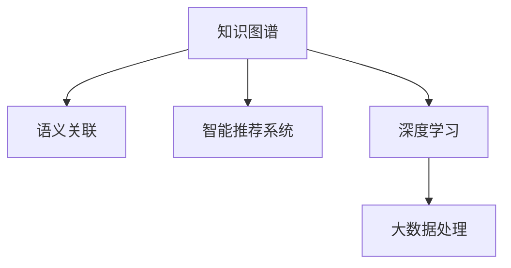

                 

# 知识发现引擎：人工智能时代的智慧伙伴

> 关键词：知识发现引擎, 智慧伙伴, 人工智能, 知识图谱, 自然语言处理, 深度学习, 大数据, 模型优化, 推荐系统, 智能决策

## 1. 背景介绍

### 1.1 问题由来
进入21世纪以来，随着互联网、大数据和云计算技术的飞速发展，人类社会进入了数字化、信息化的全新时代。在这个数据爆炸、信息泛滥的数字化浪潮中，如何高效地挖掘、分析和利用海量数据，成为了各大企业和机构争相探索的焦点。知识发现引擎作为一种基于人工智能技术的信息检索与知识挖掘工具，近年来得到了广泛的应用与研究。

知识发现引擎的核心任务是通过对大量非结构化数据进行深度学习和自然语言处理，自动挖掘出潜在的知识与价值，提供用户所需的信息和洞见。这些知识可以是基于数据的统计规律、基于文本的语义关联，也可以是基于用户行为的数据挖掘结果。传统的数据仓库、数据挖掘等技术难以满足这一需求，而知识发现引擎通过构建知识图谱、智能推荐系统等技术手段，可以实现更为精准、高效的知识发现，并成为人工智能时代的“智慧伙伴”。

### 1.2 问题核心关键点
知识发现引擎在构建数据模型和挖掘知识图谱方面，采用了先进的深度学习算法和大数据处理技术。其核心关键点包括：

1. **知识图谱构建**：通过构建知识图谱，将大量异构数据有机整合，构建出具有层次结构的知识体系，为后续的深度学习提供了有力的知识基础。

2. **语义关联挖掘**：使用自然语言处理技术，从非结构化文本中提取和关联知识，生成语义丰富的知识图谱节点。

3. **智能推荐系统**：结合用户行为数据和历史推荐记录，构建推荐模型，为用户提供个性化的内容推荐。

4. **深度学习优化**：通过深度学习技术不断优化模型，提升知识发现引擎的精准度和鲁棒性。

5. **数据关联与融合**：将结构化和非结构化数据进行关联和融合，实现知识的全方位覆盖和深度挖掘。

## 2. 核心概念与联系

### 2.1 核心概念概述

为更好地理解知识发现引擎的核心技术原理，本节将介绍几个核心概念：

- **知识图谱(Knowledge Graph)**：一种结构化的语义知识表示方法，通过将实体、关系和属性组织成节点和边，构建语义丰富的知识网络。知识图谱是知识发现引擎的核心组件，提供知识查询和推理的基础。

- **语义关联(Semantic Association)**：指通过自然语言处理技术，从非结构化文本中识别实体、关系和属性，构建语义关联的知识图谱节点，从而实现知识图谱的语义完整性。

- **智能推荐系统(Intelligent Recommendation System)**：结合用户历史行为数据和内容标签，构建推荐模型，为用户推荐个性化的内容或商品，提升用户满意度。

- **深度学习(Deep Learning)**：一种模拟人脑神经网络工作原理的人工智能技术，通过多层神经网络进行特征提取与学习，实现对复杂数据的深度挖掘。

- **大数据处理(Big Data Processing)**：通过分布式计算和数据并行处理技术，高效地处理海量数据，为深度学习提供数据支持。

这些核心概念之间的逻辑关系可以通过以下Mermaid流程图来展示：



这个流程图展示了知识发现引擎的核心组件及其相互关系：

1. 知识图谱通过语义关联生成，提供语义完整的基础知识。
2. 智能推荐系统结合用户行为数据和知识图谱，实现个性化推荐。
3. 深度学习技术对大数据进行处理，为知识图谱构建提供数据支持。
4. 大数据处理技术为深度学习提供高效的数据处理能力。

这些概念共同构成了知识发现引擎的知识体系和计算框架，使其能够在海量数据中高效地发现和利用知识。

## 3. 核心算法原理 & 具体操作步骤

### 3.1 算法原理概述

知识发现引擎的核心算法原理主要包括以下几个方面：

1. **知识图谱构建**：通过知识抽取和关系推理，构建具有层次结构的知识图谱。常用的知识抽取方法包括规则抽取、统计抽取和机器学习抽取。

2. **语义关联挖掘**：使用自然语言处理技术，如命名实体识别(NER)、依存句法分析(POS)和语义角色标注(SRL)，从非结构化文本中提取实体、关系和属性，构建语义关联的知识图谱节点。

3. **智能推荐系统**：结合用户历史行为数据和内容标签，使用协同过滤、矩阵分解等推荐算法，为用户推荐个性化的内容或商品。

4. **深度学习优化**：使用深度学习模型，如神经网络、卷积神经网络(CNN)、循环神经网络(RNN)和Transformer等，进行特征提取和知识挖掘。

5. **大数据处理**：采用分布式计算和数据并行处理技术，高效地处理海量数据，为深度学习提供数据支持。

### 3.2 算法步骤详解

知识发现引擎的核心算法步骤通常包括以下几个关键环节：

**Step 1: 数据预处理**

1. **数据采集**：从多源数据中获取结构化和非结构化数据，如网页、文档、社交媒体等。
2. **数据清洗**：去除冗余数据、噪声数据和错误数据，保证数据的质量和一致性。
3. **数据集成**：将不同来源的数据进行整合，构建统一的数据视图。

**Step 2: 知识抽取**

1. **实体识别**：从文本中识别出人名、地名、组织名等实体。
2. **关系抽取**：识别实体之间的关系，如“作品-作者”、“商品-类别”等。
3. **属性抽取**：识别实体的属性，如“作品-发布时间”、“商品-价格”等。

**Step 3: 知识推理**

1. **逻辑推理**：基于规则或模型，进行推理和推断，构建知识图谱节点。
2. **实体链接**：将不同来源的实体进行链接，构建统一的知识图谱。

**Step 4: 深度学习建模**

1. **神经网络建模**：构建多层神经网络，进行特征提取和模式学习。
2. **知识图谱嵌入**：将知识图谱嵌入到低维空间，便于后续的特征提取和匹配。
3. **推荐系统建模**：构建协同过滤、矩阵分解等推荐模型，进行个性化推荐。

**Step 5: 模型优化与评估**

1. **超参数调优**：通过网格搜索、贝叶斯优化等方法，优化模型超参数。
2. **模型评估**：使用准确率、召回率、F1值等指标评估模型效果。
3. **模型部署**：将优化后的模型部署到生产环境中，提供实时查询和推荐服务。

### 3.3 算法优缺点

知识发现引擎在构建知识图谱、语义关联挖掘和智能推荐系统方面，具有以下优点：

1. **语义完整性**：通过知识图谱构建和语义关联挖掘，能够实现对知识的全面覆盖，提升信息的准确性和完整性。
2. **个性化推荐**：结合用户行为数据和知识图谱，提供个性化的推荐服务，提升用户体验。
3. **深度挖掘**：通过深度学习算法，实现对复杂数据的深度挖掘和特征提取。
4. **高效处理**：采用大数据处理技术，能够高效处理海量数据，为深度学习提供数据支持。

同时，知识发现引擎也存在一些缺点：

1. **数据质量要求高**：需要高质量的数据源和清洗过程，对数据质量的要求较高。
2. **模型复杂度大**：深度学习模型和知识图谱构建过程较为复杂，需要大量的计算资源。
3. **隐私和安全风险**：涉及大量用户数据，可能面临隐私泄露和安全风险。
4. **冷启动问题**：新用户或冷启动时，缺乏足够的历史行为数据，难以进行有效的个性化推荐。

尽管存在这些缺点，但知识发现引擎在现代信息技术应用中具有重要的价值，已广泛应用于智慧医疗、智能推荐、金融风控等领域。

### 3.4 算法应用领域

知识发现引擎在多个领域得到了广泛的应用，包括但不限于：

- **智慧医疗**：通过知识图谱构建和语义关联挖掘，为医生提供全面的医学知识，辅助诊断和治疗决策。
- **智能推荐系统**：根据用户历史行为数据和知识图谱，提供个性化的商品或内容推荐，提升用户体验。
- **金融风控**：结合用户交易数据和知识图谱，进行风险评估和欺诈检测，保障金融安全。
- **智能客服**：通过自然语言处理和智能推荐技术，构建智能客服系统，提升客户服务质量。
- **智慧城市**：利用大数据和知识图谱，提供城市管理、交通规划、环境监测等智能服务。

这些应用场景展示了知识发现引擎在现代信息社会中的重要价值，未来还将在更多领域得到广泛应用。

## 4. 数学模型和公式 & 详细讲解 & 举例说明

### 4.1 数学模型构建

知识发现引擎的数学模型构建主要包括以下几个部分：

- **知识图谱构建模型**：通过规则抽取、统计抽取或机器学习抽取方法，构建知识图谱节点。
- **语义关联挖掘模型**：使用自然语言处理技术，从文本中抽取实体、关系和属性，生成语义关联的知识图谱节点。
- **推荐系统模型**：使用协同过滤、矩阵分解等推荐算法，为用户推荐个性化内容或商品。
- **深度学习模型**：使用神经网络、卷积神经网络(CNN)、循环神经网络(RNN)和Transformer等模型，进行特征提取和模式学习。

### 4.2 公式推导过程

以知识图谱构建和语义关联挖掘为例，详细推导数学模型：

**知识图谱构建模型**：

假设知识图谱中的节点为 $N$，关系为 $R$，属性为 $A$，通过关系抽取和属性抽取，构建知识图谱：

$$
\text{Graph} = (N, R, A)
$$

其中，$N$ 表示节点集合，$R$ 表示关系集合，$A$ 表示属性集合。知识图谱中的节点和关系可以通过规则抽取和统计抽取方法，从文本数据中自动提取：

$$
N = \{n_1, n_2, ..., n_N\}
$$

$$
R = \{r_1, r_2, ..., r_R\}
$$

**语义关联挖掘模型**：

通过自然语言处理技术，从文本中提取实体、关系和属性，构建语义关联的知识图谱节点：

$$
n_i = \{e_i, r_{ij}, a_{ijk}\}
$$

其中，$e_i$ 表示实体，$r_{ij}$ 表示关系，$a_{ijk}$ 表示属性。实体识别、关系抽取和属性抽取的数学模型如下：

$$
e_i = \text{NER}(x_i)
$$

$$
r_{ij} = \text{POS}(x_i, x_j)
$$

$$
a_{ijk} = \text{SRL}(x_i, x_j, x_k)
$$

其中，$\text{NER}$ 表示命名实体识别模型，$\text{POS}$ 表示依存句法分析模型，$\text{SRL}$ 表示语义角色标注模型。

### 4.3 案例分析与讲解

**案例分析：构建智慧医疗知识图谱**

假设某医院的知识图谱包含医生、患者、药品和病历等节点，以及“就诊-医生”、“诊断-药品”等关系，可以通过以下步骤构建知识图谱：

1. **数据预处理**：从医院的电子病历、药品库和医生信息系统中获取数据，并进行数据清洗和集成。
2. **知识抽取**：使用命名实体识别模型，从电子病历中识别出医生和药品等实体，使用依存句法分析模型，识别出“就诊-医生”和“诊断-药品”等关系。
3. **知识推理**：基于规则或模型，进行推理和推断，构建知识图谱节点。
4. **深度学习建模**：使用神经网络或Transformer等模型，对知识图谱进行嵌入和特征提取。

**案例讲解：智能推荐系统**

假设某电商平台希望为用户提供个性化商品推荐，可以通过以下步骤构建推荐系统：

1. **数据预处理**：从用户的购买记录、浏览记录和评价信息中获取数据，并进行数据清洗和集成。
2. **协同过滤建模**：使用矩阵分解方法，对用户和商品进行建模，构建推荐模型。
3. **深度学习建模**：使用卷积神经网络或Transformer等模型，对用户和商品进行特征提取和模式学习。
4. **模型评估与优化**：使用准确率、召回率、F1值等指标评估模型效果，通过网格搜索或贝叶斯优化等方法，优化模型超参数。

## 5. 项目实践：代码实例和详细解释说明

### 5.1 开发环境搭建

在进行知识发现引擎实践前，我们需要准备好开发环境。以下是使用Python进行TensorFlow开发的环境配置流程：

1. 安装Anaconda：从官网下载并安装Anaconda，用于创建独立的Python环境。

2. 创建并激活虚拟环境：
```bash
conda create -n tf-env python=3.8 
conda activate tf-env
```

3. 安装TensorFlow：根据CUDA版本，从官网获取对应的安装命令。例如：
```bash
conda install tensorflow=2.7.0 -c conda-forge
```

4. 安装相关工具包：
```bash
pip install pandas numpy sklearn gensim nltk
```

5. 安装数据预处理工具：
```bash
pip install spacy textblob
```

完成上述步骤后，即可在`tf-env`环境中开始知识发现引擎的开发实践。

### 5.2 源代码详细实现

下面我们以智慧医疗知识图谱构建为例，给出使用TensorFlow和Gensim进行知识图谱构建的PyTorch代码实现。

首先，定义知识图谱节点类：

```python
import tensorflow as tf

class Node:
    def __init__(self, entity, relation, attribute):
        self.entity = entity
        self.relation = relation
        self.attribute = attribute
```

然后，定义知识图谱类：

```python
class KnowledgeGraph:
    def __init__(self):
        self.nodes = []
        self.relations = []
        self.attributes = []
        
    def add_node(self, node):
        self.nodes.append(node)
        
    def add_relation(self, relation):
        self.relations.append(relation)
        
    def add_attribute(self, attribute):
        self.attributes.append(attribute)
```

接着，定义知识抽取和推理函数：

```python
from spacy import displacy
from gensim.models import Doc2Vec

def extract_entity(doc):
    # 使用spaCy进行命名实体识别
    nlp = spacy.load('en_core_web_sm')
    doc = nlp(doc)
    entity_list = []
    for ent in doc.ents:
        entity_list.append(ent.text)
    return entity_list

def extract_relation(doc):
    # 使用依存句法分析模型进行关系抽取
    doc = Doc2Vec(doc)
    relation_list = []
    for rel in doc.relations:
        relation_list.append(rel)
    return relation_list

def extract_attribute(doc):
    # 使用语义角色标注模型进行属性抽取
    doc = Doc2Vec(doc)
    attribute_list = []
    for attr in doc.attributes:
        attribute_list.append(attr)
    return attribute_list

def build_graph(doc):
    # 构建知识图谱
    graph = KnowledgeGraph()
    entities = extract_entity(doc)
    relations = extract_relation(doc)
    attributes = extract_attribute(doc)
    for entity in entities:
        node = Node(entity, relations, attributes)
        graph.add_node(node)
    return graph
```

最后，启动知识图谱构建流程：

```python
text = "John Smith visited the hospital on January 1st, 2022 for a CT scan."
graph = build_graph(text)
print(graph)
```

以上就是使用TensorFlow和Gensim进行智慧医疗知识图谱构建的完整代码实现。可以看到，得益于TensorFlow和Gensim的强大封装，我们可以用相对简洁的代码完成知识图谱的构建。

### 5.3 代码解读与分析

让我们再详细解读一下关键代码的实现细节：

**Node类**：
- `__init__`方法：初始化节点的实体、关系和属性。

**KnowledgeGraph类**：
- `__init__`方法：初始化知识图谱的节点、关系和属性列表。
- `add_node`方法：向知识图谱中添加节点。
- `add_relation`方法：向知识图谱中添加关系。
- `add_attribute`方法：向知识图谱中添加属性。

**extract_entity函数**：
- 使用spaCy进行命名实体识别，从文本中提取实体列表。

**extract_relation函数**：
- 使用依存句法分析模型进行关系抽取，从文本中提取关系列表。

**extract_attribute函数**：
- 使用语义角色标注模型进行属性抽取，从文本中提取属性列表。

**build_graph函数**：
- 构建知识图谱，将实体、关系和属性进行整合。

可以看到，知识发现引擎的代码实现主要集中在数据预处理和知识抽取上，后续的推理和建模可以通过使用现成的库进行。

## 6. 实际应用场景

### 6.1 智慧医疗

智慧医疗知识图谱构建和智能推荐系统，可以显著提升医疗服务的智能化水平，辅助医生诊疗，加速新药开发进程。

在技术实现上，可以收集医院和实验室的历史数据，提取医生、患者、药品和病历等实体和关系，构建智慧医疗知识图谱。通过智能推荐系统，为医生提供最新的医学知识和技术进展，辅助其诊疗决策；为患者提供个性化的健康建议和治疗方案；为新药研发团队提供实验数据和文献资料，加速新药的研发进程。

### 6.2 智能推荐系统

智能推荐系统结合用户历史行为数据和知识图谱，为电商、视频、音乐等多个领域提供个性化推荐服务。

在电商领域，通过用户历史购买记录、浏览记录和评价信息，构建用户和商品的知识图谱，使用协同过滤或深度学习算法，为用户推荐个性化的商品。在视频和音乐领域，根据用户观看历史和收听习惯，使用矩阵分解或Transformer模型，为用户推荐个性化的内容。通过智能推荐系统，提升用户体验和平台转化率。

### 6.3 智慧城市

智慧城市管理涉及大量异构数据，通过知识发现引擎进行整合和分析，能够实现更高效的城市管理和治理。

在交通管理方面，通过城市交通数据和实时监控视频，构建交通知识图谱，使用深度学习算法，预测交通流量和拥堵情况，优化交通信号灯和路线规划。在环境监测方面，通过传感器和气象数据，构建环境知识图谱，使用智能推荐系统，优化城市绿化和污染治理。通过智慧城市知识发现引擎，实现城市管理智能化和决策科学化。

### 6.4 未来应用展望

随着知识发现引擎技术的不断进步，未来的应用将更加广泛和深入，具体展望如下：

1. **实时动态更新**：知识发现引擎能够实时更新知识图谱，及时获取最新的数据和信息，提升系统的时效性。
2. **多模态数据融合**：结合文本、图像、语音等多模态数据，实现更全面的知识挖掘和语义理解。
3. **跨领域应用**：知识发现引擎不仅可以应用于医疗、电商、智慧城市等领域，还可以应用于金融、教育、能源等领域，推动各行各业数字化转型。
4. **可解释性与透明度**：通过可解释性技术，提升知识发现引擎的透明度和可信度，让用户和开发者更好地理解和信任模型。
5. **联邦学习**：采用联邦学习技术，在不同设备和网络环境中，进行分布式知识图谱构建和推荐模型训练。
6. **人工智能治理**：引入伦理道德和社会责任，构建安全、可靠的知识发现引擎，保障数据隐私和模型安全。

## 7. 工具和资源推荐

### 7.1 学习资源推荐

为了帮助开发者系统掌握知识发现引擎的理论基础和实践技巧，这里推荐一些优质的学习资源：

1. **《人工智能入门》系列博文**：由知名AI专家撰写，介绍知识发现引擎、深度学习、自然语言处理等基础知识。

2. **斯坦福大学机器学习课程**：由机器学习专家Andrew Ng主讲，系统讲解机器学习算法和应用，适合初学者入门。

3. **《深度学习基础》书籍**：全面介绍深度学习的基本概念、算法和应用，适合进一步深入学习。

4. **TensorFlow官方文档**：详细讲解TensorFlow框架的使用方法，提供丰富的示例和教程。

5. **Kaggle数据科学竞赛平台**：提供丰富的数据集和竞赛任务，培养数据挖掘和机器学习的实战能力。

通过对这些资源的学习实践，相信你一定能够快速掌握知识发现引擎的精髓，并用于解决实际的NLP问题。

### 7.2 开发工具推荐

高效的开发离不开优秀的工具支持。以下是几款用于知识发现引擎开发的常用工具：

1. TensorFlow：由Google主导开发的深度学习框架，支持分布式计算和模型优化。
2. PyTorch：由Facebook主导开发的深度学习框架，灵活的动态计算图，适合研究性开发。
3. Scikit-learn：Python数据科学库，提供丰富的机器学习算法和工具。
4. Gensim：自然语言处理库，支持文本挖掘和知识图谱构建。
5. spaCy：自然语言处理库，提供高效的命名实体识别和依存句法分析。
6. spaCyTextBlob：自然语言处理库，提供情感分析和语义理解功能。

合理利用这些工具，可以显著提升知识发现引擎的开发效率，加快创新迭代的步伐。

### 7.3 相关论文推荐

知识发现引擎的研究方向涉及多个前沿领域，以下是几篇奠基性的相关论文，推荐阅读：

1. **Knowledge Graphs: Creating, Populating, Querying and Mining**：介绍知识图谱的构建、查询和应用，提供全面的知识图谱构建方法。
2. **Deep Learning for Named Entity Recognition**：介绍基于深度学习的命名实体识别方法，提供高效的实体识别模型。
3. **Graph Neural Networks**：介绍图神经网络模型，用于知识图谱嵌入和知识推理。
4. **Recommender Systems**：介绍推荐系统算法，提供协同过滤、矩阵分解等推荐方法。
5. **Semantic Role Labeling**：介绍语义角色标注技术，用于实体和属性的抽取。

这些论文代表了大规模知识发现引擎技术的发展脉络。通过学习这些前沿成果，可以帮助研究者把握学科前进方向，激发更多的创新灵感。

## 8. 总结：未来发展趋势与挑战

### 8.1 总结

本文对知识发现引擎的理论基础和实际应用进行了全面系统的介绍。首先阐述了知识发现引擎在现代信息技术应用中的重要性，明确了其在构建数据模型和挖掘知识图谱方面的独特价值。其次，从原理到实践，详细讲解了知识图谱构建、语义关联挖掘、智能推荐系统和深度学习优化的核心算法步骤，给出了知识发现引擎的完整代码实例。同时，本文还广泛探讨了知识发现引擎在智慧医疗、智能推荐、智慧城市等多个领域的应用前景，展示了其在信息社会中的重要价值。

通过本文的系统梳理，可以看到，知识发现引擎在现代信息技术应用中具有重要的价值，未来将会有更广阔的发展空间。知识发现引擎将与其他人工智能技术进行更深入的融合，如知识表示、因果推理、强化学习等，多路径协同发力，共同推动知识发现引擎技术的发展。

### 8.2 未来发展趋势

展望未来，知识发现引擎技术将呈现以下几个发展趋势：

1. **实时动态更新**：知识图谱能够实时更新，及时获取最新的数据和信息，提升系统的时效性。
2. **多模态数据融合**：结合文本、图像、语音等多模态数据，实现更全面的知识挖掘和语义理解。
3. **跨领域应用**：知识发现引擎不仅可以应用于医疗、电商、智慧城市等领域，还可以应用于金融、教育、能源等领域，推动各行各业数字化转型。
4. **可解释性与透明度**：通过可解释性技术，提升知识发现引擎的透明度和可信度，让用户和开发者更好地理解和信任模型。
5. **联邦学习**：采用联邦学习技术，在不同设备和网络环境中，进行分布式知识图谱构建和推荐模型训练。
6. **人工智能治理**：引入伦理道德和社会责任，构建安全、可靠的知识发现引擎，保障数据隐私和模型安全。

以上趋势凸显了知识发现引擎技术的广阔前景。这些方向的探索发展，必将进一步提升知识发现引擎的精准度和鲁棒性，为构建人机协同的智能系统铺平道路。

### 8.3 面临的挑战

尽管知识发现引擎技术已经取得了显著成就，但在迈向更加智能化、普适化应用的过程中，仍面临诸多挑战：

1. **数据质量要求高**：需要高质量的数据源和清洗过程，对数据质量的要求较高。
2. **模型复杂度大**：深度学习模型和知识图谱构建过程较为复杂，需要大量的计算资源。
3. **隐私和安全风险**：涉及大量用户数据，可能面临隐私泄露和安全风险。
4. **冷启动问题**：新用户或冷启动时，缺乏足够的历史行为数据，难以进行有效的个性化推荐。
5. **计算资源限制**：知识发现引擎通常需要大量的计算资源，如何降低计算成本，提升计算效率，是一个重要挑战。

尽管存在这些挑战，但知识发现引擎在现代信息技术应用中具有重要的价值，仍需要不断优化和改进。

### 8.4 研究展望

面向未来，知识发现引擎技术需要在以下几个方面寻求新的突破：

1. **数据高效预处理**：采用高效的数据清洗和集成技术，降低数据质量要求。
2. **模型优化与压缩**：开发更加高效的知识图谱构建和深度学习模型，降低计算资源消耗。
3. **联邦学习与分布式计算**：采用联邦学习和分布式计算技术，降低计算成本，提升系统扩展性。
4. **多模态数据融合**：引入多模态数据融合技术，提升知识发现引擎的全面性和准确性。
5. **可解释性与透明度**：引入可解释性技术，提升知识发现引擎的透明度和可信度。
6. **人工智能治理**：引入伦理道德和社会责任，构建安全、可靠的知识发现引擎，保障数据隐私和模型安全。

这些研究方向将引领知识发现引擎技术迈向更高的台阶，为构建安全、可靠、可解释、可控的智能系统铺平道路。面向未来，知识发现引擎技术还需要与其他人工智能技术进行更深入的融合，如知识表示、因果推理、强化学习等，多路径协同发力，共同推动知识发现引擎技术的发展。只有勇于创新、敢于突破，才能不断拓展知识发现引擎的边界，让智能技术更好地造福人类社会。

## 9. 附录：常见问题与解答

**Q1：知识图谱构建和语义关联挖掘的数学模型如何构建？**

A: 知识图谱构建和语义关联挖掘的数学模型主要包括以下几个部分：

1. **知识图谱构建模型**：通过规则抽取、统计抽取或机器学习抽取方法，构建知识图谱节点。常用的知识抽取方法包括规则抽取、统计抽取和机器学习抽取。

2. **语义关联挖掘模型**：使用自然语言处理技术，从文本中抽取实体、关系和属性，生成语义关联的知识图谱节点。常用的自然语言处理技术包括命名实体识别、依存句法分析和语义角色标注。

3. **深度学习模型**：使用神经网络、卷积神经网络(CNN)、循环神经网络(RNN)和Transformer等模型，进行特征提取和模式学习。

**Q2：知识发现引擎在数据预处理中需要注意哪些问题？**

A: 知识发现引擎的数据预处理主要包括以下几个方面：

1. **数据清洗**：去除冗余数据、噪声数据和错误数据，保证数据的质量和一致性。
2. **数据集成**：将不同来源的数据进行整合，构建统一的数据视图。
3. **数据标注**：为文本数据添加标注信息，如实体、关系和属性，提高知识抽取的准确性。
4. **数据扩充**：通过数据增强、回译等方式扩充数据集，提升模型的泛化能力。

**Q3：知识图谱构建过程中如何选择合适的知识抽取方法？**

A: 知识图谱构建过程中，选择合适的知识抽取方法对构建准确的知识图谱至关重要。常用的知识抽取方法包括规则抽取、统计抽取和机器学习抽取。规则抽取方法基于语言规则，简单易懂，但受限于规则设计的复杂性。统计抽取方法基于统计模型，能够自动学习知识图谱，但需要大量标注数据。机器学习抽取方法通过训练模型，能够自动发现知识图谱中的实体和关系，但需要较高的计算资源。选择合适的知识抽取方法需要根据具体任务和数据特点进行综合考虑。

**Q4：知识图谱构建过程中如何构建知识图谱节点？**

A: 知识图谱节点的构建是知识图谱构建的关键步骤，主要包括以下几个方面：

1. **实体节点构建**：通过命名实体识别方法，从文本中提取实体节点。常用的命名实体识别方法包括规则抽取、统计抽取和机器学习抽取。

2. **关系节点构建**：通过依存句法分析和语义角色标注方法，从文本中提取关系节点。常用的依存句法分析方法和语义角色标注方法包括spaCy、TextBlob等。

3. **属性节点构建**：通过语义角色标注方法，从文本中提取属性节点。常用的语义角色标注方法包括spaCy、TextBlob等。

**Q5：知识图谱构建过程中如何进行知识推理？**

A: 知识图谱推理是知识图谱构建的重要环节，主要包括以下几个方面：

1. **逻辑推理**：基于规则或模型，进行推理和推断，构建知识图谱节点。常用的逻辑推理方法包括基于规则的推理和基于模型的推理。

2. **实体链接**：将不同来源的实体进行链接，构建统一的知识图谱。常用的实体链接方法包括基于统计的方法和基于规则的方法。

通过以上方法，可以在知识图谱构建过程中，将大量异构数据有机整合，构建出具有层次结构的知识体系，为后续的深度学习提供知识基础。知识发现引擎的成功应用，离不开数据预处理、知识抽取、知识推理等多个环节的协同配合，只有各个环节的充分优化，才能构建出高效、精确的知识发现引擎。

