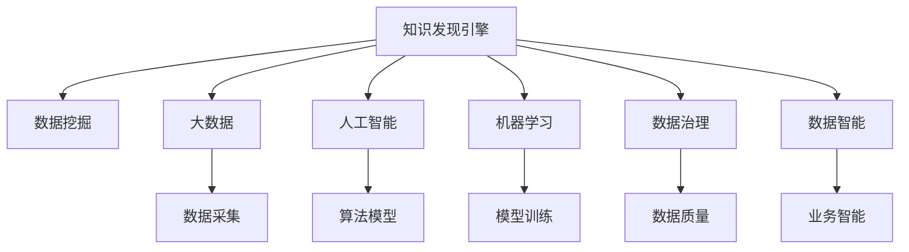

                 

# 知识发现引擎：开启知识创新新纪元

> 关键词：知识发现引擎, 数据挖掘, 大数据, 人工智能, 机器学习, 数据治理, 数据智能

## 1. 背景介绍

### 1.1 问题由来
在现代社会，数据已经成为最为重要的资产之一。无论是企业内部还是外部，每天都在产生海量数据。如何从这些数据中挖掘出有用的知识，成为企业和组织最迫切的需求。传统的知识发现方式依赖于人工归纳和统计分析，效率低下且容易产生偏差。因此，借助计算机技术，自动地从大数据中发现知识，即数据挖掘(Data Mining)技术应运而生。

数据挖掘是通过自动化算法，从大数据中提取出有价值的信息和知识。其广泛应用于市场营销、金融风险管理、社交网络分析、医疗健康等多个领域。在企业内部，数据挖掘可以帮助企业优化产品设计、提升运营效率、降低成本；在外部，数据挖掘可以揭示行业发展趋势、识别风险预警、指导决策制定。因此，数据挖掘在企业数据资产管理和业务决策中扮演着至关重要的角色。

### 1.2 问题核心关键点
数据挖掘的核心在于如何将结构化、半结构化、非结构化数据转化为有用知识，实现业务智能(Business Intelligence)。通过数据挖掘，可以从海量数据中挖掘出关联规则、聚类、分类、预测等有价值的知识，从而辅助业务决策。

数据挖掘一般包括以下几个关键环节：
1. **数据预处理**：清洗、转换、集成数据，消除数据缺失和异常。
2. **特征选择和提取**：从原始数据中提取和筛选出最具代表性和区分度的特征。
3. **模型选择和训练**：根据问题类型选择合适的算法和模型，并通过训练获得最优参数。
4. **模型评估和优化**：使用验证集和测试集评估模型性能，并通过调参和优化提升模型效果。
5. **知识发现与应用**：将模型应用到实际业务场景，提取和应用有价值的知识。

数据挖掘技术包括但不限于：
- **分类算法**：如决策树、随机森林、支持向量机等，用于识别和划分不同类别。
- **聚类算法**：如K-means、层次聚类、DBSCAN等，用于发现数据点之间的相似性。
- **关联规则挖掘**：如Apriori、FP-growth等，用于发现不同属性之间的关联关系。
- **预测算法**：如线性回归、逻辑回归、神经网络等，用于预测未来趋势。

尽管数据挖掘技术已经较为成熟，但在实际应用中，仍面临诸多挑战。如何自动化地处理复杂数据、如何选择合适的模型、如何保证模型鲁棒性等，仍是数据挖掘领域的重要研究方向。

## 2. 核心概念与联系

### 2.1 核心概念概述

为更好地理解知识发现引擎，本节将介绍几个密切相关的核心概念：

- **知识发现引擎(Knowledge Discovery Engine, KDE)**：指使用数据挖掘技术，自动从大数据中发现有用知识的软件系统。通过自动化算法和模型训练，实现数据的自动分析和知识发现。
- **数据挖掘(Data Mining)**：指使用自动化算法和模型，从大数据中提取有用知识和信息的过程。是知识发现的重要手段之一。
- **大数据(Big Data)**：指存储容量、处理速度、多样性远超传统关系数据库的数据集合。通常指TB级或PB级的数据。
- **人工智能(Artificial Intelligence, AI)**：指模拟人类智能的计算机技术，包括机器学习、自然语言处理、计算机视觉等方向。
- **机器学习(Machine Learning, ML)**：指让机器自动从数据中学习知识，并通过不断优化算法提升模型效果的过程。
- **数据治理(Data Governance)**：指管理和控制数据资产的策略和技术，确保数据的质量、安全和合规性。
- **数据智能(Data Intelligence)**：指将大数据、人工智能和数据治理技术整合，实现数据驱动的业务智能。

这些核心概念之间的逻辑关系可以通过以下Mermaid流程图来展示：



这个流程图展示的知识发现引擎的核心概念及其之间的关系：

1. 知识发现引擎通过数据挖掘从大数据中提取有用知识。
2. 大数据是知识发现引擎的输入数据。
3. 人工智能提供了知识发现引擎的技术支撑，包括算法模型和模型训练。
4. 机器学习是人工智能的一个分支，使用自动化算法提升模型效果。
5. 数据治理确保数据质量和安全，为知识发现引擎提供基础保障。
6. 数据智能将大数据、人工智能和数据治理技术整合，实现业务智能。

这些概念共同构成了知识发现引擎的理论基础和实践框架，使其能够在各种场景下实现自动化的知识发现和业务智能。

## 3. 核心算法原理 & 具体操作步骤
### 3.1 算法原理概述

知识发现引擎的核心算法原理基于数据挖掘和机器学习技术。其核心思想是：使用自动化算法和模型，从大数据中自动提取和发现有用知识。

知识发现引擎一般包括以下几个关键步骤：

1. **数据预处理**：清洗、转换、集成数据，消除数据缺失和异常。
2. **特征选择和提取**：从原始数据中提取和筛选出最具代表性和区分度的特征。
3. **模型选择和训练**：根据问题类型选择合适的算法和模型，并通过训练获得最优参数。
4. **模型评估和优化**：使用验证集和测试集评估模型性能，并通过调参和优化提升模型效果。
5. **知识发现与应用**：将模型应用到实际业务场景，提取和应用有价值的知识。

### 3.2 算法步骤详解

以分类问题为例，详细讲解知识发现引擎的工作流程。

**Step 1: 数据预处理**
- 收集数据，并进行清洗、去除缺失值、处理异常值。
- 将数据转换成一致的格式，便于后续分析。

**Step 2: 特征选择和提取**
- 使用特征选择算法，挑选出最具代表性和区分度的特征。
- 使用特征提取算法，将原始数据转换成低维特征表示。

**Step 3: 模型选择和训练**
- 根据问题类型，选择合适的分类算法，如决策树、随机森林、支持向量机等。
- 使用训练集对模型进行训练，获得最优参数。

**Step 4: 模型评估和优化**
- 使用验证集对模型进行评估，计算准确率、召回率、F1值等指标。
- 通过调参和优化，进一步提升模型效果。

**Step 5: 知识发现与应用**
- 使用测试集对模型进行最终评估。
- 将模型应用到实际业务场景，提取和应用有价值的知识。

### 3.3 算法优缺点

知识发现引擎的优点在于：
1. 自动化处理数据：知识发现引擎可以自动化处理海量数据，减轻人工负担。
2. 高效发现知识：使用自动化算法，可以高效地从数据中发现有用知识。
3. 模型灵活性高：支持多种算法模型，可以根据问题类型灵活选择。
4. 数据治理能力：内置数据治理功能，保障数据质量和安全性。

但知识发现引擎也存在以下缺点：
1. 数据质量要求高：需要高质量的数据作为输入，否则容易产生偏差。
2. 模型鲁棒性有限：对于复杂的非线性问题，模型可能存在过拟合问题。
3. 数据隐私问题：涉及敏感数据时，隐私保护和合规性需要额外考虑。
4. 部署成本高：知识发现引擎通常需要高性能硬件和复杂配置，部署成本较高。

### 3.4 算法应用领域

知识发现引擎在多个领域得到了广泛的应用，例如：

- **金融风险管理**：使用分类算法预测信用风险、识别欺诈行为。
- **零售市场营销**：使用聚类算法分析客户行为，指导个性化推荐。
- **医疗健康**：使用分类算法预测疾病风险，推荐治疗方案。
- **物流供应链**：使用关联规则挖掘发现供应链瓶颈，优化运营流程。
- **社交网络分析**：使用聚类算法分析用户群体，发现社区关系。

除了上述这些经典应用外，知识发现引擎还被创新性地应用到更多场景中，如智能推荐、自然语言处理、计算机视觉等，为各行业带来了新的突破。

## 4. 数学模型和公式 & 详细讲解  
### 4.1 数学模型构建

本节将使用数学语言对知识发现引擎的工作流程进行更加严格的刻画。

假设知识发现引擎的输入数据为 $\mathbf{X} \in \mathbb{R}^{n \times p}$，其中 $n$ 为样本数，$p$ 为特征数。目标变量为 $y \in \{0, 1\}$，表示样本的类别标签。

知识发现引擎的目标是找到最优模型参数 $\theta$，使得模型在测试集上的误差最小。假设模型为 $f(\mathbf{X}, \theta)$，则经验风险函数为：

$$
\mathcal{L}(\theta) = \frac{1}{N} \sum_{i=1}^N \ell(f(\mathbf{x}_i, \theta), y_i)
$$

其中 $\ell$ 为损失函数，如交叉熵损失。

知识发现引擎的一般流程如下：

1. **数据预处理**：将原始数据转换为格式统一的形式，并进行清洗、处理缺失值和异常值。
2. **特征选择和提取**：从原始数据中选择和提取最具代表性和区分度的特征。
3. **模型训练**：使用训练集对模型进行训练，获得最优参数 $\theta^*$。
4. **模型评估和优化**：使用验证集对模型进行评估，并根据评估结果进行调参和优化。
5. **知识发现与应用**：将模型应用到实际业务场景，提取和应用有价值的知识。

### 4.2 公式推导过程

以下我们以分类问题为例，推导交叉熵损失函数及其梯度的计算公式。

假设模型 $f(\mathbf{X}, \theta)$ 在输入 $\mathbf{x}_i$ 上的输出为 $\hat{y}_i = f(\mathbf{x}_i, \theta)$，表示样本属于类别 $y_i$ 的概率。真实标签 $y \in \{0, 1\}$。则二分类交叉熵损失函数定义为：

$$
\ell(y, \hat{y}) = -[y\log \hat{y} + (1-y)\log (1-\hat{y})]
$$

将其代入经验风险函数，得：

$$
\mathcal{L}(\theta) = -\frac{1}{N}\sum_{i=1}^N [y_i\log f(\mathbf{x}_i, \theta)+(1-y_i)\log(1-f(\mathbf{x}_i, \theta))]
$$

根据链式法则，损失函数对参数 $\theta_k$ 的梯度为：

$$
\frac{\partial \mathcal{L}(\theta)}{\partial \theta_k} = -\frac{1}{N}\sum_{i=1}^N \left(\frac{y_i}{f(\mathbf{x}_i, \theta)} - \frac{1-y_i}{1-f(\mathbf{x}_i, \theta)} \right) \frac{\partial f(\mathbf{x}_i, \theta)}{\partial \theta_k}
$$

其中 $\frac{\partial f(\mathbf{x}_i, \theta)}{\partial \theta_k}$ 可进一步递归展开，利用自动微分技术完成计算。

在得到损失函数的梯度后，即可带入参数更新公式，完成模型的迭代优化。重复上述过程直至收敛，最终得到适应当前问题的最优模型参数 $\theta^*$。

## 5. 项目实践：代码实例和详细解释说明
### 5.1 开发环境搭建

在进行知识发现引擎的实践前，我们需要准备好开发环境。以下是使用Python进行Scikit-learn开发的环境配置流程：

1. 安装Anaconda：从官网下载并安装Anaconda，用于创建独立的Python环境。

2. 创建并激活虚拟环境：
```bash
conda create -n sklearn-env python=3.8 
conda activate sklearn-env
```

3. 安装Scikit-learn：
```bash
pip install scikit-learn
```

4. 安装各类工具包：
```bash
pip install numpy pandas scikit-learn matplotlib tqdm jupyter notebook ipython
```

完成上述步骤后，即可在`sklearn-env`环境中开始知识发现引擎的实践。

### 5.2 源代码详细实现

下面以信用风险预测为例，给出使用Scikit-learn进行知识发现引擎的代码实现。

首先，定义数据预处理和特征提取函数：

```python
import pandas as pd
from sklearn.preprocessing import StandardScaler
from sklearn.compose import ColumnTransformer
from sklearn.pipeline import Pipeline

def preprocess_data(data):
    numeric_features = ['age', 'income', 'education', 'duration']
    categorical_features = ['gender', 'marital', 'emp状况']
    preprocessor = ColumnTransformer(
        transformers=[
            ('num', StandardScaler(), numeric_features),
            ('cat', OneHotEncoder(), categorical_features)
        ], remainder='passthrough'
    )
    return preprocessor.fit_transform(data)

# 读取数据集
data = pd.read_csv('credit-data.csv')

# 数据预处理
preprocessed_data = preprocess_data(data)

# 分割数据集
from sklearn.model_selection import train_test_split
X_train, X_test, y_train, y_test = train_test_split(preprocessed_data, data['default'], test_size=0.2, random_state=42)
```

然后，定义模型训练和评估函数：

```python
from sklearn.ensemble import RandomForestClassifier
from sklearn.metrics import accuracy_score, classification_report

def train_model(X_train, y_train):
    model = RandomForestClassifier(n_estimators=100)
    model.fit(X_train, y_train)
    return model

def evaluate_model(model, X_test, y_test):
    y_pred = model.predict(X_test)
    accuracy = accuracy_score(y_test, y_pred)
    report = classification_report(y_test, y_pred)
    print(f'Accuracy: {accuracy:.2f}')
    print(report)
```

接着，启动模型训练和评估流程：

```python
# 训练模型
model = train_model(X_train, y_train)

# 评估模型
evaluate_model(model, X_test, y_test)
```

以上就是使用Scikit-learn进行信用风险预测的完整代码实现。可以看到，利用Scikit-learn，我们可以方便地进行数据预处理、模型训练和评估，快速实现知识发现引擎的基本流程。

### 5.3 代码解读与分析

让我们再详细解读一下关键代码的实现细节：

**preprocess_data函数**：
- 定义了两个特征列表，分别用于数值型和分类型特征。
- 使用`ColumnTransformer`对特征进行转换，数值型特征使用`StandardScaler`进行标准化，分类型特征使用`OneHotEncoder`进行独热编码。

**train_model函数**：
- 定义了一个随机森林分类器，使用训练集对其进行训练。
- 返回训练好的模型，供后续评估使用。

**evaluate_model函数**：
- 使用测试集对模型进行评估，计算准确率和分类报告。
- 输出准确率和分类报告，以便查看模型性能。

**模型训练和评估流程**：
- 首先使用`train_test_split`函数将数据集分割为训练集和测试集。
- 在训练集上使用`train_model`函数训练模型。
- 在测试集上使用`evaluate_model`函数评估模型性能。

可以看到，Scikit-learn提供了丰富和高效的机器学习算法和工具，使得知识发现引擎的实现变得简单高效。开发者可以更加专注于问题本身，而无需过多关注算法和模型的底层实现。

## 6. 实际应用场景
### 6.1 金融风险管理

金融风险管理是知识发现引擎的经典应用之一。金融机构需要实时监测客户的信用风险，以规避潜在的贷款违约和金融欺诈风险。知识发现引擎可以通过分析客户的信用历史、行为记录、交易数据等，预测客户的信用风险等级，从而辅助金融机构制定信贷策略和决策。

在技术实现上，可以收集客户的历史数据，包括年龄、性别、收入、婚姻状况、消费记录等，将这些数据作为知识发现引擎的输入。在特征选择和模型训练阶段，可以使用分类算法，如决策树、随机森林、逻辑回归等，预测客户的违约概率。模型训练完成后，将模型应用到新客户的数据上，即可预测其信用风险等级。

### 6.2 零售市场营销

零售企业需要了解客户的消费行为和偏好，以指导个性化推荐和市场营销策略。知识发现引擎可以通过分析客户的购买记录、浏览历史、评价反馈等数据，发现不同客户的消费特征和行为模式，从而进行精准推荐。

在技术实现上，可以收集客户的购买记录、浏览数据和评价反馈，使用聚类算法，如K-means、层次聚类等，将客户分为不同的消费群体。针对不同的群体，可以设计个性化的推荐策略，提升用户满意度和购买转化率。

### 6.3 医疗健康

医疗健康行业需要预测疾病风险和个性化治疗方案。知识发现引擎可以通过分析患者的健康数据、基因信息、病史记录等，预测患者的疾病风险和康复效果，从而提供个性化的治疗方案。

在技术实现上，可以收集患者的健康数据、基因信息、病史记录等，使用分类算法，如支持向量机、随机森林等，预测患者的疾病风险。模型训练完成后，将模型应用到新患者的数据上，即可预测其疾病风险等级，提供个性化的治疗方案。

### 6.4 物流供应链

物流供应链行业需要优化运营流程，提高效率和降低成本。知识发现引擎可以通过分析供应链数据、订单数据、库存数据等，发现供应链中的瓶颈和问题，从而优化物流和库存管理。

在技术实现上，可以收集供应链的数据、订单数据、库存数据等，使用关联规则挖掘算法，如Apriori、FP-growth等，发现供应链中的关联规则和瓶颈。通过优化供应链流程，可以提高物流效率和降低运营成本。

## 7. 工具和资源推荐
### 7.1 学习资源推荐

为了帮助开发者系统掌握知识发现引擎的理论基础和实践技巧，这里推荐一些优质的学习资源：

1. **《数据挖掘导论》**：这是数据挖掘领域的经典教材，涵盖了大数据处理、算法模型、应用案例等多个方面。适合初学者入门和深入学习。

2. **Coursera《数据科学专项》课程**：由Johns Hopkins大学开设，涵盖了数据清洗、数据可视化、机器学习等多个方面，适合系统学习数据科学。

3. **Kaggle平台**：这是一个数据科学竞赛平台，提供了大量真实数据集和竞赛，适合实践和提升数据挖掘能力。

4. **Scikit-learn官方文档**：这是Scikit-learn库的官方文档，提供了丰富的算法模型和实践案例，是数据挖掘的必备参考资料。

5. **KDD奖论文**：KDD奖是数据挖掘领域的顶级奖项，每年会公布优秀论文，涵盖最新的研究成果和技术进展。

通过对这些资源的学习实践，相信你一定能够快速掌握知识发现引擎的精髓，并用于解决实际的业务问题。

### 7.2 开发工具推荐

高效的开发离不开优秀的工具支持。以下是几款用于知识发现引擎开发的常用工具：

1. **Scikit-learn**：这是Python中最流行的数据挖掘库之一，提供了丰富的算法模型和工具函数，适合快速实现数据挖掘任务。

2. **TensorFlow**：由Google主导开发的深度学习框架，支持分布式计算和大规模数据处理，适合高性能的数据挖掘任务。

3. **PyTorch**：由Facebook开发的深度学习框架，提供了灵活的计算图和高效的自动微分功能，适合复杂的数据挖掘任务。

4. **RapidMiner**：这是一个数据挖掘和机器学习平台，提供了可视化界面和丰富的算法模型，适合非编程用户使用。

5. **DataRobot**：这是一个自动机器学习平台，可以根据数据自动选择和训练模型，适合快速构建数据挖掘系统。

合理利用这些工具，可以显著提升知识发现引擎的开发效率，加快创新迭代的步伐。

### 7.3 相关论文推荐

知识发现引擎的发展源于学界的持续研究。以下是几篇奠基性的相关论文，推荐阅读：

1. **《决策树》**：P.J. Hart于1966年提出的决策树算法，是数据挖掘领域的基础算法之一。

2. **《随机森林》**：T. Breiman于2001年提出的随机森林算法，通过集成多个决策树，提高了模型的准确性和鲁棒性。

3. **《支持向量机》**：V. N. Vapnik于1995年提出的支持向量机算法，是一种高效的分类和回归算法。

4. **《K-means聚类算法》**：J. MacQueen于1967年提出的K-means聚类算法，是聚类分析的经典算法之一。

5. **《Apriori关联规则挖掘算法》**：A. R. Kassavy于1998年提出的Apriori算法，是一种高效的关联规则挖掘算法。

这些论文代表了大数据挖掘技术的发展脉络。通过学习这些前沿成果，可以帮助研究者把握学科前进方向，激发更多的创新灵感。

## 8. 总结：未来发展趋势与挑战

### 8.1 总结

本文对知识发现引擎进行了全面系统的介绍。首先阐述了知识发现引擎的研究背景和应用意义，明确了知识发现引擎在企业数据资产管理和业务智能中的重要价值。其次，从原理到实践，详细讲解了知识发现引擎的数学模型和核心算法步骤，给出了知识发现引擎的完整代码实现。同时，本文还广泛探讨了知识发现引擎在金融、零售、医疗等多个领域的应用前景，展示了知识发现引擎的广阔应用空间。最后，本文精选了知识发现引擎的学习资源、开发工具和相关论文，力求为读者提供全方位的技术指引。

通过本文的系统梳理，可以看到，知识发现引擎是企业实现业务智能的重要手段之一。借助知识发现引擎，企业可以从海量数据中自动发现有用知识，辅助决策制定，提升运营效率和业务价值。未来，随着大数据和人工智能技术的不断发展，知识发现引擎将迎来更多创新和突破，进一步推动企业数据资产管理的智能化进程。

### 8.2 未来发展趋势

展望未来，知识发现引擎将呈现以下几个发展趋势：

1. **自动化程度提升**：未来知识发现引擎将更加智能化，能够自动处理复杂的数据和算法，减少人工干预。
2. **多模态数据挖掘**：知识发现引擎将支持多种数据类型，如文本、图像、视频、音频等，实现跨模态数据挖掘。
3. **实时数据处理**：知识发现引擎将具备实时数据处理能力，能够及时响应和分析新数据。
4. **智能决策支持**：知识发现引擎将与自然语言处理、计算机视觉等技术结合，提供智能决策支持系统。
5. **联邦学习**：知识发现引擎将支持联邦学习，保护数据隐私和合规性，同时利用多源数据提升模型效果。

这些趋势凸显了知识发现引擎的智能化和自动化进程，将使知识发现引擎更加高效、灵活、智能。

### 8.3 面临的挑战

尽管知识发现引擎已经取得了显著成就，但在迈向更加智能化、普适化应用的过程中，仍面临诸多挑战：

1. **数据质量问题**：知识发现引擎需要高质量的数据作为输入，数据清洗和预处理是首要挑战。
2. **模型复杂度**：面对复杂的数据和算法，知识发现引擎需要更好的模型选择和优化算法。
3. **计算资源需求**：知识发现引擎通常需要高性能硬件和复杂配置，部署成本较高。
4. **隐私保护**：涉及敏感数据时，隐私保护和合规性需要额外考虑。
5. **业务应用**：知识发现引擎需要与业务系统无缝集成，提升业务智能。

这些挑战需要进一步的研究和改进，才能使知识发现引擎更好地服务于实际业务。

### 8.4 研究展望

面向未来，知识发现引擎的研究方向主要包括以下几个方面：

1. **自动化数据清洗**：研究自动化的数据清洗和预处理方法，提高数据质量。
2. **多模态数据融合**：研究多模态数据的融合方法，提升跨模态数据挖掘能力。
3. **智能决策支持**：研究知识发现引擎与自然语言处理、计算机视觉等技术的结合，提供智能决策支持。
4. **联邦学习与隐私保护**：研究联邦学习技术，保护数据隐私和合规性，同时提升模型效果。
5. **实时数据处理**：研究实时数据处理算法，提高知识发现引擎的响应速度和实时性。

这些研究方向将推动知识发现引擎的智能化和自动化进程，为大数据和人工智能技术的落地应用提供重要支撑。

## 9. 附录：常见问题与解答

**Q1：什么是知识发现引擎？**

A: 知识发现引擎是一种使用数据挖掘技术，自动从大数据中发现有用知识的软件系统。通过自动化算法和模型训练，实现数据的自动分析和知识发现。

**Q2：知识发现引擎的主要应用场景有哪些？**

A: 知识发现引擎广泛应用于金融风险管理、零售市场营销、医疗健康、物流供应链等多个领域。通过分析各类数据，提取有用知识，辅助决策制定。

**Q3：知识发现引擎的主要算法有哪些？**

A: 知识发现引擎的主要算法包括分类算法（如决策树、随机森林、支持向量机等）、聚类算法（如K-means、层次聚类等）、关联规则挖掘算法（如Apriori、FP-growth等）、预测算法（如线性回归、逻辑回归、神经网络等）。

**Q4：知识发现引擎的主要工具有哪些？**

A: 知识发现引擎的主要工具包括Scikit-learn、TensorFlow、PyTorch、RapidMiner等。这些工具提供了丰富的算法模型和实践案例，适合不同层次的用户使用。

**Q5：知识发现引擎未来的发展趋势是什么？**

A: 知识发现引擎未来的发展趋势包括自动化程度提升、多模态数据挖掘、实时数据处理、智能决策支持、联邦学习等。这些趋势将使知识发现引擎更加高效、灵活、智能，更好地服务于实际业务。

通过本文的系统梳理，可以看到，知识发现引擎是企业实现业务智能的重要手段之一。借助知识发现引擎，企业可以从海量数据中自动发现有用知识，辅助决策制定，提升运营效率和业务价值。未来，随着大数据和人工智能技术的不断发展，知识发现引擎将迎来更多创新和突破，进一步推动企业数据资产管理的智能化进程。相信随着学界和产业界的共同努力，知识发现引擎必将在构建人机协同的智能时代中扮演越来越重要的角色。

---

作者：禅与计算机程序设计艺术 / Zen and the Art of Computer Programming

