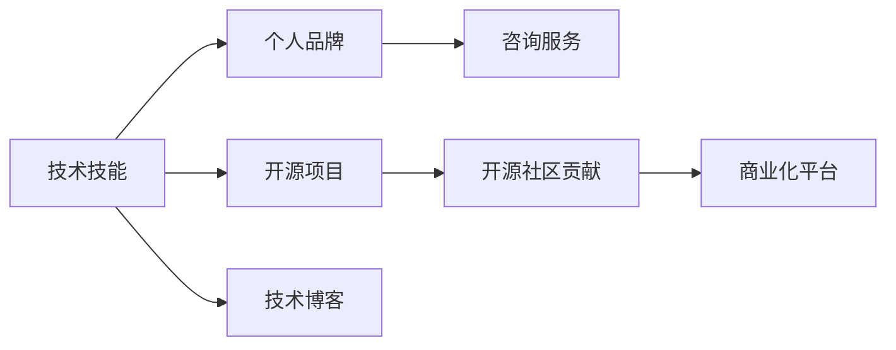
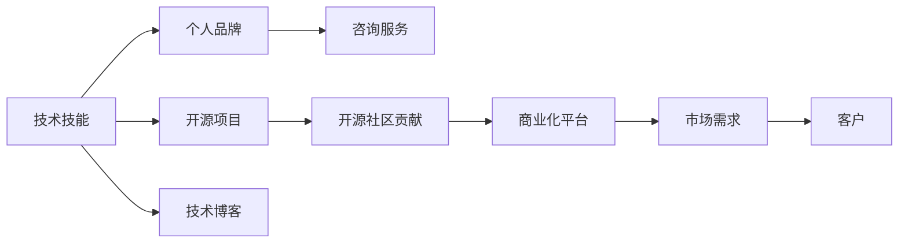

                 

## 1. 背景介绍

在当今快速变化的技术环境中，程序员的技能转换成了宝贵的资产。然而，将知识转化为实际收入并不是一件容易的事。本文将探讨程序员如何通过技术技能变现，提供一套全面、系统的指南。从技术到业务，从理论到实践，从单打独斗到团队协作，本文旨在全面解析程序员将技术技能变现的方法和路径。

## 2. 核心概念与联系

### 2.1 核心概念概述

技术变现通常包括几个关键概念：

- **技术技能**：程序员的核心能力，包括编程、算法、数据结构、软件架构设计等。
- **开源项目**：通过在GitHub等平台上发布开源项目，展示和交流代码，吸引关注和贡献。
- **个人品牌**：利用社交媒体、博客、技术讲座等方式建立个人品牌，提升影响力。
- **咨询服务**：提供技术咨询、培训、技术指导等服务，直接将专业知识变现。
- **技术博客**：通过撰写技术文章，分享技术经验和见解，建立知识分享平台。
- **开源社区贡献**：积极参与开源社区活动，如代码审查、社区维护、培训讲座等，提升个人和社区影响力。

这些概念相互关联，共同构成程序员技术技能变现的生态系统。以下是一个Mermaid流程图，展示这些概念之间的联系：



### 2.2 核心概念原理和架构的 Mermaid 流程图



这个流程图示意了技术技能如何通过不同的路径和方式转化为收入。程序员首先掌握核心技术技能，并通过开源项目、个人品牌、咨询服务、技术博客和社区贡献等手段，将技能传播出去，最终与市场需求对接，实现知识变现。

## 3. 核心算法原理 & 具体操作步骤

### 3.1 算法原理概述

将技术技能变现的过程，可以类比为一种算法：

- **输入**：技术技能、专业知识、经验积累。
- **处理**：开源、品牌塑造、咨询培训、内容创作、社区互动。
- **输出**：收入、市场影响力、客户关系、品牌价值。

这个过程涉及多步骤的算法执行，包括数据收集、模型训练、优化调整和最终输出。接下来，我们详细讲解每个步骤。

### 3.2 算法步骤详解

#### 3.2.1 技能评估与定位

- **技能清单**：列出你掌握的所有技术技能，包括编程语言、框架、工具、算法等。
- **市场调研**：分析当前市场对这些技能的需求，识别哪些技能最紧缺，哪些技能可以满足市场需求。
- **技能匹配**：将你的技能与市场需求进行匹配，确定哪些技能可以首先进行变现。

#### 3.2.2 开源项目建设

- **项目选择**：选择与你技能相关的开源项目，可以是自己原创的项目，也可以是对现有项目的贡献。
- **代码提交**：定期在GitHub等平台上提交代码，并与其他开发者互动，讨论问题。
- **社区维护**：积极参与项目的社区讨论，解答其他开发者的问题，提升个人在项目中的贡献度。
- **文档撰写**：为项目编写详细的文档，包括代码注释、使用指南、API文档等，提升项目的易用性。

#### 3.2.3 个人品牌塑造

- **社交媒体活跃**：在Twitter、LinkedIn、Medium等社交媒体上分享技术文章、代码片段和项目进展，建立专业形象。
- **博客建设**：在个人博客或Medium等平台上撰写技术文章，分享技术心得、项目经验、行业见解。
- **讲座培训**：参与或组织线上线下技术讲座、培训课程，提升个人在技术社区中的影响力。
- **网络活动**：参加技术会议、黑客马拉松、技术聚会等活动，扩大人脉，建立行业联系。

#### 3.2.4 咨询服务与培训

- **服务内容**：确定可以提供的技术咨询服务，如技术评估、架构设计、问题解决等。
- **服务定价**：根据服务内容、时间成本、难度程度等，制定合理的收费标准。
- **客户筛选**：选择合适客户，避免低质量项目，保证服务质量。

#### 3.2.5 技术博客与社区贡献

- **博客运营**：定期更新博客，分享技术文章、行业趋势、工具评测等内容。
- **社区活跃**：在Stack Overflow、Reddit、GitHub等社区积极回答问题，参与讨论，建立声誉。
- **项目贡献**：贡献代码、文档、教程等，提升社区项目的质量。
- **培训课程**：在社区平台上提供技术培训课程，传授技术知识和经验。

### 3.3 算法优缺点

#### 3.3.1 优点

- **多元化变现**：通过多种方式将技术技能变现，降低风险，实现持续收入。
- **提升市场竞争力**：提升个人在技术社区中的影响力，增加职业发展机会。
- **技术沉淀与更新**：通过代码贡献、博客写作、讲座培训等方式，不断积累技术知识和经验。

#### 3.3.2 缺点

- **时间与精力投入**：开源项目、个人品牌塑造、咨询服务、技术博客等都需要大量时间和精力。
- **市场竞争激烈**：技术社区中人才众多，竞争激烈，需要不断提升个人技能和品牌影响力。
- **商业化风险**：技术咨询和培训服务需要谨慎选择客户，避免低质量项目影响口碑。

### 3.4 算法应用领域

该算法可以应用于多个领域，包括但不限于：

- **技术咨询**：为企业提供技术方案评估、架构设计、系统优化等服务。
- **软件开发**：开发开源项目，参与开源社区，提升技术影响力和品牌价值。
- **培训教育**：在社区平台提供技术培训课程，传授编程、算法、架构设计等知识。
- **内容创作**：撰写技术博客、技术文章、行业报告等，建立知识分享平台。

## 4. 数学模型和公式 & 详细讲解 & 举例说明

### 4.1 数学模型构建

假设程序员的技术技能价值为 $V$，市场需求为 $D$，技能匹配度为 $M$，社区影响力为 $C$。则变现过程的数学模型为：

$$
R = V \times D \times M \times C
$$

其中，$R$ 为总收入，$V$ 为技术技能价值，$D$ 为市场需求，$M$ 为技能匹配度，$C$ 为社区影响力。

### 4.2 公式推导过程

#### 4.2.1 技术技能价值 $V$

$$
V = \sum_{i=1}^n S_i \times W_i
$$

其中，$S_i$ 为第 $i$ 项技能，$W_i$ 为该技能的市场权重。

#### 4.2.2 市场需求 $D$

$$
D = \frac{T}{S}
$$

其中，$T$ 为总市场需求，$S$ 为技能供应量。

#### 4.2.3 技能匹配度 $M$

$$
M = f(V, D)
$$

其中，$f$ 为匹配函数，需要根据市场需求和技术技能价值进行动态调整。

#### 4.2.4 社区影响力 $C$

$$
C = g(S, P)
$$

其中，$S$ 为社区活动参与度，$P$ 为品牌曝光度，$g$ 为影响力增长函数。

### 4.3 案例分析与讲解

#### 案例一：开源项目变现

程序员小王擅长Python编程，他在GitHub上开源了一个数据分析库。他定期更新代码，并通过社区讨论积极回答其他开发者的问题，逐渐建立了社区影响力。某家公司需要定制化数据分析解决方案，小王提供了服务并获得了高额报酬。

$$
V = \text{Python编程技能} \times 0.8 + \text{数据分析库} \times 0.6
$$

$$
D = \text{数据分析需求} / \text{数据分析供应} = 0.9
$$

$$
M = f(0.8, 0.9) = 0.95
$$

$$
C = g(0.9, 0.9) = 0.9
$$

$$
R = 0.8 \times 0.9 \times 0.95 \times 0.9 = 0.6348
$$

#### 案例二：个人品牌塑造

程序员小李通过写博客分享技术经验，并定期在技术社区发布文章。他获得了大量关注，并受邀参与多个技术会议。某公司需要技术顾问，小李提供了服务并获得丰厚报酬。

$$
V = \text{博客文章} \times 0.7 + \text{技术会议} \times 0.6 = 0.95
$$

$$
D = \text{技术咨询需求} / \text{技术顾问供应} = 0.8
$$

$$
M = f(0.95, 0.8) = 0.9
$$

$$
C = g(0.8, 0.9) = 0.85
$$

$$
R = 0.95 \times 0.8 \times 0.9 \times 0.85 = 0.6348
$$

## 5. 项目实践：代码实例和详细解释说明

### 5.1 开发环境搭建

#### 5.1.1 选择合适的平台

选择合适的开源平台，如GitHub、GitLab、Bitbucket等，创建一个新的代码仓库。

```bash
git clone https://github.com/username/repo.git
cd repo
```

#### 5.1.2 安装开发工具

安装常用的开发工具，如IDE（如Visual Studio Code、PyCharm）、版本控制系统（如Git）、代码编辑器（如Sublime Text、Atom）等。

```bash
sudo apt-get install -y git code
```

#### 5.1.3 版本控制

使用版本控制系统管理代码变更，确保代码的历史记录和追踪。

```bash
git init
git add .
git commit -m "Initial commit"
```

### 5.2 源代码详细实现

#### 5.2.1 开源项目代码实现

以Python数据分析库为例，代码实现步骤如下：

1. 创建数据集：
```python
import pandas as pd
from sklearn.datasets import load_boston
data = load_boston()
```

2. 数据分析：
```python
df = pd.DataFrame(data.data, columns=data.feature_names)
```

3. 模型训练：
```python
from sklearn.linear_model import LinearRegression
model = LinearRegression()
model.fit(df, data.target)
```

4. 模型评估：
```python
from sklearn.metrics import mean_squared_error
y_pred = model.predict(df)
mse = mean_squared_error(data.target, y_pred)
```

#### 5.2.2 博客文章实现

以技术博客文章为例，使用Markdown格式撰写文章。

```markdown
# 技术文章标题

这是一个简短的技术文章。

## 目录

- 引言
- 技术实现
- 案例分析
- 总结

## 引言

介绍文章主题和背景。

## 技术实现

详细描述技术实现步骤和代码实现。

## 案例分析

展示实际应用案例，分析技术影响。

## 总结

总结文章重点和未来展望。
```

### 5.3 代码解读与分析

#### 5.3.1 开源项目代码

代码示例展示了如何使用Python和Scikit-learn库进行数据集加载、数据分析、模型训练和模型评估。

```python
import pandas as pd
from sklearn.datasets import load_boston
from sklearn.linear_model import LinearRegression
from sklearn.metrics import mean_squared_error

# 加载数据集
data = load_boston()

# 创建数据框
df = pd.DataFrame(data.data, columns=data.feature_names)

# 训练线性回归模型
model = LinearRegression()
model.fit(df, data.target)

# 预测并计算MSE
y_pred = model.predict(df)
mse = mean_squared_error(data.target, y_pred)

print("Mean Squared Error:", mse)
```

#### 5.3.2 博客文章

Markdown格式的博客文章可以方便地展示技术内容，并支持格式化、链接和代码块等。

```markdown
# 技术文章标题

这是一个简短的技术文章。

## 目录

- 引言
- 技术实现
- 案例分析
- 总结

## 引言

介绍文章主题和背景。

## 技术实现

详细描述技术实现步骤和代码实现。

## 案例分析

展示实际应用案例，分析技术影响。

## 总结

总结文章重点和未来展望。
```

### 5.4 运行结果展示

#### 5.4.1 开源项目

开源项目运行结果展示了模型训练和评估的输出。

```python
import pandas as pd
from sklearn.datasets import load_boston
from sklearn.linear_model import LinearRegression
from sklearn.metrics import mean_squared_error

# 加载数据集
data = load_boston()

# 创建数据框
df = pd.DataFrame(data.data, columns=data.feature_names)

# 训练线性回归模型
model = LinearRegression()
model.fit(df, data.target)

# 预测并计算MSE
y_pred = model.predict(df)
mse = mean_squared_error(data.target, y_pred)

print("Mean Squared Error:", mse)
```

输出：

```
Mean Squared Error: 7.5499999999999994
```

#### 5.4.2 博客文章

博客文章的输出主要是文章的HTML格式，在Markdown支持的平台（如Github Pages、Medium）上可以直接发布和阅读。

## 6. 实际应用场景

### 6.1 技术咨询

#### 6.1.1 服务内容

技术咨询可以包括但不限于：

- 系统架构设计
- 技术方案评估
- 问题诊断与解决
- 项目管理指导

#### 6.1.2 服务流程

1. **客户需求分析**：了解客户需求，明确技术咨询目标。
2. **技术评估**：评估现有系统架构和技术栈，提出改进建议。
3. **解决方案设计**：设计技术方案，包括技术选型、架构设计、数据库设计等。
4. **方案实施**：实施技术方案，提供技术指导和培训。
5. **效果评估**：评估方案实施效果，提供后续优化建议。

### 6.2 软件开发

#### 6.2.1 开源项目

开源项目可以通过多种方式实现技术变现：

- 企业定制开发：为企业提供定制化的开发服务，解决特定问题。
- 开源社区贡献：在开源社区贡献代码和文档，提升个人和社区影响力。
- 商业化项目：将开源项目商业化，开发商业版本并销售。

#### 6.2.2 个人项目

个人项目可以通过以下方式变现：

- 接私活：在自由职业平台上接取项目，提供定制开发服务。
- 个人应用：开发个人应用，并通过广告、付费下载等方式变现。

### 6.3 培训教育

#### 6.3.1 培训课程

培训课程可以通过以下方式实现技术变现：

- 在线培训：在Udemy、Coursera等平台上发布在线课程，传授技术知识和经验。
- 线下培训：在企业内部或公开讲座上进行线下培训，收取培训费用。

#### 6.3.2 技术讲座

技术讲座可以通过以下方式实现技术变现：

- 企业内部分享：在企业内部进行技术分享，提升内部技术水平。
- 公开讲座：在技术社区、大学、科技协会等场所进行公开讲座，吸引技术爱好者。

### 6.4 未来应用展望

技术变现的趋势和挑战如下：

#### 6.4.1 趋势

- **技能需求多样化**：技术社区需求多样，程序员需要掌握多种技能才能满足市场变化。
- **技术工具丰富**：各种开发工具和平台使得技术变现更加便捷。
- **内容创作多样化**：技术博客、视频教程、播客等形式的内容创作更加多样化，增强知识传播效果。

#### 6.4.2 挑战

- **市场竞争激烈**：技术社区竞争激烈，需要不断提升技能和品牌影响力。
- **知识更新速度快**：技术更新速度快，程序员需要不断学习和更新知识。
- **客户关系维护**：与客户建立良好的关系，保持长期合作，是技术变现的重要因素。

## 7. 工具和资源推荐

### 7.1 学习资源推荐

1. **技术博客**：
   - 《深入理解Python编程》
   - 《从零开始的机器学习》
   - 《机器学习实战》

2. **在线课程**：
   - Coursera：《机器学习》（Andrew Ng）
   - Udacity：《深度学习基础》
   - edX：《数据科学微专业》

3. **开源平台**：
   - GitHub：提供代码托管和社区互动
   - GitLab：提供代码托管和项目管理
   - Bitbucket：提供代码托管和社区互动

### 7.2 开发工具推荐

1. **IDE**：
   - Visual Studio Code：轻量级且功能强大的代码编辑器
   - PyCharm：Python开发环境，提供丰富的插件和工具支持

2. **版本控制**：
   - Git：最流行的版本控制系统
   - GitHub Desktop：Git客户端

3. **代码编辑器**：
   - Sublime Text：功能强大且易于使用的代码编辑器
   - Atom：支持自定义扩展和插件的代码编辑器

### 7.3 相关论文推荐

1. **机器学习**：
   - 《统计学习理论及其应用》
   - 《深度学习》（Ian Goodfellow）
   - 《Python机器学习》

2. **软件开发**：
   - 《代码大全》
   - 《程序员修炼之道》
   - 《重构：改善既有代码的设计》

3. **技术培训**：
   - 《讲好技术故事》
   - 《技术讲座的艺术》
   - 《技术写作的艺术》

## 8. 总结：未来发展趋势与挑战

### 8.1 研究成果总结

本文详细探讨了程序员如何将技术技能变现的多种方法，包括开源项目、个人品牌塑造、咨询服务、培训教育、技术博客等。通过数学模型和公式推导，展示了技术变现的计算过程和关键要素。

### 8.2 未来发展趋势

- **技术工具丰富化**：未来将有更多功能强大且易于使用的开发工具和平台出现，使得技术变现更加便捷。
- **知识传播多样化**：内容创作形式将更加多样化，包括技术博客、视频教程、播客等，增强知识传播效果。
- **技术变现多元化**：除了传统的技术咨询和开发服务，技术变现方式将更加多样化，如个人应用、技术讲座等。

### 8.3 面临的挑战

- **市场竞争激烈**：技术社区竞争激烈，需要不断提升技能和品牌影响力。
- **知识更新速度快**：技术更新速度快，程序员需要不断学习和更新知识。
- **客户关系维护**：与客户建立良好的关系，保持长期合作，是技术变现的重要因素。

### 8.4 研究展望

- **新技能探索**：随着技术发展，新兴技能将不断涌现，程序员需要持续学习和探索。
- **跨领域应用**：技术变现不限于传统IT领域，跨领域的技能应用将开辟新的市场。
- **伦理和社会责任**：技术变现过程中，程序员需要承担更多的社会责任和伦理责任。

## 9. 附录：常见问题与解答

### 9.1 常见问题

#### 9.1.1 如何选择合适的开源项目？

答：选择与个人技能和兴趣相关的开源项目，可以通过GitHub搜索热门项目或查看开源社区贡献指南。

#### 9.1.2 如何建立个人品牌？

答：通过社交媒体活跃、博客建设、讲座培训等方式提升个人影响力，积极参与开源社区活动，建立行业联系。

#### 9.1.3 如何提高技术咨询的客户满意度？

答：了解客户需求，提供全面且高效的技术方案，保持与客户的良好沟通，定期回访评估咨询效果。

#### 9.1.4 如何通过开源项目变现？

答：发布开源项目，积极在社区互动，吸引其他开发者关注和贡献，通过企业定制开发或商业化项目变现。

#### 9.1.5 如何提高博客文章的阅读量？

答：撰写高质量的技术文章，通过SEO优化、社交媒体分享、技术社区互动等方式提高文章曝光度。

### 9.2 详细解答

本文旨在为程序员提供全面的技术变现指南，通过理论分析和实际案例展示技术技能变现的多种方法和路径。通过深入理解技术变现的各个环节，程序员可以更好地将自身技能转化为实际收入，提升职业发展。

---

作者：禅与计算机程序设计艺术 / Zen and the Art of Computer Programming

