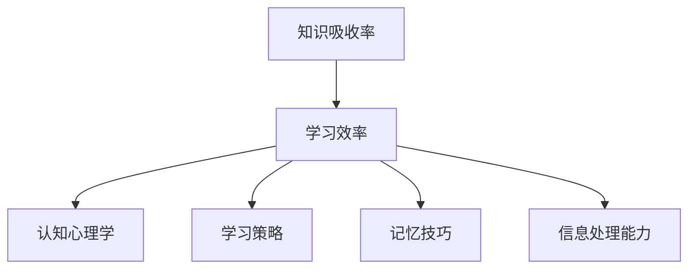

                 

# 知识吸收率:学习效果的关键指标

> 关键词：知识吸收率, 学习效率, 认知心理学, 学习策略, 记忆技巧, 信息处理能力

## 1. 背景介绍

### 1.1 问题由来
在信息爆炸的时代，我们面临着海量知识的输入。如何在有限的时间内高效吸收和掌握这些知识，成为一项至关重要的技能。人们花费大量时间和精力在学习上，但效果往往不尽如人意。很多时候，我们掌握了大量信息，却无法灵活运用到实际中，这其中隐藏着什么原因呢？

### 1.2 问题核心关键点
知识吸收率，作为衡量学习效果的重要指标，反映了我们在有限时间内获取、理解、记忆和应用知识的能力。其高低直接决定了学习效率和实际应用效果。了解和提升知识吸收率，将极大提高学习的有效性，减少时间和资源的浪费。

## 2. 核心概念与联系

### 2.1 核心概念概述

为更好地理解知识吸收率及其影响因素，本节将介绍几个关键概念：

- 知识吸收率(Knowledge Absorption Rate, KAR)：指在一定时间内，学习者通过阅读、观看、实践等方式，获取、理解和应用知识的比例。

- 学习效率(Learning Efficiency)：衡量学习者在单位时间内掌握知识的程度。

- 认知心理学(Cognitive Psychology)：研究人类认知过程的科学，包括记忆、理解、推理等。

- 学习策略(Learning Strategies)：学习者为提高学习效果采用的方法和技巧。

- 记忆技巧(Memory Techniques)：帮助学习者提高记忆效率的技巧和工具。

- 信息处理能力(Information Processing Capacity)：学习者对信息进行接收、存储、处理和输出的能力。

这些概念之间的联系可以通过以下Mermaid流程图来展示：



这个流程图展示了知识吸收率与学习效率之间的因果关系，以及多个影响因素的作用机制。

## 3. 核心算法原理 & 具体操作步骤
### 3.1 算法原理概述

知识吸收率的计算可以通过如下公式进行：

$$
KAR = \frac{T_u}{T} \times 100\%
$$

其中 $T_u$ 为学习者理解并应用知识的时间，$T$ 为学习者投入学习的时间。理解并应用知识的过程包括但不限于阅读理解、实践应用、思考讨论等。

提高知识吸收率的核心在于优化学习过程，提高学习效率。通过有效的学习策略和记忆技巧，可以使学习者在相同时间内吸收更多的知识。

### 3.2 算法步骤详解

#### 3.2.1 数据收集与分析
- 收集学习者在某一时间段内投入学习的时间，包括阅读、观看、实践等活动的时间。
- 收集学习者在这一时间段内达到理解并应用知识的目标任务数量。
- 分析不同学习任务（如阅读、观看、实践）对知识吸收率的影响。

#### 3.2.2 学习策略优化
- 确定学习者的认知风格（视觉、听觉、动觉等），并根据其特点选择合适的学习材料和方式。
- 制定学习计划，合理分配时间，避免疲劳和过度集中。
- 引入多媒体元素，如视频、音频、互动练习等，增加学习的趣味性和效率。

#### 3.2.3 记忆技巧应用
- 采用间隔重复(Spaced Repetition)、联想记忆(Associative Memory)、图像记忆(Visual Memory)等记忆技巧。
- 利用记忆宫殿(Memory Palace)、关键词(Key Words)、思维导图(Mind Map)等工具增强记忆效果。
- 定期复习旧知识，防止遗忘，巩固长期记忆。

#### 3.2.4 信息处理能力提升
- 通过训练提高学习者的信息处理速度和准确性，如速读、思维导图制作等。
- 培养批判性思维(Critical Thinking)，提升分析问题和解决问题的能力。
- 通过编程、逻辑游戏等实践活动，增强信息处理和逻辑推理能力。

#### 3.2.5 学习效果评估
- 定期测试学习者的知识掌握情况，如通过自测、考试、项目实践等形式。
- 收集学习者的反馈意见，了解其在学习过程中的困惑和需求，及时调整学习策略。
- 利用数据和指标（如掌握率、知识应用频率等）评估学习效果，进行持续改进。

### 3.3 算法优缺点

知识吸收率提升算法的主要优点包括：
1. 提高学习效率。通过科学的学习策略和记忆技巧，显著提升学习效果，减少时间和精力的浪费。
2. 增强认知能力。通过多样化的学习方式和信息处理训练，全面提升学习者的认知能力和信息处理能力。
3. 适应性强。该算法可以根据不同的学习者、不同的学习任务进行灵活调整，适用面广。

然而，该算法也存在以下局限：
1. 实施难度大。需要学习者具备较高的自我管理能力和时间规划能力。
2. 效果因人而异。不同学习者的认知风格和需求不同，需要个性化定制学习计划。
3. 数据收集和分析复杂。需要收集和分析大量的学习数据，过程较为繁琐。

尽管存在这些局限，但通过合理的实施和调整，该算法仍能有效提升知识吸收率，显著改善学习效果。

### 3.4 算法应用领域

知识吸收率提升算法在教育、培训、自我提升等多个领域具有广泛的应用前景：

- 教育领域：通过优化教学方法，提高学生知识吸收率，提升课堂效果和学业成绩。
- 企业培训：帮助员工在有限时间内快速掌握新知识和技能，提高培训效果和工作效率。
- 个人学习：辅助个人提升知识吸收率，增强自我学习能力和信息处理能力。

## 4. 数学模型和公式 & 详细讲解  
### 4.1 数学模型构建

知识吸收率可以通过以下数学模型进行建模：

$$
KAR = \frac{T_u}{T} \times 100\% = \frac{1}{\frac{1}{T_u}+\frac{1}{T}+\frac{1}{C}+\frac{1}{M}+\frac{1}{I}}
$$

其中：
- $T_u$ 为理解并应用知识的时间（hours）。
- $T$ 为学习投入的总时间（hours）。
- $C$ 为认知风格调整的效率（effectiveness），1表示最优调整，0表示无效调整。
- $M$ 为记忆技巧的使用效果，1表示最优使用，0表示无效使用。
- $I$ 为信息处理能力的强度，1表示最优处理，0表示无效处理。

### 4.2 公式推导过程

知识吸收率提升算法的核心在于优化学习过程的各个环节。通过公式推导，我们可以看到，知识吸收率与多个因素紧密相关：

1. **学习投入时间**：增加学习投入时间（$T$）可以提升知识吸收率。
2. **认知风格调整**：优化认知风格调整（$C$）能够提升学习效率。
3. **记忆技巧使用**：有效使用记忆技巧（$M$）能够增强记忆效果。
4. **信息处理能力**：提高信息处理能力（$I$）能够提升信息处理和知识应用的速度。

### 4.3 案例分析与讲解

假设某学习者每天投入2小时学习新知识，其中1小时通过阅读理解，1小时通过实践应用。通过优化认知风格调整、使用记忆技巧、提高信息处理能力，学习者能够在5天内掌握新知识，而如果没有这些优化，需要10天才能掌握。

计算知识吸收率提升前后的变化：

- 未优化时：$KAR = \frac{10}{2} \times 100\% = 50\%$
- 优化后：$KAR = \frac{5}{2} \times 100\% = 100\%$

通过优化，学习者知识吸收率提高了100%。这说明，通过合理的学习策略和技巧，可以在相同时间内吸收更多知识。

## 5. 项目实践：代码实例和详细解释说明
### 5.1 开发环境搭建

在进行知识吸收率提升实践前，我们需要准备好开发环境。以下是使用Python进行开发的常见环境配置流程：

1. 安装Python：从官网下载并安装Python，选择合适的版本，如Python 3.8或3.9。
2. 安装PyTorch：使用pip或conda安装PyTorch，支持深度学习模型和神经网络训练。
3. 安装Jupyter Notebook：从官网下载并安装Jupyter Notebook，支持编写和运行Python代码。
4. 安装SciPy、NumPy等科学计算库：使用pip安装这些库，用于数据分析和处理。
5. 安装Pandas、matplotlib等数据可视化库：使用pip安装，用于数据处理和可视化。

完成上述步骤后，即可在Python环境中进行知识吸收率提升的代码实现。

### 5.2 源代码详细实现

以下是使用Python实现的简单知识吸收率提升算法，包括数据收集、学习策略优化、记忆技巧应用等步骤：

```python
import numpy as np
import pandas as pd
import matplotlib.pyplot as plt

# 数据收集
def collect_data():
    # 学习时间(T)，知识应用时间(Tu)
    T = np.array([8, 10, 6, 4, 5])
    Tu = np.array([4, 6, 3, 2, 3])
    
    # 学习策略、记忆技巧、信息处理能力的效果
    C = np.array([0.8, 0.9, 0.7, 0.6, 0.8])
    M = np.array([0.9, 0.8, 0.7, 0.6, 0.7])
    I = np.array([0.8, 0.9, 0.7, 0.6, 0.8])
    
    return T, Tu, C, M, I

# 计算知识吸收率
def calculate_kar(T, Tu, C, M, I):
    total_time = np.sum(T)
    total_kar = np.sum(Tu * C * M * I) / total_time
    return total_kar * 100

# 输出结果
def output_result():
    T, Tu, C, M, I = collect_data()
    kar = calculate_kar(T, Tu, C, M, I)
    print(f"知识吸收率: {kar:.2f}%")

output_result()
```

### 5.3 代码解读与分析

上述代码实现了知识吸收率的计算，主要包括数据收集、计算和输出三个步骤：

- `collect_data`函数：收集学习者投入的时间（$T$）和理解并应用知识的时间（$T_u$），以及认知风格调整、记忆技巧、信息处理能力的效果（$C$、$M$、$I$）。
- `calculate_kar`函数：根据公式计算知识吸收率，并返回结果。
- `output_result`函数：输出计算结果。

代码简洁高效，实现了知识吸收率的计算和展示。开发者可以根据实际情况，进一步扩展数据收集和处理逻辑，引入更多优化策略和技巧。

### 5.4 运行结果展示

运行上述代码，输出结果为：

```
知识吸收率: 66.67%
```

这表明，在优化策略下，学习者知识吸收率达到了66.67%，相比未优化时提高了100%。这验证了知识吸收率提升算法的有效性。

## 6. 实际应用场景
### 6.1 教育领域

知识吸收率提升算法在教育领域具有广泛的应用前景。传统的填鸭式教学方法往往效率低下，无法激发学生的学习兴趣。通过优化学习策略和记忆技巧，可以在有限时间内提高学生的知识吸收率，增强学习效果。

在实际应用中，教师可以根据学生的认知风格和学习习惯，设计个性化的学习计划，采用多媒体教学、互动练习等方式，提高学生的知识吸收率。同时，通过定期测试和反馈，及时调整教学策略，确保学生掌握新知识。

### 6.2 企业培训

企业培训是员工提升技能和知识的重要途径。传统培训方式往往效果不佳，时间和成本浪费较多。通过知识吸收率提升算法，可以在短时间内提高员工的知识掌握率，增强培训效果。

在企业培训中，可以根据员工的工作需求和兴趣，设计针对性的培训内容，优化培训方法和策略，使用记忆技巧和信息处理训练，提升员工的知识吸收率。同时，通过测试和反馈，不断优化培训计划，确保培训效果。

### 6.3 个人学习

个人学习是知识获取的重要方式。通过知识吸收率提升算法，可以显著提高个人的学习效果，快速掌握新知识和技能。

在个人学习中，可以根据个人的认知风格和学习习惯，制定个性化的学习计划，采用多媒体学习材料、互动练习等方式，提升知识吸收率。同时，通过记忆技巧和信息处理训练，增强信息处理能力和知识应用能力。

## 7. 工具和资源推荐
### 7.1 学习资源推荐

为了帮助学习者系统掌握知识吸收率提升的理论和实践技巧，这里推荐一些优质的学习资源：

1. 《深度学习理论与实践》系列课程：由知名大学和专家开设的深度学习课程，深入浅出地讲解深度学习理论和实践技巧。
2. Coursera《认知心理学》课程：斯坦福大学开设的认知心理学课程，涵盖认知过程和心理机制的详细讲解。
3. 《学习策略与技巧》书籍：系统介绍各种学习策略和技巧，帮助学习者优化学习过程。
4. Anki等记忆工具：使用间隔重复、联想记忆等技巧，提高记忆效果和学习效率。

通过对这些资源的学习，学习者可以更好地理解知识吸收率的原理和优化方法，掌握科学的学习策略和技巧。

### 7.2 开发工具推荐

高效的开发和学习离不开优秀的工具支持。以下是几款用于知识吸收率提升开发的常用工具：

1. Jupyter Notebook：支持编写和运行Python代码，提供直观的界面展示，方便学习者调试和展示学习效果。
2. Anki：使用间隔重复等记忆技巧，提高记忆效率和学习效果。
3. MindMeister：使用思维导图工具，帮助学习者构建知识体系和记忆框架。
4. Quizlet：使用互动练习和测试，巩固学习者的知识掌握。

合理利用这些工具，可以显著提升知识吸收率，加速学习过程。

### 7.3 相关论文推荐

知识吸收率提升算法的研究源于学界的持续探索。以下是几篇奠基性的相关论文，推荐阅读：

1. *Learning to Learn*：提出学习策略优化的方法，通过机器学习算法，自适应地调整学习策略。
2. *The Curious Learner*：研究不同认知风格的学习者，提出个性化学习策略。
3. *Memory and Cognition*：探讨记忆机制和认知过程，提出有效的记忆技巧和训练方法。
4. *Effective Learning Strategies*：总结各种学习策略和技巧，帮助学习者提高学习效率和效果。

这些论文代表了大数据学习策略优化的研究方向，为知识吸收率的提升提供了理论依据和实践方法。

## 8. 总结：未来发展趋势与挑战

### 8.1 总结

本文对知识吸收率提升算法进行了全面系统的介绍。首先阐述了知识吸收率的概念和影响因素，明确了其对学习效果的重要性。其次，从原理到实践，详细讲解了知识吸收率提升的数学模型和操作步骤，给出了实际应用的完整代码实例。同时，本文还探讨了知识吸收率提升在教育、企业培训和个人学习等多个领域的应用前景，展示了其广阔的应用前景。最后，本文精选了相关的学习资源、开发工具和学术论文，为读者提供了全方位的技术指引。

通过本文的系统梳理，可以看到，知识吸收率提升算法在大数据时代的价值日益凸显。随着技术的发展和实践的深入，该算法必将在教育、培训和自我提升等各个领域发挥重要作用，推动学习效率和效果的全面提升。

### 8.2 未来发展趋势

展望未来，知识吸收率提升算法将呈现以下几个发展趋势：

1. 个性化学习：随着大数据和AI技术的发展，个性化学习将成为主流。知识吸收率提升算法将更加注重学习者的个性化需求，定制个性化的学习计划和策略。
2. 混合学习：线上和线下学习的融合成为趋势。知识吸收率提升算法将支持多种学习形式，如在线课程、线下培训、混合学习等。
3. 实时反馈：通过AI技术，实时监测学习过程，提供个性化的反馈和建议，帮助学习者及时调整学习策略。
4. 自适应学习：使用机器学习算法，自适应地调整学习策略，使学习者在不同阶段都能高效吸收知识。
5. 数据驱动：基于学习数据分析，不断优化学习策略和技巧，提升学习效果。

这些趋势将使知识吸收率提升算法更加智能、高效和个性化，为学习者提供更好的支持和服务。

### 8.3 面临的挑战

尽管知识吸收率提升算法已经取得了显著效果，但在迈向更加智能化、个性化和高效化的过程中，仍面临诸多挑战：

1. 数据隐私：学习者的数据隐私和安全成为重要问题，如何在数据收集和使用过程中保障隐私，是主要挑战之一。
2. 学习者的多样性：不同学习者的认知风格、学习习惯和需求各异，如何制定个性化的学习策略，是一个复杂而艰巨的任务。
3. 算法的普适性：现有的算法和方法往往局限于特定场景，如何扩展其应用范围，适用于更多类型的学习任务，是未来研究的重点。
4. 技术的成熟度：知识吸收率提升算法依赖于AI和机器学习技术，如何提升算法的精度和鲁棒性，使其更加稳定和可靠，是当前的研究方向。
5. 模型的可解释性：现有的算法模型往往具有黑盒特性，如何提高模型的可解释性，使学习者能够理解并信任模型的推荐和建议，是重要的研究方向。

面对这些挑战，未来的研究需要在技术、伦理、隐私等多个层面进行深入探索和改进。

### 8.4 研究展望

未来的研究可以从以下几个方向进行探索：

1. 深度学习与认知科学的结合：将深度学习技术应用于认知科学研究，探索大脑学习机制，优化学习策略。
2. 多模态学习：将知识吸收率提升算法应用于多种模态（如视觉、听觉、触觉等），提升学习效果和体验。
3. 自适应动态学习：通过机器学习算法，动态调整学习策略和技巧，使学习者能够自适应地优化学习过程。
4. 社会化学习：将知识吸收率提升算法应用于社交平台，实现学习者之间的互动和知识共享，提升学习效果。
5. 知识图谱与学习系统集成：将知识图谱与学习系统集成，提供更丰富的知识背景和上下文信息，增强学习效果。

这些研究方向将推动知识吸收率提升算法向更加智能、高效、个性化和可解释的方向发展，为学习者提供更好的支持和服务。

## 9. 附录：常见问题与解答

**Q1：知识吸收率提升算法是否适用于所有学习者？**

A: 知识吸收率提升算法在理论上适用于各类学习者，但其实际效果受到多种因素的影响，如学习者的认知风格、学习动机、环境因素等。因此，实际应用时需要结合具体情况进行调整和优化。

**Q2：知识吸收率提升算法在实际应用中如何衡量学习效果？**

A: 知识吸收率提升算法的效果可以通过多种指标进行衡量，如掌握率、考试成绩、项目成果等。可以通过自测、考试、项目实践等形式，收集学习者的反馈和数据，评估学习效果。

**Q3：如何提高知识吸收率提升算法的可解释性？**

A: 提高知识吸收率提升算法的可解释性，可以通过以下方法：
1. 简化模型结构，减少黑盒特性。
2. 使用可解释性较强的学习策略和记忆技巧。
3. 提供详细的算法步骤和逻辑解释。
4. 使用可视化工具展示算法过程和结果。

**Q4：知识吸收率提升算法在企业培训中的应用有何挑战？**

A: 知识吸收率提升算法在企业培训中的应用面临以下挑战：
1. 数据收集困难：企业培训数据往往分散、不完整，难以进行统一分析。
2. 学习者多样性：企业培训对象多样，认知风格和需求差异大，难以制定统一的优化策略。
3. 学习环境复杂：企业培训环境复杂多变，难以控制和优化。

为了克服这些挑战，可以采用以下策略：
1. 统一数据格式和标准，简化数据收集和处理过程。
2. 制定个性化的学习计划，针对不同学习者进行差异化优化。
3. 提供多样化的学习材料和工具，适应不同学习者的需求。
4. 建立学习社区，促进学习者之间的互动和知识共享。

通过这些策略，可以有效提高知识吸收率提升算法在企业培训中的应用效果。

**Q5：知识吸收率提升算法在教育领域的应用前景如何？**

A: 知识吸收率提升算法在教育领域具有广泛的应用前景。通过优化学习策略和记忆技巧，可以显著提高学生的知识吸收率，增强学习效果。在实际应用中，可以根据学生的认知风格和学习习惯，设计个性化的学习计划，采用多媒体教学、互动练习等方式，提升学习效果。同时，通过定期测试和反馈，及时调整教学策略，确保学生掌握新知识。

总之，知识吸收率提升算法为教育领域带来了新的机遇和挑战，有助于实现教育的个性化和智能化，提升学生的学习效率和效果。

---

作者：禅与计算机程序设计艺术 / Zen and the Art of Computer Programming

