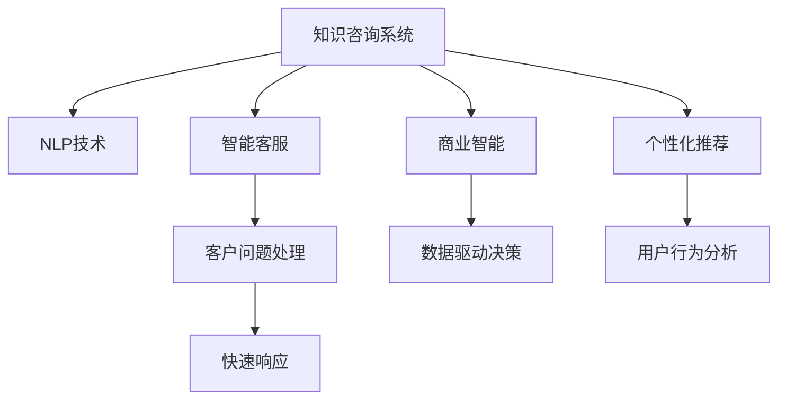

                 

# 知识咨询帮助企业解决实际问题,提供增值

> 关键词：知识咨询,问题解答,企业增值,智能决策,自然语言处理(NLP),智能客服,商业智能(BI),个性化推荐

## 1. 背景介绍

### 1.1 问题由来

在信息化高速发展的今天，企业面临的内外挑战日益增多，需要不断提升自身竞争力。知识咨询作为一种新兴的增值服务，在企业中逐渐被广泛应用。通过知识咨询，企业能够快速获取专业解答，解决实际问题，从而提升运营效率、降低运营成本、提升客户满意度，最终实现全面增值。

### 1.2 问题核心关键点

知识咨询的核心在于通过智能技术，将企业内部的知识库与客户的问题精准匹配，并提供快速、准确的答案。它不仅包括传统的问答系统，还涵盖了智能客服、智能决策、个性化推荐等多个方面，展示了智能技术在企业管理中的广泛应用。

### 1.3 问题研究意义

1. **提升运营效率**：通过知识咨询，企业能够快速找到解决问题的方法，减少处理时间，提升运营效率。
2. **降低运营成本**：知识咨询系统可以24小时在线服务，减少了人工客服的成本。
3. **提升客户满意度**：通过快速响应客户问题，提升客户体验，增强客户粘性。
4. **推动数据驱动决策**：知识咨询系统通过对企业内部知识的整理和利用，帮助决策者做出更明智的决策。
5. **个性化推荐**：通过知识咨询，企业可以提供个性化服务，提升用户粘性和业务收入。

## 2. 核心概念与联系

### 2.1 核心概念概述

为了更好地理解知识咨询系统的工作原理和优化方向，本节将介绍几个关键概念：

- **知识咨询系统**：通过自然语言处理(NLP)技术，将客户问题与知识库中的信息进行匹配，并提供快速、准确的答案的系统。
- **自然语言处理(NLP)**：使计算机能够理解、处理和生成人类自然语言的技术，包括文本分类、情感分析、命名实体识别、问答系统等。
- **智能客服**：通过NLP和机器学习技术，实现自动回答客户问题，提高客户服务效率的系统。
- **商业智能(BI)**：利用数据分析、可视化等技术，帮助企业做出决策的系统。
- **个性化推荐系统**：通过分析用户行为和偏好，提供个性化信息推荐的系统。

这些核心概念之间的逻辑关系可以通过以下Mermaid流程图来展示：



这个流程图展示了知识咨询系统的核心组件及其相互作用：

1. **知识咨询系统**：核心组件，整合NLP技术、智能客服、商业智能和个性化推荐系统，提供知识咨询服务。
2. **NLP技术**：知识咨询系统的基础，实现问题理解和信息匹配。
3. **智能客服**：快速响应客户问题，提升客户满意度。
4. **商业智能**：利用数据分析帮助企业决策。
5. **个性化推荐系统**：根据用户行为推荐相关信息，提升用户体验。

## 3. 核心算法原理 & 具体操作步骤
### 3.1 算法原理概述

知识咨询系统的工作原理基于自然语言处理(NLP)技术，通过将客户问题与知识库中的信息进行匹配，并提供快速、准确的答案。其核心算法包括：

- **文本分类**：将客户问题归类为不同的主题或意图。
- **信息检索**：在知识库中检索与客户问题相关的信息。
- **问答系统**：根据客户问题，生成精准的答案。
- **情感分析**：分析客户对答案的情感反馈，优化问答系统。
- **个性化推荐**：根据用户行为和偏好，推荐相关信息。

### 3.2 算法步骤详解

知识咨询系统的实现通常包括以下几个关键步骤：

**Step 1: 知识库构建**
- 收集企业内部各种文档、手册、FAQ等，构建知识库。
- 对知识库进行标注，生成训练数据。

**Step 2: 自然语言处理**
- 使用NLP技术对客户问题进行分词、词性标注、命名实体识别等预处理。
- 对客户问题进行意图识别和文本分类。

**Step 3: 信息检索**
- 在知识库中检索与客户问题相关的文档和FAQ。
- 对检索结果进行排序和筛选，找到最匹配的信息。

**Step 4: 问答系统**
- 使用预训练的语言模型，如BERT、GPT等，生成精准的回答。
- 对回答进行情感分析，优化问答系统。

**Step 5: 个性化推荐**
- 分析用户的行为和偏好，生成个性化推荐列表。
- 对推荐结果进行排序和展示。

### 3.3 算法优缺点

知识咨询系统的优点包括：
- **高效响应**：通过自动化处理，能够快速响应用户问题。
- **提升客户满意度**：通过提供精准、及时的答案，提升客户体验。
- **成本节约**：减少了对人工客服的依赖，降低了运营成本。

同时，该系统也存在一些局限性：
- **准确性**：客户问题复杂多样，有时可能难以精准匹配知识库中的信息。
- **维护成本**：知识库需要定期更新和维护，以确保信息的准确性和时效性。
- **可解释性**：系统的工作原理和决策过程缺乏透明性，难以解释。

### 3.4 算法应用领域

知识咨询系统在多个领域中得到了广泛应用：

- **智能客服**：用于自动回答客户咨询，提升客户满意度。
- **企业决策支持**：利用商业智能，帮助决策者做出更明智的决策。
- **个性化推荐**：根据用户行为和偏好，提供个性化推荐服务。
- **信息检索**：帮助用户快速找到所需信息。
- **知识管理**：管理企业内部的知识库，提升知识利用率。

## 4. 数学模型和公式 & 详细讲解 & 举例说明

### 4.1 数学模型构建

知识咨询系统涉及的数学模型主要包括文本分类、情感分析和信息检索等。以下是一些关键模型的数学表达式：

**文本分类**
假设客户问题为 $x$，问题类别为 $y$。定义分类模型 $f: \mathcal{X} \rightarrow \mathcal{Y}$，其中 $\mathcal{X}$ 为问题空间，$\mathcal{Y}$ 为问题类别空间。分类模型的目标是最小化损失函数 $\mathcal{L}$：

$$
\mathcal{L}(f) = -\frac{1}{N}\sum_{i=1}^N \log f(x_i, y_i)
$$

其中 $f(x_i, y_i)$ 表示模型对问题 $x_i$ 分类的概率，$y_i$ 为真实标签。

**情感分析**
情感分析模型 $g: \mathcal{X} \rightarrow [0, 1]$，用于判断答案的情绪极性。情感分析的目标是最小化损失函数 $\mathcal{L}$：

$$
\mathcal{L}(g) = -\frac{1}{N}\sum_{i=1}^N \log g(x_i)
$$

其中 $g(x_i)$ 表示模型对问题 $x_i$ 的情感评分。

**信息检索**
假设知识库中的文档为 $d$，客户问题为 $x$。定义信息检索模型 $h: \mathcal{X} \times \mathcal{D} \rightarrow \mathbb{R}$，其中 $\mathcal{D}$ 为文档空间。信息检索模型的目标是最小化损失函数 $\mathcal{L}$：

$$
\mathcal{L}(h) = -\frac{1}{N}\sum_{i=1}^N \log h(x_i, d_i)
$$

其中 $h(x_i, d_i)$ 表示模型对问题 $x_i$ 与文档 $d_i$ 的匹配程度。

### 4.2 公式推导过程

以下以文本分类模型为例，推导其核心公式。

**定义文本向量表示**
将客户问题 $x$ 转换为向量表示 $v_x$，其中 $v_x \in \mathbb{R}^n$。

**定义分类器**
定义分类器 $f: \mathbb{R}^n \rightarrow \mathcal{Y}$，其中 $\mathcal{Y}$ 为问题类别空间。

**定义损失函数**
定义损失函数 $\mathcal{L}(f)$，用于衡量模型的分类效果。

**梯度下降更新**
根据梯度下降算法，更新分类器的参数 $\theta$：

$$
\theta \leftarrow \theta - \eta \nabla_{\theta}\mathcal{L}(f)
$$

其中 $\eta$ 为学习率，$\nabla_{\theta}\mathcal{L}(f)$ 为损失函数对参数 $\theta$ 的梯度。

### 4.3 案例分析与讲解

假设我们有一个电商平台，需要构建一个知识咨询系统，帮助客户解决产品问题。以下是具体实现步骤：

**Step 1: 知识库构建**
- 收集产品使用手册、FAQ、用户评论等文档，构建知识库。
- 对知识库进行标注，生成训练数据。

**Step 2: 自然语言处理**
- 使用BERT模型对客户问题进行分词、词性标注、命名实体识别等预处理。
- 对客户问题进行意图识别和文本分类。

**Step 3: 信息检索**
- 在知识库中检索与客户问题相关的文档和FAQ。
- 对检索结果进行排序和筛选，找到最匹配的信息。

**Step 4: 问答系统**
- 使用预训练的GPT模型，生成精准的回答。
- 对回答进行情感分析，优化问答系统。

**Step 5: 个性化推荐**
- 分析用户的行为和偏好，生成个性化推荐列表。
- 对推荐结果进行排序和展示。

## 5. 项目实践：代码实例和详细解释说明
### 5.1 开发环境搭建

在进行知识咨询系统的开发前，我们需要准备好开发环境。以下是使用Python进行PyTorch开发的环境配置流程：

1. 安装Anaconda：从官网下载并安装Anaconda，用于创建独立的Python环境。

2. 创建并激活虚拟环境：
```bash
conda create -n pytorch-env python=3.8 
conda activate pytorch-env
```

3. 安装PyTorch：根据CUDA版本，从官网获取对应的安装命令。例如：
```bash
conda install pytorch torchvision torchaudio cudatoolkit=11.1 -c pytorch -c conda-forge
```

4. 安装Transformer库：
```bash
pip install transformers
```

5. 安装各类工具包：
```bash
pip install numpy pandas scikit-learn matplotlib tqdm jupyter notebook ipython
```

完成上述步骤后，即可在`pytorch-env`环境中开始知识咨询系统的开发。

### 5.2 源代码详细实现

下面我们以文本分类任务为例，给出使用Transformers库对BERT模型进行分类的PyTorch代码实现。

首先，定义文本分类任务的数据处理函数：

```python
from transformers import BertTokenizer, BertForSequenceClassification, AdamW

def preprocess_data(texts, labels, tokenizer, max_len=128):
    tokenized_texts = []
    encoded_inputs = []
    labels = []
    for text, label in zip(texts, labels):
        encoded = tokenizer.encode_plus(text, add_special_tokens=True, max_length=max_len, padding='max_length', truncation=True, return_tensors='pt')
        tokenized_texts.append(encoded['input_ids'])
        encoded_inputs.append(encoded['input_ids'])
        labels.append(label)
    return tokenized_texts, encoded_inputs, labels

# 标签与id的映射
label2id = {'negative': 0, 'positive': 1}
id2label = {v: k for k, v in label2id.items()}

# 创建tokenizer和分类器
tokenizer = BertTokenizer.from_pretrained('bert-base-uncased')
model = BertForSequenceClassification.from_pretrained('bert-base-uncased', num_labels=len(label2id))
```

然后，定义训练和评估函数：

```python
from torch.utils.data import DataLoader, TensorDataset
from tqdm import tqdm

def train_epoch(model, data_loader, optimizer):
    model.train()
    total_loss = 0
    for batch in data_loader:
        input_ids = batch[0].to(device)
        attention_mask = batch[1].to(device)
        labels = batch[2].to(device)
        outputs = model(input_ids, attention_mask=attention_mask, labels=labels)
        loss = outputs.loss
        total_loss += loss.item()
        optimizer.zero_grad()
        loss.backward()
        optimizer.step()
    return total_loss / len(data_loader)

def evaluate(model, data_loader):
    model.eval()
    total_loss = 0
    predictions, true_labels = [], []
    with torch.no_grad():
        for batch in data_loader:
            input_ids = batch[0].to(device)
            attention_mask = batch[1].to(device)
            labels = batch[2].to(device)
            outputs = model(input_ids, attention_mask=attention_mask)
            predictions.append(outputs.logits.argmax(dim=1).cpu().numpy().tolist())
            true_labels.append(labels.cpu().numpy().tolist())
    return classification_report(true_labels, predictions)
```

最后，启动训练流程并在测试集上评估：

```python
epochs = 5
batch_size = 16
learning_rate = 2e-5
device = torch.device('cuda') if torch.cuda.is_available() else torch.device('cpu')

# 准备训练集和测试集
train_texts, train_encodings, train_labels = preprocess_data(train_texts, train_labels, tokenizer)
test_texts, test_encodings, test_labels = preprocess_data(test_texts, test_labels, tokenizer)

# 加载模型和优化器
model.to(device)
optimizer = AdamW(model.parameters(), lr=learning_rate)

# 定义数据加载器
train_loader = DataLoader(train_encodings, batch_size=batch_size, shuffle=True)
test_loader = DataLoader(test_encodings, batch_size=batch_size, shuffle=False)

# 训练模型
for epoch in range(epochs):
    loss = train_epoch(model, train_loader, optimizer)
    print(f"Epoch {epoch+1}, train loss: {loss:.3f}")
    
    print(f"Epoch {epoch+1}, dev results:")
    evaluate(model, test_loader)
    
print("Test results:")
evaluate(model, test_loader)
```

以上就是使用PyTorch对BERT进行文本分类的完整代码实现。可以看到，得益于Transformers库的强大封装，我们可以用相对简洁的代码完成BERT模型的加载和分类任务。

### 5.3 代码解读与分析

让我们再详细解读一下关键代码的实现细节：

**preprocess_data函数**：
- 定义函数用于处理输入数据，将文本转换为token ids，并进行分批次加载。
- 将标签转换为数字id，以供模型训练。

**label2id和id2label字典**：
- 定义标签与数字id之间的映射，用于将模型的预测结果解码回真实的标签。

**train_epoch和evaluate函数**：
- 定义训练和评估函数，使用DataLoader对数据集进行批次化加载，供模型训练和推理使用。
- 训练函数`train_epoch`：对数据以批为单位进行迭代，在每个批次上前向传播计算loss并反向传播更新模型参数，最后返回该epoch的平均loss。
- 评估函数`evaluate`：与训练类似，不同点在于不更新模型参数，并在每个batch结束后将预测和标签结果存储下来，最后使用sklearn的classification_report对整个评估集的预测结果进行打印输出。

**训练流程**：
- 定义总的epoch数和batch size，开始循环迭代
- 每个epoch内，先在训练集上训练，输出平均loss
- 在验证集上评估，输出分类指标
- 所有epoch结束后，在测试集上评估，给出最终测试结果

可以看到，PyTorch配合Transformers库使得BERT分类任务的代码实现变得简洁高效。开发者可以将更多精力放在数据处理、模型改进等高层逻辑上，而不必过多关注底层的实现细节。

当然，工业级的系统实现还需考虑更多因素，如模型的保存和部署、超参数的自动搜索、更灵活的任务适配层等。但核心的知识咨询系统的微调范式基本与此类似。

## 6. 实际应用场景
### 6.1 智能客服系统

基于知识咨询系统的智能客服系统能够快速响应客户咨询，提升客户满意度。在技术实现上，可以收集企业内部的历史客服对话记录，将问题和最佳答复构建成监督数据，在此基础上对预训练模型进行微调。微调后的模型能够自动理解用户意图，匹配最合适的答复。对于客户提出的新问题，还可以接入检索系统实时搜索相关内容，动态组织生成回答。如此构建的智能客服系统，能大幅提升客户咨询体验和问题解决效率。

### 6.2 企业决策支持

知识咨询系统可以与商业智能(BI)系统结合，帮助企业决策者快速获取所需的信息，支持其做出更明智的决策。在实际应用中，可以通过构建企业知识库，使用自然语言处理技术对客户问题进行分类和检索，然后将结果可视化展示给决策者。例如，在财务分析、市场分析等场景中，系统可以提供快速准确的分析报告，帮助决策者做出更加科学的决策。

### 6.3 个性化推荐系统

知识咨询系统可以与个性化推荐系统结合，根据用户的行为和偏好，提供个性化的推荐服务。在推荐系统中，可以结合用户的历史行为数据和当前的查询信息，通过知识咨询系统获取相关信息，然后进行推荐排序，为用户提供个性化的推荐内容。例如，在电商平台上，系统可以根据用户浏览历史和当前搜索词，提供个性化的产品推荐，提升用户的购物体验。

### 6.4 未来应用展望

随着知识咨询系统的不断演进，其应用场景将会更加丰富多样。未来，知识咨询系统有望在医疗、教育、金融等多个领域发挥重要作用，推动行业数字化转型升级。例如，在医疗领域，知识咨询系统可以用于病历分析、药物推荐等任务，提升医疗服务的智能化水平。在教育领域，系统可以用于智能作业批改、知识图谱构建等任务，推动教育公平和个性化教育的发展。在金融领域，系统可以用于金融舆情监测、风险预警等任务，提升金融决策的科学性和准确性。

## 7. 工具和资源推荐
### 7.1 学习资源推荐

为了帮助开发者系统掌握知识咨询系统的理论基础和实践技巧，这里推荐一些优质的学习资源：

1. 《自然语言处理入门》系列博文：由大模型技术专家撰写，深入浅出地介绍了NLP的基本概念和常用模型。

2. 《深度学习实战》课程：深度学习领域的经典课程，涵盖NLP、图像识别等多个方向，内容全面实用。

3. 《Transformers实战》书籍：Transformers库的作者所著，全面介绍了如何使用Transformers库进行NLP任务开发。

4. 《NLP之美》书籍：系统介绍NLP技术及其应用，从理论到实践，内容丰富。

5. 《NLP综述》论文：由领域专家撰写，全面总结了NLP领域的研究进展和未来趋势，适合研究者深入学习。

通过对这些资源的学习实践，相信你一定能够快速掌握知识咨询系统的精髓，并用于解决实际的NLP问题。
### 7.2 开发工具推荐

高效的开发离不开优秀的工具支持。以下是几款用于知识咨询系统开发的常用工具：

1. PyTorch：基于Python的开源深度学习框架，灵活动态的计算图，适合快速迭代研究。大部分预训练语言模型都有PyTorch版本的实现。

2. TensorFlow：由Google主导开发的开源深度学习框架，生产部署方便，适合大规模工程应用。同样有丰富的预训练语言模型资源。

3. Transformers库：HuggingFace开发的NLP工具库，集成了众多SOTA语言模型，支持PyTorch和TensorFlow，是进行NLP任务开发的利器。

4. Weights & Biases：模型训练的实验跟踪工具，可以记录和可视化模型训练过程中的各项指标，方便对比和调优。与主流深度学习框架无缝集成。

5. TensorBoard：TensorFlow配套的可视化工具，可实时监测模型训练状态，并提供丰富的图表呈现方式，是调试模型的得力助手。

6. Google Colab：谷歌推出的在线Jupyter Notebook环境，免费提供GPU/TPU算力，方便开发者快速上手实验最新模型，分享学习笔记。

合理利用这些工具，可以显著提升知识咨询系统的开发效率，加快创新迭代的步伐。

### 7.3 相关论文推荐

知识咨询系统的研究涉及多个领域，以下是几篇奠基性的相关论文，推荐阅读：

1. Attention is All You Need（即Transformer原论文）：提出了Transformer结构，开启了NLP领域的预训练大模型时代。

2. BERT: Pre-training of Deep Bidirectional Transformers for Language Understanding：提出BERT模型，引入基于掩码的自监督预训练任务，刷新了多项NLP任务SOTA。

3. Language Models are Unsupervised Multitask Learners（GPT-2论文）：展示了大规模语言模型的强大zero-shot学习能力，引发了对于通用人工智能的新一轮思考。

4. Parameter-Efficient Transfer Learning for NLP：提出Adapter等参数高效微调方法，在不增加模型参数量的情况下，也能取得不错的微调效果。

5. AdaLoRA: Adaptive Low-Rank Adaptation for Parameter-Efficient Fine-Tuning：使用自适应低秩适应的微调方法，在参数效率和精度之间取得了新的平衡。

6. Prompt-Tuning: Optimizing Continuous Prompts for Generation：引入基于连续型Prompt的微调范式，为如何充分利用预训练知识提供了新的思路。

这些论文代表了大语言模型微调技术的发展脉络。通过学习这些前沿成果，可以帮助研究者把握学科前进方向，激发更多的创新灵感。

## 8. 总结：未来发展趋势与挑战

### 8.1 总结

本文对基于知识咨询系统的智能技术进行了全面系统的介绍。首先阐述了知识咨询系统的研究背景和意义，明确了其在提升企业运营效率、降低运营成本、提升客户满意度等方面的独特价值。其次，从原理到实践，详细讲解了知识咨询系统的数学模型和关键步骤，给出了知识咨询系统开发的完整代码实例。同时，本文还广泛探讨了知识咨询系统在智能客服、企业决策支持、个性化推荐等多个行业领域的应用前景，展示了知识咨询技术的广阔前景。

通过本文的系统梳理，可以看到，知识咨询系统作为一种新兴的增值服务，正逐渐成为企业智能化转型的重要手段。基于知识咨询系统的智能技术在企业管理中的应用，将推动企业提升运营效率、降低运营成本、提升客户满意度，从而实现全面增值。未来，伴随知识咨询系统的不断发展，其在更多领域的应用将会更加广泛，为行业数字化转型提供新的动力。

### 8.2 未来发展趋势

展望未来，知识咨询系统的研究与应用将会呈现以下几个发展趋势：

1. **知识图谱的整合**：未来知识咨询系统将会更加注重与外部知识库的融合，通过知识图谱等手段，构建更加全面、精准的知识库。

2. **多模态数据的整合**：知识咨询系统将不仅限于文本数据，还将整合图像、视频、语音等多模态信息，提升系统的智能化水平。

3. **个性化推荐的增强**：通过深度学习技术，知识咨询系统将能够更加准确地理解用户行为和偏好，提供更加个性化的推荐服务。

4. **交互体验的提升**：知识咨询系统将更加注重用户体验，通过语音识别、图像识别等技术，提供更加自然、流畅的交互体验。

5. **决策支持的深入**：未来知识咨询系统将更加深入地结合商业智能技术，帮助企业决策者做出更明智的决策。

6. **知识库的动态更新**：知识咨询系统将能够实时更新知识库，确保信息的及时性和准确性。

以上趋势凸显了知识咨询系统的广阔前景，其在企业管理中的应用将会更加深入、广泛，为企业的数字化转型提供强有力的支持。

### 8.3 面临的挑战

尽管知识咨询系统的应用前景广阔，但在实现过程中仍面临诸多挑战：

1. **知识库的构建和维护**：知识库的构建和维护需要大量的人力和时间，且知识库的时效性和全面性对系统的性能有重要影响。

2. **跨领域的知识融合**：知识咨询系统需要整合不同领域的知识，这需要跨领域的知识图谱和领域专家的深度参与。

3. **系统的可解释性**：知识咨询系统的决策过程往往缺乏透明性，难以解释其内部工作机制和决策逻辑。

4. **用户隐私保护**：知识咨询系统需要处理大量的用户数据，如何保护用户隐私是一个重要的挑战。

5. **多模态数据的融合**：整合多模态数据需要解决不同数据格式和结构的问题，技术难度较大。

6. **系统的鲁棒性**：知识咨询系统需要在不同场景下保持稳定性和鲁棒性，避免因数据变化导致系统性能下降。

### 8.4 研究展望

面对知识咨询系统面临的挑战，未来的研究需要在以下几个方面寻求新的突破：

1. **跨领域知识融合**：通过构建跨领域的知识图谱和专家合作机制，实现不同领域知识的融合。

2. **系统的可解释性**：引入可解释性技术，如因果推断、对抗样本生成等，提升系统的透明性和可解释性。

3. **多模态数据的整合**：探索多模态数据的融合技术，如跨模态对齐、多模态表示学习等，提升系统的智能化水平。

4. **用户隐私保护**：引入隐私保护技术，如差分隐私、联邦学习等，保护用户数据隐私。

5. **系统的鲁棒性**：研究鲁棒性增强技术，如对抗训练、自适应学习等，提升系统的稳定性和鲁棒性。

6. **知识库的动态更新**：探索实时知识库更新技术，如增量学习、在线学习等，提升知识库的时效性。

这些研究方向的探索，必将引领知识咨询系统迈向更高的台阶，为企业管理智能化提供强有力的支持。面向未来，知识咨询系统需要与其他人工智能技术进行更深入的融合，如知识表示、因果推理、强化学习等，多路径协同发力，共同推动知识咨询系统的进步。

## 9. 附录：常见问题与解答

**Q1：知识咨询系统在企业中的应用场景有哪些？**

A: 知识咨询系统在企业中的应用场景包括智能客服、企业决策支持、个性化推荐、信息检索、知识管理等多个方面。例如，在智能客服场景中，系统可以自动回答客户咨询，提升客户满意度；在企业决策支持场景中，系统可以帮助决策者快速获取所需的信息，支持其做出更明智的决策；在个性化推荐场景中，系统可以根据用户的行为和偏好，提供个性化的推荐服务；在信息检索场景中，系统可以用于快速查找所需信息；在知识管理场景中，系统可以管理企业内部的知识库，提升知识利用率。

**Q2：知识咨询系统与传统客服系统的区别是什么？**

A: 知识咨询系统与传统客服系统的区别主要在于其智能化的程度。传统客服系统主要依赖人工客服，而知识咨询系统则通过自然语言处理技术，能够自动理解客户问题并提供精准的答复，从而大幅提升客户满意度。同时，知识咨询系统可以24小时在线服务，减少了对人工客服的依赖，降低了运营成本。

**Q3：知识咨询系统如何处理多模态数据？**

A: 知识咨询系统可以通过引入多模态数据的处理技术，如跨模态对齐、多模态表示学习等，将不同格式和结构的数据进行整合。例如，在视频客服场景中，系统可以结合视频、音频和文本信息，提供更全面、精准的服务。

**Q4：知识咨询系统如何保证系统的鲁棒性？**

A: 知识咨询系统可以通过引入鲁棒性增强技术，如对抗训练、自适应学习等，提升系统的稳定性和鲁棒性。同时，系统需要定期进行数据更新和模型微调，以适应不断变化的数据分布和任务需求。

**Q5：知识咨询系统的训练过程中需要注意哪些问题？**

A: 知识咨询系统的训练过程中需要注意以下几个问题：
1. 数据质量：知识库和训练数据的质量对系统的性能有重要影响，需要确保数据的准确性和多样性。
2. 模型选择：选择合适的预训练模型和优化器，进行合理的超参数调参。
3. 正则化技术：引入正则化技术，如L2正则、Dropout等，防止过拟合。
4. 对抗训练：引入对抗训练技术，提高系统的鲁棒性。
5. 知识库维护：定期更新知识库，保持知识的时效性和全面性。

大语言模型微调技术已经取得了瞩目成就，但在迈向更加智能化、普适化应用的过程中，它仍面临着诸多挑战。唯有勇于创新、敢于突破，才能不断拓展知识咨询系统的边界，让智能技术更好地造福企业管理。总之，知识咨询系统需要在数据、算法、工程、业务等多个维度协同发力，才能真正实现企业智能化转型的目标。面向未来，知识咨询系统需要与其他人工智能技术进行更深入的融合，如知识表示、因果推理、强化学习等，多路径协同发力，共同推动知识咨询系统的进步。

