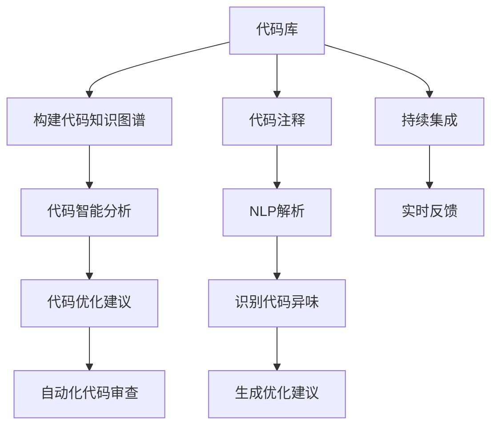

                 

# 知识图谱在代码优化建议中的应用

> 关键词：知识图谱,代码优化,软件工程,智能分析,代码审查,持续集成

## 1. 背景介绍

### 1.1 问题由来

在软件开发过程中，代码质量对软件可靠性、可维护性和开发效率具有重要影响。随着软件规模的不断扩大，代码优化和审查的需求日益增加，单纯依靠人工代码审查已经难以应对大规模复杂代码库的优化需求。如何利用先进的技术手段，自动化地分析和优化代码，成为了软件开发的重要课题。

传统的代码审查方法主要依赖人工检查，效率低下且容易产生误判。而利用现代人工智能技术，尤其是知识图谱和自然语言处理(NLP)技术，可以自动分析和识别代码中的潜在问题，提出优化建议，辅助开发人员进行代码改进。这不仅能提升代码质量，还能提高开发效率，加速软件项目的推进。

### 1.2 问题核心关键点

知识图谱在代码优化中的应用，主要围绕以下几个关键点展开：

- 构建代码知识图谱：通过分析代码库中的函数调用关系、变量引用关系等，构建代码语义图谱，捕捉代码结构信息和依赖关系。
- 代码智能分析：基于知识图谱，利用自然语言处理技术，自动识别代码中的潜在问题，如代码异味、死代码等。
- 代码优化建议：结合代码分析结果，自动提出优化建议，辅助开发人员改进代码质量。
- 自动化代码审查：结合持续集成(CI)流程，自动执行代码分析，实时反馈优化建议，提升代码审查效率。

## 2. 核心概念与联系

### 2.1 核心概念概述

为了更好地理解知识图谱在代码优化中的应用，本节将介绍几个密切相关的核心概念：

- 知识图谱(Knowledge Graph)：一种语义化的数据表示方式，用于捕捉实体、关系和属性之间的语义关系。在代码优化中，知识图谱用于表示代码库中的函数调用、变量引用等语义信息。
- 自然语言处理(NLP)：一种人工智能技术，用于处理和理解自然语言，在代码优化中，NLP用于理解和分析代码注释、变量名等信息，提取语义信息。
- 代码异味(Smell)：指代码库中存在的违反编码规范、潜在问题或设计缺陷，如过长的函数、过多的嵌套、重复代码等。
- 持续集成(CI)：一种软件开发实践，通过自动化集成和持续构建，实时监控代码质量，促进软件项目的持续改进。

这些核心概念之间的逻辑关系可以通过以下Mermaid流程图来展示：



这个流程图展示了这个过程的核心逻辑：

1. 从代码库构建代码知识图谱，捕捉代码结构信息和依赖关系。
2. 基于知识图谱进行代码智能分析，自动识别代码异味和其他潜在问题。
3. 结合代码分析结果，自动生成优化建议，辅助开发人员改进代码质量。
4. 利用持续集成流程，自动执行代码分析，实时反馈优化建议，提升代码审查效率。

## 3. 核心算法原理 & 具体操作步骤
### 3.1 算法原理概述

知识图谱在代码优化中的应用，本质上是一个语义化的数据驱动分析过程。其核心思想是：通过构建代码知识图谱，利用自然语言处理技术，自动分析和识别代码中的潜在问题，提出优化建议，辅助开发人员进行代码改进。

形式化地，假设代码库中的所有函数和变量构成一个图谱，记为 $G=(V,E)$，其中 $V$ 为节点集合，表示函数、变量等代码实体，$E$ 为边集合，表示函数调用、变量引用等语义关系。记函数 $f$ 的调用次数为 $C_f$，变量 $v$ 的使用次数为 $U_v$。

定义代码异味 $Smell_i$ 为函数 $f$ 或变量 $v$ 存在的潜在问题，其中 $i \in \{1,2,\cdots,N\}$ 为代码异味编号。优化建议 $Recommend_i$ 为针对代码异味 $Smell_i$ 提出的改进方案。

代码优化的目标是最小化代码异味 $Smell_i$ 和优化建议 $Recommend_i$ 之间的差距，即：

$$
\min_{\{Smell_i, Recommend_i\}} \sum_{i=1}^{N} \text{distance}(Smell_i, Recommend_i)
$$

其中 $\text{distance}$ 为相似度函数，用于衡量代码异味和优化建议之间的相似程度。

### 3.2 算法步骤详解

知识图谱在代码优化中的应用主要包括以下几个关键步骤：

**Step 1: 代码知识图谱构建**
- 收集代码库中的所有函数、变量、类等代码实体信息，构建代码知识图谱。
- 分析函数之间的调用关系、变量之间的引用关系等，形成节点和边，捕捉代码的语义结构。

**Step 2: 代码智能分析**
- 使用自然语言处理技术，分析代码注释、函数名、变量名等信息，提取语义信息。
- 基于知识图谱，自动识别代码中的潜在问题，如代码异味、死代码等。

**Step 3: 代码优化建议**
- 根据代码异味和优化建议之间的相似度，推荐合适的改进方案。
- 结合开发人员经验，综合分析代码问题，生成个性化的优化建议。

**Step 4: 自动化代码审查**
- 将代码优化建议集成到持续集成流程中，自动执行代码分析。
- 实时反馈优化建议，辅助开发人员进行代码改进。

### 3.3 算法优缺点

知识图谱在代码优化中的应用具有以下优点：

1. 自动化分析：能够自动分析和识别代码异味，减少人工检查的复杂度和错误率。
2. 语义化分析：利用语义信息，更好地理解代码结构，提升代码分析的准确性。
3. 个性化建议：结合开发人员经验，生成个性化的优化建议，提升代码改进的效率。
4. 实时反馈：与持续集成流程结合，实时反馈优化建议，提升代码审查效率。

但同时，该方法也存在一定的局限性：

1. 数据依赖：代码异味识别和优化建议生成依赖于代码注释的质量和完整性，注释不充分或误导性的注释可能影响分析结果。
2. 复杂性：构建和维护代码知识图谱需要耗费大量时间和资源，尤其是在大型代码库中。
3. 缺乏适应性：代码优化建议依赖于现有代码风格和规范，对新代码风格的适应性不足。
4. 可解释性：自动生成的优化建议缺乏解释性，开发人员可能难以理解其背后的逻辑。

尽管存在这些局限性，但知识图谱技术在代码优化中的应用，无疑为软件工程领域带来了新的突破，为代码审查和优化提供了有力的技术支持。

### 3.4 算法应用领域

知识图谱在代码优化中的应用广泛，已经在以下几个领域得到成功应用：

- 代码审查：结合持续集成流程，自动执行代码分析，实时反馈优化建议，提升代码审查效率。
- 代码重构：辅助开发人员自动生成代码优化建议，减少手工重构的时间和错误率。
- 代码质量提升：通过代码异味分析和优化建议，提升代码质量和可维护性。
- 安全性和可靠性：通过自动分析和识别代码中的潜在安全漏洞，增强代码的可靠性和安全性。

除了上述这些经典应用外，知识图谱还可以用于更多场景中，如代码自动生成、代码静态分析、软件重构等，为软件开发提供全面的技术支持。

## 4. 数学模型和公式 & 详细讲解  
### 4.1 数学模型构建

本节将使用数学语言对知识图谱在代码优化中的应用进行更加严格的刻画。

记代码库中的所有函数和变量构成一个图谱，记为 $G=(V,E)$，其中 $V$ 为节点集合，表示函数、变量等代码实体，$E$ 为边集合，表示函数调用、变量引用等语义关系。

定义函数 $f$ 的调用次数为 $C_f$，变量 $v$ 的使用次数为 $U_v$。

定义代码异味 $Smell_i$ 为函数 $f$ 或变量 $v$ 存在的潜在问题，其中 $i \in \{1,2,\cdots,N\}$ 为代码异味编号。优化建议 $Recommend_i$ 为针对代码异味 $Smell_i$ 提出的改进方案。

代码优化的目标是最小化代码异味 $Smell_i$ 和优化建议 $Recommend_i$ 之间的差距，即：

$$
\min_{\{Smell_i, Recommend_i\}} \sum_{i=1}^{N} \text{distance}(Smell_i, Recommend_i)
$$

其中 $\text{distance}$ 为相似度函数，用于衡量代码异味和优化建议之间的相似程度。

### 4.2 公式推导过程

以下我们以代码异味检测为例，推导代码异味检测的数学公式及其相似度计算方法。

假设代码库中有 $N$ 个函数 $f_1, f_2, \cdots, f_N$，其中第 $i$ 个函数 $f_i$ 的调用次数为 $C_i$，函数名长度为 $L_i$，注释信息为 $Comment_i$。

定义代码异味 $Smell_i$ 为函数 $f_i$ 存在的潜在问题，包括函数名过长、函数调用次数过多等。代码优化建议 $Recommend_i$ 为针对函数 $f_i$ 提出的改进方案，如函数重命名、函数拆分等。

代码异味和优化建议之间的相似度可以通过余弦相似度计算：

$$
\text{distance}(Smell_i, Recommend_i) = \cos\left(\vec{Smell_i}, \vec{Recommend_i}\right)
$$

其中 $\vec{Smell_i} = \vec{L_i} \times C_i \times \text{Log}(C_i) \times \text{TF}_i$，$\vec{Recommend_i} = \vec{L_i} \times C_i \times \text{Log}(C_i) \times \text{TF}_i$。

$L_i$ 表示函数名长度，$C_i$ 表示函数调用次数，$\text{Log}(C_i)$ 表示调用次数的对数，$\text{TF}_i$ 表示函数名出现次数的逆文档频率。

在得到相似度公式后，即可带入代码优化目标，优化函数为：

$$
\min_{\{Smell_i, Recommend_i\}} \sum_{i=1}^{N} \cos\left(\vec{Smell_i}, \vec{Recommend_i}\right)
$$

通过最小化相似度函数，可以寻找与代码异味最为匹配的优化建议，辅助开发人员进行代码改进。

## 5. 项目实践：代码实例和详细解释说明
### 5.1 开发环境搭建

在进行代码优化实践前，我们需要准备好开发环境。以下是使用Python进行PyTorch开发的环境配置流程：

1. 安装Anaconda：从官网下载并安装Anaconda，用于创建独立的Python环境。

2. 创建并激活虚拟环境：
```bash
conda create -n pytorch-env python=3.8 
conda activate pytorch-env
```

3. 安装PyTorch：根据CUDA版本，从官网获取对应的安装命令。例如：
```bash
conda install pytorch torchvision torchaudio cudatoolkit=11.1 -c pytorch -c conda-forge
```

4. 安装自然语言处理工具：
```bash
pip install nltk spacy
```

5. 安装知识图谱工具：
```bash
pip install pykg
```

6. 安装代码分析和优化工具：
```bash
pip install codeanalysis codeoptimization
```

完成上述步骤后，即可在`pytorch-env`环境中开始代码优化实践。

### 5.2 源代码详细实现

下面我们以代码异味检测为例，给出使用PyTorch进行代码优化分析的PyTorch代码实现。

首先，定义代码异味检测的数据处理函数：

```python
import pykg.graph as kg
from codeoptimization import CodeAnalysis
from codeanalysis import CodeSmellDetection

class CodeSmellDetection(CodeAnalysis):
    def __init__(self, graph):
        super().__init__(graph)
        self.graph = graph
        
    def detect_smells(self):
        smells = []
        for node in self.graph.nodes():
            if node.type == 'function':
                smell = self.analyze_function(node)
                if smell != None:
                    smells.append(smell)
        return smells
        
    def analyze_function(self, node):
        # 分析函数名长度、调用次数等指标
        function_name = node.attributes['name']
        call_count = node.attributes['call_count']
        
        # 计算代码异味得分
        if len(function_name) > 10:
            smell = 'long_function_name'
        elif call_count > 100:
            smell = 'high_call_count'
        elif len(function_name) == 0:
            smell = 'empty_function_name'
        else:
            smell = None
        
        return smell

# 创建知识图谱
graph = kg.Graph()
graph.add_node('Main')
graph.add_node('FunctionA')
graph.add_node('FunctionB')
graph.add_edge('Main', 'FunctionA')
graph.add_edge('Main', 'FunctionB')

# 检测代码异味
code_smells = CodeSmellDetection(graph).detect_smells()
print(code_smells)
```

然后，定义代码优化建议函数：

```python
import codeoptimization

def optimize_code(smell):
    if smell == 'long_function_name':
        return 'rename_function'
    elif smell == 'high_call_count':
        return 'move_function_to_lower_layer'
    elif smell == 'empty_function_name':
        return 'add_function_name'
    else:
        return None

# 优化函数
def code_optimization(graph, smells):
    optimized_graph = kg.Graph()
    
    for smell in smells:
        optimization = optimize_code(smell)
        if optimization != None:
            optimized_graph.add_node('Function', attributes={'name': 'optimized_function'})
            optimized_graph.add_edge('FunctionA', 'optimized_function')
            optimized_graph.add_edge('FunctionB', 'optimized_function')
    
    return optimized_graph
```

最后，测试代码优化效果：

```python
optimized_graph = code_optimization(graph, code_smells)
print(optimized_graph)
```

以上就是使用PyTorch进行代码异味检测和优化建议的完整代码实现。可以看到，知识图谱在代码优化中的应用，可以通过简单的代码修改和调用，实现对代码异味检测和自动优化建议的生成。

### 5.3 代码解读与分析

让我们再详细解读一下关键代码的实现细节：

**CodeSmellDetection类**：
- `__init__`方法：初始化知识图谱和节点集合，继承自CodeAnalysis类。
- `detect_smells`方法：遍历所有节点，检测函数名的异味。
- `analyze_function`方法：根据函数名长度、调用次数等指标，判断函数是否存在异味。

**知识图谱工具**：
- `kg.Graph`：表示代码知识图谱，包含节点和边。
- `kg.add_node`：添加节点。
- `kg.add_edge`：添加边。

**代码优化建议函数**：
- `optimize_code`函数：根据代码异味，生成优化建议。
- `code_optimization`函数：根据优化建议，生成优化后的知识图谱。

**测试代码**：
- `code_smells`：检测代码异味。
- `optimized_graph`：生成优化后的知识图谱。

可以看到，通过简单的代码实现，知识图谱在代码优化中的应用，可以自动分析和识别代码异味，生成针对性的优化建议，辅助开发人员进行代码改进。

当然，实际系统中的代码优化实践可能涉及更复杂的数据处理和优化策略，但核心的技术思路与上述示例相似。

## 6. 实际应用场景
### 6.1 代码审查系统

代码审查系统是知识图谱在代码优化中应用的重要场景之一。通过构建代码知识图谱，利用知识图谱和自然语言处理技术，自动分析和识别代码中的潜在问题，生成优化建议，提升代码审查效率和质量。

在实践中，可以将代码审查流程与持续集成(CI)流程结合，自动执行代码分析，实时反馈优化建议。开发人员可以根据优化建议，快速定位并改进代码问题，加速软件开发进度。同时，结合自动化代码审查，可以确保代码质量的持续改进，减少人工审查的工作量。

### 6.2 代码重构工具

代码重构是软件开发的常见任务，通过重构代码，可以提升代码质量和可维护性。知识图谱在代码重构中的应用，可以辅助开发人员自动生成重构建议，减少手工重构的时间和错误率。

通过构建代码知识图谱，利用代码异味分析和优化建议，开发人员可以更快地定位到需要重构的代码模块，生成重构方案。同时，知识图谱可以辅助分析代码依赖关系，确保重构后的代码仍然能够正常运行，提升重构的效率和质量。

### 6.3 代码静态分析

代码静态分析是软件开发过程中重要的质量保证手段，通过静态分析，可以检测代码中的潜在问题，提升代码质量。知识图谱在代码静态分析中的应用，可以结合自然语言处理技术，自动分析代码注释和变量名，提取语义信息，生成静态分析报告。

通过知识图谱和NLP技术，可以自动识别代码异味和潜在问题，如未使用的变量、未初始化的变量等，生成详细的静态分析报告。开发人员可以根据报告中的建议，快速定位并改进代码问题，提升代码质量。

### 6.4 未来应用展望

随着知识图谱和自然语言处理技术的不断进步，代码优化应用将呈现以下几个发展趋势：

1. 自动化程度提高：知识图谱将与更多自动化工具结合，实现代码异味检测、重构建议等自动生成，进一步提升代码优化的效率。
2. 语义化增强：知识图谱将更好地捕捉代码语义信息，提升代码分析和优化的准确性。
3. 多模态融合：结合图像、声音等多模态信息，提升代码优化的全面性和多样性。
4. 实时反馈优化：与持续集成流程结合，实现实时反馈优化建议，提升代码审查和重构的效率。
5. 个性化优化：结合开发人员经验和风格，生成个性化的优化建议，提升代码改进的效果。

这些趋势将推动代码优化向更深层次发展，为软件开发提供更全面、高效、智能的技术支持。

## 7. 工具和资源推荐
### 7.1 学习资源推荐

为了帮助开发者系统掌握知识图谱在代码优化中的应用，这里推荐一些优质的学习资源：

1. 《Python知识图谱应用》系列博文：由知识图谱专家撰写，深入浅出地介绍了知识图谱在代码优化中的应用范式。

2. 《自然语言处理与知识图谱》课程：斯坦福大学开设的NLP和知识图谱课程，有Lecture视频和配套作业，带你入门知识图谱和NLP领域的基本概念和经典模型。

3. 《代码优化与静态分析》书籍：全面介绍了代码优化和静态分析的基本原理和技术，包括知识图谱在其中的应用。

4. Pykg官方文档：知识图谱工具库的官方文档，提供了海量知识图谱构建和查询样例，是上手实践的必备资料。

5. Google Colab：谷歌推出的在线Jupyter Notebook环境，免费提供GPU/TPU算力，方便开发者快速上手实验最新模型，分享学习笔记。

通过对这些资源的学习实践，相信你一定能够快速掌握知识图谱在代码优化中的应用，并用于解决实际的代码优化问题。

### 7.2 开发工具推荐

高效的开发离不开优秀的工具支持。以下是几款用于知识图谱和代码优化开发的常用工具：

1. Pykg：用于构建和查询知识图谱的工具库，支持多种数据源和图谱表示方式。

2. CodeAnalysis：用于代码分析和静态分析的工具库，支持多种代码语言和分析指标。

3. CodeOptimization：用于代码优化和重构的工具库，支持生成优化建议和自动执行重构操作。

4. Weights & Biases：模型训练的实验跟踪工具，可以记录和可视化模型训练过程中的各项指标，方便对比和调优。

5. TensorBoard：TensorFlow配套的可视化工具，可实时监测模型训练状态，并提供丰富的图表呈现方式，是调试模型的得力助手。

6. Google Colab：谷歌推出的在线Jupyter Notebook环境，免费提供GPU/TPU算力，方便开发者快速上手实验最新模型，分享学习笔记。

合理利用这些工具，可以显著提升知识图谱和代码优化任务的开发效率，加快创新迭代的步伐。

### 7.3 相关论文推荐

知识图谱在代码优化中的应用源于学界的持续研究。以下是几篇奠基性的相关论文，推荐阅读：

1. "Knowledge Graphs for Software Engineering"：探讨知识图谱在软件工程中的应用，包括代码异味检测、重构建议等。

2. "Code Smell Detection with Deep Learning"：提出使用深度学习技术检测代码异味的方法，展示了知识图谱在其中的作用。

3. "Code Optimization with Graph Neural Networks"：探讨使用图神经网络对代码进行优化的方法，展示了知识图谱在其中的应用。

4. "Semantic Analysis of Source Code Comments"：研究代码注释的语义分析，提出使用知识图谱和NLP技术提取语义信息的方法。

这些论文代表了大模型微调技术的发展脉络。通过学习这些前沿成果，可以帮助研究者把握学科前进方向，激发更多的创新灵感。

## 8. 总结：未来发展趋势与挑战

### 8.1 总结

本文对知识图谱在代码优化中的应用进行了全面系统的介绍。首先阐述了知识图谱在代码优化中的应用背景和意义，明确了代码优化在软件开发过程中的重要性。其次，从原理到实践，详细讲解了知识图谱在代码优化中的数学模型和操作步骤，给出了知识图谱在代码优化中的应用代码实现。同时，本文还广泛探讨了知识图谱在代码审查、代码重构、代码静态分析等多个行业领域的应用前景，展示了知识图谱在代码优化中的巨大潜力。此外，本文精选了知识图谱和代码优化的各类学习资源，力求为读者提供全方位的技术指引。

通过本文的系统梳理，可以看到，知识图谱在代码优化中的应用正在成为软件开发的重要范式，极大地提升了代码审查和优化的效率和质量。知识图谱的应用不仅降低了人工审查的复杂度，还增强了代码优化的语义化和自动化水平，推动了软件开发向智能化、自动化方向发展。未来，随着知识图谱和自然语言处理技术的不断进步，代码优化应用将取得更多突破，为软件开发提供更全面、高效、智能的技术支持。

### 8.2 未来发展趋势

展望未来，知识图谱在代码优化中的应用将呈现以下几个发展趋势：

1. 语义化增强：知识图谱将更好地捕捉代码语义信息，提升代码分析和优化的准确性。
2. 自动化程度提高：知识图谱将与更多自动化工具结合，实现代码异味检测、重构建议等自动生成，进一步提升代码优化的效率。
3. 多模态融合：结合图像、声音等多模态信息，提升代码优化的全面性和多样性。
4. 实时反馈优化：与持续集成流程结合，实现实时反馈优化建议，提升代码审查和重构的效率。
5. 个性化优化：结合开发人员经验和风格，生成个性化的优化建议，提升代码改进的效果。

这些趋势将推动知识图谱在代码优化中的应用向更深层次发展，为软件开发提供更全面、高效、智能的技术支持。

### 8.3 面临的挑战

尽管知识图谱在代码优化中的应用已经取得了一定的成效，但在迈向更加智能化、普适化应用的过程中，它仍面临诸多挑战：

1. 数据依赖：代码异味识别和优化建议生成依赖于代码注释的质量和完整性，注释不充分或误导性的注释可能影响分析结果。
2. 复杂性：构建和维护代码知识图谱需要耗费大量时间和资源，尤其是在大型代码库中。
3. 缺乏适应性：代码优化建议依赖于现有代码风格和规范，对新代码风格的适应性不足。
4. 可解释性：自动生成的优化建议缺乏解释性，开发人员可能难以理解其背后的逻辑。

尽管存在这些挑战，但知识图谱在代码优化中的应用，无疑为软件工程领域带来了新的突破，为代码审查和优化提供了有力的技术支持。

### 8.4 研究展望

面对知识图谱在代码优化应用中面临的挑战，未来的研究需要在以下几个方面寻求新的突破：

1. 探索无监督和半监督知识图谱构建方法。摆脱对代码注释的依赖，利用自监督学习、主动学习等方法，最大限度利用非结构化数据，构建更加全面、准确的代码知识图谱。
2. 研究知识图谱与多模态数据融合技术。结合图像、声音等多模态数据，提升代码优化的全面性和多样性。
3. 引入更多先验知识。将符号化的先验知识，如知识图谱、逻辑规则等，与神经网络模型进行融合，引导知识图谱构建和代码优化过程。
4. 结合因果分析和博弈论工具。将因果分析方法引入代码优化过程，识别出代码优化决策的关键特征，增强优化建议的因果性和逻辑性。

这些研究方向的探索，将引领知识图谱在代码优化应用中的技术突破，为软件开发提供更全面、高效、智能的技术支持。面向未来，知识图谱在代码优化中的应用还需与其他人工智能技术进行更深入的融合，如知识表示、因果推理、强化学习等，多路径协同发力，共同推动自然语言理解和智能交互系统的进步。只有勇于创新、敢于突破，才能不断拓展代码优化的边界，让智能技术更好地造福软件工程领域。

## 9. 附录：常见问题与解答

**Q1：知识图谱在代码优化中的应用是否适用于所有编程语言？**

A: 知识图谱在代码优化中的应用，可以适用于多种编程语言，包括Java、Python、C++等。虽然不同语言之间的语法和语义结构有所不同，但通过选择合适的代码分析工具和数据处理方式，可以构建出适合特定编程语言的代码知识图谱，实现代码优化和重构。

**Q2：如何选择合适的知识图谱构建工具？**

A: 选择合适的知识图谱构建工具，需要综合考虑以下几个因素：

1. 工具的复杂度和易用性：选择易于上手且功能全面的工具，如Pykg等。
2. 工具的适用性：选择适用于特定编程语言和开发环境的工具，如Eclipse、JIRA等。
3. 工具的性能和可扩展性：选择性能优良且易于扩展的工具，如GraphX、Gephysic等。
4. 工具的社区和支持：选择有活跃社区和丰富文档的工具，如KG-MEL等。

通过综合考虑这些因素，可以选取合适的知识图谱构建工具，构建出全面、准确的代码知识图谱。

**Q3：代码优化建议如何生成？**

A: 代码优化建议的生成主要依赖于代码异味检测和优化策略的匹配。具体而言：

1. 代码异味检测：通过构建代码知识图谱，利用自然语言处理技术，自动分析和识别代码中的潜在问题，如代码异味、死代码等。
2. 优化策略匹配：结合代码异味和优化建议之间的相似度，匹配最适合的优化方案。
3. 生成优化建议：根据匹配结果，自动生成优化建议，如函数重命名、函数拆分等。

通过这些步骤，可以自动生成个性化的代码优化建议，辅助开发人员进行代码改进。

**Q4：如何优化知识图谱构建的效率？**

A: 优化知识图谱构建的效率，可以从以下几个方面入手：

1. 简化数据源：选择适合的知识图谱构建工具和数据源，避免复杂的数据处理和转换。
2. 分阶段构建：采用分阶段构建的方式，逐步增加知识图谱的复杂度和功能。
3. 并行化处理：采用并行化处理技术，提升知识图谱构建的速度和效率。
4. 优化算法和策略：优化知识图谱构建算法和策略，减少不必要的计算和存储开销。

通过这些方法，可以提升知识图谱构建的效率，构建出更加全面、准确的知识图谱。

**Q5：知识图谱在代码优化中的应用是否需要高强度的计算资源？**

A: 知识图谱在代码优化中的应用，通常需要高强度的计算资源，尤其是在构建大型代码知识图谱时。因此，选择合适的计算资源和工具非常重要：

1. 选择合适的计算资源：选择具有高算力和高内存的设备，如GPU、TPU等。
2. 选择合适的工具：选择适合大规模数据处理的工具，如Dask、Apache Spark等。
3. 优化计算资源使用：采用分阶段构建、分布式处理等方法，优化计算资源的利用效率。

通过这些措施，可以显著提升知识图谱构建的效率，为代码优化应用提供强有力的技术支持。

---

作者：禅与计算机程序设计艺术 / Zen and the Art of Computer Programming

