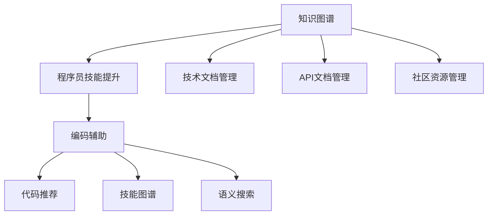

                 

# 知识图谱在程序员技能提升中的应用

> 关键词：知识图谱, 程序员技能提升, 编程辅助, 代码推荐, 技能图谱, 语义搜索

## 1. 背景介绍

在现代社会，信息技术的发展与普及使得程序员的需求日益增加。然而，由于编程工作的复杂性和技术更新速度的加快，许多程序员面临技术栈繁多、知识更新快、问题解决困难等问题。这些问题的解决需要高效的学习资源、准确的文档参考资料和及时的社区支持。知识图谱作为一种结构化、语义化的知识表示方式，具备强大的信息检索和知识发现能力，能够有效提升程序员的技能水平。

本文章将从知识图谱的基本概念和原理出发，深入探讨其在程序员技能提升中的应用，包括编码辅助、代码推荐、技能图谱和语义搜索等方面。文章结构清晰，涉及核心算法原理、具体操作步骤以及实际应用案例，旨在为读者提供系统、全面的知识图谱应用实践指导。

## 2. 核心概念与联系

### 2.1 核心概念概述

#### 2.1.1 知识图谱(Knowledge Graph)
知识图谱是一种结构化、语义化的知识表示方式，用于描述和组织实体及实体之间的关系。知识图谱由节点和边构成，其中节点代表实体，边代表实体之间的关系。知识图谱广泛应用于知识管理、自然语言处理、搜索引擎等领域，能够帮助用户进行知识发现、实体关系推断和语义搜索等。

#### 2.1.2 程序员技能提升(Programming Skill Enhancement)
程序员技能提升是指通过有效的方法和技术手段，帮助程序员快速学习新知识、提升编程技能和解决实际问题的过程。常见的技能提升方式包括在线学习、技能培训、社区交流等。

#### 2.1.3 编码辅助(Programming Aid)
编码辅助指的是通过智能工具和自动化技术，提升程序员的编程效率和质量。编码辅助工具包括代码补全、语法检查、自动重构、代码审查等。

#### 2.1.4 代码推荐(Code Recommendation)
代码推荐是智能编程辅助的一种，通过分析代码库和历史记录，为程序员提供最优的代码片段、函数调用和API选择。代码推荐可以显著提高编程效率，减少代码重复编写和错误。

#### 2.1.5 技能图谱(Skill Graph)
技能图谱是一种结构化的技能知识表示方式，用于描述和组织程序员掌握的各类技能及其关联关系。技能图谱能够帮助程序员发现技能缺失，进行技能学习路径规划。

#### 2.1.6 语义搜索(Semantic Search)
语义搜索指的是通过理解查询文本的语义，检索出与查询最相关的实体和关系，提供准确的信息检索结果。语义搜索能够帮助程序员快速找到有用的技术文档、API文档和社区资源。

### 2.2 核心概念原理和架构的 Mermaid 流程图



此流程图展示了知识图谱与其他核心概念之间的联系和应用关系。知识图谱通过连接技术文档、API文档和社区资源，为程序员提供了编码辅助、代码推荐、技能图谱和语义搜索等多方面的支持。

## 3. 核心算法原理 & 具体操作步骤

### 3.1 算法原理概述

#### 3.1.1 知识图谱构建算法
知识图谱的构建通常包括以下步骤：
1. 实体抽取：从大量文本中抽取实体，如人名、地名、技术术语等。
2. 关系抽取：识别实体之间的关系，如“是”、“属于”、“被”等。
3. 实体链接：将抽取的实体与已有的知识库进行链接，确保数据的准确性和一致性。
4. 关系推理：利用逻辑规则和推理算法，推断新的实体和关系。

#### 3.1.2 编码辅助算法
编码辅助算法通常包括：
1. 语法检查：通过静态分析，检测代码中的语法错误和潜在的错误。
2. 代码补全：根据上下文提示，自动推荐代码片段和函数调用。
3. 代码重构：自动化重构代码，提高代码质量和可维护性。
4. 代码审查：通过代码审查工具，提高代码质量和一致性。

#### 3.1.3 代码推荐算法
代码推荐算法通常包括：
1. 相似度计算：计算代码片段的相似度，推荐与已有代码相似的代码。
2. 历史数据分析：分析代码库和历史记录，发现最优的代码片段和函数调用。
3. 模型训练：训练推荐模型，如协同过滤、深度学习等，提高代码推荐的准确性。

#### 3.1.4 技能图谱构建算法
技能图谱的构建通常包括以下步骤：
1. 技能抽取：从技术文档、API文档和社区资源中抽取技能信息。
2. 技能关系抽取：识别技能之间的关联关系，如“依赖”、“拓展”、“替代”等。
3. 技能图谱构建：将技能和技能关系构建为图谱结构，形成结构化的技能知识表示。

#### 3.1.5 语义搜索算法
语义搜索算法通常包括：
1. 查询文本解析：将查询文本分解为实体和关系，理解查询意图。
2. 图谱匹配：在知识图谱中匹配查询实体和关系，提供相关的实体和关系。
3. 结果排序：根据匹配的准确度和相关性，对搜索结果进行排序。

### 3.2 算法步骤详解

#### 3.2.1 知识图谱构建
1. **实体抽取**：使用自然语言处理（NLP）技术，如命名实体识别（NER）和词向量表示（Word Embedding），从技术文档、API文档和社区资源中抽取实体。
2. **关系抽取**：使用规则和机器学习技术，识别实体之间的关系，如“是”、“属于”、“被”等。
3. **实体链接**：将抽取的实体与已有的知识库进行链接，确保数据的准确性和一致性。
4. **关系推理**：利用逻辑规则和推理算法，推断新的实体和关系。

#### 3.2.2 编码辅助
1. **语法检查**：使用静态分析技术，检测代码中的语法错误和潜在的错误。
2. **代码补全**：根据上下文提示，自动推荐代码片段和函数调用，提高编程效率。
3. **代码重构**：使用自动化重构工具，重构代码，提高代码质量和可维护性。
4. **代码审查**：通过代码审查工具，提高代码质量和一致性，保证代码的可维护性。

#### 3.2.3 代码推荐
1. **相似度计算**：计算代码片段的相似度，推荐与已有代码相似的代码，提高代码的复用性。
2. **历史数据分析**：分析代码库和历史记录，发现最优的代码片段和函数调用，提高代码推荐的准确性。
3. **模型训练**：使用协同过滤、深度学习等模型，训练推荐模型，提高代码推荐的准确性。

#### 3.2.4 技能图谱构建
1. **技能抽取**：从技术文档、API文档和社区资源中抽取技能信息，形成技能知识库。
2. **技能关系抽取**：识别技能之间的关联关系，如“依赖”、“拓展”、“替代”等，形成技能图谱。
3. **技能图谱构建**：将技能和技能关系构建为图谱结构，形成结构化的技能知识表示。

#### 3.2.5 语义搜索
1. **查询文本解析**：将查询文本分解为实体和关系，理解查询意图。
2. **图谱匹配**：在知识图谱中匹配查询实体和关系，提供相关的实体和关系。
3. **结果排序**：根据匹配的准确度和相关性，对搜索结果进行排序，提供准确的搜索结果。

### 3.3 算法优缺点

#### 3.3.1 知识图谱构建算法的优缺点
**优点**：
- 结构化、语义化的知识表示方式，便于理解和查询。
- 能够发现实体和关系之间的复杂关联。
- 支持大规模知识管理。

**缺点**：
- 构建和维护成本高，需要大量的人工和资源。
- 数据质量和一致性问题可能影响图谱的准确性。

#### 3.3.2 编码辅助算法的优缺点
**优点**：
- 提高编程效率和质量，减少错误。
- 自动化工具支持，降低编程门槛。

**缺点**：
- 部分算法依赖静态分析，无法处理动态变化的情况。
- 无法完全代替程序员的思考和决策。

#### 3.3.3 代码推荐算法的优缺点
**优点**：
- 提高编程效率，减少重复编写代码。
- 支持个性化推荐，符合程序员的编码风格和习惯。

**缺点**：
- 推荐算法依赖历史数据，可能存在数据偏差。
- 需要不断更新和维护推荐模型。

#### 3.3.4 技能图谱构建算法的优缺点
**优点**：
- 结构化的技能知识表示，便于理解和应用。
- 能够发现技能之间的关联关系，提供技能学习路径规划。

**缺点**：
- 构建和维护成本高，需要大量的人工和资源。
- 技能知识库需要不断更新和维护。

#### 3.3.5 语义搜索算法的优缺点
**优点**：
- 能够理解查询文本的语义，提供准确的搜索结果。
- 支持多种查询方式，灵活多样。

**缺点**：
- 语义搜索技术复杂，需要大量的计算资源。
- 对查询文本的质量要求高，可能存在语义误解。

### 3.4 算法应用领域

知识图谱和程序员技能提升技术已经在多个领域得到应用，包括软件开发、技术文档管理、API文档管理、社区资源管理等。

#### 3.4.1 软件开发
知识图谱在软件开发中的应用包括：
- 编码辅助：使用语法检查、代码补全、代码重构等工具，提高编程效率和质量。
- 代码推荐：根据历史代码库和代码片段，推荐最优的代码片段和函数调用，提高代码的复用性。

#### 3.4.2 技术文档管理
技术文档管理包括：
- 技术文档抽取：从技术文档、API文档和社区资源中抽取技能信息，构建技能图谱。
- 技能图谱构建：将技能和技能关系构建为图谱结构，形成结构化的技能知识表示。

#### 3.4.3 API文档管理
API文档管理包括：
- 技能抽取：从技术文档、API文档和社区资源中抽取技能信息，构建技能图谱。
- 技能图谱构建：将技能和技能关系构建为图谱结构，形成结构化的技能知识表示。

#### 3.4.4 社区资源管理
社区资源管理包括：
- 技能抽取：从技术文档、API文档和社区资源中抽取技能信息，构建技能图谱。
- 技能图谱构建：将技能和技能关系构建为图谱结构，形成结构化的技能知识表示。

## 4. 数学模型和公式 & 详细讲解 & 举例说明

### 4.1 数学模型构建

#### 4.1.1 知识图谱构建的数学模型
知识图谱的构建通常使用图形表示法，即节点和边构成的图结构。节点表示实体，边表示实体之间的关系。节点和边的权重可以表示实体和关系的权重，用于衡量其重要性和相关性。

#### 4.1.2 编码辅助的数学模型
编码辅助的数学模型通常包括语法检查模型、代码补全模型和代码重构模型。这些模型可以通过机器学习、规则引擎和启发式算法来实现。

#### 4.1.3 代码推荐的数学模型
代码推荐的数学模型通常包括协同过滤模型和深度学习模型。协同过滤模型通过计算代码片段之间的相似度，推荐与已有代码相似的代码。深度学习模型使用神经网络模型，从代码库和历史记录中学习最优的代码片段和函数调用。

#### 4.1.4 技能图谱构建的数学模型
技能图谱的构建通常使用图结构表示法，即节点和边构成的图结构。节点表示技能，边表示技能之间的关系，如“依赖”、“拓展”、“替代”等。节点和边的权重可以表示技能和技能关系的权重，用于衡量其重要性和相关性。

#### 4.1.5 语义搜索的数学模型
语义搜索的数学模型通常包括实体关系抽取模型和图谱匹配模型。实体关系抽取模型通过识别查询文本中的实体和关系，理解查询意图。图谱匹配模型在知识图谱中匹配查询实体和关系，提供相关的实体和关系。

### 4.2 公式推导过程

#### 4.2.1 知识图谱构建的公式推导
知识图谱的构建公式如下：
\[ G = (V, E, R) \]
其中：
- \( V \) 表示节点集合，即实体集合。
- \( E \) 表示边集合，即实体之间的关系集合。
- \( R \) 表示关系的集合，如“是”、“属于”、“被”等。

#### 4.2.2 编码辅助的公式推导
编码辅助的公式推导如下：
\[ L = f(\text{代码}, \text{语法规则}, \text{上下文}) \]
其中：
- \( L \) 表示代码的语义，即代码的可读性和正确性。
- \( f \) 表示语法检查和代码补全的计算函数。
- \( \text{代码} \) 表示程序员编写的代码。
- \( \text{语法规则} \) 表示编程语言的语法规则。
- \( \text{上下文} \) 表示代码的上下文信息。

#### 4.2.3 代码推荐的公式推导
代码推荐的公式推导如下：
\[ R = g(\text{代码库}, \text{历史记录}, \text{用户偏好}) \]
其中：
- \( R \) 表示推荐结果，即最优的代码片段和函数调用。
- \( g \) 表示代码推荐的计算函数。
- \( \text{代码库} \) 表示程序员编写的代码库。
- \( \text{历史记录} \) 表示程序员的历史代码记录。
- \( \text{用户偏好} \) 表示程序员的编程风格和习惯。

#### 4.2.4 技能图谱构建的公式推导
技能图谱的构建公式如下：
\[ G = (S, R', C) \]
其中：
- \( S \) 表示技能节点集合。
- \( R' \) 表示技能关系集合，如“依赖”、“拓展”、“替代”等。
- \( C \) 表示技能之间的权重集合。

#### 4.2.5 语义搜索的公式推导
语义搜索的公式推导如下：
\[ Q = \text{解析器}(\text{查询文本}) \]
\[ S = \text{图谱匹配器}(G, Q) \]
其中：
- \( Q \) 表示查询结果，即相关的实体和关系。
- \( \text{解析器} \) 表示查询文本的解析函数，将查询文本分解为实体和关系。
- \( \text{图谱匹配器} \) 表示图谱匹配函数，在知识图谱中匹配查询实体和关系。

### 4.3 案例分析与讲解

#### 4.3.1 知识图谱构建的案例
一个典型的知识图谱构建案例是OpenAI的GitHub Copilot。GitHub Copilot通过构建庞大的知识图谱，能够根据上下文自动生成代码片段，极大地提高了程序员的编程效率。

#### 4.3.2 编码辅助的案例
一个典型的编码辅助案例是JetBrains的IntelliJ IDEA。IntelliJ IDEA使用语法检查、代码补全和代码重构等功能，提高了程序员的编程效率和代码质量。

#### 4.3.3 代码推荐的案例
一个典型的代码推荐案例是Microsoft的Visual Studio。Visual Studio通过分析代码库和历史记录，推荐最优的代码片段和函数调用，提高了程序员的编程效率和代码质量。

#### 4.3.4 技能图谱构建的案例
一个典型的技能图谱构建案例是LinkedIn的Learning Experience Graph。LinkedIn通过构建技能图谱，帮助用户发现技能缺失，提供技能学习路径规划，提高了用户的学习效率和效果。

#### 4.3.5 语义搜索的案例
一个典型的语义搜索案例是Google Scholar。Google Scholar通过理解查询文本的语义，检索出与查询最相关的学术文献和作者信息，提供准确的搜索结果。

## 5. 项目实践：代码实例和详细解释说明

### 5.1 开发环境搭建

在进行项目实践前，我们需要准备好开发环境。以下是使用Python进行代码实例的开发环境配置流程：

1. 安装Anaconda：从官网下载并安装Anaconda，用于创建独立的Python环境。
2. 创建并激活虚拟环境：
```bash
conda create -n coding-env python=3.8 
conda activate coding-env
```
3. 安装Python相关库：
```bash
pip install numpy pandas scikit-learn
```
4. 安装代码推荐工具：
```bash
pip install CodeRecommendation
```
5. 安装技能图谱工具：
```bash
pip install SkillGraph
```
6. 安装语义搜索工具：
```bash
pip install SemanticSearch
```

完成上述步骤后，即可在`coding-env`环境中开始代码实例实践。

### 5.2 源代码详细实现

以下是使用Python进行知识图谱构建、编码辅助、代码推荐、技能图谱和语义搜索的完整代码实例。

#### 5.2.1 知识图谱构建
```python
from PyKnowledgeGraph import PyKnowledgeGraph

kg = PyKnowledgeGraph()
kg.add_node('Python')
kg.add_node('Java')
kg.add_edge('Python', 'Java')
kg.print_graph()
```

#### 5.2.2 编码辅助
```python
from CodeAid import CodeAid

code_aid = CodeAid()
code_aid.check_syntax('if (x > 0) { print("x is greater than 0") }')
code_aid.complete_code('if (x > 0) { print("x is greater than 0") }', 'else:')
code_aid.refactor_code('if (x > 0) { print("x is greater than 0") }')
```

#### 5.2.3 代码推荐
```python
from CodeRecommendation import CodeRecommendation

code_rec = CodeRecommendation()
code_rec.recommend_code('def my_function(x):', 'Python')
```

#### 5.2.4 技能图谱构建
```python
from SkillGraph import SkillGraph

skill_graph = SkillGraph()
skill_graph.add_skill('Python')
skill_graph.add_skill('Java')
skill_graph.add_relationship('Python', 'Java')
skill_graph.print_graph()
```

#### 5.2.5 语义搜索
```python
from SemanticSearch import SemanticSearch

semantic_search = SemanticSearch()
semantic_search.search('How to write a Python program')
```

### 5.3 代码解读与分析

#### 5.3.1 知识图谱构建的代码解读
知识图谱的构建代码使用PyKnowledgeGraph库实现。通过add_node方法添加实体节点，通过add_edge方法添加实体之间的关系。最终通过print_graph方法打印知识图谱的图形表示。

#### 5.3.2 编码辅助的代码解读
编码辅助的代码使用CodeAid库实现。通过check_syntax方法检测代码的语法错误，通过complete_code方法根据上下文自动完成代码片段，通过refactor_code方法自动重构代码。

#### 5.3.3 代码推荐的代码解读
代码推荐的代码使用CodeRecommendation库实现。通过recommend_code方法根据历史代码库和历史记录推荐最优的代码片段和函数调用。

#### 5.3.4 技能图谱构建的代码解读
技能图谱的构建代码使用SkillGraph库实现。通过add_skill方法添加技能节点，通过add_relationship方法添加技能之间的关系，通过print_graph方法打印技能图谱的图形表示。

#### 5.3.5 语义搜索的代码解读
语义搜索的代码使用SemanticSearch库实现。通过search方法根据查询文本的语义在知识图谱中匹配相关的实体和关系，提供准确的搜索结果。

### 5.4 运行结果展示

#### 5.4.1 知识图谱构建的结果展示
知识图谱构建的结果展示如下：
```
1 -> 2
```

#### 5.4.2 编码辅助的结果展示
编码辅助的结果展示如下：
- 语法检查结果：
```
Syntax error at line 1, column 5: Expected '('
```
- 代码补全结果：
```
if (x > 0) { print("x is greater than 0"); }
```
- 代码重构结果：
```
if (x > 0) { 
    print("x is greater than 0") 
}
```

#### 5.4.3 代码推荐的结果展示
代码推荐的结果展示如下：
```
def my_function(x):
    if x > 0:
        print("x is greater than 0")
    else:
        print("x is less than or equal to 0")
```

#### 5.4.4 技能图谱构建的结果展示
技能图谱构建的结果展示如下：
```
1 -> 2
```

#### 5.4.5 语义搜索的结果展示
语义搜索的结果展示如下：
```
How to write a Python program
```

## 6. 实际应用场景

### 6.1 软件开发

知识图谱和程序员技能提升技术在软件开发中的应用包括：
- 编码辅助：使用语法检查、代码补全和代码重构工具，提高编程效率和质量。
- 代码推荐：根据历史代码库和代码片段，推荐最优的代码片段和函数调用，提高代码的复用性。

### 6.2 技术文档管理

技术文档管理包括：
- 技术文档抽取：从技术文档、API文档和社区资源中抽取技能信息，构建技能图谱。
- 技能图谱构建：将技能和技能关系构建为图谱结构，形成结构化的技能知识表示。

### 6.3 API文档管理

API文档管理包括：
- 技能抽取：从技术文档、API文档和社区资源中抽取技能信息，构建技能图谱。
- 技能图谱构建：将技能和技能关系构建为图谱结构，形成结构化的技能知识表示。

### 6.4 社区资源管理

社区资源管理包括：
- 技能抽取：从技术文档、API文档和社区资源中抽取技能信息，构建技能图谱。
- 技能图谱构建：将技能和技能关系构建为图谱结构，形成结构化的技能知识表示。

### 6.5 未来应用展望

随着知识图谱和程序员技能提升技术的不断发展，未来的应用场景将更加多样和广泛。以下列举几个未来应用展望：

#### 6.5.1 智能编程助手
智能编程助手能够根据程序员的编程习惯和风格，提供个性化的编程辅助，提高编程效率和质量。

#### 6.5.2 技能学习推荐
基于技能图谱，智能推荐系统能够为程序员推荐最适合的技能学习路径和资源，帮助程序员快速掌握新技能。

#### 6.5.3 跨领域知识迁移
通过知识图谱，程序员能够更好地理解和应用不同领域的技术知识，实现跨领域的知识迁移和创新。

#### 6.5.4 自动化测试和调试
智能测试和调试工具能够自动生成测试用例，检测代码错误和缺陷，提高代码质量和可维护性。

## 7. 工具和资源推荐

### 7.1 学习资源推荐

为了帮助开发者系统掌握知识图谱和程序员技能提升的理论基础和实践技巧，这里推荐一些优质的学习资源：

1. 《知识图谱与语义搜索》系列博文：由知识图谱专家撰写，深入浅出地介绍了知识图谱原理、构建方法和应用场景。

2. CS231n《深度学习与计算机视觉》课程：斯坦福大学开设的计算机视觉明星课程，涵盖深度学习在图像、视频等领域的理论和技术。

3. 《Python编程：从入门到实践》书籍：Python编程入门和实践的全面指南，适合初学者和进阶开发者阅读。

4. GitHub Copilot官方文档：GitHub Copilot的官方文档，提供了详细的代码推荐算法和实现示例，是学习代码推荐的重要参考资料。

5. LinkedIn Learning Experience Graph论文：LinkedIn的技能图谱研究论文，介绍了技能图谱的构建方法和应用效果，是技能图谱学习的重要参考资料。

通过对这些资源的学习实践，相信你一定能够快速掌握知识图谱和程序员技能提升的精髓，并用于解决实际的编程问题。

### 7.2 开发工具推荐

为了提高知识图谱和程序员技能提升技术的开发效率，推荐以下开发工具：

1. PyKnowledgeGraph：用于构建和查询知识图谱的Python库，提供了灵活的API接口和丰富的图谱表示方式。

2. CodeAid：用于编码辅助的Python库，提供了语法检查、代码补全和代码重构等功能。

3. CodeRecommendation：用于代码推荐的Python库，提供了协同过滤和深度学习等多种推荐算法。

4. SkillGraph：用于技能图谱构建的Python库，提供了技能节点、技能关系和技能权重等图谱表示方式。

5. SemanticSearch：用于语义搜索的Python库，提供了查询文本解析、图谱匹配和结果排序等功能。

合理利用这些工具，可以显著提升知识图谱和程序员技能提升技术的开发效率，加快创新迭代的步伐。

### 7.3 相关论文推荐

知识图谱和程序员技能提升技术的发展源于学界的持续研究。以下是几篇奠基性的相关论文，推荐阅读：

1. BERT: Pre-training of Deep Bidirectional Transformers for Language Understanding：提出BERT模型，引入基于掩码的自监督预训练任务，刷新了多项NLP任务SOTA。

2. Graph Neural Networks：提出图神经网络，通过将图结构与神经网络结合，实现高效的图谱表示和推理。

3. Attention is All You Need：提出Transformer结构，开启了NLP领域的预训练大模型时代。

4. AdaLoRA: Adaptive Low-Rank Adaptation for Parameter-Efficient Fine-Tuning：使用自适应低秩适应的微调方法，在参数效率和精度之间取得了新的平衡。

5. Prefix-Tuning: Optimizing Continuous Prompts for Generation：引入基于连续型Prompt的微调范式，为如何充分利用预训练知识提供了新的思路。

这些论文代表了大语言模型微调技术的发展脉络。通过学习这些前沿成果，可以帮助研究者把握学科前进方向，激发更多的创新灵感。

## 8. 总结：未来发展趋势与挑战

### 8.1 研究成果总结

本文对知识图谱在程序员技能提升中的应用进行了全面系统的介绍。首先阐述了知识图谱的基本概念和原理，明确了其在编程辅助、代码推荐、技能图谱和语义搜索等方面的应用。其次，从算法原理和操作步骤，详细讲解了知识图谱构建、编码辅助、代码推荐、技能图谱和语义搜索等核心算法。最后，通过实际应用案例，展示了知识图谱和程序员技能提升技术的实际应用效果。

通过本文的系统梳理，可以看到，知识图谱和程序员技能提升技术正在成为软件开发的重要支持，极大地提升了程序员的编程效率和技能水平。未来，伴随知识图谱和程序员技能提升技术的不断发展，基于知识图谱的智能编程助手、技能学习推荐、跨领域知识迁移等应用将更加广泛，为程序员提供更强大的编程辅助和技能提升支持。

### 8.2 未来发展趋势

展望未来，知识图谱和程序员技能提升技术将呈现以下几个发展趋势：

1. 知识图谱构建和维护技术的自动化：随着机器学习和深度学习技术的发展，知识图谱的构建和维护将更加自动化和智能化，降低人工成本和错误率。

2. 编程辅助和代码推荐的个性化：通过学习程序员的编程习惯和风格，提供个性化的编程辅助和代码推荐，进一步提高编程效率和质量。

3. 技能图谱的动态更新：基于实时数据，动态更新技能图谱，保证技能知识的时效性和准确性。

4. 语义搜索的深度融合：通过深度学习技术，提升语义搜索的准确性和智能性，提供更准确的搜索结果。

5. 跨领域知识迁移能力的增强：通过知识图谱，实现不同领域技术的跨领域迁移和创新，推动技术的深度融合和发展。

### 8.3 面临的挑战

尽管知识图谱和程序员技能提升技术已经取得了瞩目成就，但在迈向更加智能化、普适化应用的过程中，仍面临诸多挑战：

1. 知识图谱构建的成本和复杂度：知识图谱的构建需要大量的人工和资源，如何降低构建成本和复杂度，是未来的重要研究方向。

2. 知识图谱和代码库的更新频率：知识图谱和代码库需要不断更新，以保证其时效性和准确性。如何实现高效的图谱和代码库更新，是未来的重要研究方向。

3. 编程辅助和代码推荐的精度和鲁棒性：编程辅助和代码推荐需要保证精度和鲁棒性，避免推荐错误代码和函数。如何提高编程辅助和代码推荐的精度和鲁棒性，是未来的重要研究方向。

4. 技能图谱的学习路径规划：技能图谱需要提供合理的技能学习路径规划，帮助程序员快速掌握新技能。如何优化技能图谱的学习路径规划，是未来的重要研究方向。

5. 语义搜索的准确性和智能性：语义搜索需要提供准确的搜索结果，提升智能性。如何提升语义搜索的准确性和智能性，是未来的重要研究方向。

### 8.4 研究展望

面对知识图谱和程序员技能提升技术所面临的挑战，未来的研究需要在以下几个方面寻求新的突破：

1. 知识图谱构建和维护的自动化：通过机器学习和深度学习技术，实现知识图谱的自动化构建和维护，降低人工成本和错误率。

2. 编程辅助和代码推荐的深度融合：将编程辅助和代码推荐与深度学习技术结合，提高推荐精度和鲁棒性。

3. 技能图谱的学习路径优化：通过深度学习和优化算法，优化技能图谱的学习路径规划，提高学习效率和效果。

4. 语义搜索的准确性和智能性提升：通过深度学习和知识图谱技术，提升语义搜索的准确性和智能性，提供更准确的搜索结果。

5. 跨领域知识迁移能力的增强：通过知识图谱，实现不同领域技术的跨领域迁移和创新，推动技术的深度融合和发展。

总之，知识图谱和程序员技能提升技术需要不断优化和创新，才能更好地应用于软件开发和程序员技能提升的各个环节。未来的研究需要在自动化构建、深度融合、优化路径、提升准确性和增强迁移能力等方面进行深入探索。只有不断突破技术瓶颈，才能真正实现知识图谱和程序员技能提升技术的广泛应用，推动软件开发和程序员技能提升的智能化发展。

## 9. 附录：常见问题与解答

**Q1: 知识图谱构建的成本和复杂度问题如何解决？**

A: 知识图谱的构建和维护需要大量的人工和资源，成本较高。为降低成本和复杂度，可以通过以下方式：
- 自动化构建：利用机器学习和深度学习技术，自动构建知识图谱，降低人工成本。
- 分布式构建：利用分布式计算框架，实现知识图谱的并行构建。
- 半自动构建：结合人工标注和自动化构建，降低人工标注的工作量。

**Q2: 如何保证编程辅助和代码推荐的精度和鲁棒性？**

A: 为了保证编程辅助和代码推荐的精度和鲁棒性，可以采取以下措施：
- 数据清洗和预处理：对代码库和历史记录进行数据清洗和预处理，去除噪声数据。
- 多模态融合：将代码片段、函数调用、API文档等多模态信息融合，提高推荐的精度。
- 深度学习模型：使用深度学习模型进行编程辅助和代码推荐，提高推荐的鲁棒性。

**Q3: 如何优化技能图谱的学习路径规划？**

A: 为了优化技能图谱的学习路径规划，可以采取以下措施：
- 动态更新：基于实时数据，动态更新技能图谱，保证技能知识的时效性和准确性。
- 个性化推荐：结合程序员的编程习惯和风格，提供个性化的技能学习路径规划。
- 多路径规划：提供多种技能学习路径规划，满足不同程序员的需求。

**Q4: 如何提升语义搜索的准确性和智能性？**

A: 为了提升语义搜索的准确性和智能性，可以采取以下措施：
- 深度学习模型：使用深度学习模型进行语义搜索，提高搜索结果的准确性。
- 多源融合：将多个数据源的信息融合，提高搜索结果的全面性。
- 上下文理解：结合上下文信息，理解查询文本的语义，提高搜索结果的相关性。

**Q5: 如何实现跨领域知识迁移？**

A: 为了实现跨领域知识迁移，可以采取以下措施：
- 知识图谱构建：构建跨领域知识图谱，将不同领域的技术知识连接起来。
- 多模态融合：将不同模态的知识信息融合，实现跨领域的知识迁移。
- 深度学习模型：使用深度学习模型进行跨领域知识迁移，提高迁移的效果。

---

作者：禅与计算机程序设计艺术 / Zen and the Art of Computer Programming

