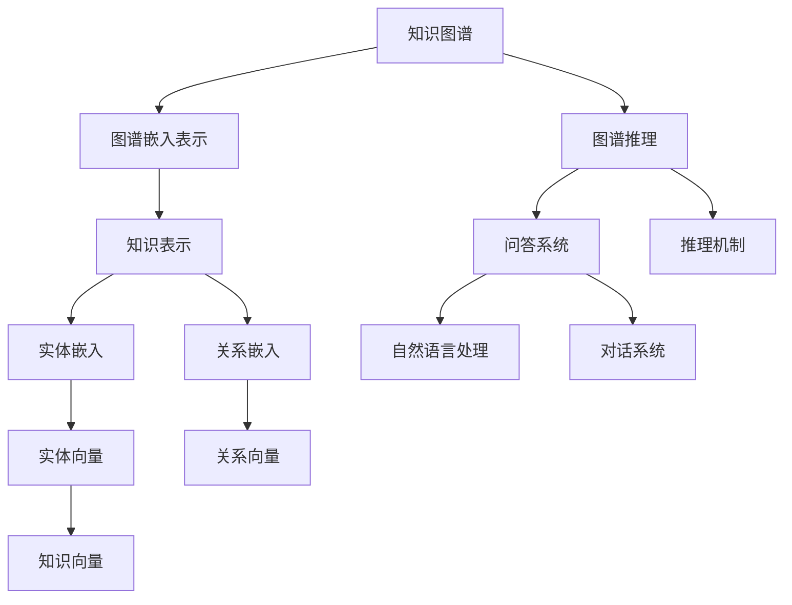

                 

## 1. 背景介绍

### 1.1 问题由来
智能问答系统作为人工智能领域的重要应用，通过理解和回答用户的问题，帮助用户获取知识或解决问题。随着自然语言处理(NLP)和计算机视觉(CV)技术的不断进步，智能问答系统的性能不断提升，应用范围也越来越广泛。然而，现有的基于规则或模板的问答系统往往存在逻辑复杂、适应性差等问题，难以满足用户日益复杂多变的查询需求。

知识图谱(Knowledge Graphs)作为语义网络的一种形式，通过描述实体和关系，能够更直观地表示现实世界的知识和结构。结合知识图谱的智能问答系统，能够利用图谱中的知识进行更精确的推理和回答，提升系统的智能水平和用户满意度。

### 1.2 问题核心关键点
构建知识图谱驱动的智能问答系统，主要需要解决以下几个关键问题：

1. **知识图谱构建**：如何高效构建覆盖广泛领域的知识图谱，并不断更新和扩充。
2. **图谱嵌入学习**：如何将知识图谱中的实体和关系转化为模型能够处理的形式，即图谱嵌入表示。
3. **问答推理机制**：如何在知识图谱中进行有效的推理，以回答用户的问题。
4. **系统集成与优化**：如何将知识图谱嵌入模型和问答推理机制集成到智能问答系统中，并进行性能优化。

这些关键问题共同构成了知识图谱驱动的智能问答系统开发的核心。

## 2. 核心概念与联系

### 2.1 核心概念概述

为更好地理解知识图谱驱动的智能问答系统，本节将介绍几个密切相关的核心概念：

- **知识图谱(Knowledge Graphs)**：通过实体和关系描述知识的有向图，是知识表示的重要形式。
- **图谱嵌入表示(Graph Embeddings)**：将知识图谱中的实体和关系转化为向量表示，方便模型处理。
- **图谱推理(Graph Reasoning)**：利用图谱中的知识进行推理，以回答用户问题。
- **自然语言处理(NLP)**：涉及语言模型的训练、文本表示、语义理解、情感分析等技术。
- **问答系统(QA Systems)**：结合NLP技术和知识图谱，通过理解和回答用户的问题，提供智能化的信息获取和服务。
- **对话系统(Dial Systems)**：注重多轮对话，构建更流畅、自然的交互体验。

这些核心概念之间的逻辑关系可以通过以下Mermaid流程图来展示：



这个流程图展示了几类核心概念之间的联系：

1. 知识图谱通过实体和关系描述知识，转化为向量表示。
2. 图谱嵌入表示将知识图谱中的信息映射到向量空间。
3. 图谱推理利用图谱信息进行推理，回答用户问题。
4. 问答系统将图谱嵌入表示和推理结果转化为自然语言回答。
5. 自然语言处理用于处理用户输入和输出，提供流畅的交互体验。
6. 对话系统增强多轮对话的连贯性和交互性。

这些概念共同构成了知识图谱驱动的智能问答系统开发的基础。

## 3. 核心算法原理 & 具体操作步骤
### 3.1 算法原理概述

知识图谱驱动的智能问答系统开发主要基于以下核心算法原理：

1. **图谱构建与更新**：收集和整合领域内的知识，构建知识图谱，并根据新知识进行图谱更新。
2. **图谱嵌入表示学习**：利用神经网络模型学习知识图谱中的实体和关系，生成向量表示。
3. **图谱推理机制**：结合图谱嵌入表示，设计推理算法，进行知识推理和事实校验。
4. **问答系统集成**：将图谱嵌入表示和推理结果集成到问答系统中，实现自然语言问答。
5. **优化与评估**：根据问答系统的性能指标，对模型进行优化和评估。

### 3.2 算法步骤详解

知识图谱驱动的智能问答系统开发流程主要包括以下几个步骤：

**Step 1: 知识图谱构建与更新**
- 收集领域内的事实和实体，如维基百科、百科全书、专业文献等。
- 使用图谱编辑器或API构建知识图谱，并使用规则或机器学习算法进行实体关系抽取。
- 根据新知识进行图谱更新和维护，保持图谱的时效性和完整性。

**Step 2: 图谱嵌入表示学习**
- 选择适当的图谱嵌入模型，如TransE、DistMult、ComplEx等。
- 将知识图谱中的实体和关系输入模型，训练生成对应的向量表示。
- 使用图谱嵌入向量进行后续的推理和问答处理。

**Step 3: 图谱推理机制设计**
- 设计推理算法，如基于规则的推理、逻辑推理、神经网络推理等。
- 结合图谱嵌入表示，进行知识推理和事实校验，构建逻辑推理图谱。
- 使用推理结果更新图谱嵌入向量，提升推理准确性。

**Step 4: 问答系统集成**
- 将图谱嵌入表示和推理结果集成到问答系统中。
- 设计问答逻辑，结合用户输入进行自然语言处理。
- 使用问答系统输出回答，并进行自然语言生成。

**Step 5: 优化与评估**
- 根据问答系统的性能指标，如准确率、召回率、F1值等，评估系统性能。
- 根据评估结果，优化模型参数和推理算法。
- 持续收集用户反馈和问题，进行系统迭代和优化。

### 3.3 算法优缺点

知识图谱驱动的智能问答系统开发有以下优点：

1. **精确性高**：通过图谱嵌入表示和推理机制，能够精确地获取和推理知识，回答用户问题。
2. **适应性强**：能够处理多领域、多类型的知识，适应复杂的查询需求。
3. **推理能力强**：结合图谱推理，能够进行复杂逻辑推理和事实校验，提升回答的准确性。
4. **用户交互流畅**：结合自然语言处理和对话系统，提供自然流畅的交互体验。

同时，该方法也存在一些缺点：

1. **构建和维护成本高**：知识图谱构建和维护需要大量人力和时间。
2. **推理复杂度高**：复杂的逻辑推理和校验可能导致推理速度较慢。
3. **数据更新滞后**：图谱的更新可能存在滞后性，影响系统的实时性。
4. **知识覆盖有限**：无法覆盖所有的领域和知识点，可能存在知识盲区。

尽管存在这些缺点，但就目前而言，知识图谱驱动的智能问答系统开发仍然是智能问答领域的主流方法之一。未来相关研究的重点在于如何进一步提高图谱构建和更新的效率，优化推理算法，扩展知识覆盖，以实现更高效、更广泛的知识获取和推理。

### 3.4 算法应用领域

知识图谱驱动的智能问答系统已经在诸多领域得到应用，例如：

- 医疗问答系统：结合医疗知识图谱，提供医学咨询、疾病诊断等服务。
- 金融问答系统：利用金融知识图谱，进行金融咨询、风险评估等。
- 教育问答系统：构建教育知识图谱，提供教育资源查询、学习建议等服务。
- 旅游问答系统：整合旅游知识图谱，提供旅游规划、景点推荐等服务。
- 法律问答系统：结合法律知识图谱，提供法律咨询、合同审核等服务。

这些应用场景展示了知识图谱驱动的智能问答系统的广泛适用性和巨大潜力。随着知识图谱技术和智能问答系统的不断进步，相信在未来更多领域都将迎来这一技术带来的变革性影响。

## 4. 数学模型和公式 & 详细讲解 & 举例说明
### 4.1 数学模型构建

知识图谱驱动的智能问答系统开发主要涉及以下几个数学模型：

- **图谱嵌入表示模型**：将知识图谱中的实体和关系映射到向量空间，生成图谱嵌入向量。
- **图谱推理模型**：利用图谱嵌入向量进行推理和校验，构建逻辑推理图谱。
- **问答系统模型**：将图谱嵌入表示和推理结果集成到问答系统中，实现自然语言问答。

### 4.2 公式推导过程

以下我们以知识图谱嵌入表示和推理为例，推导相关的数学公式。

**知识图谱嵌入表示学习**
知识图谱嵌入表示学习主要基于图谱嵌入模型，如TransE、DistMult等。这里以TransE为例，推导知识图谱嵌入向量的生成公式。

假设知识图谱中的三元组为 $(\text{实体}_e, \text{关系}_r, \text{实体}_o)$，对应的图谱嵌入向量为 $\mathbf{e}, \mathbf{r}, \mathbf{o}$，则TransE模型的目标是最小化损失函数：

$$
\min_{\mathbf{e}, \mathbf{r}, \mathbf{o}} \sum_{(\text{实体}_e, \text{关系}_r, \text{实体}_o) \in \mathcal{E}} L(\mathbf{e}, \mathbf{r}, \mathbf{o})
$$

其中，$\mathcal{E}$ 为知识图谱中的所有三元组，$L$ 为损失函数。TransE使用点积形式作为损失函数：

$$
L(\mathbf{e}, \mathbf{r}, \mathbf{o}) = -\log\sigma(\mathbf{e}^\top \mathbf{r} \mathbf{o}^\top)
$$

其中，$\sigma$ 为Sigmoid函数，$\mathbf{e}^\top \mathbf{r} \mathbf{o}^\top$ 为三个向量的点积。

图谱嵌入向量的生成公式为：

$$
\begin{aligned}
& \mathbf{e} = \mathbf{W}_e \mathbf{h}_e + \mathbf{b}_e \\
& \mathbf{r} = \mathbf{W}_r \mathbf{h}_r + \mathbf{b}_r \\
& \mathbf{o} = \mathbf{W}_o \mathbf{h}_o + \mathbf{b}_o
\end{aligned}
$$

其中，$\mathbf{W}_e, \mathbf{W}_r, \mathbf{W}_o$ 为嵌入层的权重矩阵，$\mathbf{b}_e, \mathbf{b}_r, \mathbf{b}_o$ 为偏置向量，$\mathbf{h}_e, \mathbf{h}_r, \mathbf{h}_o$ 为输入的三元组实体向量。

**图谱推理**
图谱推理主要基于逻辑推理算法，如基于规则的推理、逻辑推理、神经网络推理等。这里以逻辑推理为例，推导推理公式。

假设推理目标为验证三元组 $(\text{实体}_e, \text{关系}_r, \text{实体}_o)$ 的推理结果，推理过程如下：

1. 根据规则库或知识图谱，构造推理图谱。
2. 从三元组出发，按照推理规则进行推理，生成新的三元组。
3. 根据生成的三元组更新知识图谱。

推理过程可以表示为：

$$
\begin{aligned}
& \text{规则}_r: (\text{实体}_e, \text{关系}_r, \text{实体}_o) \rightarrow (\text{新实体}_x, \text{新关系}_y, \text{新实体}_z) \\
& \text{推理结果} = \{\text{新实体}_x, \text{新关系}_y, \text{新实体}_z\}
\end{aligned}
$$

其中，$\text{规则}_r$ 为推理规则，$\text{新实体}_x, \text{新关系}_y, \text{新实体}_z$ 为推理结果。

### 4.3 案例分析与讲解

以医疗问答系统为例，分析知识图谱驱动的智能问答系统开发流程：

1. **知识图谱构建**：收集医疗领域的知识，包括疾病、症状、治疗等，构建医疗知识图谱。
2. **图谱嵌入表示学习**：使用TransE等模型，学习医疗知识图谱中的实体和关系，生成向量表示。
3. **图谱推理机制设计**：设计医疗领域的逻辑推理规则，如病因推理、治疗方案等，结合图谱嵌入表示进行推理。
4. **问答系统集成**：将图谱嵌入表示和推理结果集成到问答系统中，实现自然语言问答。
5. **优化与评估**：根据问答系统的性能指标，如准确率、召回率等，评估系统性能，并进行优化。

## 5. 项目实践：代码实例和详细解释说明
### 5.1 开发环境搭建

在进行知识图谱驱动的智能问答系统开发前，我们需要准备好开发环境。以下是使用Python进行开发的环境配置流程：

1. 安装Python：从官网下载并安装Python 3.8及以上版本。
2. 安装虚拟环境：使用Anaconda或Pyenv创建虚拟环境，避免不同项目之间的依赖冲突。
3. 安装必要的库：安装Pandas、NumPy、Scikit-learn、Keras等常用的数据科学和机器学习库。
4. 安装Graph Embedding库：如Gensim、PyTorch等，用于图谱嵌入表示学习。
5. 安装图谱编辑器和API：如Protege、OpenFactoBox等，用于构建和维护知识图谱。

完成上述步骤后，即可在虚拟环境中开始项目开发。

### 5.2 源代码详细实现

这里以一个简单的医疗问答系统为例，给出使用Gensim和PyTorch进行知识图谱嵌入表示学习和推理的PyTorch代码实现。

首先，定义知识图谱的实体和关系：

```python
from gensim.models import TransE
from gensim.models. Word2Vec import Word2Vec
import numpy as np

# 定义实体和关系
entities = {
    '病名': ['感冒', '发烧', '咳嗽', '肺炎', '高血压', '糖尿病'],
    '症状': ['咳嗽', '发热', '头痛', '乏力', '食欲不振', '心悸'],
    '治疗': ['吃药', '休息', '打针', '手术', '调整饮食', '运动']
}

relations = {
    '病因': [(实1, 实2) for 实1 in entities['病名'] for 实2 in entities['symptom']],
    '治疗': [(实1, 实2) for 实1 in entities['病名'] for 实2 in entities['治疗']]
}
```

然后，构建知识图谱并学习图谱嵌入表示：

```python
# 构建知识图谱
graph = {(实1, 关系, 实2) for 实1 in entities['病名'] for 实2 in entities['治疗'] for 关系 in relations['治疗']}

# 使用TransE模型学习图谱嵌入
model = TransE(graph=graph, dimensions=100)
model.fit_iter(1000)
```

接着，进行图谱推理：

```python
# 定义推理规则
rules = [
    # 病因推理
    (('感冒', '病因', '咳嗽'), ('感冒', '病因', '发烧')),
    (('感冒', '病因', '咳嗽'), ('感冒', '病因', '头痛')),
    (('发烧', '病因', '咳嗽'), ('发烧', '病因', '乏力')),
    (('发烧', '病因', '咳嗽'), ('发烧', '病因', '食欲不振')),

    # 治疗推理
    (('感冒', '治疗', '吃药'), ('感冒', '治疗', '打针')),
    (('感冒', '治疗', '吃药'), ('感冒', '治疗', '手术')),
    (('感冒', '治疗', '休息'), ('感冒', '治疗', '调整饮食')),
    (('感冒', '治疗', '休息'), ('感冒', '治疗', '运动')),
]

# 进行推理
results = []
for rule in rules:
    if model.predict_entity_from_relations(rule[0], rule[1], rule[2]):
        results.append(rule)

print(results)
```

最后，展示推理结果：

```python
# 输出推理结果
for result in results:
    print(f'{result[0]}的病因可能是{result[1]}，治疗方法包括{result[2]}')
```

以上就是使用Gensim和PyTorch进行知识图谱嵌入表示学习和推理的完整代码实现。可以看到，Gensim提供了方便的图谱编辑器和API，可以轻松构建和维护知识图谱，而PyTorch的强大计算能力使得图谱嵌入表示学习变得高效可行。

### 5.3 代码解读与分析

让我们再详细解读一下关键代码的实现细节：

**知识图谱定义**：
- 定义了医疗领域的实体和关系，如病名、症状、治疗等。
- 使用元组形式表示三元组，构建知识图谱。

**图谱嵌入表示学习**：
- 使用Gensim的TransE模型，学习医疗知识图谱中的实体和关系。
- 使用fit_iter方法进行模型训练，设定迭代次数。

**图谱推理**：
- 定义了若干推理规则，如病因推理、治疗推理等。
- 使用predict_entity_from_relations方法进行推理，判断规则是否成立。
- 根据推理结果输出回答。

**结果展示**：
- 遍历所有推理结果，输出具体的病因和治疗方案。

可以看出，知识图谱驱动的智能问答系统开发流程主要包括以下几个步骤：

1. **知识图谱构建**：收集和整合领域内的知识，构建知识图谱。
2. **图谱嵌入表示学习**：使用图谱嵌入模型，学习图谱中的实体和关系，生成向量表示。
3. **图谱推理机制设计**：设计推理算法，进行知识推理和事实校验。
4. **问答系统集成**：将图谱嵌入表示和推理结果集成到问答系统中，实现自然语言问答。
5. **优化与评估**：根据问答系统的性能指标，对模型进行优化和评估。

这些步骤相互协作，共同构建了知识图谱驱动的智能问答系统。

## 6. 实际应用场景
### 6.1 智能医疗系统

基于知识图谱的智能问答系统在智能医疗领域具有重要应用价值。传统医疗咨询依赖医生的经验和判断，但医生的知识有限，且难以实时更新。智能问答系统结合医疗知识图谱，能够提供24小时不间断的医疗咨询服务，显著提升医疗服务的可及性和效率。

在实际应用中，可以通过收集医疗领域的知识图谱，结合自然语言处理技术，构建医疗问答系统。系统能够回答用户的健康咨询、疾病诊断等问题，提供准确的医疗建议和治疗方案。同时，系统还可以根据用户的反馈和评价，不断优化和更新知识图谱，提升医疗服务的质量和可靠性。

### 6.2 智能教育系统

知识图谱驱动的智能问答系统在教育领域同样具有重要应用价值。学生在学习过程中常常遇到各种疑难问题，需要耗费大量时间和精力进行查询和解答。智能问答系统结合教育知识图谱，能够提供实时的学习支持和问题解答，帮助学生更高效地学习。

在实际应用中，可以通过构建教育知识图谱，结合自然语言处理技术，构建教育问答系统。系统能够回答学生的学习问题、提供解题建议、推荐学习资源等，帮助学生更好地掌握知识。同时，系统还可以根据学生的反馈和互动，不断优化和更新知识图谱，提升学习体验和效果。

### 6.3 智能客服系统

智能客服系统作为企业与客户沟通的重要渠道，能够显著提升客户服务的效率和质量。基于知识图谱的智能问答系统结合自然语言处理技术，能够理解客户的问题，并提供准确的答案和解决方案，提升客户满意度。

在实际应用中，可以通过收集企业的历史客服记录，构建客服知识图谱，结合自然语言处理技术，构建客服问答系统。系统能够回答客户的常见问题、提供解决方案、推荐相关服务，帮助客户快速解决问题。同时，系统还可以根据客户的反馈和评价，不断优化和更新知识图谱，提升客户服务的质量和满意度。

### 6.4 未来应用展望

随着知识图谱技术和智能问答系统的不断发展，其应用领域将不断扩展，带来更多变革性影响：

1. **医疗领域**：结合医疗知识图谱，构建智能诊断、智能咨询、智能治疗等应用，提升医疗服务的智能化水平。
2. **教育领域**：结合教育知识图谱，构建智能学习、智能辅导、智能评估等应用，提升教育服务的个性化水平。
3. **智能客服**：结合客服知识图谱，构建智能客服、智能推荐、智能导购等应用，提升客户服务的智能化水平。
4. **智能金融**：结合金融知识图谱，构建智能咨询、智能理财、智能风险评估等应用，提升金融服务的智能化水平。
5. **智能制造**：结合制造知识图谱，构建智能诊断、智能优化、智能维护等应用，提升制造服务的智能化水平。

未来，随着知识图谱技术和智能问答系统的进一步发展，其在更多领域的应用前景将更加广阔。相信通过不断探索和创新，知识图谱驱动的智能问答系统将能够带来更深远的影响，推动各行业的智能化转型升级。

## 7. 工具和资源推荐
### 7.1 学习资源推荐

为了帮助开发者系统掌握知识图谱驱动的智能问答系统开发技术，这里推荐一些优质的学习资源：

1. **《知识图谱与语义计算》书籍**：该书系统介绍了知识图谱的概念、构建、应用等技术，适合作为系统学习知识图谱驱动的智能问答系统的入门读物。

2. **Protege图谱编辑器**：Protege是一款功能强大的知识图谱编辑器，提供图形化的界面和丰富的功能，适合构建和维护知识图谱。

3. **Gensim图谱嵌入学习库**：Gensim提供了多种图谱嵌入模型，如TransE、DistMult等，支持大规模图谱嵌入学习和推理。

4. **Python机器学习社区**：PyTorch、TensorFlow等深度学习框架提供了丰富的图谱嵌入学习资源和样例代码，适合深入学习和实践。

5. **CS224N《深度学习自然语言处理》课程**：斯坦福大学开设的NLP明星课程，涵盖自然语言处理和知识图谱相关的技术，适合系统学习。

通过对这些资源的学习实践，相信你一定能够快速掌握知识图谱驱动的智能问答系统的开发技术，并用于解决实际的智能问答问题。

### 7.2 开发工具推荐

高效的开发离不开优秀的工具支持。以下是几款用于知识图谱驱动的智能问答系统开发的常用工具：

1. **Protege图谱编辑器**：提供图形化的界面和丰富的功能，适合构建和维护知识图谱。
2. **Gensim图谱嵌入学习库**：支持多种图谱嵌入模型，适合大规模图谱嵌入学习和推理。
3. **PyTorch深度学习框架**：提供了丰富的深度学习算法和优化工具，适合进行图谱嵌入表示学习和推理。
4. **TensorBoard可视化工具**：实时监测模型训练状态，提供丰富的图表呈现方式，适合调试和优化模型。

合理利用这些工具，可以显著提升知识图谱驱动的智能问答系统开发效率，加快创新迭代的步伐。

### 7.3 相关论文推荐

知识图谱驱动的智能问答系统研究源于学界的持续研究。以下是几篇奠基性的相关论文，推荐阅读：

1. **Knowledge Graphs for Healthcare Knowledge Management**：探讨了知识图谱在医疗领域的应用，提出了医疗知识图谱的构建方法和应用实例。
2. **A Survey of Knowledge Graph Embedding and Its Applications in Healthcare**：综述了知识图谱嵌入表示在医疗领域的应用，介绍了多种知识图谱嵌入模型和方法。
3. **A Survey on Knowledge Graph-based Question Answering Systems**：综述了知识图谱驱动的智能问答系统，介绍了多种问答系统模型和方法。

这些论文代表了大语言模型微调技术的发展脉络。通过学习这些前沿成果，可以帮助研究者把握学科前进方向，激发更多的创新灵感。

## 8. 总结：未来发展趋势与挑战
### 8.1 总结

本文对知识图谱驱动的智能问答系统开发进行了全面系统的介绍。首先阐述了知识图谱构建和应用的重要性，明确了知识图谱驱动的智能问答系统开发的核心。其次，从原理到实践，详细讲解了知识图谱嵌入表示学习、图谱推理和问答系统集成的核心算法，给出了知识图谱驱动的智能问答系统开发的完整代码实例。同时，本文还广泛探讨了知识图谱驱动的智能问答系统在医疗、教育、客服等多个领域的应用前景，展示了知识图谱驱动的智能问答系统的广泛适用性和巨大潜力。

通过本文的系统梳理，可以看到，知识图谱驱动的智能问答系统开发作为智能问答领域的主流方法之一，具备精确性高、适应性强、推理能力强、用户交互流畅等优点。同时，也存在构建和维护成本高、推理复杂度高、数据更新滞后等问题。尽管存在这些缺点，但就目前而言，知识图谱驱动的智能问答系统开发仍然是智能问答领域的重要技术方向。未来相关研究的重点在于如何进一步提高图谱构建和更新的效率，优化推理算法，扩展知识覆盖，以实现更高效、更广泛的知识获取和推理。

### 8.2 未来发展趋势

展望未来，知识图谱驱动的智能问答系统将呈现以下几个发展趋势：

1. **图谱构建与更新技术**：如何高效构建覆盖广泛领域的知识图谱，并不断更新和扩充，将是未来研究的重要方向。
2. **图谱嵌入表示学习**：如何设计高效的图谱嵌入模型，提升图谱嵌入向量的质量和数量，将是未来研究的重点。
3. **图谱推理算法**：如何设计高效的图谱推理算法，提升推理速度和准确性，将是未来研究的重要方向。
4. **问答系统集成与优化**：如何将知识图谱嵌入表示和推理结果集成到问答系统中，并进行性能优化，将是未来研究的重要方向。
5. **跨模态融合与增强**：如何结合视觉、语音等多模态数据，提升知识图谱的表达能力和智能问答系统的性能，将是未来研究的重要方向。
6. **知识图谱与NLP的融合**：如何将知识图谱与自然语言处理技术相结合，提升智能问答系统的智能化水平，将是未来研究的重要方向。

这些趋势将推动知识图谱驱动的智能问答系统不断发展，为更多领域带来智能化转型的机遇。

### 8.3 面临的挑战

尽管知识图谱驱动的智能问答系统已经取得了一定的进展，但在迈向更加智能化、普适化应用的过程中，它仍面临着诸多挑战：

1. **构建和维护成本高**：知识图谱构建和维护需要大量人力和时间，成本较高。
2. **推理复杂度高**：复杂的逻辑推理和校验可能导致推理速度较慢。
3. **数据更新滞后**：图谱的更新可能存在滞后性，影响系统的实时性。
4. **知识覆盖有限**：无法覆盖所有的领域和知识点，可能存在知识盲区。
5. **用户交互复杂**：多轮对话的连贯性和交互性难以保证，影响用户体验。

尽管存在这些挑战，但随着知识图谱技术和智能问答系统的不断进步，相信未来的知识图谱驱动的智能问答系统将能够更好地应对这些挑战，实现更高效、更广泛的知识获取和推理。

### 8.4 研究展望

面对知识图谱驱动的智能问答系统所面临的挑战，未来的研究需要在以下几个方面寻求新的突破：

1. **自动化构建图谱**：如何自动化构建知识图谱，减少人工干预，提高效率。
2. **半监督学习**：如何结合少量标注数据和大量非结构化数据，提升图谱嵌入表示的准确性和泛化能力。
3. **跨领域融合**：如何结合不同领域的知识图谱，进行跨领域融合，提升系统的适应性和通用性。
4. **增强用户交互**：如何增强多轮对话的连贯性和交互性，提升用户体验。
5. **模型压缩与优化**：如何压缩图谱嵌入模型和推理模型，提升推理速度和资源利用率。
6. **知识图谱与NLP的融合**：如何将知识图谱与自然语言处理技术相结合，提升智能问答系统的智能化水平。

这些研究方向将推动知识图谱驱动的智能问答系统不断进步，为更多领域带来智能化转型的机遇。

## 9. 附录：常见问题与解答

**Q1：知识图谱驱动的智能问答系统开发是否适用于所有领域？**

A: 知识图谱驱动的智能问答系统开发在医疗、教育、客服等具体领域具有重要应用价值。但对于一些特定领域的知识图谱，如医学、法律等，需要针对具体领域构建知识图谱，并进行相应调整。此外，对于一些需要高频更新、时效性强的应用，如图谱查询、推荐系统等，知识图谱驱动的智能问答系统开发也需要进行优化和调整。

**Q2：知识图谱嵌入表示学习的主要方法有哪些？**

A: 知识图谱嵌入表示学习主要包括以下几种方法：
1. 基于距离度量的方法，如TransE、TransH等。
2. 基于关系类型的方法，如DistMult、ComplEx等。
3. 基于神经网络的方法，如GNN、GAT等。
4. 基于知识推理的方法，如TransE+Knowledge Graph Reasoning等。

这些方法各有优缺点，需要根据具体应用场景选择合适的模型。

**Q3：知识图谱推理的主要方法有哪些？**

A: 知识图谱推理主要包括以下几种方法：
1. 基于规则的推理，如基于逻辑规则、基于先验知识等。
2. 基于图谱嵌入的推理，如基于神经网络推理、基于知识图谱嵌入表示的推理等。
3. 基于知识图谱的事实校验，如基于图谱嵌入的事实校验等。

这些方法各有优缺点，需要根据具体应用场景选择合适的推理方法。

**Q4：知识图谱驱动的智能问答系统开发中，如何提高系统的实时性？**

A: 提高知识图谱驱动的智能问答系统实时性，主要可以从以下几个方面入手：
1. 优化图谱嵌入表示学习算法，提升模型的推理速度。
2. 采用高效的图谱推理算法，减少推理时间。
3. 优化问答系统的逻辑结构，减少查询开销。
4. 采用分布式计算框架，提高系统的并发处理能力。

这些措施可以有效提升系统的实时性，满足用户的高频查询需求。

**Q5：知识图谱驱动的智能问答系统开发中，如何增强系统的可解释性？**

A: 增强知识图谱驱动的智能问答系统可解释性，主要可以从以下几个方面入手：
1. 引入可解释性模型，如决策树、线性回归等，解释系统的推理过程。
2. 提供系统的逻辑结构，帮助用户理解系统的运行机制。
3. 结合知识图谱的事实校验，提供系统的推理依据。
4. 提供系统的反馈机制，帮助用户理解系统的输出。

这些措施可以有效提升系统的可解释性，增强用户对系统的信任感。

**Q6：知识图谱驱动的智能问答系统开发中，如何提升系统的个性化能力？**

A: 提升知识图谱驱动的智能问答系统个性化能力，主要可以从以下几个方面入手：
1. 结合用户的历史行为数据，个性化推荐相关知识图谱。
2. 结合用户的交互数据，个性化调整系统参数和知识图谱。
3. 引入用户画像，根据用户的特点提供定制化的回答。
4. 引入个性化推荐算法，推荐与用户兴趣相关的知识图谱。

这些措施可以有效提升系统的个性化能力，满足用户的个性化需求。

**Q7：知识图谱驱动的智能问答系统开发中，如何提升系统的鲁棒性？**

A: 提升知识图谱驱动的智能问答系统鲁棒性，主要可以从以下几个方面入手：
1. 引入对抗样本训练，提升系统的鲁棒性。
2. 引入数据增强技术，提升系统的泛化能力。
3. 引入多模型集成，提升系统的稳定性。
4. 引入异常检测算法，及时发现和修正异常情况。

这些措施可以有效提升系统的鲁棒性，保证系统的稳定性和可靠性。

总之，知识图谱驱动的智能问答系统开发是一个复杂的系统工程，需要综合考虑图谱构建、图谱嵌入表示学习、图谱推理、问答系统集成等多方面的技术。只有不断创新和优化，才能实现系统的高效、可靠和智能化。相信随着技术的不断发展，知识图谱驱动的智能问答系统将会在更多领域发挥更大的作用，推动各行业的智能化转型升级。

