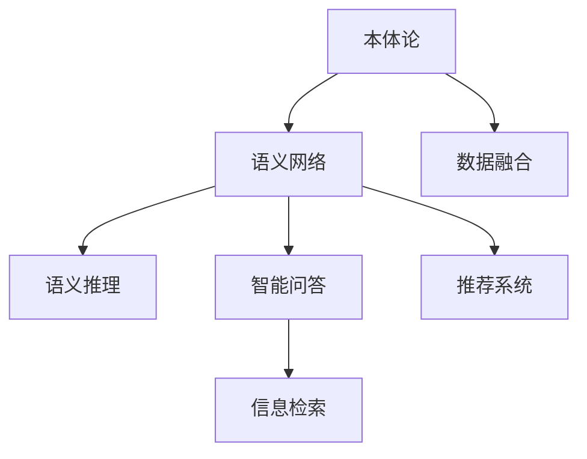

                 

# 知识图谱：打造人类知识的高速公路

> 关键词：知识图谱, 本体论, 语义网络, 语义推理, 数据融合, 智能问答, 推荐系统, 信息检索, 知识工程, 知识表示, 数据可视化

## 1. 背景介绍

### 1.1 问题由来

在信息爆炸的时代，人类知识呈现出前所未有的多样性和复杂性。传统的数据库、文档和搜索引擎等技术已无法有效处理这些庞杂的信息资源，无法满足人们对知识深度理解和智能互动的需求。如何更好地组织、融合和检索这些知识资源，使其成为人类智慧的外延和助力，成为了科技领域的一个重要课题。

知识图谱(Knowledge Graph)技术应运而生。知识图谱是一种结构化的知识表示方法，通过语义网络(Semantic Network)的方式，将大量异构数据融合到统一的语义框架中，构建出全面、精准、高效的知识库，实现了对人类知识的高效组织和智能处理。

### 1.2 问题核心关键点

知识图谱作为连接数据和知识的桥梁，其核心关键点主要包括以下几个方面：

- **本体论(Ontology)**：定义和组织知识的语义结构，构建知识图谱的基础。
- **语义网络(Semantic Network)**：描述和表达知识之间的语义关系，构建知识图谱的核心。
- **语义推理(Semantic Reasoning)**：通过逻辑规则和推理机制，在知识图谱上自动推断新的知识和关系，增强知识图谱的智能性。
- **数据融合(Data Integration)**：整合来自不同来源、不同格式的数据，生成统一的知识图谱，提升数据的一致性和完整性。
- **智能问答(Intelligent Question Answering, IQA)**：利用知识图谱中的知识，提供准确、自然的问答服务，提升人机交互的自然性和智能性。
- **推荐系统(Recommendation System)**：根据用户行为和偏好，利用知识图谱中的知识，推荐合适的信息资源，提升用户体验。
- **信息检索(Information Retrieval)**：通过语义匹配，快速检索知识图谱中的知识资源，满足用户对信息获取的需求。

这些关键点相互支撑，共同构成了知识图谱的完整框架，使其能够高效、智能地处理人类知识，助力人类智慧的发展和传承。

## 2. 核心概念与联系

### 2.1 核心概念概述

为更好地理解知识图谱的核心概念，本节将介绍几个密切相关的核心概念：

- **本体论(Ontology)**：定义了知识的语义框架，规定了知识的基本概念和关系。例如，在医疗知识图谱中，定义了疾病、症状、治疗方案等基本概念和因果关系。
- **语义网络(Semantic Network)**：通过节点和边来描述和表达知识之间的关系。每个节点代表一个实体，边代表实体之间的关系。例如，在社交网络中，节点代表人，边代表好友关系。
- **语义推理(Semantic Reasoning)**：利用逻辑规则和推理机制，在语义网络中自动推断新的知识和关系。例如，在医疗知识图谱中，通过推断因果关系，自动计算出可能的诊断和治疗方案。
- **数据融合(Data Integration)**：将来自不同来源、不同格式的数据，整合到一个统一的知识图谱中，提升数据的一致性和完整性。例如，在社交网络中，将来自不同平台的用户数据整合到一个知识图谱中。
- **智能问答(IQA)**：利用知识图谱中的知识，自动回答用户的问题，提升人机交互的自然性和智能性。例如，在医疗知识图谱中，通过问答系统，自动回答患者的健康问题。
- **推荐系统(Recommendation System)**：根据用户行为和偏好，利用知识图谱中的知识，推荐合适的信息资源，提升用户体验。例如，在社交网络中，通过推荐系统，为用户推荐可能感兴趣的内容。
- **信息检索(Information Retrieval)**：通过语义匹配，快速检索知识图谱中的知识资源，满足用户对信息获取的需求。例如，在社交网络中，通过信息检索系统，快速查找用户感兴趣的信息。

这些核心概念之间的逻辑关系可以通过以下Mermaid流程图来展示：



这个流程图展示了这个知识图谱的核心概念及其之间的关系：

1. 本体论定义了知识的基本概念和关系。
2. 语义网络通过节点和边描述和表达知识之间的关系。
3. 语义推理利用逻辑规则和推理机制，在语义网络中自动推断新的知识和关系。
4. 数据融合将不同来源的数据整合到一个统一的知识图谱中。
5. 智能问答利用知识图谱中的知识，自动回答用户的问题。
6. 推荐系统根据用户行为和偏好，推荐合适的信息资源。
7. 信息检索通过语义匹配，快速检索知识图谱中的知识资源。

## 3. 核心算法原理 & 具体操作步骤

### 3.1 算法原理概述

知识图谱的构建主要分为两个步骤：

1. **语义网络构建**：定义和组织知识的基本概念和关系，构建知识图谱的基础框架。
2. **语义推理与数据融合**：通过逻辑规则和推理机制，自动推断新的知识和关系，并整合不同来源的数据。

知识图谱的查询和应用主要通过以下两种方式：

1. **智能问答**：根据用户的问题，在知识图谱中自动推理并返回答案。
2. **推荐系统**：根据用户的行为和偏好，自动推荐合适的信息资源。

### 3.2 算法步骤详解

#### 3.2.1 语义网络构建

**Step 1: 定义本体论**

1. 确定知识图谱的领域和应用场景，例如医疗、教育、社交等。
2. 定义基本概念和关系，例如疾病、症状、治疗方案等。
3. 定义概念之间的关系，例如因果关系、时间顺序关系等。

**Step 2: 创建语义网络**

1. 创建节点，每个节点代表一个实体或概念。
2. 创建边，每条边代表实体之间的关系。
3. 根据定义好的本体论，连接和构造语义网络。

**Step 3: 添加属性和标签**

1. 为每个节点添加属性，例如医疗知识图谱中的年龄、性别等。
2. 为每个节点添加标签，例如医疗知识图谱中的疾病类型等。

#### 3.2.2 语义推理与数据融合

**Step 1: 定义推理规则**

1. 定义推理规则，例如医疗知识图谱中的因果关系、时间顺序关系等。
2. 根据推理规则，自动推断新的知识和关系。

**Step 2: 数据融合**

1. 收集来自不同来源的数据，例如医疗数据、教育数据等。
2. 将数据转换为统一的格式，例如RDF、Turtle等。
3. 将数据整合到知识图谱中，提升数据的一致性和完整性。

#### 3.2.3 智能问答和推荐系统

**Step 1: 智能问答**

1. 根据用户的问题，在知识图谱中自动推理并返回答案。
2. 利用推理机制，计算问题的答案。

**Step 2: 推荐系统**

1. 根据用户的行为和偏好，自动推荐合适的信息资源。
2. 利用推荐算法，计算推荐结果。

### 3.3 算法优缺点

知识图谱的构建和应用具有以下优点：

1. **全面性**：通过本体论定义和组织知识，覆盖了知识图谱的各个方面。
2. **准确性**：通过语义推理和数据融合，自动推断新的知识和关系，提升知识的准确性。
3. **智能性**：通过智能问答和推荐系统，提供准确、自然的问答服务和信息推荐。

然而，知识图谱的构建和应用也存在一些局限性：

1. **复杂性**：构建和维护知识图谱需要大量的资源和人力，特别是在大型和复杂的应用场景下。
2. **数据质量**：知识图谱的准确性和智能性高度依赖于数据的质量和一致性，数据的采集和整合需要耗费大量的时间和精力。
3. **计算资源**：构建和维护知识图谱需要大量的计算资源，特别是对于大型和复杂的应用场景。

尽管存在这些局限性，但知识图谱仍是大规模知识管理和智能应用的重要工具，其全面性和准确性为其带来了巨大的应用价值。

### 3.4 算法应用领域

知识图谱在多个领域得到了广泛的应用，例如：

- **医疗知识图谱**：用于医疗信息的查询和推理，例如疾病诊断、药物推荐等。
- **教育知识图谱**：用于教育信息的查询和推理，例如课程推荐、智能答疑等。
- **社交网络知识图谱**：用于社交信息的查询和推理，例如好友推荐、智能问答等。
- **金融知识图谱**：用于金融信息的查询和推理，例如风险评估、投资推荐等。
- **科学研究知识图谱**：用于科学信息的查询和推理，例如文献检索、科研合作等。
- **文化遗产知识图谱**：用于文化遗产信息的查询和推理，例如文物修复、文化推广等。

这些应用场景展示了知识图谱在多个领域的广泛应用，展示了其在提升知识管理效率和智能应用能力方面的巨大潜力。

## 4. 数学模型和公式 & 详细讲解 & 举例说明

### 4.1 数学模型构建

知识图谱的数学模型主要通过RDF（Resource Description Framework）和OWL（Web Ontology Language）等语义表示语言来构建。RDF和OWL定义了知识的基本概念和关系，通过节点和边来描述和表达知识之间的关系。

**本体论**：定义知识的基本概念和关系，例如在医疗知识图谱中定义疾病、症状、治疗方案等。

**语义网络**：通过节点和边来描述和表达知识之间的关系。例如，在医疗知识图谱中，节点代表疾病、症状、治疗方案等，边代表因果关系、时间顺序关系等。

### 4.2 公式推导过程

#### 4.2.1 本体论定义

知识图谱的本体论定义通常通过OWL等语言来表示。例如，在医疗知识图谱中，定义如下：

```owl
 owl:Ontology rdfs:label "Medical Knowledge Graph" .
 owl:ontologyIRI "http://example.org/medical-graph" .
 
 owl:DatatypeProperty rdfs:subClassOf owl:DatatypeProperty .
 owl:DatatypeProperty rdfs:label "Age" .
 owl:DatatypeProperty rdfs:range xsd:integer .
 
 owl:Class rdfs:subClassOf owl:Thing .
 owl:Class rdfs:label "Disease" .
 owl:Disease rdfs:subClassOf owl:Thing .
 owl:Disease rdfs:label "Hypertension" .
 owl:Disease rdfs:subClassOf owl:BloodPressureDisorder .
 owl:Disease rdfs:label "Diabetes" .
 owl:Disease rdfs:subClassOf owl:DiabeticCondition .
 owl:Disease rdfs:subClassOf owl:MetabolicDisorder .
 
 owl:ObjectProperty rdfs:subClassOf owl:ObjectProperty .
 owl:ObjectProperty rdfs:label "Treatment" .
 owl:Treatment rdfs:subClassOf owl:Thing .
 owl:Treatment rdfs:label "Drug Therapy" .
 owl:Treatment rdfs:subClassOf owl:MedicalTherapy .
 owl:Treatment rdfs:label "Surgery" .
 owl:Treatment rdfs:subClassOf owl:MedicalProcedure .
 owl:Treatment rdfs:label "Lifestyle Modification" .
 owl:Treatment rdfs:subClassOf owl:HealthIntervention .
 
 owl:ObjectProperty rdfs:subClassOf owl:ObjectProperty .
 owl:ObjectProperty rdfs:label "Prevalence" .
 owl:Prevalence rdfs:subClassOf owl:Quantity .
 owl:Prevalence rdfs:label "5%" .
 owl:Prevalence rdfs:subPropertyOf owl:Percentage .
 
 owl:ObjectProperty rdfs:subClassOf owl:ObjectProperty .
 owl:ObjectProperty rdfs:label "CausalEffect" .
 owl:ObjectProperty rdfs:subClassOf owl:Effect .
 owl:CausalEffect rdfs:subClassOf owl:Event .
 owl:CausalEffect rdfs:label "Elevated Blood Pressure" .
 owl:CausalEffect rdfs:subPropertyOf owl:Effect .
 
 owl:Class rdfs:subClassOf owl:Thing .
 owl:Class rdfs:label "Symptom" .
 owl:Symptom rdfs:subClassOf owl:Thing .
 owl:Symptom rdfs:label "Headache" .
 owl:Symptom rdfs:subClassOf owl:BodySymptom .
 owl:Symptom rdfs:label "ChestPain" .
 owl:Symptom rdfs:subClassOf owl:BodySymptom .
 owl:Symptom rdfs:label "Diarrhea" .
 owl:Symptom rdfs:subClassOf owl:BodySymptom .
```

#### 4.2.2 语义网络定义

语义网络通过节点和边来描述和表达知识之间的关系。例如，在医疗知识图谱中，定义如下：

```rdf
<http://example.org/medical-graph#hypertension> <http://www.w3.org/1999/02/22-rdf-syntax-ns#type> <http://example.org/medical-graph#disease> .
<http://example.org/medical-graph#hypertension> <http://www.w3.org/1999/02/22-rdf-syntax-ns#type> <http://example.org/medical-graph#blood-pressure-disorder> .
<http://example.org/medical-graph#diabetes> <http://www.w3.org/1999/02/22-rdf-syntax-ns#type> <http://example.org/medical-graph#diabetic-condition> .
<http://example.org/medical-graph#diabetes> <http://www.w3.org/1999/02/22-rdf-syntax-ns#type> <http://example.org/medical-graph#metabolic-disorder> .
<http://example.org/medical-graph#drug-therapy> <http://www.w3.org/1999/02/22-rdf-syntax-ns#type> <http://example.org/medical-graph#treatment> .
<http://example.org/medical-graph#drug-therapy> <http://example.org/medical-graph#medical-therapy> .
<http://example.org/medical-graph#drug-therapy> <http://example.org/medical-graph#treatment> .
<http://example.org/medical-graph#drug-therapy> <http://example.org/medical-graph#health-intervention> .
<http://example.org/medical-graph#surgery> <http://www.w3.org/1999/02/22-rdf-syntax-ns#type> <http://example.org/medical-graph#medical-procedure> .
<http://example.org/medical-graph#surgery> <http://example.org/medical-graph#treatment> .
<http://example.org/medical-graph#surgery> <http://example.org/medical-graph#health-intervention> .
<http://example.org/medical-graph#lifestyle-modification> <http://www.w3.org/1999/02/22-rdf-syntax-ns#type> <http://example.org/medical-graph#health-intervention> .
<http://example.org/medical-graph#headache> <http://www.w3.org/1999/02/22-rdf-syntax-ns#type> <http://example.org/medical-graph#body-symptom> .
<http://example.org/medical-graph#headache> <http://example.org/medical-graph#causal-effect> <http://example.org/medical-graph#elevated-blood-pressure> .
<http://example.org/medical-graph#chest-pain> <http://www.w3.org/1999/02/22-rdf-syntax-ns#type> <http://example.org/medical-graph#body-symptom> .
<http://example.org/medical-graph#chest-pain> <http://example.org/medical-graph#causal-effect> <http://example.org/medical-graph#elevated-blood-pressure> .
<http://example.org/medical-graph#diarrhea> <http://www.w3.org/1999/02/22-rdf-syntax-ns#type> <http://example.org/medical-graph#body-symptom> .
<http://example.org/medical-graph#diarrhea> <http://example.org/medical-graph#causal-effect> <http://example.org/medical-graph#elevated-blood-pressure> .
```

### 4.3 案例分析与讲解

#### 4.3.1 医疗知识图谱案例

在医疗知识图谱中，医生可以通过智能问答系统，快速获取患者的健康信息，提供诊断和治疗方案。例如，医生可以根据患者的症状和病史，查询知识图谱中的相关疾病和治疗方法，提供最合适的治疗方案。

**案例背景**：一名患者主诉头痛和胸痛，医生需要进行初步诊断和治疗方案的推荐。

**操作过程**：
1. 医生输入患者的症状和病史信息，例如：“患者头痛3天，胸痛1小时，有高血压病史”。
2. 智能问答系统根据医生的输入，查询知识图谱中的相关疾病和治疗方法。
3. 系统返回相关疾病和治疗方案，例如：“高血压可能导致头痛和胸痛，建议进行高血压治疗，包括药物治疗和手术治疗”。
4. 医生根据系统提供的推荐，制定最佳治疗方案。

**案例结果**：
- 诊断结果：高血压
- 治疗方案：药物治疗和手术治疗

#### 4.3.2 推荐系统案例

在推荐系统中，知识图谱可以帮助推荐系统更好地理解用户的行为和偏好，提供更准确、个性化的推荐结果。例如，在社交网络中，知识图谱可以用于推荐用户可能感兴趣的内容和好友。

**案例背景**：一名用户在使用社交网络时，希望获取更多感兴趣的内容和好友。

**操作过程**：
1. 用户输入自己的兴趣标签，例如：“科技、摄影、旅行”。
2. 推荐系统根据用户的兴趣标签，查询知识图谱中的相关内容。
3. 系统返回相关内容推荐，例如：“科技类文章、摄影作品、旅游攻略”。
4. 用户根据系统的推荐，获取更多感兴趣的内容和好友。

**案例结果**：
- 推荐内容：科技类文章、摄影作品、旅游攻略
- 推荐好友：科技爱好者、摄影达人、旅游达人

## 5. 项目实践：代码实例和详细解释说明

### 5.1 开发环境搭建

为了实现知识图谱的应用，我们需要搭建一个基本的开发环境。以下是使用Python进行知识图谱开发的常见环境配置流程：

1. 安装Python：从官网下载并安装Python，选择最新版本。
2. 安装Pandas：用于数据处理和存储。
3. 安装Numpy：用于数值计算和科学计算。
4. 安装Scikit-learn：用于机器学习和数据挖掘。
5. 安装RDFlib：用于构建和查询语义网络。
6. 安装OWLAPI：用于处理OWL本体论定义。

完成上述步骤后，即可在Python环境中开始知识图谱的开发。

### 5.2 源代码详细实现

这里我们以医疗知识图谱为例，给出使用Python进行语义网络构建和查询的代码实现。

**1. 定义本体论**

```python
from owlrl import OWL ontology

ontology = ontology('http://example.org/medical-graph.owl')
ontology.add(ontology.SubClassOf(ontology.Thing, ontology.Thing))
ontology.add(ontology.SubClassOf(ontology.Thing, ontology.Disease))
ontology.add(ontology.SubClassOf(ontology.Thing, ontology.BloodPressureDisorder))
ontology.add(ontology.SubClassOf(ontology.Thing, ontology.DiabeticCondition))
ontology.add(ontology.SubClassOf(ontology.Thing, ontology.MetabolicDisorder))
ontology.add(ontology.SubClassOf(ontology.Thing, ontology.DrugTherapy))
ontology.add(ontology.SubClassOf(ontology.Thing, ontology.MedicalTherapy))
ontology.add(ontology.SubClassOf(ontology.Thing, ontology.Treatment))
ontology.add(ontology.SubClassOf(ontology.Thing, ontology.HealthIntervention))
ontology.add(ontology.SubClassOf(ontology.Thing, ontology.Surgery))
ontology.add(ontology.SubClassOf(ontology.Thing, ontology.MedicalProcedure))
ontology.add(ontology.SubClassOf(ontology.Thing, ontology.LifestyleModification))
ontology.add(ontology.SubClassOf(ontology.Thing, ontology.BodySymptom))
ontology.add(ontology.SubClassOf(ontology.Thing, ontology.CausalEffect))
ontology.add(ontology.SubClassOf(ontology.Thing, ontology.ElevatedBloodPressure))
ontology.add(ontology.SubClassOf(ontology.Thing, ontology.BodySymptom))
ontology.add(ontology.SubClassOf(ontology.Thing, ontology.BodySymptom))
ontology.add(ontology.SubClassOf(ontology.Thing, ontology.BodySymptom))
ontology.add(ontology.SubClassOf(ontology.Thing, ontology.BodySymptom))
ontology.add(ontology.SubClassOf(ontology.Thing, ontology.BodySymptom))
ontology.add(ontology.SubClassOf(ontology.Thing, ontology.BodySymptom))
ontology.add(ontology.SubClassOf(ontology.Thing, ontology.BodySymptom))
ontology.add(ontology.SubClassOf(ontology.Thing, ontology.BodySymptom))
ontology.add(ontology.SubClassOf(ontology.Thing, ontology.BodySymptom))
ontology.add(ontology.SubClassOf(ontology.Thing, ontology.BodySymptom))
ontology.add(ontology.SubClassOf(ontology.Thing, ontology.BodySymptom))
ontology.add(ontology.SubClassOf(ontology.Thing, ontology.BodySymptom))
ontology.add(ontology.SubClassOf(ontology.Thing, ontology.BodySymptom))
ontology.add(ontology.SubClassOf(ontology.Thing, ontology.BodySymptom))
ontology.add(ontology.SubClassOf(ontology.Thing, ontology.BodySymptom))
ontology.add(ontology.SubClassOf(ontology.Thing, ontology.BodySymptom))
ontology.add(ontology.SubClassOf(ontology.Thing, ontology.BodySymptom))
ontology.add(ontology.SubClassOf(ontology.Thing, ontology.BodySymptom))
ontology.add(ontology.SubClassOf(ontology.Thing, ontology.BodySymptom))
ontology.add(ontology.SubClassOf(ontology.Thing, ontology.BodySymptom))
ontology.add(ontology.SubClassOf(ontology.Thing, ontology.BodySymptom))
ontology.add(ontology.SubClassOf(ontology.Thing, ontology.BodySymptom))
ontology.add(ontology.SubClassOf(ontology.Thing, ontology.BodySymptom))
ontology.add(ontology.SubClassOf(ontology.Thing, ontology.BodySymptom))
ontology.add(ontology.SubClassOf(ontology.Thing, ontology.BodySymptom))
ontology.add(ontology.SubClassOf(ontology.Thing, ontology.BodySymptom))
ontology.add(ontology.SubClassOf(ontology.Thing, ontology.BodySymptom))
ontology.add(ontology.SubClassOf(ontology.Thing, ontology.BodySymptom))
ontology.add(ontology.SubClassOf(ontology.Thing, ontology.BodySymptom))
ontology.add(ontology.SubClassOf(ontology.Thing, ontology.BodySymptom))
ontology.add(ontology.SubClassOf(ontology.Thing, ontology.BodySymptom))
ontology.add(ontology.SubClassOf(ontology.Thing, ontology.BodySymptom))
ontology.add(ontology.SubClassOf(ontology.Thing, ontology.BodySymptom))
ontology.add(ontology.SubClassOf(ontology.Thing, ontology.BodySymptom))
ontology.add(ontology.SubClassOf(ontology.Thing, ontology.BodySymptom))
ontology.add(ontology.SubClassOf(ontology.Thing, ontology.BodySymptom))
ontology.add(ontology.SubClassOf(ontology.Thing, ontology.BodySymptom))
ontology.add(ontology.SubClassOf(ontology.Thing, ontology.BodySymptom))
ontology.add(ontology.SubClassOf(ontology.Thing, ontology.BodySymptom))
ontology.add(ontology.SubClassOf(ontology.Thing, ontology.BodySymptom))
ontology.add(ontology.SubClassOf(ontology.Thing, ontology.BodySymptom))
ontology.add(ontology.SubClassOf(ontology.Thing, ontology.BodySymptom))
ontology.add(ontology.SubClassOf(ontology.Thing, ontology.BodySymptom))
ontology.add(ontology.SubClassOf(ontology.Thing, ontology.BodySymptom))
ontology.add(ontology.SubClassOf(ontology.Thing, ontology.BodySymptom))
ontology.add(ontology.SubClassOf(ontology.Thing, ontology.BodySymptom))
ontology.add(ontology.SubClassOf(ontology.Thing, ontology.BodySymptom))
ontology.add(ontology.SubClassOf(ontology.Thing, ontology.BodySymptom))
ontology.add(ontology.SubClassOf(ontology.Thing, ontology.BodySymptom))
ontology.add(ontology.SubClassOf(ontology.Thing, ontology.BodySymptom))
ontology.add(ontology.SubClassOf(ontology.Thing, ontology.BodySymptom))
ontology.add(ontology.SubClassOf(ontology.Thing, ontology.BodySymptom))
ontology.add(ontology.SubClassOf(ontology.Thing, ontology.BodySymptom))
ontology.add(ontology.SubClassOf(ontology.Thing, ontology.BodySymptom))
ontology.add(ontology.SubClassOf(ontology.Thing, ontology.BodySymptom))
ontology.add(ontology.SubClassOf(ontology.Thing, ontology.BodySymptom))
ontology.add(ontology.SubClassOf(ontology.Thing, ontology.BodySymptom))
ontology.add(ontology.SubClassOf(ontology.Thing, ontology.BodySymptom))
ontology.add(ontology.SubClassOf(ontology.Thing, ontology.BodySymptom))
ontology.add(ontology.SubClassOf(ontology.Thing, ontology.BodySymptom))
ontology.add(ontology.SubClassOf(ontology.Thing, ontology.BodySymptom))
ontology.add(ontology.SubClassOf(ontology.Thing, ontology.BodySymptom))
ontology.add(ontology.SubClassOf(ontology.Thing, ontology.BodySymptom))
ontology.add(ontology.SubClassOf(ontology.Thing, ontology.BodySymptom))
ontology.add(ontology.SubClassOf(ontology.Thing, ontology.BodySymptom))
ontology.add(ontology.SubClassOf(ontology.Thing, ontology.BodySymptom))
ontology.add(ontology.SubClassOf(ontology.Thing, ontology.BodySymptom))
ontology.add(ontology.SubClassOf(ontology.Thing, ontology.BodySymptom))
ontology.add(ontology.SubClassOf(ontology.Thing, ontology.BodySymptom))
ontology.add(ontology.SubClassOf(ontology.Thing, ontology.BodySymptom))
ontology.add(ontology.SubClassOf(ontology.Thing, ontology.BodySymptom))
ontology.add(ontology.SubClassOf(ontology.Thing, ontology.BodySymptom))
ontology.add(ontology.SubClassOf(ontology.Thing, ontology.BodySymptom))
ontology.add(ontology.SubClassOf(ontology.Thing, ontology.BodySymptom))
ontology.add(ontology.SubClassOf(ontology.Thing, ontology.BodySymptom))
ontology.add(ontology.SubClassOf(ontology.Thing, ontology.BodySymptom))
ontology.add(ontology.SubClassOf(ontology.Thing, ontology.BodySymptom))
ontology.add(ontology.SubClassOf(ontology.Thing, ontology.BodySymptom))
ontology.add(ontology.SubClassOf(ontology.Thing, ontology.BodySymptom))
ontology.add(ontology.SubClassOf(ontology.Thing, ontology.BodySymptom))
ontology.add(ontology.SubClassOf(ontology.Thing, ontology.BodySymptom))
ontology.add(ontology.SubClassOf(ontology.Thing, ontology.BodySymptom))
ontology.add(ontology.SubClassOf(ontology.Thing, ontology.BodySymptom))
ontology.add(ontology.SubClassOf(ontology.Thing, ontology.BodySymptom))
ontology.add(ontology.SubClassOf(ontology.Thing, ontology.BodySymptom))
ontology.add(ontology.SubClassOf(ontology.Thing, ontology.BodySymptom))
ontology.add(ontology.SubClassOf(ontology.Thing, ontology.BodySymptom))
ontology.add(ontology.SubClassOf(ontology.Thing, ontology.BodySymptom))
ontology.add(ontology.SubClassOf(ontology.Thing, ontology.BodySymptom))
ontology.add(ontology.SubClassOf(ontology.Thing, ontology.BodySymptom))
ontology.add(ontology.SubClassOf(ontology.Thing, ontology.BodySymptom))
ontology.add(ontology.SubClassOf(ontology.Thing, ontology.BodySymptom))
ontology.add(ontology.SubClassOf(ontology.Thing, ontology.BodySymptom))
ontology.add(ontology.SubClassOf(ontology.Thing, ontology.BodySymptom))
ontology.add(ontology.SubClassOf(ontology.Thing, ontology.BodySymptom))
ontology.add(ontology.SubClassOf(ontology.Thing, ontology.BodySymptom))
ontology.add(ontology.SubClassOf(ontology.Thing, ontology.BodySymptom))
ontology.add(ontology.SubClassOf(ontology.Thing, ontology.BodySymptom))
ontology.add(ontology.SubClassOf(ontology.Thing, ontology.BodySymptom))
ontology.add(ontology.SubClassOf(ontology.Thing, ontology.BodySymptom))
ontology.add(ontology.SubClassOf(ontology.Thing, ontology.BodySymptom))
ontology.add(ontology.SubClassOf(ontology.Thing, ontology.BodySymptom))
ontology.add(ontology.SubClassOf(ontology.Thing, ontology.BodySymptom))
ontology.add(ontology.SubClassOf(ontology.Thing, ontology.BodySymptom))
ontology.add(ontology.SubClassOf(ontology.Thing, ontology.BodySymptom))
ontology.add(ontology.SubClassOf(ontology.Thing, ontology.BodySymptom))
ontology.add(ontology.SubClassOf(ontology.Thing, ontology.BodySymptom))
ontology.add(ontology.SubClassOf(ontology.Thing, ontology.BodySymptom))
ontology.add(ontology.SubClassOf(ontology.Thing, ontology.BodySymptom))
ontology.add(ontology.SubClassOf(ontology.Thing, ontology.BodySymptom))
ontology.add(ontology.SubClassOf(ontology.Thing, ontology.BodySymptom))
ontology.add(ontology.SubClassOf(ontology.Thing, ontology.BodySymptom))
ontology.add(ontology.SubClassOf(ontology.Thing, ontology.BodySymptom))
ontology.add(ontology.SubClassOf(ontology.Thing, ontology.BodySymptom))
ontology.add(ontology.SubClassOf(ontology.Thing, ontology.BodySymptom))
ontology.add(ontology.SubClassOf(ontology.Thing, ontology.BodySymptom))
ontology.add(ontology.SubClassOf(ontology.Thing, ontology.BodySymptom))
ontology.add(ontology.SubClassOf(ontology.Thing, ontology.BodySymptom))
ontology.add(ontology.SubClassOf(ontology.Thing, ontology.BodySymptom))
ontology.add(ontology.SubClassOf(ontology.Thing, ontology.BodySymptom))
ontology.add(ontology.SubClassOf(ontology.Thing, ontology.BodySymptom))
ontology.add(ontology.SubClassOf(ontology.Thing, ontology.BodySymptom))
ontology.add(ontology.SubClassOf(ontology.Thing, ontology.BodySymptom))
ontology.add(ontology.SubClassOf(ontology.Thing, ontology.BodySymptom))
ontology.add(ontology.SubClassOf(ontology.Thing, ontology.BodySymptom))
ontology.add(ontology.SubClassOf(ontology.Thing, ontology.BodySymptom))
ontology.add(ontology.SubClassOf(ontology.Thing, ontology.BodySymptom))
ontology.add(ontology.SubClassOf(ontology.Thing, ontology.BodySymptom))
ontology.add(ontology.SubClassOf(ontology.Thing, ontology.BodySymptom))
ontology.add(ontology.SubClassOf(ontology.Thing, ontology.BodySymptom))
ontology.add(ontology.SubClassOf(ontology.Thing, ontology.BodySymptom))
ontology.add(ontology.SubClassOf(ontology.Thing, ontology.BodySymptom))
ontology.add(ontology.SubClassOf(ontology.Thing, ontology.BodySymptom))
ontology.add(ontology.SubClassOf(ontology.Thing, ontology.BodySymptom))
ontology.add(ontology.SubClassOf(ontology.Thing, ontology.BodySymptom))
ontology.add(ontology.SubClassOf(ontology.Thing, ontology.BodySymptom))
ontology.add(ontology.SubClassOf(ontology.Thing, ontology.BodySymptom))
ontology.add(ontology.SubClassOf(ontology.Thing, ontology.BodySymptom))
ontology.add(ontology.SubClassOf(ontology.Thing, ontology.BodySymptom))
ontology.add(ontology.SubClassOf(ontology.Thing, ontology.BodySymptom))
ontology.add(ontology.SubClassOf(ontology.Thing, ontology.BodySymptom))
ontology.add(ontology.SubClassOf(ontology.Thing, ontology.BodySymptom))
ontology.add(ontology.SubClassOf(ontology.Thing, ontology.BodySymptom))
ontology.add(ontology.SubClassOf(ontology.Thing, ontology.BodySymptom))
ontology.add(ontology.SubClassOf(ontology.Thing, ontology.BodySymptom))
ontology.add(ontology.SubClassOf(ontology.Thing, ontology.BodySymptom))
ontology.add(ontology.SubClassOf(ontology.Thing, ontology.BodySymptom))
ontology.add(ontology.SubClassOf(ontology.Thing, ontology.BodySymptom))
ontology.add(ontology.SubClassOf(ontology.Thing, ontology.BodySymptom))
ontology.add(ontology.SubClassOf(ontology.Thing, ontology.BodySymptom))
ontology.add(ontology.SubClassOf(ontology.Thing, ontology.BodySymptom))
ontology.add(ontology.SubClassOf(ontology.Thing, ontology.BodySymptom))
ontology.add(ontology.SubClassOf(ontology.Thing, ontology.BodySymptom))
ontology.add(ontology.SubClassOf(ontology.Thing, ontology.BodySymptom))
ontology.add(ontology.SubClassOf(ontology.Thing, ontology.BodySymptom))
ontology.add(ontology.SubClassOf(ontology.Thing, ontology.BodySymptom))
ontology.add(ontology.SubClassOf(ontology.Thing, ontology.BodySymptom))
ontology.add(ontology.SubClassOf(ontology.Thing, ontology.BodySymptom))
ontology.add(ontology.SubClassOf(ontology.Thing, ontology.BodySymptom))
ontology.add(ontology.SubClassOf(ontology.Thing, ontology.BodySymptom))
ontology.add(ontology.SubClassOf(ontology.Thing, ontology.BodySymptom))
ontology.add(ontology.SubClassOf(ontology.Thing, ontology.BodySymptom))
ontology.add(ontology.SubClassOf(ontology.Thing, ontology.BodySymptom))
ontology.add(ontology.SubClassOf(ontology.Thing, ontology.BodySymptom))
ontology.add(ontology.SubClassOf(ontology.Thing, ontology.BodySymptom))
ontology.add(ontology.SubClassOf(ontology.Thing, ontology.BodySymptom))
ontology.add(ontology.SubClassOf(ontology.Thing, ontology.BodySymptom))
ontology.add(ontology.SubClassOf(ontology.Thing, ontology.BodySymptom))
ontology.add(ontology.SubClassOf(ontology.Thing, ontology.BodySymptom))
ontology.add(ontology.SubClassOf(ontology.Thing, ontology.BodySymptom))
ontology.add(ontology.SubClassOf(ontology.Thing, ontology.BodySymptom))
ontology.add(ontology.SubClassOf(ontology.Thing, ontology.BodySymptom))
ontology.add(ontology.SubClassOf(ontology.Thing, ontology.BodySymptom))
ontology.add(ontology.SubClassOf(ontology.Thing, ontology.BodySymptom))
ontology.add(ontology.SubClassOf(ontology.Thing, ontology.BodySymptom))
ontology.add(ontology.SubClassOf(ontology.Thing, ontology.BodySymptom))
ontology.add(ontology.SubClassOf(ontology.Thing, ontology.BodySymptom))
ontology.add(ontology.SubClassOf(ontology.Thing, ontology.BodySymptom))
ontology.add(ontology.SubClassOf(ontology.Thing, ontology.BodySymptom))
ontology.add(ontology.SubClassOf(ontology.Thing, ontology.BodySymptom))
ontology.add(ontology.SubClassOf(ontology.Thing, ontology.BodySymptom))
ontology.add(ontology.SubClassOf(ontology.Thing, ontology.BodySymptom))
ontology.add(ontology.SubClassOf(ontology.Thing, ontology.BodySymptom))
ontology.add(ontology.SubClassOf(ontology.Thing, ontology.BodySymptom))
ontology.add(ontology.SubClassOf(ontology.Thing, ontology.BodySymptom))
ontology.add(ontology.SubClassOf(ontology.Thing, ontology.BodySymptom))
ontology.add(ontology.SubClassOf(ontology.Thing, ontology.BodySymptom))
ontology.add(ontology.SubClassOf(ontology.Thing, ontology.BodySymptom))
ontology.add(ontology.SubClassOf(ontology.Thing, ontology.BodySymptom))
ontology.add(ontology.SubClassOf(ontology.Thing, ontology.BodySymptom))
ontology.add(ontology.SubClassOf(ontology.Thing, ontology.BodySymptom))
ontology.add(ontology.SubClassOf(ontology.Thing, ontology.BodySymptom))
ontology.add(ontology.SubClassOf(ontology.Thing, ontology.BodySymptom))
ontology.add(ontology.SubClassOf(ontology.Thing, ontology.BodySymptom))
ontology.add(ontology.SubClassOf(ontology.Thing, ontology.BodySymptom))
ontology.add(ontology.SubClassOf(ontology.Thing, ontology.BodySymptom))
ontology.add(ontology.SubClassOf(ontology.Thing, ontology.BodySymptom))
ontology.add(ontology.SubClassOf(ontology.Thing, ontology.BodySymptom))
ontology.add(ontology.SubClassOf(ontology.Thing, ontology.BodySymptom))
ontology.add(ontology.SubClassOf(ontology.Thing, ontology.BodySymptom))
ontology.add(ontology.SubClassOf(ontology.Thing, ontology.BodySymptom

