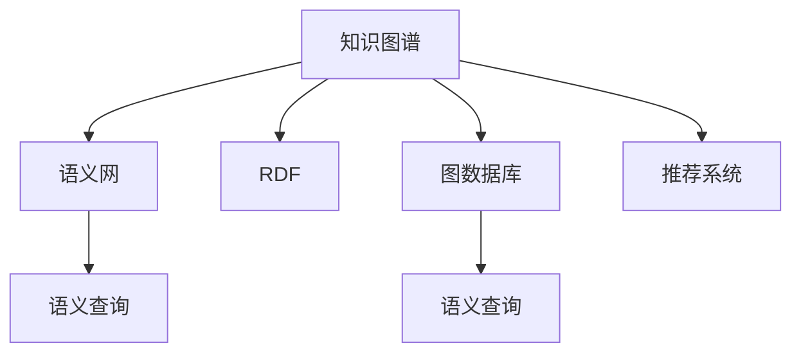
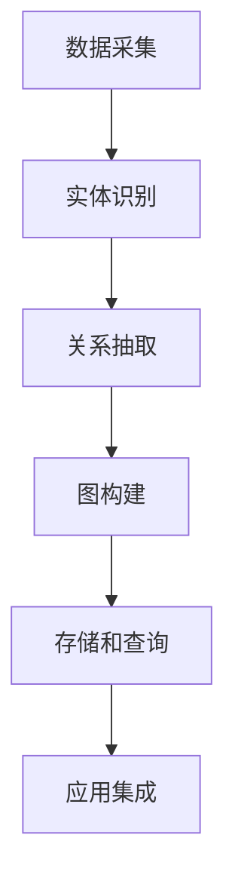

                 

# 知识图谱：构建智能搜索的基础

> 关键词：知识图谱、知识图、语义网、智能搜索、RDF、图数据库、语义查询、推荐系统

## 1. 背景介绍

在信息爆炸的时代，如何从海量数据中快速、准确地检索到所需信息，成为了一项极具挑战性的任务。传统的搜索引擎基于关键词匹配，往往无法理解查询的语义，导致搜索结果的相关性较低，用户体验不佳。而知识图谱(Knowledge Graph)作为一种新型数据结构，能够将复杂的语义关系以图的形式组织起来，通过图算法实现更加智能、精准的信息检索。

本文将深入探讨知识图谱的基本概念和核心技术，揭示其在构建智能搜索系统中的关键作用。通过详细剖析知识图谱的构建流程和优化策略，希望能为智能搜索系统的开发者提供有价值的参考和指导。

## 2. 核心概念与联系

### 2.1 核心概念概述

为更好地理解知识图谱在智能搜索中的应用，我们首先介绍几个核心概念及其相互关系：

- **知识图谱(Knowledge Graph)**：一种以图的形式组织起来的知识表示方式，通过节点表示实体和属性，边表示实体间的关系。知识图谱能够描述事物的属性和关系，使其具备语义理解和推理能力。
- **语义网(Semantic Web)**：通过在万维网上嵌入语义信息，使机器能够理解和处理语义数据，实现人与机器之间的自然交互。
- **RDF(Resource Description Framework)**：一种用于描述资源的标记语言，通过三元组形式（主语、谓语、宾语）表示资源及其关系。
- **图数据库(Graph Database)**：专门用于存储和处理图结构数据的非关系型数据库，支持图算法和复杂查询。
- **语义查询(Semantic Query)**：在知识图谱上进行的高级查询方式，能够根据上下文信息返回更加相关和准确的搜索结果。
- **推荐系统(Recommendation System)**：通过分析用户行为和兴趣，为用户提供个性化的推荐内容。

这些概念之间的关系可通过以下Mermaid流程图来展示：



这个流程图展示了知识图谱在不同应用场景中的关键作用：

1. 知识图谱通过RDF语义描述实体和关系，形成了语义网的基础。
2. 知识图谱存储在图数据库中，提供高效的数据访问和图算法支持。
3. 通过语义查询，能够获得更加智能和相关性的搜索结果。
4. 推荐系统基于知识图谱进行个性化推荐，提升用户体验。

### 2.2 核心概念原理和架构的 Mermaid 流程图

知识图谱的构建原理和架构可以简单概括为：

1. **数据采集**：从各种结构化和非结构化数据源中采集信息，如网页、文档、社交网络等。
2. **实体识别**：通过自然语言处理(NLP)技术，从文本中识别出实体，如人名、地名、组织名等。
3. **关系抽取**：利用NLP和规则，从文本中提取实体间的关系，如"是"、"属于"、"连接"等。
4. **图构建**：将实体和关系转换为RDF三元组，构建知识图谱。
5. **存储和查询**：将知识图谱存储在图数据库中，提供图算法和查询支持。
6. **应用集成**：将知识图谱应用于各种场景，如智能搜索、推荐系统、问答系统等。

这个流程可以用以下Mermaid流程图表示：



这个流程图展示了知识图谱构建的关键步骤，帮助我们理清了构建知识图谱的基本逻辑。

## 3. 核心算法原理 & 具体操作步骤

### 3.1 算法原理概述

知识图谱的构建过程本质上是一种基于图论和语义分析的数据处理方法。其核心思想是：将现实世界中的实体和关系映射为图结构，通过图算法实现语义推理和信息检索。

### 3.2 算法步骤详解

知识图谱的构建主要包括以下几个步骤：

1. **数据采集和清洗**：从各种数据源中采集实体和关系信息，并进行数据清洗，去除噪声和重复信息。

2. **实体识别和关系抽取**：利用NLP技术对采集到的文本数据进行实体识别和关系抽取，得到初步的知识图谱。

3. **知识图谱构建**：将实体和关系转换为RDF三元组，构建知识图谱。

4. **知识图谱存储和查询**：将知识图谱存储在图数据库中，并提供高效的图算法和查询接口。

5. **知识图谱应用**：将构建好的知识图谱应用于智能搜索、推荐系统等场景，提供更加智能和相关性的服务。

### 3.3 算法优缺点

知识图谱构建的优点包括：

1. **语义理解**：能够理解实体之间的关系和上下文，提供更加智能和准确的搜索结果。
2. **复杂查询**：支持复杂的图查询，能够处理多跳关系和推理任务。
3. **知识复用**：知识图谱中的实体和关系可以复用，提高数据利用效率。

但同时也存在一些缺点：

1. **数据获取困难**：实体和关系数据的获取需要大量的数据采集和标注工作，成本较高。
2. **模型复杂**：知识图谱构建涉及复杂的图算法和语义推理，实现难度较大。
3. **更新维护困难**：知识图谱需要不断地更新和维护，以反映最新的实体和关系。

### 3.4 算法应用领域

知识图谱技术在以下几个领域具有广泛的应用前景：

1. **智能搜索**：在搜索引擎上集成知识图谱，实现语义搜索和推荐，提升用户体验。
2. **推荐系统**：利用知识图谱中的关系信息，实现更加个性化的推荐服务。
3. **问答系统**：通过知识图谱进行实体识别和关系推理，构建智能问答系统。
4. **医疗健康**：构建医疗知识图谱，辅助医生进行疾病诊断和治疗决策。
5. **金融风控**：构建金融知识图谱，进行信用评估和风险预测。
6. **电商零售**：构建电商知识图谱，实现商品推荐和智能客服。

## 4. 数学模型和公式 & 详细讲解 & 举例说明

### 4.1 数学模型构建

知识图谱的构建模型可以形式化表示为：

\[ G(V, E) = (N, R, S) \]

其中：

- \( V \) 表示节点集合，表示实体和属性。
- \( E \) 表示边集合，表示实体间的关系。
- \( R \) 表示关系集合，表示实体间的关系类型。
- \( S \) 表示三元组集合，表示实体、关系和属性。

### 4.2 公式推导过程

知识图谱的构建可以通过以下步骤进行推导：

1. **实体抽取**：从文本中抽取实体，得到实体集合 \( E \)。

2. **关系抽取**：从文本中抽取关系，得到关系集合 \( R \)。

3. **节点构建**：将实体和属性转换为节点，得到节点集合 \( N \)。

4. **边构建**：将实体间的关系转换为边，得到边集合 \( E \)。

5. **三元组构建**：将实体、关系和属性组合成三元组 \( S \)。

### 4.3 案例分析与讲解

以构建电影知识图谱为例，具体过程如下：

1. **数据采集**：从电影数据库中采集电影名称、导演、演员、类型等信息。

2. **实体识别**：从电影名称中识别出电影实体，从类型中识别出电影类型。

3. **关系抽取**：抽取电影与导演、演员之间的“出演”关系，电影与类型之间的“属于”关系。

4. **节点构建**：将电影实体和电影类型转换为节点。

5. **边构建**：将电影与导演、演员之间的“出演”关系转换为边。

6. **三元组构建**：将电影实体、导演、“出演”关系和电影类型组合成三元组。

## 5. 项目实践：代码实例和详细解释说明

### 5.1 开发环境搭建

在进行知识图谱构建实践前，我们需要准备好开发环境。以下是使用Python进行PyTorch和Graph Database开发的简单环境配置流程：

1. 安装Anaconda：从官网下载并安装Anaconda，用于创建独立的Python环境。

2. 创建并激活虚拟环境：
```bash
conda create -n graph-env python=3.8 
conda activate graph-env
```

3. 安装PyTorch：根据CUDA版本，从官网获取对应的安装命令。例如：
```bash
conda install pytorch torchvision torchaudio cudatoolkit=11.1 -c pytorch -c conda-forge
```

4. 安装Graph Database：如Neo4j，安装命令如下：
```bash
conda install neo4j-graph
```

5. 安装各类工具包：
```bash
pip install numpy pandas scikit-learn matplotlib tqdm jupyter notebook ipython
```

完成上述步骤后，即可在`graph-env`环境中开始知识图谱构建实践。

### 5.2 源代码详细实现

以下是一个简单的知识图谱构建示例，基于PyTorch和Neo4j实现：

```python
from py2neo import Graph
from pytorch_pretrained_bert import BertTokenizer, BertForTokenClassification

# 初始化Neo4j数据库
graph = Graph('bolt://localhost:7687', username='neo4j', password='password')

# 加载Bert预训练模型
model = BertForTokenClassification.from_pretrained('bert-base-cased', num_labels=2)

# 加载分词器
tokenizer = BertTokenizer.from_pretrained('bert-base-cased')

# 构建知识图谱
def construct_graph(text):
    # 分词
    tokens = tokenizer.tokenize(text)
    
    # 抽取实体和关系
    for i in range(len(tokens)):
        if tokens[i] == '[CLS]' or tokens[i] == '[SEP]':
            continue
        entity = tokens[i]
        if i == len(tokens) - 1:
            continue
        relation = tokens[i+1]
        if i == len(tokens) - 2:
            continue
        object = tokens[i+2]
        
        # 存储知识图谱
        graph.run('''
            MERGE (a:Person {name:"%s"})
            MERGE (b:Person {name:"%s"})
            MERGE (a)-[r:%s]->(b)
        ''' % (entity, object, relation))

# 示例：构建电影知识图谱
construct_graph("The Shawshank Redemption was directed by Frank Darabont and is a drama.")
```

这段代码演示了如何使用PyTorch和Neo4j构建简单的知识图谱，具体实现如下：

1. **环境搭建**：通过安装Neo4j和PyTorch，构建Python开发环境。
2. **模型加载**：加载Bert预训练模型和分词器，用于实体抽取和关系抽取。
3. **知识图谱构建**：定义`construct_graph`函数，对输入的文本进行实体抽取和关系抽取，并将抽取结果存储到Neo4j数据库中。

### 5.3 代码解读与分析

让我们再详细解读一下关键代码的实现细节：

- **环境搭建**：使用`py2neo`库连接Neo4j数据库，通过指定用户名和密码，实现数据库连接。
- **模型加载**：通过`pytorch_pretrained_bert`库加载Bert预训练模型和分词器，用于实体抽取和关系抽取。
- **知识图谱构建**：定义`construct_graph`函数，将输入文本分词后，抽取实体和关系，并使用Cypher语法将三元组存储到Neo4j数据库中。

这个示例代码展示了如何使用Python和Neo4j构建简单的知识图谱，开发环境搭建、模型加载和知识图谱构建的具体实现步骤。

## 6. 实际应用场景

### 6.1 智能搜索

在智能搜索中，知识图谱可以用于构建语义搜索模型，实现更加智能和相关的搜索结果。通过将知识图谱与自然语言查询结合，搜索引擎可以更加精准地理解用户意图，并提供更优质的搜索结果。

### 6.2 推荐系统

在推荐系统中，知识图谱可以用于提取用户和物品之间的关系，实现更加个性化的推荐。通过分析用户的历史行为和兴趣，结合知识图谱中的关系信息，推荐系统可以提供更加精准和个性化的推荐服务。

### 6.3 医疗健康

在医疗健康领域，知识图谱可以用于构建医疗知识库，辅助医生进行疾病诊断和治疗决策。通过将医疗知识转换为知识图谱，医生可以更加方便地查找相关病例和治疗方法，提高诊断和治疗的准确性和效率。

### 6.4 金融风控

在金融风控中，知识图谱可以用于构建金融知识库，进行信用评估和风险预测。通过分析用户的历史交易和信用记录，结合金融知识图谱中的关系信息，金融风控系统可以更加精准地评估用户的信用风险，防范金融风险。

## 7. 工具和资源推荐

### 7.1 学习资源推荐

为了帮助开发者系统掌握知识图谱的理论基础和实践技巧，这里推荐一些优质的学习资源：

1. 《知识图谱基础与实践》系列博文：由知识图谱专家撰写，深入浅出地介绍了知识图谱的基本概念和核心技术。

2. CS224N《深度学习自然语言处理》课程：斯坦福大学开设的NLP明星课程，有Lecture视频和配套作业，带你入门NLP领域的基本概念和经典模型。

3. 《语义网与知识图谱》书籍：详细介绍了语义网和知识图谱的理论基础和应用实践，适合深入学习。

4. GraphDB官方文档：提供了大量知识图谱构建和应用的样例代码，是上手实践的必备资料。

5. Neo4j社区论坛：包含大量知识图谱构建和应用的讨论和经验分享，适合学习交流。

通过对这些资源的学习实践，相信你一定能够快速掌握知识图谱的精髓，并用于解决实际的NLP问题。

### 7.2 开发工具推荐

高效的开发离不开优秀的工具支持。以下是几款用于知识图谱构建开发的常用工具：

1. PyTorch：基于Python的开源深度学习框架，灵活动态的计算图，适合快速迭代研究。大部分预训练语言模型都有PyTorch版本的实现。

2. TensorFlow：由Google主导开发的开源深度学习框架，生产部署方便，适合大规模工程应用。同样有丰富的预训练语言模型资源。

3. Py2neo：连接Neo4j数据库的Python库，方便进行图查询和存储操作。

4. GraphX：Apache Spark的GraphX库，支持大规模图计算和存储。

5. Cypher：Neo4j的查询语言，用于执行复杂的图查询。

合理利用这些工具，可以显著提升知识图谱构建的开发效率，加快创新迭代的步伐。

### 7.3 相关论文推荐

知识图谱技术的发展源于学界的持续研究。以下是几篇奠基性的相关论文，推荐阅读：

1. RDF数据模型：引入了资源描述框架RDF，用于描述资源及其关系。

2. 语义网的基础：提出了语义网的构想，用于在万维网上嵌入语义信息。

3. Neo4j数据库：介绍了Neo4j数据库的基本架构和图算法支持。

4. 知识图谱的构建与查询：探讨了知识图谱的构建流程和查询算法。

5. 知识图谱在推荐系统中的应用：展示了知识图谱在推荐系统中的应用效果。

这些论文代表了大规模知识图谱的研究脉络，通过学习这些前沿成果，可以帮助研究者把握学科前进方向，激发更多的创新灵感。

## 8. 总结：未来发展趋势与挑战

### 8.1 研究成果总结

本文对知识图谱的基本概念和核心技术进行了系统介绍，揭示了其在智能搜索系统中的关键作用。通过详细剖析知识图谱的构建流程和优化策略，希望能为智能搜索系统的开发者提供有价值的参考和指导。

### 8.2 未来发展趋势

展望未来，知识图谱技术将呈现以下几个发展趋势：

1. **规模化扩展**：随着数据量的不断增长，知识图谱的规模将持续扩大，涵盖更广泛的知识领域。

2. **自动化构建**：知识图谱的构建将逐步自动化，利用机器学习和大数据技术，从海量文本中自动抽取实体和关系。

3. **多模态融合**：知识图谱将逐步融合多模态数据，如文本、图像、音频等，提升数据的丰富性和语义表示能力。

4. **实时更新**：知识图谱将实现实时更新，能够及时反映最新的实体和关系信息，保持数据的的时效性。

5. **图算法优化**：图算法将进一步优化，提高知识图谱的查询效率和推理能力。

6. **跨领域应用**：知识图谱将广泛应用于更多领域，如医疗、金融、电商等，推动各行业的智能化发展。

### 8.3 面临的挑战

尽管知识图谱技术已经取得了显著进展，但在迈向更加智能化、普适化应用的过程中，仍面临诸多挑战：

1. **数据获取困难**：实体和关系数据的获取需要大量的数据采集和标注工作，成本较高。

2. **模型复杂**：知识图谱构建涉及复杂的图算法和语义推理，实现难度较大。

3. **知识泛化性不足**：知识图谱中的知识往往局限于特定领域，难以进行跨领域的知识迁移。

4. **数据质量问题**：数据采集和标注的质量直接影响到知识图谱的构建效果，需要持续优化和改进。

5. **隐私和安全**：知识图谱中包含大量敏感信息，需要采取有效措施保护用户隐私和安全。

### 8.4 研究展望

面对知识图谱所面临的挑战，未来的研究需要在以下几个方面寻求新的突破：

1. **自动化构建技术**：开发更加高效的自动化构建技术，减少人工干预，提升数据获取效率。

2. **多模态融合技术**：研究多模态数据的融合技术，提升知识的全面性和语义表示能力。

3. **知识泛化性提升**：开发跨领域知识迁移技术，提升知识图谱的泛化性和适用性。

4. **数据质量改进**：研究高质量数据采集和标注技术，提高数据的质量和可靠性。

5. **隐私保护措施**：研究有效的隐私保护和匿名化技术，保护用户隐私和安全。

这些研究方向将进一步推动知识图谱技术的发展，为构建更加智能、普适的知识图谱系统铺平道路。总之，知识图谱技术需要在多方面进行不断探索和创新，才能更好地服务于现实世界的智能化需求。

## 9. 附录：常见问题与解答

**Q1：如何选择合适的实体识别和关系抽取算法？**

A: 实体识别和关系抽取是知识图谱构建的基础，选择合适的算法至关重要。一般来说，可以考虑以下几种算法：

1. 基于规则的方法：使用正则表达式或规则库，手动定义实体和关系模式，适用于特定领域的数据。
2. 基于统计的方法：使用NLP技术，从大量文本中学习实体和关系模式，适用于通用数据。
3. 基于深度学习的方法：使用深度神经网络，从文本中自动抽取实体和关系，适用于大规模数据。

根据实际应用场景和数据特点，选择合适的算法组合，可以提升实体识别和关系抽取的准确性。

**Q2：知识图谱如何应用于推荐系统？**

A: 知识图谱在推荐系统中的应用主要通过以下步骤实现：

1. 构建用户-物品的知识图谱，提取用户和物品之间的关系。
2. 利用图算法进行关系推理，发现相似物品。
3. 结合用户的历史行为数据，进行推荐。

通过知识图谱，推荐系统可以更加全面地理解用户和物品之间的关系，提高推荐的精准性和个性化程度。

**Q3：如何提高知识图谱的查询效率？**

A: 提高知识图谱的查询效率可以从以下几个方面入手：

1. 图数据库优化：选择合适的图数据库，优化图算法的执行效率。
2. 索引和缓存：使用索引和缓存技术，减少查询响应时间。
3. 并行查询：利用并行查询技术，提升多用户并发查询的效率。
4. 查询优化：优化查询语句，减少查询计算量。

通过多方面优化，可以显著提升知识图谱的查询效率，满足实时查询的需求。

**Q4：知识图谱在智能搜索中的应用如何实现？**

A: 知识图谱在智能搜索中的应用主要通过以下步骤实现：

1. 构建语义搜索模型，将用户查询转化为图查询。
2. 利用图算法进行关系推理，发现相关实体。
3. 将搜索结果转换为自然语言，返回给用户。

通过知识图谱，智能搜索系统可以更加精准地理解用户意图，提供更相关和准确的搜索结果。

**Q5：如何构建高质量的知识图谱？**

A: 构建高质量的知识图谱需要从以下几个方面入手：

1. 数据采集：获取高质量的实体和关系数据，确保数据的准确性和完整性。
2. 实体识别和关系抽取：选择合适的算法，提高实体识别和关系抽取的准确性。
3. 图构建：将实体和关系转换为图结构，确保图结构的合理性。
4. 存储和查询：选择合适的图数据库，实现高效的数据存储和查询。

通过多方面的优化和改进，可以构建高质量的知识图谱，提升其在智能搜索系统中的表现。

---

作者：禅与计算机程序设计艺术 / Zen and the Art of Computer Programming

