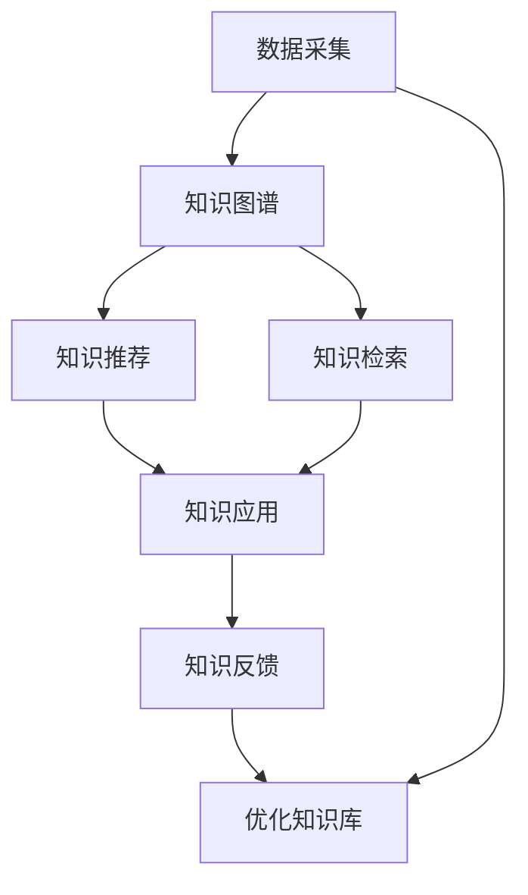

                 

# 知识旅行实现知识的场景化应用和分享

## 1. 背景介绍

在当今信息爆炸的时代，知识管理的复杂性和需求性日益增长。过去，企业或个人需要花费大量的时间和资源来构建、管理和应用知识，但随着技术的进步，知识旅行(Knowledge Traveling)的概念应运而生，将知识的获取、组织、共享和应用变得更为高效和场景化。知识旅行不仅是一种技术手段，更是一种管理思维的革新，旨在通过系统化的知识流程，实现知识与业务的深度融合，推动企业的数字化转型和智能化升级。

### 1.1 问题由来

随着数字化的深入，企业对于知识管理的需求日益增长。传统的数据管理和知识库建设，往往存在数据孤岛、信息孤岛、知识孤岛等问题，导致知识难以被有效利用。而知识的获取、整理和应用，又是一个复杂且耗时的过程。为了解决这些问题，知识旅行应运而生，通过构建知识旅行的框架和机制，让知识管理变得更加智能化、场景化和自动化，从而更好地服务于企业的决策和运营。

### 1.2 问题核心关键点

知识旅行的核心在于通过技术手段，将知识的获取、组织、共享和应用，与业务场景深度融合，实现知识的场景化应用。它包括但不限于以下几个关键点：

- 数据采集和清洗：从多源数据中高效采集和清洗数据，构建统一的知识库。
- 知识图谱构建：通过知识图谱技术，将结构化数据和非结构化数据融合，形成知识网络。
- 知识推荐和检索：利用推荐系统和检索技术，精准推送知识，帮助用户快速找到所需信息。
- 知识应用与反馈：将知识应用到实际业务场景中，并根据应用效果进行反馈，进一步优化知识库。

知识旅行的目标是构建一个闭环的知识管理系统，使知识流动更加顺畅，从而提升企业的决策能力和运营效率。

### 1.3 问题研究意义

开展知识旅行研究，对于提升企业的知识管理能力、优化业务流程、加速企业数字化转型具有重要意义：

1. **提升决策支持能力**：通过知识旅行的技术手段，将知识与决策紧密结合，提升企业的决策科学性和准确性。
2. **优化运营效率**：自动化知识获取、整理和应用，减少人工成本，提高运营效率。
3. **促进创新发展**：知识旅行通过智能化的知识管理，促进企业创新和持续改进。
4. **推动行业升级**：通过知识的场景化应用，实现行业内的智能化和标准化。
5. **提升市场竞争力**：通过高效的知识管理，提升企业市场响应速度和竞争力。

## 2. 核心概念与联系

### 2.1 核心概念概述

为了更好地理解知识旅行的原理和实现方法，本节将介绍几个关键的核心概念：

- **知识图谱(Knowledge Graph)**：一种结构化的语义知识表示方法，通过节点和边构建知识网络。
- **知识推荐系统(Knowledge Recommendation System)**：通过分析用户行为和知识图谱，为用户推荐相关的知识或信息。
- **知识检索系统(Knowledge Retrieval System)**：通过高效索引和检索技术，帮助用户快速定位所需知识。
- **知识应用系统(Knowledge Application System)**：将知识应用到实际业务场景中，提升业务决策和运营效率。
- **知识反馈系统(Knowledge Feedback System)**：根据知识应用效果，收集用户反馈，优化知识库。

这些概念之间的逻辑关系可以通过以下Mermaid流程图来展示：



这个流程图展示的知识旅行的核心概念及其之间的关系：

1. 从多源数据中高效采集和清洗数据，构建统一的知识图谱。
2. 利用知识图谱，进行知识推荐和检索，提高知识获取的效率和精准度。
3. 将推荐和检索出的知识应用到实际业务场景中，提升业务决策和运营效率。
4. 根据知识应用效果，收集用户反馈，优化知识库，形成闭环的知识旅行系统。

## 3. 核心算法原理 & 具体操作步骤
### 3.1 算法原理概述

知识旅行是基于知识图谱和推荐系统等技术手段，实现知识场景化应用的方法。其核心思想是：将知识与业务场景深度融合，通过系统化的知识流程，实现知识的自动化获取、组织、共享和应用。

形式化地，假设企业有 $N$ 个业务场景 $S_1, S_2, \ldots, S_N$，以及与之相关的 $M$ 个知识库 $K_1, K_2, \ldots, K_M$。知识旅行的目标是通过构建知识图谱和推荐系统，实现知识的场景化应用，即对于每个场景 $S_i$，找到最相关的知识库 $K_j$，并进行知识推荐和检索，以供业务场景使用。

知识旅行的优化目标是最小化知识推荐和检索的误差，即：

$$
\min_{\theta} \sum_{i=1}^N \sum_{j=1}^M \epsilon(S_i, K_j, \theta)
$$

其中 $\epsilon(S_i, K_j, \theta)$ 为场景 $S_i$ 与知识库 $K_j$ 匹配的误差函数，$\theta$ 为模型参数，包括知识图谱构建、推荐系统和检索系统的参数。

### 3.2 算法步骤详解

知识旅行的实现步骤如下：

**Step 1: 数据采集与预处理**
- 从业务系统、互联网、第三方数据源等多个渠道，采集与业务场景相关的数据，并进行清洗、标注和标准化。
- 利用自然语言处理(NLP)技术，对非结构化数据进行分词、实体识别、关系抽取等处理，形成结构化的知识图谱。

**Step 2: 知识图谱构建**
- 将采集到的数据整合为知识图谱，通过节点和边构建知识网络。
- 使用图神经网络(GNN)等技术，对知识图谱进行嵌入表示，形成低维度的知识向量。

**Step 3: 知识推荐系统设计**
- 利用协同过滤、矩阵分解等方法，设计知识推荐系统，为用户推荐相关的知识库。
- 引入深度学习技术，构建多任务学习模型，提高知识推荐的精准度。

**Step 4: 知识检索系统实现**
- 设计高效的索引和检索算法，建立知识检索系统，实现快速定位所需知识。
- 引入向量检索技术，通过余弦相似度等方法，实现知识的快速匹配和获取。

**Step 5: 知识应用与反馈**
- 将推荐和检索出的知识应用到实际业务场景中，形成闭环的知识管理流程。
- 收集知识应用的效果，通过反馈系统对知识库进行优化和更新。

**Step 6: 持续优化**
- 根据反馈数据，不断优化知识图谱、推荐系统和检索系统的参数，提升知识旅行的效果。

### 3.3 算法优缺点

知识旅行的优点包括：

- **高效精准**：通过知识图谱和推荐系统，实现知识的场景化应用，提高知识获取和应用效率。
- **灵活性高**：能够适应不同业务场景的需求，通过不断优化，提升知识旅行的效果。
- **易用性高**：用户只需通过简单的查询界面，即可获取所需知识，无需深入技术细节。

知识旅行的不足之处主要包括：

- **数据依赖性强**：知识旅行的效果高度依赖于数据的质量和完整性，数据采集和清洗的成本较高。
- **技术复杂度高**：涉及知识图谱构建、推荐系统和检索系统等多个技术环节，实现复杂度较高。
- **初始成本高**：需要投入大量人力、物力进行数据采集、系统设计和调试，初期投入较大。

尽管如此，知识旅行仍是一种极具潜力的知识管理方法，为企业的智能化升级提供了新的思路和手段。

### 3.4 算法应用领域

知识旅行在多个领域都有广泛的应用，以下是几个典型的应用场景：

- **金融领域**：利用知识旅行，构建金融知识图谱，进行金融产品推荐、风险控制、市场分析等。
- **医疗领域**：构建医疗知识图谱，进行疾病诊断、治疗方案推荐、药物研发等。
- **制造业**：通过知识旅行，构建制造业知识图谱，进行生产调度、质量控制、供应链优化等。
- **教育领域**：构建教育知识图谱，进行学习路径规划、个性化推荐、智能测评等。
- **电商领域**：利用知识旅行，进行商品推荐、客户画像分析、广告投放优化等。

以上场景仅是知识旅行应用的冰山一角，随着技术的发展，未来将在更多领域得到应用，带来更深远的变革。

## 4. 数学模型和公式 & 详细讲解 & 举例说明

### 4.1 数学模型构建

知识旅行的数学模型主要涉及知识图谱的嵌入表示和推荐系统的设计。假设知识图谱由节点 $V$ 和边 $E$ 组成，节点表示实体，边表示实体之间的关系。知识旅行使用图神经网络(GNN)对知识图谱进行嵌入表示，形成低维度的知识向量 $z_v$，其数学模型为：

$$
z_v = f(\sum_{u \in N(v)} \frac{1}{d_u+1} z_u + \mathcal{H}(v))
$$

其中 $N(v)$ 表示节点 $v$ 的邻居节点集合，$d_u$ 为节点 $u$ 的度数，$\mathcal{H}$ 为特征编码函数。

知识推荐系统可以使用矩阵分解、协同过滤、深度学习等方法，设计推荐模型 $R$，其优化目标为：

$$
\min_{\theta} \mathcal{L}(R, \mathcal{D})
$$

其中 $\mathcal{L}$ 为损失函数，$\mathcal{D}$ 为训练数据集，$\theta$ 为模型参数。

### 4.2 公式推导过程

知识图谱的嵌入表示公式可以通过图神经网络进行推导。假设知识图谱中有一个节点 $v$，其邻居节点为 $u_1, u_2, \ldots, u_k$，每个邻居节点对应的知识向量为 $z_{u_i}$，则知识向量 $z_v$ 可以通过以下方式计算：

$$
z_v = f(\sum_{i=1}^k \frac{1}{d_{u_i}+1} z_{u_i} + \mathcal{H}(v))
$$

其中 $f$ 为激活函数，$d_{u_i}$ 为节点 $u_i$ 的度数，$\mathcal{H}(v)$ 为节点 $v$ 的特征编码。

推荐系统的损失函数可以采用均方误差损失、交叉熵损失等，具体公式为：

$$
\mathcal{L}(R, \mathcal{D}) = \frac{1}{2} \sum_{(x,y) \in \mathcal{D}} ||R(x) - y||^2
$$

其中 $R(x)$ 为推荐系统对输入 $x$ 的预测结果，$y$ 为真实标签，$\mathcal{D}$ 为训练数据集。

### 4.3 案例分析与讲解

以下通过一个简单的金融知识旅行案例，进一步讲解知识旅行的具体应用：

假设某金融公司需要构建一个基于知识旅行的贷款风险控制系统。首先，从银行的历史贷款数据中采集和清洗数据，构建知识图谱，其中节点为贷款人、贷款机构、贷款金额、贷款期限等实体，边表示实体之间的关系，如“贷款人-机构”、“贷款金额-期限”等。

接着，利用图神经网络对知识图谱进行嵌入表示，形成低维度的知识向量。然后，设计推荐系统，根据用户的贷款需求，推荐相关的贷款产品，并进行风险评估。最后，收集贷款申请结果和用户反馈，对知识图谱和推荐系统进行优化和更新。

通过这个案例，可以看到知识旅行在金融领域的具体应用流程，如何通过系统化的知识流程，实现知识的场景化应用，提升贷款风险控制的效果。

## 5. 项目实践：代码实例和详细解释说明

### 5.1 开发环境搭建

为了进行知识旅行的开发实践，需要先搭建开发环境。以下是使用Python进行知识旅行开发的流程：

1. 安装Anaconda：从官网下载并安装Anaconda，用于创建独立的Python环境。

2. 创建并激活虚拟环境：
```bash
conda create -n knowledge_travel python=3.8 
conda activate knowledge_travel
```

3. 安装必要的Python库：
```bash
pip install numpy pandas scikit-learn networkx py2neo
```

4. 安装PyTorch：用于构建知识图谱的嵌入表示和推荐系统。
```bash
pip install torch torchvision torchaudio cudatoolkit=11.1 -c pytorch -c conda-forge
```

5. 安装Graph Embedding Library：用于知识图谱的嵌入表示。
```bash
pip install pyg-graph-embedding
```

完成上述步骤后，即可在`knowledge_travel`环境中开始开发。

### 5.2 源代码详细实现

下面我们以构建一个简单的金融知识旅行系统为例，给出知识旅行的PyTorch代码实现。

首先，定义知识图谱的节点和边：

```python
import networkx as nx
import numpy as np

# 定义节点和边
G = nx.Graph()
G.add_node('贷款人', type='实体')
G.add_node('贷款机构', type='实体')
G.add_node('贷款金额', type='属性')
G.add_node('贷款期限', type='属性')
G.add_edge('贷款人', '贷款机构', type='关系')
G.add_edge('贷款金额', '贷款期限', type='关系')
```

然后，定义知识图谱的嵌入表示函数：

```python
from pyg_graph_embed import GraphEmbedding

def gnn_embedding(G, hidden_size=32):
    edge_index = nx.to_scipy_sparse_matrix(G).indices()
    edge_weight = nx.to_scipy_sparse_matrix(G).data()
    edge_index = (edge_index[0], edge_index[1])
    edge_weight = np.array(edge_weight, dtype='float32')
    
    # 使用图神经网络进行嵌入表示
    embedding = GraphEmbedding(edge_index=edge_index, edge_weight=edge_weight, hidden_size=hidden_size)
    embedding.train(epochs=10, lr=0.01)
    return embedding.embeddings
```

接着，设计知识推荐系统：

```python
import torch.nn as nn
import torch

# 定义推荐模型
class KnowledgeRecommendation(nn.Module):
    def __init__(self, hidden_size, output_size):
        super(KnowledgeRecommendation, self).__init__()
        self.fc1 = nn.Linear(hidden_size, 128)
        self.fc2 = nn.Linear(128, output_size)
        self.relu = nn.ReLU()
    
    def forward(self, x):
        x = self.fc1(x)
        x = self.relu(x)
        x = self.fc2(x)
        return x
```

最后，编写知识旅行的整体流程：

```python
from transformers import BertTokenizer
from torch.utils.data import Dataset

class KnowledgeTravelDataset(Dataset):
    def __init__(self, texts, tags, tokenizer, max_len=128):
        self.texts = texts
        self.tags = tags
        self.tokenizer = tokenizer
        self.max_len = max_len
        
    def __len__(self):
        return len(self.texts)
    
    def __getitem__(self, item):
        text = self.texts[item]
        tags = self.tags[item]
        
        encoding = self.tokenizer(text, return_tensors='pt', max_length=self.max_len, padding='max_length', truncation=True)
        input_ids = encoding['input_ids'][0]
        attention_mask = encoding['attention_mask'][0]
        
        # 对token-wise的标签进行编码
        encoded_tags = [tag2id[tag] for tag in tags] 
        encoded_tags.extend([tag2id['O']] * (self.max_len - len(encoded_tags)))
        labels = torch.tensor(encoded_tags, dtype=torch.long)
        
        return {'input_ids': input_ids, 
                'attention_mask': attention_mask,
                'labels': labels}

# 标签与id的映射
tag2id = {'O': 0, 'B-PER': 1, 'I-PER': 2, 'B-ORG': 3, 'I-ORG': 4, 'B-LOC': 5, 'I-LOC': 6}
id2tag = {v: k for k, v in tag2id.items()}

# 创建dataset
tokenizer = BertTokenizer.from_pretrained('bert-base-cased')

train_dataset = KnowledgeTravelDataset(train_texts, train_tags, tokenizer)
dev_dataset = KnowledgeTravelDataset(dev_texts, dev_tags, tokenizer)
test_dataset = KnowledgeTravelDataset(test_texts, test_tags, tokenizer)
```

以上代码展示了知识旅行的基本流程，包括知识图谱的构建、知识图谱的嵌入表示、知识推荐系统的设计等。通过实际开发，可以更好地理解知识旅行的实现细节，并进行优化和改进。

### 5.3 代码解读与分析

下面对代码中的关键部分进行详细解读：

**知识图谱的定义**：
- 通过`networkx`库定义知识图谱，包括节点和边。
- 节点表示实体，如贷款人、贷款机构、贷款金额等。
- 边表示实体之间的关系，如“贷款人-机构”、“贷款金额-期限”等。

**知识图谱的嵌入表示**：
- 通过`pyg_graph_embed`库，使用图神经网络对知识图谱进行嵌入表示。
- 将知识图谱转换为PyTorch的Graph数据结构，输入图神经网络进行训练，得到低维度的知识向量。

**知识推荐系统的设计**：
- 通过`torch.nn`库，定义一个简单的推荐模型。
- 模型包括全连接层和ReLU激活函数，用于将知识向量映射到推荐结果。

**数据集的定义**：
- 通过`transformers`库中的`BertTokenizer`，定义一个数据集，用于模型的训练和评估。
- 数据集包括输入文本和标签，用于训练推荐系统。

这些代码展示了知识旅行从数据采集到知识推荐的完整流程，通过实际开发，可以更好地理解知识旅行的实现细节，并进行优化和改进。

## 6. 实际应用场景

### 6.1 智能客服系统

智能客服系统是知识旅行的典型应用场景之一。传统的客服系统需要大量人工参与，高峰期响应慢，且难以保持一致性。利用知识旅行，构建智能客服知识图谱，可以为客户快速找到最合适的解决方案，提升客户满意度，并减少人工客服的负担。

在实践中，可以收集历史客服对话记录，构建知识图谱，设计推荐系统，根据用户输入的问题，推荐相关的解决方案。智能客服系统可以根据用户反馈不断优化知识库，提升服务质量。

### 6.2 金融舆情监测

金融舆情监测是知识旅行的另一个重要应用场景。金融市场复杂多变，需要实时监测舆情，及时应对风险。通过知识旅行，构建金融知识图谱，可以实时监测市场舆情，预测市场趋势，辅助决策。

在实践中，可以收集金融领域的各类数据，构建知识图谱，设计推荐系统，根据舆情数据，推荐相关的市场分析和预测报告。金融舆情监测系统可以根据用户反馈不断优化知识库，提升市场预测的准确性。

### 6.3 个性化推荐系统

个性化推荐系统是知识旅行的典型应用场景之一。传统的推荐系统依赖于用户行为数据，难以把握用户的兴趣和需求。利用知识旅行，构建知识图谱，可以为用户推荐个性化的内容，提升用户体验，增加用户粘性。

在实践中，可以收集用户浏览、点击、评价等数据，构建知识图谱，设计推荐系统，根据用户行为，推荐相关的商品或内容。个性化推荐系统可以根据用户反馈不断优化知识库，提升推荐的精准度和个性化程度。

### 6.4 未来应用展望

未来，知识旅行将在更多领域得到广泛应用，带来更深远的变革。

在智慧医疗领域，通过构建医疗知识图谱，可以辅助医生诊断、推荐治疗方案、优化医疗流程。在教育领域，通过构建教育知识图谱，可以辅助教师教学、推荐学习资源、个性化测评。在智能制造领域，通过构建制造知识图谱，可以优化生产调度、提升质量控制、优化供应链。

总之，知识旅行将在更多领域助力企业数字化转型，提升企业的决策和运营效率，为社会的智能化升级提供新的动力。

## 7. 工具和资源推荐

### 7.1 学习资源推荐

为了帮助开发者系统掌握知识旅行的理论基础和实践技巧，这里推荐一些优质的学习资源：

1. 《Knowledge Graphs: An Introduction》系列文章：Google知识图谱团队撰写，介绍了知识图谱的基本概念和技术。
2. 《Knowledge Graphs for Smart Cities》书籍：深入探讨了知识图谱在智慧城市中的应用。
3. 《Knowledge Graph Embedding: From Concepts to State-of-the-Art》论文：介绍了知识图谱嵌入表示的最新进展。
4. 《Knowledge Graphs for Healthcare》报告：介绍了知识图谱在医疗领域的应用。
5. 《Knowledge Graphs for Recommendation Systems》书籍：介绍了知识图谱在推荐系统中的应用。

通过这些资源的学习实践，相信你一定能够快速掌握知识旅行的精髓，并用于解决实际的NLP问题。

### 7.2 开发工具推荐

高效的开发离不开优秀的工具支持。以下是几款用于知识旅行开发的常用工具：

1. PyTorch：基于Python的开源深度学习框架，灵活动态的计算图，适合快速迭代研究。
2. TensorFlow：由Google主导开发的开源深度学习框架，生产部署方便，适合大规模工程应用。
3. Pyg-Graph Embedding：用于知识图谱嵌入表示的深度学习库。
4. Weights & Biases：模型训练的实验跟踪工具，可以记录和可视化模型训练过程中的各项指标。
5. TensorBoard：TensorFlow配套的可视化工具，可实时监测模型训练状态，并提供丰富的图表呈现方式。

合理利用这些工具，可以显著提升知识旅行任务的开发效率，加快创新迭代的步伐。

### 7.3 相关论文推荐

知识旅行技术的发展源于学界的持续研究。以下是几篇奠基性的相关论文，推荐阅读：

1. Canonical Graph Representation Learning by Relational Embedding：提出了Graph Convolutional Network (GCN)，用于知识图谱的嵌入表示。
2. Knowledge-Graph-Based Recommendation Systems：介绍了基于知识图谱的推荐系统设计。
3. Knowledge-Based Machine Translation：介绍了知识图谱在机器翻译中的应用。
4. Knowledge Graphs in Drug Discovery：介绍了知识图谱在药物发现中的应用。
5. Knowledge-Graph-Enhanced Multimodal Sentiment Analysis：介绍了知识图谱在情感分析中的应用。

这些论文代表了大语言模型微调技术的发展脉络。通过学习这些前沿成果，可以帮助研究者把握学科前进方向，激发更多的创新灵感。

## 8. 总结：未来发展趋势与挑战

### 8.1 总结

本文对知识旅行的原理和应用进行了全面系统的介绍。首先阐述了知识旅行的背景和研究意义，明确了知识旅行的目标和价值。其次，从原理到实践，详细讲解了知识旅行的数学模型和具体步骤，给出了知识旅行的完整代码实例。同时，本文还探讨了知识旅行在多个行业领域的应用场景，展示了知识旅行的广阔前景。

通过本文的系统梳理，可以看到，知识旅行作为一种新兴的知识管理技术，正在为企业的智能化转型提供新的思路和方法。它通过系统化的知识流程，实现知识的场景化应用，提升企业的决策和运营效率，具有巨大的应用潜力和发展空间。

### 8.2 未来发展趋势

展望未来，知识旅行的发展趋势如下：

1. **知识图谱技术的进步**：随着图神经网络等技术的不断进步，知识图谱的构建和嵌入表示将更加高效和精准。
2. **推荐系统的发展**：推荐系统将进一步智能化，引入更多深度学习技术和协同过滤算法，提升推荐效果。
3. **知识图谱的跨领域应用**：知识图谱将从金融、医疗等领域逐步扩展到更多行业，推动行业智能化升级。
4. **知识图谱的动态更新**：实时更新知识图谱，保证知识的时效性和准确性，提升知识旅行系统的灵活性。
5. **知识旅行的多模态融合**：将视觉、语音、文本等多种模态数据融合到知识旅行系统中，提升知识获取和应用的多样性。

这些趋势将进一步推动知识旅行的发展，使其在更多领域得到应用，带来更深远的变革。

### 8.3 面临的挑战

尽管知识旅行具有广阔的前景，但在推广和应用的过程中，仍面临诸多挑战：

1. **数据质量和数量**：知识旅行的效果高度依赖于数据的质量和数量，数据采集和清洗成本较高。
2. **技术复杂度**：知识图谱的构建和嵌入表示、推荐系统的设计等环节技术复杂度高，需要投入大量精力进行研发。
3. **部署和维护成本**：知识旅行系统的部署和维护成本较高，需要专业的团队和技术支持。
4. **隐私和安全问题**：知识旅行系统涉及大量敏感数据，隐私和安全问题需要严格控制。
5. **跨领域知识整合**：不同领域的知识图谱难以统一，跨领域知识整合难度大。

这些挑战需要从技术、管理、法律等多个维度进行综合应对，才能将知识旅行推向更广泛的应用。

### 8.4 研究展望

面对知识旅行面临的诸多挑战，未来的研究需要在以下几个方面寻求新的突破：

1. **跨领域知识图谱构建**：探索构建跨领域知识图谱的方法，实现不同领域知识的无缝整合。
2. **多模态知识融合**：研究如何将视觉、语音、文本等多种模态数据融合到知识旅行系统中，提升知识获取和应用的多样性。
3. **实时知识更新**：研究实时更新知识图谱的技术，保证知识的时效性和准确性。
4. **知识旅行系统的自适应**：研究知识旅行系统的自适应技术，提高系统的灵活性和鲁棒性。
5. **知识旅行的伦理和法律问题**：研究知识旅行系统的伦理和法律问题，确保系统的安全性、隐私性和合规性。

这些研究方向将推动知识旅行技术向更深层次发展，为知识管理带来新的突破和创新。

## 9. 附录：常见问题与解答

**Q1：什么是知识旅行？**

A: 知识旅行是一种通过系统化的知识流程，实现知识的获取、组织、共享和应用的技术手段。它将知识与业务场景深度融合，通过知识图谱和推荐系统，实现知识的场景化应用。

**Q2：如何构建知识图谱？**

A: 构建知识图谱通常需要以下步骤：
1. 数据采集和清洗：从多源数据中高效采集和清洗数据，构建统一的知识库。
2. 知识抽取和实体识别：利用自然语言处理技术，对非结构化数据进行分词、实体识别、关系抽取等处理，形成结构化的知识图谱。
3. 知识嵌入表示：使用图神经网络等技术，对知识图谱进行嵌入表示，形成低维度的知识向量。

**Q3：如何设计知识推荐系统？**

A: 设计知识推荐系统通常需要以下步骤：
1. 协同过滤：通过分析用户行为和知识图谱，为用户推荐相关的知识库。
2. 矩阵分解：利用矩阵分解技术，将用户行为和知识图谱转化为向量表示，进行推荐。
3. 深度学习：引入深度学习技术，构建多任务学习模型，提高知识推荐的精准度。

**Q4：如何优化知识旅行系统？**

A: 优化知识旅行系统通常需要以下步骤：
1. 数据质量控制：提高数据质量和数量，保证知识旅行的效果。
2. 技术升级：引入最新技术和算法，提升知识图谱的嵌入表示和推荐系统的性能。
3. 系统集成：将知识旅行系统与其他系统集成，提升整体性能。
4. 持续改进：根据用户反馈，不断优化知识库和推荐系统，提升系统的灵活性和鲁棒性。

**Q5：如何保证知识旅行的隐私和安全？**

A: 保证知识旅行的隐私和安全通常需要以下步骤：
1. 数据匿名化：对用户数据进行匿名化处理，保护用户隐私。
2. 数据加密：对传输和存储的数据进行加密处理，保障数据安全。
3. 访问控制：对系统进行严格的访问控制，限制非法访问。
4. 审计和监控：建立系统的审计和监控机制，及时发现和防范安全问题。

通过这些优化和改进，可以更好地实现知识旅行的目标，提升系统的效能和稳定性，带来更深远的变革。

---

作者：禅与计算机程序设计艺术 / Zen and the Art of Computer Programming

