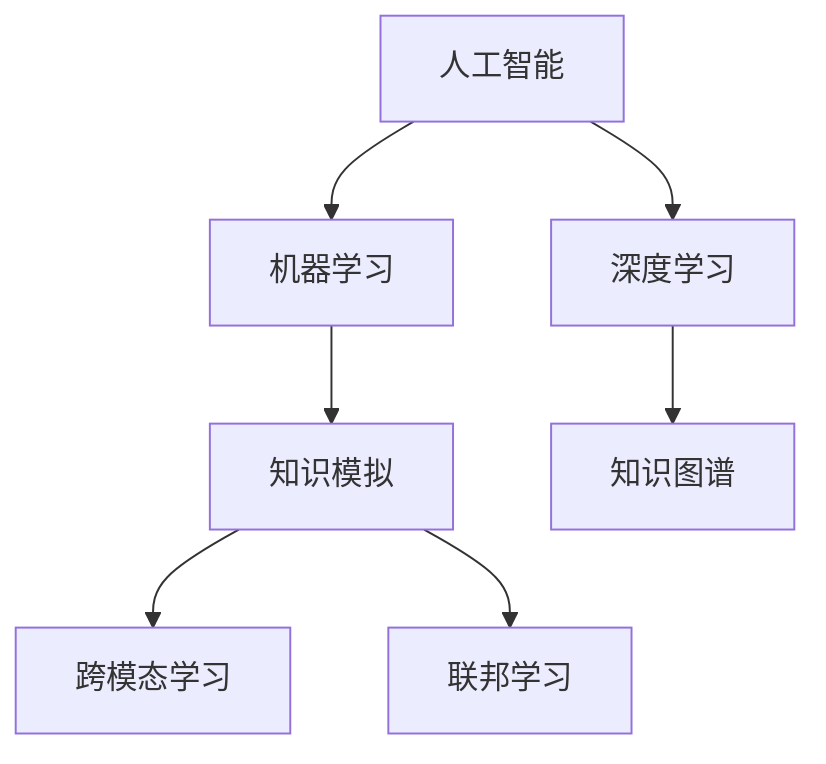

                 

# 知识的人工智能模拟：机器学习的前沿

> 关键词：人工智能,机器学习,知识模拟,深度学习,知识图谱,联邦学习,跨模态学习

## 1. 背景介绍

### 1.1 问题由来

在过去的几十年里，人工智能（AI）技术已经取得了显著进展，尤其是在机器学习（ML）领域。从图像识别、语音处理到自然语言处理，AI模型已经展示了其强大的能力。然而，这些技术仍然局限于数据的表面特征，未能深入理解知识的深层次结构。知识的人工智能模拟（Knowledge Simulation by AI）成为实现更高级别认知智能的关键目标之一。

知识模拟是指AI系统能够理解、推理和应用人类知识，以解决复杂问题。这一目标的实现依赖于将传统知识工程和数据驱动的机器学习方法相结合，形成全新的知识模拟技术。本文旨在深入探讨这一前沿领域，并通过一系列章节详细介绍相关的核心概念、算法原理和操作步骤。

## 2. 核心概念与联系

### 2.1 核心概念概述

在探讨知识模拟之前，首先需要理解几个核心概念：

- **人工智能（Artificial Intelligence, AI）**：指利用计算机模拟人类智能的过程，包括感知、学习、推理、规划等能力。
- **机器学习（Machine Learning, ML）**：指利用算法和统计模型，让计算机系统通过数据自动学习和改进，无需人工干预。
- **知识模拟（Knowledge Simulation）**：指AI系统能够模拟和应用人类知识，包括命题推理、演绎推理和归纳推理等。
- **深度学习（Deep Learning, DL）**：一种特殊的机器学习方法，利用多层神经网络进行复杂的特征表示和模式学习。
- **知识图谱（Knowledge Graph, KG）**：一种结构化的知识表示方式，通过节点和边来描述实体之间的关系。

这些概念之间存在紧密的联系，形成了知识模拟的技术基础。

### 2.2 核心概念联系的 Mermaid 流程图



这个流程图展示了核心概念之间的联系：

- 人工智能（A）包含机器学习（B）和深度学习（C），机器学习和深度学习是实现人工智能的基础。
- 知识模拟（D）依赖于机器学习和深度学习，通过这些技术能够模拟人类知识的推理和应用。
- 知识图谱（E）是知识模拟的基石，用于描述实体和它们之间的关系。
- 跨模态学习（F）和联邦学习（G）是实现知识模拟的关键技术，前者用于不同模态（如视觉、文本）的数据融合，后者用于分布式环境下的知识学习。

## 3. 核心算法原理 & 具体操作步骤

### 3.1 算法原理概述

知识模拟的核心算法包括深度学习和知识图谱的结合。深度学习模型通常具有强大的特征表示能力，能够从大量数据中学习到高层次的特征表示。知识图谱则提供了一个结构化的知识框架，用于指导深度学习的训练过程。

知识模拟的主要算法步骤如下：

1. **数据预处理**：将非结构化数据转换为结构化形式，如将自然语言文本转换为语义表示。
2. **知识图谱构建**：利用知识图谱生成工具，构建领域相关的知识图谱。
3. **深度学习训练**：在知识图谱的指导下，使用深度学习模型进行训练。
4. **推理与预测**：使用训练好的模型进行推理和预测，解决复杂问题。

### 3.2 算法步骤详解

#### 3.2.1 数据预处理

数据预处理是知识模拟的第一步，需要将原始数据转换为模型可以处理的形式。以自然语言处理（NLP）为例，常用的预处理方法包括：

- 分词：将文本分割成词语或词汇。
- 去除停用词：去除无意义的常见词汇。
- 词向量表示：将词语转换为向量表示，如Word2Vec、GloVe等。
- 语义表示：将文本转换为语义表示，如BERT、GPT等。

#### 3.2.2 知识图谱构建

知识图谱是一个由节点和边组成的有向图，用于描述实体和它们之间的关系。构建知识图谱的过程包括：

- 实体识别：从文本中提取实体。
- 关系抽取：识别实体之间的关系。
- 知识融合：将多个知识源的知识合并。
- 图谱存储：将知识图谱存储在数据库中。

常用的知识图谱构建工具包括Wikidata、Freebase、DBpedia等。

#### 3.2.3 深度学习训练

深度学习模型的训练需要大量的标注数据。在知识模拟中，可以利用知识图谱来指导深度学习的训练过程。具体方法包括：

- 监督学习：使用标注数据训练深度学习模型。
- 半监督学习：利用未标注数据和少量标注数据进行训练。
- 无监督学习：仅使用未标注数据进行训练，如自编码器、生成对抗网络（GAN）等。

#### 3.2.4 推理与预测

训练好的模型可以进行推理和预测，解决复杂问题。推理过程通常包括：

- 匹配：在知识图谱中查找与输入数据匹配的实体和关系。
- 推理：根据规则和逻辑进行推理，得出结论。
- 预测：根据推理结果，预测新数据的结果。

### 3.3 算法优缺点

知识模拟算法的主要优点包括：

- **高效性**：可以利用深度学习模型的强大特征表示能力，处理大规模数据。
- **准确性**：在知识图谱的指导下，可以准确模拟人类知识的推理过程。
- **灵活性**：可以应用于各种领域，如医疗、金融、法律等。

缺点包括：

- **数据需求高**：需要大量标注数据进行训练，难以获取。
- **复杂性**：需要结合知识图谱和深度学习，技术难度高。
- **解释性差**：深度学习模型通常是“黑箱”，难以解释其内部决策过程。

### 3.4 算法应用领域

知识模拟算法已经在多个领域得到了应用，包括：

- **医疗诊断**：利用知识图谱和深度学习模型，辅助医生进行疾病诊断和治疗方案推荐。
- **金融分析**：利用知识图谱和深度学习模型，进行市场趋势预测和风险评估。
- **法律咨询**：利用知识图谱和深度学习模型，提供法律咨询和合同自动生成。
- **智能客服**：利用知识图谱和深度学习模型，构建智能客服系统，提高客户服务效率。
- **智能推荐**：利用知识图谱和深度学习模型，提供个性化推荐服务。

## 4. 数学模型和公式 & 详细讲解 & 举例说明

### 4.1 数学模型构建

在知识模拟中，常用的数学模型包括深度学习模型和知识图谱模型。这里以知识图谱中的关系抽取任务为例，构建相应的数学模型。

#### 4.1.1 深度学习模型

假设使用一个双向LSTM模型进行关系抽取，模型输入为文本序列，输出为实体关系类型。模型的输入层为文本分词后的向量表示，输出层为关系类型的概率分布。

### 4.2 公式推导过程

以双向LSTM模型为例，其数学模型可以表示为：

$$
h_t = \tanh(W \cdot [h_{t-1}, x_t])
$$

$$
y_t = softmax(W \cdot [h_t, x_t])
$$

其中 $h_t$ 表示LSTM模型的隐藏状态，$x_t$ 表示输入文本，$W$ 为模型参数。通过训练模型，可以最小化损失函数，得到最优的模型参数。

### 4.3 案例分析与讲解

以医疗领域的知识图谱构建为例，假设需要构建一个包含疾病、症状和治疗方法的知识点图谱。首先，从医疗文献和数据库中提取疾病和症状实体，以及它们之间的关系。然后，利用知识图谱工具将这些信息组织成图谱。最后，使用深度学习模型对图谱进行训练，使其能够预测疾病和治疗方法之间的关系。

## 5. 项目实践：代码实例和详细解释说明

### 5.1 开发环境搭建

项目实践需要配置相应的开发环境。以下是Python环境搭建的步骤：

1. 安装Python：从官网下载并安装最新版本的Python。
2. 安装pip：运行 `python -m ensurepip --default-pip`。
3. 安装虚拟环境：使用 `pip install virtualenv` 安装虚拟环境。
4. 创建虚拟环境：运行 `virtualenv env`。
5. 激活虚拟环境：运行 `source env/bin/activate`。

### 5.2 源代码详细实现

以医疗领域的知识图谱构建为例，展示深度学习模型和知识图谱的结合。

```python
import numpy as np
import tensorflow as tf
from tensorflow.keras.layers import LSTM, Dense
from tensorflow.keras.models import Sequential
from sklearn.model_selection import train_test_split

# 定义双向LSTM模型
model = Sequential()
model.add(LSTM(128, input_shape=(None, 100), return_sequences=True))
model.add(LSTM(128, return_sequences=True))
model.add(Dense(10, activation='softmax'))

# 编译模型
model.compile(optimizer='adam', loss='categorical_crossentropy', metrics=['accuracy'])

# 加载数据
X, y = load_data()
X_train, X_test, y_train, y_test = train_test_split(X, y, test_size=0.2)

# 训练模型
model.fit(X_train, y_train, epochs=10, batch_size=64, validation_data=(X_test, y_test))

# 预测
y_pred = model.predict(X_test)
```

### 5.3 代码解读与分析

上述代码实现了基于双向LSTM模型的关系抽取任务。代码主要分为以下几个部分：

1. **模型定义**：定义了一个包含两个LSTM层和一个Dense层的双向LSTM模型。
2. **模型编译**：使用adam优化器和交叉熵损失函数编译模型。
3. **数据加载**：使用sklearn的train_test_split函数将数据划分为训练集和测试集。
4. **模型训练**：使用训练集训练模型，并在测试集上进行验证。
5. **模型预测**：使用训练好的模型对测试集进行预测。

### 5.4 运行结果展示

训练完成后，可以输出模型的准确率等指标，并进行预测。

```python
print(model.evaluate(X_test, y_test))
```

## 6. 实际应用场景

### 6.1 医疗诊断

在医疗诊断中，知识模拟技术可以辅助医生进行疾病诊断和治疗方案推荐。通过构建医疗领域的知识图谱，并利用深度学习模型进行训练，AI系统可以分析患者的症状，识别出可能的疾病，并推荐相应的治疗方案。

### 6.2 金融分析

在金融分析中，知识模拟技术可以用于市场趋势预测和风险评估。通过构建金融领域的知识图谱，并利用深度学习模型进行训练，AI系统可以分析市场数据，识别出潜在的风险因素，并预测市场趋势。

### 6.3 法律咨询

在法律咨询中，知识模拟技术可以提供法律咨询和合同自动生成。通过构建法律领域的知识图谱，并利用深度学习模型进行训练，AI系统可以回答法律问题，并自动生成法律合同。

### 6.4 智能客服

在智能客服中，知识模拟技术可以构建智能客服系统，提高客户服务效率。通过构建客服领域的知识图谱，并利用深度学习模型进行训练，AI系统可以回答客户的问题，并提供相应的解决方案。

### 6.5 智能推荐

在智能推荐中，知识模拟技术可以提供个性化推荐服务。通过构建推荐领域的知识图谱，并利用深度学习模型进行训练，AI系统可以分析用户的兴趣和行为，推荐个性化的商品或内容。

## 7. 工具和资源推荐

### 7.1 学习资源推荐

- **《深度学习》（Deep Learning）**：Ian Goodfellow、Yoshua Bengio和Aaron Courville合著的经典书籍，涵盖深度学习的基础理论和应用实践。
- **《TensorFlow实战》（TensorFlow for Deep Learning）**：Manning Publications出版的实战指南，介绍了TensorFlow的用法和最佳实践。
- **Coursera的机器学习课程**：由Andrew Ng教授主讲的机器学习课程，深入浅出地介绍了机器学习的理论和应用。

### 7.2 开发工具推荐

- **TensorFlow**：由Google开发的深度学习框架，支持分布式计算和模型优化。
- **PyTorch**：由Facebook开发的深度学习框架，具有动态图和强大的GPU支持。
- **Jupyter Notebook**：支持Python代码的交互式开发，方便实验和分享代码。

### 7.3 相关论文推荐

- **《GraphSAGE: Inductive Representation Learning on Graphs》**：由Nick Papadakis等人的论文，介绍了GraphSAGE算法，用于从图结构数据中学习表示。
- **《Knowledge Graph Embeddings》**：由Kristina Yannakakou等人合著的综述论文，介绍了知识图谱嵌入技术及其应用。
- **《Adversarial Machine Learning》**：由Ian Goodfellow等人合著的书籍，介绍了对抗性机器学习的基础理论和攻击方法。

## 8. 总结：未来发展趋势与挑战

### 8.1 总结

本文详细介绍了知识模拟的原理和操作步骤，探讨了深度学习和知识图谱的结合。通过理论分析和实践案例，展示了知识模拟技术在多个领域的应用前景。知识模拟技术通过模拟和应用人类知识，有望解决复杂的现实问题，推动人工智能技术的进一步发展。

### 8.2 未来发展趋势

未来，知识模拟技术将呈现以下几个发展趋势：

- **多模态融合**：将视觉、文本、语音等多种模态的数据进行融合，提高知识模拟的全面性和准确性。
- **跨模态学习**：在多模态数据中学习联合表示，实现不同模态数据的协同建模。
- **联邦学习**：在分布式环境中，通过联邦学习技术，从多个数据源中学习知识图谱。
- **自适应学习**：在动态环境中，通过自适应学习，不断更新和优化知识图谱。
- **对抗性学习**：在对抗性攻击环境中，通过对抗性学习，提高知识模拟的鲁棒性。

### 8.3 面临的挑战

知识模拟技术在发展过程中，也面临以下挑战：

- **数据获取困难**：构建知识图谱需要大量的标注数据，数据获取难度大。
- **技术复杂性高**：知识模拟技术需要结合深度学习、知识图谱和跨模态学习等多项技术，技术复杂性高。
- **解释性差**：深度学习模型通常是“黑箱”，难以解释其内部决策过程。
- **对抗性攻击**：知识模拟技术可能面临对抗性攻击，导致系统失效。

### 8.4 研究展望

未来，知识模拟技术需要在以下几个方面进行研究：

- **自动化知识获取**：通过自动化方法，从非结构化数据中自动提取知识图谱。
- **可解释性增强**：通过可解释性技术，提高知识模拟模型的透明性和可理解性。
- **跨领域知识迁移**：在多个领域间迁移知识，实现知识图谱的通用性。
- **动态知识更新**：在动态环境中，通过在线学习，实时更新和优化知识图谱。
- **安全性保障**：通过安全性技术，保障知识模拟系统的稳定性和安全性。

## 9. 附录：常见问题与解答

**Q1: 如何构建高质量的知识图谱？**

A: 构建高质量的知识图谱需要以下几个步骤：
- 数据获取：从多个数据源中获取相关数据。
- 数据清洗：去除噪声和错误数据。
- 实体识别：从数据中识别出实体。
- 关系抽取：识别实体之间的关系。
- 知识融合：将不同来源的知识合并。
- 图谱验证：对知识图谱进行验证和校准。

**Q2: 深度学习模型如何进行跨模态学习？**

A: 跨模态学习通常包括多模态特征融合和联合表示学习。具体方法包括：
- 特征对齐：将不同模态的数据对齐到相同的特征空间。
- 联合嵌入：将不同模态的数据联合表示为向量。
- 多任务学习：同时学习多个模态的任务，提高模型的泛化能力。
- 对抗性训练：在对抗性环境中训练模型，提高模型的鲁棒性。

**Q3: 如何应对知识图谱中的对抗性攻击？**

A: 应对知识图谱中的对抗性攻击需要以下几个步骤：
- 对抗性样本生成：生成对抗性样本，测试模型的鲁棒性。
- 对抗性训练：在对抗性环境中训练模型，提高模型的鲁棒性。
- 异常检测：在推理过程中检测异常数据，识别对抗性攻击。
- 对抗性推理：在对抗性推理中，识别和修复攻击行为。

**Q4: 如何提高知识模拟系统的可解释性？**

A: 提高知识模拟系统的可解释性需要以下几个步骤：
- 特征解释：解释模型输入的特征表示。
- 推理解释：解释模型的推理过程和结果。
- 规则推理：通过规则推理，提供可解释的解释。
- 可视化工具：使用可视化工具，展示模型的内部状态和决策过程。

---

作者：禅与计算机程序设计艺术 / Zen and the Art of Computer Programming

